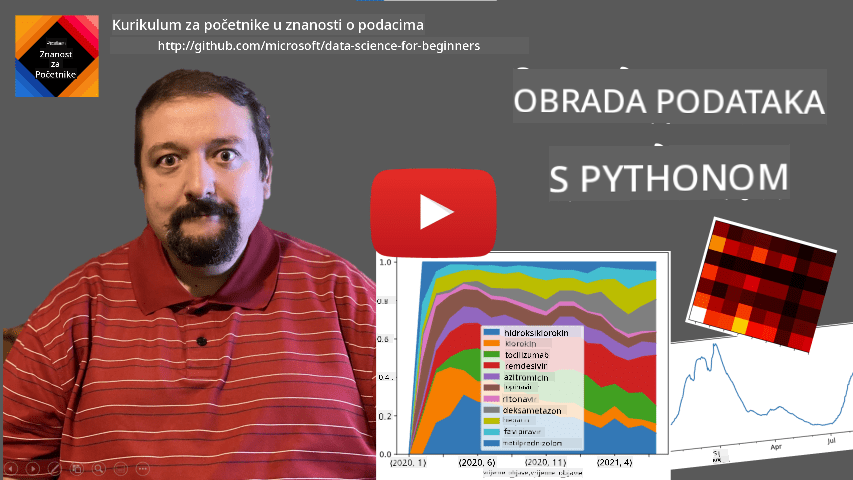
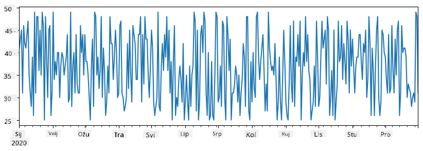
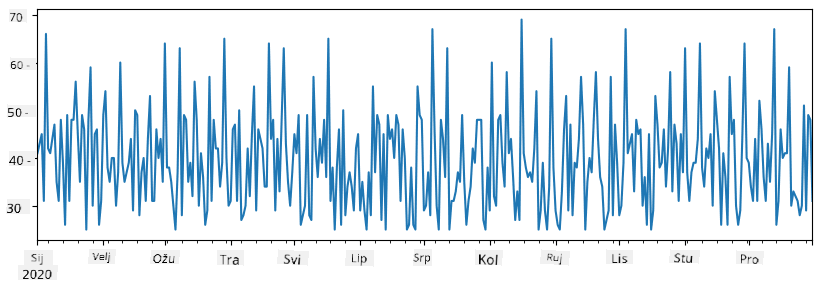
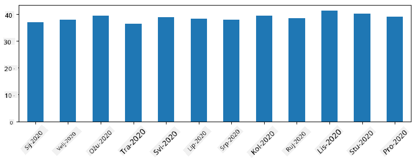
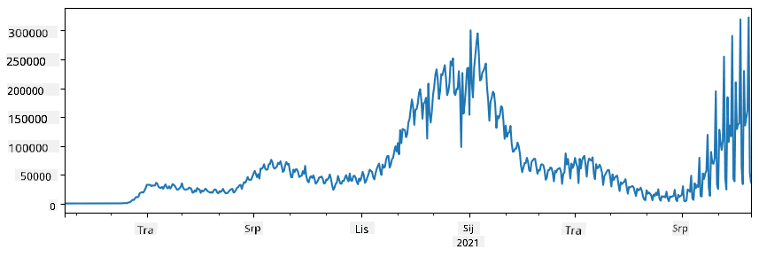
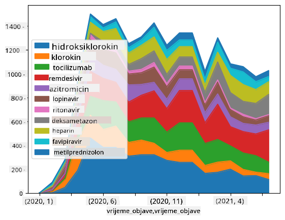

<!--
CO_OP_TRANSLATOR_METADATA:
{
  "original_hash": "116c5d361fbe812e59a73f37ce721d36",
  "translation_date": "2025-08-30T18:05:38+00:00",
  "source_file": "2-Working-With-Data/07-python/README.md",
  "language_code": "hr"
}
-->
# Rad s podacima: Python i biblioteka Pandas

|  ](../../sketchnotes/07-WorkWithPython.png) |
| :-------------------------------------------------------------------------------------------------------: |
|                 Rad s Pythonom - _Sketchnote by [@nitya](https://twitter.com/nitya)_                      |

[](https://youtu.be/dZjWOGbsN4Y)

Iako baze podataka nude vrlo efikasne načine za pohranu podataka i njihovo pretraživanje pomoću jezika za upite, najfleksibilniji način obrade podataka je pisanje vlastitog programa za manipulaciju podacima. U mnogim slučajevima, upit u bazi podataka bio bi učinkovitiji način. Međutim, u nekim slučajevima kada je potrebna složenija obrada podataka, to se ne može lako postići pomoću SQL-a.  
Obrada podataka može se programirati u bilo kojem programskom jeziku, ali postoje određeni jezici koji su na višoj razini kada je riječ o radu s podacima. Znanstvenici koji se bave podacima obično preferiraju jedan od sljedećih jezika:

* **[Python](https://www.python.org/)**, programski jezik opće namjene, koji se često smatra jednom od najboljih opcija za početnike zbog svoje jednostavnosti. Python ima mnogo dodatnih biblioteka koje vam mogu pomoći riješiti mnoge praktične probleme, poput izdvajanja podataka iz ZIP arhive ili pretvaranja slike u nijanse sive. Osim za znanost o podacima, Python se često koristi i za razvoj weba.  
* **[R](https://www.r-project.org/)** je tradicionalni alat razvijen s obzirom na statističku obradu podataka. Također sadrži veliki repozitorij biblioteka (CRAN), što ga čini dobrim izborom za obradu podataka. Međutim, R nije programski jezik opće namjene i rijetko se koristi izvan domene znanosti o podacima.  
* **[Julia](https://julialang.org/)** je još jedan jezik razvijen posebno za znanost o podacima. Namijenjen je pružanju bolje performanse od Pythona, što ga čini izvrsnim alatom za znanstvene eksperimente.

U ovoj lekciji fokusirat ćemo se na korištenje Pythona za jednostavnu obradu podataka. Pretpostavit ćemo osnovno poznavanje jezika. Ako želite dublji uvod u Python, možete se obratiti jednom od sljedećih resursa:

* [Naučite Python na zabavan način uz Turtle Graphics i fraktale](https://github.com/shwars/pycourse) - Brzi uvodni tečaj na GitHubu o programiranju u Pythonu  
* [Napravite prve korake s Pythonom](https://docs.microsoft.com/en-us/learn/paths/python-first-steps/?WT.mc_id=academic-77958-bethanycheum) - Putanja učenja na [Microsoft Learn](http://learn.microsoft.com/?WT.mc_id=academic-77958-bethanycheum)

Podaci mogu dolaziti u mnogim oblicima. U ovoj lekciji razmotrit ćemo tri oblika podataka - **tablični podaci**, **tekst** i **slike**.

Fokusirat ćemo se na nekoliko primjera obrade podataka, umjesto da pružimo potpuni pregled svih povezanih biblioteka. Ovo će vam omogućiti da steknete osnovnu ideju o tome što je moguće, te da razumijete gdje pronaći rješenja za svoje probleme kada vam zatrebaju.

> **Najkorisniji savjet**. Kada trebate izvesti određenu operaciju na podacima, a ne znate kako to učiniti, pokušajte to potražiti na internetu. [Stackoverflow](https://stackoverflow.com/) obično sadrži mnogo korisnih primjera koda u Pythonu za mnoge tipične zadatke.

## [Kviz prije predavanja](https://purple-hill-04aebfb03.1.azurestaticapps.net/quiz/12)

## Tablični podaci i DataFrame-ovi

Već ste se susreli s tabličnim podacima kada smo govorili o relacijskim bazama podataka. Kada imate puno podataka koji su sadržani u mnogim različitim povezanim tablicama, definitivno ima smisla koristiti SQL za rad s njima. Međutim, postoje mnogi slučajevi kada imamo tablicu podataka i trebamo steći neko **razumijevanje** ili **uvid** u te podatke, poput distribucije, korelacije između vrijednosti itd. U znanosti o podacima često trebamo izvesti neke transformacije izvornih podataka, nakon čega slijedi vizualizacija. Oba ta koraka mogu se lako izvesti pomoću Pythona.

Postoje dvije najkorisnije biblioteke u Pythonu koje vam mogu pomoći u radu s tabličnim podacima:
* **[Pandas](https://pandas.pydata.org/)** omogućuje manipulaciju takozvanim **DataFrame-ovima**, koji su analogni relacijskim tablicama. Možete imati imenovane stupce i izvoditi različite operacije na redovima, stupcima i DataFrame-ovima općenito.  
* **[Numpy](https://numpy.org/)** je biblioteka za rad s **tenzorima**, tj. višedimenzionalnim **poljima**. Polje ima vrijednosti istog osnovnog tipa i jednostavnije je od DataFrame-a, ali nudi više matematičkih operacija i stvara manje opterećenja.

Postoji i nekoliko drugih biblioteka koje biste trebali znati:
* **[Matplotlib](https://matplotlib.org/)** je biblioteka koja se koristi za vizualizaciju podataka i crtanje grafova  
* **[SciPy](https://www.scipy.org/)** je biblioteka s nekim dodatnim znanstvenim funkcijama. Već smo se susreli s ovom bibliotekom kada smo govorili o vjerojatnosti i statistici.

Evo dijela koda koji biste obično koristili za uvoz tih biblioteka na početku svog Python programa:  
```python
import numpy as np
import pandas as pd
import matplotlib.pyplot as plt
from scipy import ... # you need to specify exact sub-packages that you need
```

Pandas se temelji na nekoliko osnovnih koncepata.

### Series

**Series** je niz vrijednosti, sličan listi ili numpy polju. Glavna razlika je što Series također ima **indeks**, i kada radimo s Series (npr. zbrajamo ih), indeks se uzima u obzir. Indeks može biti jednostavan kao broj retka (to je zadani indeks kada se Series stvara iz liste ili polja), ili može imati složenu strukturu, poput vremenskog intervala.

> **Napomena**: U pratećoj bilježnici [`notebook.ipynb`](notebook.ipynb) nalazi se uvodni kod za Pandas. Ovdje ćemo samo navesti neke primjere, a svakako ste dobrodošli provjeriti cijelu bilježnicu.

Razmotrimo primjer: želimo analizirati prodaju u našem kiosku za sladoled. Generirat ćemo niz brojeva prodaje (broj prodanih artikala svaki dan) za određeni vremenski period:

```python
start_date = "Jan 1, 2020"
end_date = "Mar 31, 2020"
idx = pd.date_range(start_date,end_date)
print(f"Length of index is {len(idx)}")
items_sold = pd.Series(np.random.randint(25,50,size=len(idx)),index=idx)
items_sold.plot()
```


Sada pretpostavimo da svaki tjedan organiziramo zabavu za prijatelje i uzimamo dodatnih 10 paketa sladoleda za zabavu. Možemo stvoriti još jedan niz, indeksiran po tjednima, kako bismo to prikazali:  
```python
additional_items = pd.Series(10,index=pd.date_range(start_date,end_date,freq="W"))
```
Kada zbrojimo dva niza, dobit ćemo ukupni broj:  
```python
total_items = items_sold.add(additional_items,fill_value=0)
total_items.plot()
```


> **Napomena** da ne koristimo jednostavnu sintaksu `total_items+additional_items`. Da jesmo, dobili bismo mnogo `NaN` (*Not a Number*) vrijednosti u rezultirajućem nizu. To je zato što nedostaju vrijednosti za neke točke indeksa u nizu `additional_items`, a zbrajanje `NaN` s bilo čim rezultira `NaN`. Stoga trebamo specificirati parametar `fill_value` tijekom zbrajanja.

S vremenskim nizovima također možemo **ponovno uzorkovati** nizove s različitim vremenskim intervalima. Na primjer, pretpostavimo da želimo izračunati prosječni obujam prodaje mjesečno. Možemo koristiti sljedeći kod:  
```python
monthly = total_items.resample("1M").mean()
ax = monthly.plot(kind='bar')
```


### DataFrame

DataFrame je u suštini zbirka Series s istim indeksom. Možemo kombinirati nekoliko Series u jedan DataFrame:  
```python
a = pd.Series(range(1,10))
b = pd.Series(["I","like","to","play","games","and","will","not","change"],index=range(0,9))
df = pd.DataFrame([a,b])
```
Ovo će stvoriti horizontalnu tablicu poput ove:  
|     | 0   | 1    | 2   | 3   | 4      | 5   | 6      | 7    | 8    |
| --- | --- | ---- | --- | --- | ------ | --- | ------ | ---- | ---- |
| 0   | 1   | 2    | 3   | 4   | 5      | 6   | 7      | 8    | 9    |
| 1   | I   | like | to  | use | Python | and | Pandas | very | much |

Također možemo koristiti Series kao stupce i specificirati nazive stupaca pomoću rječnika:  
```python
df = pd.DataFrame({ 'A' : a, 'B' : b })
```
Ovo će nam dati tablicu poput ove:

|     | A   | B      |
| --- | --- | ------ |
| 0   | 1   | I      |
| 1   | 2   | like   |
| 2   | 3   | to     |
| 3   | 4   | use    |
| 4   | 5   | Python |
| 5   | 6   | and    |
| 6   | 7   | Pandas |
| 7   | 8   | very   |
| 8   | 9   | much   |

**Napomena** da ovu tablicu možemo dobiti i transponiranjem prethodne tablice, npr. pisanjem  
```python
df = pd.DataFrame([a,b]).T..rename(columns={ 0 : 'A', 1 : 'B' })
```
Ovdje `.T` označava operaciju transponiranja DataFrame-a, tj. zamjenu redaka i stupaca, a operacija `rename` omogućuje nam preimenovanje stupaca kako bi odgovarali prethodnom primjeru.

Evo nekoliko najvažnijih operacija koje možemo izvesti na DataFrame-ovima:

**Odabir stupaca**. Možemo odabrati pojedinačne stupce pisanjem `df['A']` - ova operacija vraća Series. Također možemo odabrati podskup stupaca u drugi DataFrame pisanjem `df[['B','A']]` - ovo vraća drugi DataFrame.

**Filtriranje** samo određenih redaka prema kriterijima. Na primjer, da bismo ostavili samo retke sa stupcem `A` većim od 5, možemo napisati `df[df['A']>5]`.

> **Napomena**: Način na koji filtriranje funkcionira je sljedeći. Izraz `df['A']<5` vraća boolean Series, koji označava je li izraz `True` ili `False` za svaki element izvornog niza `df['A']`. Kada se boolean Series koristi kao indeks, vraća podskup redaka u DataFrame-u. Stoga nije moguće koristiti proizvoljan Python boolean izraz, na primjer, pisanje `df[df['A']>5 and df['A']<7]` bilo bi pogrešno. Umjesto toga, trebali biste koristiti posebnu `&` operaciju na boolean Series, pisanjem `df[(df['A']>5) & (df['A']<7)]` (*zagrade su ovdje važne*).

**Stvaranje novih izračunatih stupaca**. Možemo lako stvoriti nove izračunate stupce za naš DataFrame koristeći intuitivne izraze poput ovog:  
```python
df['DivA'] = df['A']-df['A'].mean() 
```
Ovaj primjer izračunava odstupanje A od njegove srednje vrijednosti. Ono što se zapravo događa ovdje je da izračunavamo Series, a zatim taj Series dodjeljujemo lijevoj strani, stvarajući novi stupac. Stoga ne možemo koristiti operacije koje nisu kompatibilne sa Series, na primjer, sljedeći kod je pogrešan:  
```python
# Wrong code -> df['ADescr'] = "Low" if df['A'] < 5 else "Hi"
df['LenB'] = len(df['B']) # <- Wrong result
```
Posljednji primjer, iako sintaktički ispravan, daje pogrešan rezultat jer dodjeljuje duljinu niza `B` svim vrijednostima u stupcu, a ne duljinu pojedinačnih elemenata kako smo namjeravali.

Ako trebamo izračunati složene izraze poput ovog, možemo koristiti funkciju `apply`. Posljednji primjer može se napisati na sljedeći način:  
```python
df['LenB'] = df['B'].apply(lambda x : len(x))
# or 
df['LenB'] = df['B'].apply(len)
```

Nakon gore navedenih operacija, završit ćemo s DataFrame-om poput ovog:

|     | A   | B      | DivA | LenB |
| --- | --- | ------ | ---- | ---- |
| 0   | 1   | I      | -4.0 | 1    |
| 1   | 2   | like   | -3.0 | 4    |
| 2   | 3   | to     | -2.0 | 2    |
| 3   | 4   | use    | -1.0 | 3    |
| 4   | 5   | Python | 0.0  | 6    |
| 5   | 6   | and    | 1.0  | 3    |
| 6   | 7   | Pandas | 2.0  | 6    |
| 7   | 8   | very   | 3.0  | 4    |
| 8   | 9   | much   | 4.0  | 4    |

**Odabir redaka prema brojevima** može se izvesti pomoću konstrukta `iloc`. Na primjer, za odabir prvih 5 redaka iz DataFrame-a:  
```python
df.iloc[:5]
```

**Grupiranje** se često koristi za dobivanje rezultata sličnih *pivot tablicama* u Excelu. Pretpostavimo da želimo izračunati srednju vrijednost stupca `A` za svaki dani broj `LenB`. Tada možemo grupirati naš DataFrame prema `LenB` i pozvati `mean`:  
```python
df.groupby(by='LenB').mean()
```
Ako trebamo izračunati srednju vrijednost i broj elemenata u grupi, tada možemo koristiti složeniju funkciju `aggregate`:  
```python
df.groupby(by='LenB') \
 .aggregate({ 'DivA' : len, 'A' : lambda x: x.mean() }) \
 .rename(columns={ 'DivA' : 'Count', 'A' : 'Mean'})
```
Ovo nam daje sljedeću tablicu:

| LenB | Count | Mean     |
| ---- | ----- | -------- |
| 1    | 1     | 1.000000 |
| 2    | 1     | 3.000000 |
| 3    | 2     | 5.000000 |
| 4    | 3     | 6.333333 |
| 6    | 2     | 6.000000 |

### Dobivanje podataka
Vidjeli smo koliko je jednostavno konstruirati Series i DataFrame iz Python objekata. Međutim, podaci obično dolaze u obliku tekstualne datoteke ili Excel tablice. Srećom, Pandas nam nudi jednostavan način za učitavanje podataka s diska. Na primjer, čitanje CSV datoteke je jednostavno kao ovo:  
```python
df = pd.read_csv('file.csv')
```  
Vidjet ćemo više primjera učitavanja podataka, uključujući dohvaćanje s vanjskih web stranica, u odjeljku "Izazov".  

### Ispisivanje i Grafički Prikaz  

Data Scientist često mora istraživati podatke, stoga je važno moći ih vizualizirati. Kada je DataFrame velik, često želimo samo provjeriti radimo li sve ispravno ispisivanjem prvih nekoliko redaka. To se može učiniti pozivanjem `df.head()`. Ako ga pokrećete iz Jupyter Notebooka, ispisat će DataFrame u lijepom tabličnom obliku.  

Također smo vidjeli upotrebu funkcije `plot` za vizualizaciju nekih stupaca. Iako je `plot` vrlo koristan za mnoge zadatke i podržava mnoge različite vrste grafova putem parametra `kind=`, uvijek možete koristiti osnovnu biblioteku `matplotlib` za crtanje nečeg složenijeg. Detaljno ćemo obraditi vizualizaciju podataka u zasebnim lekcijama.  

Ovaj pregled pokriva najvažnije koncepte Pandasa, no biblioteka je vrlo bogata i nema ograničenja što možete učiniti s njom! Sada primijenimo ovo znanje za rješavanje specifičnog problema.  

## 🚀 Izazov 1: Analiza Širenja COVID-a  

Prvi problem na koji ćemo se fokusirati je modeliranje širenja epidemije COVID-19. Da bismo to učinili, koristit ćemo podatke o broju zaraženih osoba u različitim zemljama, koje pruža [Centar za sustavnu znanost i inženjering](https://systems.jhu.edu/) (CSSE) na [Sveučilištu Johns Hopkins](https://jhu.edu/). Skup podataka dostupan je u [ovom GitHub repozitoriju](https://github.com/CSSEGISandData/COVID-19).  

Budući da želimo demonstrirati kako raditi s podacima, pozivamo vas da otvorite [`notebook-covidspread.ipynb`](notebook-covidspread.ipynb) i pročitate ga od početka do kraja. Također možete izvršavati ćelije i riješiti neke izazove koje smo ostavili na kraju.  

  

> Ako ne znate kako pokrenuti kod u Jupyter Notebooku, pogledajte [ovaj članak](https://soshnikov.com/education/how-to-execute-notebooks-from-github/).  

## Rad s Nestrukturiranim Podacima  

Iako podaci vrlo često dolaze u tabličnom obliku, u nekim slučajevima moramo raditi s manje strukturiranim podacima, poput teksta ili slika. U tom slučaju, kako bismo primijenili tehnike obrade podataka koje smo vidjeli ranije, moramo nekako **izvući** strukturirane podatke. Evo nekoliko primjera:  

* Izvlačenje ključnih riječi iz teksta i praćenje koliko se često pojavljuju  
* Korištenje neuronskih mreža za izvlačenje informacija o objektima na slici  
* Dobivanje informacija o emocijama ljudi na video snimci  

## 🚀 Izazov 2: Analiza COVID Radova  

U ovom izazovu nastavljamo s temom pandemije COVID-a i fokusiramo se na obradu znanstvenih radova na tu temu. Postoji [CORD-19 Dataset](https://www.kaggle.com/allen-institute-for-ai/CORD-19-research-challenge) s više od 7000 (u trenutku pisanja) radova o COVID-u, dostupnih s metapodacima i sažecima (a za otprilike polovicu njih dostupan je i puni tekst).  

Potpuni primjer analize ovog skupa podataka koristeći [Text Analytics for Health](https://docs.microsoft.com/azure/cognitive-services/text-analytics/how-tos/text-analytics-for-health/?WT.mc_id=academic-77958-bethanycheum) kognitivnu uslugu opisan je [u ovom blog postu](https://soshnikov.com/science/analyzing-medical-papers-with-azure-and-text-analytics-for-health/). Razmotrit ćemo pojednostavljenu verziju ove analize.  

> **NOTE**: Ne pružamo kopiju skupa podataka kao dio ovog repozitorija. Možda ćete prvo trebati preuzeti datoteku [`metadata.csv`](https://www.kaggle.com/allen-institute-for-ai/CORD-19-research-challenge?select=metadata.csv) iz [ovog skupa podataka na Kaggleu](https://www.kaggle.com/allen-institute-for-ai/CORD-19-research-challenge). Može biti potrebna registracija na Kaggle. Također možete preuzeti skup podataka bez registracije [odavde](https://ai2-semanticscholar-cord-19.s3-us-west-2.amazonaws.com/historical_releases.html), ali će uključivati sve pune tekstove uz datoteku metapodataka.  

Otvorite [`notebook-papers.ipynb`](notebook-papers.ipynb) i pročitajte ga od početka do kraja. Također možete izvršavati ćelije i riješiti neke izazove koje smo ostavili na kraju.  

  

## Obrada Podataka o Slikama  

U posljednje vrijeme razvijeni su vrlo moćni AI modeli koji nam omogućuju razumijevanje slika. Postoji mnogo zadataka koji se mogu riješiti koristeći unaprijed istrenirane neuronske mreže ili cloud usluge. Neki primjeri uključuju:  

* **Klasifikaciju Slika**, koja vam može pomoći kategorizirati sliku u jednu od unaprijed definiranih klasa. Lako možete istrenirati vlastite klasifikatore slika koristeći usluge poput [Custom Vision](https://azure.microsoft.com/services/cognitive-services/custom-vision-service/?WT.mc_id=academic-77958-bethanycheum)  
* **Detekciju Objekata** za otkrivanje različitih objekata na slici. Usluge poput [computer vision](https://azure.microsoft.com/services/cognitive-services/computer-vision/?WT.mc_id=academic-77958-bethanycheum) mogu detektirati brojne uobičajene objekte, a možete istrenirati [Custom Vision](https://azure.microsoft.com/services/cognitive-services/custom-vision-service/?WT.mc_id=academic-77958-bethanycheum) model za detekciju specifičnih objekata od interesa.  
* **Detekciju Lica**, uključujući dob, spol i emocije. Ovo se može postići putem [Face API](https://azure.microsoft.com/services/cognitive-services/face/?WT.mc_id=academic-77958-bethanycheum).  

Sve te cloud usluge mogu se pozivati koristeći [Python SDK-ove](https://docs.microsoft.com/samples/azure-samples/cognitive-services-python-sdk-samples/cognitive-services-python-sdk-samples/?WT.mc_id=academic-77958-bethanycheum), i tako se lako mogu integrirati u vaš tijek istraživanja podataka.  

Evo nekoliko primjera istraživanja podataka iz izvora slika:  
* U blog postu [Kako Naučiti Data Science bez Kodiranja](https://soshnikov.com/azure/how-to-learn-data-science-without-coding/) istražujemo Instagram fotografije, pokušavajući razumjeti što ljude potiče da daju više lajkova na fotografiju. Prvo izvlačimo što je više moguće informacija iz slika koristeći [computer vision](https://azure.microsoft.com/services/cognitive-services/computer-vision/?WT.mc_id=academic-77958-bethanycheum), a zatim koristimo [Azure Machine Learning AutoML](https://docs.microsoft.com/azure/machine-learning/concept-automated-ml/?WT.mc_id=academic-77958-bethanycheum) za izradu interpretabilnog modela.  
* U [Radionici o Studijama Lica](https://github.com/CloudAdvocacy/FaceStudies) koristimo [Face API](https://azure.microsoft.com/services/cognitive-services/face/?WT.mc_id=academic-77958-bethanycheum) za izvlačenje emocija ljudi na fotografijama s događaja, kako bismo pokušali razumjeti što ljude čini sretnima.  

## Zaključak  

Bez obzira imate li već strukturirane ili nestrukturirane podatke, koristeći Python možete izvesti sve korake vezane uz obradu i razumijevanje podataka. To je vjerojatno najfleksibilniji način obrade podataka, i zato većina data scientista koristi Python kao svoj primarni alat. Učenje Pythona u dubinu vjerojatno je dobra ideja ako ste ozbiljni u vezi svog puta u data scienceu!  

## [Kviz nakon predavanja](https://purple-hill-04aebfb03.1.azurestaticapps.net/quiz/13)  

## Pregled i Samostalno Učenje  

**Knjige**  
* [Wes McKinney. Python for Data Analysis: Data Wrangling with Pandas, NumPy, and IPython](https://www.amazon.com/gp/product/1491957662)  

**Online Resursi**  
* Službeni [10 minuta do Pandasa](https://pandas.pydata.org/pandas-docs/stable/user_guide/10min.html) vodič  
* [Dokumentacija o Pandas Vizualizaciji](https://pandas.pydata.org/pandas-docs/stable/user_guide/visualization.html)  

**Učenje Pythona**  
* [Naučite Python na Zabavan Način s Turtle Grafikom i Fraktalima](https://github.com/shwars/pycourse)  
* [Napravite Prve Korake s Pythonom](https://docs.microsoft.com/learn/paths/python-first-steps/?WT.mc_id=academic-77958-bethanycheum) Put učenja na [Microsoft Learn](http://learn.microsoft.com/?WT.mc_id=academic-77958-bethanycheum)  

## Zadatak  

[Provedite detaljniju studiju podataka za gore navedene izazove](assignment.md)  

## Zasluge  

Ovu lekciju napisao je s ♥️ [Dmitry Soshnikov](http://soshnikov.com)  

---

**Odricanje od odgovornosti**:  
Ovaj dokument je preveden pomoću AI usluge za prevođenje [Co-op Translator](https://github.com/Azure/co-op-translator). Iako nastojimo osigurati točnost, imajte na umu da automatski prijevodi mogu sadržavati pogreške ili netočnosti. Izvorni dokument na izvornom jeziku treba smatrati autoritativnim izvorom. Za ključne informacije preporučuje se profesionalni prijevod od strane čovjeka. Ne preuzimamo odgovornost za bilo kakva nesporazuma ili pogrešna tumačenja koja proizlaze iz korištenja ovog prijevoda.