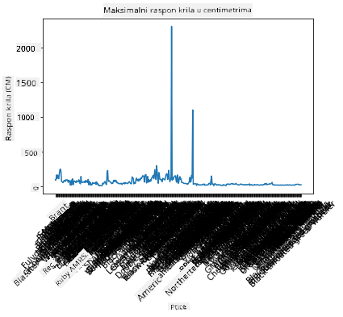
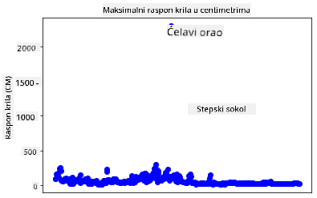
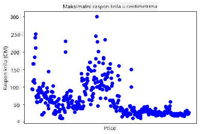
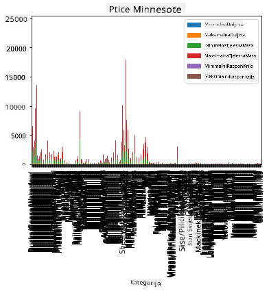
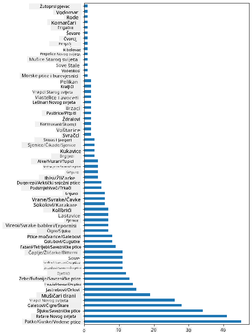
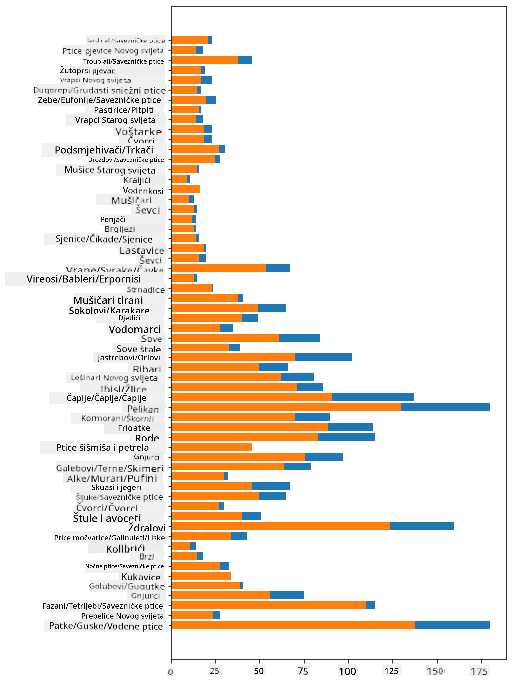

<!--
CO_OP_TRANSLATOR_METADATA:
{
  "original_hash": "43c402d9d90ae6da55d004519ada5033",
  "translation_date": "2025-08-30T19:01:02+00:00",
  "source_file": "3-Data-Visualization/09-visualization-quantities/README.md",
  "language_code": "hr"
}
-->
# Vizualizacija količina

| ](../../sketchnotes/09-Visualizing-Quantities.png)|
|:---:|
| Vizualizacija količina - _Sketchnote by [@nitya](https://twitter.com/nitya)_ |

U ovoj lekciji istražit ćete kako koristiti jednu od mnogih dostupnih Python biblioteka za stvaranje zanimljivih vizualizacija vezanih uz koncept količine. Koristeći očišćeni skup podataka o pticama Minnesote, možete naučiti mnoge zanimljive činjenice o lokalnom životinjskom svijetu.  
## [Prethodni kviz](https://purple-hill-04aebfb03.1.azurestaticapps.net/quiz/16)

## Promatranje raspona krila pomoću Matplotliba

Izvrsna biblioteka za stvaranje jednostavnih i sofisticiranih grafova i dijagrama različitih vrsta je [Matplotlib](https://matplotlib.org/stable/index.html). Općenito, proces crtanja podataka pomoću ovih biblioteka uključuje identificiranje dijelova vašeg dataframea koje želite ciljati, provođenje potrebnih transformacija na tim podacima, dodjeljivanje vrijednosti za x i y osi, odlučivanje o vrsti grafikona koji želite prikazati, te zatim prikazivanje grafikona. Matplotlib nudi veliki izbor vizualizacija, ali za ovu lekciju fokusirat ćemo se na one najprikladnije za vizualizaciju količine: linijski grafikoni, raspršeni grafikoni i stupčasti grafikoni.

> ✅ Koristite najbolji grafikon koji odgovara strukturi vaših podataka i priči koju želite ispričati.  
> - Za analizu trendova kroz vrijeme: linijski  
> - Za usporedbu vrijednosti: stupčasti, kolonski, tortni, raspršeni grafikoni  
> - Za prikaz odnosa dijelova prema cjelini: tortni  
> - Za prikaz distribucije podataka: raspršeni, stupčasti grafikoni  
> - Za prikaz trendova: linijski, kolonski  
> - Za prikaz odnosa između vrijednosti: linijski, raspršeni, mjehuričasti grafikoni  

Ako imate skup podataka i trebate otkriti koliko je određene stavke uključeno, jedan od prvih zadataka bit će inspekcija njegovih vrijednosti.  

✅ Dostupni su vrlo dobri 'cheat sheets' za Matplotlib [ovdje](https://matplotlib.org/cheatsheets/cheatsheets.pdf).

## Izradite linijski grafikon o vrijednostima raspona krila ptica

Otvorite datoteku `notebook.ipynb` u korijenu ove mape lekcije i dodajte ćeliju.

> Napomena: podaci se nalaze u korijenu ovog repozitorija u mapi `/data`.

```python
import pandas as pd
import matplotlib.pyplot as plt
birds = pd.read_csv('../../data/birds.csv')
birds.head()
```  
Ovi podaci su mješavina teksta i brojeva:

|      | Ime                          | ZnanstvenoIme          | Kategorija            | Red          | Porodica | Rod         | StatusOčuvanja     | MinDužina | MaxDužina | MinTjelesnaMasa | MaxTjelesnaMasa | MinRasponKrila | MaxRasponKrila |
| ---: | :--------------------------- | :--------------------- | :-------------------- | :----------- | :------- | :---------- | :----------------- | --------: | --------: | -------------: | -------------: | -------------: | -------------: |
|    0 | Crno-trbušni zviždukavi patak | Dendrocygna autumnalis | Patke/Guske/Vodene ptice | Anseriformes | Anatidae | Dendrocygna | LC                 |        47 |        56 |           652 |          1020 |            76 |            94 |
|    1 | Žuto-smeđi zviždukavi patak   | Dendrocygna bicolor    | Patke/Guske/Vodene ptice | Anseriformes | Anatidae | Dendrocygna | LC                 |        45 |        53 |           712 |          1050 |            85 |            93 |
|    2 | Snježna guska                 | Anser caerulescens     | Patke/Guske/Vodene ptice | Anseriformes | Anatidae | Anser       | LC                 |        64 |        79 |          2050 |          4050 |           135 |           165 |
|    3 | Rossova guska                 | Anser rossii           | Patke/Guske/Vodene ptice | Anseriformes | Anatidae | Anser       | LC                 |      57.3 |        64 |          1066 |          1567 |           113 |           116 |
|    4 | Veća bijelo-čelna guska       | Anser albifrons        | Patke/Guske/Vodene ptice | Anseriformes | Anatidae | Anser       | LC                 |        64 |        81 |          1930 |          3310 |           130 |           165 |

Započnimo s crtanjem nekih numeričkih podataka koristeći osnovni linijski grafikon. Pretpostavimo da želite vidjeti maksimalni raspon krila ovih zanimljivih ptica.

```python
wingspan = birds['MaxWingspan'] 
wingspan.plot()
```  


Što odmah primjećujete? Čini se da postoji barem jedan izniman podatak - to je prilično velik raspon krila! Raspon krila od 2300 centimetara iznosi 23 metra - postoje li Pterodaktili u Minnesoti? Istražimo.

Iako biste mogli brzo sortirati podatke u Excelu kako biste pronašli te iznimne podatke, koji su vjerojatno tipografske greške, nastavite proces vizualizacije radeći iz grafikona.

Dodajte oznake na x-os kako biste prikazali o kojim se pticama radi:

```
plt.title('Max Wingspan in Centimeters')
plt.ylabel('Wingspan (CM)')
plt.xlabel('Birds')
plt.xticks(rotation=45)
x = birds['Name'] 
y = birds['MaxWingspan']

plt.plot(x, y)

plt.show()
```  


Čak i s rotacijom oznaka postavljenom na 45 stupnjeva, previše ih je za čitanje. Pokušajmo drugačiju strategiju: označimo samo te iznimne podatke i postavimo oznake unutar grafikona. Možete koristiti raspršeni grafikon kako biste napravili više prostora za označavanje:

```python
plt.title('Max Wingspan in Centimeters')
plt.ylabel('Wingspan (CM)')
plt.tick_params(axis='both',which='both',labelbottom=False,bottom=False)

for i in range(len(birds)):
    x = birds['Name'][i]
    y = birds['MaxWingspan'][i]
    plt.plot(x, y, 'bo')
    if birds['MaxWingspan'][i] > 500:
        plt.text(x, y * (1 - 0.05), birds['Name'][i], fontsize=12)
    
plt.show()
```  
Što se ovdje događa? Koristili ste `tick_params` za skrivanje donjih oznaka, a zatim ste stvorili petlju preko vašeg skupa podataka o pticama. Crtajući grafikon s malim plavim točkama pomoću `bo`, provjerili ste ima li ptica s maksimalnim rasponom krila većim od 500 i prikazali njihovu oznaku pored točke ako je tako. Malo ste pomaknuli oznake na y osi (`y * (1 - 0.05)`) i koristili ime ptice kao oznaku.

Što ste otkrili?

  
## Filtrirajte svoje podatke

I ćelavi orao i prerijski sokol, iako vjerojatno vrlo velike ptice, čini se da su pogrešno označeni, s dodatnom `0` dodanom njihovom maksimalnom rasponu krila. Malo je vjerojatno da ćete sresti ćelavog orla s rasponom krila od 25 metara, ali ako se to dogodi, molimo vas da nas obavijestite! Stvorimo novi dataframe bez ta dva iznimna podatka:

```python
plt.title('Max Wingspan in Centimeters')
plt.ylabel('Wingspan (CM)')
plt.xlabel('Birds')
plt.tick_params(axis='both',which='both',labelbottom=False,bottom=False)
for i in range(len(birds)):
    x = birds['Name'][i]
    y = birds['MaxWingspan'][i]
    if birds['Name'][i] not in ['Bald eagle', 'Prairie falcon']:
        plt.plot(x, y, 'bo')
plt.show()
```  

Filtriranjem iznimnih podataka, vaši podaci sada su kohezivniji i razumljiviji.



Sada kada imamo čišći skup podataka barem u smislu raspona krila, istražimo više o ovim pticama.

Dok linijski i raspršeni grafikoni mogu prikazati informacije o vrijednostima podataka i njihovim distribucijama, želimo razmišljati o vrijednostima inherentnim u ovom skupu podataka. Mogli biste stvoriti vizualizacije kako biste odgovorili na sljedeća pitanja o količini:

> Koliko kategorija ptica postoji i koji su njihovi brojevi?  
> Koliko ptica je izumrlo, ugroženo, rijetko ili uobičajeno?  
> Koliko ih ima u različitim rodovima i redovima prema Linnaeusovoj terminologiji?  
## Istražite stupčaste grafikone

Stupčasti grafikoni su praktični kada trebate prikazati grupiranje podataka. Istražimo kategorije ptica koje postoje u ovom skupu podataka kako bismo vidjeli koja je najčešća po broju.

U datoteci notebook stvorite osnovni stupčasti grafikon.

✅ Napomena, možete ili filtrirati dvije iznimne ptice koje smo identificirali u prethodnom odjeljku, urediti tipografske greške u njihovom rasponu krila, ili ih ostaviti za ove vježbe koje ne ovise o vrijednostima raspona krila.

Ako želite stvoriti stupčasti grafikon, možete odabrati podatke na koje se želite fokusirati. Stupčasti grafikoni mogu se stvoriti iz sirovih podataka:

```python
birds.plot(x='Category',
        kind='bar',
        stacked=True,
        title='Birds of Minnesota')

```  


Ovaj stupčasti grafikon, međutim, nije čitljiv jer ima previše negrupiranih podataka. Trebate odabrati samo podatke koje želite prikazati, pa pogledajmo duljinu ptica na temelju njihove kategorije.

Filtrirajte svoje podatke kako biste uključili samo kategoriju ptica.

✅ Primijetite da koristite Pandas za upravljanje podacima, a zatim dopuštate Matplotlibu da obavi crtanje.

Budući da postoji mnogo kategorija, možete prikazati ovaj grafikon vertikalno i prilagoditi njegovu visinu kako bi obuhvatio sve podatke:

```python
category_count = birds.value_counts(birds['Category'].values, sort=True)
plt.rcParams['figure.figsize'] = [6, 12]
category_count.plot.barh()
```  


Ovaj stupčasti grafikon pruža dobar pregled broja ptica u svakoj kategoriji. Na prvi pogled vidite da je najveći broj ptica u ovoj regiji u kategoriji Patke/Guske/Vodene ptice. Minnesota je 'zemlja 10.000 jezera', pa to nije iznenađujuće!

✅ Isprobajte neke druge brojeve na ovom skupu podataka. Iznenađuje li vas nešto?

## Usporedba podataka

Možete isprobati različite usporedbe grupiranih podataka stvaranjem novih osi. Isprobajte usporedbu MaxDužine ptice, na temelju njezine kategorije:

```python
maxlength = birds['MaxLength']
plt.barh(y=birds['Category'], width=maxlength)
plt.rcParams['figure.figsize'] = [6, 12]
plt.show()
```  


Ništa ovdje nije iznenađujuće: kolibrići imaju najmanju MaxDužinu u usporedbi s pelikanima ili guskama. Dobro je kada podaci imaju logičan smisao!

Možete stvoriti zanimljivije vizualizacije stupčastih grafikona superponiranjem podataka. Superponirajmo Minimalnu i Maksimalnu Dužinu na određenu kategoriju ptica:

```python
minLength = birds['MinLength']
maxLength = birds['MaxLength']
category = birds['Category']

plt.barh(category, maxLength)
plt.barh(category, minLength)

plt.show()
```  
Na ovom grafikonu možete vidjeti raspon po kategoriji ptica za Minimalnu Dužinu i Maksimalnu Dužinu. Možete sigurno reći da, prema ovim podacima, što je ptica veća, veći je njezin raspon duljine. Fascinantno!



## 🚀 Izazov

Ovaj skup podataka o pticama nudi bogatstvo informacija o različitim vrstama ptica unutar određenog ekosustava. Pretražite internet i provjerite možete li pronaći druge skupove podataka o pticama. Vježbajte izradu grafikona i dijagrama o ovim pticama kako biste otkrili činjenice koje niste znali.  
## [Kviz nakon lekcije](https://purple-hill-04aebfb03.1.azurestaticapps.net/quiz/17)

## Pregled i samostalno učenje

Ova prva lekcija dala vam je neke informacije o tome kako koristiti Matplotlib za vizualizaciju količina. Istražite druge načine rada s skupovima podataka za vizualizaciju. [Plotly](https://github.com/plotly/plotly.py) je jedan od alata koji nećemo pokriti u ovim lekcijama, pa pogledajte što vam može ponuditi.  
## Zadatak

[Linije, Raspršeni grafikoni i Stupčasti grafikoni](assignment.md)

---

**Odricanje od odgovornosti**:  
Ovaj dokument je preveden pomoću AI usluge za prevođenje [Co-op Translator](https://github.com/Azure/co-op-translator). Iako nastojimo osigurati točnost, imajte na umu da automatski prijevodi mogu sadržavati pogreške ili netočnosti. Izvorni dokument na izvornom jeziku treba smatrati mjerodavnim izvorom. Za ključne informacije preporučuje se profesionalni prijevod od strane stručnjaka. Ne preuzimamo odgovornost za nesporazume ili pogrešna tumačenja koja mogu proizaći iz korištenja ovog prijevoda.