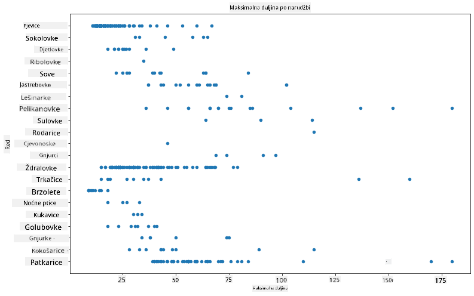
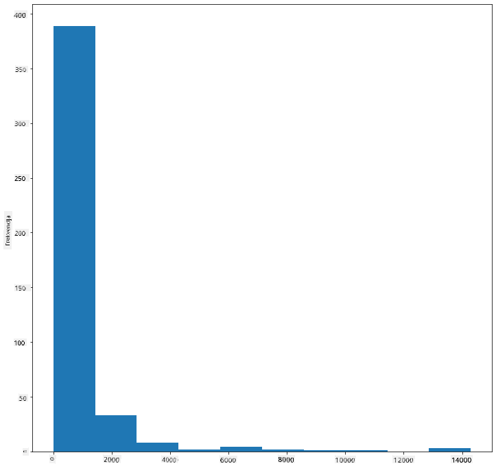
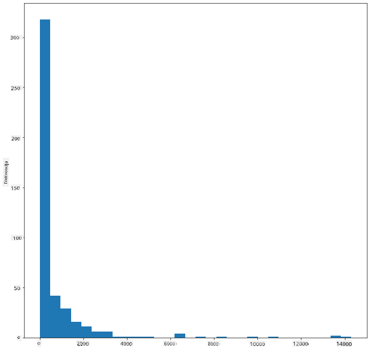
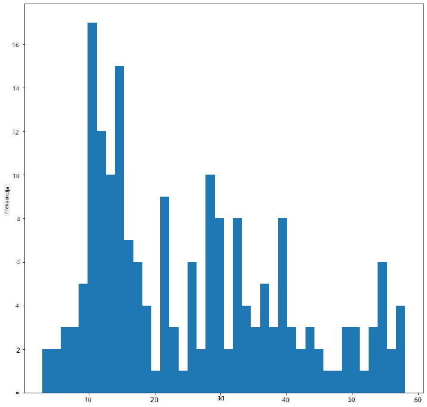
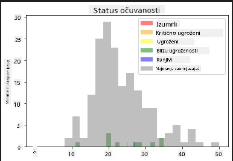
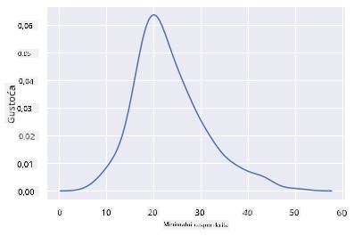
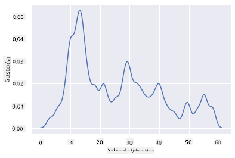
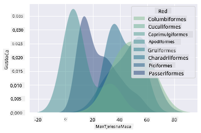
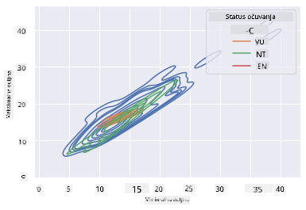

<!--
CO_OP_TRANSLATOR_METADATA:
{
  "original_hash": "87faccac113d772551486a67a607153e",
  "translation_date": "2025-08-30T19:14:38+00:00",
  "source_file": "3-Data-Visualization/10-visualization-distributions/README.md",
  "language_code": "hr"
}
-->
# Vizualizacija distribucija

| ](../../sketchnotes/10-Visualizing-Distributions.png)|
|:---:|
| Vizualizacija distribucija - _Sketchnote by [@nitya](https://twitter.com/nitya)_ |

U prethodnoj lekciji naučili ste neke zanimljive činjenice o skupu podataka o pticama Minnesote. Pronašli ste pogrešne podatke vizualizacijom odstupanja i pogledali razlike između kategorija ptica prema njihovoj maksimalnoj duljini.

## [Kviz prije predavanja](https://purple-hill-04aebfb03.1.azurestaticapps.net/quiz/18)
## Istražite skup podataka o pticama

Još jedan način za istraživanje podataka je promatranje njihove distribucije, odnosno kako su podaci organizirani duž osi. Možda, na primjer, želite saznati opću distribuciju maksimalnog raspona krila ili maksimalne tjelesne mase ptica Minnesote u ovom skupu podataka.

Otkrijmo neke činjenice o distribucijama podataka u ovom skupu podataka. U datoteci _notebook.ipynb_ koja se nalazi u korijenskoj mapi ove lekcije, uvezite Pandas, Matplotlib i svoje podatke:

```python
import pandas as pd
import matplotlib.pyplot as plt
birds = pd.read_csv('../../data/birds.csv')
birds.head()
```

|      | Ime                          | ZnanstvenoIme          | Kategorija            | Red          | Porodica | Rod         | StatusOčuvanja     | MinDuljina | MaxDuljina | MinTjelesnaMasa | MaxTjelesnaMasa | MinRasponKrila | MaxRasponKrila |
| ---: | :--------------------------- | :--------------------- | :-------------------- | :----------- | :------- | :---------- | :----------------- | --------: | --------: | ----------: | ----------: | ----------: | ----------: |
|    0 | Crno-trbušni zviždukavi patak | Dendrocygna autumnalis | Patke/Guske/Vodene ptice | Anseriformes | Anatidae | Dendrocygna | LC                 |        47 |        56 |         652 |        1020 |          76 |          94 |
|    1 | Žuto-smeđi zviždukavi patak   | Dendrocygna bicolor    | Patke/Guske/Vodene ptice | Anseriformes | Anatidae | Dendrocygna | LC                 |        45 |        53 |         712 |        1050 |          85 |          93 |
|    2 | Snježna guska                 | Anser caerulescens     | Patke/Guske/Vodene ptice | Anseriformes | Anatidae | Anser       | LC                 |        64 |        79 |        2050 |        4050 |         135 |         165 |
|    3 | Rossova guska                 | Anser rossii           | Patke/Guske/Vodene ptice | Anseriformes | Anatidae | Anser       | LC                 |      57.3 |        64 |        1066 |        1567 |         113 |         116 |
|    4 | Veća bijelo-čela guska        | Anser albifrons        | Patke/Guske/Vodene ptice | Anseriformes | Anatidae | Anser       | LC                 |        64 |        81 |        1930 |        3310 |         130 |         165 |

Općenito, možete brzo pogledati način na koji su podaci raspoređeni pomoću raspršenog grafikona, kao što smo to učinili u prethodnoj lekciji:

```python
birds.plot(kind='scatter',x='MaxLength',y='Order',figsize=(12,8))

plt.title('Max Length per Order')
plt.ylabel('Order')
plt.xlabel('Max Length')

plt.show()
```


Ovo daje pregled opće distribucije duljine tijela po redu ptica, ali nije optimalan način za prikaz stvarnih distribucija. Taj zadatak obično se obavlja stvaranjem histograma.

## Rad s histogramima

Matplotlib nudi vrlo dobre načine za vizualizaciju distribucije podataka pomoću histograma. Ova vrsta grafikona je poput stupčastog grafikona gdje se distribucija može vidjeti kroz porast i pad stupaca. Za izradu histograma potrebni su vam numerički podaci. Za izradu histograma možete nacrtati grafikon definirajući vrstu kao 'hist' za histogram. Ovaj grafikon prikazuje distribuciju MaxBodyMass za cijeli raspon numeričkih podataka u skupu podataka. Dijeljenjem niza podataka na manje binove, može prikazati distribuciju vrijednosti podataka:

```python
birds['MaxBodyMass'].plot(kind = 'hist', bins = 10, figsize = (12,12))
plt.show()
```


Kao što možete vidjeti, većina od 400+ ptica u ovom skupu podataka spada u raspon ispod 2000 za njihovu maksimalnu tjelesnu masu. Dobijte više uvida u podatke promjenom parametra `bins` na veći broj, nešto poput 30:

```python
birds['MaxBodyMass'].plot(kind = 'hist', bins = 30, figsize = (12,12))
plt.show()
```


Ovaj grafikon prikazuje distribuciju na malo detaljniji način. Grafikon manje nagnut ulijevo mogao bi se stvoriti osiguravanjem da odaberete samo podatke unutar određenog raspona:

Filtrirajte svoje podatke kako biste dobili samo one ptice čija je tjelesna masa ispod 60 i prikažite 40 `bins`:

```python
filteredBirds = birds[(birds['MaxBodyMass'] > 1) & (birds['MaxBodyMass'] < 60)]      
filteredBirds['MaxBodyMass'].plot(kind = 'hist',bins = 40,figsize = (12,12))
plt.show()     
```


✅ Isprobajte neke druge filtre i podatkovne točke. Da biste vidjeli punu distribuciju podataka, uklonite filter `['MaxBodyMass']` kako biste prikazali označene distribucije.

Histogram nudi i neke lijepe mogućnosti za boje i označavanje:

Napravite 2D histogram za usporedbu odnosa između dvije distribucije. Usporedimo `MaxBodyMass` i `MaxLength`. Matplotlib nudi ugrađeni način prikazivanja konvergencije pomoću svjetlijih boja:

```python
x = filteredBirds['MaxBodyMass']
y = filteredBirds['MaxLength']

fig, ax = plt.subplots(tight_layout=True)
hist = ax.hist2d(x, y)
```
Čini se da postoji očekivana korelacija između ovih dvaju elemenata duž očekivane osi, s jednom posebno jakom točkom konvergencije:


Histograme je po defaultu lako koristiti za numeričke podatke. Što ako trebate vidjeti distribucije prema tekstualnim podacima? 
## Istražite skup podataka za distribucije koristeći tekstualne podatke 

Ovaj skup podataka također uključuje dobre informacije o kategoriji ptica, njihovom rodu, vrsti i porodici, kao i o njihovom statusu očuvanja. Istražimo ove informacije o očuvanju. Kakva je distribucija ptica prema njihovom statusu očuvanja?

> ✅ U skupu podataka koristi se nekoliko akronima za opisivanje statusa očuvanja. Ovi akronimi dolaze iz [IUCN Red List Categories](https://www.iucnredlist.org/), organizacije koja katalogizira status vrsta.
> 
> - CR: Kritično ugrožene
> - EN: Ugrožene
> - EX: Izumrle
> - LC: Najmanje zabrinjavajuće
> - NT: Blizu ugroženosti
> - VU: Ranjive

Ovo su tekstualne vrijednosti pa ćete morati napraviti transformaciju kako biste stvorili histogram. Koristeći filtriraniBirds dataframe, prikažite njegov status očuvanja uz njegov minimalni raspon krila. Što vidite?

```python
x1 = filteredBirds.loc[filteredBirds.ConservationStatus=='EX', 'MinWingspan']
x2 = filteredBirds.loc[filteredBirds.ConservationStatus=='CR', 'MinWingspan']
x3 = filteredBirds.loc[filteredBirds.ConservationStatus=='EN', 'MinWingspan']
x4 = filteredBirds.loc[filteredBirds.ConservationStatus=='NT', 'MinWingspan']
x5 = filteredBirds.loc[filteredBirds.ConservationStatus=='VU', 'MinWingspan']
x6 = filteredBirds.loc[filteredBirds.ConservationStatus=='LC', 'MinWingspan']

kwargs = dict(alpha=0.5, bins=20)

plt.hist(x1, **kwargs, color='red', label='Extinct')
plt.hist(x2, **kwargs, color='orange', label='Critically Endangered')
plt.hist(x3, **kwargs, color='yellow', label='Endangered')
plt.hist(x4, **kwargs, color='green', label='Near Threatened')
plt.hist(x5, **kwargs, color='blue', label='Vulnerable')
plt.hist(x6, **kwargs, color='gray', label='Least Concern')

plt.gca().set(title='Conservation Status', ylabel='Min Wingspan')
plt.legend();
```



Čini se da ne postoji dobra korelacija između minimalnog raspona krila i statusa očuvanja. Testirajte druge elemente skupa podataka koristeći ovu metodu. Možete isprobati i različite filtre. Nalazite li neku korelaciju?

## Grafovi gustoće

Možda ste primijetili da su histogrami koje smo dosad gledali 'stepeni' i ne teku glatko u luku. Da biste prikazali glatkiji grafikon gustoće, možete isprobati graf gustoće.

Za rad s grafovima gustoće, upoznajte se s novom bibliotekom za crtanje, [Seaborn](https://seaborn.pydata.org/generated/seaborn.kdeplot.html). 

Učitajte Seaborn i isprobajte osnovni graf gustoće:

```python
import seaborn as sns
import matplotlib.pyplot as plt
sns.kdeplot(filteredBirds['MinWingspan'])
plt.show()
```


Možete vidjeti kako grafikon odražava prethodni za podatke o minimalnom rasponu krila; samo je malo glatkiji. Prema dokumentaciji Seaborna, "U usporedbi s histogramom, KDE može proizvesti grafikon koji je manje zagušen i lakše razumljiv, posebno kada se crtaju više distribucija. Ali ima potencijal za uvođenje distorzija ako je osnovna distribucija ograničena ili nije glatka. Kao i histogram, kvaliteta prikaza također ovisi o odabiru dobrih parametara za zaglađivanje." [izvor](https://seaborn.pydata.org/generated/seaborn.kdeplot.html) Drugim riječima, odstupanja će, kao i uvijek, loše utjecati na vaše grafikone.

Ako želite ponovno pogledati onu nazubljenu liniju MaxBodyMass u drugom grafikonu koji ste izradili, mogli biste je vrlo dobro izgladiti koristeći ovu metodu:

```python
sns.kdeplot(filteredBirds['MaxBodyMass'])
plt.show()
```


Ako želite glatku, ali ne previše glatku liniju, uredite parametar `bw_adjust`: 

```python
sns.kdeplot(filteredBirds['MaxBodyMass'], bw_adjust=.2)
plt.show()
```


✅ Pročitajte o dostupnim parametrima za ovu vrstu grafikona i eksperimentirajte!

Ova vrsta grafikona nudi prekrasno objašnjavajuće vizualizacije. S nekoliko linija koda, na primjer, možete prikazati gustoću maksimalne tjelesne mase po redu ptica:

```python
sns.kdeplot(
   data=filteredBirds, x="MaxBodyMass", hue="Order",
   fill=True, common_norm=False, palette="crest",
   alpha=.5, linewidth=0,
)
```



Također možete mapirati gustoću nekoliko varijabli na jednom grafikonu. Testirajte maksimalnu i minimalnu duljinu ptice u usporedbi s njihovim statusom očuvanja:

```python
sns.kdeplot(data=filteredBirds, x="MinLength", y="MaxLength", hue="ConservationStatus")
```



Možda vrijedi istražiti je li skupina 'Ranjivih' ptica prema njihovim duljinama značajna ili ne.

## 🚀 Izazov

Histogrami su sofisticiranija vrsta grafikona od osnovnih raspršenih grafikona, stupčastih grafikona ili linijskih grafikona. Potražite na internetu dobre primjere korištenja histograma. Kako se koriste, što pokazuju i u kojim područjima ili područjima istraživanja se obično koriste?

## [Kviz nakon predavanja](https://purple-hill-04aebfb03.1.azurestaticapps.net/quiz/19)

## Pregled i samostalno učenje

U ovoj lekciji koristili ste Matplotlib i počeli raditi sa Seabornom kako biste prikazali sofisticiranije grafikone. Istražite `kdeplot` u Seabornu, "kontinuiranu krivulju gustoće vjerojatnosti u jednoj ili više dimenzija". Pročitajte [dokumentaciju](https://seaborn.pydata.org/generated/seaborn.kdeplot.html) kako biste razumjeli kako funkcionira.

## Zadatak

[Primijenite svoje vještine](assignment.md)

---

**Odricanje od odgovornosti**:  
Ovaj dokument je preveden pomoću AI usluge za prevođenje [Co-op Translator](https://github.com/Azure/co-op-translator). Iako nastojimo osigurati točnost, imajte na umu da automatski prijevodi mogu sadržavati pogreške ili netočnosti. Izvorni dokument na izvornom jeziku treba smatrati autoritativnim izvorom. Za ključne informacije preporučuje se profesionalni prijevod od strane ljudskog prevoditelja. Ne preuzimamo odgovornost za bilo kakve nesporazume ili pogrešne interpretacije koje proizlaze iz korištenja ovog prijevoda.