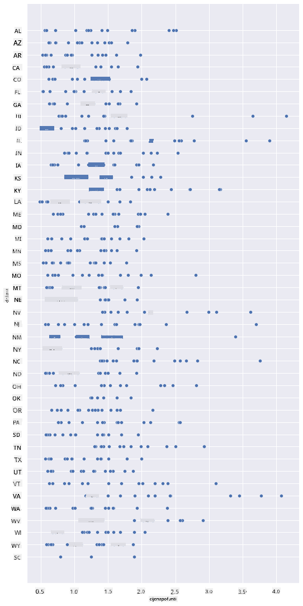
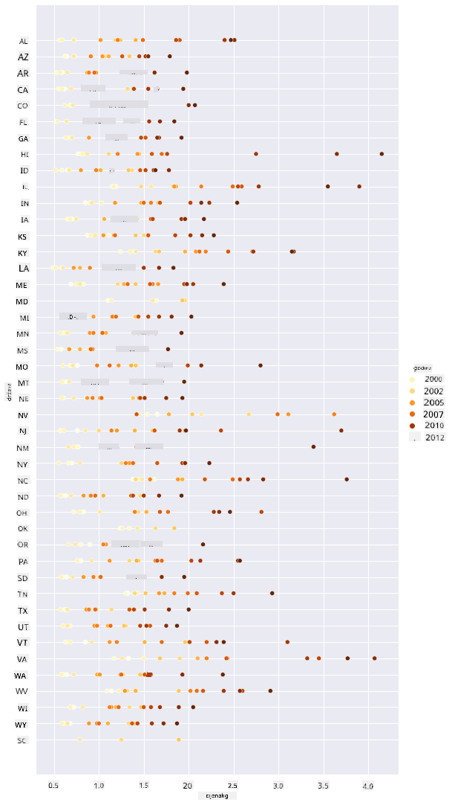
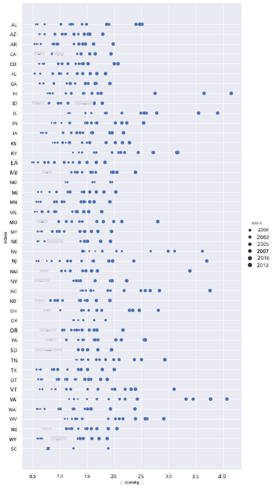
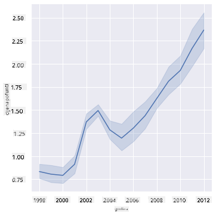
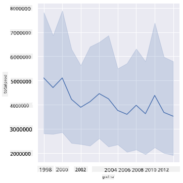
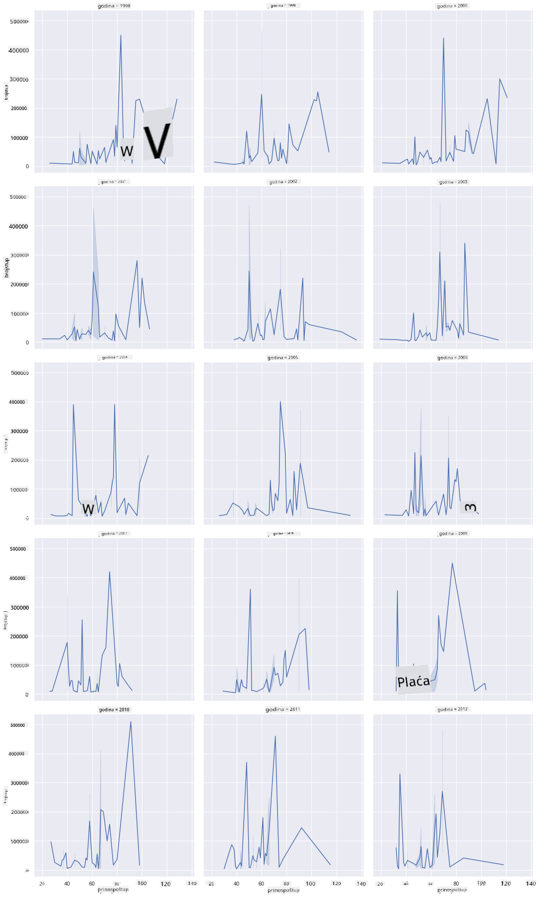
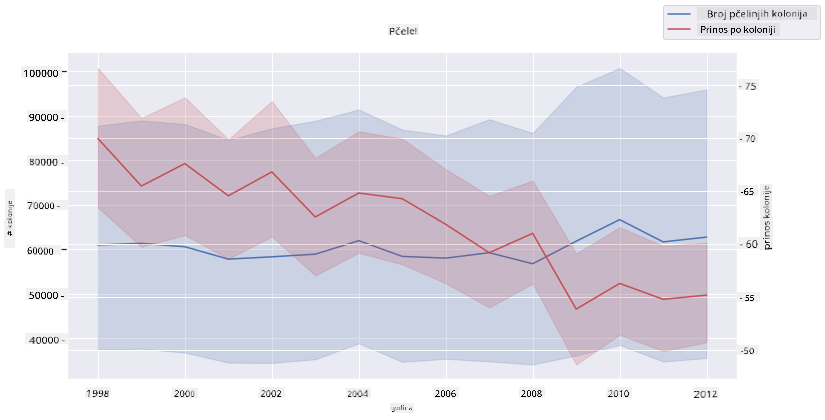

<!--
CO_OP_TRANSLATOR_METADATA:
{
  "original_hash": "cad419b574d5c35eaa417e9abfdcb0c8",
  "translation_date": "2025-08-30T19:10:50+00:00",
  "source_file": "3-Data-Visualization/12-visualization-relationships/README.md",
  "language_code": "hr"
}
-->
# Vizualizacija odnosa: Sve o medu 🍯

| ](../../sketchnotes/12-Visualizing-Relationships.png)|
|:---:|
|Vizualizacija odnosa - _Sketchnote by [@nitya](https://twitter.com/nitya)_ |

Nastavljajući s prirodnim fokusom našeg istraživanja, otkrijmo zanimljive vizualizacije koje prikazuju odnose između različitih vrsta meda, prema skupu podataka dobivenom od [Ministarstva poljoprivrede Sjedinjenih Američkih Država](https://www.nass.usda.gov/About_NASS/index.php).

Ovaj skup podataka, koji sadrži oko 600 stavki, prikazuje proizvodnju meda u mnogim američkim saveznim državama. Na primjer, možete pogledati broj kolonija, prinos po koloniji, ukupnu proizvodnju, zalihe, cijenu po funti i vrijednost proizvedenog meda u određenoj državi od 1998. do 2012., s jednim redom po godini za svaku državu.

Bit će zanimljivo vizualizirati odnos između proizvodnje određene države po godini i, na primjer, cijene meda u toj državi. Alternativno, mogli biste vizualizirati odnos između prinosa meda po koloniji u različitim državama. Ovo vremensko razdoblje obuhvaća razarajući 'CCD' ili 'Colony Collapse Disorder', prvi put zabilježen 2006. (http://npic.orst.edu/envir/ccd.html), što čini ovaj skup podataka značajnim za proučavanje. 🐝

## [Kviz prije predavanja](https://purple-hill-04aebfb03.1.azurestaticapps.net/quiz/22)

U ovoj lekciji možete koristiti Seaborn, koji ste već koristili, kao dobru biblioteku za vizualizaciju odnosa između varijabli. Posebno je zanimljiva upotreba Seabornove funkcije `relplot`, koja omogućuje scatter plotove i line plotove za brzu vizualizaciju '[statističkih odnosa](https://seaborn.pydata.org/tutorial/relational.html?highlight=relationships)', što omogućuje data znanstveniku bolje razumijevanje kako se varijable međusobno odnose.

## Scatterplotovi

Koristite scatterplot za prikaz kako se cijena meda razvijala iz godine u godinu, po državama. Seaborn, koristeći `relplot`, praktično grupira podatke po državama i prikazuje točke podataka za kategorijske i numeričke podatke.

Započnimo s uvozom podataka i Seaborna:

```python
import pandas as pd
import matplotlib.pyplot as plt
import seaborn as sns
honey = pd.read_csv('../../data/honey.csv')
honey.head()
```
Primijetit ćete da podaci o medu imaju nekoliko zanimljivih stupaca, uključujući godinu i cijenu po funti. Istražimo ove podatke, grupirane po američkim državama:

| država | brojkol | prinospokol | ukupnaprod | zalihe   | cijenapofunti | vrijednostprod | godina |
| ------ | --------| ----------- | ---------- | -------- | ------------- | -------------- | ------ |
| AL     | 16000   | 71          | 1136000    | 159000   | 0.72          | 818000         | 1998   |
| AZ     | 55000   | 60          | 3300000    | 1485000  | 0.64          | 2112000        | 1998   |
| AR     | 53000   | 65          | 3445000    | 1688000  | 0.59          | 2033000        | 1998   |
| CA     | 450000  | 83          | 37350000   | 12326000 | 0.62          | 23157000       | 1998   |
| CO     | 27000   | 72          | 1944000    | 1594000  | 0.7           | 1361000        | 1998   |

Napravite osnovni scatterplot za prikaz odnosa između cijene po funti meda i države podrijetla. Napravite `y` os dovoljno visokom da prikaže sve države:

```python
sns.relplot(x="priceperlb", y="state", data=honey, height=15, aspect=.5);
```


Sada prikažite iste podatke s medenom shemom boja kako biste pokazali kako se cijena razvija tijekom godina. To možete učiniti dodavanjem parametra 'hue' za prikaz promjena iz godine u godinu:

> ✅ Saznajte više o [paletama boja koje možete koristiti u Seabornu](https://seaborn.pydata.org/tutorial/color_palettes.html) - isprobajte prekrasnu shemu boja duginih boja!

```python
sns.relplot(x="priceperlb", y="state", hue="year", palette="YlOrBr", data=honey, height=15, aspect=.5);
```


S ovom promjenom sheme boja možete vidjeti da postoji očigledan snažan napredak tijekom godina u smislu cijene meda po funti. Doista, ako pogledate uzorak podataka za provjeru (odaberite određenu državu, na primjer Arizonu), možete vidjeti obrazac povećanja cijene iz godine u godinu, uz nekoliko iznimaka:

| država | brojkol | prinospokol | ukupnaprod | zalihe  | cijenapofunti | vrijednostprod | godina |
| ------ | --------| ----------- | ---------- | ------- | ------------- | -------------- | ------ |
| AZ     | 55000   | 60          | 3300000    | 1485000 | 0.64          | 2112000        | 1998   |
| AZ     | 52000   | 62          | 3224000    | 1548000 | 0.62          | 1999000        | 1999   |
| AZ     | 40000   | 59          | 2360000    | 1322000 | 0.73          | 1723000        | 2000   |
| AZ     | 43000   | 59          | 2537000    | 1142000 | 0.72          | 1827000        | 2001   |
| AZ     | 38000   | 63          | 2394000    | 1197000 | 1.08          | 2586000        | 2002   |
| AZ     | 35000   | 72          | 2520000    | 983000  | 1.34          | 3377000        | 2003   |
| AZ     | 32000   | 55          | 1760000    | 774000  | 1.11          | 1954000        | 2004   |
| AZ     | 36000   | 50          | 1800000    | 720000  | 1.04          | 1872000        | 2005   |
| AZ     | 30000   | 65          | 1950000    | 839000  | 0.91          | 1775000        | 2006   |
| AZ     | 30000   | 64          | 1920000    | 902000  | 1.26          | 2419000        | 2007   |
| AZ     | 25000   | 64          | 1600000    | 336000  | 1.26          | 2016000        | 2008   |
| AZ     | 20000   | 52          | 1040000    | 562000  | 1.45          | 1508000        | 2009   |
| AZ     | 24000   | 77          | 1848000    | 665000  | 1.52          | 2809000        | 2010   |
| AZ     | 23000   | 53          | 1219000    | 427000  | 1.55          | 1889000        | 2011   |
| AZ     | 22000   | 46          | 1012000    | 253000  | 1.79          | 1811000        | 2012   |

Drugi način vizualizacije ovog napretka je korištenje veličine umjesto boje. Za korisnike s poteškoćama u razlikovanju boja, ovo bi mogla biti bolja opcija. Uredite svoju vizualizaciju kako biste prikazali povećanje cijene povećanjem opsega točaka:

```python
sns.relplot(x="priceperlb", y="state", size="year", data=honey, height=15, aspect=.5);
```
Možete vidjeti kako se veličina točaka postupno povećava.



Je li ovo jednostavan slučaj ponude i potražnje? Zbog faktora poput klimatskih promjena i kolapsa kolonija, je li dostupno manje meda za kupnju iz godine u godinu, pa se cijena povećava?

Kako biste otkrili korelaciju između nekih varijabli u ovom skupu podataka, istražimo neke linijske grafikone.

## Linijski grafikoni

Pitanje: Postoji li jasan porast cijene meda po funti iz godine u godinu? To možete najlakše otkriti stvaranjem jednog linijskog grafikona:

```python
sns.relplot(x="year", y="priceperlb", kind="line", data=honey);
```
Odgovor: Da, uz neke iznimke oko 2003. godine:



✅ Budući da Seaborn agregira podatke oko jedne linije, prikazuje "višestruka mjerenja za svaku vrijednost x tako što crta srednju vrijednost i 95% interval pouzdanosti oko srednje vrijednosti". [Izvor](https://seaborn.pydata.org/tutorial/relational.html). Ovo vremenski zahtjevno ponašanje može se onemogućiti dodavanjem `ci=None`.

Pitanje: Pa, možemo li također vidjeti porast u opskrbi medom oko 2003. godine? Što ako pogledate ukupnu proizvodnju iz godine u godinu?

```python
sns.relplot(x="year", y="totalprod", kind="line", data=honey);
```



Odgovor: Ne baš. Ako pogledate ukupnu proizvodnju, zapravo se čini da je povećana u toj godini, iako općenito gledano količina proizvedenog meda opada tijekom ovih godina.

Pitanje: U tom slučaju, što je moglo uzrokovati taj skok u cijeni meda oko 2003. godine?

Kako biste to otkrili, možete istražiti facet grid.

## Facet gridovi

Facet gridovi uzimaju jedan aspekt vašeg skupa podataka (u našem slučaju, možete odabrati 'godinu' kako biste izbjegli previše proizvedenih faceta). Seaborn tada može napraviti grafikon za svaki od tih aspekata vaših odabranih x i y koordinata za lakšu vizualnu usporedbu. Ističe li se 2003. godina u ovoj vrsti usporedbe?

Napravite facet grid koristeći `relplot` kako je preporučeno u [Seabornovoj dokumentaciji](https://seaborn.pydata.org/generated/seaborn.FacetGrid.html?highlight=facetgrid#seaborn.FacetGrid).

```python
sns.relplot(
    data=honey, 
    x="yieldpercol", y="numcol",
    col="year", 
    col_wrap=3,
    kind="line"
```
U ovoj vizualizaciji možete usporediti prinos po koloniji i broj kolonija iz godine u godinu, jedno uz drugo, s postavkom wrap na 3 za stupce:



Za ovaj skup podataka, ništa posebno ne ističe se u vezi s brojem kolonija i njihovim prinosom iz godine u godinu i država po država. Postoji li drugačiji način za pronalaženje korelacije između ove dvije varijable?

## Dvostruki linijski grafikoni

Isprobajte višelinijski grafikon superponiranjem dva linijska grafikona jedan na drugi, koristeći Seabornov 'despine' za uklanjanje njihovih gornjih i desnih rubova, i koristeći `ax.twinx` [preuzet iz Matplotliba](https://matplotlib.org/stable/api/_as_gen/matplotlib.axes.Axes.twinx.html). Twinx omogućuje grafikonu dijeljenje x osi i prikazivanje dvije y osi. Dakle, prikažite prinos po koloniji i broj kolonija, superponirano:

```python
fig, ax = plt.subplots(figsize=(12,6))
lineplot = sns.lineplot(x=honey['year'], y=honey['numcol'], data=honey, 
                        label = 'Number of bee colonies', legend=False)
sns.despine()
plt.ylabel('# colonies')
plt.title('Honey Production Year over Year');

ax2 = ax.twinx()
lineplot2 = sns.lineplot(x=honey['year'], y=honey['yieldpercol'], ax=ax2, color="r", 
                         label ='Yield per colony', legend=False) 
sns.despine(right=False)
plt.ylabel('colony yield')
ax.figure.legend();
```


Iako ništa ne iskače oko 2003. godine, ovo nam omogućuje da završimo ovu lekciju na malo sretnijoj noti: iako je ukupno broj kolonija u opadanju, broj kolonija se stabilizira čak i ako njihov prinos po koloniji opada.

Naprijed, pčele, naprijed!

🐝❤️
## 🚀 Izazov

U ovoj lekciji naučili ste nešto više o drugim upotrebama scatterplotova i line gridova, uključujući facet gridove. Izazovite se da napravite facet grid koristeći neki drugi skup podataka, možda onaj koji ste koristili prije ovih lekcija. Primijetite koliko dugo traje njihovo stvaranje i kako morate biti oprezni s brojem gridova koje trebate nacrtati koristeći ove tehnike.
## [Kviz nakon predavanja](https://purple-hill-04aebfb03.1.azurestaticapps.net/quiz/23)

## Pregled i samostalno učenje

Linijski grafikoni mogu biti jednostavni ili prilično složeni. Malo istražite [Seaborn dokumentaciju](https://seaborn.pydata.org/generated/seaborn.lineplot.html) o raznim načinima na koje ih možete izgraditi. Pokušajte poboljšati linijske grafikone koje ste izradili u ovoj lekciji koristeći druge metode navedene u dokumentaciji.
## Zadatak

[Zaronite u košnicu](assignment.md)

---

**Odricanje od odgovornosti**:  
Ovaj dokument je preveden pomoću AI usluge za prevođenje [Co-op Translator](https://github.com/Azure/co-op-translator). Iako nastojimo osigurati točnost, imajte na umu da automatski prijevodi mogu sadržavati pogreške ili netočnosti. Izvorni dokument na izvornom jeziku treba smatrati mjerodavnim izvorom. Za ključne informacije preporučuje se profesionalni prijevod od strane stručnjaka. Ne preuzimamo odgovornost za nesporazume ili pogrešna tumačenja koja mogu proizaći iz korištenja ovog prijevoda.