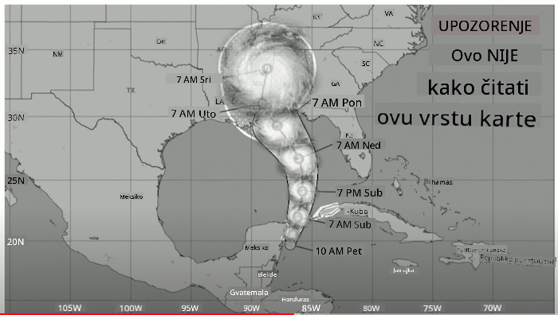
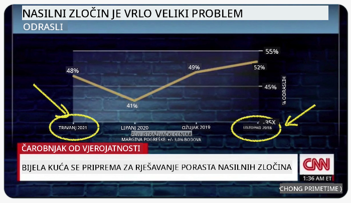
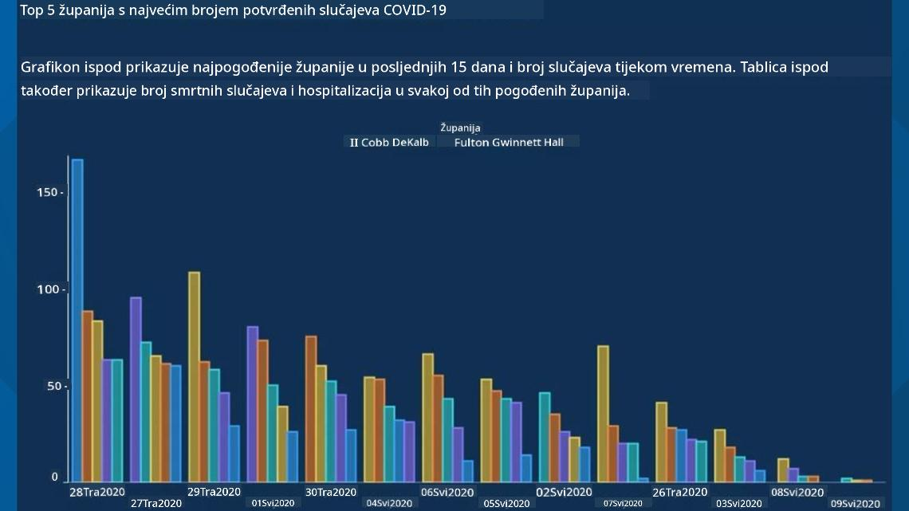
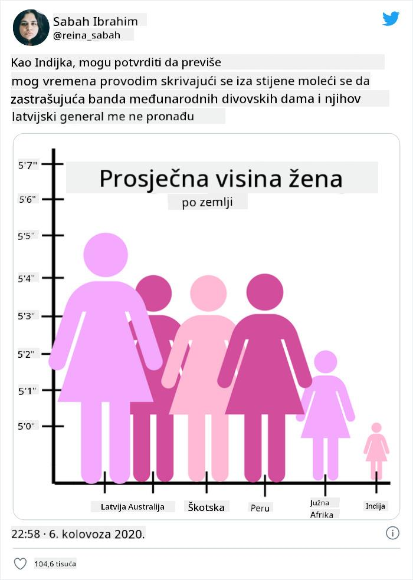
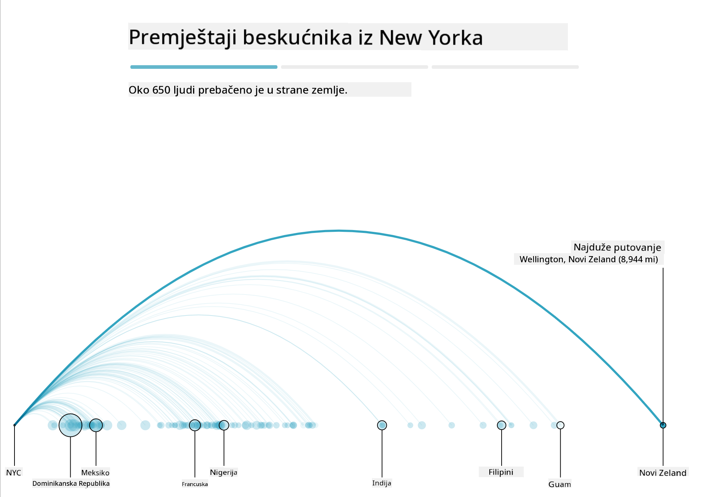
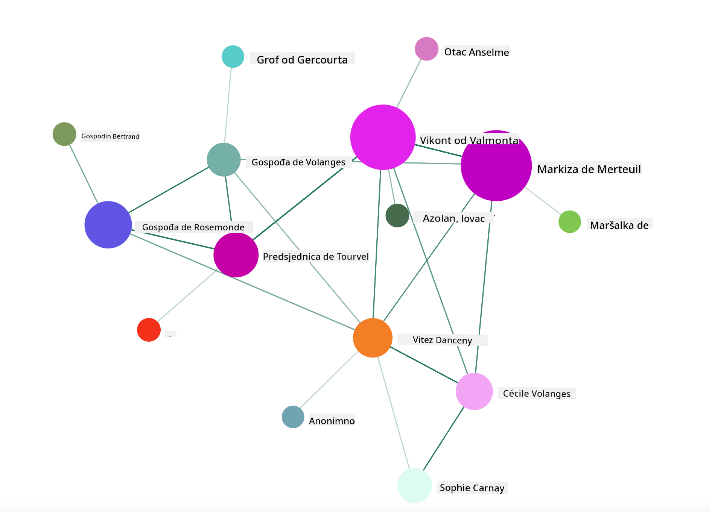

<!--
CO_OP_TRANSLATOR_METADATA:
{
  "original_hash": "4ec4747a9f4f7d194248ea29903ae165",
  "translation_date": "2025-08-30T19:05:38+00:00",
  "source_file": "3-Data-Visualization/13-meaningful-visualizations/README.md",
  "language_code": "hr"
}
-->
# Izrada Smislenih Vizualizacija

| ](../../sketchnotes/13-MeaningfulViz.png)|
|:---:|
| Smislene Vizualizacije - _Sketchnote autor [@nitya](https://twitter.com/nitya)_ |

> "Ako dovoljno dugo mučite podatke, priznat će bilo što" -- [Ronald Coase](https://en.wikiquote.org/wiki/Ronald_Coase)

Jedna od osnovnih vještina podatkovnog znanstvenika je sposobnost stvaranja smislene vizualizacije podataka koja pomaže odgovoriti na postavljena pitanja. Prije nego što vizualizirate svoje podatke, morate osigurati da su očišćeni i pripremljeni, kao što ste to radili u prethodnim lekcijama. Nakon toga možete početi odlučivati kako najbolje predstaviti podatke.

U ovoj lekciji pregledat ćete:

1. Kako odabrati pravi tip grafikona
2. Kako izbjeći obmanjujuće grafikone
3. Kako raditi s bojama
4. Kako stilizirati grafikone za čitljivost
5. Kako izraditi animirane ili 3D grafičke prikaze
6. Kako izraditi kreativnu vizualizaciju

## [Kviz prije predavanja](https://purple-hill-04aebfb03.1.azurestaticapps.net/quiz/24)

## Odaberite pravi tip grafikona

U prethodnim lekcijama eksperimentirali ste s izradom raznih zanimljivih vizualizacija podataka koristeći Matplotlib i Seaborn za izradu grafikona. Općenito, možete odabrati [pravi tip grafikona](https://chartio.com/learn/charts/how-to-select-a-data-vizualization/) za pitanje koje postavljate koristeći ovu tablicu:

| Trebate:                   | Trebali biste koristiti:        |
| -------------------------- | ------------------------------- |
| Prikazati trendove kroz vrijeme | Linijski grafikon              |
| Usporediti kategorije       | Stupčasti, Tortni               |
| Usporediti ukupne vrijednosti | Tortni, Složeni stupčasti      |
| Prikazati odnose            | Raspršeni, Linijski, Facet, Dvostruki linijski |
| Prikazati distribucije      | Raspršeni, Histogram, Box       |
| Prikazati proporcije        | Tortni, Prstenasti, Waffle      |

> ✅ Ovisno o strukturi vaših podataka, možda ćete ih trebati pretvoriti iz teksta u numeričke vrijednosti kako bi grafikon podržao prikaz.

## Izbjegnite obmanu

Čak i ako podatkovni znanstvenik pažljivo odabere pravi grafikon za prave podatke, postoji mnogo načina na koje se podaci mogu prikazati kako bi se dokazala određena točka, često na štetu samih podataka. Postoji mnogo primjera obmanjujućih grafikona i infografika!

[](https://www.youtube.com/watch?v=oX74Nge8Wkw "Kako grafikoni lažu")

> 🎥 Kliknite na sliku iznad za konferencijsko predavanje o obmanjujućim grafikonima

Ovaj grafikon obrće X os kako bi prikazao suprotnost istini, temeljem datuma:



[Ovaj grafikon](https://media.firstcoastnews.com/assets/WTLV/images/170ae16f-4643-438f-b689-50d66ca6a8d8/170ae16f-4643-438f-b689-50d66ca6a8d8_1140x641.jpg) još je obmanjujući jer oko prati desnu stranu i zaključuje da su slučajevi COVID-a opali tijekom vremena u raznim okruzima. Međutim, ako pažljivo pogledate datume, otkrit ćete da su preuređeni kako bi se stvorio obmanjujući trend pada.



Ovaj zloglasni primjer koristi boju I obrnutu Y os kako bi obmanuo: umjesto zaključka da su smrtni slučajevi od vatrenog oružja porasli nakon donošenja zakona koji pogoduje oružju, oko je zavarano da misli suprotno:


Ovaj neobičan grafikon pokazuje kako se proporcije mogu manipulirati, na smiješan način:



Uspoređivanje neusporedivog još je jedan sumnjiv trik. Postoji [sjajna web stranica](https://tylervigen.com/spurious-correlations) posvećena 'lažnim korelacijama' koja prikazuje 'činjenice' koje povezuju, primjerice, stopu razvoda u Maineu i potrošnju margarina. Reddit grupa također prikuplja [ružne primjere](https://www.reddit.com/r/dataisugly/top/?t=all) korištenja podataka.

Važno je razumjeti koliko lako oko može biti zavarano obmanjujućim grafikonima. Čak i ako je namjera podatkovnog znanstvenika dobra, odabir lošeg tipa grafikona, poput tortnog grafikona s previše kategorija, može biti obmanjujući.

## Boje

Vidjeli ste u grafikonu 'Florida gun violence' kako boja može dodati dodatni sloj značenja grafikonima, posebno onima koji nisu dizajnirani pomoću biblioteka poput Matplotlib i Seaborn koje dolaze s raznim provjerenim bibliotekama boja i paletama. Ako izrađujete grafikon ručno, proučite malo [teoriju boja](https://colormatters.com/color-and-design/basic-color-theory).

> ✅ Budite svjesni, prilikom dizajniranja grafikona, da je pristupačnost važan aspekt vizualizacije. Neki od vaših korisnika mogu biti daltonisti - prikazuje li vaš grafikon dobro podatke za korisnike s oštećenjima vida?

Budite oprezni pri odabiru boja za svoj grafikon, jer boja može prenijeti značenje koje možda niste namjeravali. 'Ružičaste dame' u grafikonu 'visina' iznad prenose izrazito 'žensko' značenje koje dodatno doprinosi bizarnosti samog grafikona.

Iako [značenje boja](https://colormatters.com/color-symbolism/the-meanings-of-colors) može biti različito u različitim dijelovima svijeta i obično se mijenja ovisno o nijansi, općenito značenja boja uključuju:

| Boja   | Značenje            |
| ------ | ------------------- |
| crvena | moć                |
| plava  | povjerenje, lojalnost |
| žuta   | sreća, oprez        |
| zelena | ekologija, sreća, zavist |
| ljubičasta | sreća            |
| narančasta | živahnost        |

Ako trebate izraditi grafikon s prilagođenim bojama, osigurajte da su vaši grafikoni i pristupačni i da boja koju odaberete odgovara značenju koje želite prenijeti.

## Stiliziranje grafikona za čitljivost

Grafikoni nisu smisleni ako nisu čitljivi! Odvojite trenutak da razmislite o stiliziranju širine i visine svog grafikona kako bi se dobro prilagodili vašim podacima. Ako je potrebno prikazati jednu varijablu (poput svih 50 država), prikažite ih vertikalno na Y osi ako je moguće kako biste izbjegli horizontalno pomicanje grafikona.

Označite svoje osi, osigurajte legendu ako je potrebno i ponudite alate za bolju interpretaciju podataka.

Ako su vaši podaci tekstualni i opširni na X osi, možete zakrenuti tekst radi bolje čitljivosti. [Matplotlib](https://matplotlib.org/stable/tutorials/toolkits/mplot3d.html) nudi 3D grafičko prikazivanje, ako vaši podaci to podržavaju. Sofisticirane vizualizacije podataka mogu se izraditi pomoću `mpl_toolkits.mplot3d`.


## Animacija i 3D prikaz grafikona

Neke od najboljih vizualizacija podataka danas su animirane. Shirley Wu ima nevjerojatne primjere izrađene pomoću D3, poput '[film flowers](http://bl.ocks.org/sxywu/raw/d612c6c653fb8b4d7ff3d422be164a5d/)', gdje svaki cvijet predstavlja vizualizaciju filma. Drugi primjer za Guardian je 'bussed out', interaktivno iskustvo koje kombinira vizualizacije s Greensockom i D3 te formatom članka za prikaz kako NYC rješava problem beskućnika premještanjem ljudi izvan grada.



> "Bussed Out: Kako Amerika premješta svoje beskućnike" iz [Guardiana](https://www.theguardian.com/us-news/ng-interactive/2017/dec/20/bussed-out-america-moves-homeless-people-country-study). Vizualizacije autorice Nadieh Bremer & Shirley Wu

Iako ova lekcija nije dovoljno opsežna da bi vas naučila ovim moćnim bibliotekama za vizualizaciju, okušajte se u D3 u Vue.js aplikaciji koristeći biblioteku za prikaz vizualizacije knjige "Opasne veze" kao animirane društvene mreže.

> "Les Liaisons Dangereuses" je epistolarni roman, odnosno roman predstavljen kao niz pisama. Napisao ga je 1782. godine Choderlos de Laclos, a priča govori o zlobnim, moralno bankrotiranim društvenim manevrima dvoje suparnika iz francuskog plemstva kasnog 18. stoljeća, vikonta de Valmonta i markize de Merteuil. Oboje na kraju doživljavaju propast, ali ne prije nego što nanesu veliku društvenu štetu. Roman se odvija kao niz pisama napisanih raznim osobama iz njihovih krugova, planirajući osvetu ili jednostavno stvarajući probleme. Izradite vizualizaciju ovih pisama kako biste otkrili glavne aktere priče, vizualno.

Dovršit ćete web aplikaciju koja će prikazati animirani prikaz ove društvene mreže. Koristi biblioteku koja je izrađena za stvaranje [vizualizacije mreže](https://github.com/emiliorizzo/vue-d3-network) koristeći Vue.js i D3. Kada aplikacija radi, možete povlačiti čvorove po ekranu kako biste premještali podatke.



## Projekt: Izradite grafikon za prikaz mreže koristeći D3.js

> Ova mapa lekcije uključuje mapu `solution` gdje možete pronaći dovršeni projekt za referencu.

1. Slijedite upute u README.md datoteci u korijenu mape starter. Provjerite imate li instalirane NPM i Node.js na svom računalu prije instalacije ovisnosti projekta.

2. Otvorite mapu `starter/src`. Pronaći ćete mapu `assets` gdje se nalazi .json datoteka sa svim pismima iz romana, numeriranim, s oznakama 'to' i 'from'.

3. Dovršite kod u datoteci `components/Nodes.vue` kako biste omogućili vizualizaciju. Pronađite metodu pod nazivom `createLinks()` i dodajte sljedeću ugniježđenu petlju.

Prođite kroz .json objekt kako biste dohvatili podatke 'to' i 'from' za pisma i izgradili objekt `links` kako bi ga biblioteka za vizualizaciju mogla koristiti:

```javascript
//loop through letters
      let f = 0;
      let t = 0;
      for (var i = 0; i < letters.length; i++) {
          for (var j = 0; j < characters.length; j++) {
              
            if (characters[j] == letters[i].from) {
              f = j;
            }
            if (characters[j] == letters[i].to) {
              t = j;
            }
        }
        this.links.push({ sid: f, tid: t });
      }
  ```

Pokrenite svoju aplikaciju iz terminala (npm run serve) i uživajte u vizualizaciji!

## 🚀 Izazov

Prođite internetom i otkrijte obmanjujuće vizualizacije. Kako autor zavarava korisnika i je li to namjerno? Pokušajte ispraviti vizualizacije kako biste prikazali kako bi trebale izgledati.

## [Kviz nakon predavanja](https://purple-hill-04aebfb03.1.azurestaticapps.net/quiz/25)

## Pregled i samostalno učenje

Evo nekoliko članaka o obmanjujućim vizualizacijama podataka:

https://gizmodo.com/how-to-lie-with-data-visualization-1563576606

http://ixd.prattsi.org/2017/12/visual-lies-usability-in-deceptive-data-visualizations/

Pogledajte ove zanimljive vizualizacije povijesnih artefakata:

https://handbook.pubpub.org/

Pročitajte ovaj članak o tome kako animacija može poboljšati vaše vizualizacije:

https://medium.com/@EvanSinar/use-animation-to-supercharge-data-visualization-cd905a882ad4

## Zadatak

[Izradite vlastitu prilagođenu vizualizaciju](assignment.md)

---

**Odricanje od odgovornosti**:  
Ovaj dokument je preveden pomoću AI usluge za prevođenje [Co-op Translator](https://github.com/Azure/co-op-translator). Iako nastojimo osigurati točnost, imajte na umu da automatski prijevodi mogu sadržavati pogreške ili netočnosti. Izvorni dokument na izvornom jeziku treba smatrati mjerodavnim izvorom. Za ključne informacije preporučuje se profesionalni prijevod od strane stručnjaka. Ne preuzimamo odgovornost za nesporazume ili pogrešna tumačenja koja mogu proizaći iz korištenja ovog prijevoda.