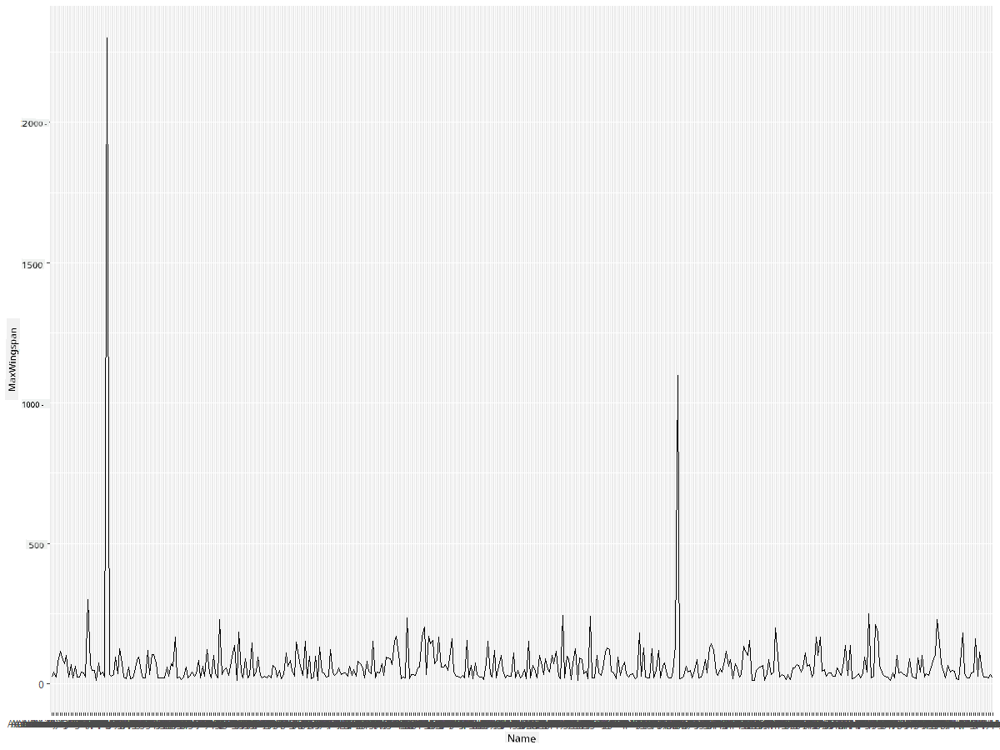
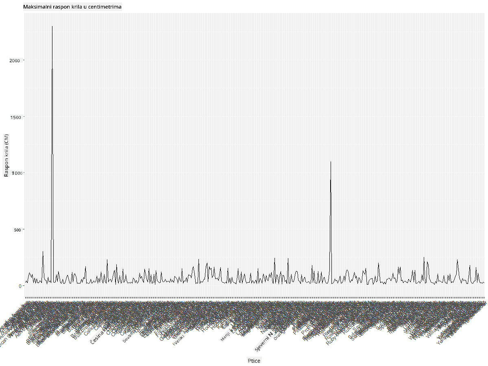
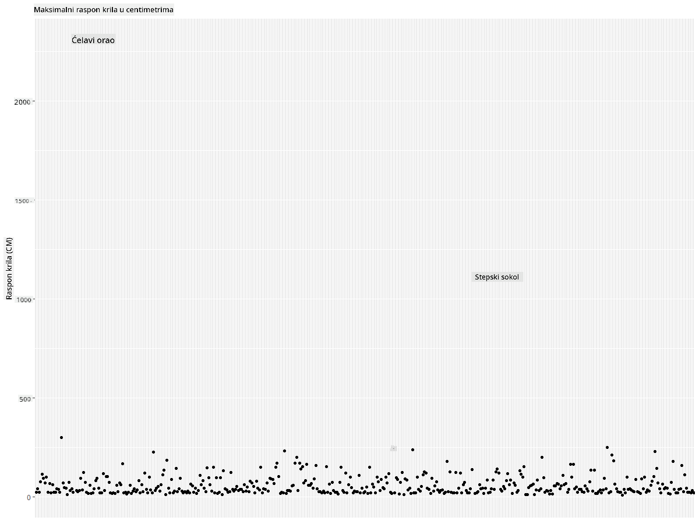
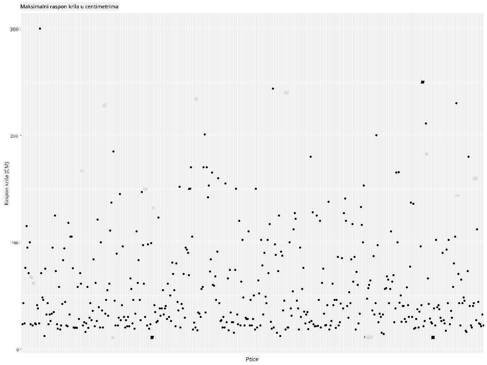
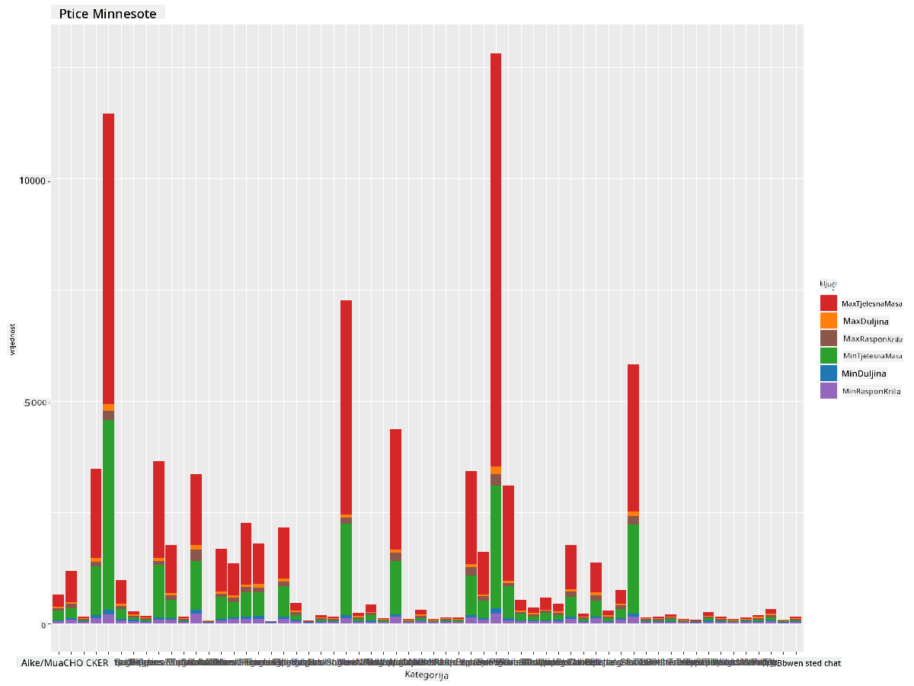
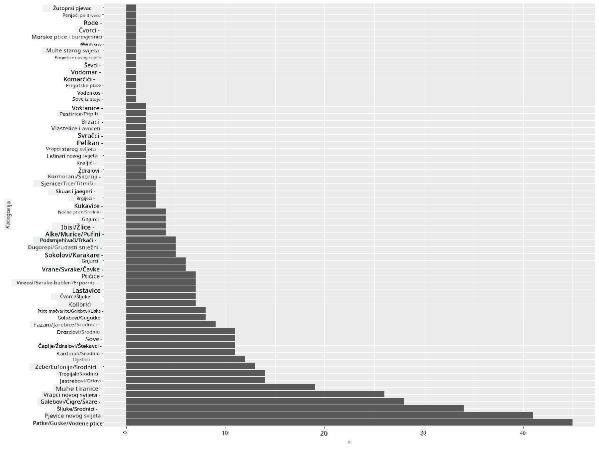
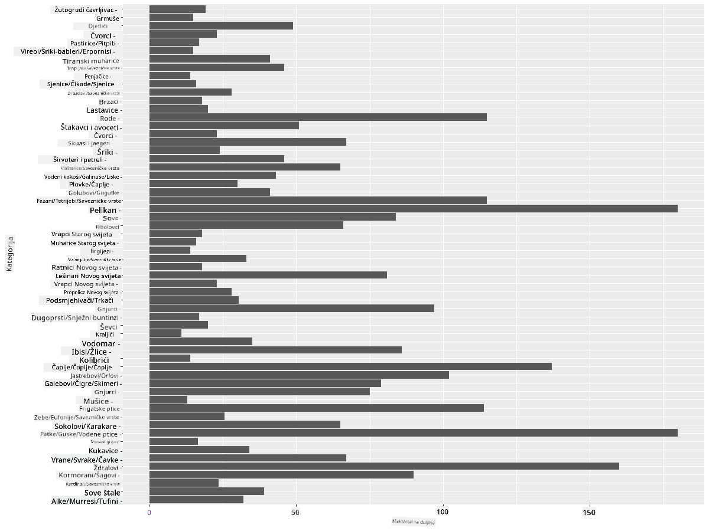
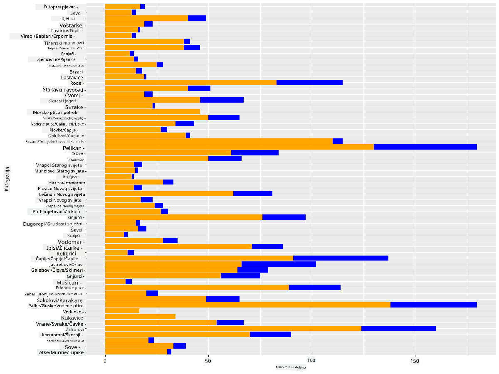

<!--
CO_OP_TRANSLATOR_METADATA:
{
  "original_hash": "22acf28f518a4769ea14fa42f4734b9f",
  "translation_date": "2025-08-30T18:43:06+00:00",
  "source_file": "3-Data-Visualization/R/09-visualization-quantities/README.md",
  "language_code": "hr"
}
-->
# Vizualizacija Količina
| ](https://github.com/microsoft/Data-Science-For-Beginners/blob/main/sketchnotes/09-Visualizing-Quantities.png)|
|:---:|
| Vizualizacija Količina - _Sketchnote autora [@nitya](https://twitter.com/nitya)_ |

U ovoj lekciji istražit ćete kako koristiti neke od mnogih dostupnih R paketa za stvaranje zanimljivih vizualizacija vezanih uz koncept količine. Koristeći očišćeni skup podataka o pticama Minnesote, možete naučiti mnoge zanimljive činjenice o lokalnom životinjskom svijetu.  
## [Kviz prije predavanja](https://purple-hill-04aebfb03.1.azurestaticapps.net/quiz/16)

## Promatranje raspona krila s ggplot2
Izvrsna knjižnica za stvaranje jednostavnih i sofisticiranih grafova i dijagrama različitih vrsta je [ggplot2](https://cran.r-project.org/web/packages/ggplot2/index.html). Općenito, proces crtanja podataka pomoću ovih knjižnica uključuje identificiranje dijelova vašeg dataframe-a koje želite analizirati, provođenje potrebnih transformacija podataka, dodjeljivanje vrijednosti za x i y osi, odlučivanje o vrsti grafa i zatim prikazivanje grafa.

`ggplot2` je sustav za deklarativno stvaranje grafika, temeljen na "Gramatiki grafike". [Gramatika grafike](https://en.wikipedia.org/wiki/Ggplot2) je opći okvir za vizualizaciju podataka koji dijeli grafove na semantičke komponente poput skala i slojeva. Drugim riječima, jednostavnost stvaranja grafova za univarijatne ili multivarijatne podatke s malo koda čini `ggplot2` najpopularnijim paketom za vizualizacije u R-u. Korisnik određuje kako `ggplot2` mapira varijable na estetiku, koje grafičke primitive koristi, a `ggplot2` se brine za ostalo.

> ✅ Graf = Podaci + Estetika + Geometrija  
> - Podaci se odnose na skup podataka  
> - Estetika označava varijable koje se proučavaju (x i y varijable)  
> - Geometrija se odnosi na vrstu grafa (linijski graf, stupčasti graf itd.)

Odaberite najbolju geometriju (vrstu grafa) prema vašim podacima i priči koju želite ispričati putem grafa.

> - Za analizu trendova: linijski, stupčasti  
> - Za usporedbu vrijednosti: stupčasti, tortni, raspršeni graf  
> - Za prikaz odnosa dijelova prema cjelini: tortni graf  
> - Za prikaz distribucije podataka: raspršeni, stupčasti graf  
> - Za prikaz odnosa između vrijednosti: linijski, raspršeni, mjehuričasti graf  

✅ Također možete pogledati ovaj opisni [cheatsheet](https://nyu-cdsc.github.io/learningr/assets/data-visualization-2.1.pdf) za ggplot2.

## Izrada linijskog grafa za vrijednosti raspona krila ptica

Otvorite R konzolu i uvezite skup podataka.  
> Napomena: Skup podataka nalazi se u korijenu ovog repozitorija u mapi `/data`.

Uvezimo skup podataka i pogledajmo prvih 5 redaka podataka.

```r
birds <- read.csv("../../data/birds.csv",fileEncoding="UTF-8-BOM")
head(birds)
```  
Prvih nekoliko redaka podataka sadrži mješavinu teksta i brojeva:

|      | Ime                          | ZnanstvenoIme          | Kategorija            | Red          | Porodica | Rod         | StatusOčuvanja     | MinDuljina | MaxDuljina | MinTjelesnaMasa | MaxTjelesnaMasa | MinRasponKrila | MaxRasponKrila |
| ---: | :--------------------------- | :--------------------- | :-------------------- | :----------- | :------- | :---------- | :----------------- | ----------: | ----------: | --------------: | --------------: | --------------: | --------------: |
|    0 | Crno-trbušni zviždukavac     | Dendrocygna autumnalis | Patke/Guske/Vodene ptice | Anseriformes | Anatidae | Dendrocygna | LC                 |        47   |        56   |             652 |            1020 |              76 |              94 |
|    1 | Smeđi zviždukavac            | Dendrocygna bicolor    | Patke/Guske/Vodene ptice | Anseriformes | Anatidae | Dendrocygna | LC                 |        45   |        53   |             712 |            1050 |              85 |              93 |
|    2 | Bijela guska                 | Anser caerulescens     | Patke/Guske/Vodene ptice | Anseriformes | Anatidae | Anser       | LC                 |        64   |        79   |            2050 |            4050 |             135 |             165 |
|    3 | Rossova guska                | Anser rossii           | Patke/Guske/Vodene ptice | Anseriformes | Anatidae | Anser       | LC                 |      57.3   |        64   |            1066 |            1567 |             113 |             116 |
|    4 | Velika bijela guska          | Anser albifrons        | Patke/Guske/Vodene ptice | Anseriformes | Anatidae | Anser       | LC                 |        64   |        81   |            1930 |            3310 |             130 |             165 |

Započnimo s crtanjem nekih numeričkih podataka koristeći osnovni linijski graf. Pretpostavimo da želite prikazati maksimalni raspon krila ovih zanimljivih ptica.

```r
install.packages("ggplot2")
library("ggplot2")
ggplot(data=birds, aes(x=Name, y=MaxWingspan,group=1)) +
  geom_line() 
```  
Ovdje instalirate paket `ggplot2` i zatim ga uvozite u radni prostor pomoću naredbe `library("ggplot2")`. Za crtanje bilo kojeg grafa u ggplot-u koristi se funkcija `ggplot()`, a vi specificirate skup podataka, x i y varijable kao atribute. U ovom slučaju koristimo funkciju `geom_line()` jer želimo nacrtati linijski graf.



Što odmah primjećujete? Čini se da postoji barem jedan outlier - to je prilično velik raspon krila! Raspon krila od preko 2000 centimetara jednak je više od 20 metara - lutaju li Pterodaktili Minnesotom? Istražimo.

Iako biste mogli brzo sortirati podatke u Excelu kako biste pronašli te outliere, koji su vjerojatno tipografske pogreške, nastavite proces vizualizacije radeći unutar grafa.

Dodajte oznake na x-os kako biste prikazali o kojim se pticama radi:

```r
ggplot(data=birds, aes(x=Name, y=MaxWingspan,group=1)) +
  geom_line() +
  theme(axis.text.x = element_text(angle = 45, hjust=1))+
  xlab("Birds") +
  ylab("Wingspan (CM)") +
  ggtitle("Max Wingspan in Centimeters")
```  
U temi specificiramo kut, a oznake za x i y osi specificiramo pomoću `xlab()` i `ylab()` funkcija. Funkcija `ggtitle()` daje naziv grafu.



Čak i s rotacijom oznaka postavljenom na 45 stupnjeva, previše ih je za čitanje. Pokušajmo drugačiju strategiju: označimo samo outliere i postavimo oznake unutar grafa. Možete koristiti raspršeni graf kako biste napravili više prostora za označavanje:

```r
ggplot(data=birds, aes(x=Name, y=MaxWingspan,group=1)) +
  geom_point() +
  geom_text(aes(label=ifelse(MaxWingspan>500,as.character(Name),'')),hjust=0,vjust=0) + 
  theme(axis.title.x=element_blank(), axis.text.x=element_blank(), axis.ticks.x=element_blank())
  ylab("Wingspan (CM)") +
  ggtitle("Max Wingspan in Centimeters") + 
```  
Što se ovdje događa? Koristili ste funkciju `geom_point()` za crtanje raspršenih točaka. Uz to, dodali ste oznake za ptice čiji je `MaxWingspan > 500` i također sakrili oznake na x-osi kako biste smanjili nered na grafu.

Što otkrivate?



## Filtriranje podataka

I Ćelavi orao i Stepski sokol, iako vjerojatno vrlo velike ptice, čini se da su pogrešno označeni, s dodatnom nulom dodanom njihovom maksimalnom rasponu krila. Malo je vjerojatno da ćete sresti Ćelavog orla s rasponom krila od 25 metara, ali ako se to dogodi, javite nam! Stvorimo novi dataframe bez ta dva outliera:

```r
birds_filtered <- subset(birds, MaxWingspan < 500)

ggplot(data=birds_filtered, aes(x=Name, y=MaxWingspan,group=1)) +
  geom_point() +
  ylab("Wingspan (CM)") +
  xlab("Birds") +
  ggtitle("Max Wingspan in Centimeters") + 
  geom_text(aes(label=ifelse(MaxWingspan>500,as.character(Name),'')),hjust=0,vjust=0) +
  theme(axis.text.x=element_blank(), axis.ticks.x=element_blank())
```  
Napravili smo novi dataframe `birds_filtered` i zatim nacrtali raspršeni graf. Filtriranjem outliera, vaši podaci sada su kohezivniji i razumljiviji.



Sada kada imamo čišći skup podataka barem u smislu raspona krila, istražimo više o ovim pticama.

Dok linijski i raspršeni grafovi mogu prikazati informacije o vrijednostima podataka i njihovim distribucijama, želimo razmisliti o vrijednostima inherentnim u ovom skupu podataka. Mogli biste stvoriti vizualizacije kako biste odgovorili na sljedeća pitanja o količini:

> Koliko kategorija ptica postoji i koliko ih ima?  
> Koliko ptica je izumrlo, ugroženo, rijetko ili uobičajeno?  
> Koliko ima različitih rodova i redova prema Linnaeusovoj terminologiji?  
## Istraživanje stupčastih grafova

Stupčasti grafovi su praktični kada trebate prikazati grupiranje podataka. Istražimo kategorije ptica koje postoje u ovom skupu podataka kako bismo vidjeli koja je najčešća po broju.  
Nacrtajmo stupčasti graf na filtriranim podacima.

```r
install.packages("dplyr")
install.packages("tidyverse")

library(lubridate)
library(scales)
library(dplyr)
library(ggplot2)
library(tidyverse)

birds_filtered %>% group_by(Category) %>%
  summarise(n=n(),
  MinLength = mean(MinLength),
  MaxLength = mean(MaxLength),
  MinBodyMass = mean(MinBodyMass),
  MaxBodyMass = mean(MaxBodyMass),
  MinWingspan=mean(MinWingspan),
  MaxWingspan=mean(MaxWingspan)) %>% 
  gather("key", "value", - c(Category, n)) %>%
  ggplot(aes(x = Category, y = value, group = key, fill = key)) +
  geom_bar(stat = "identity") +
  scale_fill_manual(values = c("#D62728", "#FF7F0E", "#8C564B","#2CA02C", "#1F77B4", "#9467BD")) +                   
  xlab("Category")+ggtitle("Birds of Minnesota")

```  
U sljedećem isječku instaliramo pakete [dplyr](https://www.rdocumentation.org/packages/dplyr/versions/0.7.8) i [lubridate](https://www.rdocumentation.org/packages/lubridate/versions/1.8.0) kako bismo manipulirali i grupirali podatke za crtanje složenog stupčastog grafa. Prvo grupirate podatke prema `Category` ptica i zatim sažimate stupce `MinLength`, `MaxLength`, `MinBodyMass`, `MaxBodyMass`, `MinWingspan`, `MaxWingspan`. Zatim crtate stupčasti graf koristeći `ggplot2` i specificirate boje za različite kategorije i oznake.



Ovaj stupčasti graf, međutim, nije čitljiv jer ima previše negrupiranih podataka. Trebate odabrati samo podatke koje želite prikazati, pa pogledajmo duljinu ptica na temelju njihove kategorije.

Filtrirajte svoje podatke kako biste uključili samo kategoriju ptica.

Budući da postoji mnogo kategorija, ovaj graf možete prikazati okomito i prilagoditi njegovu visinu kako biste obuhvatili sve podatke:

```r
birds_count<-dplyr::count(birds_filtered, Category, sort = TRUE)
birds_count$Category <- factor(birds_count$Category, levels = birds_count$Category)
ggplot(birds_count,aes(Category,n))+geom_bar(stat="identity")+coord_flip()
```  
Prvo brojite jedinstvene vrijednosti u stupcu `Category` i zatim ih sortirate u novi dataframe `birds_count`. Ovi sortirani podaci zatim se faktoriziraju na istoj razini kako bi se prikazali na sortirani način. Koristeći `ggplot2`, zatim crtate podatke u stupčastom grafu. Funkcija `coord_flip()` prikazuje horizontalne stupce.



Ovaj stupčasti graf pruža dobar pregled broja ptica u svakoj kategoriji. Na prvi pogled vidite da je najveći broj ptica u ovoj regiji u kategoriji Patke/Guske/Vodene ptice. Minnesota je 'zemlja 10.000 jezera', pa to nije iznenađujuće!

✅ Isprobajte neka druga brojanja na ovom skupu podataka. Iznenađuje li vas nešto?

## Usporedba podataka

Možete isprobati različite usporedbe grupiranih podataka stvaranjem novih osi. Isprobajte usporedbu maksimalne duljine ptice na temelju njene kategorije:

```r
birds_grouped <- birds_filtered %>%
  group_by(Category) %>%
  summarise(
  MaxLength = max(MaxLength, na.rm = T),
  MinLength = max(MinLength, na.rm = T)
           ) %>%
  arrange(Category)
  
ggplot(birds_grouped,aes(Category,MaxLength))+geom_bar(stat="identity")+coord_flip()
```  
Grupiramo `birds_filtered` podatke prema `Category` i zatim crtamo stupčasti graf.



Ništa ovdje nije iznenađujuće: kolibrići imaju najmanju maksimalnu duljinu u usporedbi s pelikanima ili guskama. Dobro je kada podaci imaju logičan smisao!

Možete stvoriti zanimljivije vizualizacije stupčastih grafova preklapanjem podataka. Preklopimo minimalnu i maksimalnu duljinu na određenu kategoriju ptica:

```r
ggplot(data=birds_grouped, aes(x=Category)) +
  geom_bar(aes(y=MaxLength), stat="identity", position ="identity",  fill='blue') +
  geom_bar(aes(y=MinLength), stat="identity", position="identity", fill='orange')+
  coord_flip()
```  


## 🚀 Izazov

Ovaj skup podataka o pticama nudi bogatstvo informacija o različitim vrstama ptica unutar određenog ekosustava. Pretražite internet i provjerite možete li pronaći druge skupove podataka o pticama. Vježbajte izradu grafova i dijagrama o ovim pticama kako biste otkrili činjenice koje niste znali.

## [Kviz nakon predavanja](https://purple-hill-04aebfb03.1.azurestaticapps.net/quiz/17)

## Pregled i Samostalno Učenje

Ova prva lekcija dala vam je neke informacije o tome kako koristiti `ggplot2` za vizualizaciju količina. Istražite druge načine rada s podacima za vizualizaciju. Istražite i potražite skupove podataka koje biste mogli vizualizirati koristeći druge pakete poput [Lattice](https://stat.ethz.ch/R-manual/R-devel/library/lattice/html/Lattice.html) i [Plotly](https://github.com/plotly/plotly.R#readme).

## Zadatak  
[Linije, Raspršeni Grafovi i Stupci](assignment.md)  

---

**Odricanje od odgovornosti**:  
Ovaj dokument je preveden pomoću AI usluge za prevođenje [Co-op Translator](https://github.com/Azure/co-op-translator). Iako nastojimo osigurati točnost, imajte na umu da automatski prijevodi mogu sadržavati pogreške ili netočnosti. Izvorni dokument na izvornom jeziku treba smatrati autoritativnim izvorom. Za ključne informacije preporučuje se profesionalni prijevod od strane čovjeka. Ne preuzimamo odgovornost za bilo kakva nesporazuma ili pogrešna tumačenja koja proizlaze iz korištenja ovog prijevoda.