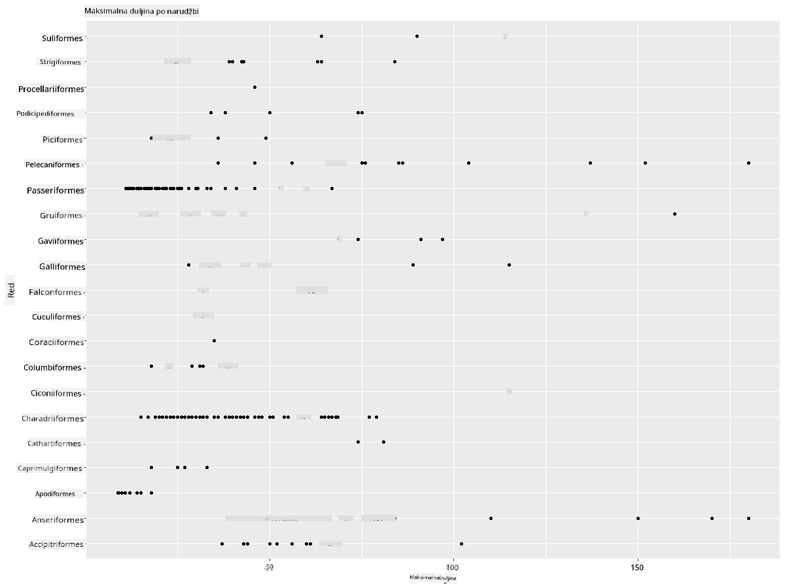
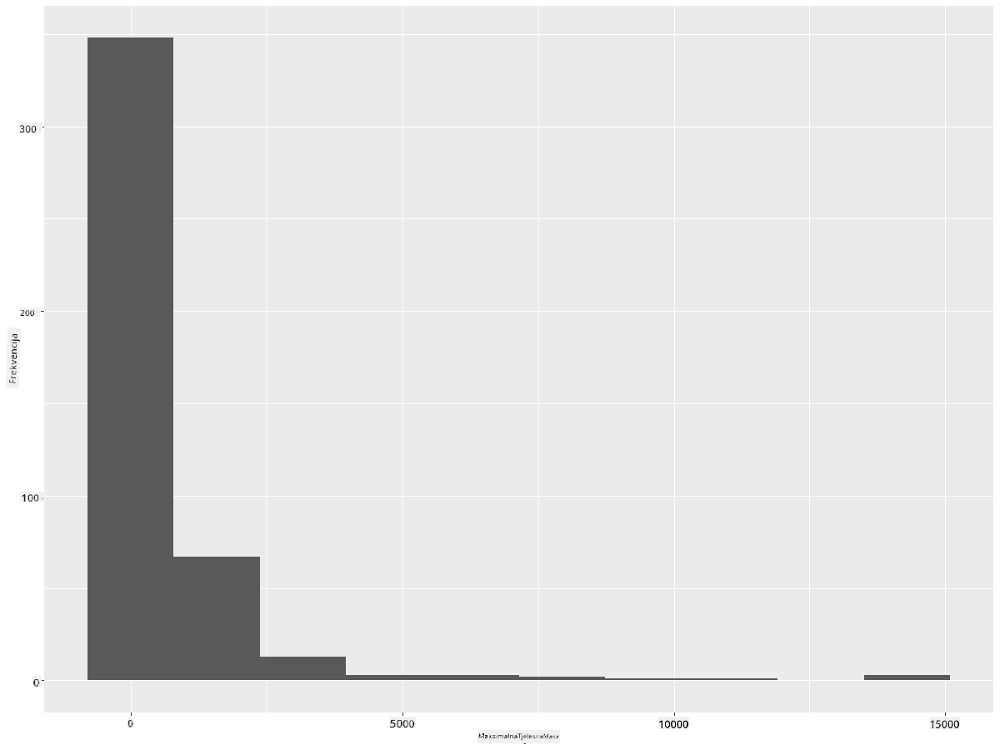
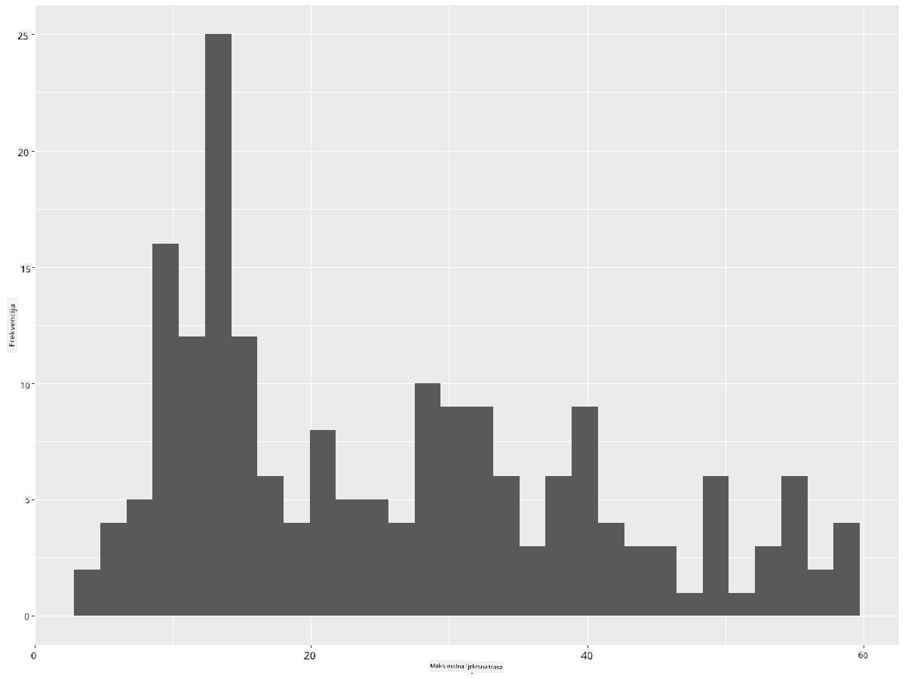
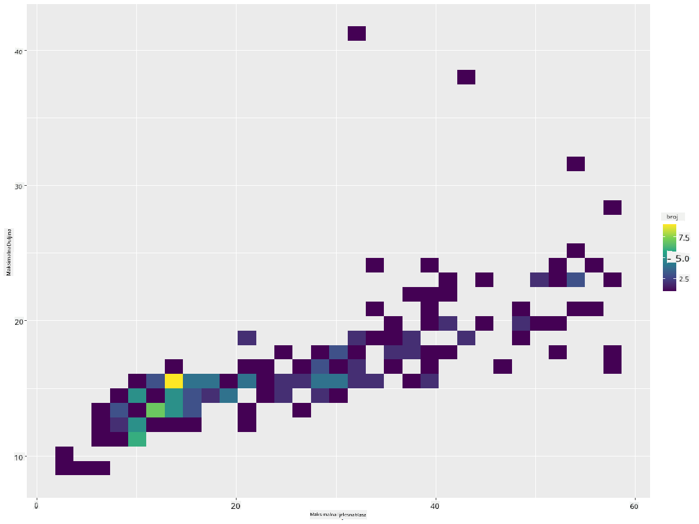
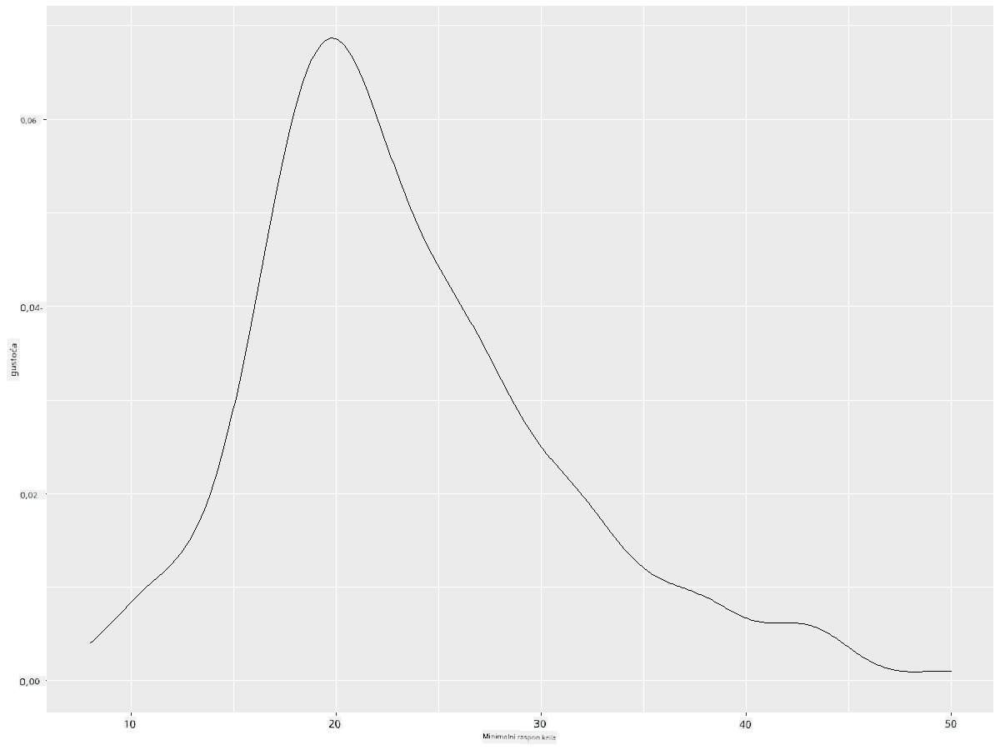
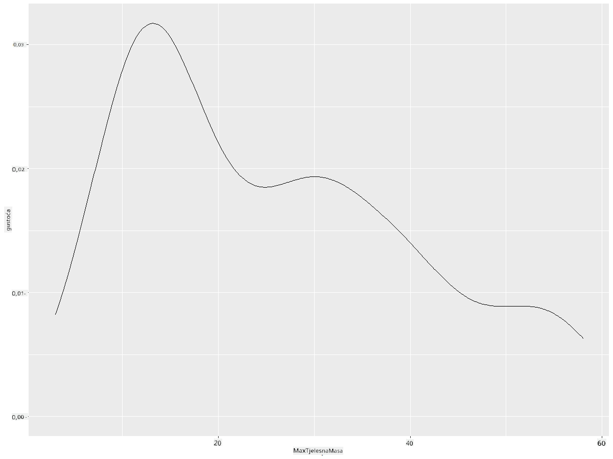
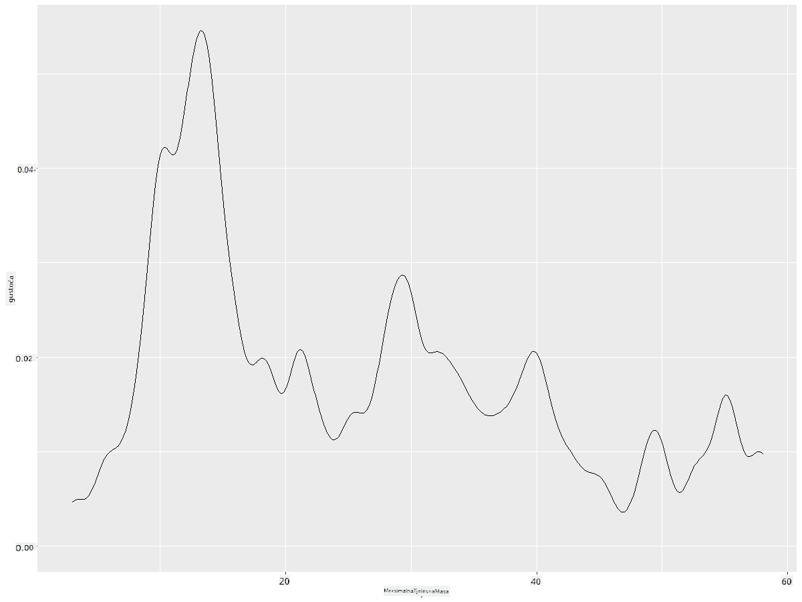
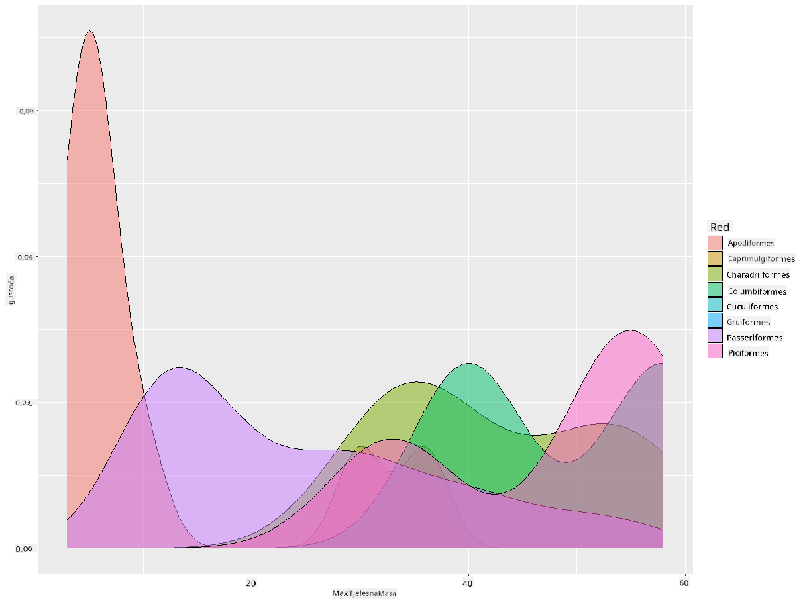

<!--
CO_OP_TRANSLATOR_METADATA:
{
  "original_hash": "ea67c0c40808fd723594de6896c37ccf",
  "translation_date": "2025-08-30T18:50:44+00:00",
  "source_file": "3-Data-Visualization/R/10-visualization-distributions/README.md",
  "language_code": "hr"
}
-->
# Vizualizacija distribucija

| ](https://github.com/microsoft/Data-Science-For-Beginners/blob/main/sketchnotes/10-Visualizing-Distributions.png)|
|:---:|
| Vizualizacija distribucija - _Sketchnote autora [@nitya](https://twitter.com/nitya)_ |

U prethodnoj lekciji naučili ste zanimljive činjenice o skupu podataka o pticama Minnesote. Otkrili ste pogrešne podatke vizualizacijom odstupanja i proučili razlike između kategorija ptica prema njihovoj maksimalnoj duljini.

## [Kviz prije predavanja](https://purple-hill-04aebfb03.1.azurestaticapps.net/quiz/18)
## Istražite skup podataka o pticama

Još jedan način za dublju analizu podataka je proučavanje njihove distribucije, odnosno kako su podaci organizirani duž neke osi. Možda, na primjer, želite saznati opću distribuciju maksimalnog raspona krila ili maksimalne tjelesne mase ptica Minnesote u ovom skupu podataka.

Otkrijmo neke činjenice o distribucijama podataka u ovom skupu. U vašem R konzoli, uvezite `ggplot2` i bazu podataka. Uklonite odstupanja iz baze podataka kao što ste to učinili u prethodnoj temi.

```r
library(ggplot2)

birds <- read.csv("../../data/birds.csv",fileEncoding="UTF-8-BOM")

birds_filtered <- subset(birds, MaxWingspan < 500)
head(birds_filtered)
```
|      | Ime                          | ZnanstvenoIme          | Kategorija            | Red          | Porodica | Rod         | StatusOčuvanosti   | MinDuljina | MaxDuljina | MinTjelesnaMasa | MaxTjelesnaMasa | MinRasponKrila | MaxRasponKrila |
| ---: | :--------------------------- | :--------------------- | :-------------------- | :----------- | :------- | :---------- | :----------------- | ----------: | ----------: | --------------: | --------------: | -------------: | -------------: |
|    0 | Crnoprsi zviždač             | Dendrocygna autumnalis | Patke/Guske/Vodene ptice | Anseriformes | Anatidae | Dendrocygna | LC                 |        47   |        56   |             652 |            1020 |             76 |             94 |
|    1 | Riđi zviždač                 | Dendrocygna bicolor    | Patke/Guske/Vodene ptice | Anseriformes | Anatidae | Dendrocygna | LC                 |        45   |        53   |             712 |            1050 |             85 |             93 |
|    2 | Snježna guska                | Anser caerulescens     | Patke/Guske/Vodene ptice | Anseriformes | Anatidae | Anser       | LC                 |        64   |        79   |            2050 |            4050 |            135 |            165 |
|    3 | Rossova guska                | Anser rossii           | Patke/Guske/Vodene ptice | Anseriformes | Anatidae | Anser       | LC                 |      57.3   |        64   |            1066 |            1567 |            113 |            116 |
|    4 | Velika bijeloprsa guska      | Anser albifrons        | Patke/Guske/Vodene ptice | Anseriformes | Anatidae | Anser       | LC                 |        64   |        81   |            1930 |            3310 |            130 |            165 |

Općenito, distribuciju podataka možete brzo pregledati pomoću raspršenog dijagrama, kao što smo to učinili u prethodnoj lekciji:

```r
ggplot(data=birds_filtered, aes(x=Order, y=MaxLength,group=1)) +
  geom_point() +
  ggtitle("Max Length per order") + coord_flip()
```


Ovo daje pregled opće distribucije duljine tijela po redu ptica, ali nije optimalan način za prikaz stvarnih distribucija. Taj zadatak obično se rješava izradom histograma.
## Rad s histogramima

`ggplot2` nudi vrlo dobre načine za vizualizaciju distribucije podataka pomoću histograma. Ova vrsta grafikona slična je stupčastom grafikonu gdje se distribucija može vidjeti kroz porast i pad stupaca. Za izradu histograma potrebni su numerički podaci. Za izradu histograma možete nacrtati grafikon definirajući vrstu kao 'hist' za histogram. Ovaj grafikon prikazuje distribuciju MaxBodyMass za cijeli raspon numeričkih podataka u skupu. Dijeljenjem niza podataka na manje segmente (bins), može prikazati distribuciju vrijednosti podataka:

```r
ggplot(data = birds_filtered, aes(x = MaxBodyMass)) + 
  geom_histogram(bins=10)+ylab('Frequency')
```


Kao što možete vidjeti, većina od 400+ ptica u ovom skupu podataka spada u raspon ispod 2000 za njihovu maksimalnu tjelesnu masu. Dobijte više uvida u podatke promjenom parametra `bins` na veći broj, poput 30:

```r
ggplot(data = birds_filtered, aes(x = MaxBodyMass)) + geom_histogram(bins=30)+ylab('Frequency')
```


Ovaj grafikon prikazuje distribuciju na malo detaljniji način. Grafikon manje nagnut ulijevo mogao bi se stvoriti osiguravanjem da odaberete samo podatke unutar određenog raspona:

Filtrirajte svoje podatke kako biste dobili samo one ptice čija je tjelesna masa ispod 60 i prikažite 30 `bins`:

```r
birds_filtered_1 <- subset(birds_filtered, MaxBodyMass > 1 & MaxBodyMass < 60)
ggplot(data = birds_filtered_1, aes(x = MaxBodyMass)) + 
  geom_histogram(bins=30)+ylab('Frequency')
```



✅ Isprobajte neke druge filtre i točke podataka. Da biste vidjeli punu distribuciju podataka, uklonite filter `['MaxBodyMass']` kako biste prikazali označene distribucije.

Histogram također nudi zanimljive mogućnosti za boje i označavanje:

Napravite 2D histogram za usporedbu odnosa između dvije distribucije. Usporedimo `MaxBodyMass` i `MaxLength`. `ggplot2` nudi ugrađen način za prikaz konvergencije pomoću svjetlijih boja:

```r
ggplot(data=birds_filtered_1, aes(x=MaxBodyMass, y=MaxLength) ) +
  geom_bin2d() +scale_fill_continuous(type = "viridis")
```
Čini se da postoji očekivana korelacija između ova dva elementa duž očekivane osi, s jednom posebno jakom točkom konvergencije:



Histograme je lako koristiti za numeričke podatke. Što ako trebate vidjeti distribucije prema tekstualnim podacima? 
## Istražite skup podataka za distribucije koristeći tekstualne podatke 

Ovaj skup podataka također uključuje korisne informacije o kategoriji ptica, njihovom rodu, vrsti i porodici, kao i o njihovom statusu očuvanosti. Istražimo informacije o očuvanosti. Kakva je distribucija ptica prema njihovom statusu očuvanosti?

> ✅ U skupu podataka koristi se nekoliko akronima za opis statusa očuvanosti. Ovi akronimi dolaze iz [IUCN Crvene liste kategorija](https://www.iucnredlist.org/), organizacije koja katalogizira status vrsta.
> 
> - CR: Kritično ugrožena
> - EN: Ugrožena
> - EX: Izumrla
> - LC: Najmanje zabrinjavajuća
> - NT: Blizu ugroženosti
> - VU: Ranjiva

Ovo su tekstualne vrijednosti pa ćete trebati napraviti transformaciju kako biste stvorili histogram. Koristeći filtriraniBirds dataframe, prikažite njegov status očuvanosti uz minimalni raspon krila. Što primjećujete? 

```r
birds_filtered_1$ConservationStatus[birds_filtered_1$ConservationStatus == 'EX'] <- 'x1' 
birds_filtered_1$ConservationStatus[birds_filtered_1$ConservationStatus == 'CR'] <- 'x2'
birds_filtered_1$ConservationStatus[birds_filtered_1$ConservationStatus == 'EN'] <- 'x3'
birds_filtered_1$ConservationStatus[birds_filtered_1$ConservationStatus == 'NT'] <- 'x4'
birds_filtered_1$ConservationStatus[birds_filtered_1$ConservationStatus == 'VU'] <- 'x5'
birds_filtered_1$ConservationStatus[birds_filtered_1$ConservationStatus == 'LC'] <- 'x6'

ggplot(data=birds_filtered_1, aes(x = MinWingspan, fill = ConservationStatus)) +
  geom_histogram(position = "identity", alpha = 0.4, bins = 20) +
  scale_fill_manual(name="Conservation Status",values=c("red","green","blue","pink"),labels=c("Endangered","Near Threathened","Vulnerable","Least Concern"))
```


Čini se da ne postoji dobra korelacija između minimalnog raspona krila i statusa očuvanosti. Testirajte druge elemente skupa podataka koristeći ovu metodu. Možete isprobati i različite filtre. Nalazite li neku korelaciju?

## Grafovi gustoće

Možda ste primijetili da su histogrami koje smo do sada pregledali 'stepeni' i ne teku glatko u luku. Da biste prikazali glatkiji grafikon gustoće, možete isprobati graf gustoće.

Radimo sada s grafovima gustoće!

```r
ggplot(data = birds_filtered_1, aes(x = MinWingspan)) + 
  geom_density()
```


Možete vidjeti kako grafikon odražava prethodni za podatke o minimalnom rasponu krila; samo je malo glađi. Ako želite ponovno pogledati onaj nazubljeni grafikon MaxBodyMass iz drugog grafikona koji ste izradili, mogli biste ga vrlo dobro izgladiti koristeći ovu metodu:

```r
ggplot(data = birds_filtered_1, aes(x = MaxBodyMass)) + 
  geom_density()
```


Ako želite glatku, ali ne previše glatku liniju, uredite parametar `adjust`: 

```r
ggplot(data = birds_filtered_1, aes(x = MaxBodyMass)) + 
  geom_density(adjust = 1/5)
```


✅ Pročitajte o parametrima dostupnim za ovu vrstu grafikona i eksperimentirajte!

Ova vrsta grafikona nudi vizualizacije koje lijepo objašnjavaju podatke. Na primjer, s nekoliko linija koda možete prikazati gustoću maksimalne tjelesne mase po redu ptica:

```r
ggplot(data=birds_filtered_1,aes(x = MaxBodyMass, fill = Order)) +
  geom_density(alpha=0.5)
```


## 🚀 Izazov

Histogrami su sofisticiranija vrsta grafikona od osnovnih raspršenih dijagrama, stupčastih grafikona ili linijskih grafikona. Potražite na internetu dobre primjere korištenja histograma. Kako se koriste, što prikazuju i u kojim područjima ili poljima se obično koriste?

## [Kviz nakon predavanja](https://purple-hill-04aebfb03.1.azurestaticapps.net/quiz/19)

## Pregled i samostalno učenje

U ovoj lekciji koristili ste `ggplot2` i počeli raditi na prikazivanju sofisticiranijih grafikona. Istražite `geom_density_2d()` - "kontinuiranu krivulju gustoće vjerojatnosti u jednoj ili više dimenzija". Pročitajte [dokumentaciju](https://ggplot2.tidyverse.org/reference/geom_density_2d.html) kako biste razumjeli kako funkcionira.

## Zadatak

[Primijenite svoje vještine](assignment.md)

---

**Odricanje od odgovornosti**:  
Ovaj dokument je preveden pomoću AI usluge za prevođenje [Co-op Translator](https://github.com/Azure/co-op-translator). Iako nastojimo osigurati točnost, imajte na umu da automatski prijevodi mogu sadržavati pogreške ili netočnosti. Izvorni dokument na izvornom jeziku treba smatrati autoritativnim izvorom. Za ključne informacije preporučuje se profesionalni prijevod od strane čovjeka. Ne preuzimamo odgovornost za bilo kakva pogrešna shvaćanja ili tumačenja koja proizlaze iz korištenja ovog prijevoda.