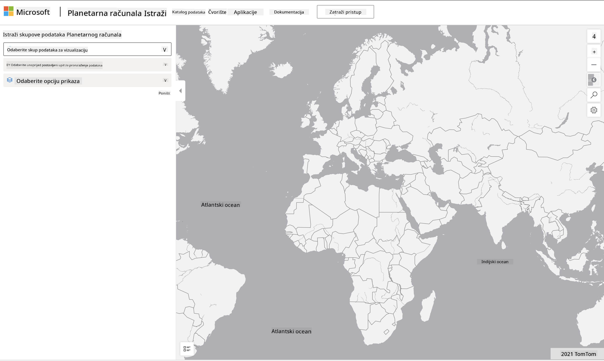

<!--
CO_OP_TRANSLATOR_METADATA:
{
  "original_hash": "d1e05715f9d97de6c4f1fb0c5a4702c0",
  "translation_date": "2025-08-30T19:56:43+00:00",
  "source_file": "6-Data-Science-In-Wild/20-Real-World-Examples/assignment.md",
  "language_code": "hr"
}
-->
# Istražite skup podataka Planetary Computer

## Upute

U ovoj lekciji razgovarali smo o raznim područjima primjene znanosti o podacima - s detaljnim primjerima vezanim uz istraživanje, održivost i digitalne humanističke znanosti. U ovom zadatku istražit ćete jedan od tih primjera detaljnije i primijeniti neka od svojih znanja o vizualizaciji i analizi podataka kako biste došli do uvida o podacima vezanim uz održivost.

Projekt [Planetary Computer](https://planetarycomputer.microsoft.com/) sadrži skupove podataka i API-je kojima se može pristupiti putem računa - zatražite pristup ako želite isprobati dodatni korak zadatka. Stranica također nudi značajku [Explorer](https://planetarycomputer.microsoft.com/explore) koju možete koristiti bez stvaranja računa.

`Koraci:`
Sučelje Explorer (prikazano na slici ispod) omogućuje vam odabir skupa podataka (iz ponuđenih opcija), unaprijed postavljenog upita (za filtriranje podataka) i opcije prikaza (za stvaranje relevantne vizualizacije). U ovom zadatku vaš je zadatak:

 1. Pročitajte [Explorer dokumentaciju](https://planetarycomputer.microsoft.com/docs/overview/explorer/) - razumite opcije.
 2. Istražite [Katalog](https://planetarycomputer.microsoft.com/catalog) skupova podataka - saznajte svrhu svakog od njih.
 3. Koristite Explorer - odaberite skup podataka koji vas zanima, odaberite relevantan upit i opciju prikaza.

`Vaš zadatak:`
Sada proučite vizualizaciju koja je prikazana u pregledniku i odgovorite na sljedeće:
 * Koje _značajke_ ima skup podataka?
 * Koje _uvide_ ili rezultate pruža vizualizacija?
 * Koje su _implikacije_ tih uvida na ciljeve održivosti projekta?
 * Koja su _ograničenja_ vizualizacije (tj. koji uvid niste dobili)?
 * Ako biste mogli dobiti sirove podatke, koje biste _alternativne vizualizacije_ stvorili i zašto?

`Dodatni bodovi:`
Prijavite se za račun - i prijavite se kada dobijete pristup.
 * Koristite opciju _Launch Hub_ za otvaranje sirovih podataka u Notebooksu.
 * Interaktivno istražite podatke i implementirajte alternativne vizualizacije koje ste osmislili.
 * Sada analizirajte svoje prilagođene vizualizacije - jeste li uspjeli doći do uvida koji su vam prethodno nedostajali?

## Rubrika

Primjeran | Zadovoljavajući | Potrebno poboljšanje
--- | --- | -- |
Odgovoreno je na svih pet ključnih pitanja. Student je jasno identificirao kako trenutne i alternativne vizualizacije mogu pružiti uvide u ciljeve ili ishode održivosti. | Student je detaljno odgovorio na barem prva tri pitanja, pokazujući da ima praktično iskustvo s Explorerom. | Student nije odgovorio na više pitanja ili je dao nedovoljno detaljne odgovore - što ukazuje na to da nije napravljen značajan pokušaj za projekt. |

---

**Odricanje od odgovornosti**:  
Ovaj dokument je preveden pomoću AI usluge za prevođenje [Co-op Translator](https://github.com/Azure/co-op-translator). Iako nastojimo osigurati točnost, imajte na umu da automatski prijevodi mogu sadržavati pogreške ili netočnosti. Izvorni dokument na izvornom jeziku treba smatrati mjerodavnim izvorom. Za ključne informacije preporučuje se profesionalni prijevod od strane stručnjaka. Ne preuzimamo odgovornost za nesporazume ili pogrešna tumačenja koja mogu proizaći iz korištenja ovog prijevoda.