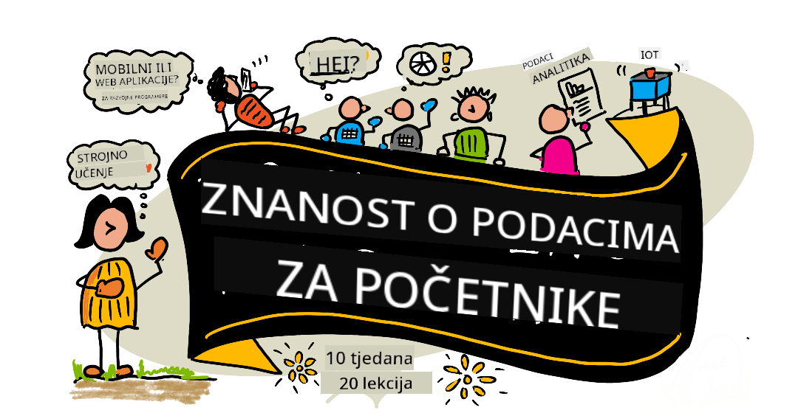

<!--
CO_OP_TRANSLATOR_METADATA:
{
  "original_hash": "9dc77d6fd78ee43189ae20d3d2206c00",
  "translation_date": "2025-10-11T14:59:54+00:00",
  "source_file": "README.md",
  "language_code": "hr"
}
-->
# Data Science za početnike - Kurikulum

Azure Cloud Advocates u Microsoftu s ponosom predstavljaju 10-tjedni kurikulum s 20 lekcija o Data Scienceu. Svaka lekcija uključuje kvizove prije i poslije lekcije, pisane upute za dovršavanje lekcije, rješenje i zadatak. Naša metodologija temeljena na projektima omogućuje vam učenje kroz izradu, što je dokazano učinkovit način za usvajanje novih vještina.

**Veliko hvala našim autorima:** [Jasmine Greenaway](https://www.twitter.com/paladique), [Dmitry Soshnikov](http://soshnikov.com), [Nitya Narasimhan](https://twitter.com/nitya), [Jalen McGee](https://twitter.com/JalenMcG), [Jen Looper](https://twitter.com/jenlooper), [Maud Levy](https://twitter.com/maudstweets), [Tiffany Souterre](https://twitter.com/TiffanySouterre), [Christopher Harrison](https://www.twitter.com/geektrainer).

**🙏 Posebna zahvala 🙏 našim [Microsoft Student Ambassador](https://studentambassadors.microsoft.com/) autorima, recenzentima i suradnicima,** posebno Aaryanu Arori, [Aditya Garg](https://github.com/AdityaGarg00), [Alondra Sanchez](https://www.linkedin.com/in/alondra-sanchez-molina/), [Ankita Singh](https://www.linkedin.com/in/ankitasingh007), [Anupam Mishra](https://www.linkedin.com/in/anupam--mishra/), [Arpita Das](https://www.linkedin.com/in/arpitadas01/), ChhailBihari Dubey, [Dibri Nsofor](https://www.linkedin.com/in/dibrinsofor), [Dishita Bhasin](https://www.linkedin.com/in/dishita-bhasin-7065281bb), [Majd Safi](https://www.linkedin.com/in/majd-s/), [Max Blum](https://www.linkedin.com/in/max-blum-6036a1186/), [Miguel Correa](https://www.linkedin.com/in/miguelmque/), [Mohamma Iftekher (Iftu) Ebne Jalal](https://twitter.com/iftu119), [Nawrin Tabassum](https://www.linkedin.com/in/nawrin-tabassum), [Raymond Wangsa Putra](https://www.linkedin.com/in/raymond-wp/), [Rohit Yadav](https://www.linkedin.com/in/rty2423), Samridhi Sharma, [Sanya Sinha](https://www.linkedin.com/mwlite/in/sanya-sinha-13aab1200),
[Sheena Narula](https://www.linkedin.com/in/sheena-narua-n/), [Tauqeer Ahmad](https://www.linkedin.com/in/tauqeerahmad5201/), Yogendrasingh Pawar , [Vidushi Gupta](https://www.linkedin.com/in/vidushi-gupta07/), [Jasleen Sondhi](https://www.linkedin.com/in/jasleen-sondhi/)

||
|:---:|
| Data Science za početnike - _Sketchnote by [@nitya](https://twitter.com/nitya)_ |

### 🌐 Podrška za više jezika

#### Podržano putem GitHub Action (Automatski i uvijek ažurirano)

<!-- CO-OP TRANSLATOR LANGUAGES TABLE START -->
[Arapski](../ar/README.md) | [Bengalski](../bn/README.md) | [Bugarski](../bg/README.md) | [Burmanski (Mjanmar)](../my/README.md) | [Kineski (pojednostavljeni)](../zh/README.md) | [Kineski (tradicionalni, Hong Kong)](../hk/README.md) | [Kineski (tradicionalni, Macau)](../mo/README.md) | [Kineski (tradicionalni, Tajvan)](../tw/README.md) | [Hrvatski](./README.md) | [Češki](../cs/README.md) | [Danski](../da/README.md) | [Nizozemski](../nl/README.md) | [Estonski](../et/README.md) | [Finski](../fi/README.md) | [Francuski](../fr/README.md) | [Njemački](../de/README.md) | [Grčki](../el/README.md) | [Hebrejski](../he/README.md) | [Hindski](../hi/README.md) | [Mađarski](../hu/README.md) | [Indonezijski](../id/README.md) | [Talijanski](../it/README.md) | [Japanski](../ja/README.md) | [Korejski](../ko/README.md) | [Litvanski](../lt/README.md) | [Malajski](../ms/README.md) | [Marathi](../mr/README.md) | [Nepalski](../ne/README.md) | [Norveški](../no/README.md) | [Perzijski (Farsi)](../fa/README.md) | [Poljski](../pl/README.md) | [Portugalski (Brazil)](../br/README.md) | [Portugalski (Portugal)](../pt/README.md) | [Pandžapski (Gurmukhi)](../pa/README.md) | [Rumunjski](../ro/README.md) | [Ruski](../ru/README.md) | [Srpski (ćirilica)](../sr/README.md) | [Slovački](../sk/README.md) | [Slovenski](../sl/README.md) | [Španjolski](../es/README.md) | [Svahili](../sw/README.md) | [Švedski](../sv/README.md) | [Tagalog (Filipinski)](../tl/README.md) | [Tamilski](../ta/README.md) | [Tajlandski](../th/README.md) | [Turski](../tr/README.md) | [Ukrajinski](../uk/README.md) | [Urdu](../ur/README.md) | [Vijetnamski](../vi/README.md)
<!-- CO-OP TRANSLATOR LANGUAGES TABLE END -->

**Ako želite dodati dodatne prijevode, podržani jezici navedeni su [ovdje](https://github.com/Azure/co-op-translator/blob/main/getting_started/supported-languages.md)**

#### Pridružite se našoj zajednici 

Imamo seriju učenja s AI-jem na Discordu, saznajte više i pridružite nam se na [Learn with AI Series](https://aka.ms/learnwithai/discord) od 18. do 30. rujna 2025. Dobit ćete savjete i trikove za korištenje GitHub Copilota za Data Science.

# Jeste li student?

Započnite s ovim resursima:

- [Stranica za studente](https://docs.microsoft.com/en-gb/learn/student-hub?WT.mc_id=academic-77958-bethanycheum) Na ovoj stranici pronaći ćete resurse za početnike, studentske pakete i čak načine za dobivanje besplatnog certifikata. Ovo je stranica koju želite označiti i povremeno provjeravati jer mijenjamo sadržaj barem jednom mjesečno.
- [Microsoft Learn Student Ambassadors](https://studentambassadors.microsoft.com?WT.mc_id=academic-77958-bethanycheum) Pridružite se globalnoj zajednici studentskih ambasadora, ovo bi mogao biti vaš put u Microsoft.

# Početak

## 📚 Dokumentacija

- **[Vodič za instalaciju](INSTALLATION.md)** - Korak-po-korak upute za početnike
- **[Vodič za korištenje](USAGE.md)** - Primjeri i uobičajeni radni procesi
- **[Rješavanje problema](TROUBLESHOOTING.md)** - Rješenja za uobičajene probleme
- **[Vodič za doprinos](CONTRIBUTING.md)** - Kako doprinijeti ovom projektu
- **[Za nastavnike](for-teachers.md)** - Smjernice za podučavanje i resursi za učionicu

## 👨‍🎓 Za studente
> **Potpuni početnici**: Novi ste u Data Scienceu? Započnite s našim [primjerima prilagođenim početnicima](examples/README.md)! Ovi jednostavni, dobro komentirani primjeri pomoći će vam da razumijete osnove prije nego što se upustite u cijeli kurikulum.
> **[Studenti](https://aka.ms/student-page)**: za samostalno korištenje ovog kurikuluma, forkajte cijeli repo i dovršite vježbe sami, počevši s kvizom prije predavanja. Zatim pročitajte predavanje i dovršite ostale aktivnosti. Pokušajte izraditi projekte razumijevanjem lekcija umjesto kopiranja rješenja; međutim, taj kod je dostupan u /solutions mapama u svakoj lekciji usmjerenoj na projekt. Druga ideja bila bi formirati grupu za učenje s prijateljima i zajedno prolaziti kroz sadržaj. Za daljnje učenje preporučujemo [Microsoft Learn](https://docs.microsoft.com/en-us/users/jenlooper-2911/collections/qprpajyoy3x0g7?WT.mc_id=academic-77958-bethanycheum).

**Brzi početak:**
1. Provjerite [Vodič za instalaciju](INSTALLATION.md) za postavljanje vašeg okruženja
2. Pregledajte [Vodič za korištenje](USAGE.md) kako biste naučili raditi s kurikulumom
3. Započnite s Lekcijom 1 i radite redom
4. Pridružite se našoj [Discord zajednici](https://aka.ms/ds4beginners/discord) za podršku

## 👩‍🏫 Za nastavnike

> **Nastavnici**: [uključili smo neke prijedloge](for-teachers.md) o tome kako koristiti ovaj kurikulum. Voljeli bismo čuti vaše povratne informacije [u našem forumu za raspravu](https://github.com/microsoft/Data-Science-For-Beginners/discussions)!

## Upoznajte tim

**Gif by** [Mohit Jaisal](https://www.linkedin.com/in/mohitjaisal)

> 🎥 Kliknite na sliku iznad za video o projektu i ljudima koji su ga stvorili!

## Pedagogija
Odabrali smo dva pedagoška načela prilikom izrade ovog kurikuluma: osigurati da je temeljen na projektima i da uključuje česte kvizove. Do kraja ove serije, studenti će naučiti osnovne principe znanosti o podacima, uključujući etičke koncepte, pripremu podataka, različite načine rada s podacima, vizualizaciju podataka, analizu podataka, stvarne primjene znanosti o podacima i još mnogo toga.

Osim toga, kviz s niskim rizikom prije predavanja usmjerava studenta prema učenju teme, dok drugi kviz nakon predavanja osigurava bolje zadržavanje znanja. Ovaj kurikulum je dizajniran da bude fleksibilan i zabavan te se može pohađati u cijelosti ili djelomično. Projekti započinju jednostavno i postaju sve složeniji do kraja desetotjednog ciklusa.

> Pronađite naš [Kodeks ponašanja](CODE_OF_CONDUCT.md), [Upute za doprinos](CONTRIBUTING.md), [Upute za prijevod](TRANSLATIONS.md). Vaše konstruktivne povratne informacije su dobrodošle!

## Svaka lekcija uključuje:

- Opcionalnu sketchnote ilustraciju
- Opcionalni dopunski video
- Kviz za zagrijavanje prije lekcije
- Pisanu lekciju
- Za lekcije temeljene na projektima, vodiče korak po korak za izradu projekta
- Provjere znanja
- Izazov
- Dopunsko čitanje
- Zadatak
- [Kviz nakon lekcije](https://ff-quizzes.netlify.app/en/)

> **Napomena o kvizovima**: Svi kvizovi nalaze se u mapi Quiz-App, ukupno 40 kvizova s po tri pitanja. Povezani su unutar lekcija, ali aplikacija za kvizove može se pokrenuti lokalno ili implementirati na Azure; slijedite upute u mapi `quiz-app`. Postupno se lokaliziraju.

## 🎓 Primjeri za početnike

**Novi u znanosti o podacima?** Kreirali smo posebnu [mapu s primjerima](examples/README.md) s jednostavnim, dobro komentiranim kodom kako bismo vam pomogli da započnete:

- 🌟 **Hello World** - Vaš prvi program za znanost o podacima
- 📂 **Učitavanje podataka** - Naučite čitati i istraživati skupove podataka
- 📊 **Jednostavna analiza** - Izračunajte statistike i pronađite uzorke
- 📈 **Osnovna vizualizacija** - Kreirajte grafikone i dijagrame
- 🔬 **Projekt iz stvarnog svijeta** - Kompletan tijek rada od početka do kraja

Svaki primjer uključuje detaljne komentare koji objašnjavaju svaki korak, što ga čini savršenim za apsolutne početnike!

👉 **[Započnite s primjerima](examples/README.md)** 👈

## Lekcije

||
|:---:|
| Znanost o podacima za početnike: Plan puta - _Sketchnote by [@nitya](https://twitter.com/nitya)_ |

| Broj lekcije | Tema | Grupiranje lekcija | Ciljevi učenja | Povezana lekcija | Autor |
| :-----------: | :----------------------------------------: | :--------------------------------------------------: | :-----------------------------------------------------------------------------------------------------------------------------------------------------------------------: | :---------------------------------------------------------------------: | :----: |
| 01 | Definiranje znanosti o podacima | [Uvod](1-Introduction/README.md) | Naučite osnovne koncepte znanosti o podacima i kako je povezana s umjetnom inteligencijom, strojnim učenjem i velikim podacima. | [lekcija](1-Introduction/01-defining-data-science/README.md) [video](https://youtu.be/beZ7Mb_oz9I) | [Dmitry](http://soshnikov.com) |
| 02 | Etika u znanosti o podacima | [Uvod](1-Introduction/README.md) | Koncepti etike podataka, izazovi i okviri. | [lekcija](1-Introduction/02-ethics/README.md) | [Nitya](https://twitter.com/nitya) |
| 03 | Definiranje podataka | [Uvod](1-Introduction/README.md) | Kako se podaci klasificiraju i njihovi uobičajeni izvori. | [lekcija](1-Introduction/03-defining-data/README.md) | [Jasmine](https://www.twitter.com/paladique) |
| 04 | Uvod u statistiku i vjerojatnost | [Uvod](1-Introduction/README.md) | Matematičke tehnike vjerojatnosti i statistike za razumijevanje podataka. | [lekcija](1-Introduction/04-stats-and-probability/README.md) [video](https://youtu.be/Z5Zy85g4Yjw) | [Dmitry](http://soshnikov.com) |
| 05 | Rad s relacijskim podacima | [Rad s podacima](2-Working-With-Data/README.md) | Uvod u relacijske podatke i osnove istraživanja i analize relacijskih podataka pomoću Structured Query Language (SQL). | [lekcija](2-Working-With-Data/05-relational-databases/README.md) | [Christopher](https://www.twitter.com/geektrainer) | | |
| 06 | Rad s NoSQL podacima | [Rad s podacima](2-Working-With-Data/README.md) | Uvod u nerelacijske podatke, njihove različite vrste i osnove istraživanja i analize dokumentnih baza podataka. | [lekcija](2-Working-With-Data/06-non-relational/README.md) | [Jasmine](https://twitter.com/paladique)|
| 07 | Rad s Pythonom | [Rad s podacima](2-Working-With-Data/README.md) | Osnove korištenja Pythona za istraživanje podataka s bibliotekama poput Pandas. Preporučuje se osnovno razumijevanje programiranja u Pythonu. | [lekcija](2-Working-With-Data/07-python/README.md) [video](https://youtu.be/dZjWOGbsN4Y) | [Dmitry](http://soshnikov.com) |
| 08 | Priprema podataka | [Rad s podacima](2-Working-With-Data/README.md) | Tehnike čišćenja i transformacije podataka za rješavanje izazova poput nedostajućih, netočnih ili nepotpunih podataka. | [lekcija](2-Working-With-Data/08-data-preparation/README.md) | [Jasmine](https://www.twitter.com/paladique) |
| 09 | Vizualizacija količina | [Vizualizacija podataka](3-Data-Visualization/README.md) | Naučite kako koristiti Matplotlib za vizualizaciju podataka o pticama 🦆 | [lekcija](3-Data-Visualization/09-visualization-quantities/README.md) | [Jen](https://twitter.com/jenlooper) |
| 10 | Vizualizacija distribucije podataka | [Vizualizacija podataka](3-Data-Visualization/README.md) | Vizualizacija opažanja i trendova unutar intervala. | [lekcija](3-Data-Visualization/10-visualization-distributions/README.md) | [Jen](https://twitter.com/jenlooper) |
| 11 | Vizualizacija proporcija | [Vizualizacija podataka](3-Data-Visualization/README.md) | Vizualizacija diskretnih i grupiranih postotaka. | [lekcija](3-Data-Visualization/11-visualization-proportions/README.md) | [Jen](https://twitter.com/jenlooper) |
| 12 | Vizualizacija odnosa | [Vizualizacija podataka](3-Data-Visualization/README.md) | Vizualizacija povezanosti i korelacija između skupova podataka i njihovih varijabli. | [lekcija](3-Data-Visualization/12-visualization-relationships/README.md) | [Jen](https://twitter.com/jenlooper) |
| 13 | Smislene vizualizacije | [Vizualizacija podataka](3-Data-Visualization/README.md) | Tehnike i smjernice za izradu vizualizacija koje su vrijedne za učinkovito rješavanje problema i uvid. | [lekcija](3-Data-Visualization/13-meaningful-visualizations/README.md) | [Jen](https://twitter.com/jenlooper) |
| 14 | Uvod u životni ciklus znanosti o podacima | [Životni ciklus](4-Data-Science-Lifecycle/README.md) | Uvod u životni ciklus znanosti o podacima i njegov prvi korak - prikupljanje i ekstrakcija podataka. | [lekcija](4-Data-Science-Lifecycle/14-Introduction/README.md) | [Jasmine](https://twitter.com/paladique) |
| 15 | Analiza | [Životni ciklus](4-Data-Science-Lifecycle/README.md) | Ova faza životnog ciklusa znanosti o podacima fokusira se na tehnike analize podataka. | [lekcija](4-Data-Science-Lifecycle/15-analyzing/README.md) | [Jasmine](https://twitter.com/paladique) | | |
| 16 | Komunikacija | [Životni ciklus](4-Data-Science-Lifecycle/README.md) | Ova faza životnog ciklusa znanosti o podacima fokusira se na prezentaciju uvida iz podataka na način koji olakšava razumijevanje donositeljima odluka. | [lekcija](4-Data-Science-Lifecycle/16-communication/README.md) | [Jalen](https://twitter.com/JalenMcG) | | |
| 17 | Znanost o podacima u oblaku | [Podaci u oblaku](5-Data-Science-In-Cloud/README.md) | Ova serija lekcija uvodi znanost o podacima u oblaku i njezine prednosti. | [lekcija](5-Data-Science-In-Cloud/17-Introduction/README.md) | [Tiffany](https://twitter.com/TiffanySouterre) i [Maud](https://twitter.com/maudstweets) |
| 18 | Znanost o podacima u oblaku | [Podaci u oblaku](5-Data-Science-In-Cloud/README.md) | Treniranje modela pomoću alata s malo koda. |[lekcija](5-Data-Science-In-Cloud/18-Low-Code/README.md) | [Tiffany](https://twitter.com/TiffanySouterre) i [Maud](https://twitter.com/maudstweets) |
| 19 | Znanost o podacima u oblaku | [Podaci u oblaku](5-Data-Science-In-Cloud/README.md) | Implementacija modela pomoću Azure Machine Learning Studija. | [lekcija](5-Data-Science-In-Cloud/19-Azure/README.md)| [Tiffany](https://twitter.com/TiffanySouterre) i [Maud](https://twitter.com/maudstweets) |
| 20 | Znanost o podacima u stvarnom svijetu | [U stvarnom svijetu](6-Data-Science-In-Wild/README.md) | Projekti vođeni znanošću o podacima u stvarnom svijetu. | [lekcija](6-Data-Science-In-Wild/20-Real-World-Examples/README.md) | [Nitya](https://twitter.com/nitya) |

## GitHub Codespaces

Slijedite ove korake za otvaranje ovog uzorka u Codespace-u:
1. Kliknite na padajući izbornik Code i odaberite opciju Open with Codespaces.
2. Odaberite + New codespace na dnu panela.
Za više informacija, pogledajte [GitHub dokumentaciju](https://docs.github.com/en/codespaces/developing-in-codespaces/creating-a-codespace-for-a-repository#creating-a-codespace).

## VSCode Remote - Containers
Slijedite ove korake za otvaranje ovog repozitorija u kontejneru koristeći vaše lokalno računalo i VSCode koristeći ekstenziju VS Code Remote - Containers:

1. Ako prvi put koristite razvojni kontejner, osigurajte da vaš sustav ispunjava preduvjete (npr. instaliran Docker) prema [dokumentaciji za početak](https://code.visualstudio.com/docs/devcontainers/containers#_getting-started).

Za korištenje ovog repozitorija, možete ga otvoriti u izoliranom Docker volumenu:

**Napomena**: U pozadini, ovo će koristiti Remote-Containers: **Clone Repository in Container Volume...** naredbu za kloniranje izvornog koda u Docker volumen umjesto lokalnog datotečnog sustava. [Volumeni](https://docs.docker.com/storage/volumes/) su preferirani mehanizam za trajno pohranjivanje podataka kontejnera.

Ili otvorite lokalno kloniranu ili preuzetu verziju repozitorija:

- Klonirajte ovaj repozitorij na vaš lokalni datotečni sustav.
- Pritisnite F1 i odaberite naredbu **Remote-Containers: Open Folder in Container...**.
- Odaberite kloniranu kopiju ove mape, pričekajte da se kontejner pokrene i isprobajte stvari.

## Pristup bez interneta

Možete pokrenuti ovu dokumentaciju offline koristeći [Docsify](https://docsify.js.org/#/). Forkajte ovaj repozitorij, [instalirajte Docsify](https://docsify.js.org/#/quickstart) na vaše lokalno računalo, zatim u korijenskoj mapi ovog repozitorija upišite `docsify serve`. Web stranica će biti poslužena na portu 3000 na vašem localhostu: `localhost:3000`.

> Napomena, bilježnice neće biti prikazane putem Docsify-a, pa kada trebate pokrenuti bilježnicu, učinite to zasebno u VS Code-u koristeći Python kernel.

## Ostali kurikulumi

Naš tim proizvodi i druge kurikulume! Pogledajte:

- [Edge AI za početnike](https://aka.ms/edgeai-for-beginners)
- [AI agenti za početnike](https://aka.ms/ai-agents-beginners)
- [Generativna AI za početnike](https://aka.ms/genai-beginners)
- [Generativna AI za početnike .NET](https://github.com/microsoft/Generative-AI-for-beginners-dotnet)
- [Generativna AI s JavaScriptom](https://github.com/microsoft/generative-ai-with-javascript)
- [Generativna AI s Javom](https://aka.ms/genaijava)
- [AI za početnike](https://aka.ms/ai-beginners)
- [Znanost o podacima za početnike](https://aka.ms/datascience-beginners)
- [Bash za početnike](https://github.com/microsoft/bash-for-beginners)
- [ML za početnike](https://aka.ms/ml-beginners)
- [Kibernetička sigurnost za početnike](https://github.com/microsoft/Security-101) 
- [Web razvoj za početnike](https://aka.ms/webdev-beginners)  
- [IoT za početnike](https://aka.ms/iot-beginners)  
- [Strojno učenje za početnike](https://aka.ms/ml-beginners)  
- [XR razvoj za početnike](https://aka.ms/xr-dev-for-beginners)  
- [Savladavanje GitHub Copilota za AI programiranje u paru](https://aka.ms/GitHubCopilotAI)  
- [XR razvoj za početnike](https://github.com/microsoft/xr-development-for-beginners)  
- [Savladavanje GitHub Copilota za C#/.NET programere](https://github.com/microsoft/mastering-github-copilot-for-dotnet-csharp-developers)  
- [Odaberi svoju Copilot avanturu](https://github.com/microsoft/CopilotAdventures)  

## Dobivanje pomoći

**Imate problema?** Pogledajte naš [Vodič za otklanjanje poteškoća](TROUBLESHOOTING.md) za rješenja uobičajenih problema.

Ako zapnete ili imate pitanja o izradi AI aplikacija, pridružite se:

Ako imate povratne informacije o proizvodu ili naiđete na greške tijekom izrade, posjetite:

---

**Izjava o odricanju odgovornosti**:  
Ovaj dokument je preveden pomoću AI usluge za prevođenje [Co-op Translator](https://github.com/Azure/co-op-translator). Iako nastojimo osigurati točnost, imajte na umu da automatski prijevodi mogu sadržavati pogreške ili netočnosti. Izvorni dokument na izvornom jeziku treba smatrati autoritativnim izvorom. Za ključne informacije preporučuje se profesionalni prijevod od strane čovjeka. Ne preuzimamo odgovornost za nesporazume ili pogrešna tumačenja koja mogu proizaći iz korištenja ovog prijevoda.