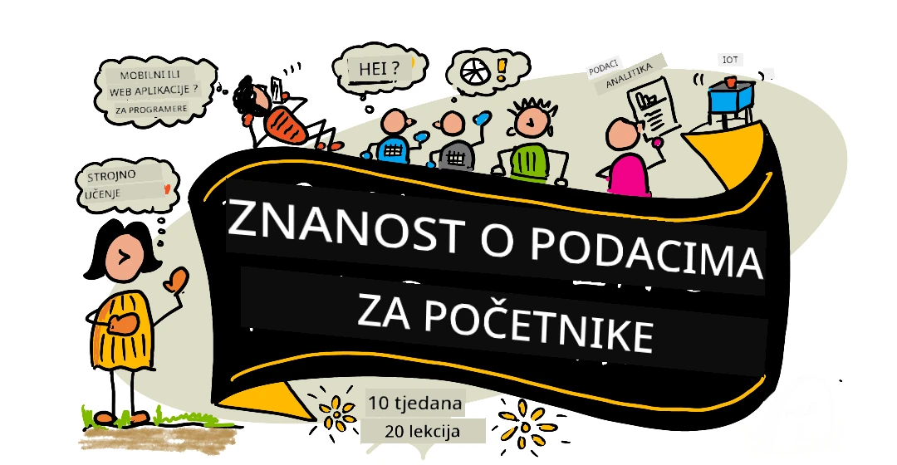
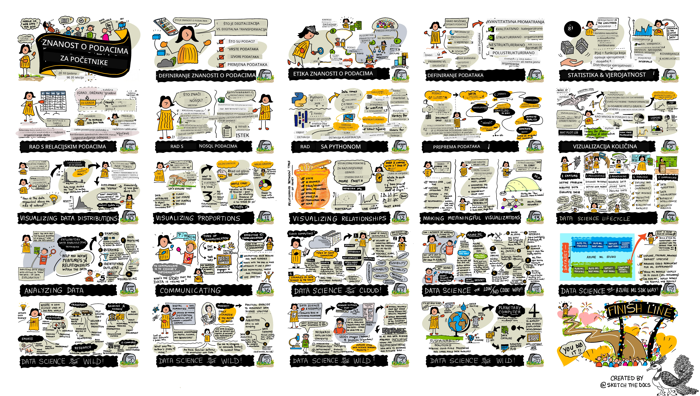

# Data Science za početnike - Nastavni plan

[](https://github.com/codespaces/new?hide_repo_select=true&ref=main&repo=344191198)

[](https://github.com/microsoft/Data-Science-For-Beginners/blob/master/LICENSE)
[](https://GitHub.com/microsoft/Data-Science-For-Beginners/graphs/contributors/)
[](https://GitHub.com/microsoft/Data-Science-For-Beginners/issues/)
[](https://GitHub.com/microsoft/Data-Science-For-Beginners/pulls/)
[](http://makeapullrequest.com)

[](https://GitHub.com/microsoft/Data-Science-For-Beginners/watchers/)
[](https://GitHub.com/microsoft/Data-Science-For-Beginners/network/)
[](https://GitHub.com/microsoft/Data-Science-For-Beginners/stargazers/)


[](https://discord.gg/nTYy5BXMWG)

[](https://aka.ms/foundry/forum)

Azure Cloud Advocates u Microsoftu s veseljem nude 10-tjedni, 20-lekcijski nastavni plan koji se bavi Data Science-om. Svaka lekcija uključuje kvizove prije i poslije lekcije, pisane upute za dovršetak lekcije, rješenje i zadatak. Naša projektno orijentirana pedagogija omogućava vam učenje dok gradite, što je dokazan način da nove vještine "vole zadržavati".

**Iskrene zahvale našim autorima:** [Jasmine Greenaway](https://www.twitter.com/paladique), [Dmitry Soshnikov](http://soshnikov.com), [Nitya Narasimhan](https://twitter.com/nitya), [Jalen McGee](https://twitter.com/JalenMcG), [Jen Looper](https://twitter.com/jenlooper), [Maud Levy](https://twitter.com/maudstweets), [Tiffany Souterre](https://twitter.com/TiffanySouterre), [Christopher Harrison](https://www.twitter.com/geektrainer).

**🙏 Posebna zahvala 🙏 našim autorima, recenzentima i suradnicima sadržaja iz [Microsoft Student Ambassador](https://studentambassadors.microsoft.com/),** posebno Aaryan Arora, [Aditya Garg](https://github.com/AdityaGarg00), [Alondra Sanchez](https://www.linkedin.com/in/alondra-sanchez-molina/), [Ankita Singh](https://www.linkedin.com/in/ankitasingh007), [Anupam Mishra](https://www.linkedin.com/in/anupam--mishra/), [Arpita Das](https://www.linkedin.com/in/arpitadas01/), ChhailBihari Dubey, [Dibri Nsofor](https://www.linkedin.com/in/dibrinsofor), [Dishita Bhasin](https://www.linkedin.com/in/dishita-bhasin-7065281bb), [Majd Safi](https://www.linkedin.com/in/majd-s/), [Max Blum](https://www.linkedin.com/in/max-blum-6036a1186/), [Miguel Correa](https://www.linkedin.com/in/miguelmque/), [Mohamma Iftekher (Iftu) Ebne Jalal](https://twitter.com/iftu119), [Nawrin Tabassum](https://www.linkedin.com/in/nawrin-tabassum), [Raymond Wangsa Putra](https://www.linkedin.com/in/raymond-wp/), [Rohit Yadav](https://www.linkedin.com/in/rty2423), Samridhi Sharma, [Sanya Sinha](https://www.linkedin.com/mwlite/in/sanya-sinha-13aab1200),
[Sheena Narula](https://www.linkedin.com/in/sheena-narua-n/), [Tauqeer Ahmad](https://www.linkedin.com/in/tauqeerahmad5201/), Yogendrasingh Pawar , [Vidushi Gupta](https://www.linkedin.com/in/vidushi-gupta07/), [Jasleen Sondhi](https://www.linkedin.com/in/jasleen-sondhi/)

||
|:---:|
| Data Science za početnike - _Sketchnote by [@nitya](https://twitter.com/nitya)_ |

### 🌐 Podrška za više jezika

#### Podržano putem GitHub Action (Automatski & Uvijek ažurno)

<!-- CO-OP TRANSLATOR LANGUAGES TABLE START -->
[Arabic](../ar/README.md) | [Bengali](../bn/README.md) | [Bulgarian](../bg/README.md) | [Burmese (Myanmar)](../my/README.md) | [Chinese (Simplified)](../zh-CN/README.md) | [Chinese (Traditional, Hong Kong)](../zh-HK/README.md) | [Chinese (Traditional, Macau)](../zh-MO/README.md) | [Chinese (Traditional, Taiwan)](../zh-TW/README.md) | [Croatian](./README.md) | [Czech](../cs/README.md) | [Danish](../da/README.md) | [Dutch](../nl/README.md) | [Estonian](../et/README.md) | [Finnish](../fi/README.md) | [French](../fr/README.md) | [German](../de/README.md) | [Greek](../el/README.md) | [Hebrew](../he/README.md) | [Hindi](../hi/README.md) | [Hungarian](../hu/README.md) | [Indonesian](../id/README.md) | [Italian](../it/README.md) | [Japanese](../ja/README.md) | [Kannada](../kn/README.md) | [Khmer](../km/README.md) | [Korean](../ko/README.md) | [Lithuanian](../lt/README.md) | [Malay](../ms/README.md) | [Malayalam](../ml/README.md) | [Marathi](../mr/README.md) | [Nepali](../ne/README.md) | [Nigerian Pidgin](../pcm/README.md) | [Norwegian](../no/README.md) | [Persian (Farsi)](../fa/README.md) | [Polish](../pl/README.md) | [Portuguese (Brazil)](../pt-BR/README.md) | [Portuguese (Portugal)](../pt-PT/README.md) | [Punjabi (Gurmukhi)](../pa/README.md) | [Romanian](../ro/README.md) | [Russian](../ru/README.md) | [Serbian (Cyrillic)](../sr/README.md) | [Slovak](../sk/README.md) | [Slovenian](../sl/README.md) | [Spanish](../es/README.md) | [Swahili](../sw/README.md) | [Swedish](../sv/README.md) | [Tagalog (Filipino)](../tl/README.md) | [Tamil](../ta/README.md) | [Telugu](../te/README.md) | [Thai](../th/README.md) | [Turkish](../tr/README.md) | [Ukrainian](../uk/README.md) | [Urdu](../ur/README.md) | [Vietnamese](../vi/README.md)

> **Preferirate li klonirati lokalno?**
>
> Ovaj repozitorij uključuje više od 50 jezika prijevoda što značajno povećava veličinu preuzimanja. Za kloniranje bez prijevoda, koristite sparse checkout:
>
> **Bash / macOS / Linux:**
> ```bash
> git clone --filter=blob:none --sparse https://github.com/microsoft/Data-Science-For-Beginners.git
> cd Data-Science-For-Beginners
> git sparse-checkout set --no-cone '/*' '!translations' '!translated_images'
> ```
>
> **CMD (Windows):**
> ```cmd
> git clone --filter=blob:none --sparse https://github.com/microsoft/Data-Science-For-Beginners.git
> cd Data-Science-For-Beginners
> git sparse-checkout set --no-cone "/*" "!translations" "!translated_images"
> ```
>
> Ovo vam daje sve što trebate za dovršetak tečaja sa znatno bržim preuzimanjem.
<!-- CO-OP TRANSLATOR LANGUAGES TABLE END -->

**Ako želite imati dodatne podržane jezike prijevoda navedene su [ovdje](https://github.com/Azure/co-op-translator/blob/main/getting_started/supported-languages.md)**

#### Pridružite se našoj zajednici
[](https://discord.gg/nTYy5BXMWG)

Imamo aktivnu Discord seriju "učimo s AI-jem", saznajte više i pridružite nam se na [Learn with AI Series](https://aka.ms/learnwithai/discord) od 18. do 30. rujna 2025. Učit ćete savjete i trikove za korištenje GitHub Copilota za Data Science.


# Jeste li student?

Započnite s sljedećim resursima:

- [Student Hub stranica](https://docs.microsoft.com/en-gb/learn/student-hub?WT.mc_id=academic-77958-bethanycheum) Na ovoj stranici pronaći ćete resurse za početnike, studentske pakete pa čak i načine za dobivanje besplatnog certifikacijskog vaučera. Ovo je stranica koju ćete htjeti označiti i s vremena na vrijeme provjeravati jer mijenjamo sadržaj barem jednom mjesečno.
- [Microsoft Learn Student Ambassadors](https://studentambassadors.microsoft.com?WT.mc_id=academic-77958-bethanycheum) Pridružite se globalnoj zajednici studentskih ambasadora, ovo bi mogao biti vaš put u Microsoft.

# Početak rada

## 📚 Dokumentacija

- **[Vodič za instalaciju](INSTALLATION.md)** - Korak po korak upute za početnike
- **[Vodič za korištenje](USAGE.md)** - Primjeri i uobičajeni tijekovi rada
- **[Rješavanje problema](TROUBLESHOOTING.md)** - Rješenja za uobičajene probleme
- **[Vodič za doprinos](CONTRIBUTING.md)** - Kako doprinijeti ovom projektu
- **[Za nastavnike](for-teachers.md)** - Smjernice za podučavanje i resursi za učionicu

## 👨‍🎓 Za studente
> **Potpuni početnici**: Novi ste u data science-u? Počnite s našim [primjerima prilagođenim početnicima](examples/README.md)! Ovi jednostavni, dobro komentirani primjeri pomoći će vam razumjeti osnove prije nego što zaronite u cijeli nastavni plan.
> **[Studenti](https://aka.ms/student-page)**: kako biste koristili ovaj nastavni plan samostalno, forknite cijeli repozitorij i dovršite zadatke sami, počevši s predavanjem kviza. Zatim pročitajte lekciju i izvršite ostale aktivnosti. Pokušajte stvarati projekte razumijevajući lekcije umjesto kopiranja koda rješenja; međutim, taj kod je dostupan u /solutions mapama u svakoj lekciji usmjerenoj na projekte. Druga ideja je formirati grupu za učenje s prijateljima i zajedno prolaziti kroz sadržaj. Za daljnje učenje preporučujemo [Microsoft Learn](https://docs.microsoft.com/en-us/users/jenlooper-2911/collections/qprpajyoy3x0g7?WT.mc_id=academic-77958-bethanycheum).

**Brzi početak:**
1. Pogledajte [Vodič za instalaciju](INSTALLATION.md) za postavljanje okruženja
2. Pregledajte [Vodič za korištenje](USAGE.md) kako biste naučili kako raditi s nastavnim planom
3. Započnite s Lekcijom 1 i radite redom
4. Pridružite se našoj [Discord zajednici](https://aka.ms/ds4beginners/discord) za podršku

## 👩‍🏫 Za nastavnike
> **Nastavnici**: uključili smo [neke prijedloge](for-teachers.md) kako koristiti ovaj kurikulum. Voljeli bismo vaše povratne informacije [u našem forumu za raspravu](https://github.com/microsoft/Data-Science-For-Beginners/discussions)!

## Upoznajte tim

[](https://youtu.be/8mzavjQSMM4 "Promo video")

**Gif autor** [Mohit Jaisal](https://www.linkedin.com/in/mohitjaisal)

> 🎥 Kliknite na sliku iznad za video o projektu i ljudima koji su ga stvorili!

## Pedagogija

Odabrali smo dva pedagoška načela prilikom izrade ovog kurikuluma: osigurati da je projektno orijentiran i da uključuje česte kvizove. Do kraja ovog niza, studenti će naučiti osnovna načela znanosti o podatcima, uključujući etičke koncepte, pripremu podataka, različite načine rada s podacima, vizualizaciju podataka, analizu podataka, primjere iz stvarnog svijeta za znanost o podatcima i još mnogo toga.

Osim toga, kviz s niskim ulozima prije nastave postavlja namjeru učenika za učenje teme, dok drugi kviz nakon nastave osigurava daljnje zadržavanje znanja. Ovaj kurikulum je dizajniran da bude fleksibilan i zabavan te se može koristiti u cijelosti ili djelomično. Projekti počinju mali i postaju sve složeniji do kraja 10-tjednog ciklusa.

> Pronađite naš [Kodeks ponašanja](CODE_OF_CONDUCT.md), [Upute za doprinos](CONTRIBUTING.md), [Pravila prevođenja](TRANSLATIONS.md). Dobrodošle su vaše konstruktivne povratne informacije!

## Svaka lekcija uključuje:

- Opcionalnu skicu bilješke
- Opcionalni dodatni video
- Kviz za zagrijavanje prije lekcije
- Pisanu lekciju
- Za lekcije temeljene na projektima, vodiče korak-po-korak kako izgraditi projekt
- Provjere znanja
- Izazov
- Dodatno čitanje
- Zadatak
- [Kviz nakon lekcije](https://ff-quizzes.netlify.app/en/)

> **Napomena o kvizovima**: Svi kvizovi nalaze se u mapi Quiz-App, ukupno 40 kvizova s po tri pitanja. Povezani su unutar lekcija, ali se kviz aplikacija može pokrenuti lokalno ili implementirati na Azure; slijedite upute u mapi `quiz-app`. Postupno se lokaliziraju.

## 🎓 Primjeri prilagođeni početnicima

**Novi ste u znanosti o podatcima?** Kreirali smo poseban [direktorij primjera](examples/README.md) s jednostavnim, dobro komentiranim kodom kako bismo vam pomogli započeti:

- 🌟 **Hello World** - Vaš prvi program iz znanosti o podatcima
- 📂 **Učitavanje podataka** - Naučite čitati i istraživati skupove podataka
- 📊 **Jednostavna analiza** - Izračunajte statistiku i pronađite uzorke
- 📈 **Osnovna vizualizacija** - Kreirajte grafikone i dijagrame
- 🔬 **Projekt iz stvarnog svijeta** - Kompletan tijek rada od početka do kraja

Svaki primjer uključuje detaljne komentare koji objašnjavaju svaki korak, što ga čini savršenim za apsolutne početnike!

👉 **[Započnite s primjerima](examples/README.md)** 👈

## Lekcije


||
|:---:|
| Znanost o Podacima za Početnike: Plan puta - _Sketchnote od [@nitya](https://twitter.com/nitya)_ |


| Broj lekcije | Tema | Grupiranje lekcija | Ciljevi učenja | Povezana lekcija | Autor |
| :-----------: | :----------------------------------------: | :--------------------------------------------------: | :-----------------------------------------------------------------------------------------------------------------------------------------------------------------------: | :---------------------------------------------------------------------: | :----: |
| 01 | Definiranje znanosti o podacima | [Uvod](1-Introduction/README.md) | Naučite osnovne koncepte znanosti o podacima i kako su povezani s umjetnom inteligencijom, strojnim učenjem i big data tehnologijama. | [lekcija](1-Introduction/01-defining-data-science/README.md) [video](https://youtu.be/beZ7Mb_oz9I) | [Dmitry](http://soshnikov.com) |
| 02 | Etika u znanosti o podacima | [Uvod](1-Introduction/README.md) | Koncepti, izazovi i okviri etike podataka. | [lekcija](1-Introduction/02-ethics/README.md) | [Nitya](https://twitter.com/nitya) |
| 03 | Definiranje podataka | [Uvod](1-Introduction/README.md) | Kako se podaci klasificiraju i njihovi uobičajeni izvori. | [lekcija](1-Introduction/03-defining-data/README.md) | [Jasmine](https://www.twitter.com/paladique) |
| 04 | Uvod u statistiku i vjerojatnost | [Uvod](1-Introduction/README.md) | Matematičke tehnike vjerojatnosti i statistike za razumijevanje podataka. | [lekcija](1-Introduction/04-stats-and-probability/README.md) [video](https://youtu.be/Z5Zy85g4Yjw) | [Dmitry](http://soshnikov.com) |
| 05 | Rad s relacijskim podacima | [Rad s podacima](2-Working-With-Data/README.md) | Uvod u relacijske podatke i osnove istraživanja i analize relacijskih podataka koristeći strukturirani upitni jezik, poznat kao SQL (izgovara se “see-quell”). | [lekcija](2-Working-With-Data/05-relational-databases/README.md) | [Christopher](https://www.twitter.com/geektrainer) | | |
| 06 | Rad s NoSQL podacima | [Rad s podacima](2-Working-With-Data/README.md) | Uvod u nrelacijske podatke, njihove različite vrste i osnove istraživanja i analize baza dokumenata. | [lekcija](2-Working-With-Data/06-non-relational/README.md) | [Jasmine](https://twitter.com/paladique)|
| 07 | Rad s Pythonom | [Rad s podacima](2-Working-With-Data/README.md) | Osnove korištenja Pythona za istraživanje podataka s bibliotekama poput Pandas. Preporuča se osnovno razumijevanje programiranja u Pythonu. | [lekcija](2-Working-With-Data/07-python/README.md) [video](https://youtu.be/dZjWOGbsN4Y) | [Dmitry](http://soshnikov.com) |
| 08 | Priprema podataka | [Rad s podacima](2-Working-With-Data/README.md) | Tematika tehnika za čišćenje i transformaciju podataka kako bi se nosili s izazovima poput nedostajućih, netočnih ili nepotpunih podataka. | [lekcija](2-Working-With-Data/08-data-preparation/README.md) | [Jasmine](https://www.twitter.com/paladique) |
| 09 | Vizualizacija količina | [Vizualizacija podataka](3-Data-Visualization/README.md) | Naučite kako koristiti Matplotlib za vizualizaciju podataka o pticama 🦆 | [lekcija](3-Data-Visualization/09-visualization-quantities/README.md) | [Jen](https://twitter.com/jenlooper) |
| 10 | Vizualizacija raspodjela podataka | [Vizualizacija podataka](3-Data-Visualization/README.md) | Vizualizacija opažanja i trendova unutar intervala. | [lekcija](3-Data-Visualization/10-visualization-distributions/README.md) | [Jen](https://twitter.com/jenlooper) |
| 11 | Vizualizacija proporcija | [Vizualizacija podataka](3-Data-Visualization/README.md) | Vizualizacija diskretnih i grupiranih postotaka. | [lekcija](3-Data-Visualization/11-visualization-proportions/README.md) | [Jen](https://twitter.com/jenlooper) |
| 12 | Vizualizacija odnosa | [Vizualizacija podataka](3-Data-Visualization/README.md) | Vizualizacija veza i korelacija između skupova podataka i njihovih varijabli. | [lekcija](3-Data-Visualization/12-visualization-relationships/README.md) | [Jen](https://twitter.com/jenlooper) |
| 13 | Značajne vizualizacije | [Vizualizacija podataka](3-Data-Visualization/README.md) | Tehnike i smjernice za izradu vrijednih vizualizacija za učinkovito rješavanje problema i uvide. | [lekcija](3-Data-Visualization/13-meaningful-visualizations/README.md) | [Jen](https://twitter.com/jenlooper) |
| 14 | Uvod u životni ciklus znanosti o podacima | [Životni ciklus](4-Data-Science-Lifecycle/README.md) | Uvod u životni ciklus znanosti o podacima i prvi korak prikupljanja i ekstrakcije podataka. | [lekcija](4-Data-Science-Lifecycle/14-Introduction/README.md) | [Jasmine](https://twitter.com/paladique) |
| 15 | Analiza | [Životni ciklus](4-Data-Science-Lifecycle/README.md) | Ova faza životnog ciklusa znanosti o podacima fokusira se na tehnike analize podataka. | [lekcija](4-Data-Science-Lifecycle/15-analyzing/README.md) | [Jasmine](https://twitter.com/paladique) | | |
| 16 | Komunikacija | [Životni ciklus](4-Data-Science-Lifecycle/README.md) | Ova faza životnog ciklusa znanosti o podacima fokusira se na prezentaciju spoznaja iz podataka na način koji olakšava donošenje odluka. | [lekcija](4-Data-Science-Lifecycle/16-communication/README.md) | [Jalen](https://twitter.com/JalenMcG) | | |
| 17 | Znanost o podacima u oblaku | [Podaci u oblaku](5-Data-Science-In-Cloud/README.md) | Ovaj niz lekcija uvodi znanost o podacima u oblaku i njezine prednosti. | [lekcija](5-Data-Science-In-Cloud/17-Introduction/README.md) | [Tiffany](https://twitter.com/TiffanySouterre) i [Maud](https://twitter.com/maudstweets) |
| 18 | Znanost o podacima u oblaku | [Podaci u oblaku](5-Data-Science-In-Cloud/README.md) | Treniranje modela pomoću Low Code alata. |[lekcija](5-Data-Science-In-Cloud/18-Low-Code/README.md) | [Tiffany](https://twitter.com/TiffanySouterre) i [Maud](https://twitter.com/maudstweets) |
| 19 | Znanost o podacima u oblaku | [Podaci u oblaku](5-Data-Science-In-Cloud/README.md) | Implementacija modela s Azure Machine Learning Studijom. | [lekcija](5-Data-Science-In-Cloud/19-Azure/README.md)| [Tiffany](https://twitter.com/TiffanySouterre) i [Maud](https://twitter.com/maudstweets) |
| 20 | Znanost o podacima u stvarnom svijetu | [U stvarnom svijetu](6-Data-Science-In-Wild/README.md) | Projekti vođeni znanošću o podacima u stvarnim situacijama. | [lekcija](6-Data-Science-In-Wild/20-Real-World-Examples/README.md) | [Nitya](https://twitter.com/nitya) |

## GitHub Codespaces

Slijedite ove korake za otvaranje ovog primjera u Codespaceu:
1. Kliknite na padajući izbornik Code i odaberite opciju Open with Codespaces.
2. Odaberite + New codespace na dnu okna.
Za dodatne informacije pogledajte [GitHub dokumentaciju](https://docs.github.com/en/codespaces/developing-in-codespaces/creating-a-codespace-for-a-repository#creating-a-codespace).

## VSCode Remote - Containers
Slijedite ove korake da otvorite ovaj repozitorij u kontejneru na svom lokalnom računalu koristeći VSCode i ekstenziju VS Code Remote - Containers:

1. Ako prvi put koristite razvojni kontejner, provjerite ispunjava li vaš sustav preduvjete (npr. instaliran Docker) u [dokumentaciji za početak rada](https://code.visualstudio.com/docs/devcontainers/containers#_getting-started).

Za korištenje ovog repozitorija, možete otvoriti repozitorij u izoliranom Docker volumenu:

**Napomena**: Iza scene, koristi se Remote-Containers: **Clone Repository in Container Volume...** naredba za kloniranje izvornog koda u Docker volumen umjesto u lokalni sustav datoteka. [Volumeni](https://docs.docker.com/storage/volumes/) su preferirani mehanizam za trajno pohranjivanje podataka kontejnera.

Ili otvorite lokalno kloniranu ili preuzetu verziju repozitorija:

- Klonirajte ovaj repozitorij na lokalni disk.
- Pritisnite F1 i odaberite naredbu **Remote-Containers: Open Folder in Container...**.
- Odaberite kloniranu kopiju ove mape, pričekajte da se kontejner pokrene i isprobajte.

## Pristup bez interneta

Možete pokrenuti ovu dokumentaciju offline koristeći [Docsify](https://docsify.js.org/#/). Forkajte ovaj repozitorij, [instalirajte Docsify](https://docsify.js.org/#/quickstart) na svom lokalnom računalu, zatim u glavnoj mapi repozitorija upišite `docsify serve`. Web stranica će biti poslužena na portu 3000 na vašem localhostu: `localhost:3000`.

> Napomena, bilježnice se neće prikazivati preko Docsify, pa ih pokrećite zasebno u VS Codeu s Python kernelom.

## Ostali kurikulumi

Naš tim proizvodi i druge kurikulume! Pogledajte:

<!-- CO-OP TRANSLATOR OTHER COURSES START -->
### LangChain
[](https://aka.ms/langchain4j-for-beginners)
[](https://aka.ms/langchainjs-for-beginners?WT.mc_id=m365-94501-dwahlin)
[](https://github.com/microsoft/langchain-for-beginners?WT.mc_id=m365-94501-dwahlin)
---

### Azure / Edge / MCP / Agent
[](https://github.com/microsoft/AZD-for-beginners?WT.mc_id=academic-105485-koreyst)
[](https://github.com/microsoft/edgeai-for-beginners?WT.mc_id=academic-105485-koreyst)
[](https://github.com/microsoft/mcp-for-beginners?WT.mc_id=academic-105485-koreyst)
[](https://github.com/microsoft/ai-agents-for-beginners?WT.mc_id=academic-105485-koreyst)

---
 
### Serija Generativnog AI
[](https://github.com/microsoft/generative-ai-for-beginners?WT.mc_id=academic-105485-koreyst)
[-9333EA?style=for-the-badge&labelColor=E5E7EB&color=9333EA)](https://github.com/microsoft/Generative-AI-for-beginners-dotnet?WT.mc_id=academic-105485-koreyst)
[-C084FC?style=for-the-badge&labelColor=E5E7EB&color=C084FC)](https://github.com/microsoft/generative-ai-for-beginners-java?WT.mc_id=academic-105485-koreyst)
[-E879F9?style=for-the-badge&labelColor=E5E7EB&color=E879F9)](https://github.com/microsoft/generative-ai-with-javascript?WT.mc_id=academic-105485-koreyst)

---
 
### Osnovno učenje
[](https://aka.ms/ml-beginners?WT.mc_id=academic-105485-koreyst)
[](https://aka.ms/datascience-beginners?WT.mc_id=academic-105485-koreyst)
[](https://aka.ms/ai-beginners?WT.mc_id=academic-105485-koreyst)
[](https://github.com/microsoft/Security-101?WT.mc_id=academic-96948-sayoung)
[](https://aka.ms/webdev-beginners?WT.mc_id=academic-105485-koreyst)
[](https://aka.ms/iot-beginners?WT.mc_id=academic-105485-koreyst)
[](https://github.com/microsoft/xr-development-for-beginners?WT.mc_id=academic-105485-koreyst)

---
 
### Serija Copilot
[](https://aka.ms/GitHubCopilotAI?WT.mc_id=academic-105485-koreyst)
[](https://github.com/microsoft/mastering-github-copilot-for-dotnet-csharp-developers?WT.mc_id=academic-105485-koreyst)
[](https://github.com/microsoft/CopilotAdventures?WT.mc_id=academic-105485-koreyst)
<!-- CO-OP TRANSLATOR OTHER COURSES END -->

## Dobivanje pomoći

**Imate problema?** Pogledajte naš [Vodič za rješavanje problema](TROUBLESHOOTING.md) za rješenja čestih poteškoća.

Ako zapnete ili imate pitanja o izradi AI aplikacija, pridružite se ostalim učenicima i iskusnim programerima u raspravama o MCP-u. To je podržavajuća zajednica gdje su pitanja dobrodošla i znanje se slobodno dijeli.

[](https://discord.gg/nTYy5BXMWG)

Ako imate povratne informacije o proizvodu ili prijavljujete pogreške tijekom izrade, posjetite:

[](https://aka.ms/foundry/forum)

---

<!-- CO-OP TRANSLATOR DISCLAIMER START -->
**Odricanje od odgovornosti**:  
Ovaj je dokument preveden pomoću AI usluge za prijevod [Co-op Translator](https://github.com/Azure/co-op-translator). Iako težimo točnosti, imajte na umu da automatski prijevodi mogu sadržavati pogreške ili netočnosti. Izvorni dokument na izvornom jeziku smatra se ovlaštenim izvorom. Za kritične informacije preporučuje se profesionalni ljudski prijevod. Nismo odgovorni za bilo kakva nesporazuma ili pogrešna tumačenja proizašla iz korištenja ovog prijevoda.
<!-- CO-OP TRANSLATOR DISCLAIMER END -->