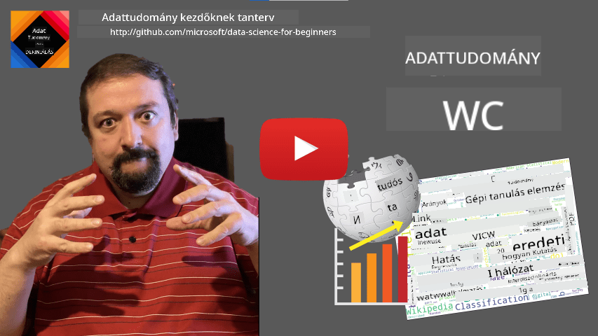
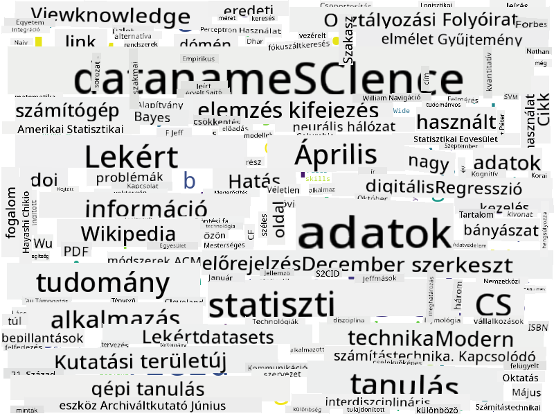

<!--
CO_OP_TRANSLATOR_METADATA:
{
  "original_hash": "43212cc1ac137b7bb1dcfb37ca06b0f4",
  "translation_date": "2025-10-25T19:04:00+00:00",
  "source_file": "1-Introduction/01-defining-data-science/README.md",
  "language_code": "hu"
}
-->
# Az adattudomány meghatározása

|  ](../../sketchnotes/01-Definitions.png) |
| :----------------------------------------------------------------------------------------------------: |
|              Az adattudomány meghatározása - _Sketchnote készítette: [@nitya](https://twitter.com/nitya)_               |

---

## [Előadás előtti kvíz](https://ff-quizzes.netlify.app/en/ds/quiz/0)

## Mi az adat?
Mindennapi életünkben folyamatosan körülvesz minket az adat. Az a szöveg, amit most olvasol, adat. A barátaid telefonszámainak listája a telefonodban adat, ahogy az órádon megjelenő aktuális idő is. Emberként természetes módon dolgozunk az adatokkal, például amikor megszámoljuk a pénzünket, vagy levelet írunk a barátainknak.

Az adatok azonban sokkal fontosabbá váltak a számítógépek megjelenésével. A számítógépek elsődleges szerepe a számítások elvégzése, de ehhez adatokra van szükségük. Ezért fontos megértenünk, hogyan tárolják és dolgozzák fel az adatokat a számítógépek.

Az internet megjelenésével a számítógépek adatkezelő eszközként betöltött szerepe megnőtt. Ha belegondolsz, manapság egyre inkább adatfeldolgozásra és kommunikációra használjuk a számítógépeket, nem pedig tényleges számításokra. Amikor e-mailt írunk egy barátunknak, vagy információt keresünk az interneten, lényegében adatokat hozunk létre, tárolunk, továbbítunk és manipulálunk.
> Emlékszel, mikor használtad utoljára a számítógépet tényleges számításra?

## Mi az adattudomány?

A [Wikipédia](https://en.wikipedia.org/wiki/Data_science) szerint az **adattudomány** egy *tudományos terület, amely tudományos módszereket alkalmaz az adatokból származó tudás és betekintések kinyerésére, valamint az adatokból származó tudás és gyakorlati betekintések alkalmazására különböző alkalmazási területeken*.

Ez a definíció az adattudomány következő fontos aspektusait emeli ki:

* Az adattudomány fő célja az, hogy **tudást nyerjen ki** az adatokból, más szóval - hogy **megértse** az adatokat, rejtett összefüggéseket találjon, és **modellt** építsen.
* Az adattudomány **tudományos módszereket** használ, például valószínűséget és statisztikát. Valójában, amikor az *adattudomány* kifejezést először bevezették, néhányan azt állították, hogy az adattudomány csupán a statisztika egy új, divatos neve. Manapság azonban nyilvánvalóvá vált, hogy a terület sokkal szélesebb körű.
* A megszerzett tudást **gyakorlati betekintések** előállítására kell alkalmazni, azaz olyan gyakorlati következtetésekre, amelyeket valós üzleti helyzetekben lehet alkalmazni.
* Képesnek kell lennünk mind **strukturált**, mind **strukturálatlan** adatokkal dolgozni. A kurzus későbbi részében visszatérünk az adatok különböző típusainak megvitatására.
* Az **alkalmazási terület** fontos fogalom, és az adatelemzőknek gyakran legalább bizonyos fokú szakértelemmel kell rendelkezniük az adott problématerületen, például pénzügyek, orvostudomány, marketing stb.

> Az adattudomány egy másik fontos aspektusa, hogy tanulmányozza, hogyan lehet adatokat gyűjteni, tárolni és feldolgozni számítógépek segítségével. Míg a statisztika matematikai alapokat ad, az adattudomány ezeket a matematikai fogalmakat alkalmazza, hogy ténylegesen betekintéseket nyerjen az adatokból.

Az adattudomány egyik megközelítése (amelyet [Jim Gray](https://en.wikipedia.org/wiki/Jim_Gray_(computer_scientist)) nevéhez kötnek), hogy külön tudományos paradigmának tekintjük:
* **Empirikus**, amelyben főként megfigyelésekre és kísérletek eredményeire támaszkodunk
* **Elméleti**, ahol új fogalmak a meglévő tudományos ismeretekből származnak
* **Számítógépes**, ahol új elveket fedezünk fel számítógépes kísérletek alapján
* **Adatvezérelt**, amely az adatokban rejlő összefüggések és mintázatok felfedezésén alapul  

## Kapcsolódó területek

Mivel az adatok mindenhol jelen vannak, az adattudomány maga is egy széles terület, amely számos más tudományágat érint.

<dl>
<dt>Adatbázisok</dt>
<dd>
Egy kritikus szempont az, hogy <b>hogyan tároljuk</b> az adatokat, azaz hogyan strukturáljuk őket úgy, hogy gyorsabb feldolgozást tegyenek lehetővé. Különböző típusú adatbázisok léteznek, amelyek strukturált és strukturálatlan adatokat tárolnak, amelyeket <a href="../../2-Working-With-Data/README.md">a kurzus során megvizsgálunk</a>.
</dd>
<dt>Big Data</dt>
<dd>
Gyakran nagyon nagy mennyiségű, viszonylag egyszerű struktúrájú adatot kell tárolnunk és feldolgoznunk. Különleges megközelítések és eszközök léteznek, amelyek lehetővé teszik az adatok elosztott tárolását számítógépes klasztereken, és hatékony feldolgozását.
</dd>
<dt>Gépi tanulás</dt>
<dd>
Az adatok megértésének egyik módja, ha <b>modellt építünk</b>, amely képes előre jelezni a kívánt eredményt. Az adatokból származó modellek fejlesztését <b>gépi tanulásnak</b> nevezzük. Érdemes lehet megnézni <a href="https://aka.ms/ml-beginners">Gépi tanulás kezdőknek</a> tananyagunkat, hogy többet megtudj róla.
</dd>
<dt>Mesterséges intelligencia</dt>
<dd>
A gépi tanulás egyik területe, amelyet mesterséges intelligenciának (MI) neveznek, szintén az adatokra támaszkodik, és magában foglalja az emberi gondolkodási folyamatokat utánzó, nagy komplexitású modellek építését. Az MI módszerek gyakran lehetővé teszik, hogy strukturálatlan adatokat (pl. természetes nyelvet) strukturált betekintésekké alakítsunk.
</dd>
<dt>Vizualizáció</dt>
<dd>
A hatalmas mennyiségű adat az ember számára érthetetlen lehet, de ha hasznos vizualizációkat készítünk az adatokból, könnyebben megérthetjük azokat, és következtetéseket vonhatunk le. Ezért fontos, hogy sokféle információvizualizációs módszert ismerjünk - ezt a <a href="../../3-Data-Visualization/README.md">kurzus 3. szakaszában</a> fogjuk tárgyalni. Kapcsolódó területek közé tartozik az <b>infografika</b> és általában az <b>ember-számítógép interakció</b>.
</dd>
</dl>

## Az adatok típusai

Ahogy már említettük, az adatok mindenhol ott vannak. Csak megfelelő módon kell őket rögzíteni! Hasznos megkülönböztetni a **strukturált** és **strukturálatlan** adatokat. Az előbbi általában valamilyen jól strukturált formában jelenik meg, gyakran táblázatként vagy táblázatok sorozataként, míg az utóbbi csupán fájlok gyűjteménye. Néha beszélhetünk **félstrukturált** adatokról is, amelyeknek van valamilyen szerkezete, de az nagyban változhat.

| Strukturált                                                                   | Félstrukturált                                                                                | Strukturálatlan                            |
| ---------------------------------------------------------------------------- | ---------------------------------------------------------------------------------------------- | --------------------------------------- |
| Emberek listája telefonszámaikkal                                      | Wikipédia oldalak hivatkozásokkal                                                                     | Az Encyclopedia Britannica szövege        |
| Egy épület összes szobájának hőmérséklete minden percben az elmúlt 20 évben | Tudományos cikkek gyűjteménye JSON formátumban, szerzőkkel, publikáció dátumával és absztrakttal | Vállalati dokumentumokat tartalmazó fájlmegosztás     |
| Az épületbe belépő emberek életkora és neme                  | Internetes oldalak                                                                                 | Nyers videófelvétel biztonsági kameráról |

## Hol találhatók adatok?

Számos lehetséges adatforrás létezik, és lehetetlen lenne mindet felsorolni! Azonban említsünk meg néhány tipikus helyet, ahol adatokat találhatunk:

* **Strukturált**
  - **Internet of Things** (IoT), beleértve a különböző érzékelőkből származó adatokat, mint például hőmérséklet- vagy nyomásérzékelők, amelyek sok hasznos adatot szolgáltatnak. Például, ha egy irodaház IoT érzékelőkkel van felszerelve, automatikusan szabályozhatjuk a fűtést és a világítást a költségek minimalizálása érdekében.
  - **Kérdőívek**, amelyeket a felhasználóktól kérünk kitölteni egy vásárlás vagy egy weboldal meglátogatása után.
  - **Viselkedés elemzése** például segíthet megérteni, hogy egy felhasználó milyen mélyen merül el egy weboldalon, és mi az oldal elhagyásának tipikus oka.
* **Strukturálatlan**
  - **Szövegek** gazdag információforrást jelenthetnek, például általános **érzelmi értékelést**, kulcsszavak és szemantikai jelentés kinyerését.
  - **Képek** vagy **videók**. Egy biztonsági kamera videója felhasználható az út forgalmának becslésére, és az emberek tájékoztatására a lehetséges forgalmi dugókról.
  - Webszerver **naplók** felhasználhatók annak megértésére, hogy weboldalunk mely oldalait látogatják meg leggyakrabban, és mennyi ideig.
* Félstrukturált
  - **Közösségi hálózatok** grafikonjai nagyszerű adatforrások lehetnek a felhasználók személyiségéről és az információ terjesztésének potenciális hatékonyságáról.
  - Ha van egy csomó fényképünk egy buliról, megpróbálhatunk **csoportdinamikai** adatokat kinyerni azáltal, hogy grafikonokat készítünk az emberekről, akik egymással fényképezkedtek.

Ha ismered az adatok különböző lehetséges forrásait, megpróbálhatsz különböző forgatókönyveket elképzelni, ahol az adatelemzési technikák alkalmazhatók a helyzet jobb megértésére és az üzleti folyamatok javítására.

## Mit lehet kezdeni az adatokkal?

Az adattudományban az adatfeldolgozás következő lépéseire összpontosítunk:

<dl>
<dt>1) Adatgyűjtés</dt>
<dd>
Az első lépés az adatok összegyűjtése. Sok esetben ez egy egyszerű folyamat lehet, például amikor az adatok egy webalkalmazásból érkeznek az adatbázisba, de néha speciális technikákra van szükség. Például az IoT érzékelőkből származó adatok túlterhelőek lehetnek, és jó gyakorlat az IoT Hubhoz hasonló pufferelő végpontok használata az adatok összegyűjtésére a további feldolgozás előtt.
</dd>
<dt>2) Adattárolás</dt>
<dd>
Az adatok tárolása kihívást jelenthet, különösen, ha nagy mennyiségű adatról van szó. Amikor eldöntjük, hogyan tároljuk az adatokat, érdemes előre gondolkodni arról, hogy a jövőben hogyan szeretnénk lekérdezni az adatokat. Az adatok tárolásának több módja van:
<ul>
<li>Relációs adatbázis táblák gyűjteményét tárolja, és egy speciális nyelvet, az SQL-t használja azok lekérdezésére. Általában a táblákat különböző csoportokba, úgynevezett sémákba szervezik. Sok esetben az adatokat az eredeti formájukból át kell alakítani, hogy illeszkedjenek a sémához.</li>
<li><a href="https://en.wikipedia.org/wiki/NoSQL">A NoSQL</a> adatbázis, mint például a <a href="https://azure.microsoft.com/services/cosmos-db/?WT.mc_id=academic-77958-bethanycheum">CosmosDB</a>, nem kényszerít sémákat az adatokra, és lehetővé teszi összetettebb adatok, például hierarchikus JSON dokumentumok vagy grafikonok tárolását. Azonban a NoSQL adatbázisok nem rendelkeznek az SQL gazdag lekérdezési képességeivel, és nem tudják biztosítani a referenciális integritást, azaz a táblákban lévő adatok szerkezetére és a táblák közötti kapcsolatokra vonatkozó szabályokat.</li>
<li><a href="https://en.wikipedia.org/wiki/Data_lake">Adattó</a> tárolás nagy mennyiségű, nyers, strukturálatlan adat gyűjteményére szolgál. Az adattavakat gyakran használják nagy adatokkal, ahol az összes adat nem fér el egy gépen, és egy szerverekből álló klaszternek kell tárolnia és feldolgoznia azokat. <a href="https://en.wikipedia.org/wiki/Apache_Parquet">Parquet</a> az adatformátum, amelyet gyakran használnak nagy adatokkal együtt.</li> 
</ul>
</dd>
<dt>3) Adatfeldolgozás</dt>
<dd>
Ez az adatfeldolgozás legizgalmasabb része, amely magában foglalja az adatok eredeti formájának átalakítását olyan formára, amely vizualizációhoz vagy modellképzéshez használható. Amikor strukturálatlan adatokkal, például szövegekkel vagy képekkel dolgozunk, előfordulhat, hogy néhány MI technikát kell alkalmaznunk az adatokból <b>jellemzőket</b> kinyerni, így azokat strukturált formává alakítva.
</dd>
<dt>4) Vizualizáció / Emberi betekintés</dt>
<dd>
Gyakran, hogy megértsük az adatokat, vizualizálnunk kell őket. Ha sok különböző vizualizációs technikát ismerünk, megtalálhatjuk a megfelelő nézetet, hogy betekintést nyerjünk. Gyakran az adatelemzőnek "játszania kell az adatokkal", többször vizualizálva azokat, és keresve az összefüggéseket. Emellett statisztikai technikákat is alkalmazhatunk hipotézisek tesztelésére vagy korrelációk bizonyítására az adatok különböző részei között.   
</dd>
<dt>5) Prediktív modell képzése</dt>
<dd>
Mivel az adatelemzés végső célja, hogy képesek legyünk döntéseket hozni az adatok alapján, érdemes lehet <a href="http://github.com/microsoft/ml-for-beginners">gépi tanulási</a> technikákat alkalmazni egy prediktív modell felépítéséhez. Ezt követően ezt a modellt használhatjuk előrejelzések készítésére hasonló szerkezetű új adathalmazokkal.
</dd>
</dl>

Természetesen az aktuális adatoktól függően néhány lépés hiányozhat (például, amikor
> Vitathatod, hogy ez a megközelítés nem ideális, mivel a modulok különböző hosszúságúak lehetnek. Valószínűleg igazságosabb lenne az időt elosztani a modul hosszával (karakterek számával), és az így kapott értékeket összehasonlítani.

Amikor elkezdjük elemezni a feleletválasztós tesztek eredményeit, megpróbálhatjuk meghatározni, hogy mely fogalmak megértése okoz nehézséget a diákoknak, és ezt az információt felhasználhatjuk a tartalom javítására. Ehhez úgy kell megterveznünk a teszteket, hogy minden kérdés egy adott fogalomhoz vagy tudáselemhez kapcsolódjon.

Ha még bonyolultabbá szeretnénk tenni az elemzést, ábrázolhatjuk az egyes modulok elvégzéséhez szükséges időt a diákok korcsoportjai szerint. Kiderülhet, hogy bizonyos korcsoportok számára aránytalanul hosszú időt vesz igénybe a modul elvégzése, vagy hogy a diákok még a befejezés előtt abbahagyják. Ez segíthet abban, hogy korosztályi ajánlásokat adjunk a modulhoz, és minimalizáljuk az emberek elégedetlenségét a téves elvárások miatt.

## 🚀 Kihívás

Ebben a kihívásban megpróbálunk a Data Science területéhez kapcsolódó fogalmakat azonosítani szövegek elemzésével. Egy Wikipedia-cikket fogunk használni a Data Science témájában, letöltjük és feldolgozzuk a szöveget, majd készítünk egy szófelhőt, amely így néz ki:

Látogass el a [`notebook.ipynb`](../../../../1-Introduction/01-defining-data-science/notebook.ipynb ':ignore') fájlhoz, hogy átnézd a kódot. A kódot futtathatod is, és valós időben láthatod, hogyan hajtja végre az adattranszformációkat.

> Ha nem tudod, hogyan kell kódot futtatni egy Jupyter Notebookban, nézd meg [ezt a cikket](https://soshnikov.com/education/how-to-execute-notebooks-from-github/).

## [Előadás utáni kvíz](https://ff-quizzes.netlify.app/en/ds/quiz/1)

## Feladatok

* **Feladat 1**: Módosítsd a fenti kódot, hogy megtaláld a **Big Data** és **Machine Learning** területekhez kapcsolódó fogalmakat.
* **Feladat 2**: [Gondolkodj Data Science forgatókönyveken](assignment.md)

## Köszönetnyilvánítás

Ezt a leckét ♥️-vel készítette [Dmitry Soshnikov](http://soshnikov.com)

---

**Felelősség kizárása**:  
Ez a dokumentum az [Co-op Translator](https://github.com/Azure/co-op-translator) AI fordítási szolgáltatás segítségével lett lefordítva. Bár törekszünk a pontosságra, kérjük, vegye figyelembe, hogy az automatikus fordítások hibákat vagy pontatlanságokat tartalmazhatnak. Az eredeti dokumentum az eredeti nyelvén tekintendő hiteles forrásnak. Kritikus információk esetén javasolt professzionális emberi fordítást igénybe venni. Nem vállalunk felelősséget semmilyen félreértésért vagy téves értelmezésért, amely a fordítás használatából eredhet.