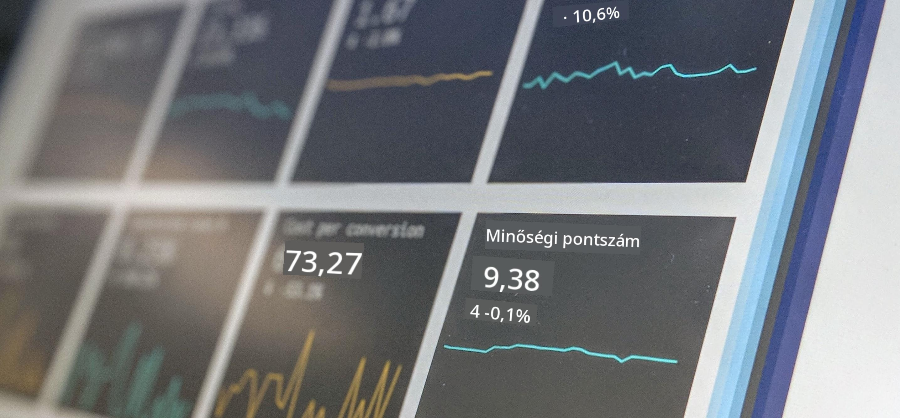

<!--
CO_OP_TRANSLATOR_METADATA:
{
  "original_hash": "696a8474a01054281704cbfb09148949",
  "translation_date": "2025-08-26T14:59:40+00:00",
  "source_file": "1-Introduction/README.md",
  "language_code": "hu"
}
-->
# Bevezetés az adattudományba

  
> Fotó: <a href="https://unsplash.com/@dawson2406?utm_source=unsplash&utm_medium=referral&utm_content=creditCopyText">Stephen Dawson</a> az <a href="https://unsplash.com/s/photos/data?utm_source=unsplash&utm_medium=referral&utm_content=creditCopyText">Unsplash</a> oldalán  

Ezekben a leckékben felfedezheted, hogyan definiálják az adattudományt, és megismerheted azokat az etikai szempontokat, amelyeket egy adattudósnak figyelembe kell vennie. Emellett megtudhatod, hogyan definiálják az adatokat, és betekintést nyerhetsz a statisztika és valószínűség világába, amelyek az adattudomány alapvető tudományterületei.

### Témák

1. [Az adattudomány meghatározása](01-defining-data-science/README.md)  
2. [Az adattudomány etikája](02-ethics/README.md)  
3. [Az adatok meghatározása](03-defining-data/README.md)  
4. [Bevezetés a statisztikába és valószínűségszámításba](04-stats-and-probability/README.md)  

### Köszönetnyilvánítás

Ezeket a leckéket ❤️-vel írták: [Nitya Narasimhan](https://twitter.com/nitya) és [Dmitry Soshnikov](https://twitter.com/shwars).

---

**Felelősség kizárása**:  
Ez a dokumentum az AI fordítási szolgáltatás, a [Co-op Translator](https://github.com/Azure/co-op-translator) segítségével lett lefordítva. Bár törekszünk a pontosságra, kérjük, vegye figyelembe, hogy az automatikus fordítások hibákat vagy pontatlanságokat tartalmazhatnak. Az eredeti dokumentum az eredeti nyelvén tekintendő hiteles forrásnak. Kritikus információk esetén javasolt professzionális emberi fordítást igénybe venni. Nem vállalunk felelősséget semmilyen félreértésért vagy téves értelmezésért, amely a fordítás használatából eredhet.