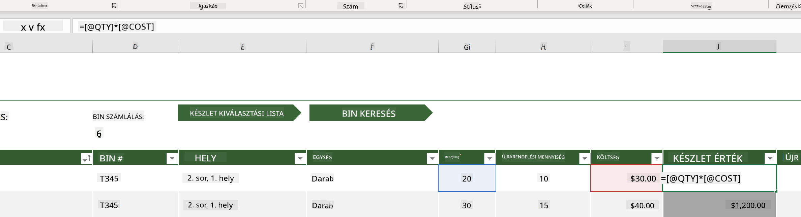
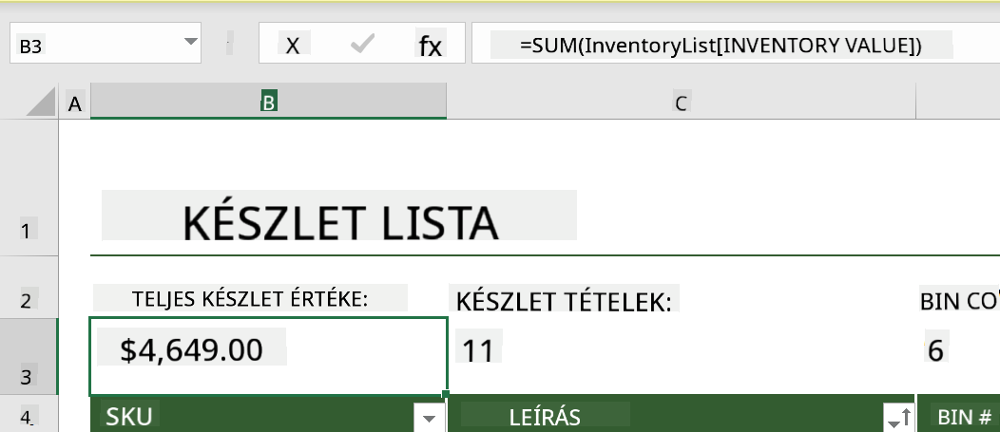
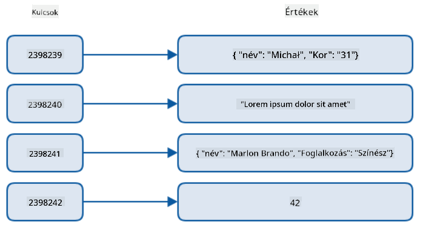
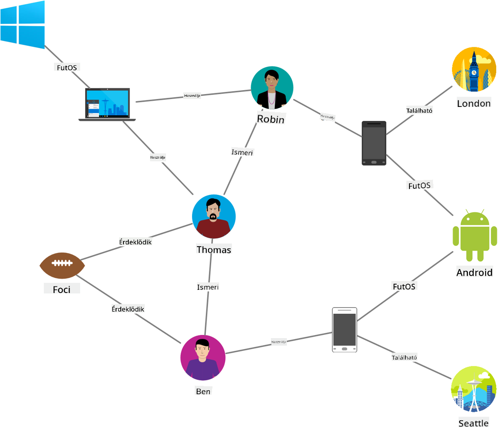
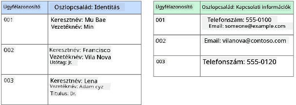
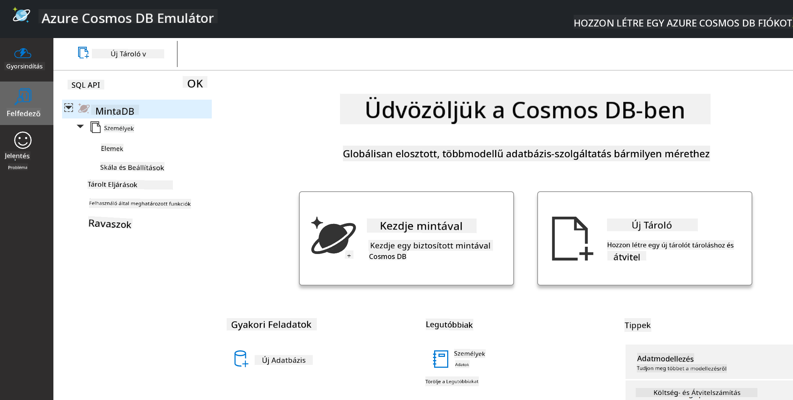
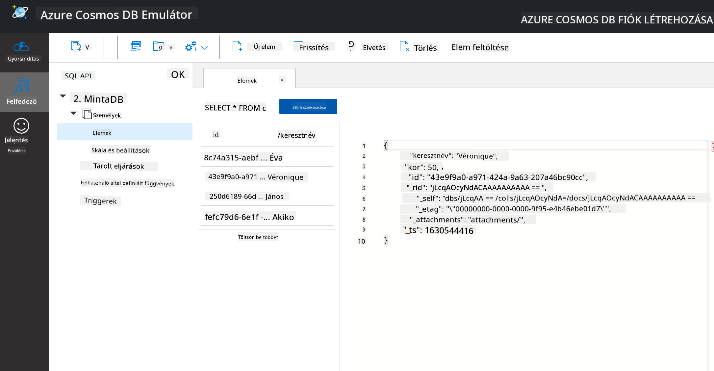
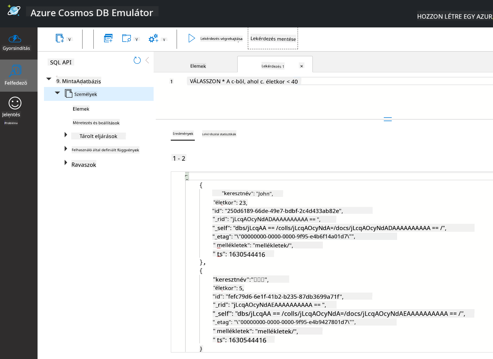

<!--
CO_OP_TRANSLATOR_METADATA:
{
  "original_hash": "32ddfef8121650f2ca2f3416fd283c37",
  "translation_date": "2025-08-26T14:53:00+00:00",
  "source_file": "2-Working-With-Data/06-non-relational/README.md",
  "language_code": "hu"
}
-->
# Adatok kezelése: Nem-relációs adatok

| ](../../sketchnotes/06-NoSQL.png)|
|:---:|
|Nem-relációs adatok kezelése - _Sketchnote készítette: [@nitya](https://twitter.com/nitya)_ |

## [Előadás előtti kvíz](https://purple-hill-04aebfb03.1.azurestaticapps.net/quiz/10)

Az adatok nem korlátozódnak relációs adatbázisokra. Ez a lecke a nem-relációs adatokra összpontosít, és bemutatja a táblázatkezelők és a NoSQL alapjait.

## Táblázatkezelők

A táblázatkezelők népszerű módjai az adatok tárolásának és felfedezésének, mivel kevesebb előkészületet igényelnek. Ebben a leckében megismerheted a táblázatkezelők alapvető elemeit, valamint a képleteket és függvényeket. A példák a Microsoft Excel segítségével lesznek bemutatva, de a legtöbb rész és téma hasonló elnevezésekkel és lépésekkel rendelkezik más táblázatkezelő szoftverek esetében is.


Egy táblázat egy fájl, amely elérhető a számítógép, eszköz vagy felhőalapú fájlrendszer fájlrendszerében. Maga a szoftver lehet böngészőalapú vagy egy alkalmazás, amelyet telepíteni kell a számítógépre, vagy letölthető alkalmazásként. Az Excelben ezeket a fájlokat **munkafüzeteknek** nevezik, és ez a terminológia lesz használva a lecke további részében.

Egy munkafüzet egy vagy több **munkalapot** tartalmaz, ahol minden munkalap fülekkel van megjelölve. Egy munkalapon belül találhatók a **cellák**, amelyek a tényleges adatokat tartalmazzák. Egy cella egy sor és egy oszlop metszéspontja, ahol az oszlopokat betűkkel, a sorokat pedig számokkal jelölik. Egyes táblázatok az első néhány sorban fejlécet tartalmaznak, amely leírja az adatok jelentését a cellákban.

Az Excel munkafüzet alapvető elemeivel egy példát fogunk használni a [Microsoft Templates](https://templates.office.com/) oldalról, amely egy készletre összpontosít, hogy bemutassuk a táblázat további részeit.

### Készlet kezelése

A "InventoryExample" nevű táblázat egy formázott táblázat, amely egy készlet elemeit tartalmazza, és három munkalapból áll, amelyek fülei "Inventory List", "Inventory Pick List" és "Bin Lookup" néven vannak megjelölve. Az Inventory List munkalap 4. sora a fejléc, amely leírja az egyes cellák értékét az oszlopfejlécben.



Vannak esetek, amikor egy cella értéke más cellák értékeitől függ, hogy kiszámítsa az értékét. Az Inventory List táblázat nyomon követi az egyes elemek költségét a készletben, de mi van, ha tudni szeretnénk a teljes készlet értékét? A [**képletek**](https://support.microsoft.com/en-us/office/overview-of-formulas-34519a4e-1e8d-4f4b-84d4-d642c4f63263) műveleteket végeznek a cellaadatokon, és ebben a példában a készlet értékének kiszámítására használják. Ez a táblázat egy képletet használ az Inventory Value oszlopban, hogy kiszámítsa az egyes elemek értékét a QTY fejléc alatti mennyiség és a COST fejléc alatti költségek szorzatával. Egy cellára duplán kattintva vagy kiemelve megjelenik a képlet. Észre fogod venni, hogy a képletek egy egyenlőségjellel kezdődnek, amelyet a számítás vagy művelet követ.



Egy másik képletet is használhatunk az Inventory Value összes értékének összeadására, hogy megkapjuk a teljes értéket. Ez kiszámítható lenne az egyes cellák összeadásával, de ez fárasztó feladat lehet. Az Excel rendelkezik [**függvényekkel**](https://support.microsoft.com/en-us/office/sum-function-043e1c7d-7726-4e80-8f32-07b23e057f89), vagyis előre definiált képletekkel, amelyek számításokat végeznek a cellaértékeken. A függvények argumentumokat igényelnek, amelyek a számításokhoz szükséges értékek. Ha egy függvény több argumentumot igényel, azokat meghatározott sorrendben kell megadni, különben a függvény nem biztos, hogy helyes értéket számít ki. Ebben a példában a SUM függvényt használjuk, amely az Inventory Value értékeit használja argumentumként, hogy kiszámítsa az összértéket, amely a 3. sor, B oszlop (B3) alatt található.

## NoSQL

A NoSQL egy gyűjtőfogalom a nem-relációs adatok tárolásának különböző módjaira, és jelentheti a "non-SQL", "nem-relációs" vagy "nem csak SQL" kifejezéseket. Ezeket az adatbázis-rendszereket négy típusba lehet sorolni.


> Forrás: [Michał Białecki Blog](https://www.michalbialecki.com/2018/03/18/azure-cosmos-db-key-value-database-cloud/)

A [Kulcs-érték](https://docs.microsoft.com/en-us/azure/architecture/data-guide/big-data/non-relational-data#keyvalue-data-stores) adatbázisok egyedi kulcsokat párosítanak értékekkel, amelyek egyedi azonosítókhoz kapcsolódnak. Ezeket a párokat egy [hash tábla](https://www.hackerearth.com/practice/data-structures/hash-tables/basics-of-hash-tables/tutorial/) segítségével tárolják, megfelelő hash függvénnyel.


> Forrás: [Microsoft](https://docs.microsoft.com/en-us/azure/cosmos-db/graph/graph-introduction#graph-database-by-example)

A [Gráf](https://docs.microsoft.com/en-us/azure/architecture/data-guide/big-data/non-relational-data#graph-data-stores) adatbázisok az adatok közötti kapcsolatokat írják le, és csomópontok és élek gyűjteményeként ábrázolják. Egy csomópont egy entitást képvisel, például egy diákot vagy bankszámlakivonatot. Az élek két entitás közötti kapcsolatot jelentenek. Minden csomópontnak és élnek vannak tulajdonságai, amelyek további információkat nyújtanak róluk.



Az [Oszlopos](https://docs.microsoft.com/en-us/azure/architecture/data-guide/big-data/non-relational-data#columnar-data-stores) adattárak az adatokat oszlopokba és sorokba szervezik, hasonlóan a relációs adatstruktúrához, de minden oszlop csoportokra van osztva, amelyeket oszlopcsaládoknak neveznek. Az egy oszlop alatti összes adat kapcsolódik egymáshoz, és egy egységként lekérdezhető vagy módosítható.

### Dokumentum adattárak az Azure Cosmos DB-vel

A [Dokumentum](https://docs.microsoft.com/en-us/azure/architecture/data-guide/big-data/non-relational-data#document-data-stores) adattárak a kulcs-érték adattárak koncepciójára épülnek, és mezők és objektumok sorozatából állnak. Ebben a részben a dokumentum adatbázisokat a Cosmos DB emulátor segítségével vizsgáljuk meg.

A Cosmos DB adatbázis megfelel a "Nem Csak SQL" meghatározásának, ahol a Cosmos DB dokumentum adatbázisa SQL-t használ az adatok lekérdezésére. Az [előző lecke](../05-relational-databases/README.md) az SQL alapjait tárgyalja, és itt néhány ugyanazt a lekérdezést alkalmazhatjuk egy dokumentum adatbázisra. A Cosmos DB Emulátort fogjuk használni, amely lehetővé teszi, hogy helyileg, egy számítógépen hozzunk létre és fedezzünk fel egy dokumentum adatbázist. További információ az Emulátorról [itt](https://docs.microsoft.com/en-us/azure/cosmos-db/local-emulator?tabs=ssl-netstd21).

Egy dokumentum mezők és objektumértékek gyűjteménye, ahol a mezők leírják, hogy az objektumérték mit képvisel. Az alábbiakban egy dokumentum példát láthatsz.

```json
{
    "firstname": "Eva",
    "age": 44,
    "id": "8c74a315-aebf-4a16-bb38-2430a9896ce5",
    "_rid": "bHwDAPQz8s0BAAAAAAAAAA==",
    "_self": "dbs/bHwDAA==/colls/bHwDAPQz8s0=/docs/bHwDAPQz8s0BAAAAAAAAAA==/",
    "_etag": "\"00000000-0000-0000-9f95-010a691e01d7\"",
    "_attachments": "attachments/",
    "_ts": 1630544034
}
```

A dokumentum érdekes mezői: `firstname`, `id` és `age`. A többi mezőt a Cosmos DB generálta.

#### Adatok felfedezése a Cosmos DB Emulátorral

Az emulátort [Windowsra innen](https://aka.ms/cosmosdb-emulator) töltheted le és telepítheted. A macOS és Linux rendszerekhez kapcsolódó lehetőségekről lásd ezt a [dokumentációt](https://docs.microsoft.com/en-us/azure/cosmos-db/local-emulator?tabs=ssl-netstd21#run-on-linux-macos).

Az emulátor egy böngészőablakot indít el, ahol az Explorer nézet lehetővé teszi a dokumentumok felfedezését.



Ha követed az útmutatót, kattints a "Start with Sample" gombra, hogy létrehozz egy minta adatbázist, amelynek neve SampleDB. Ha kibontod a SampleDB-t a nyílra kattintva, találsz egy `Persons` nevű tárolót. Egy tároló elemek gyűjteményét tartalmazza, amelyek a tárolóban lévő dokumentumok. Felfedezheted a négy egyedi dokumentumot az `Items` alatt.



#### Dokumentum adatok lekérdezése a Cosmos DB Emulátorral

A mintaadatokat SQL lekérdezésekkel is lekérdezhetjük az új SQL Query gombra kattintva (a második gomb balról).

`SELECT * FROM c` visszaadja az összes dokumentumot a tárolóban. Adjunk hozzá egy where záradékot, és keressük meg azokat, akik 40 évnél fiatalabbak.

`SELECT * FROM c where c.age < 40`



A lekérdezés két dokumentumot ad vissza, észreveheted, hogy az age mező értéke mindkét dokumentumban kisebb, mint 40.

#### JSON és dokumentumok

Ha ismered a JavaScript Object Notation (JSON) formátumot, észre fogod venni, hogy a dokumentumok hasonlítanak a JSON-hoz. Ebben a könyvtárban található egy `PersonsData.json` fájl, amely további adatokat tartalmaz, és feltölthető a Persons tárolóba az Emulátorban az `Upload Item` gomb segítségével.

A legtöbb esetben az API-k által visszaadott JSON adatok közvetlenül áthelyezhetők és tárolhatók dokumentum adatbázisokban. Az alábbiakban egy másik dokumentumot láthatsz, amely a Microsoft Twitter-fiókjából származó tweeteket képvisel, amelyeket a Twitter API segítségével nyertek ki, majd beillesztettek a Cosmos DB-be.

```json
{
    "created_at": "2021-08-31T19:03:01.000Z",
    "id": "1432780985872142341",
    "text": "Blank slate. Like this tweet if you’ve ever painted in Microsoft Paint before. https://t.co/cFeEs8eOPK",
    "_rid": "dhAmAIUsA4oHAAAAAAAAAA==",
    "_self": "dbs/dhAmAA==/colls/dhAmAIUsA4o=/docs/dhAmAIUsA4oHAAAAAAAAAA==/",
    "_etag": "\"00000000-0000-0000-9f84-a0958ad901d7\"",
    "_attachments": "attachments/",
    "_ts": 1630537000
```

A dokumentum érdekes mezői: `created_at`, `id` és `text`.

## 🚀 Kihívás

Van egy `TwitterData.json` fájl, amely feltölthető a SampleDB adatbázisba. Ajánlott, hogy külön tárolóba add hozzá. Ez a következőképpen történhet:

1. Kattints az új tároló gombra a jobb felső sarokban
2. Válaszd ki a meglévő adatbázist (SampleDB), hozz létre egy tárolóazonosítót a tárolóhoz
3. Állítsd be a partíciókulcsot `/id`-re
4. Kattints az OK gombra (a többi információt figyelmen kívül hagyhatod, mivel ez egy kis adathalmaz, amely helyileg fut a gépeden)
5. Nyisd meg az új tárolódat, és töltsd fel a Twitter Data fájlt az `Upload Item` gombbal

Próbálj meg néhány SELECT lekérdezést futtatni, hogy megtaláld azokat a dokumentumokat, amelyekben a text mező tartalmazza a Microsoft szót. Tipp: próbáld használni a [LIKE kulcsszót](https://docs.microsoft.com/en-us/azure/cosmos-db/sql/sql-query-keywords#using-like-with-the--wildcard-character).

## [Előadás utáni kvíz](https://purple-hill-04aebfb03.1.azurestaticapps.net/quiz/11)

## Áttekintés és önálló tanulás

- Ebben a leckében nem tértünk ki minden formázási lehetőségre és funkcióra, amelyet ez a táblázat tartalmaz. A Microsoft rendelkezik egy [nagy dokumentációs és videókönyvtárral](https://support.microsoft.com/excel) az Excelről, ha többet szeretnél megtudni.

- Ez az architekturális dokumentáció részletezi a nem-relációs adatok különböző típusainak jellemzőit: [Nem-relációs adatok és NoSQL](https://docs.microsoft.com/en-us/azure/architecture/data-guide/big-data/non-relational-data)

- A Cosmos DB egy felhőalapú nem-relációs adatbázis, amely a leckében említett különböző NoSQL típusokat is tárolhatja. Tudj meg többet ezekről a típusokról ebben a [Cosmos DB Microsoft Learn modulban](https://docs.microsoft.com/en-us/learn/paths/work-with-nosql-data-in-azure-cosmos-db/).

## Feladat

[Soda Profits](assignment.md)

---

**Felelősségkizárás**:  
Ez a dokumentum az [Co-op Translator](https://github.com/Azure/co-op-translator) AI fordítási szolgáltatás segítségével lett lefordítva. Bár törekszünk a pontosságra, kérjük, vegye figyelembe, hogy az automatikus fordítások hibákat vagy pontatlanságokat tartalmazhatnak. Az eredeti dokumentum az eredeti nyelvén tekintendő hiteles forrásnak. Kritikus információk esetén javasolt a professzionális, emberi fordítás igénybevétele. Nem vállalunk felelősséget a fordítás használatából eredő félreértésekért vagy téves értelmezésekért.