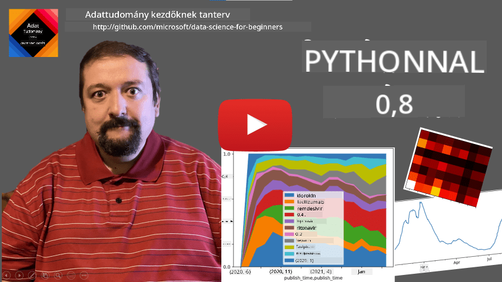
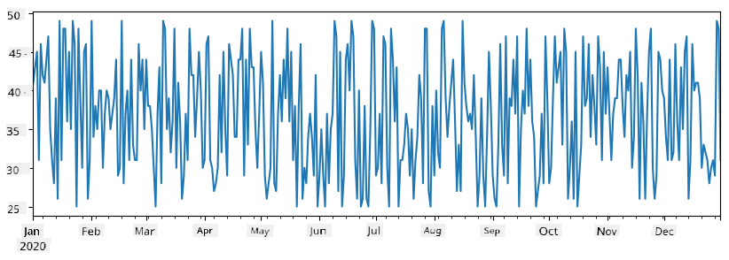
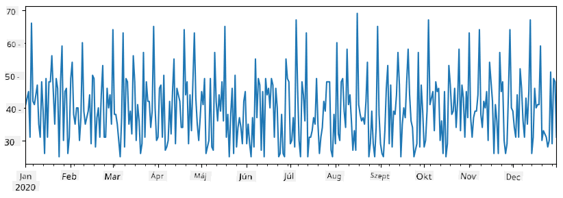
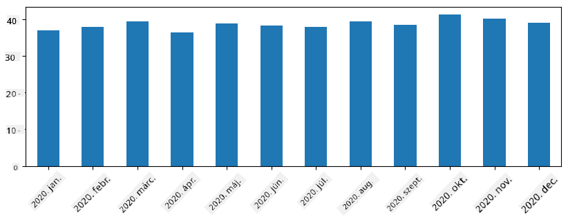
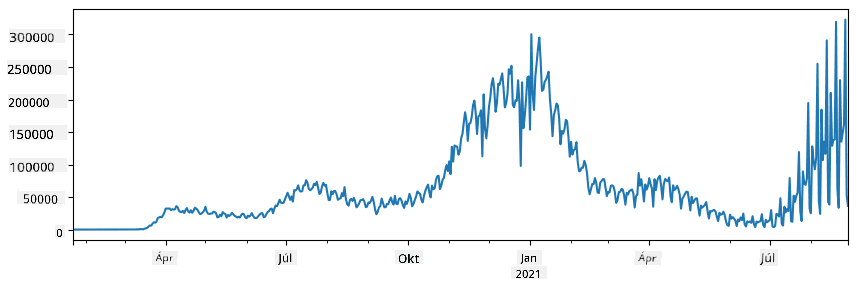
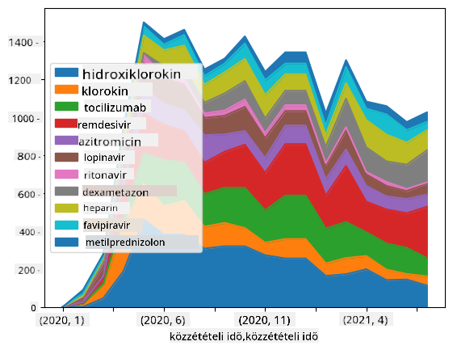

<!--
CO_OP_TRANSLATOR_METADATA:
{
  "original_hash": "116c5d361fbe812e59a73f37ce721d36",
  "translation_date": "2025-08-26T14:43:57+00:00",
  "source_file": "2-Working-With-Data/07-python/README.md",
  "language_code": "hu"
}
-->
# Adatok kezelése: Python és a Pandas könyvtár

|  ](../../sketchnotes/07-WorkWithPython.png) |
| :-------------------------------------------------------------------------------------------------------: |
|                 Python használata - _Sketchnote by [@nitya](https://twitter.com/nitya)_                 |

[](https://youtu.be/dZjWOGbsN4Y)

Bár az adatbázisok hatékony módot kínálnak az adatok tárolására és lekérdezésére lekérdezési nyelvek segítségével, az adatok feldolgozásának legflexibilisebb módja az, ha saját programot írunk az adatok manipulálására. Sok esetben egy adatbázis-lekérdezés hatékonyabb megoldás lehet. Azonban, ha összetettebb adatfeldolgozásra van szükség, azt nem lehet könnyen SQL-lel megoldani.  
Az adatfeldolgozást bármilyen programozási nyelven meg lehet valósítani, de vannak olyan nyelvek, amelyek magasabb szintűek az adatokkal való munka szempontjából. Az adatelemzők általában az alábbi nyelvek egyikét részesítik előnyben:

* **[Python](https://www.python.org/)**, egy általános célú programozási nyelv, amelyet gyakran a kezdők számára legjobb választásnak tartanak egyszerűsége miatt. A Python rengeteg kiegészítő könyvtárral rendelkezik, amelyek segítenek számos gyakorlati probléma megoldásában, például adatok kicsomagolásában ZIP archívumból vagy képek szürkeárnyalatossá alakításában. Az adatelemzés mellett a Python gyakran használatos webfejlesztésre is.  
* **[R](https://www.r-project.org/)** egy hagyományos eszköztár, amelyet statisztikai adatfeldolgozásra fejlesztettek ki. Nagy könyvtárgyűjteménnyel (CRAN) rendelkezik, ami jó választássá teszi az adatfeldolgozásra. Azonban az R nem általános célú programozási nyelv, és ritkán használják az adatelemzésen kívül.  
* **[Julia](https://julialang.org/)** egy másik nyelv, amelyet kifejezetten adatelemzésre fejlesztettek ki. Jobb teljesítményt kínál, mint a Python, így kiváló eszköz tudományos kísérletezéshez.

Ebben a leckében a Python használatára összpontosítunk egyszerű adatfeldolgozási feladatokhoz. Feltételezzük, hogy alapvető ismeretekkel rendelkezik a nyelvről. Ha mélyebb betekintést szeretne kapni a Pythonba, az alábbi forrásokat ajánljuk:

* [Tanuljon Python-t szórakoztató módon Turtle Graphics és Fraktálok segítségével](https://github.com/shwars/pycourse) - GitHub-alapú gyors bevezető kurzus a Python programozásba  
* [Tegye meg az első lépéseit a Python-nal](https://docs.microsoft.com/en-us/learn/paths/python-first-steps/?WT.mc_id=academic-77958-bethanycheum) Tanulási útvonal a [Microsoft Learn](http://learn.microsoft.com/?WT.mc_id=academic-77958-bethanycheum) oldalon  

Az adatok sokféle formában érkezhetnek. Ebben a leckében három adatformát vizsgálunk meg: **táblázatos adatok**, **szöveg** és **képek**.

Néhány adatfeldolgozási példára fogunk összpontosítani, ahelyett, hogy teljes áttekintést adnánk az összes kapcsolódó könyvtárról. Ez lehetővé teszi, hogy megértsük a lehetőségeket, és tudjuk, hol találhatunk megoldásokat a problémáinkra, amikor szükség van rájuk.

> **Legfontosabb tanács**. Ha olyan műveletet kell végrehajtania az adatokon, amelyet nem tud, hogyan kell megtenni, próbáljon meg rákeresni az interneten. A [Stackoverflow](https://stackoverflow.com/) gyakran tartalmaz hasznos Python kódmintákat számos tipikus feladathoz.

## [Előadás előtti kvíz](https://purple-hill-04aebfb03.1.azurestaticapps.net/quiz/12)

## Táblázatos adatok és Dataframe-ek

Már találkozott táblázatos adatokkal, amikor a relációs adatbázisokról beszéltünk. Ha sok adatunk van, és az sok különböző, összekapcsolt táblában található, akkor mindenképpen érdemes SQL-t használni az adatok kezelésére. Azonban sok esetben van egy adatunk táblázat formájában, és szeretnénk **megérteni** vagy **következtetéseket levonni** az adatokból, például az eloszlásról, az értékek közötti korrelációról stb. Az adatelemzés során gyakran szükség van az eredeti adatok átalakítására, majd vizualizálására. Mindkét lépés könnyen elvégezhető Python segítségével.

Két legfontosabb Python könyvtár segíthet a táblázatos adatok kezelésében:
* **[Pandas](https://pandas.pydata.org/)** lehetővé teszi az úgynevezett **Dataframe-ek** manipulálását, amelyek hasonlóak a relációs táblákhoz. Lehetnek elnevezett oszlopok, és különböző műveleteket végezhetünk sorokon, oszlopokon és általában a Dataframe-eken.  
* **[Numpy](https://numpy.org/)** egy könyvtár **tenszorokkal**, azaz többdimenziós **tömbökkel** való munkához. A tömb azonos típusú értékeket tartalmaz, és egyszerűbb, mint a Dataframe, de több matematikai műveletet kínál, és kevesebb erőforrást igényel.

Van még néhány más könyvtár, amelyet érdemes ismerni:
* **[Matplotlib](https://matplotlib.org/)** egy könyvtár, amelyet adatok vizualizálására és grafikonok készítésére használnak  
* **[SciPy](https://www.scipy.org/)** egy könyvtár további tudományos funkciókkal. Már találkoztunk ezzel a könyvtárral, amikor a valószínűségről és statisztikáról beszéltünk  

Íme egy kódrészlet, amelyet általában a Python program elején használunk ezeknek a könyvtáraknak az importálására:  
```python
import numpy as np
import pandas as pd
import matplotlib.pyplot as plt
from scipy import ... # you need to specify exact sub-packages that you need
```  

A Pandas néhány alapvető fogalom köré épül.

### Sorozatok (Series)

A **Series** egy értéksorozat, amely hasonló egy listához vagy numpy tömbhöz. A fő különbség az, hogy a sorozatnak van egy **indexe**, és amikor műveleteket végzünk rajta (pl. összeadjuk őket), az indexet figyelembe vesszük. Az index lehet egyszerű, mint például az egész számú sorszám (ez az alapértelmezett index, amikor listából vagy tömbből hozunk létre sorozatot), vagy lehet összetett, például dátumintervallum.

> **Megjegyzés**: A kísérő notebookban [`notebook.ipynb`](notebook.ipynb) található néhány bevezető Pandas kód. Itt csak néhány példát vázolunk fel, és mindenképpen érdemes megnézni a teljes notebookot.

Vegyünk egy példát: elemezni szeretnénk fagylaltárusító helyünk eladásait. Generáljunk egy sorozatot az eladási számokkal (naponta eladott termékek száma) egy időszakra:  
```python
start_date = "Jan 1, 2020"
end_date = "Mar 31, 2020"
idx = pd.date_range(start_date,end_date)
print(f"Length of index is {len(idx)}")
items_sold = pd.Series(np.random.randint(25,50,size=len(idx)),index=idx)
items_sold.plot()
```  


Tegyük fel, hogy minden héten szervezünk egy bulit a barátainknak, és további 10 csomag fagylaltot viszünk a bulira. Létrehozhatunk egy másik sorozatot, amelyet hetek szerint indexelünk, hogy ezt bemutassuk:  
```python
additional_items = pd.Series(10,index=pd.date_range(start_date,end_date,freq="W"))
```  
Amikor összeadjuk a két sorozatot, megkapjuk a teljes számot:  
```python
total_items = items_sold.add(additional_items,fill_value=0)
total_items.plot()
```  


> **Megjegyzés**: Nem használjuk az egyszerű `total_items+additional_items` szintaxist. Ha ezt tennénk, sok `NaN` (*Not a Number*) értéket kapnánk az eredményül kapott sorozatban. Ennek oka, hogy az `additional_items` sorozatban hiányzó értékek vannak néhány indexpontnál, és ha `NaN`-t adunk hozzá bármihez, az eredmény `NaN` lesz. Ezért meg kell adnunk a `fill_value` paramétert az összeadás során.

Az idősorokkal különböző időintervallumokkal is **újramintázhatjuk** a sorozatot. Például, ha havi átlagos eladási mennyiséget szeretnénk kiszámítani, használhatjuk a következő kódot:  
```python
monthly = total_items.resample("1M").mean()
ax = monthly.plot(kind='bar')
```  


### DataFrame

A DataFrame lényegében sorozatok gyűjteménye ugyanazzal az indexszel. Több sorozatot is összevonhatunk egy DataFrame-be:  
```python
a = pd.Series(range(1,10))
b = pd.Series(["I","like","to","play","games","and","will","not","change"],index=range(0,9))
df = pd.DataFrame([a,b])
```  
Ez egy vízszintes táblázatot hoz létre, mint ez:  
|     | 0   | 1    | 2   | 3   | 4      | 5   | 6      | 7    | 8    |
| --- | --- | ---- | --- | --- | ------ | --- | ------ | ---- | ---- |
| 0   | 1   | 2    | 3   | 4   | 5      | 6   | 7      | 8    | 9    |
| 1   | I   | like | to  | use | Python | and | Pandas | very | much |

Sorozatokat oszlopként is használhatunk, és megadhatjuk az oszlopneveket szótár segítségével:  
```python
df = pd.DataFrame({ 'A' : a, 'B' : b })
```  
Ez egy ilyen táblázatot eredményez:

|     | A   | B      |
| --- | --- | ------ |
| 0   | 1   | I      |
| 1   | 2   | like   |
| 2   | 3   | to     |
| 3   | 4   | use    |
| 4   | 5   | Python |
| 5   | 6   | and    |
| 6   | 7   | Pandas |
| 7   | 8   | very   |
| 8   | 9   | much   |

**Megjegyzés**: Ezt a táblázat-elrendezést úgy is elérhetjük, hogy az előző táblázatot transzponáljuk, például az alábbi kód segítségével:  
```python
df = pd.DataFrame([a,b]).T..rename(columns={ 0 : 'A', 1 : 'B' })
```  
Itt a `.T` a DataFrame transzponálásának műveletét jelenti, azaz a sorok és oszlopok cseréjét, és a `rename` művelet lehetővé teszi az oszlopok átnevezését, hogy megfeleljenek az előző példának.

Íme néhány legfontosabb művelet, amelyet DataFrame-eken végezhetünk:

**Oszlopok kiválasztása**. Egyedi oszlopokat választhatunk ki az `df['A']` írásával - ez a művelet egy sorozatot ad vissza. Az oszlopok egy részhalmazát egy másik DataFrame-be is kiválaszthatjuk az `df[['B','A']]` írásával - ez egy másik DataFrame-et ad vissza.

**Szűrés** bizonyos sorokra kritérium alapján. Például, ha csak azokat a sorokat szeretnénk megtartani, ahol az `A` oszlop értéke nagyobb, mint 5, akkor az `df[df['A']>5]` kódot írhatjuk.

> **Megjegyzés**: A szűrés működése a következő. Az `df['A']<5` kifejezés egy logikai sorozatot ad vissza, amely jelzi, hogy a kifejezés `True` vagy `False` az eredeti sorozat `df['A']` minden elemére. Amikor a logikai sorozatot indexként használjuk, az a DataFrame sorainak részhalmazát adja vissza. Ezért nem lehet tetszőleges Python logikai kifejezést használni, például az `df[df['A']>5 and df['A']<7]` írása helytelen lenne. Ehelyett speciális `&` műveletet kell használni a logikai sorozatokon, például az `df[(df['A']>5) & (df['A']<7)]` írásával (*a zárójelek itt fontosak*).

**Új számítható oszlopok létrehozása**. Könnyen létrehozhatunk új számítható oszlopokat a DataFrame-hez intuitív kifejezések használatával, például:  
```python
df['DivA'] = df['A']-df['A'].mean() 
```  
Ez a példa az `A` eltérését számítja ki az átlagértékétől. Ami valójában történik, az az, hogy egy sorozatot számítunk ki, majd ezt a sorozatot hozzárendeljük a bal oldali oszlophoz, létrehozva egy új oszlopot. Ezért nem használhatunk olyan műveleteket, amelyek nem kompatibilisek a sorozatokkal, például az alábbi kód helytelen:  
```python
# Wrong code -> df['ADescr'] = "Low" if df['A'] < 5 else "Hi"
df['LenB'] = len(df['B']) # <- Wrong result
```  
Az utóbbi példa, bár szintaktikailag helyes, rossz eredményt ad, mert a `B` sorozat hosszát rendeli hozzá az oszlop összes értékéhez, nem pedig az egyes elemek hosszát, ahogy azt szerettük volna.

Ha összetett kifejezéseket kell számítanunk, használhatjuk az `apply` függvényt. Az utolsó példa az alábbi módon írható:  
```python
df['LenB'] = df['B'].apply(lambda x : len(x))
# or 
df['LenB'] = df['B'].apply(len)
```  

A fenti műveletek után a következő DataFrame-et kapjuk:

|     | A   | B      | DivA | LenB |
| --- | --- | ------ | ---- | ---- |
| 0   | 1   | I      | -4.0 | 1    |
| 1   | 2   | like   | -3.0 | 4    |
| 2   | 3   | to     | -2.0 | 2    |
| 3   | 4   | use    | -1.0 | 3    |
| 4   | 5   | Python | 0.0  | 6    |
| 5   | 6   | and    | 1.0  | 3    |
| 6   | 7   | Pandas | 2.0  | 6    |
| 7   | 8   | very   | 3.0  | 4    |
| 8   | 9   | much   | 4.0  | 4    |

**Sorok kiválasztása számok alapján** az `iloc` konstrukcióval végezhető el. Például az első 5 sor kiválasztásához a DataFrame-ből:  
```python
df.iloc[:5]
```  

**Csoportosítás** gyakran használatos Excel *pivot táblákhoz* hasonló eredmény eléréséhez. Tegyük fel, hogy az `A` oszlop átlagértékét szeretnénk kiszámítani az egyes `LenB` értékekhez. Ekkor csoportosíthatjuk a DataFrame-et `LenB` szerint, és meghívhatjuk a `mean` függvényt:  
```python
df.groupby(by='LenB').mean()
```  
Ha az átlagot és az elemek számát is ki szeretnénk számítani a csoportban, akkor használhatunk összetettebb `aggregate` függvényt:  
```python
df.groupby(by='LenB') \
 .aggregate({ 'DivA' : len, 'A' : lambda x: x.mean() }) \
 .rename(columns={ 'DivA' : 'Count', 'A' : 'Mean'})
```  
Ez a következő táblázatot adja:

| LenB | Count | Mean     |
| ---- | ----- | -------- |
| 1    | 1     | 1.000000 |
| 2    | 1     | 3.000000 |
| 3    | 2     | 5.000000 |
| 4    | 3     | 6.333333 |
| 6    | 2     | 6.000000 |

### Adatok beszerzése
Láttuk, milyen egyszerű Python objektumokból Series-t és DataFrame-eket létrehozni. Azonban az adatok általában szövegfájl vagy Excel-tábla formájában érkeznek. Szerencsére a Pandas egyszerű módot kínál az adatok betöltésére a lemezről. Például, egy CSV fájl beolvasása ilyen egyszerű:
```python
df = pd.read_csv('file.csv')
```
További példákat is látni fogunk az adatok betöltésére, beleértve azokat is, amelyek külső weboldalakról származnak, a "Kihívás" szekcióban.

### Nyomtatás és Ábrázolás

Egy adatkutatónak gyakran kell felfedeznie az adatokat, ezért fontos, hogy képes legyen azokat vizualizálni. Ha egy DataFrame nagy, sokszor csak az első néhány sort szeretnénk ellenőrizni, hogy biztosak legyünk abban, hogy mindent helyesen csinálunk. Ezt a `df.head()` hívásával tehetjük meg. Ha Jupyter Notebookból futtatjuk, a DataFrame-t szép táblázatos formában jeleníti meg.

Már láttuk a `plot` függvény használatát bizonyos oszlopok vizualizálására. Bár a `plot` sok feladathoz nagyon hasznos, és számos különböző grafikon típust támogat a `kind=` paraméterrel, mindig használhatjuk a nyers `matplotlib` könyvtárat is, ha valami bonyolultabbat szeretnénk ábrázolni. Az adatvizualizációt részletesen külön kurzusleckékben fogjuk tárgyalni.

Ez az áttekintés lefedi a Pandas legfontosabb fogalmait, azonban a könyvtár rendkívül gazdag, és szinte végtelen, hogy mit lehet vele elérni! Most alkalmazzuk ezt a tudást egy konkrét probléma megoldására.

## 🚀 Kihívás 1: A COVID terjedésének elemzése

Az első probléma, amire összpontosítunk, a COVID-19 járvány terjedésének modellezése. Ehhez az egyes országokban fertőzött egyének számáról szóló adatokat fogjuk használni, amelyeket a [Center for Systems Science and Engineering](https://systems.jhu.edu/) (CSSE) biztosít a [Johns Hopkins Egyetemen](https://jhu.edu/). Az adatkészlet elérhető [ebben a GitHub-tárházban](https://github.com/CSSEGISandData/COVID-19).

Mivel szeretnénk bemutatni, hogyan kell az adatokkal dolgozni, meghívjuk Önt, hogy nyissa meg a [`notebook-covidspread.ipynb`](notebook-covidspread.ipynb) fájlt, és olvassa el elejétől a végéig. A cellákat is futtathatja, és megoldhat néhány kihívást, amelyeket a végén hagytunk Önnek.



> Ha nem tudja, hogyan kell kódot futtatni Jupyter Notebookban, nézze meg [ezt a cikket](https://soshnikov.com/education/how-to-execute-notebooks-from-github/).

## Strukturálatlan adatok kezelése

Bár az adatok nagyon gyakran táblázatos formában érkeznek, néha kevésbé strukturált adatokkal kell dolgoznunk, például szövegekkel vagy képekkel. Ebben az esetben, hogy alkalmazzuk az eddig látott adatfeldolgozási technikákat, valahogy **ki kell nyernünk** a strukturált adatokat. Íme néhány példa:

* Kulcsszavak kinyerése szövegből, és annak vizsgálata, hogy ezek a kulcsszavak milyen gyakran fordulnak elő
* Neurális hálózatok használata információ kinyerésére a képeken található objektumokról
* Információ gyűjtése az emberek érzelmeiről egy videokamera felvételén

## 🚀 Kihívás 2: COVID tanulmányok elemzése

Ebben a kihívásban folytatjuk a COVID-pandémia témáját, és a témával kapcsolatos tudományos cikkek feldolgozására összpontosítunk. A [CORD-19 Adatkészlet](https://www.kaggle.com/allen-institute-for-ai/CORD-19-research-challenge) több mint 7000 (az írás idején) COVID-ról szóló cikket tartalmaz, amelyek metaadatokkal és absztraktokkal érhetők el (és körülbelül felük teljes szövege is rendelkezésre áll).

Egy teljes példát találhatunk ennek az adatkészletnek az elemzésére a [Text Analytics for Health](https://docs.microsoft.com/azure/cognitive-services/text-analytics/how-tos/text-analytics-for-health/?WT.mc_id=academic-77958-bethanycheum) kognitív szolgáltatás használatával [ebben a blogbejegyzésben](https://soshnikov.com/science/analyzing-medical-papers-with-azure-and-text-analytics-for-health/). Egy egyszerűsített változatát fogjuk megvitatni ennek az elemzésnek.

> **MEGJEGYZÉS**: Nem biztosítunk másolatot az adatkészletről ebben a tárházban. Először le kell töltenie a [`metadata.csv`](https://www.kaggle.com/allen-institute-for-ai/CORD-19-research-challenge?select=metadata.csv) fájlt [ebből az adatkészletből a Kaggle-en](https://www.kaggle.com/allen-institute-for-ai/CORD-19-research-challenge). A Kaggle-re való regisztráció szükséges lehet. Regisztráció nélkül is letöltheti az adatkészletet [innen](https://ai2-semanticscholar-cord-19.s3-us-west-2.amazonaws.com/historical_releases.html), de ez az összes teljes szöveget is tartalmazza a metaadatfájl mellett.

Nyissa meg a [`notebook-papers.ipynb`](notebook-papers.ipynb) fájlt, és olvassa el elejétől a végéig. A cellákat is futtathatja, és megoldhat néhány kihívást, amelyeket a végén hagytunk Önnek.



## Képadatok feldolgozása

Az utóbbi időben nagyon erős AI modellek születtek, amelyek lehetővé teszik a képek megértését. Számos feladat megoldható előre betanított neurális hálózatokkal vagy felhőszolgáltatásokkal. Néhány példa:

* **Képosztályozás**, amely segíthet a képet egy előre meghatározott osztályba sorolni. Saját képosztályozókat is könnyen betaníthat olyan szolgáltatásokkal, mint a [Custom Vision](https://azure.microsoft.com/services/cognitive-services/custom-vision-service/?WT.mc_id=academic-77958-bethanycheum).
* **Objektumfelismerés**, amely különböző objektumokat képes felismerni a képen. Olyan szolgáltatások, mint a [computer vision](https://azure.microsoft.com/services/cognitive-services/computer-vision/?WT.mc_id=academic-77958-bethanycheum), számos általános objektumot felismerhetnek, és a [Custom Vision](https://azure.microsoft.com/services/cognitive-services/custom-vision-service/?WT.mc_id=academic-77958-bethanycheum) modellel specifikus érdeklődési objektumokat is felismerhetünk.
* **Arcfelismerés**, beleértve az életkor, nem és érzelem felismerését. Ez elvégezhető a [Face API](https://azure.microsoft.com/services/cognitive-services/face/?WT.mc_id=academic-77958-bethanycheum) segítségével.

Mindezek a felhőszolgáltatások hívhatók [Python SDK-k](https://docs.microsoft.com/samples/azure-samples/cognitive-services-python-sdk-samples/cognitive-services-python-sdk-samples/?WT.mc_id=academic-77958-bethanycheum) segítségével, így könnyen beépíthetők az adatfeltárási munkafolyamatba.

Íme néhány példa a képadatok forrásainak feltárására:
* A blogbejegyzésben [Hogyan tanuljunk adatkutatást kódolás nélkül](https://soshnikov.com/azure/how-to-learn-data-science-without-coding/) Instagram-fotókat vizsgálunk, hogy megértsük, miért kapnak egyes képek több lájkot. Először a lehető legtöbb információt kinyerjük a képekből a [computer vision](https://azure.microsoft.com/services/cognitive-services/computer-vision/?WT.mc_id=academic-77958-bethanycheum) segítségével, majd az [Azure Machine Learning AutoML](https://docs.microsoft.com/azure/machine-learning/concept-automated-ml/?WT.mc_id=academic-77958-bethanycheum) segítségével értelmezhető modellt építünk.
* A [Facial Studies Workshop](https://github.com/CloudAdvocacy/FaceStudies) során a [Face API](https://azure.microsoft.com/services/cognitive-services/face/?WT.mc_id=academic-77958-bethanycheum) segítségével érzelmeket nyerünk ki emberek fotóiról eseményeken, hogy megértsük, mi teszi boldoggá az embereket.

## Összegzés

Akár strukturált, akár strukturálatlan adatokkal rendelkezik, a Python segítségével elvégezheti az adatfeldolgozással és megértéssel kapcsolatos összes lépést. Ez valószínűleg a legnagyobb rugalmasságot biztosító adatfeldolgozási mód, és ezért használja az adatkutatók többsége a Pythont elsődleges eszközként. A Python mélyebb elsajátítása valószínűleg jó ötlet, ha komolyan gondolja az adatkutatási pályafutását!

## [Utólagos kvíz](https://purple-hill-04aebfb03.1.azurestaticapps.net/quiz/13)

## Áttekintés és önálló tanulás

**Könyvek**
* [Wes McKinney. Python for Data Analysis: Data Wrangling with Pandas, NumPy, and IPython](https://www.amazon.com/gp/product/1491957662)

**Online források**
* Hivatalos [10 perc a Pandasszal](https://pandas.pydata.org/pandas-docs/stable/user_guide/10min.html) oktatóanyag
* [Dokumentáció a Pandas vizualizációról](https://pandas.pydata.org/pandas-docs/stable/user_guide/visualization.html)

**Python tanulása**
* [Tanuljon Pythont szórakoztató módon Turtle Graphics és Fraktálok segítségével](https://github.com/shwars/pycourse)
* [Tegye meg az első lépéseket a Pythonnal](https://docs.microsoft.com/learn/paths/python-first-steps/?WT.mc_id=academic-77958-bethanycheum) tanulási útvonal a [Microsoft Learn](http://learn.microsoft.com/?WT.mc_id=academic-77958-bethanycheum) oldalon

## Feladat

[Részletesebb adatvizsgálat elvégzése a fent említett kihívásokhoz](assignment.md)

## Köszönetnyilvánítás

Ezt a leckét ♥️-val írta [Dmitry Soshnikov](http://soshnikov.com).

---

**Felelősség kizárása**:  
Ez a dokumentum az AI fordítási szolgáltatás, a [Co-op Translator](https://github.com/Azure/co-op-translator) segítségével lett lefordítva. Bár törekszünk a pontosságra, kérjük, vegye figyelembe, hogy az automatikus fordítások hibákat vagy pontatlanságokat tartalmazhatnak. Az eredeti dokumentum az eredeti nyelvén tekintendő hiteles forrásnak. Fontos információk esetén javasolt professzionális, emberi fordítást igénybe venni. Nem vállalunk felelősséget semmilyen félreértésért vagy téves értelmezésért, amely a fordítás használatából eredhet.