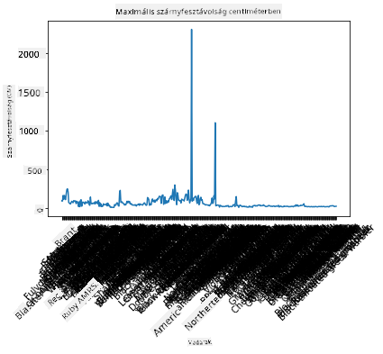
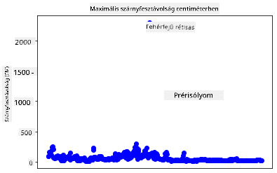
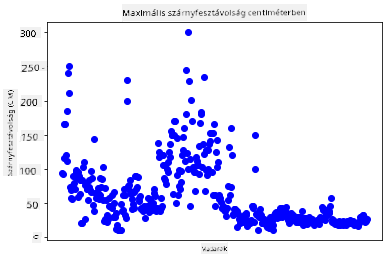
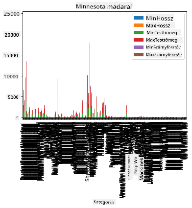
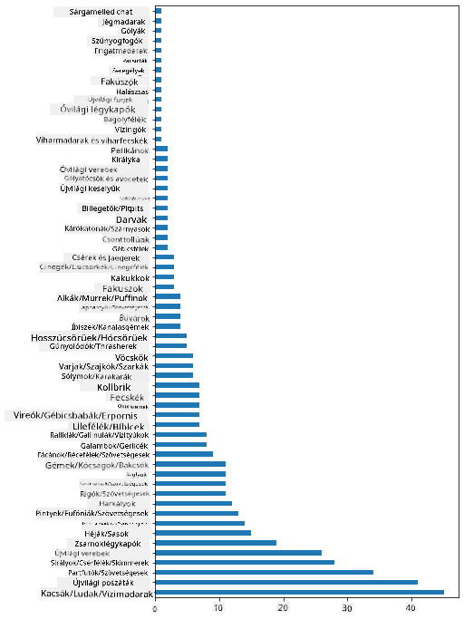
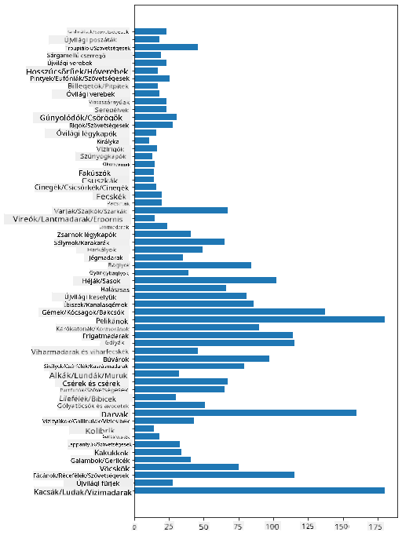
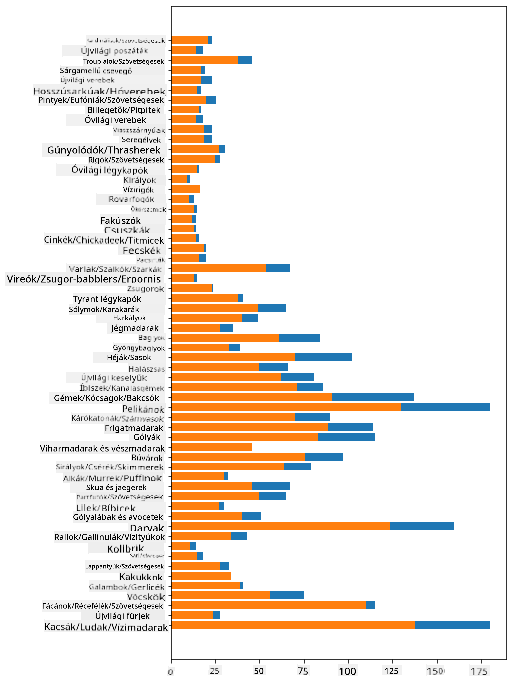

<!--
CO_OP_TRANSLATOR_METADATA:
{
  "original_hash": "43c402d9d90ae6da55d004519ada5033",
  "translation_date": "2025-08-26T17:22:47+00:00",
  "source_file": "3-Data-Visualization/09-visualization-quantities/README.md",
  "language_code": "hu"
}
-->
# Mennyiségek vizualizálása

| ](../../sketchnotes/09-Visualizing-Quantities.png)|
|:---:|
| Mennyiségek vizualizálása - _Sketchnote by [@nitya](https://twitter.com/nitya)_ |

Ebben a leckében felfedezheted, hogyan használhatod a Python egyik elérhető könyvtárát, hogy érdekes vizualizációkat készíts a mennyiségek fogalma köré. Egy tisztított adatállományt használva Minnesota madarairól, sok érdekes tényt tanulhatsz a helyi vadvilágról.  
## [Előadás előtti kvíz](https://purple-hill-04aebfb03.1.azurestaticapps.net/quiz/16)

## Szárnyfesztáv megfigyelése Matplotlib segítségével

Egy kiváló könyvtár, amely egyszerű és összetett grafikonok és diagramok készítésére alkalmas, a [Matplotlib](https://matplotlib.org/stable/index.html). Általánosságban véve az adatok ábrázolásának folyamata ezekkel a könyvtárakkal magában foglalja az adatkeret azon részeinek azonosítását, amelyeket meg szeretnél célozni, az adatok szükséges átalakítását, az x és y tengely értékeinek hozzárendelését, a megjelenítendő diagram típusának kiválasztását, majd a diagram megjelenítését. A Matplotlib számos vizualizációt kínál, de ebben a leckében koncentráljunk azokra, amelyek a legalkalmasabbak a mennyiségek vizualizálására: vonaldiagramok, szórásdiagramok és oszlopdiagramok.

> ✅ Használj olyan diagramot, amely legjobban illik az adatok szerkezetéhez és a történethez, amit el szeretnél mesélni.  
> - Időbeli trendek elemzéséhez: vonaldiagram  
> - Értékek összehasonlításához: oszlop-, sáv-, kördiagram, szórásdiagram  
> - Az egészhez való viszony bemutatásához: kördiagram  
> - Adatok eloszlásának bemutatásához: szórásdiagram, oszlopdiagram  
> - Trendek bemutatásához: vonaldiagram, oszlopdiagram  
> - Értékek közötti kapcsolatok bemutatásához: vonaldiagram, szórásdiagram, buborékdiagram  

Ha van egy adatállományod, és meg kell tudnod, hogy egy adott elem mennyit tartalmaz, az első feladatod az értékek ellenőrzése lesz.  

✅ Nagyon jó 'cheat sheet'-ek érhetők el a Matplotlib-hez [itt](https://matplotlib.org/cheatsheets/cheatsheets.pdf).

## Vonaldiagram készítése madarak szárnyfesztáv értékeiről

Nyisd meg a `notebook.ipynb` fájlt a lecke mappájának gyökerében, és adj hozzá egy cellát.

> Megjegyzés: az adatok a repo gyökerében találhatók a `/data` mappában.

```python
import pandas as pd
import matplotlib.pyplot as plt
birds = pd.read_csv('../../data/birds.csv')
birds.head()
```  
Ez az adatállomány szöveg és számok keveréke:

|      | Név                          | TudományosNév          | Kategória             | Rend         | Család   | Nemzetség   | TermészetvédelmiStátusz | MinHossz | MaxHossz | MinTestTömeg | MaxTestTömeg | MinSzárnyfesztáv | MaxSzárnyfesztáv |
| ---: | :--------------------------- | :--------------------- | :-------------------- | :----------- | :------- | :---------- | :---------------------- | --------: | --------: | ----------: | ----------: | ----------: | ----------: |
|    0 | Feketehasú sípoló kacsa      | Dendrocygna autumnalis | Kacsák/Ludak/Vízimadarak | Anseriformes | Anatidae | Dendrocygna | LC                     |        47 |        56 |         652 |        1020 |          76 |          94 |
|    1 | Fulvous sípoló kacsa         | Dendrocygna bicolor    | Kacsák/Ludak/Vízimadarak | Anseriformes | Anatidae | Dendrocygna | LC                     |        45 |        53 |         712 |        1050 |          85 |          93 |
|    2 | Hóliba                      | Anser caerulescens     | Kacsák/Ludak/Vízimadarak | Anseriformes | Anatidae | Anser       | LC                     |        64 |        79 |        2050 |        4050 |         135 |         165 |
|    3 | Ross-liba                   | Anser rossii           | Kacsák/Ludak/Vízimadarak | Anseriformes | Anatidae | Anser       | LC                     |      57.3 |        64 |        1066 |        1567 |         113 |         116 |
|    4 | Nagy fehérhomlokú liba       | Anser albifrons        | Kacsák/Ludak/Vízimadarak | Anseriformes | Anatidae | Anser       | LC                     |        64 |        81 |        1930 |        3310 |         130 |         165 |

Kezdjük azzal, hogy néhány numerikus adatot ábrázolunk egy alapvető vonaldiagram segítségével. Tegyük fel, hogy szeretnél egy nézetet a maximális szárnyfesztáv értékekről ezeknél az érdekes madaraknál.

```python
wingspan = birds['MaxWingspan'] 
wingspan.plot()
```  


Mit veszel észre azonnal? Úgy tűnik, van legalább egy kiugró érték - ez elég nagy szárnyfesztáv! Egy 2300 centiméteres szárnyfesztáv 23 métert jelent - vajon Pterodactylusok kószálnak Minnesotában? Vizsgáljuk meg.

Bár gyorsan rendezhetnéd az adatokat Excelben, hogy megtaláld ezeket a kiugró értékeket, folytasd a vizualizációs folyamatot a diagramon belülről.

Adj címkéket az x-tengelyhez, hogy megmutasd, milyen madarakról van szó:

```
plt.title('Max Wingspan in Centimeters')
plt.ylabel('Wingspan (CM)')
plt.xlabel('Birds')
plt.xticks(rotation=45)
x = birds['Name'] 
y = birds['MaxWingspan']

plt.plot(x, y)

plt.show()
```  


Még a címkék 45 fokos elforgatásával is túl sok van ahhoz, hogy olvasható legyen. Próbáljunk ki egy másik stratégiát: csak a kiugró értékeket címkézzük meg, és helyezzük el a címkéket a diagramon belül. Használhatsz szórásdiagramot, hogy több helyet biztosíts a címkézéshez:

```python
plt.title('Max Wingspan in Centimeters')
plt.ylabel('Wingspan (CM)')
plt.tick_params(axis='both',which='both',labelbottom=False,bottom=False)

for i in range(len(birds)):
    x = birds['Name'][i]
    y = birds['MaxWingspan'][i]
    plt.plot(x, y, 'bo')
    if birds['MaxWingspan'][i] > 500:
        plt.text(x, y * (1 - 0.05), birds['Name'][i], fontsize=12)
    
plt.show()
```  
Mi történik itt? A `tick_params` segítségével elrejtetted az alsó címkéket, majd egy ciklust hoztál létre a madarak adatállományán. A diagramot kis kék körökkel ábrázolva (`bo`), ellenőrizted, hogy van-e olyan madár, amelynek maximális szárnyfesztávja meghaladja az 500-at, és ha igen, megjelenítetted a címkéjét a pont mellett. A címkéket kicsit eltolva helyezted el az y tengelyen (`y * (1 - 0.05)`), és a madár nevét használtad címkeként.

Mit fedeztél fel?

  
## Adatok szűrése

Mind a kopasz sas, mind a prérifecske, bár valószínűleg nagyon nagy madarak, valószínűleg hibásan vannak címkézve, egy extra `0` került a maximális szárnyfesztávjukhoz. Nem valószínű, hogy találkozol egy 25 méteres szárnyfesztávú kopasz sassal, de ha igen, kérlek, értesíts minket! Hozzunk létre egy új adatkeretet ezek nélkül a kiugró értékek nélkül:

```python
plt.title('Max Wingspan in Centimeters')
plt.ylabel('Wingspan (CM)')
plt.xlabel('Birds')
plt.tick_params(axis='both',which='both',labelbottom=False,bottom=False)
for i in range(len(birds)):
    x = birds['Name'][i]
    y = birds['MaxWingspan'][i]
    if birds['Name'][i] not in ['Bald eagle', 'Prairie falcon']:
        plt.plot(x, y, 'bo')
plt.show()
```  

A kiugró értékek kiszűrésével az adataid most összefüggőbbek és érthetőbbek.

  

Most, hogy legalább a szárnyfesztáv szempontjából tisztább adatállományunk van, fedezzünk fel többet ezekről a madarakról.

Bár a vonal- és szórásdiagramok információkat tudnak megjeleníteni az adatértékekről és azok eloszlásáról, gondolkodjunk el az adatállományban rejlő értékeken. Vizualizációkat készíthetnél, hogy megválaszold a következő kérdéseket a mennyiségekről:

> Hány madárkategória van, és milyen számban?  
> Hány madár kihalt, veszélyeztetett, ritka vagy gyakori?  
> Hány van a különböző nemzetségek és rendek közül Linné terminológiája szerint?  
## Oszlopdiagramok felfedezése

Az oszlopdiagramok praktikusak, amikor adatcsoportokat kell megjeleníteni. Nézzük meg, milyen madárkategóriák léteznek ebben az adatállományban, hogy lássuk, melyik a leggyakoribb szám szerint.

A notebook fájlban hozz létre egy alapvető oszlopdiagramot.

✅ Megjegyzés: kiszűrheted a két kiugró madarat, amelyeket az előző szakaszban azonosítottunk, kijavíthatod a szárnyfesztávjuk hibáját, vagy hagyhatod őket benne ezekhez a gyakorlatokhoz, amelyek nem függnek a szárnyfesztáv értékektől.

Ha oszlopdiagramot szeretnél készíteni, kiválaszthatod az adatokat, amelyekre koncentrálni szeretnél. Az oszlopdiagramok nyers adatokból is készíthetők:

```python
birds.plot(x='Category',
        kind='bar',
        stacked=True,
        title='Birds of Minnesota')

```  
  

Ez az oszlopdiagram azonban olvashatatlan, mert túl sok nem csoportosított adat van. Ki kell választanod csak azokat az adatokat, amelyeket ábrázolni szeretnél, így nézzük meg a madarak hosszát kategóriájuk alapján.  

Szűrd az adataidat, hogy csak a madár kategóriáját tartalmazza.  

✅ Figyeld meg, hogy Pandas-t használsz az adatok kezelésére, majd a Matplotlib végzi a diagramkészítést.

Mivel sok kategória van, függőlegesen jelenítheted meg ezt a diagramot, és állíthatod a magasságát, hogy minden adat beleférjen:

```python
category_count = birds.value_counts(birds['Category'].values, sort=True)
plt.rcParams['figure.figsize'] = [6, 12]
category_count.plot.barh()
```  
  

Ez az oszlopdiagram jó képet ad a madarak számáról kategóriánként. Egy pillantás alatt láthatod, hogy ebben a régióban a legtöbb madár a Kacsák/Ludak/Vízimadarak kategóriába tartozik. Minnesota a '10,000 tó földje', így ez nem meglepő!

✅ Próbálj ki néhány más számítást ezen az adatállományon. Meglep valami?

## Adatok összehasonlítása

Próbálj ki különböző összehasonlításokat csoportosított adatokkal új tengelyek létrehozásával. Próbálj ki egy összehasonlítást a madarak MaxHossz értékeiről kategóriájuk alapján:

```python
maxlength = birds['MaxLength']
plt.barh(y=birds['Category'], width=maxlength)
plt.rcParams['figure.figsize'] = [6, 12]
plt.show()
```  
  

Semmi meglepő: a kolibriknek van a legkisebb MaxHossz értékük a pelikánokhoz vagy ludakhoz képest. Jó, amikor az adatok logikusak!

Érdekesebb vizualizációkat készíthetsz oszlopdiagramokból, ha adatokat helyezel egymásra. Helyezzük egymásra a Minimum és Maximum Hossz értékeket egy adott madárkategórián belül:

```python
minLength = birds['MinLength']
maxLength = birds['MaxLength']
category = birds['Category']

plt.barh(category, maxLength)
plt.barh(category, minLength)

plt.show()
```  
Ebben a diagramon láthatod a Minimum Hossz és Maximum Hossz tartományát madárkategóriánként. Biztonsággal kijelentheted, hogy az adatok alapján minél nagyobb a madár, annál nagyobb a hossz tartománya. Érdekes!

  

## 🚀 Kihívás

Ez a madár adatállomány rengeteg információt kínál különböző madártípusokról egy adott ökoszisztémán belül. Keress az interneten más madár-orientált adatállományokat. Gyakorold a diagramok és grafikonok készítését ezekről a madarakról, hogy olyan tényeket fedezz fel, amelyeket nem is sejtettél.  
## [Előadás utáni kvíz](https://purple-hill-04aebfb03.1.azurestaticapps.net/quiz/17)

## Áttekintés és önálló tanulás

Ez az első lecke némi információt adott arról, hogyan használhatod a Matplotlib-et mennyiségek vizualizálására. Végezz kutatást más módszerekről, amelyekkel adatállományokat lehet vizualizálni. [Plotly](https://github.com/plotly/plotly.py) egy olyan eszköz, amelyet nem fogunk lefedni ezekben a leckékben, így nézd meg, mit kínálhat.  
## Feladat

[Vonaldigramok, szórásdiagramok és oszlopdiagramok](assignment.md)  

---

**Felelősség kizárása**:  
Ez a dokumentum az AI fordítási szolgáltatás, a [Co-op Translator](https://github.com/Azure/co-op-translator) segítségével lett lefordítva. Bár törekszünk a pontosságra, kérjük, vegye figyelembe, hogy az automatikus fordítások hibákat vagy pontatlanságokat tartalmazhatnak. Az eredeti dokumentum az eredeti nyelvén tekintendő hiteles forrásnak. Fontos információk esetén javasolt professzionális emberi fordítást igénybe venni. Nem vállalunk felelősséget semmilyen félreértésért vagy téves értelmezésért, amely a fordítás használatából eredhet.