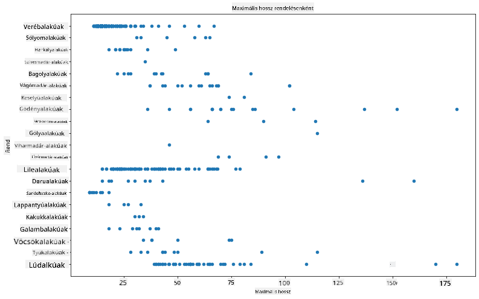
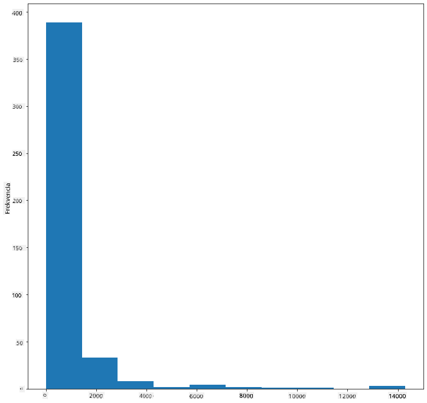
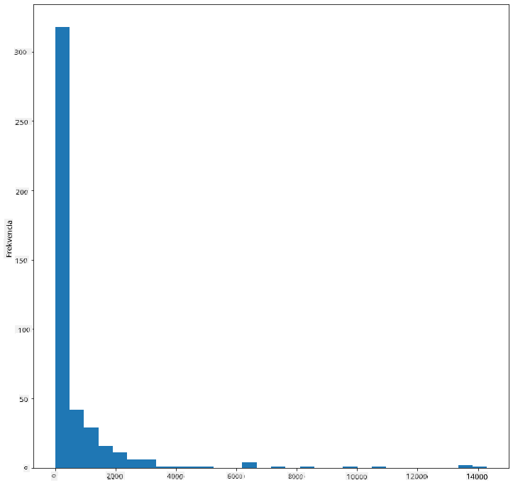
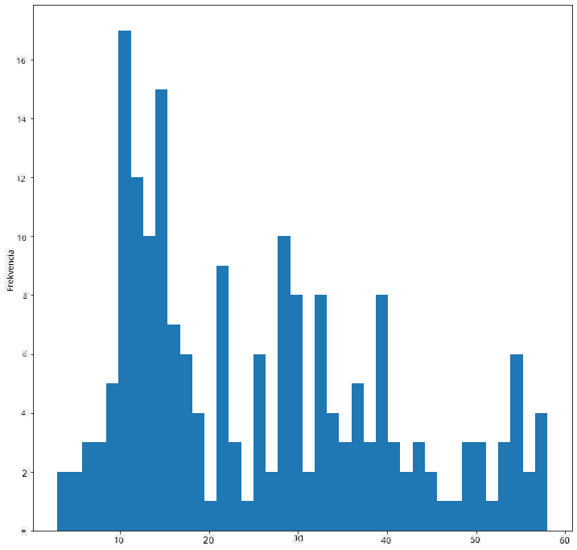
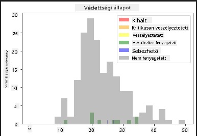
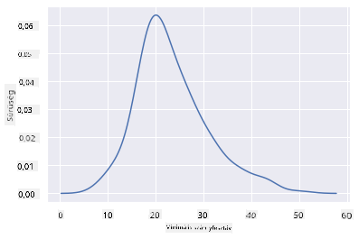
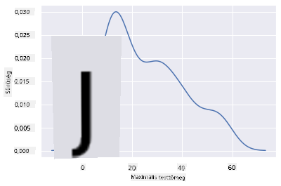
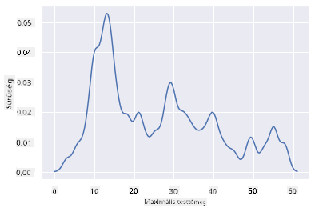
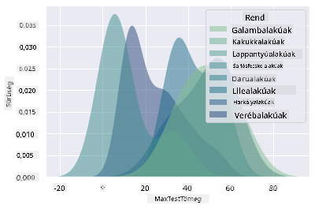
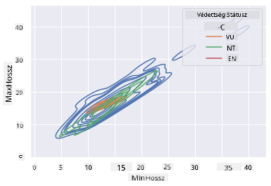

<!--
CO_OP_TRANSLATOR_METADATA:
{
  "original_hash": "87faccac113d772551486a67a607153e",
  "translation_date": "2025-08-26T16:49:30+00:00",
  "source_file": "3-Data-Visualization/10-visualization-distributions/README.md",
  "language_code": "hu"
}
-->
# Az eloszlások vizualizálása

| ](../../sketchnotes/10-Visualizing-Distributions.png)|
|:---:|
| Az eloszlások vizualizálása - _Sketchnote készítette: [@nitya](https://twitter.com/nitya)_ |

Az előző leckében érdekes tényeket tanultál a Minnesotában élő madarakról szóló adathalmazról. Hibás adatokat találtál a kiugró értékek vizualizálásával, és megvizsgáltad a madárkategóriák közötti különbségeket a maximális hosszúságuk alapján.

## [Előadás előtti kvíz](https://purple-hill-04aebfb03.1.azurestaticapps.net/quiz/18)
## Fedezd fel a madarak adathalmazát

Egy másik módja az adatok mélyebb megértésének, ha megvizsgáljuk azok eloszlását, vagyis azt, hogy az adatok hogyan rendeződnek egy tengely mentén. Például szeretnéd megtudni, hogy milyen az általános eloszlás ebben az adathalmazban a madarak maximális szárnyfesztávolsága vagy maximális testtömege alapján.

Fedezzünk fel néhány tényt az adatok eloszlásáról ebben az adathalmazban. Az _notebook.ipynb_ fájlban, amely a lecke mappájának gyökérkönyvtárában található, importáld a Pandas-t, a Matplotlib-et és az adatokat:

```python
import pandas as pd
import matplotlib.pyplot as plt
birds = pd.read_csv('../../data/birds.csv')
birds.head()
```

|      | Név                          | Tudományos név         | Kategória             | Rend         | Család   | Nemzetség   | Természetvédelmi státusz | MinHossz | MaxHossz | MinTesttömeg | MaxTesttömeg | MinSzárnyfesztáv | MaxSzárnyfesztáv |
| ---: | :--------------------------- | :--------------------- | :-------------------- | :----------- | :------- | :---------- | :----------------------- | --------: | --------: | ----------: | ----------: | ----------: | ----------: |
|    0 | Feketehasú sípoló kacsa      | Dendrocygna autumnalis | Kacsák/Ludak/Vízimadarak | Anseriformes | Anatidae | Dendrocygna | LC                     |        47 |        56 |         652 |        1020 |          76 |          94 |
|    1 | Fulvous sípoló kacsa         | Dendrocygna bicolor    | Kacsák/Ludak/Vízimadarak | Anseriformes | Anatidae | Dendrocygna | LC                     |        45 |        53 |         712 |        1050 |          85 |          93 |
|    2 | Hóliba                       | Anser caerulescens     | Kacsák/Ludak/Vízimadarak | Anseriformes | Anatidae | Anser       | LC                     |        64 |        79 |        2050 |        4050 |         135 |         165 |
|    3 | Ross-liba                    | Anser rossii           | Kacsák/Ludak/Vízimadarak | Anseriformes | Anatidae | Anser       | LC                     |      57.3 |        64 |        1066 |        1567 |         113 |         116 |
|    4 | Nagy fehérhomlokú lúd        | Anser albifrons        | Kacsák/Ludak/Vízimadarak | Anseriformes | Anatidae | Anser       | LC                     |        64 |        81 |        1930 |        3310 |         130 |         165 |

Általánosságban gyorsan megvizsgálhatod az adatok eloszlását egy szórási diagram segítségével, ahogy az előző leckében tettük:

```python
birds.plot(kind='scatter',x='MaxLength',y='Order',figsize=(12,8))

plt.title('Max Length per Order')
plt.ylabel('Order')
plt.xlabel('Max Length')

plt.show()
```


Ez áttekintést ad a madarak testhosszának általános eloszlásáról rendenként, de nem a legoptimálisabb módja az igazi eloszlások megjelenítésének. Ezt a feladatot általában hisztogramokkal oldják meg.

## Hisztogramok használata

A Matplotlib kiváló eszközöket kínál az adatok eloszlásának vizualizálására hisztogramok segítségével. Ez a fajta diagram hasonlít az oszlopdiagramhoz, ahol az eloszlás az oszlopok emelkedéséből és csökkenéséből látható. Hisztogram készítéséhez numerikus adatokra van szükség. Hisztogram létrehozásához a diagram típusát 'hist'-ként kell megadni. Ez a diagram az egész adathalmaz MaxBodyMass eloszlását mutatja. Az adatok tömbjét kisebb bin-ekre osztva megjeleníti az értékek eloszlását:

```python
birds['MaxBodyMass'].plot(kind = 'hist', bins = 10, figsize = (12,12))
plt.show()
```


Ahogy látható, a több mint 400 madár többsége ebben az adathalmazban 2000 alatti Max Body Mass tartományba esik. További betekintést nyerhetsz az adatokba, ha a `bins` paramétert magasabb számra, például 30-ra állítod:

```python
birds['MaxBodyMass'].plot(kind = 'hist', bins = 30, figsize = (12,12))
plt.show()
```


Ez a diagram kicsit részletesebb módon mutatja az eloszlást. Egy kevésbé balra torzított diagramot hozhatsz létre, ha csak egy adott tartományba eső adatokat választasz ki:

Szűrd az adatokat úgy, hogy csak azok a madarak szerepeljenek, amelyek testtömege 60 alatt van, és állítsd a `bins` értékét 40-re:

```python
filteredBirds = birds[(birds['MaxBodyMass'] > 1) & (birds['MaxBodyMass'] < 60)]      
filteredBirds['MaxBodyMass'].plot(kind = 'hist',bins = 40,figsize = (12,12))
plt.show()     
```


✅ Próbálj ki más szűrőket és adatpontokat. Az adatok teljes eloszlásának megtekintéséhez távolítsd el a `['MaxBodyMass']` szűrőt, hogy címkézett eloszlásokat mutass.

A hisztogram további színezési és címkézési lehetőségeket is kínál:

Hozz létre egy 2D hisztogramot, hogy összehasonlítsd két eloszlás kapcsolatát. Hasonlítsuk össze a `MaxBodyMass` és a `MaxLength` értékeket. A Matplotlib beépített módot kínál a konvergencia megjelenítésére világosabb színek használatával:

```python
x = filteredBirds['MaxBodyMass']
y = filteredBirds['MaxLength']

fig, ax = plt.subplots(tight_layout=True)
hist = ax.hist2d(x, y)
```
Úgy tűnik, hogy van egy várható korreláció e két elem között egy előre látható tengely mentén, egy különösen erős konvergencia ponttal:


A hisztogramok alapértelmezés szerint jól működnek numerikus adatokkal. Mi a helyzet, ha szöveges adatok alapján szeretnéd látni az eloszlásokat? 
## Az adathalmaz eloszlásának vizsgálata szöveges adatok alapján 

Ez az adathalmaz jó információkat tartalmaz a madárkategóriákról, nemzetségekről, fajokról és családokról, valamint természetvédelmi státuszukról. Nézzük meg közelebbről ezt a természetvédelmi információt. Mi az eloszlás a madarak természetvédelmi státusza szerint?

> ✅ Az adathalmazban több rövidítés található, amelyek a természetvédelmi státuszt írják le. Ezek a rövidítések az [IUCN Vörös Lista Kategóriáiból](https://www.iucnredlist.org/) származnak, amely egy szervezet, amely a fajok státuszát katalogizálja.
> 
> - CR: Kritikus veszélyeztetett
> - EN: Veszélyeztetett
> - EX: Kihalt
> - LC: Legkevésbé aggasztó
> - NT: Mérsékelten veszélyeztetett
> - VU: Sebezhető

Ezek szöveges értékek, így átalakítást kell végezned, hogy hisztogramot készíthess. A szűrtBirds adatkeret használatával jelenítsd meg a természetvédelmi státuszt a minimális szárnyfesztávolság mellett. Mit látsz?

```python
x1 = filteredBirds.loc[filteredBirds.ConservationStatus=='EX', 'MinWingspan']
x2 = filteredBirds.loc[filteredBirds.ConservationStatus=='CR', 'MinWingspan']
x3 = filteredBirds.loc[filteredBirds.ConservationStatus=='EN', 'MinWingspan']
x4 = filteredBirds.loc[filteredBirds.ConservationStatus=='NT', 'MinWingspan']
x5 = filteredBirds.loc[filteredBirds.ConservationStatus=='VU', 'MinWingspan']
x6 = filteredBirds.loc[filteredBirds.ConservationStatus=='LC', 'MinWingspan']

kwargs = dict(alpha=0.5, bins=20)

plt.hist(x1, **kwargs, color='red', label='Extinct')
plt.hist(x2, **kwargs, color='orange', label='Critically Endangered')
plt.hist(x3, **kwargs, color='yellow', label='Endangered')
plt.hist(x4, **kwargs, color='green', label='Near Threatened')
plt.hist(x5, **kwargs, color='blue', label='Vulnerable')
plt.hist(x6, **kwargs, color='gray', label='Least Concern')

plt.gca().set(title='Conservation Status', ylabel='Min Wingspan')
plt.legend();
```



Úgy tűnik, nincs jó korreláció a minimális szárnyfesztávolság és a természetvédelmi státusz között. Tesztelj más elemeket az adathalmazból ezzel a módszerrel. Próbálj ki különböző szűrőket is. Találsz bármilyen korrelációt?

## Sűrűségdiagramok

Észrevehetted, hogy az eddig látott hisztogramok "lépcsőzetesek", és nem folynak simán ívben. Ha simább sűrűségdiagramot szeretnél készíteni, próbáld ki a sűrűségdiagramot.

A sűrűségdiagramokkal való munkához ismerkedj meg egy új diagramkészítő könyvtárral, a [Seaborn](https://seaborn.pydata.org/generated/seaborn.kdeplot.html)-nal. 

A Seaborn betöltése után próbálj ki egy alapvető sűrűségdiagramot:

```python
import seaborn as sns
import matplotlib.pyplot as plt
sns.kdeplot(filteredBirds['MinWingspan'])
plt.show()
```


Láthatod, hogy a diagram visszatükrözi a korábbi minimális szárnyfesztávolság adatokat; csak egy kicsit simább. A Seaborn dokumentációja szerint: "A hisztogramhoz képest a KDE olyan diagramot tud készíteni, amely kevésbé zsúfolt és könnyebben értelmezhető, különösen több eloszlás rajzolásakor. De torzításokat is bevezethet, ha az alapul szolgáló eloszlás korlátozott vagy nem sima. A reprezentáció minősége szintén függ a jó simítási paraméterek kiválasztásától." [forrás](https://seaborn.pydata.org/generated/seaborn.kdeplot.html) Más szóval, a kiugró értékek, mint mindig, rossz hatással lehetnek a diagramokra.

Ha újra szeretnéd vizsgálni azt a szaggatott MaxBodyMass vonalat, amelyet a második diagramon készítettél, nagyon jól kisimíthatod, ha újra elkészíted ezt a módszert használva:

```python
sns.kdeplot(filteredBirds['MaxBodyMass'])
plt.show()
```


Ha sima, de nem túl sima vonalat szeretnél, szerkeszd a `bw_adjust` paramétert: 

```python
sns.kdeplot(filteredBirds['MaxBodyMass'], bw_adjust=.2)
plt.show()
```


✅ Olvass utána a rendelkezésre álló paramétereknek ehhez a diagramtípushoz, és kísérletezz!

Ez a diagramtípus gyönyörűen magyarázó vizualizációkat kínál. Néhány kódsorral például megmutathatod a madarak rendenkénti maximális testtömegének sűrűségét:

```python
sns.kdeplot(
   data=filteredBirds, x="MaxBodyMass", hue="Order",
   fill=True, common_norm=False, palette="crest",
   alpha=.5, linewidth=0,
)
```



Több változó sűrűségét is térképezheted egy diagramon. Teszteld a madarak MaxLength és MinLength értékeit a természetvédelmi státuszukkal összehasonlítva:

```python
sns.kdeplot(data=filteredBirds, x="MinLength", y="MaxLength", hue="ConservationStatus")
```



Talán érdemes kutatni, hogy a 'Sebezhető' madarak hosszúsága szerinti klaszter jelentőséggel bír-e vagy sem.

## 🚀 Kihívás

A hisztogramok kifinomultabb diagramtípusok, mint az alapvető szórási diagramok, oszlopdiagramok vagy vonaldiagramok. Keress jó példákat a hisztogramok használatára az interneten. Hogyan használják őket, mit mutatnak be, és milyen területeken vagy kutatási területeken alkalmazzák őket gyakran?

## [Előadás utáni kvíz](https://purple-hill-04aebfb03.1.azurestaticapps.net/quiz/19)

## Áttekintés és önálló tanulás

Ebben a leckében a Matplotlib-et használtad, és elkezdtél dolgozni a Seaborn-nal, hogy kifinomultabb diagramokat készíts. Kutass a Seaborn `kdeplot` funkciójáról, amely "folyamatos valószínűségi sűrűség görbét készít egy vagy több dimenzióban". Olvasd el [a dokumentációt](https://seaborn.pydata.org/generated/seaborn.kdeplot.html), hogy megértsd, hogyan működik.

## Feladat

[Alkalmazd a tudásodat](assignment.md)

---

**Felelősség kizárása**:  
Ez a dokumentum az AI fordítási szolgáltatás, a [Co-op Translator](https://github.com/Azure/co-op-translator) segítségével lett lefordítva. Bár törekszünk a pontosságra, kérjük, vegye figyelembe, hogy az automatikus fordítások hibákat vagy pontatlanságokat tartalmazhatnak. Az eredeti dokumentum az eredeti nyelvén tekintendő hiteles forrásnak. Kritikus információk esetén javasolt professzionális emberi fordítást igénybe venni. Nem vállalunk felelősséget semmilyen félreértésért vagy téves értelmezésért, amely a fordítás használatából eredhet.