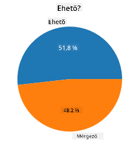
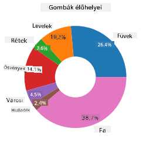

<!--
CO_OP_TRANSLATOR_METADATA:
{
  "original_hash": "af6a12015c6e250e500b570a9fa42593",
  "translation_date": "2025-08-26T17:27:56+00:00",
  "source_file": "3-Data-Visualization/11-visualization-proportions/README.md",
  "language_code": "hu"
}
-->
# Arányok vizualizálása

| ](../../sketchnotes/11-Visualizing-Proportions.png)|
|:---:|
|Arányok vizualizálása - _Sketchnote by [@nitya](https://twitter.com/nitya)_ |

Ebben a leckében egy természetközpontú adatállományt fogsz használni, hogy vizualizáld az arányokat, például azt, hogy hány különböző gombafaj található egy adott adatállományban a gombákról. Fedezzük fel ezeket a lenyűgöző gombákat egy Audubon által összeállított adatállomány segítségével, amely 23 lemezes gombafaj részleteit tartalmazza az Agaricus és Lepiota családokból. Kísérletezni fogsz ínycsiklandó vizualizációkkal, mint például:

- Torta diagramok 🥧
- Fánk diagramok 🍩
- Waffle diagramok 🧇

> 💡 A Microsoft Research által létrehozott [Charticulator](https://charticulator.com) nevű projekt egy ingyenes drag-and-drop felületet kínál adatvizualizációkhoz. Az egyik oktatóanyagukban szintén ezt a gomba adatállományt használják! Így egyszerre fedezheted fel az adatokat és tanulhatod meg a könyvtár használatát: [Charticulator oktatóanyag](https://charticulator.com/tutorials/tutorial4.html).

## [Előadás előtti kvíz](https://purple-hill-04aebfb03.1.azurestaticapps.net/quiz/20)

## Ismerd meg a gombáidat 🍄

A gombák nagyon érdekesek. Importáljunk egy adatállományt, hogy tanulmányozzuk őket:

```python
import pandas as pd
import matplotlib.pyplot as plt
mushrooms = pd.read_csv('../../data/mushrooms.csv')
mushrooms.head()
```
Egy táblázat jelenik meg, amely remek elemzési adatokat tartalmaz:


| osztály   | kalap-alak | kalap-felület | kalap-szín | zúzódások | illat    | lemez-csatlakozás | lemez-távolság | lemez-méret | lemez-szín | szár-alak | szár-gyökér | szár-felület-gyűrű-felett | szár-felület-gyűrű-alatt | szár-szín-gyűrű-felett | szár-szín-gyűrű-alatt | fátyol-típus | fátyol-szín | gyűrű-szám | gyűrű-típus | spóra-nyomat-szín | populáció | élőhely |
| --------- | --------- | ----------- | --------- | ------- | ------- | --------------- | ------------ | --------- | ---------- | ----------- | ---------- | ------------------------ | ------------------------ | ---------------------- | ---------------------- | --------- | ---------- | ----------- | --------- | ----------------- | ---------- | ------- |
| Mérgező   | Domború   | Sima        | Barna     | Zúzódik | Szúrós  | Szabad          | Szoros       | Keskeny   | Fekete     | Táguló      | Egyenlő    | Sima                     | Sima                     | Fehér                  | Fehér                  | Részleges  | Fehér      | Egy         | Függőleges | Fekete            | Szórványos | Városi  |
| Ehető     | Domború   | Sima        | Sárga     | Zúzódik | Mandula | Szabad          | Szoros       | Széles    | Fekete     | Táguló      | Klub       | Sima                     | Sima                     | Fehér                  | Fehér                  | Részleges  | Fehér      | Egy         | Függőleges | Barna             | Számos     | Füves   |
| Ehető     | Harang    | Sima        | Fehér     | Zúzódik | Ánizs   | Szabad          | Szoros       | Széles    | Barna      | Táguló      | Klub       | Sima                     | Sima                     | Fehér                  | Fehér                  | Részleges  | Fehér      | Egy         | Függőleges | Barna             | Számos     | Mezők   |
| Mérgező   | Domború   | Pikkelyes   | Fehér     | Zúzódik | Szúrós  | Szabad          | Szoros       | Keskeny   | Barna      | Táguló      | Egyenlő    | Sima                     | Sima                     | Fehér                  | Fehér                  | Részleges  | Fehér      | Egy         | Függőleges | Fekete            | Szórványos | Városi  |

Rögtön észreveheted, hogy az összes adat szöveges. Az adatokat át kell alakítanod, hogy diagramon használhatóak legyenek. Valójában az adatok többsége objektumként van ábrázolva:

```python
print(mushrooms.select_dtypes(["object"]).columns)
```

Az eredmény:

```output
Index(['class', 'cap-shape', 'cap-surface', 'cap-color', 'bruises', 'odor',
       'gill-attachment', 'gill-spacing', 'gill-size', 'gill-color',
       'stalk-shape', 'stalk-root', 'stalk-surface-above-ring',
       'stalk-surface-below-ring', 'stalk-color-above-ring',
       'stalk-color-below-ring', 'veil-type', 'veil-color', 'ring-number',
       'ring-type', 'spore-print-color', 'population', 'habitat'],
      dtype='object')
```
Konvertáld az 'osztály' oszlopot kategóriává:

```python
cols = mushrooms.select_dtypes(["object"]).columns
mushrooms[cols] = mushrooms[cols].astype('category')
```

```python
edibleclass=mushrooms.groupby(['class']).count()
edibleclass
```

Most, ha kinyomtatod a gomba adatokat, láthatod, hogy azokat kategóriákba csoportosították a mérgező/ehető osztály szerint:


|           | kalap-alak | kalap-felület | kalap-szín | zúzódások | illat | lemez-csatlakozás | lemez-távolság | lemez-méret | lemez-szín | szár-alak | ... | szár-felület-gyűrű-alatt | szár-szín-gyűrű-felett | szár-szín-gyűrű-alatt | fátyol-típus | fátyol-szín | gyűrű-szám | gyűrű-típus | spóra-nyomat-szín | populáció | élőhely |
| --------- | --------- | ----------- | --------- | ------- | ---- | --------------- | ------------ | --------- | ---------- | ----------- | --- | ------------------------ | ---------------------- | ---------------------- | --------- | ---------- | ----------- | --------- | ----------------- | ---------- | ------- |
| osztály   |           |             |           |         |      |                 |              |           |            |             |     |                          |                        |                        |           |            |             |           |                   |            |         |
| Ehető     | 4208      | 4208        | 4208      | 4208    | 4208 | 4208            | 4208         | 4208      | 4208       | 4208        | ... | 4208                     | 4208                   | 4208                   | 4208      | 4208       | 4208        | 4208      | 4208              | 4208       | 4208    |
| Mérgező   | 3916      | 3916        | 3916      | 3916    | 3916 | 3916            | 3916         | 3916      | 3916       | 3916        | ... | 3916                     | 3916                   | 3916                   | 3916      | 3916       | 3916        | 3916      | 3916              | 3916       | 3916    |

Ha követed a táblázatban bemutatott sorrendet az osztály kategória címkék létrehozásához, készíthetsz egy torta diagramot:

## Torta!

```python
labels=['Edible','Poisonous']
plt.pie(edibleclass['population'],labels=labels,autopct='%.1f %%')
plt.title('Edible?')
plt.show()
```
Voilá, egy torta diagram, amely megmutatja az adatok arányait a gombák két osztálya szerint. Nagyon fontos, hogy a címkék sorrendje helyes legyen, különösen itt, ezért ellenőrizd a címke tömb létrehozásának sorrendjét!



## Fánkok!

Egy vizuálisan érdekesebb torta diagram a fánk diagram, amely egy lyukkal rendelkező torta diagram. Nézzük meg az adatainkat ezzel a módszerrel.

Nézd meg a különböző élőhelyeket, ahol a gombák nőnek:

```python
habitat=mushrooms.groupby(['habitat']).count()
habitat
```
Itt az adatokat élőhely szerint csoportosítod. Hét élőhely van felsorolva, ezeket használd címkékként a fánk diagramhoz:

```python
labels=['Grasses','Leaves','Meadows','Paths','Urban','Waste','Wood']

plt.pie(habitat['class'], labels=labels,
        autopct='%1.1f%%', pctdistance=0.85)
  
center_circle = plt.Circle((0, 0), 0.40, fc='white')
fig = plt.gcf()

fig.gca().add_artist(center_circle)
  
plt.title('Mushroom Habitats')
  
plt.show()
```



Ez a kód egy diagramot és egy középső kört rajzol, majd hozzáadja azt a diagramhoz. A középső kör szélességét a `0.40` érték megváltoztatásával módosíthatod.

A fánk diagramok többféleképpen is testreszabhatók, például a címkék olvashatóságának kiemelésével. További információt a [dokumentációban](https://matplotlib.org/stable/gallery/pie_and_polar_charts/pie_and_donut_labels.html?highlight=donut) találsz.

Most, hogy tudod, hogyan csoportosítsd az adatokat és jelenítsd meg őket torta vagy fánk formájában, felfedezhetsz más típusú diagramokat. Próbálj ki egy waffle diagramot, amely egy másik módja a mennyiségek vizualizálásának.
## Waffle!

A 'waffle' típusú diagram egy másik módja a mennyiségek vizualizálásának egy 2D négyzetes tömb formájában. Próbáld meg vizualizálni a gombakalap színek különböző mennyiségeit ebben az adatállományban. Ehhez telepítened kell egy segédkönyvtárat, a [PyWaffle](https://pypi.org/project/pywaffle/) nevűt, és használnod kell a Matplotlib-et:

```python
pip install pywaffle
```

Válassz ki egy adat szegmenst a csoportosításhoz:

```python
capcolor=mushrooms.groupby(['cap-color']).count()
capcolor
```

Hozz létre egy waffle diagramot címkék létrehozásával, majd csoportosítsd az adatokat:

```python
import pandas as pd
import matplotlib.pyplot as plt
from pywaffle import Waffle
  
data ={'color': ['brown', 'buff', 'cinnamon', 'green', 'pink', 'purple', 'red', 'white', 'yellow'],
    'amount': capcolor['class']
     }
  
df = pd.DataFrame(data)
  
fig = plt.figure(
    FigureClass = Waffle,
    rows = 100,
    values = df.amount,
    labels = list(df.color),
    figsize = (30,30),
    colors=["brown", "tan", "maroon", "green", "pink", "purple", "red", "whitesmoke", "yellow"],
)
```

A waffle diagram segítségével egyértelműen láthatod a gombakalap színek arányait ebben az adatállományban. Érdekes módon sok zöld kalapú gomba van!


✅ A PyWaffle támogatja az ikonokat a diagramokon belül, amelyek bármelyik [Font Awesome](https://fontawesome.com/) ikon használatát lehetővé teszik. Kísérletezz, hogy még érdekesebb waffle diagramot készíts ikonok helyett négyzetekkel.

Ebben a leckében három módot tanultál meg az arányok vizualizálására. Először csoportosítanod kell az adatokat kategóriákba, majd eldönteni, hogy melyik a legjobb mód az adatok megjelenítésére - torta, fánk vagy waffle. Mindegyik ínycsiklandó és azonnali pillanatképet nyújt az adatállományról.

## 🚀 Kihívás

Próbáld meg újra létrehozni ezeket az ínycsiklandó diagramokat a [Charticulator](https://charticulator.com) segítségével.
## [Előadás utáni kvíz](https://purple-hill-04aebfb03.1.azurestaticapps.net/quiz/21)

## Áttekintés és önálló tanulás

Néha nem egyértelmű, hogy mikor használjunk torta, fánk vagy waffle diagramot. Íme néhány cikk, amit elolvashatsz a témában:

https://www.beautiful.ai/blog/battle-of-the-charts-pie-chart-vs-donut-chart

https://medium.com/@hypsypops/pie-chart-vs-donut-chart-showdown-in-the-ring-5d24fd86a9ce

https://www.mit.edu/~mbarker/formula1/f1help/11-ch-c6.htm

https://medium.datadriveninvestor.com/data-visualization-done-the-right-way-with-tableau-waffle-chart-fdf2a19be402

Végezz kutatást, hogy további információkat találj erről a nehéz döntésről.
## Feladat

[Próbáld ki Excelben](assignment.md)

---

**Felelősségkizárás**:  
Ez a dokumentum az [Co-op Translator](https://github.com/Azure/co-op-translator) AI fordítási szolgáltatás segítségével készült. Bár törekszünk a pontosságra, kérjük, vegye figyelembe, hogy az automatikus fordítások hibákat vagy pontatlanságokat tartalmazhatnak. Az eredeti dokumentum az eredeti nyelvén tekintendő hiteles forrásnak. Kritikus információk esetén javasolt a professzionális, emberi fordítás igénybevétele. Nem vállalunk felelősséget a fordítás használatából eredő félreértésekért vagy téves értelmezésekért.