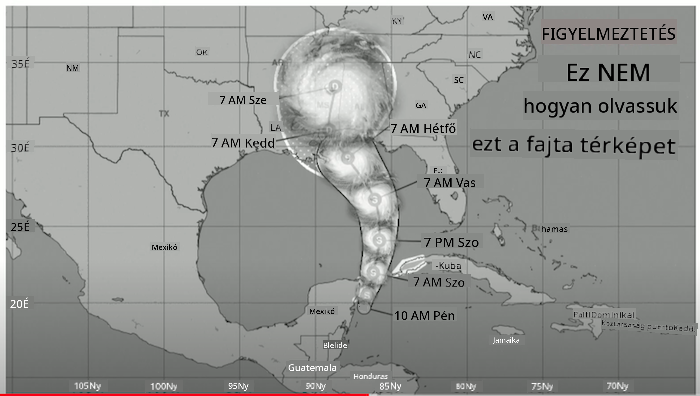
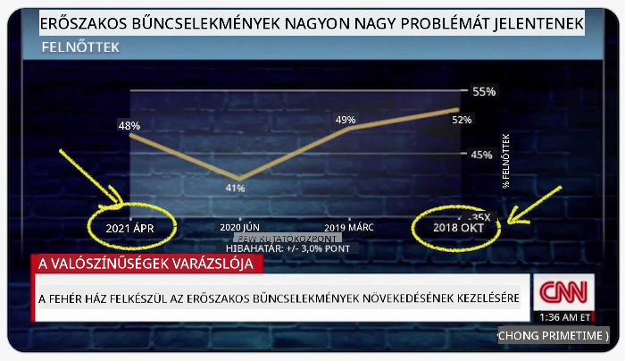
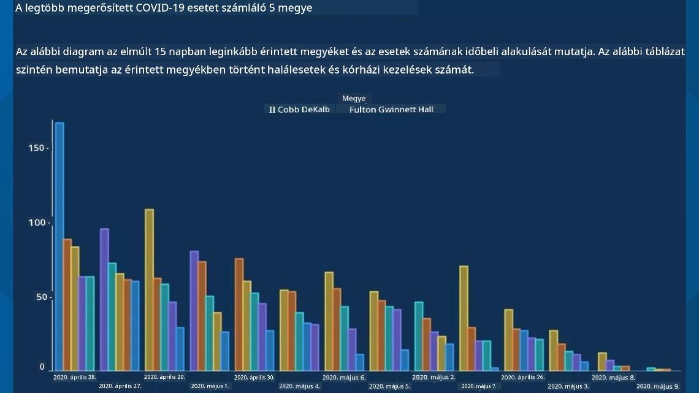
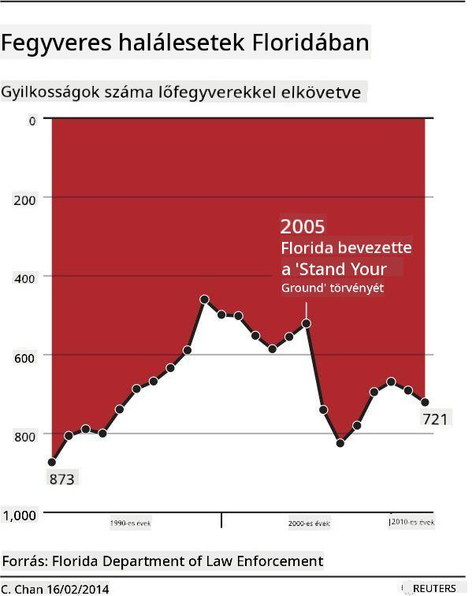
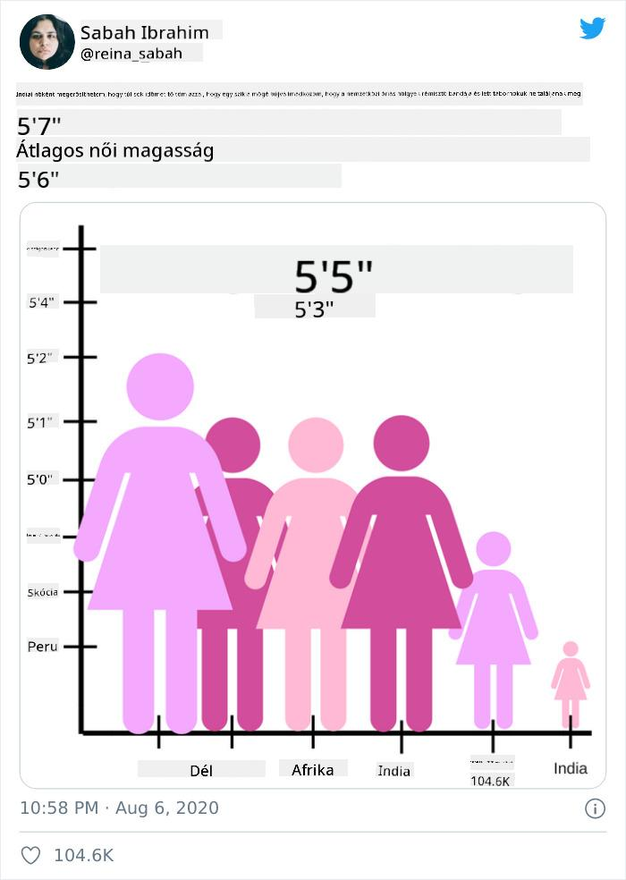
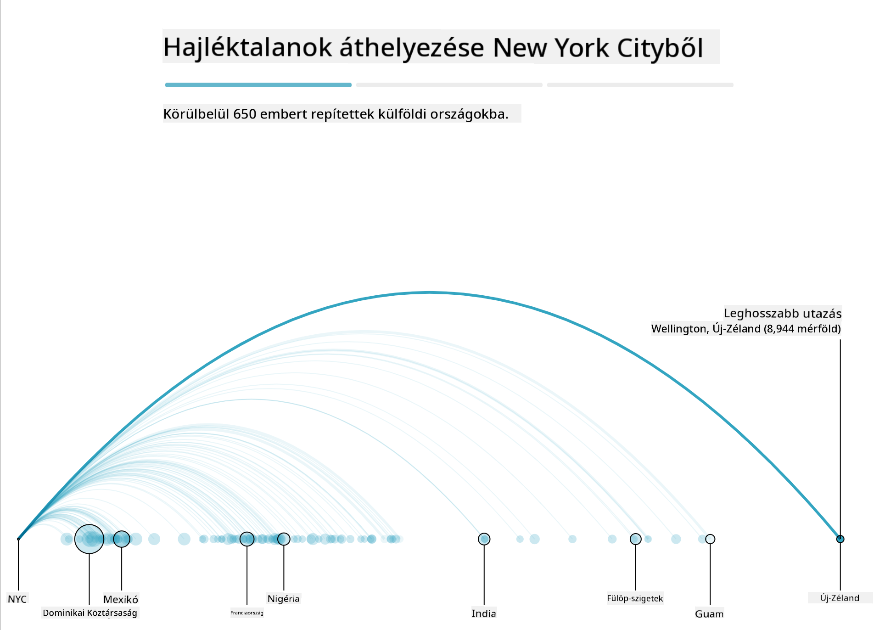
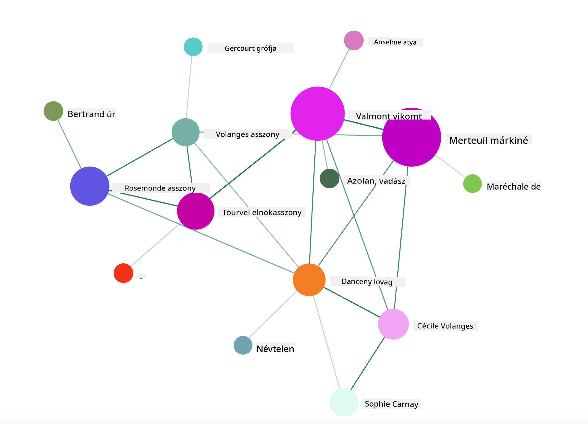

<!--
CO_OP_TRANSLATOR_METADATA:
{
  "original_hash": "4ec4747a9f4f7d194248ea29903ae165",
  "translation_date": "2025-08-26T16:43:14+00:00",
  "source_file": "3-Data-Visualization/13-meaningful-visualizations/README.md",
  "language_code": "hu"
}
-->
# Jelentőségteljes vizualizációk készítése

| ](../../sketchnotes/13-MeaningfulViz.png)|
|:---:|
| Jelentőségteljes vizualizációk - _Sketchnote by [@nitya](https://twitter.com/nitya)_ |

> "Ha elég sokáig kínozod az adatokat, bármit bevallanak" -- [Ronald Coase](https://en.wikiquote.org/wiki/Ronald_Coase)

Az adatelemző egyik alapvető készsége, hogy képes olyan jelentőségteljes adatvizualizációt létrehozni, amely segít megválaszolni a felmerülő kérdéseket. Mielőtt vizualizálnád az adatokat, meg kell győződnöd arról, hogy megtisztítottad és előkészítetted őket, ahogyan azt a korábbi leckékben tetted. Ezután elkezdheted eldönteni, hogyan mutasd be legjobban az adatokat.

Ebben a leckében áttekinted:

1. Hogyan válaszd ki a megfelelő diagramtípust
2. Hogyan kerüld el a megtévesztő diagramokat
3. Hogyan dolgozz a színekkel
4. Hogyan formázd a diagramokat az olvashatóság érdekében
5. Hogyan készíts animált vagy 3D diagramokat
6. Hogyan készíts kreatív vizualizációt

## [Előadás előtti kvíz](https://purple-hill-04aebfb03.1.azurestaticapps.net/quiz/24)

## Válaszd ki a megfelelő diagramtípust

A korábbi leckékben különféle érdekes adatvizualizációkat készítettél Matplotlib és Seaborn segítségével. Általánosságban véve a [megfelelő diagramtípust](https://chartio.com/learn/charts/how-to-select-a-data-vizualization/) az alábbi táblázat alapján választhatod ki a kérdésedhez:

| Amit szeretnél:            | Amit használnod kell:           |
| -------------------------- | ------------------------------- |
| Időbeli adattrendek bemutatása | Vonal                          |
| Kategóriák összehasonlítása | Oszlop, Kördiagram              |
| Összegek összehasonlítása   | Kördiagram, Halmozott oszlop    |
| Kapcsolatok bemutatása      | Szórás, Vonal, Facet, Kettős vonal |
| Eloszlások bemutatása       | Szórás, Hisztogram, Dobozdiagram |
| Arányok bemutatása          | Kördiagram, Donut, Waffle       |

> ✅ Az adatok összetételétől függően előfordulhat, hogy szöveges adatokat numerikus formátumba kell konvertálnod, hogy a diagram támogassa őket.

## Kerüld el a megtévesztést

Még ha az adatelemző gondosan választja is ki a megfelelő diagramot az adatokhoz, számos módon lehet az adatokat úgy megjeleníteni, hogy bizonyos állításokat igazoljanak, gyakran az adatok hitelességének rovására. Számos példa van megtévesztő diagramokra és infografikákra!

[](https://www.youtube.com/watch?v=oX74Nge8Wkw "Hogyan hazudnak a diagramok")

> 🎥 Kattints a fenti képre egy konferenciaelőadásért a megtévesztő diagramokról

Ez a diagram megfordítja az X tengelyt, hogy az igazság ellentétét mutassa, dátum alapján:



[Ez a diagram](https://media.firstcoastnews.com/assets/WTLV/images/170ae16f-4643-438f-b689-50d66ca6a8d8/170ae16f-4643-438f-b689-50d66ca6a8d8_1140x641.jpg) még megtévesztőbb, mivel a szem a jobb oldalra irányul, hogy arra a következtetésre jusson, hogy az idő múlásával a COVID-esetek száma csökkent az egyes megyékben. Valójában, ha alaposan megnézed a dátumokat, rájössz, hogy azokat átrendezték, hogy ezt a megtévesztő csökkenő trendet mutassák.



Ez a hírhedt példa színt ÉS megfordított Y tengelyt használ a megtévesztéshez: ahelyett, hogy arra a következtetésre jutnánk, hogy a fegyveres halálesetek száma megugrott a fegyverbarát jogszabályok elfogadása után, valójában a szem becsapódik, hogy az ellenkezőjét gondolja:



Ez a furcsa diagram azt mutatja, hogyan lehet az arányokat manipulálni, komikus hatással:



Az összehasonlíthatatlan összehasonlítása egy másik árnyékos trükk. Van egy [csodálatos weboldal](https://tylervigen.com/spurious-correlations), amely "hamis korrelációkat" mutat be, például a Maine-i válási arány és a margarin fogyasztásának összefüggéseit. Egy Reddit csoport szintén gyűjti az [adatok csúnya felhasználását](https://www.reddit.com/r/dataisugly/top/?t=all).

Fontos megérteni, hogy a szem milyen könnyen becsapható megtévesztő diagramokkal. Még ha az adatelemző szándéka jó is, egy rossz diagramtípus, például túl sok kategóriát bemutató kördiagram választása megtévesztő lehet.

## Színek

A fent említett "Florida fegyveres erőszak" diagramon láthattad, hogy a szín hogyan adhat további jelentést a diagramokhoz, különösen azokhoz, amelyeket nem olyan könyvtárak, mint a Matplotlib és Seaborn terveztek, amelyek különféle ellenőrzött színkönyvtárakkal és palettákkal rendelkeznek. Ha kézzel készítesz diagramot, tanulmányozd egy kicsit a [színek elméletét](https://colormatters.com/color-and-design/basic-color-theory).

> ✅ Légy tudatában annak, hogy a diagramok tervezésekor az akadálymentesség fontos szempont. Néhány felhasználód színvak lehet - vajon a diagramod jól megjelenik a látássérült felhasználók számára?

Légy óvatos, amikor színeket választasz a diagramodhoz, mivel a szín olyan jelentést közvetíthet, amelyet nem szándékoztál. A "rózsaszín hölgyek" a fent említett "magasság" diagramon kifejezetten "nőies" jelentést hordoznak, ami hozzájárul a diagram furcsaságához.

Bár a [színek jelentése](https://colormatters.com/color-symbolism/the-meanings-of-colors) különböző lehet a világ különböző részein, és árnyalatuk szerint változhat. Általánosságban véve a színek jelentései a következők:

| Szín   | Jelentés             |
| ------ | ------------------- |
| piros  | erő                 |
| kék    | bizalom, hűség      |
| sárga  | boldogság, óvatosság |
| zöld   | ökológia, szerencse, irigység |
| lila   | boldogság           |
| narancs| élénkség            |

Ha az a feladatod, hogy egyedi színekkel készíts diagramot, győződj meg arról, hogy a diagramjaid akadálymentesek, és hogy a választott szín összhangban van az általad közvetíteni kívánt jelentéssel.

## Diagramok formázása az olvashatóság érdekében

A diagramok nem jelentőségteljesek, ha nem olvashatók! Szánj egy pillanatot arra, hogy megfontold a diagram szélességének és magasságának formázását, hogy jól illeszkedjen az adatokhoz. Ha egy változót (például az összes 50 államot) kell megjeleníteni, mutasd őket függőlegesen az Y tengelyen, ha lehetséges, hogy elkerüld a vízszintesen görgethető diagramot.

Címkézd fel a tengelyeket, adj meg egy jelmagyarázatot, ha szükséges, és kínálj felugró ablakokat az adatok jobb megértése érdekében.

Ha az adataid szövegesek és bőbeszédűek az X tengelyen, döntsd meg a szöveget az olvashatóság érdekében. A [Matplotlib](https://matplotlib.org/stable/tutorials/toolkits/mplot3d.html) 3D ábrázolást kínál, ha az adataid támogatják. Kifinomult adatvizualizációk készíthetők `mpl_toolkits.mplot3d` használatával.


## Animáció és 3D diagramok megjelenítése

A legjobb adatvizualizációk közül ma sok animált. Shirley Wu lenyűgözőeket készített D3-mal, például '[film flowers](http://bl.ocks.org/sxywu/raw/d612c6c653fb8b4d7ff3d422be164a5d/)', ahol minden virág egy film vizualizációja. Egy másik példa a Guardian számára a 'bussed out', egy interaktív élmény, amely vizualizációkat kombinál Greensockkal és D3-mal, valamint egy görgethető cikkformátummal, hogy bemutassa, hogyan kezeli NYC a hajléktalan problémáját azzal, hogy embereket szállít ki a városból.



> "Bussed Out: Hogyan mozgatja Amerika a hajléktalanokat" a [Guardian](https://www.theguardian.com/us-news/ng-interactive/2017/dec/20/bussed-out-america-moves-homeless-people-country-study) oldalán. Vizualizációk: Nadieh Bremer & Shirley Wu

Bár ez a lecke nem elegendő ahhoz, hogy mélyrehatóan megtanítsa ezeket az erőteljes vizualizációs könyvtárakat, próbáld ki a D3-at egy Vue.js alkalmazásban, egy könyvtár segítségével, amely a "Veszedelmes viszonyok" című könyv animált társadalmi hálózatának vizualizációját jeleníti meg.

> "Les Liaisons Dangereuses" egy levélregény, vagyis egy sor levelezésként bemutatott regény. Choderlos de Laclos írta 1782-ben, és a francia arisztokrácia két főszereplőjének, a Vicomte de Valmontnak és a Marquise de Merteuilnek a kegyetlen, erkölcsileg romlott társadalmi manővereiről szól a 18. század végén. Mindketten elbuknak a végén, de nem anélkül, hogy jelentős társadalmi károkat okoznának. A regény levelek sorozataként bontakozik ki, amelyeket különböző embereknek írtak a körükben, bosszút tervezve vagy egyszerűen bajt okozva. Készíts egy vizualizációt ezekről a levelekről, hogy felfedezd a narratíva főszereplőit vizuálisan.

Egy webalkalmazást fogsz elkészíteni, amely animált nézetet jelenít meg erről a társadalmi hálózatról. Egy könyvtárat használ, amelyet arra terveztek, hogy [hálózatot vizualizáljon](https://github.com/emiliorizzo/vue-d3-network) Vue.js és D3 segítségével. Amikor az alkalmazás fut, az adatokat a képernyőn húzva átrendezheted.



## Projekt: Hálózatot bemutató diagram készítése D3.js segítségével

> Ez a lecke mappa tartalmaz egy `solution` mappát, ahol megtalálhatod a kész projektet referenciaként.

1. Kövesd az utasításokat a README.md fájlban a kezdő mappa gyökerében. Győződj meg róla, hogy az NPM és a Node.js fut a gépeden, mielőtt telepíted a projekt függőségeit.

2. Nyisd meg a `starter/src` mappát. Felfedezel egy `assets` mappát, ahol található egy .json fájl az összes levéllel a regényből, számozva, "to" és "from" jelöléssel.

3. Egészítsd ki a kódot a `components/Nodes.vue` fájlban, hogy engedélyezd a vizualizációt. Keresd meg a `createLinks()` nevű metódust, és add hozzá a következő beágyazott ciklust.

Ciklussal járd be a .json objektumot, hogy rögzítsd a levelek "to" és "from" adatait, és építsd fel a `links` objektumot, hogy a vizualizációs könyvtár fel tudja dolgozni:

```javascript
//loop through letters
      let f = 0;
      let t = 0;
      for (var i = 0; i < letters.length; i++) {
          for (var j = 0; j < characters.length; j++) {
              
            if (characters[j] == letters[i].from) {
              f = j;
            }
            if (characters[j] == letters[i].to) {
              t = j;
            }
        }
        this.links.push({ sid: f, tid: t });
      }
  ```

Futtasd az alkalmazásodat a terminálból (npm run serve), és élvezd a vizualizációt!

## 🚀 Kihívás

Tegyél egy internetes túrát, hogy megtaláld a megtévesztő vizualizációkat. Hogyan csapja be a szerző a felhasználót, és szándékos-e? Próbáld meg kijavítani a vizualizációkat, hogy megmutasd, hogyan kellene kinézniük.

## [Előadás utáni kvíz](https://purple-hill-04aebfb03.1.azurestaticapps.net/quiz/25)

## Áttekintés és önálló tanulás

Íme néhány cikk, amelyet olvashatsz a megtévesztő adatvizualizációkról:

https://gizmodo.com/how-to-lie-with-data-visualization-1563576606

http://ixd.prattsi.org/2017/12/visual-lies-usability-in-deceptive-data-visualizations/

Nézd meg ezeket az érdekes vizualizációkat történelmi eszközökről és tárgyakról:

https://handbook.pubpub.org/

Olvasd el ezt a cikket arról, hogyan fokozhatja az animáció a vizualizációkat:

https://medium.com/@EvanSinar/use-animation-to-supercharge-data-visualization-cd905a882ad4

## Feladat

[Készítsd el saját egyedi vizualizációdat](assignment.md)

---

**Felelősség kizárása**:  
Ez a dokumentum az AI fordítási szolgáltatás [Co-op Translator](https://github.com/Azure/co-op-translator) segítségével lett lefordítva. Bár törekszünk a pontosságra, kérjük, vegye figyelembe, hogy az automatikus fordítások hibákat vagy pontatlanságokat tartalmazhatnak. Az eredeti dokumentum az eredeti nyelvén tekintendő hiteles forrásnak. Kritikus információk esetén javasolt professzionális emberi fordítást igénybe venni. Nem vállalunk felelősséget semmilyen félreértésért vagy téves értelmezésért, amely a fordítás használatából eredhet.