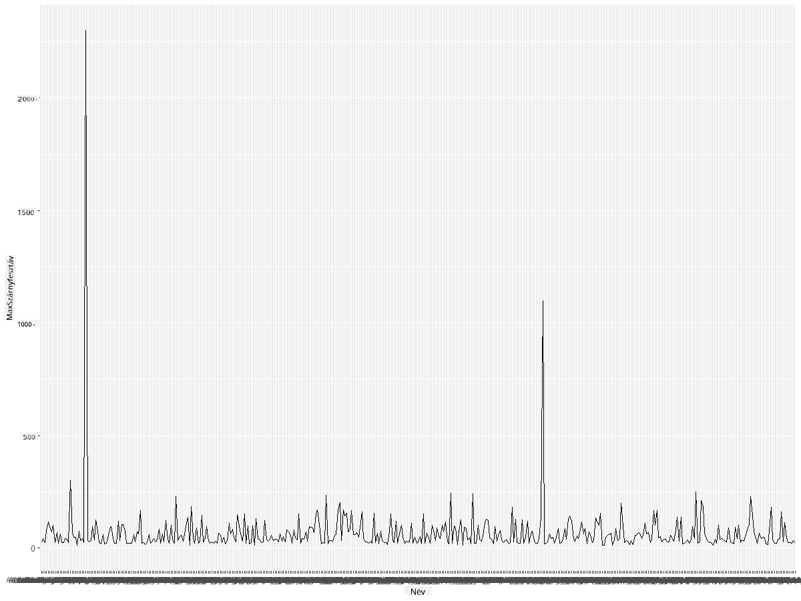
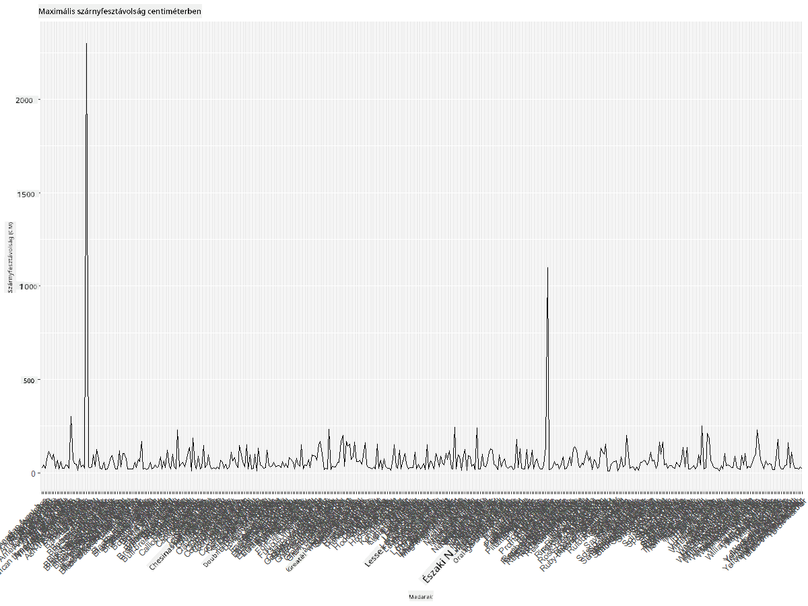
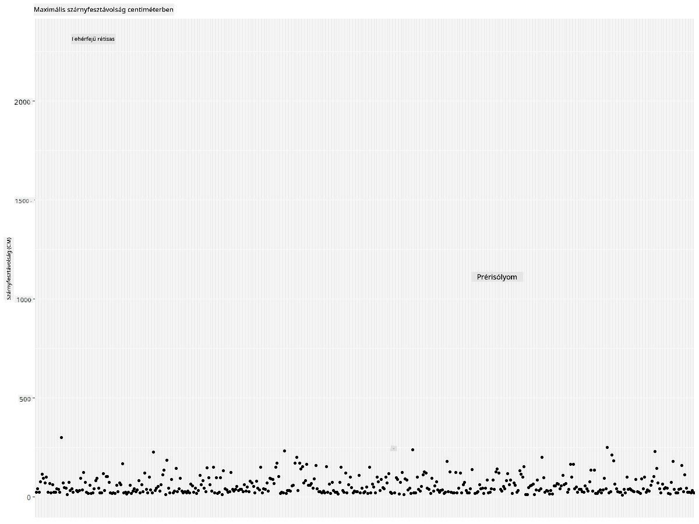
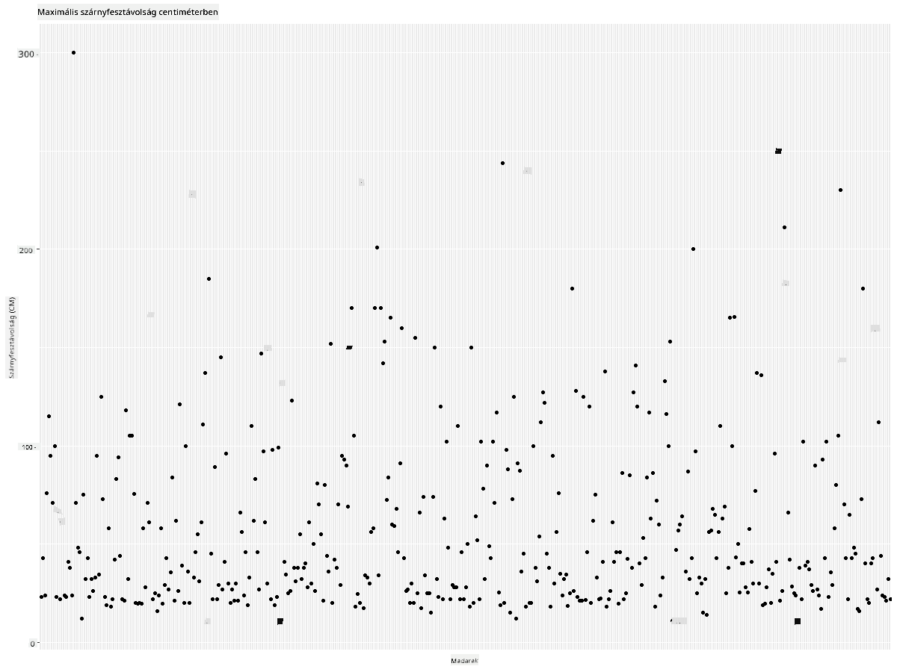
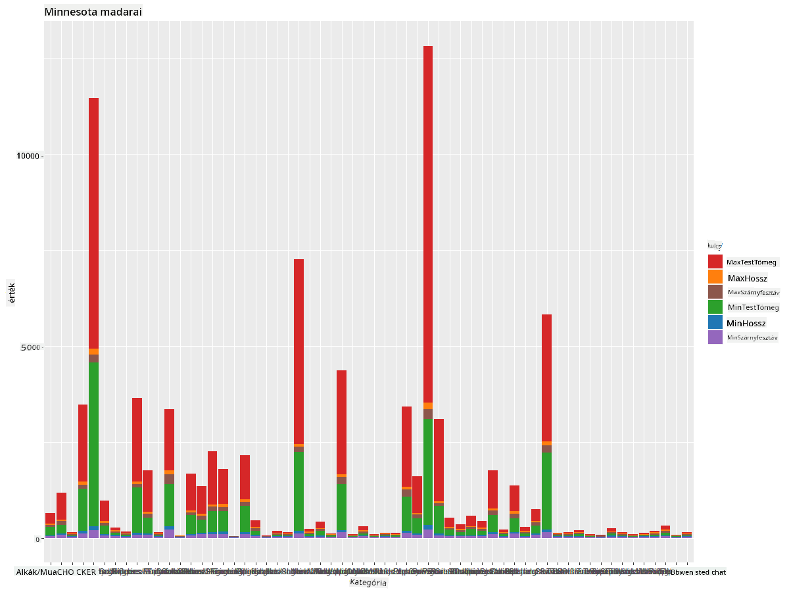
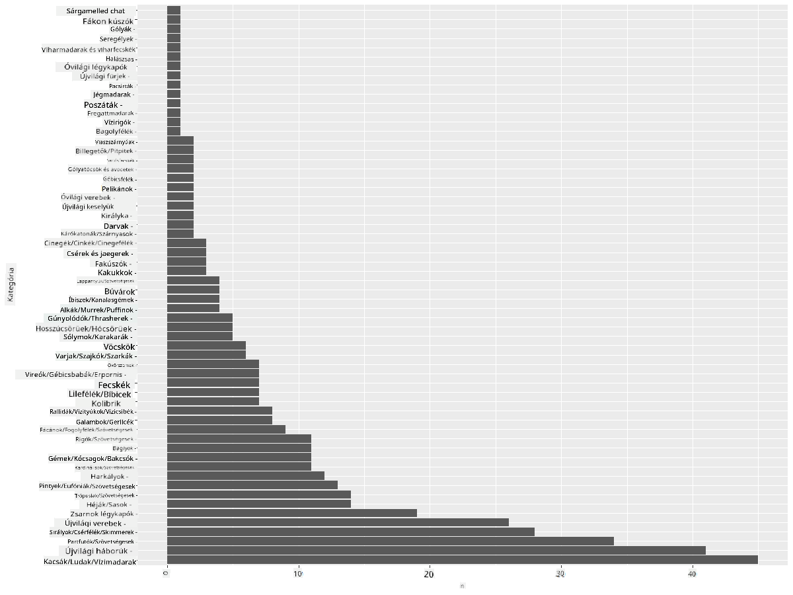
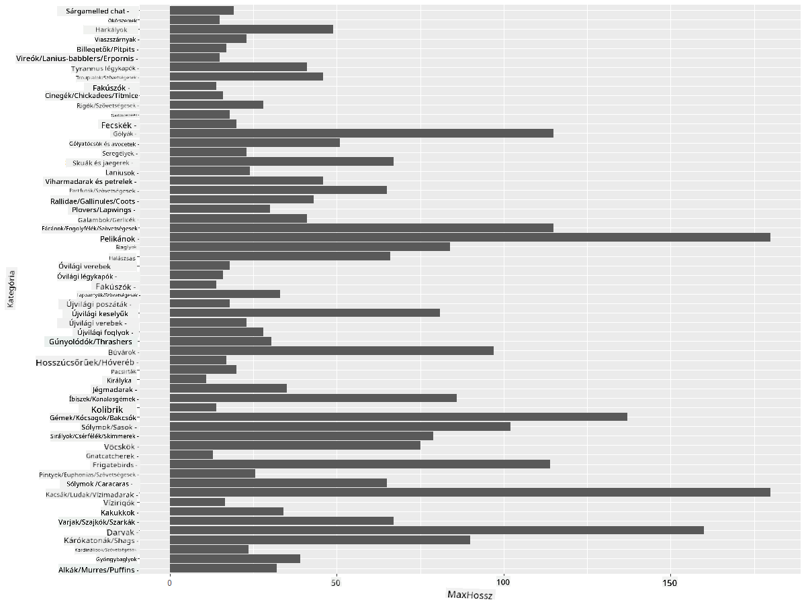
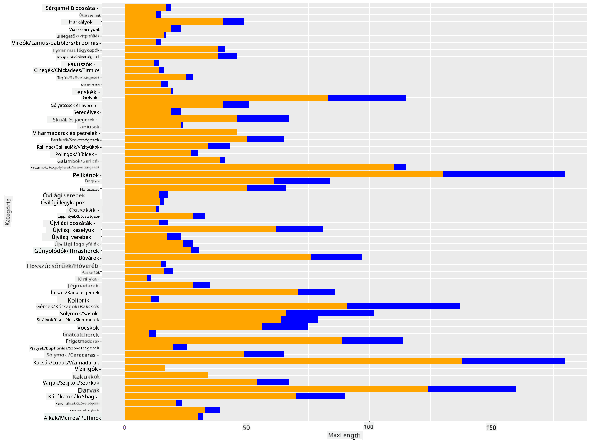

<!--
CO_OP_TRANSLATOR_METADATA:
{
  "original_hash": "22acf28f518a4769ea14fa42f4734b9f",
  "translation_date": "2025-08-26T17:07:45+00:00",
  "source_file": "3-Data-Visualization/R/09-visualization-quantities/README.md",
  "language_code": "hu"
}
-->
# Mennyiségek vizualizálása
| ](https://github.com/microsoft/Data-Science-For-Beginners/blob/main/sketchnotes/09-Visualizing-Quantities.png)|
|:---:|
| Mennyiségek vizualizálása - _Sketchnote by [@nitya](https://twitter.com/nitya)_ |

Ebben a leckében felfedezheted, hogyan használhatod az R nyelvben elérhető számos csomagot és könyvtárat, hogy érdekes vizualizációkat készíts a mennyiségek fogalma köré. Egy tisztított adatállomány segítségével, amely Minnesota madarairól szól, sok érdekes tényt tanulhatsz a helyi vadvilágról.  
## [Előadás előtti kvíz](https://purple-hill-04aebfb03.1.azurestaticapps.net/quiz/16)

## Szárnyfesztáv megfigyelése ggplot2-vel
Egy kiváló könyvtár, amely egyszerű és összetett diagramok és grafikonok készítésére alkalmas, a [ggplot2](https://cran.r-project.org/web/packages/ggplot2/index.html). Általánosságban a folyamat, amely során adatokat ábrázolunk ezekkel a könyvtárakkal, magában foglalja az adatkeret azon részeinek azonosítását, amelyeket meg szeretnénk célozni, az adatok szükséges átalakítását, az x és y tengely értékeinek hozzárendelését, a megjelenítendő diagram típusának kiválasztását, majd a diagram megjelenítését.

A `ggplot2` egy rendszer, amely deklaratív módon hoz létre grafikákat, a grafikai nyelvtan (Grammar of Graphics) alapján. A [grafikai nyelvtan](https://en.wikipedia.org/wiki/Ggplot2) egy általános séma az adatvizualizációhoz, amely a grafikonokat szemantikai összetevőkre bontja, mint például skálák és rétegek. Más szavakkal, az egyszerű kódolással történő univariáns vagy multivariáns adatok grafikonjainak létrehozásának könnyedsége teszi a `ggplot2`-t az R nyelvben a legnépszerűbb vizualizációs csomaggá. A felhasználó megadja a `ggplot2`-nek, hogyan térképezze fel a változókat az esztétikára, milyen grafikai primitíveket használjon, és a `ggplot2` elvégzi a többit.

> ✅ Diagram = Adatok + Esztétika + Geometria
> - Az adatok az adatállományt jelentik
> - Az esztétika a vizsgálandó változókat jelöli (x és y változók)
> - A geometria a diagram típusát jelenti (vonaldiagram, oszlopdiagram stb.)

Válaszd ki a legjobb geometriát (diagramtípust) az adataid és a történet alapján, amit el szeretnél mesélni a diagramon keresztül.

> - Trendek elemzéséhez: vonal, oszlop
> - Értékek összehasonlításához: oszlop, kördiagram, szórásdiagram
> - Az egészhez való viszony bemutatásához: kördiagram
> - Az adatok eloszlásának bemutatásához: szórásdiagram, oszlopdiagram
> - Értékek közötti kapcsolatok bemutatásához: vonal, szórásdiagram, buborékdiagram

✅ Nézd meg ezt a leíró [cheatsheetet](https://nyu-cdsc.github.io/learningr/assets/data-visualization-2.1.pdf) a ggplot2-hez.

## Készíts vonaldiagramot a madarak szárnyfesztáv értékeiről

Nyisd meg az R konzolt, és importáld az adatállományt.  
> Megjegyzés: Az adatállomány a repo gyökérkönyvtárában található, a `/data` mappában.

Importáljuk az adatállományt, és nézzük meg az adatok elejét (első 5 sor).

```r
birds <- read.csv("../../data/birds.csv",fileEncoding="UTF-8-BOM")
head(birds)
```  
Az adatok eleje szöveg és számok keverékét tartalmazza:

|      | Név                          | TudományosNév          | Kategória             | Rend         | Család   | Nemzetség   | TermészetvédelmiStátusz | MinHossz | MaxHossz | MinTestTömeg | MaxTestTömeg | MinSzárnyfesztáv | MaxSzárnyfesztáv |
| ---: | :--------------------------- | :--------------------- | :-------------------- | :----------- | :------- | :---------- | :--------------------- | --------: | --------: | ----------: | ----------: | ----------: | ----------: |
|    0 | Feketehasú sípoló kacsa      | Dendrocygna autumnalis | Kacsák/Ludak/Vízimadarak | Anseriformes | Anatidae | Dendrocygna | LC                     |        47 |        56 |         652 |        1020 |          76 |          94 |
|    1 | Fulvous sípoló kacsa         | Dendrocygna bicolor    | Kacsák/Ludak/Vízimadarak | Anseriformes | Anatidae | Dendrocygna | LC                     |        45 |        53 |         712 |        1050 |          85 |          93 |
|    2 | Hóliba                      | Anser caerulescens     | Kacsák/Ludak/Vízimadarak | Anseriformes | Anatidae | Anser       | LC                     |        64 |        79 |        2050 |        4050 |         135 |         165 |
|    3 | Ross-liba                   | Anser rossii           | Kacsák/Ludak/Vízimadarak | Anseriformes | Anatidae | Anser       | LC                     |      57.3 |        64 |        1066 |        1567 |         113 |         116 |
|    4 | Nagy fehérhomlokú lúd       | Anser albifrons        | Kacsák/Ludak/Vízimadarak | Anseriformes | Anatidae | Anser       | LC                     |        64 |        81 |        1930 |        3310 |         130 |         165 |

Kezdjük el néhány numerikus adat ábrázolását egy alapvető vonaldiagram segítségével. Tegyük fel, hogy szeretnénk látni ezeknek az érdekes madaraknak a maximális szárnyfesztávját.

```r
install.packages("ggplot2")
library("ggplot2")
ggplot(data=birds, aes(x=Name, y=MaxWingspan,group=1)) +
  geom_line() 
```  
Itt telepítjük a `ggplot2` csomagot, majd importáljuk a munkaterületre a `library("ggplot2")` paranccsal. Bármilyen diagramot a ggplotban a `ggplot()` függvénnyel készítünk, és megadjuk az adatállományt, az x és y változókat attribútumként. Ebben az esetben a `geom_line()` függvényt használjuk, mivel vonaldiagramot szeretnénk ábrázolni.



Mit veszel észre azonnal? Úgy tűnik, van legalább egy kiugró érték - ez elég nagy szárnyfesztáv! Egy 2000+ centiméteres szárnyfesztáv több mint 20 métert jelent - vajon Pterodactylusok kószálnak Minnesotában? Vizsgáljuk meg.

Bár gyorsan rendezhetnéd az adatokat Excelben, hogy megtaláld ezeket a kiugró értékeket, amelyek valószínűleg elírások, folytasd a vizualizációs folyamatot a diagramon belülről.

Adj címkéket az x-tengelyhez, hogy megmutasd, milyen madarakról van szó:

```r
ggplot(data=birds, aes(x=Name, y=MaxWingspan,group=1)) +
  geom_line() +
  theme(axis.text.x = element_text(angle = 45, hjust=1))+
  xlab("Birds") +
  ylab("Wingspan (CM)") +
  ggtitle("Max Wingspan in Centimeters")
```  
A szögek megadását a `theme`-ben végezzük, az x és y tengely címkéit pedig a `xlab()` és `ylab()` segítségével adjuk meg. A `ggtitle()` nevet ad a diagramnak/grafikonnak.



Még a címkék 45 fokos elforgatásával is túl sok van ahhoz, hogy olvasható legyen. Próbáljunk ki egy másik stratégiát: csak a kiugró értékeket címkézzük meg, és helyezzük el a címkéket a diagramon belül. Használhatunk szórásdiagramot, hogy több helyet biztosítsunk a címkézéshez:

```r
ggplot(data=birds, aes(x=Name, y=MaxWingspan,group=1)) +
  geom_point() +
  geom_text(aes(label=ifelse(MaxWingspan>500,as.character(Name),'')),hjust=0,vjust=0) + 
  theme(axis.title.x=element_blank(), axis.text.x=element_blank(), axis.ticks.x=element_blank())
  ylab("Wingspan (CM)") +
  ggtitle("Max Wingspan in Centimeters") + 
```  
Mi történik itt? A `geom_point()` függvényt használjuk szóráspontok ábrázolására. Ezzel címkéket adtunk azoknak a madaraknak, amelyeknek `MaxWingspan > 500`, és elrejtettük az x tengely címkéit, hogy tisztább legyen a diagram.

Mit fedezel fel?



## Szűrd az adataidat

Mind a kopasz sas, mind a prérisólyom, bár valószínűleg nagyon nagy madarak, valószínűleg hibásan vannak címkézve, egy extra 0-val a maximális szárnyfesztávjuknál. Nem valószínű, hogy találkozol egy 25 méteres szárnyfesztávú kopasz sassal, de ha igen, kérlek, értesíts minket! Hozzunk létre egy új adatkeretet ezek nélkül a kiugró értékek nélkül:

```r
birds_filtered <- subset(birds, MaxWingspan < 500)

ggplot(data=birds_filtered, aes(x=Name, y=MaxWingspan,group=1)) +
  geom_point() +
  ylab("Wingspan (CM)") +
  xlab("Birds") +
  ggtitle("Max Wingspan in Centimeters") + 
  geom_text(aes(label=ifelse(MaxWingspan>500,as.character(Name),'')),hjust=0,vjust=0) +
  theme(axis.text.x=element_blank(), axis.ticks.x=element_blank())
```  
Létrehoztunk egy új adatkeretet `birds_filtered` néven, majd szórásdiagramot ábrázoltunk. A kiugró értékek kiszűrésével az adataid most összefüggőbbek és érthetőbbek.



Most, hogy legalább a szárnyfesztáv szempontjából tisztább adatállományunk van, fedezzünk fel többet ezekről a madarakról.

Bár a vonal- és szórásdiagramok információkat tudnak megjeleníteni az adatértékekről és azok eloszlásáról, gondolkodjunk el az adatállományban rejlő értékeken. Készíthetnénk vizualizációkat, hogy megválaszoljuk a következő kérdéseket a mennyiségekről:

> Hány madárkategória van, és milyen számban?  
> Hány madár kihalt, veszélyeztetett, ritka vagy gyakori?  
> Hány van a különböző nemzetségek és rendek közül Linnaeus terminológiája szerint?  
## Fedezzük fel az oszlopdiagramokat

Az oszlopdiagramok praktikusak, ha az adatok csoportosítását kell bemutatni. Fedezzük fel, milyen madárkategóriák léteznek ebben az adatállományban, hogy lássuk, melyik a leggyakoribb szám szerint.  
Készítsünk oszlopdiagramot a szűrt adatok alapján.

```r
install.packages("dplyr")
install.packages("tidyverse")

library(lubridate)
library(scales)
library(dplyr)
library(ggplot2)
library(tidyverse)

birds_filtered %>% group_by(Category) %>%
  summarise(n=n(),
  MinLength = mean(MinLength),
  MaxLength = mean(MaxLength),
  MinBodyMass = mean(MinBodyMass),
  MaxBodyMass = mean(MaxBodyMass),
  MinWingspan=mean(MinWingspan),
  MaxWingspan=mean(MaxWingspan)) %>% 
  gather("key", "value", - c(Category, n)) %>%
  ggplot(aes(x = Category, y = value, group = key, fill = key)) +
  geom_bar(stat = "identity") +
  scale_fill_manual(values = c("#D62728", "#FF7F0E", "#8C564B","#2CA02C", "#1F77B4", "#9467BD")) +                   
  xlab("Category")+ggtitle("Birds of Minnesota")

```  
A következő kódrészletben telepítjük a [dplyr](https://www.rdocumentation.org/packages/dplyr/versions/0.7.8) és [lubridate](https://www.rdocumentation.org/packages/lubridate/versions/1.8.0) csomagokat, hogy segítsenek az adatok manipulálásában és csoportosításában, majd egy halmozott oszlopdiagramot ábrázolunk. Először csoportosítjuk az adatokat a madár `Category` szerint, majd összesítjük a `MinLength`, `MaxLength`, `MinBodyMass`, `MaxBodyMass`, `MinWingspan`, `MaxWingspan` oszlopokat. Ezután a `ggplot2` csomag segítségével ábrázoljuk az oszlopdiagramot, megadva a különböző kategóriák színeit és címkéit.



Ez az oszlopdiagram azonban olvashatatlan, mert túl sok nem csoportosított adat van. Ki kell választanunk csak azokat az adatokat, amelyeket ábrázolni szeretnénk, így nézzük meg a madarak hosszát kategóriájuk alapján.

Szűrd az adataidat, hogy csak a madár kategóriáját tartalmazza.

Mivel sok kategória van, ezt a diagramot függőlegesen is megjelenítheted, és a magasságát úgy állíthatod be, hogy az összes adat beleférjen:

```r
birds_count<-dplyr::count(birds_filtered, Category, sort = TRUE)
birds_count$Category <- factor(birds_count$Category, levels = birds_count$Category)
ggplot(birds_count,aes(Category,n))+geom_bar(stat="identity")+coord_flip()
```  
Először megszámoljuk az egyedi értékeket a `Category` oszlopban, majd egy új adatkeretbe `birds_count` néven rendezzük őket. Ez a rendezett adat ugyanazon szinten van faktorizálva, hogy rendezett módon ábrázoljuk. A `ggplot2` segítségével ezután oszlopdiagramot ábrázolunk. A `coord_flip()` vízszintes oszlopokat ábrázol.



Ez az oszlopdiagram jó képet ad arról, hogy hány madár van az egyes kategóriákban. Egy pillantás alatt látható, hogy ebben a régióban a legtöbb madár a Kacsák/Ludak/Vízimadarak kategóriába tartozik. Minnesota a "10,000 tó földje", így ez nem meglepő!

✅ Próbálj ki néhány más számítást ezen az adatállományon. Meglep valami?

## Adatok összehasonlítása

Próbálj ki különböző összehasonlításokat csoportosított adatokkal, új tengelyek létrehozásával. Próbálj ki egy összehasonlítást a madarak MaxLength értéke alapján, kategóriájuk szerint:

```r
birds_grouped <- birds_filtered %>%
  group_by(Category) %>%
  summarise(
  MaxLength = max(MaxLength, na.rm = T),
  MinLength = max(MinLength, na.rm = T)
           ) %>%
  arrange(Category)
  
ggplot(birds_grouped,aes(Category,MaxLength))+geom_bar(stat="identity")+coord_flip()
```  
Csoportosítjuk a `birds_filtered` adatokat `Category` szerint, majd oszlopdiagramot ábrázolunk.



Semmi meglepő: a kolibriknek van a legkisebb MaxLength értéke a pelikánokhoz vagy ludakhoz képest. Jó, ha az adatok logikusak!

Érdekesebb oszlopdiagramokat készíthetsz az adatok egymásra helyezésével. Helyezzük egymásra a Minimum és Maximum Hossz értékeket egy adott madárkategóriában:

```r
ggplot(data=birds_grouped, aes(x=Category)) +
  geom_bar(aes(y=MaxLength), stat="identity", position ="identity",  fill='blue') +
  geom_bar(aes(y=MinLength), stat="identity", position="identity", fill='orange')+
  coord_flip()
```  


## 🚀 Kihívás

Ez a madár adatállomány rengeteg információt kínál különböző madártípusokról egy adott ökoszisztémában. Keress az interneten, és nézz körül, találhatsz-e más madár-orientált adatállományokat. Gyakorold a diagramok és grafikonok készítését ezekről a madarakról, hogy olyan tényeket fedezz fel, amelyeket korábban nem ismertél.  
## [Előadás utáni kvíz](https://purple-hill-04aebfb03.1.azurestaticapps.net/quiz/17)

## Áttekintés és önálló tanulás

Ez az első lecke némi információt adott arról, hogyan használhatod a `ggplot2`-t mennyiségek vizualizálására. Végezz kutatást más módszerekről, amelyekkel adatállományokat vizualizálhatsz. Kutass és keress olyan adatállományokat, amelyeket vizualizálhatsz más csomagokkal, mint például [Lattice](https://stat.ethz.ch/R-manual/R-devel/library/lattice/html/Lattice.html) és [Plotly](https://github.com/plotly/plotly.R#readme).

## Feladat
[Vonaldigramok, szórásdiagramok és oszlopdiagramok](assignment.md)

---

**Felelősség kizárása**:  
Ez a dokumentum az AI fordítási szolgáltatás, a [Co-op Translator](https://github.com/Azure/co-op-translator) segítségével lett lefordítva. Bár törekszünk a pontosságra, kérjük, vegye figyelembe, hogy az automatikus fordítások hibákat vagy pontatlanságokat tartalmazhatnak. Az eredeti dokumentum az eredeti nyelvén tekintendő hiteles forrásnak. Kritikus információk esetén javasolt professzionális, emberi fordítást igénybe venni. Nem vállalunk felelősséget semmilyen félreértésért vagy téves értelmezésért, amely a fordítás használatából eredhet.