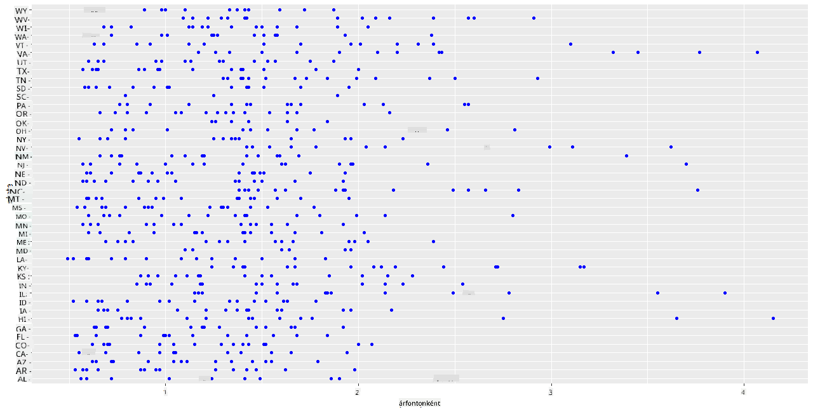
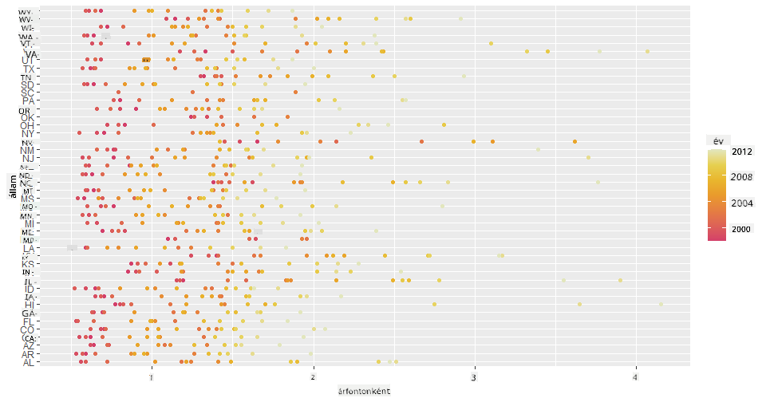
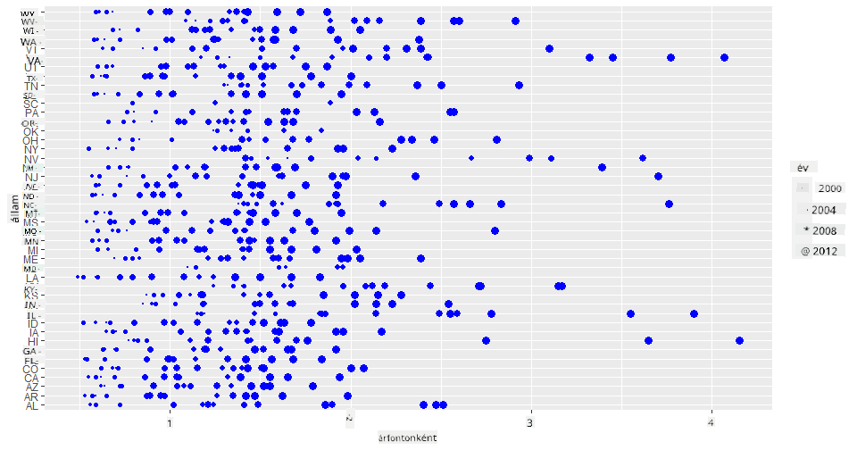
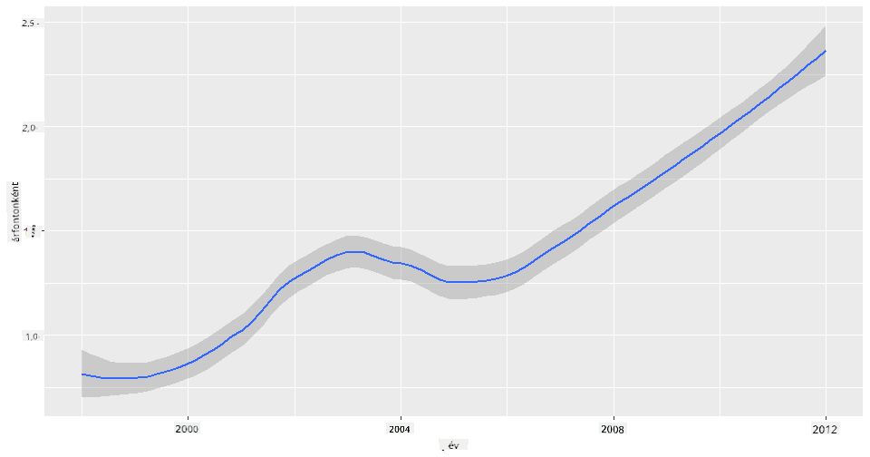
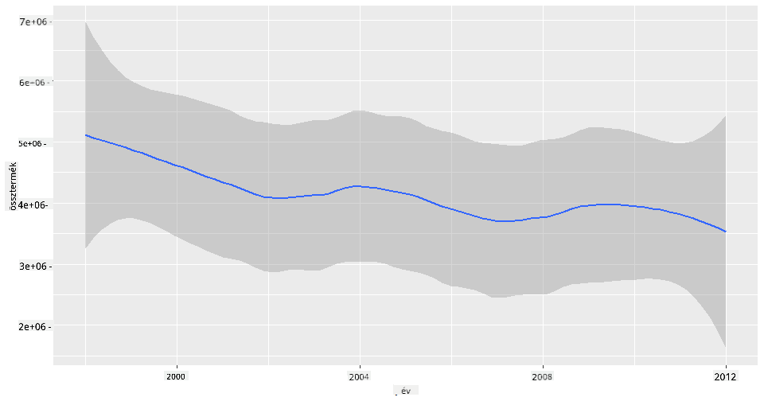
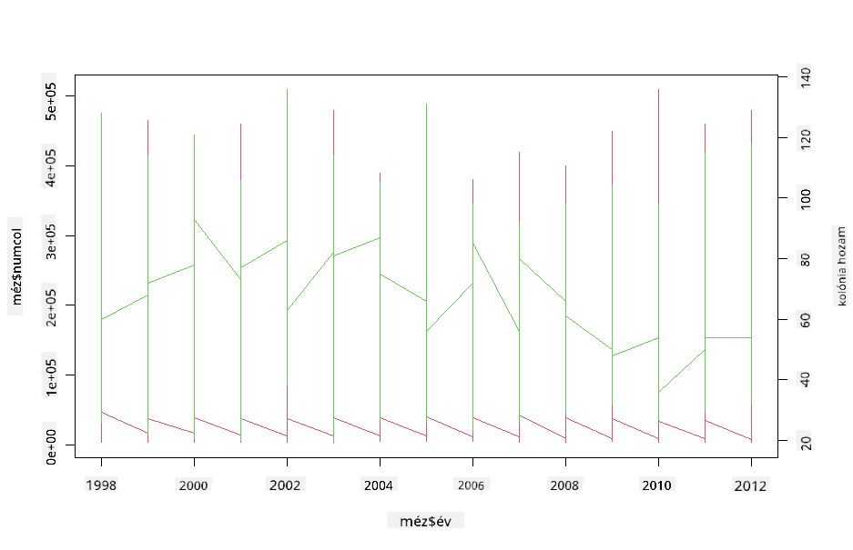

<!--
CO_OP_TRANSLATOR_METADATA:
{
  "original_hash": "a33c5d4b4156a2b41788d8720b6f724c",
  "translation_date": "2025-08-26T17:03:15+00:00",
  "source_file": "3-Data-Visualization/R/12-visualization-relationships/README.md",
  "language_code": "hu"
}
-->
# Kapcsolatok vizualizálása: Minden a mézről 🍯

| ](../../../sketchnotes/12-Visualizing-Relationships.png)|
|:---:|
|Kapcsolatok vizualizálása - _Sketchnote by [@nitya](https://twitter.com/nitya)_ |

Folytatva kutatásunk természetközpontú irányát, fedezzünk fel érdekes vizualizációkat, amelyek bemutatják a különböző mézfajták közötti kapcsolatokat egy, az [Amerikai Mezőgazdasági Minisztérium](https://www.nass.usda.gov/About_NASS/index.php) által összeállított adatbázis alapján.

Ez az adatbázis körülbelül 600 tételt tartalmaz, és az Egyesült Államok különböző államaiban történő méztermelést mutatja be. Például megvizsgálhatjuk az államok méhkolóniáinak számát, az egy kolóniára jutó hozamot, a teljes termelést, a készleteket, az árakat fontonként, valamint a termelt méz értékét 1998 és 2012 között, évente egy sorral minden államra vonatkozóan.

Érdekes lehet vizualizálni egy adott állam éves termelése és például az adott állam mézének ára közötti kapcsolatot. Alternatívaként megvizsgálhatjuk az államok mézhozamát kolóniánként. Ez az időszak magában foglalja a pusztító 'CCD' vagy 'Colony Collapse Disorder' (http://npic.orst.edu/envir/ccd.html) első megjelenését 2006-ban, így ez egy különösen érdekes adatbázis a tanulmányozáshoz. 🐝

## [Előadás előtti kvíz](https://purple-hill-04aebfb03.1.azurestaticapps.net/quiz/22)

Ebben a leckében használhatod a ggplot2-t, amelyet korábban már használtál, mint egy jó könyvtárat a változók közötti kapcsolatok vizualizálására. Különösen érdekes a ggplot2 `geom_point` és `qplot` funkcióinak használata, amelyek lehetővé teszik szórásdiagramok és vonaldiagramok gyors létrehozását a '[statisztikai kapcsolatok](https://ggplot2.tidyverse.org/)' megértéséhez, amelyek segítenek az adatelemzőnek jobban megérteni, hogyan kapcsolódnak egymáshoz a változók.

## Szórásdiagramok

Használj szórásdiagramot annak bemutatására, hogyan alakult a méz ára évről évre, államonként. A ggplot2 `ggplot` és `geom_point` funkcióival kényelmesen csoportosíthatod az államok adatait, és megjelenítheted az adatpontokat mind kategóriális, mind numerikus adatok esetében.

Kezdjük az adatok importálásával és a Seaborn használatával:

```r
honey=read.csv('../../data/honey.csv')
head(honey)
```
Láthatod, hogy a mézadatoknak több érdekes oszlopa van, például az év és az ár fontonként. Fedezzük fel ezeket az adatokat, csoportosítva az Egyesült Államok államai szerint:

| állam | numcol | yieldpercol | totalprod | stocks   | priceperlb | prodvalue | év   |
| ----- | ------ | ----------- | --------- | -------- | ---------- | --------- | ---- |
| AL    | 16000  | 71          | 1136000   | 159000   | 0.72       | 818000    | 1998 |
| AZ    | 55000  | 60          | 3300000   | 1485000  | 0.64       | 2112000   | 1998 |
| AR    | 53000  | 65          | 3445000   | 1688000  | 0.59       | 2033000   | 1998 |
| CA    | 450000 | 83          | 37350000  | 12326000 | 0.62       | 23157000  | 1998 |
| CO    | 27000  | 72          | 1944000   | 1594000  | 0.7        | 1361000   | 1998 |
| FL    | 230000 | 98          |22540000   | 4508000  | 0.64       | 14426000  | 1998 |

Készíts egy alap szórásdiagramot, amely bemutatja a méz fontonkénti ára és az Egyesült Államok államai közötti kapcsolatot. Állítsd be az `y` tengelyt elég magasra, hogy minden állam látható legyen:

```r
library(ggplot2)
ggplot(honey, aes(x = priceperlb, y = state)) +
  geom_point(colour = "blue")
```


Most mutasd meg ugyanazt az adatot méz színsémával, hogy bemutasd, hogyan változik az ár az évek során. Ezt úgy teheted meg, hogy hozzáadsz egy 'scale_color_gradientn' paramétert, amely megmutatja az évről évre történő változást:

> ✅ Tudj meg többet a [scale_color_gradientn](https://www.rdocumentation.org/packages/ggplot2/versions/0.9.1/topics/scale_colour_gradientn) funkcióról - próbálj ki egy gyönyörű szivárványszínsémát!

```r
ggplot(honey, aes(x = priceperlb, y = state, color=year)) +
  geom_point()+scale_color_gradientn(colours = colorspace::heat_hcl(7))
```


Ezzel a színséma változtatással egyértelműen látható az évek során a méz fontonkénti árának erős növekedése. Valóban, ha az adatbázis egy mintáját megvizsgálod (például Arizona államot), láthatod az árak évről évre történő növekedésének mintázatát, néhány kivétellel:

| állam | numcol | yieldpercol | totalprod | stocks  | priceperlb | prodvalue | év   |
| ----- | ------ | ----------- | --------- | ------- | ---------- | --------- | ---- |
| AZ    | 55000  | 60          | 3300000   | 1485000 | 0.64       | 2112000   | 1998 |
| AZ    | 52000  | 62          | 3224000   | 1548000 | 0.62       | 1999000   | 1999 |
| AZ    | 40000  | 59          | 2360000   | 1322000 | 0.73       | 1723000   | 2000 |
| AZ    | 43000  | 59          | 2537000   | 1142000 | 0.72       | 1827000   | 2001 |
| AZ    | 38000  | 63          | 2394000   | 1197000 | 1.08       | 2586000   | 2002 |
| AZ    | 35000  | 72          | 2520000   | 983000  | 1.34       | 3377000   | 2003 |
| AZ    | 32000  | 55          | 1760000   | 774000  | 1.11       | 1954000   | 2004 |
| AZ    | 36000  | 50          | 1800000   | 720000  | 1.04       | 1872000   | 2005 |
| AZ    | 30000  | 65          | 1950000   | 839000  | 0.91       | 1775000   | 2006 |
| AZ    | 30000  | 64          | 1920000   | 902000  | 1.26       | 2419000   | 2007 |
| AZ    | 25000  | 64          | 1600000   | 336000  | 1.26       | 2016000   | 2008 |
| AZ    | 20000  | 52          | 1040000   | 562000  | 1.45       | 1508000   | 2009 |
| AZ    | 24000  | 77          | 1848000   | 665000  | 1.52       | 2809000   | 2010 |
| AZ    | 23000  | 53          | 1219000   | 427000  | 1.55       | 1889000   | 2011 |
| AZ    | 22000  | 46          | 1012000   | 253000  | 1.79       | 1811000   | 2012 |

Egy másik módja ennek a változásnak a vizualizálására a méret használata a szín helyett. Színvak felhasználók számára ez jobb opció lehet. Módosítsd a vizualizációt úgy, hogy az ár növekedését a pontok átmérőjének növekedése mutassa:

```r
ggplot(honey, aes(x = priceperlb, y = state)) +
  geom_point(aes(size = year),colour = "blue") +
  scale_size_continuous(range = c(0.25, 3))
```
Láthatod, hogy a pontok mérete fokozatosan növekszik.



Ez egyszerűen a kereslet és kínálat esete? Az olyan tényezők, mint az éghajlatváltozás és a kolóniák összeomlása miatt kevesebb méz áll rendelkezésre évről évre, és ezért nő az ára?

Ahhoz, hogy felfedezzük az összefüggést az adatbázis néhány változója között, vizsgáljunk meg néhány vonaldiagramot.

## Vonaldiagramok

Kérdés: Van egyértelmű növekedés a méz fontonkénti árának évről évre? Ezt legegyszerűbben egyetlen vonaldiagram létrehozásával fedezheted fel:

```r
qplot(honey$year,honey$priceperlb, geom='smooth', span =0.5, xlab = "year",ylab = "priceperlb")
```
Válasz: Igen, néhány kivétellel 2003 körül:



Kérdés: Nos, 2003-ban láthatunk egy kiugrást a mézkészletben is? Mi történik, ha megvizsgáljuk a teljes termelést évről évre?

```python
qplot(honey$year,honey$totalprod, geom='smooth', span =0.5, xlab = "year",ylab = "totalprod")
```



Válasz: Nem igazán. Ha megnézzük a teljes termelést, úgy tűnik, hogy az valójában növekedett abban az évben, bár általánosságban a méztermelés csökkenő tendenciát mutat ezekben az években.

Kérdés: Ebben az esetben mi okozhatta a méz árának kiugrását 2003 körül?

Ennek felfedezéséhez vizsgáljunk meg egy facet gridet.

## Facet grid-ek

A facet grid-ek az adatbázis egy aspektusát veszik alapul (esetünkben választhatjuk az 'év'-et, hogy elkerüljük a túl sok aspektus létrehozását). A Seaborn ezután egy-egy diagramot készít az általad választott x és y koordináták alapján az egyszerűbb vizuális összehasonlítás érdekében. Kitűnik 2003 ebben a típusú összehasonlításban?

Hozz létre egy facet grid-et a `facet_wrap` használatával, ahogy azt a [ggplot2 dokumentációja](https://ggplot2.tidyverse.org/reference/facet_wrap.html) ajánlja.

```r
ggplot(honey, aes(x=yieldpercol, y = numcol,group = 1)) + 
  geom_line() + facet_wrap(vars(year))
```
Ebben a vizualizációban összehasonlíthatod a kolóniánkénti hozamot és a kolóniák számát évről évre, egymás mellett, 3 oszlopra állítva a wrap-et:


Ebben az adatbázisban semmi különös nem tűnik ki a kolóniák számával és hozamával kapcsolatban évről évre és államonként. Van más módja annak, hogy összefüggést találjunk e két változó között?

## Kettős vonaldiagramok

Próbálj ki egy többsoros diagramot, amelyben két vonaldiagramot helyezel egymásra, az R `par` és `plot` funkcióinak használatával. Az x tengelyen az évet ábrázoljuk, és két y tengelyt jelenítünk meg. Tehát ábrázoljuk a kolóniánkénti hozamot és a kolóniák számát, egymásra helyezve:

```r
par(mar = c(5, 4, 4, 4) + 0.3)              
plot(honey$year, honey$numcol, pch = 16, col = 2,type="l")              
par(new = TRUE)                             
plot(honey$year, honey$yieldpercol, pch = 17, col = 3,              
     axes = FALSE, xlab = "", ylab = "",type="l")
axis(side = 4, at = pretty(range(y2)))      
mtext("colony yield", side = 4, line = 3)   
```


Bár semmi különös nem tűnik ki 2003 körül, ez lehetőséget ad arra, hogy egy kicsit vidámabb hangon zárjuk ezt a leckét: bár a kolóniák száma általánosságban csökken, a kolóniák száma stabilizálódik, még akkor is, ha a kolóniánkénti hozam csökken.

Hajrá, méhek, hajrá!

🐝❤️
## 🚀 Kihívás

Ebben a leckében többet tanultál a szórásdiagramok és vonalhálók, köztük a facet grid-ek használatáról. Kihívásként készíts egy facet grid-et egy másik adatbázis alapján, esetleg olyat, amelyet korábban használtál ezekben a leckékben. Jegyezd meg, mennyi időbe telik elkészíteni őket, és légy óvatos, hogy hány gridet kell rajzolnod ezekkel a technikákkal.
## [Előadás utáni kvíz](https://purple-hill-04aebfb03.1.azurestaticapps.net/quiz/23)

## Áttekintés és önálló tanulás

A vonaldiagramok lehetnek egyszerűek vagy meglehetősen összetettek. Olvass egy kicsit a [ggplot2 dokumentációjában](https://ggplot2.tidyverse.org/reference/geom_path.html#:~:text=geom_line()%20connects%20them%20in,which%20cases%20are%20connected%20together) arról, hogy milyen különböző módokon építheted őket. Próbáld meg fejleszteni az ebben a leckében készített vonaldiagramokat a dokumentációban felsorolt egyéb módszerekkel.
## Feladat

[Merülj el a méhkasban](assignment.md)

---

**Felelősség kizárása**:  
Ez a dokumentum az AI fordítási szolgáltatás, a [Co-op Translator](https://github.com/Azure/co-op-translator) segítségével lett lefordítva. Bár törekszünk a pontosságra, kérjük, vegye figyelembe, hogy az automatikus fordítások hibákat vagy pontatlanságokat tartalmazhatnak. Az eredeti dokumentum az eredeti nyelvén tekintendő hiteles forrásnak. Fontos információk esetén javasolt professzionális emberi fordítást igénybe venni. Nem vállalunk felelősséget a fordítás használatából eredő félreértésekért vagy téves értelmezésekért.