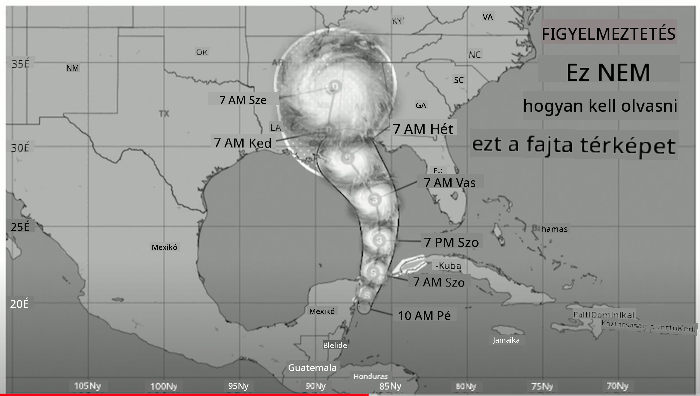
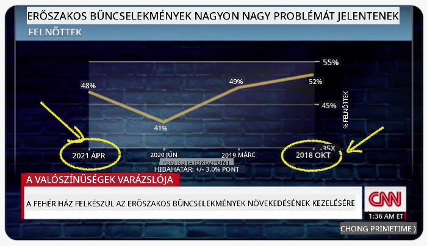
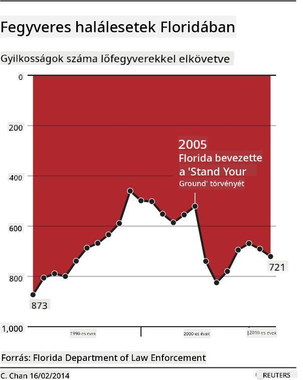
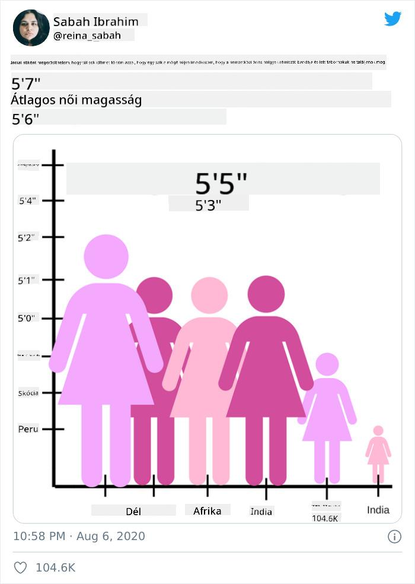
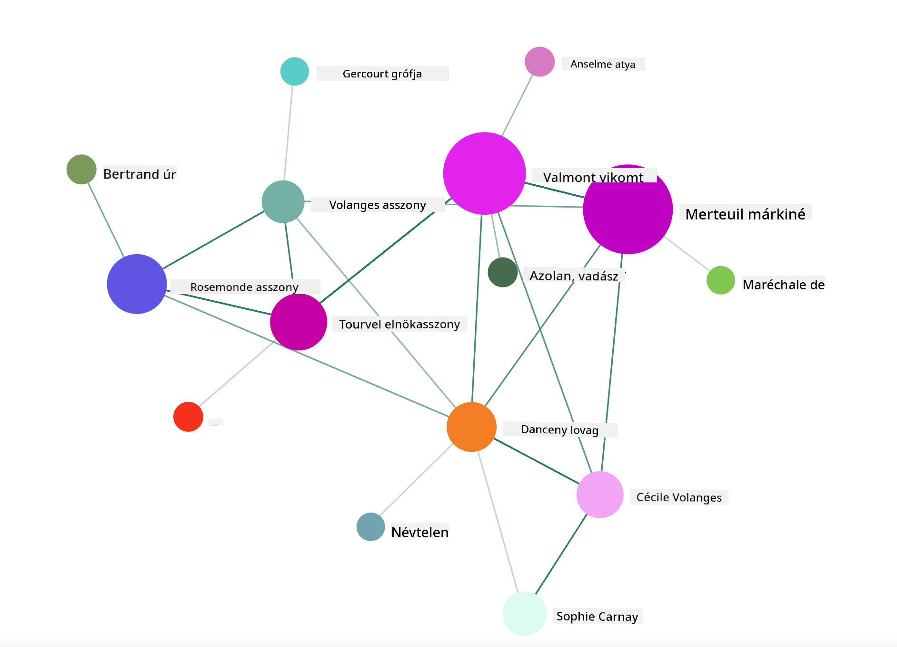

<!--
CO_OP_TRANSLATOR_METADATA:
{
  "original_hash": "b4039f1c76548d144a0aee0bf28304ec",
  "translation_date": "2025-08-26T17:14:59+00:00",
  "source_file": "3-Data-Visualization/R/13-meaningful-vizualizations/README.md",
  "language_code": "hu"
}
-->
# Jelentőségteljes vizualizációk készítése

| ](../../../sketchnotes/13-MeaningfulViz.png)|
|:---:|
| Jelentőségteljes vizualizációk - _Sketchnote by [@nitya](https://twitter.com/nitya)_ |

> "Ha elég sokáig kínozod az adatokat, bármit bevallanak" -- [Ronald Coase](https://en.wikiquote.org/wiki/Ronald_Coase)

Az adatelemző egyik alapvető készsége, hogy képes legyen olyan jelentőségteljes adatvizualizációt készíteni, amely segít megválaszolni a felmerülő kérdéseket. Mielőtt azonban vizualizálnád az adatokat, biztosítanod kell, hogy azokat megtisztítottad és előkészítetted, ahogyan azt a korábbi leckékben is tetted. Ezután elkezdheted eldönteni, hogyan mutasd be legjobban az adatokat.

Ebben a leckében áttekintjük:

1. Hogyan válasszuk ki a megfelelő diagramtípust
2. Hogyan kerüljük el a megtévesztő diagramokat
3. Hogyan dolgozzunk a színekkel
4. Hogyan formázzuk a diagramokat az olvashatóság érdekében
5. Hogyan készítsünk animált vagy 3D diagramokat
6. Hogyan hozzunk létre kreatív vizualizációkat

## [Előzetes kvíz](https://purple-hill-04aebfb03.1.azurestaticapps.net/quiz/24)

## Válaszd ki a megfelelő diagramtípust

A korábbi leckékben különféle érdekes adatvizualizációkat készítettél Matplotlib és Seaborn segítségével. Általánosságban a [megfelelő diagramtípus](https://chartio.com/learn/charts/how-to-select-a-data-vizualization/) kiválasztásához az alábbi táblázatot használhatod, attól függően, hogy milyen kérdést szeretnél megválaszolni:

| Célod:                     | Használd:                      |
| -------------------------- | ----------------------------- |
| Adattrendek bemutatása időben | Vonal                        |
| Kategóriák összehasonlítása | Oszlop, Kördiagram            |
| Összegek összehasonlítása   | Kördiagram, Halmozott oszlop  |
| Kapcsolatok bemutatása      | Szórás, Vonal, Facet, Kettős vonal |
| Eloszlások bemutatása       | Szórás, Hisztogram, Doboz     |
| Arányok bemutatása          | Kördiagram, Donut, Waffle     |

> ✅ Az adatok összetételétől függően előfordulhat, hogy szöveges adatokat numerikussá kell alakítanod, hogy a diagram támogassa azokat.

## Kerüld el a megtévesztést

Még ha az adatelemző gondosan választja is ki a megfelelő diagramot az adatokhoz, számos módon lehet az adatokat úgy megjeleníteni, hogy azok egy bizonyos állítást támasszanak alá, gyakran az adatok hitelességének rovására. Számos példát találhatunk megtévesztő diagramokra és infografikákra!

[](https://www.youtube.com/watch?v=oX74Nge8Wkw "Hogyan hazudnak a diagramok")

> 🎥 Kattints a fenti képre egy konferenciaelőadásért a megtévesztő diagramokról

Ez a diagram megfordítja az X tengelyt, hogy az igazság ellentétét mutassa, az időpontok alapján:



[Ez a diagram](https://media.firstcoastnews.com/assets/WTLV/images/170ae16f-4643-438f-b689-50d66ca6a8d8/170ae16f-4643-438f-b689-50d66ca6a8d8_1140x641.jpg) még megtévesztőbb, mivel a szem a jobb oldalra fókuszál, és azt a következtetést vonja le, hogy az idő múlásával a COVID-esetek csökkentek a különböző megyékben. Valójában, ha alaposan megnézed a dátumokat, észreveszed, hogy azokat átrendezték, hogy megtévesztő csökkenő trendet mutassanak.


Ez a hírhedt példa színeket ÉS egy megfordított Y tengelyt használ a megtévesztéshez: ahelyett, hogy azt a következtetést vonnánk le, hogy a fegyveres halálesetek megugrottak a fegyverbarát törvények elfogadása után, a szemünket megtévesztik, hogy az ellenkezőjét higgyük:



Ez a furcsa diagram azt mutatja, hogyan lehet az arányokat manipulálni, komikus hatást keltve:



Az összehasonlíthatatlan dolgok összehasonlítása egy másik árnyas trükk. Van egy [csodálatos weboldal](https://tylervigen.com/spurious-correlations), amely "hamis korrelációkat" mutat be, például a Maine-i válási arány és a margarin fogyasztása közötti "tényeket". Egy Reddit csoport is gyűjti az [adatok csúnya felhasználásait](https://www.reddit.com/r/dataisugly/top/?t=all).

Fontos megérteni, hogy a szem milyen könnyen megtéveszthető a félrevezető diagramok által. Még ha az adatelemző szándéka jó is, egy rossz diagramtípus, például túl sok kategóriát bemutató kördiagram választása is megtévesztő lehet.

## Színek

A fent említett "Floridai fegyveres erőszak" diagramon láthattad, hogy a színek hogyan adhatnak további jelentést a diagramokhoz, különösen azokhoz, amelyeket nem olyan könyvtárakkal terveztek, mint a ggplot2 és az RColorBrewer, amelyek különböző ellenőrzött színkönyvtárakat és palettákat tartalmaznak. Ha kézzel készítesz diagramot, érdemes egy kicsit tanulmányozni a [színek elméletét](https://colormatters.com/color-and-design/basic-color-theory).

> ✅ Légy tudatában annak, hogy a diagramok tervezésekor az akadálymentesség fontos szempont. Néhány felhasználód színvak lehet - vajon a diagramod jól jelenik meg a látássérült felhasználók számára?

Légy óvatos a színek kiválasztásakor, mivel a színek olyan jelentést közvetíthetnek, amelyet nem szándékoztál. A "pink ladies" a "magasság" diagramon például kifejezetten "nőies" jelentést hordoz, ami tovább növeli a diagram furcsaságát.

Bár a [színek jelentése](https://colormatters.com/color-symbolism/the-meanings-of-colors) a világ különböző részein eltérő lehet, és árnyalatuktól függően változhat, általánosságban a színek jelentése a következő:

| Szín   | Jelentés             |
| ------ | ------------------- |
| piros  | erő                 |
| kék    | bizalom, hűség      |
| sárga  | boldogság, óvatosság|
| zöld   | ökológia, szerencse, irigység |
| lila   | boldogság           |
| narancs| életteliség         |

Ha egyedi színekkel kell diagramot készítened, győződj meg róla, hogy a diagramjaid akadálymentesek, és a választott szín összhangban van az általad közvetíteni kívánt jelentéssel.

## Diagramok formázása az olvashatóság érdekében

A diagramok nem jelentőségteljesek, ha nem olvashatók! Szánj időt arra, hogy a diagram szélességét és magasságát úgy állítsd be, hogy az jól illeszkedjen az adatokhoz. Ha például egy változót (például az összes 50 államot) kell megjeleníteni, mutasd őket függőlegesen az Y tengelyen, ha lehetséges, hogy elkerüld a vízszintesen görgethető diagramot.

Címkézd fel a tengelyeket, adj meg egy jelmagyarázatot, ha szükséges, és biztosíts eszköztippeket az adatok jobb megértéséhez.

Ha az adataid szövegesek és hosszúak az X tengelyen, döntsd meg a szöveget az olvashatóság érdekében. A [plot3D](https://cran.r-project.org/web/packages/plot3D/index.html) 3D ábrázolást kínál, ha az adataid támogatják. Kifinomult adatvizualizációk készíthetők vele.


## Animáció és 3D diagramok megjelenítése

Napjaink legjobb adatvizualizációi közül néhány animált. Shirley Wu lenyűgöző példákat készített D3-mal, például a '[film flowers](http://bl.ocks.org/sxywu/raw/d612c6c653fb8b4d7ff3d422be164a5d/)'-t, ahol minden virág egy filmet ábrázol. Egy másik példa a Guardian számára készült 'bussed out', egy interaktív élmény, amely vizualizációkat kombinál Greensockkal és D3-mal, valamint egy görgethető cikkformátummal, hogy bemutassa, hogyan kezeli New York City a hajléktalanproblémát az emberek városon kívülre szállításával.


> "Bussed Out: Hogyan mozgatja Amerika a hajléktalanjait" a [Guardian](https://www.theguardian.com/us-news/ng-interactive/2017/dec/20/bussed-out-america-moves-homeless-people-country-study) cikkéből. Vizualizációk: Nadieh Bremer & Shirley Wu

Bár ez a lecke nem elég mély ahhoz, hogy megtanítsa ezeket az erőteljes vizualizációs könyvtárakat, próbáld ki a D3-at egy Vue.js alkalmazásban, egy könyvtár segítségével, amely a "Veszedelmes viszonyok" című könyvet animált társadalmi hálózatként ábrázolja.

> A "Veszedelmes viszonyok" egy levélregény, vagyis levelek sorozataként bemutatott regény. Choderlos de Laclos 1782-ben írta, és a 18. század végi francia arisztokrácia két főszereplőjének, a Vicomte de Valmontnak és a Marquise de Merteuilnek az erkölcsileg romlott társadalmi manővereiről szól. Mindketten elbuknak a végén, de nem anélkül, hogy jelentős társadalmi károkat okoznának. A regény levelek sorozataként bontakozik ki, amelyeket különböző embereknek írnak a körükben, bosszút tervezve vagy egyszerűen csak bajt okozva. Készíts egy vizualizációt ezekről a levelekről, hogy vizuálisan felfedezd a narratíva főszereplőit.

Egy webalkalmazást fogsz elkészíteni, amely animált nézetet jelenít meg erről a társadalmi hálózatról. Egy könyvtárat használ, amelyet egy [hálózat vizualizálására](https://github.com/emiliorizzo/vue-d3-network) hoztak létre Vue.js és D3 segítségével. Amikor az alkalmazás fut, az adatokat a képernyőn húzogatva átrendezheted.



## Projekt: Hálózatot ábrázoló diagram készítése D3.js segítségével

> Ebben a lecke mappában találsz egy `solution` mappát, amely tartalmazza a kész projektet referenciaként.

1. Kövesd az utasításokat a README.md fájlban a kezdő mappa gyökerében. Győződj meg róla, hogy az NPM és a Node.js fut a gépeden, mielőtt telepíted a projekt függőségeit.

2. Nyisd meg a `starter/src` mappát. Találsz egy `assets` mappát, amelyben egy .json fájl található az összes levéllel a regényből, számozva, "to" és "from" megjelöléssel.

3. Egészítsd ki a `components/Nodes.vue` fájlban található kódot, hogy engedélyezd a vizualizációt. Keresd meg a `createLinks()` nevű metódust, és add hozzá a következő beágyazott ciklust.

Iterálj végig a .json objektumon, hogy rögzítsd a levelek "to" és "from" adatait, és építsd fel a `links` objektumot, hogy a vizualizációs könyvtár fel tudja dolgozni:

```javascript
//loop through letters
      let f = 0;
      let t = 0;
      for (var i = 0; i < letters.length; i++) {
          for (var j = 0; j < characters.length; j++) {
              
            if (characters[j] == letters[i].from) {
              f = j;
            }
            if (characters[j] == letters[i].to) {
              t = j;
            }
        }
        this.links.push({ sid: f, tid: t });
      }
  ```

Futtasd az alkalmazásodat a terminálból (npm run serve), és élvezd a vizualizációt!

## 🚀 Kihívás

Böngéssz az interneten, hogy megtévesztő vizualizációkat találj. Hogyan téveszti meg a szerző a felhasználót, és szándékos-e? Próbáld meg kijavítani a vizualizációkat, hogy megmutasd, hogyan kellene kinézniük.

## [Utólagos kvíz](https://purple-hill-04aebfb03.1.azurestaticapps.net/quiz/25)

## Áttekintés és önálló tanulás

Íme néhány cikk, amelyet érdemes elolvasni a megtévesztő adatvizualizációkról:

https://gizmodo.com/how-to-lie-with-data-visualization-1563576606

http://ixd.prattsi.org/2017/12/visual-lies-usability-in-deceptive-data-visualizations/

Tekintsd meg ezeket az érdekes vizualizációkat történelmi eszközökről és tárgyakról:

https://handbook.pubpub.org/

Nézd át ezt a cikket arról, hogyan javíthatja az animáció a vizualizációkat:

https://medium.com/@EvanSinar/use-animation-to-supercharge-data-visualization-cd905a882ad4

## Feladat

[Saját egyedi vizualizáció készítése](assignment.md)

---

**Felelősség kizárása**:  
Ez a dokumentum az AI fordítási szolgáltatás [Co-op Translator](https://github.com/Azure/co-op-translator) segítségével lett lefordítva. Bár törekszünk a pontosságra, kérjük, vegye figyelembe, hogy az automatikus fordítások hibákat vagy pontatlanságokat tartalmazhatnak. Az eredeti dokumentum az eredeti nyelvén tekintendő hiteles forrásnak. Fontos információk esetén javasolt professzionális emberi fordítást igénybe venni. Nem vállalunk felelősséget semmilyen félreértésért vagy téves értelmezésért, amely a fordítás használatából eredhet.