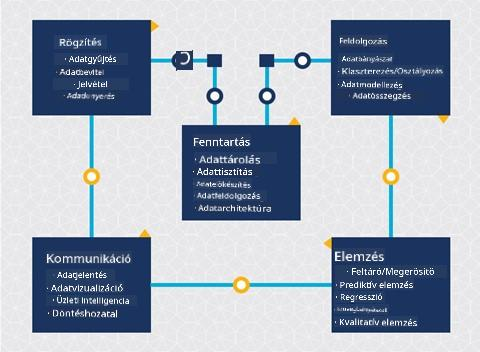
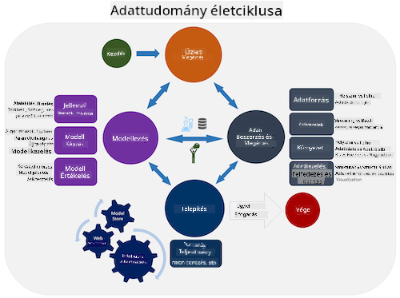
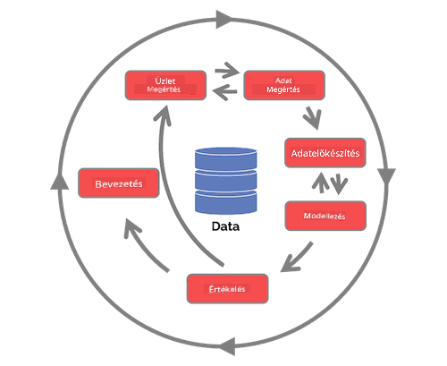

<!--
CO_OP_TRANSLATOR_METADATA:
{
  "original_hash": "c368f8f2506fe56bca0f7be05c4eb71d",
  "translation_date": "2025-08-26T16:23:03+00:00",
  "source_file": "4-Data-Science-Lifecycle/14-Introduction/README.md",
  "language_code": "hu"
}
-->
# Bevezetés az adattudomány életciklusába

| ](../../sketchnotes/14-DataScience-Lifecycle.png)|
|:---:|
| Bevezetés az adattudomány életciklusába - _Sketchnote készítette: [@nitya](https://twitter.com/nitya)_ |

## [Előadás előtti kvíz](https://red-water-0103e7a0f.azurestaticapps.net/quiz/26)

Ezen a ponton valószínűleg már rájöttél, hogy az adattudomány egy folyamat. Ez a folyamat 5 szakaszra bontható:

- Adatgyűjtés
- Feldolgozás
- Elemzés
- Kommunikáció
- Karbantartás

Ez a lecke az életciklus 3 részére összpontosít: adatgyűjtés, feldolgozás és karbantartás.

  
> Fotó: [Berkeley School of Information](https://ischoolonline.berkeley.edu/data-science/what-is-data-science/)

## Adatgyűjtés

Az életciklus első szakasza rendkívül fontos, mivel a következő szakaszok erre épülnek. Gyakorlatilag két szakasz egyesítve: az adatok megszerzése és a célok, valamint a megoldandó problémák meghatározása.  
A projekt céljainak meghatározása mélyebb kontextust igényel a problémával vagy kérdéssel kapcsolatban. Először meg kell határoznunk és meg kell szereznünk azokat, akiknek a problémáját meg kell oldani. Ezek lehetnek üzleti érdekelt felek vagy a projekt szponzorai, akik segíthetnek azonosítani, hogy ki vagy mi profitálhat a projektből, valamint hogy mire és miért van szükségük. Egy jól meghatározott cél mérhető és számszerűsíthető kell legyen, hogy elfogadható eredményt lehessen meghatározni.

Kérdések, amelyeket egy adattudós feltehet:
- Megközelítették már korábban ezt a problémát? Mit fedeztek fel?
- Minden érintett érti a célt és a szándékot?
- Van-e bizonytalanság, és hogyan lehet csökkenteni?
- Milyen korlátok vannak?
- Hogyan nézhet ki az eredmény?
- Mennyi erőforrás (idő, emberi, számítási) áll rendelkezésre?

Ezután az adatok azonosítása, összegyűjtése, majd végül feltárása következik, amelyek szükségesek a meghatározott célok eléréséhez. Az adatgyűjtés ezen lépésében az adattudósoknak értékelniük kell az adatok mennyiségét és minőségét is. Ez némi adatfeltárást igényel annak megerősítésére, hogy az összegyűjtött adatok támogatják-e a kívánt eredmény elérését.

Kérdések, amelyeket egy adattudós feltehet az adatokkal kapcsolatban:
- Milyen adatok állnak már rendelkezésemre?
- Ki birtokolja ezeket az adatokat?
- Milyen adatvédelmi aggályok vannak?
- Elég adat áll rendelkezésre a probléma megoldásához?
- Az adatok megfelelő minőségűek ehhez a problémához?
- Ha további információkat fedezek fel az adatokból, érdemes-e megváltoztatni vagy újradefiniálni a célokat?

## Feldolgozás

Az életciklus feldolgozási szakasza az adatokban rejlő minták felfedezésére és modellezésére összpontosít. A feldolgozási szakaszban alkalmazott technikák közül néhány statisztikai módszereket igényel a minták feltárásához. Ez általában időigényes feladat lenne egy ember számára nagy adathalmaz esetén, ezért számítógépek végzik a nehéz munkát, hogy felgyorsítsák a folyamatot. Ebben a szakaszban az adattudomány és a gépi tanulás is találkozik. Ahogy az első leckében tanultad, a gépi tanulás a modellek építésének folyamata az adatok megértéséhez. A modellek az adatokban lévő változók közötti kapcsolatot reprezentálják, amelyek segítenek az eredmények előrejelzésében.

A szakaszban alkalmazott gyakori technikák az ML kezdőknek szóló tananyagban találhatók. Kövesd a linkeket, hogy többet megtudj róluk:

- [Osztályozás](https://github.com/microsoft/ML-For-Beginners/tree/main/4-Classification): Az adatok kategóriákba rendezése a hatékonyabb felhasználás érdekében.
- [Klaszterezés](https://github.com/microsoft/ML-For-Beginners/tree/main/5-Clustering): Az adatok hasonló csoportokba rendezése.
- [Regresszió](https://github.com/microsoft/ML-For-Beginners/tree/main/2-Regression): A változók közötti kapcsolatok meghatározása az értékek előrejelzéséhez vagy becsléséhez.

## Karbantartás

Az életciklus diagramján látható, hogy a karbantartás az adatgyűjtés és feldolgozás között helyezkedik el. A karbantartás egy folyamatos folyamat, amely az adatok kezelését, tárolását és védelmét foglalja magában a projekt teljes folyamata során, és ezt a projekt egészében figyelembe kell venni.

### Adatok tárolása

Az adatok tárolásának módja és helye befolyásolhatja a tárolás költségeit, valamint az adatok elérésének sebességét. Az ilyen döntéseket valószínűleg nem egy adattudós hozza meg egyedül, de előfordulhat, hogy választásokat kell tennie az adatokkal való munka során, a tárolás módja alapján.

Íme néhány modern adat-tárolási rendszer szempontja, amelyek befolyásolhatják ezeket a döntéseket:

**Helyszíni vs távoli vs nyilvános vagy privát felhő**

A helyszíni tárolás azt jelenti, hogy az adatokat saját eszközökön tároljuk, például saját szerveren, amely merevlemezekkel tárolja az adatokat, míg a távoli tárolás olyan eszközökre támaszkodik, amelyeket nem birtoklunk, például adatközpontokra. A nyilvános felhő népszerű választás az adatok tárolására, amely nem igényel ismereteket arról, hogy pontosan hol és hogyan tárolják az adatokat, ahol a nyilvános felhő egy egységes infrastruktúrát jelent, amelyet minden felhasználó megoszt. Egyes szervezetek szigorú biztonsági szabályzatokkal rendelkeznek, amelyek megkövetelik, hogy teljes hozzáférésük legyen az adatok tárolására használt eszközökhöz, és privát felhőt használnak, amely saját felhőszolgáltatásokat biztosít. A felhőben történő adattárolásról többet megtudhatsz a [későbbi leckékben](https://github.com/microsoft/Data-Science-For-Beginners/tree/main/5-Data-Science-In-Cloud).

**Hideg vs forró adatok**

Amikor modelleket tanítasz, előfordulhat, hogy több tanító adatra van szükséged. Ha elégedett vagy a modelleddel, további adatok érkezhetnek, hogy a modell betöltse célját. Mindenesetre az adatok tárolásának és elérésének költsége növekedni fog, ahogy egyre több adatot halmozol fel. A ritkán használt adatok, az úgynevezett hideg adatok elkülönítése a gyakran elért forró adatoktól olcsóbb tárolási lehetőséget kínálhat hardveres vagy szoftveres szolgáltatások révén. Ha hideg adatokat kell elérni, az valamivel hosszabb időt vehet igénybe, mint a forró adatok elérése.

### Adatok kezelése

Az adatokkal való munka során előfordulhat, hogy néhány adatot tisztítani kell a [adatelőkészítésről szóló lecke](https://github.com/microsoft/Data-Science-For-Beginners/tree/main/2-Working-With-Data/08-data-preparation) technikáinak alkalmazásával, hogy pontos modelleket építsünk. Amikor új adatok érkeznek, ugyanazokat az alkalmazásokat kell használni a minőség következetességének fenntartása érdekében. Egyes projektek automatizált eszközöket használnak az adatok tisztítására, aggregálására és tömörítésére, mielőtt az adatok végleges helyükre kerülnek. Az Azure Data Factory egy példa ezekre az eszközökre.

### Adatok védelme

Az adatok védelmének egyik fő célja annak biztosítása, hogy azok, akik az adatokkal dolgoznak, ellenőrzésük alatt tartsák, hogy mit gyűjtenek, és milyen kontextusban használják fel azokat. Az adatok biztonságban tartása magában foglalja az adatokhoz való hozzáférés korlátozását csak azok számára, akiknek szükségük van rá, a helyi törvények és szabályozások betartását, valamint az etikai normák fenntartását, ahogy azt az [etikai leckében](https://github.com/microsoft/Data-Science-For-Beginners/tree/main/1-Introduction/02-ethics) tárgyaltuk.

Íme néhány dolog, amit egy csapat tehet a biztonság érdekében:
- Megerősíti, hogy minden adat titkosított
- Tájékoztatja az ügyfeleket arról, hogyan használják fel az adataikat
- Eltávolítja az adatokhoz való hozzáférést azoktól, akik elhagyták a projektet
- Csak bizonyos projekt tagoknak engedi meg az adatok módosítását

## 🚀 Kihívás

Az adattudomány életciklusának számos változata létezik, ahol minden lépésnek eltérő neve és szakaszainak száma lehet, de ugyanazokat a folyamatokat tartalmazza, mint amit ebben a leckében tárgyaltunk.

Fedezd fel a [Team Data Science Process életciklust](https://docs.microsoft.com/en-us/azure/architecture/data-science-process/lifecycle) és a [Cross-industry standard process for data mining](https://www.datascience-pm.com/crisp-dm-2/) folyamatot. Nevezz meg 3 hasonlóságot és különbséget a kettő között.

|Team Data Science Process (TDSP)|Cross-industry standard process for data mining (CRISP-DM)|
|--|--|
| |  |
| Kép: [Microsoft](https://docs.microsoft.comazure/architecture/data-science-process/lifecycle) | Kép: [Data Science Process Alliance](https://www.datascience-pm.com/crisp-dm-2/) |

## [Előadás utáni kvíz](https://red-water-0103e7a0f.azurestaticapps.net/quiz/27)

## Áttekintés és önálló tanulás

Az adattudomány életciklusának alkalmazása több szerepet és feladatot foglal magában, ahol egyesek az egyes szakaszok bizonyos részeire összpontosítanak. A Team Data Science Process néhány olyan forrást biztosít, amelyek elmagyarázzák, hogy valaki milyen szerepeket és feladatokat láthat el egy projektben.

* [Team Data Science Process szerepek és feladatok](https://docs.microsoft.com/en-us/azure/architecture/data-science-process/roles-tasks)  
* [Adattudományi feladatok végrehajtása: feltárás, modellezés és telepítés](https://docs.microsoft.com/en-us/azure/architecture/data-science-process/execute-data-science-tasks)

## Feladat

[Adatkészlet értékelése](assignment.md)

---

**Felelősség kizárása**:  
Ez a dokumentum az AI fordítási szolgáltatás [Co-op Translator](https://github.com/Azure/co-op-translator) segítségével lett lefordítva. Bár törekszünk a pontosságra, kérjük, vegye figyelembe, hogy az automatikus fordítások hibákat vagy pontatlanságokat tartalmazhatnak. Az eredeti dokumentum az eredeti nyelvén tekintendő hiteles forrásnak. Kritikus információk esetén javasolt professzionális emberi fordítást igénybe venni. Nem vállalunk felelősséget semmilyen félreértésért vagy téves értelmezésért, amely a fordítás használatából eredhet.