<!--
CO_OP_TRANSLATOR_METADATA:
{
  "original_hash": "14b2a7f1c63202920bd98eeb913f5614",
  "translation_date": "2025-08-26T15:55:12+00:00",
  "source_file": "5-Data-Science-In-Cloud/18-Low-Code/README.md",
  "language_code": "hu"
}
-->
# Adattudomány a felhőben: A "Low code/No code" megközelítés

| ](../../sketchnotes/18-DataScience-Cloud.png)|
|:---:|
| Adattudomány a felhőben: Low Code - _Sketchnote by [@nitya](https://twitter.com/nitya)_ |

Tartalomjegyzék:

- [Adattudomány a felhőben: A "Low code/No code" megközelítés](../../../../5-Data-Science-In-Cloud/18-Low-Code)
  - [Előadás előtti kvíz](../../../../5-Data-Science-In-Cloud/18-Low-Code)
  - [1. Bevezetés](../../../../5-Data-Science-In-Cloud/18-Low-Code)
    - [1.1 Mi az Azure Machine Learning?](../../../../5-Data-Science-In-Cloud/18-Low-Code)
    - [1.2 A szívelégtelenség előrejelzési projekt:](../../../../5-Data-Science-In-Cloud/18-Low-Code)
    - [1.3 A szívelégtelenség adatállomány:](../../../../5-Data-Science-In-Cloud/18-Low-Code)
  - [2. Low code/No code modell tanítása az Azure ML Studio-ban](../../../../5-Data-Science-In-Cloud/18-Low-Code)
    - [2.1 Azure ML munkaterület létrehozása](../../../../5-Data-Science-In-Cloud/18-Low-Code)
    - [2.2 Számítási erőforrások](../../../../5-Data-Science-In-Cloud/18-Low-Code)
      - [2.2.1 A megfelelő számítási erőforrások kiválasztása](../../../../5-Data-Science-In-Cloud/18-Low-Code)
      - [2.2.2 Számítási klaszter létrehozása](../../../../5-Data-Science-In-Cloud/18-Low-Code)
    - [2.3 Adatállomány betöltése](../../../../5-Data-Science-In-Cloud/18-Low-Code)
    - [2.4 Low code/No Code tanítás AutoML segítségével](../../../../5-Data-Science-In-Cloud/18-Low-Code)
  - [3. Low code/No Code modell telepítése és végpont fogyasztása](../../../../5-Data-Science-In-Cloud/18-Low-Code)
    - [3.1 Modell telepítése](../../../../5-Data-Science-In-Cloud/18-Low-Code)
    - [3.2 Végpont fogyasztása](../../../../5-Data-Science-In-Cloud/18-Low-Code)
  - [🚀 Kihívás](../../../../5-Data-Science-In-Cloud/18-Low-Code)
  - [Előadás utáni kvíz](../../../../5-Data-Science-In-Cloud/18-Low-Code)
  - [Áttekintés és önálló tanulás](../../../../5-Data-Science-In-Cloud/18-Low-Code)
  - [Feladat](../../../../5-Data-Science-In-Cloud/18-Low-Code)
  
## [Előadás előtti kvíz](https://purple-hill-04aebfb03.1.azurestaticapps.net/quiz/34)
## 1. Bevezetés
### 1.1 Mi az Azure Machine Learning?

Az Azure felhőplatform több mint 200 terméket és felhőszolgáltatást kínál, amelyek segítenek új megoldások életre hívásában. Az adattudósok rengeteg energiát fordítanak az adatok feltárására és előfeldolgozására, valamint különböző modell-tanítási algoritmusok kipróbálására, hogy pontos modelleket hozzanak létre. Ezek a feladatok időigényesek, és gyakran nem hatékonyan használják ki a drága számítási hardvereket.

[Azure ML](https://docs.microsoft.com/azure/machine-learning/overview-what-is-azure-machine-learning?WT.mc_id=academic-77958-bethanycheum&ocid=AID3041109) egy felhőalapú platform, amely gépi tanulási megoldások létrehozására és működtetésére szolgál az Azure-ban. Számos funkciót és képességet kínál, amelyek segítik az adattudósokat az adatok előkészítésében, modellek tanításában, prediktív szolgáltatások közzétételében és használatuk nyomon követésében. Legfontosabb előnye, hogy növeli a hatékonyságot azáltal, hogy automatizálja a modellek tanításával kapcsolatos időigényes feladatokat, és lehetővé teszi a felhőalapú számítási erőforrások hatékony skálázását, nagy mennyiségű adat kezelésére, költségeket csak tényleges használat esetén generálva.

Az Azure ML az összes szükséges eszközt biztosítja a fejlesztők és adattudósok számára a gépi tanulási munkafolyamatokhoz, például:

- **Azure Machine Learning Studio**: egy webes portál az Azure Machine Learning-ben, amely alacsony kódú és kódmentes lehetőségeket kínál modellek tanítására, telepítésére, automatizálására, nyomon követésére és eszközkezelésére. A stúdió integrálódik az Azure Machine Learning SDK-val a zökkenőmentes élmény érdekében.
- **Jupyter Notebooks**: gyors prototípusok és ML modellek tesztelése.
- **Azure Machine Learning Designer**: modulok húzása és ejtése kísérletek létrehozásához, majd alacsony kódú környezetben csővezetékek telepítése.
- **Automatizált gépi tanulási felület (AutoML)**: automatizálja a gépi tanulási modellek fejlesztésének iteratív feladatait, lehetővé téve nagy skálájú, hatékony és produktív ML modellek létrehozását, miközben fenntartja a modell minőségét.
- **Adatcímkézés**: egy segített ML eszköz az adatok automatikus címkézéséhez.
- **Gépi tanulási kiterjesztés a Visual Studio Code-hoz**: teljes funkcionalitású fejlesztési környezetet biztosít ML projektek létrehozásához és kezeléséhez.
- **Gépi tanulási CLI**: parancsokat biztosít az Azure ML erőforrások parancssorból történő kezeléséhez.
- **Integráció nyílt forráskódú keretrendszerekkel**, mint például PyTorch, TensorFlow, Scikit-learn és sok más, a gépi tanulási folyamatok végponttól végpontig történő kezeléséhez.
- **MLflow**: egy nyílt forráskódú könyvtár a gépi tanulási kísérletek életciklusának kezelésére. Az **MLFlow Tracking** az MLflow egy komponense, amely naplózza és nyomon követi a tanítási futások metrikáit és modell artefaktumait, függetlenül a kísérlet környezetétől.

### 1.2 A szívelégtelenség előrejelzési projekt:

Nem kétséges, hogy projektek készítése és építése a legjobb módja annak, hogy próbára tegyük készségeinket és tudásunkat. Ebben a leckében két különböző módot fogunk megvizsgálni egy adattudományi projekt létrehozására, amely a szívelégtelenség előrejelzésére szolgál az Azure ML Studio-ban, alacsony kódú/kódmentes megközelítéssel és az Azure ML SDK-val, ahogy az alábbi séma mutatja:

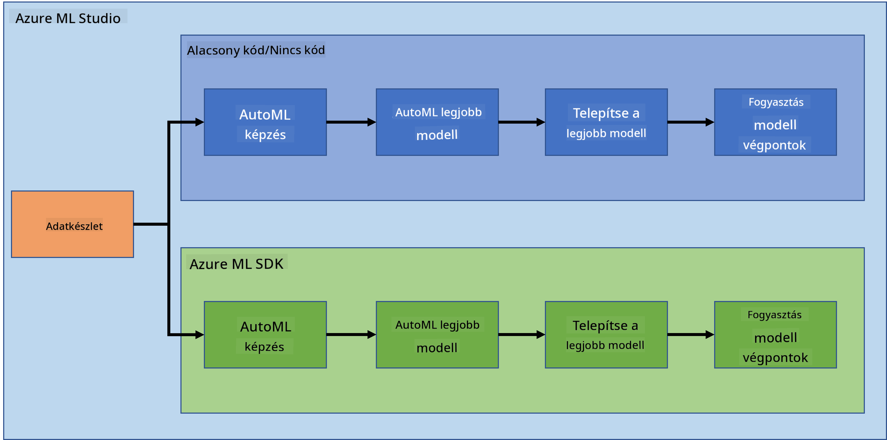

Mindkét megközelítésnek megvannak a maga előnyei és hátrányai. Az alacsony kódú/kódmentes megközelítés könnyebb kezdésként, mivel egy grafikus felhasználói felülettel (GUI) való interakciót igényel, előzetes kódolási ismeretek nélkül. Ez a módszer lehetővé teszi a projekt életképességének gyors tesztelését és egy POC (Proof Of Concept) létrehozását. Azonban, ahogy a projekt növekszik és a dolgok gyártásra készen állnak, nem célszerű erőforrásokat létrehozni GUI-n keresztül. Programozottan kell automatizálni mindent, az erőforrások létrehozásától kezdve a modell telepítéséig. Itt válik kulcsfontosságúvá az Azure ML SDK használatának ismerete.

|                   | Low code/No code | Azure ML SDK              |
|-------------------|------------------|---------------------------|
| Kódolási ismeretek | Nem szükséges    | Szükséges                 |
| Fejlesztési idő   | Gyors és egyszerű | A kódolási ismeretektől függ |
| Gyártásra kész    | Nem              | Igen                      |

### 1.3 A szívelégtelenség adatállomány: 

A szív- és érrendszeri betegségek (CVD-k) világszerte a halálozás első számú okai, az összes haláleset 31%-át teszik ki. Környezeti és viselkedési kockázati tényezők, mint például a dohányzás, egészségtelen étrend és elhízás, fizikai inaktivitás és az alkohol káros használata, felhasználhatók becslési modellek jellemzőiként. A CVD kialakulásának valószínűségének becslése nagy segítséget jelenthet a magas kockázatú emberek támadásainak megelőzésében.

A Kaggle nyilvánosan elérhetővé tett egy [szívelégtelenség adatállományt](https://www.kaggle.com/andrewmvd/heart-failure-clinical-data), amelyet ebben a projektben fogunk használni. Most letöltheti az adatállományt. Ez egy táblázatos adatállomány, amely 13 oszlopot (12 jellemző és 1 célváltozó) és 299 sort tartalmaz. 

|    | Változó neve              | Típus           | Leírás                                                    | Példa             |
|----|---------------------------|-----------------|-----------------------------------------------------------|-------------------|
| 1  | age                       | numerikus       | a páciens életkora                                        | 25                |
| 2  | anaemia                   | logikai         | A vörösvérsejtek vagy a hemoglobin csökkenése             | 0 vagy 1          |
| 3  | creatinine_phosphokinase  | numerikus       | A CPK enzim szintje a vérben                              | 542               |
| 4  | diabetes                  | logikai         | Ha a páciens cukorbeteg                                   | 0 vagy 1          |
| 5  | ejection_fraction         | numerikus       | A szívből kilépő vér százaléka minden összehúzódáskor     | 45                |
| 6  | high_blood_pressure       | logikai         | Ha a páciens hipertóniás                                 | 0 vagy 1          |
| 7  | platelets                 | numerikus       | Vérlemezkék a vérben                                      | 149000            |
| 8  | serum_creatinine          | numerikus       | A szérum kreatinin szintje a vérben                       | 0.5               |
| 9  | serum_sodium              | numerikus       | A szérum nátrium szintje a vérben                         | jun               |
| 10 | sex                       | logikai         | nő vagy férfi                                             | 0 vagy 1          |
| 11 | smoking                   | logikai         | Ha a páciens dohányzik                                    | 0 vagy 1          |
| 12 | time                      | numerikus       | követési időszak (napok)                                  | 4                 |
|----|---------------------------|-----------------|-----------------------------------------------------------|-------------------|
| 21 | DEATH_EVENT [Cél]         | logikai         | ha a páciens meghal a követési időszak alatt              | 0 vagy 1          |

Miután megvan az adatállomány, elkezdhetjük a projektet az Azure-ban.

## 2. Low code/No code modell tanítása az Azure ML Studio-ban
### 2.1 Azure ML munkaterület létrehozása
Ahhoz, hogy modellt tanítsunk az Azure ML-ben, először létre kell hoznunk egy Azure ML munkaterületet. A munkaterület az Azure Machine Learning legfelső szintű erőforrása, amely központi helyet biztosít az Azure Machine Learning használatával létrehozott összes artefaktum kezeléséhez. A munkaterület nyilvántartást vezet az összes tanítási futásról, beleértve a naplókat, metrikákat, kimeneteket és a szkriptek pillanatképét. Ezt az információt használhatja annak meghatározására, hogy melyik tanítási futás eredményezi a legjobb modellt. [További információ](https://docs.microsoft.com/azure/machine-learning/concept-workspace?WT.mc_id=academic-77958-bethanycheum&ocid=AID3041109)

Ajánlott a legfrissebb, operációs rendszerével kompatibilis böngésző használata. A következő böngészők támogatottak:

- Microsoft Edge (Az új Microsoft Edge, legfrissebb verzió. Nem a Microsoft Edge legacy)
- Safari (legfrissebb verzió, csak Mac)
- Chrome (legfrissebb verzió)
- Firefox (legfrissebb verzió)

Az Azure Machine Learning használatához hozzon létre egy munkaterületet az Azure előfizetésében. Ezután ezt a munkaterületet használhatja az adatok, számítási erőforrások, kódok, modellek és más, gépi tanulási munkaterhelésekkel kapcsolatos artefaktumok kezelésére.

> **_MEGJEGYZÉS:_** Az Azure előfizetése kis összeget fog felszámítani az adattárolásért, amíg az Azure Machine Learning munkaterület létezik az előfizetésében, ezért javasoljuk, hogy törölje az Azure Machine Learning munkaterületet, amikor már nem használja.

1. Jelentkezzen be az [Azure portálra](https://ms.portal.azure.com/) az Azure előfizetéséhez kapcsolódó Microsoft hitelesítő adatokkal.
2. Válassza ki a **＋Erőforrás létrehozása** lehetőséget
   
   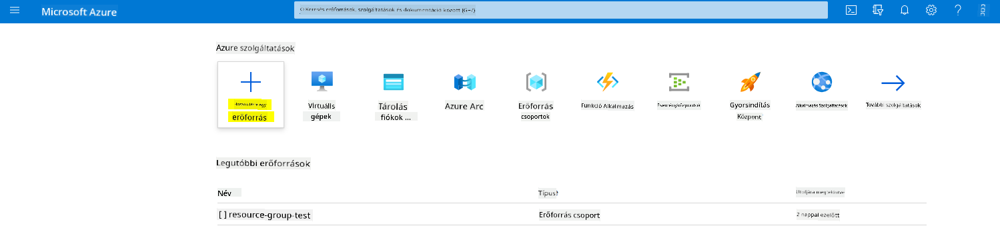

   Keressen rá a Machine Learning-re, és válassza ki a Machine Learning csempét

   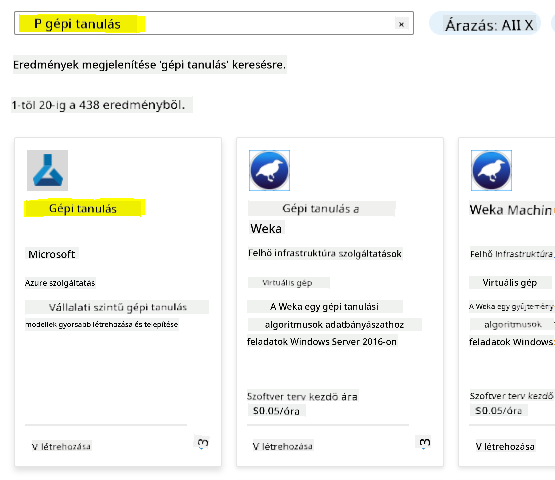

   Kattintson a létrehozás gombra

   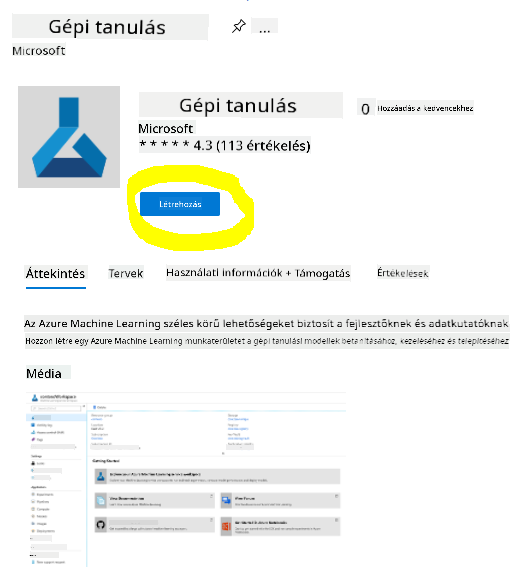

   Töltse ki a beállításokat az alábbiak szerint:
   - Előfizetés: Az Azure előfizetése
   - Erőforráscsoport: Hozzon létre vagy válasszon egy erőforráscsoportot
   - Munkaterület neve: Adjon meg egy egyedi nevet a munkaterületéhez
   - Régió: Válassza ki a földrajzilag legközelebbi régiót
   - Tárolófiók: Jegyezze fel az új tárolófiókot, amelyet a munkaterületéhez hoznak létre
   - Kulcstartó: Jegyezze fel az új kulcstartót, amelyet a munkaterületéhez hoznak létre
   - Alkalmazás-elemzések: Jegyezze fel az új alkalmazás-elemzési erőforrást, amelyet a munkaterületéhez hoznak létre
   - Tárolóregisztráció: Nincs (automatikusan létrejön az első alkalommal, amikor modellt telepít egy tárolóba)

    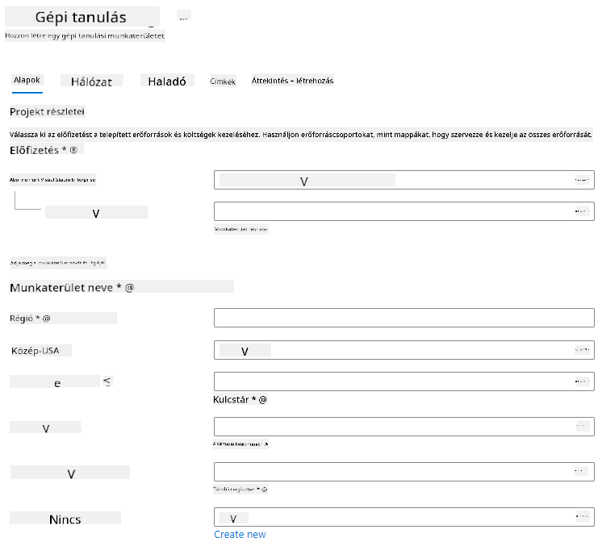

   - Kattintson a létrehozás + áttekintés, majd a létrehozás gombra
3. Várja meg, amíg a munkaterület létrejön (ez néhány percet igénybe vehet). Ezután keresse meg a portálon. A Machine Learning Azure szolgáltatáson keresztül találhatja meg.
4. A munkaterület áttekintő oldalán indítsa el az Azure Machine Learning stúdiót (vagy nyisson meg egy új böngészőlapot, és navigáljon ide: https://ml.azure.com), és jelentkezzen be az Azure Machine Learning stúdióba Microsoft fiókjával. Ha szükséges, válassza ki az Azure könyvtárát és előfizetését, valamint az Azure Machine Learning munkaterületét.
   
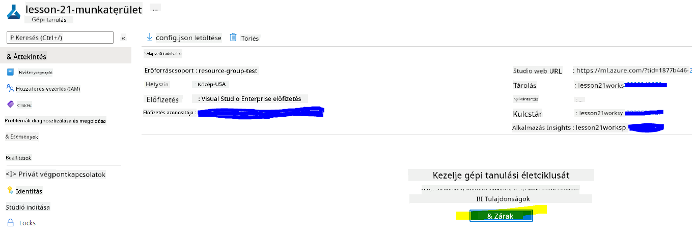

5. Az Azure Machine Learning stúdióban kapcsolja be a ☰ ikont a bal felső sarokban, hogy megtekintse az interfész különböző oldalait. Ezeket az oldalakat használhatja a munkaterület erőforrásainak kezelésére.

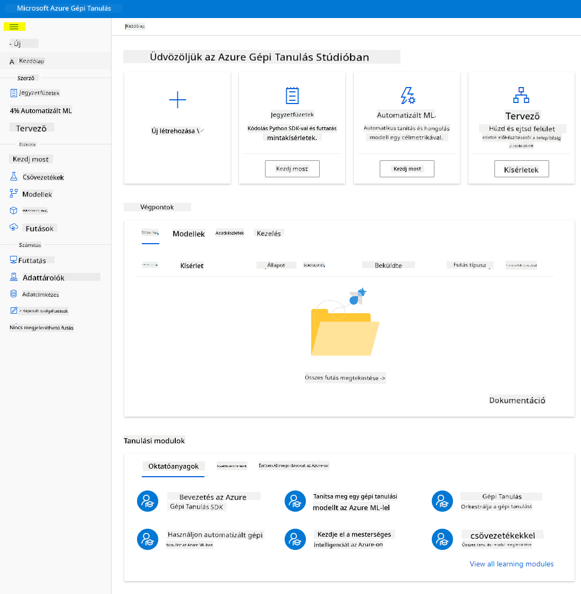

A munkaterületet kezelheti az Azure portálon keresztül, de az adattudós
- **Csatolt számítás**: Kapcsolódás meglévő Azure számítási erőforrásokhoz, például virtuális gépekhez vagy Azure Databricks klaszterekhez.

#### 2.2.1 A megfelelő számítási erőforrás kiválasztása

Néhány kulcsfontosságú tényezőt érdemes figyelembe venni számítási erőforrás létrehozásakor, mivel ezek kritikus döntések lehetnek.

**CPU-ra vagy GPU-ra van szüksége?**

A CPU (központi feldolgozóegység) az a elektronikus áramkör, amely végrehajtja a számítógépes program utasításait. A GPU (grafikus feldolgozóegység) egy speciális elektronikus áramkör, amely rendkívül nagy sebességgel képes grafikai kódokat végrehajtani.

A fő különbség a CPU és a GPU architektúrája között az, hogy a CPU-t széles körű feladatok gyors kezelésére tervezték (amit a CPU órajele mér), de korlátozott a párhuzamosan futó feladatok száma. A GPU-k párhuzamos számításokra vannak optimalizálva, ezért sokkal jobbak a mélytanulási feladatokban.

| CPU                                     | GPU                         |
|-----------------------------------------|-----------------------------|
| Kevésbé költséges                       | Drágább                     |
| Alacsonyabb szintű párhuzamosság        | Magasabb szintű párhuzamosság |
| Lassabb a mélytanulási modellek betanításában | Optimális mélytanuláshoz    |

**Klaszterméret**

A nagyobb klaszterek drágábbak, de jobb válaszidőt eredményeznek. Ezért, ha van időd, de kevés pénzed, kezdj egy kisebb klaszterrel. Ha viszont van pénzed, de kevés időd, kezdj egy nagyobb klaszterrel.

**VM Méret**

Az idő- és költségkereted függvényében változtathatod a RAM, a lemez, a magok számát és az órajelet. Ezeknek a paramétereknek a növelése drágább, de jobb teljesítményt eredményez.

**Dedikált vagy alacsony prioritású példányok?**

Az alacsony prioritású példány megszakítható: lényegében a Microsoft Azure elveheti ezeket az erőforrásokat, és más feladathoz rendelheti, megszakítva ezzel a munkát. A dedikált példány, vagyis a nem megszakítható, azt jelenti, hogy a munka soha nem lesz megszakítva az engedélyed nélkül. Ez ismét egy idő-pénz mérlegelés, mivel a megszakítható példányok olcsóbbak, mint a dedikáltak.

#### 2.2.2 Számítási klaszter létrehozása

Az [Azure ML munkaterületen](https://ml.azure.com/), amelyet korábban létrehoztunk, menj a "Compute" menüpontra, és itt láthatod azokat a különböző számítási erőforrásokat, amelyeket az előbb tárgyaltunk (pl. számítási példányok, számítási klaszterek, következtetési klaszterek és csatolt számítás). Ehhez a projekthez egy számítási klaszterre lesz szükségünk a modell betanításához. A Stúdióban kattints a "Compute" menüre, majd a "Compute cluster" fülre, és kattints a "+ New" gombra egy új számítási klaszter létrehozásához.

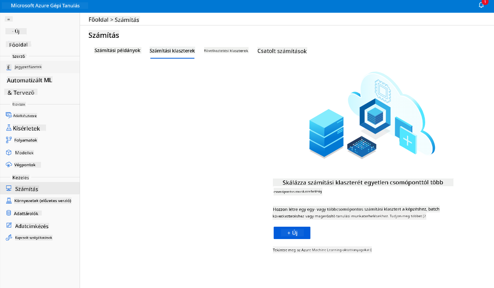

1. Válaszd ki az opciókat: Dedikált vagy alacsony prioritás, CPU vagy GPU, VM méret és magok száma (ehhez a projekthez megtarthatod az alapértelmezett beállításokat).
2. Kattints a "Next" gombra.

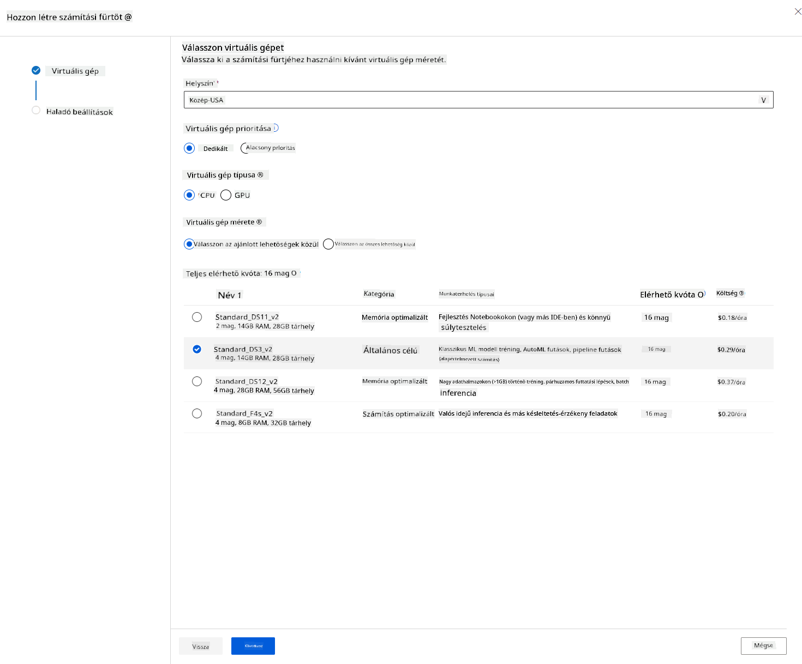

3. Adj nevet a klaszternek.
4. Válaszd ki az opciókat: Minimális/makszimális csomópontok száma, üresjárati másodpercek a leállítás előtt, SSH hozzáférés. Jegyezd meg, hogy ha a minimális csomópontok száma 0, pénzt takaríthatsz meg, amikor a klaszter üresjáratban van. Jegyezd meg, hogy minél magasabb a maximális csomópontok száma, annál rövidebb lesz a betanítási idő. Az ajánlott maximális csomópontszám 3.
5. Kattints a "Create" gombra. Ez a lépés néhány percet vehet igénybe.

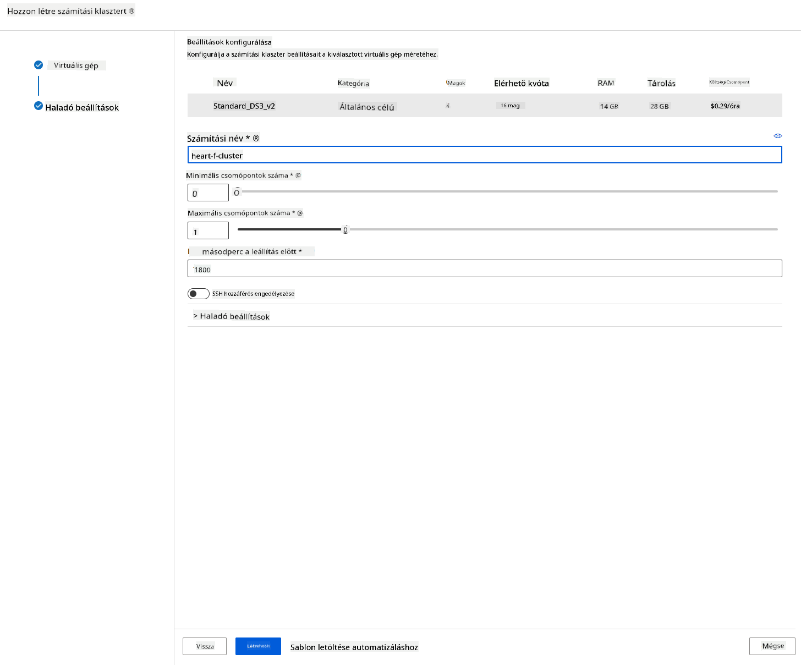

Szuper! Most, hogy van egy számítási klaszterünk, be kell töltenünk az adatokat az Azure ML Stúdióba.

### 2.3 Az adathalmaz betöltése

1. Az [Azure ML munkaterületen](https://ml.azure.com/), amelyet korábban létrehoztunk, kattints a bal oldali menüben a "Datasets" menüpontra, majd a "+ Create dataset" gombra egy új adathalmaz létrehozásához. Válaszd a "From local files" opciót, és válaszd ki a korábban letöltött Kaggle adathalmazt.

   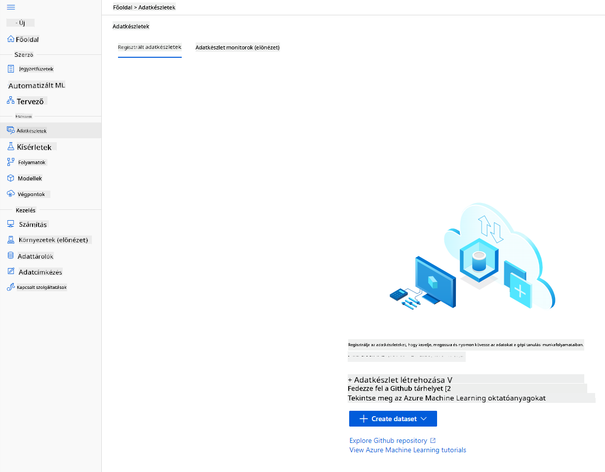

2. Adj nevet, típust és leírást az adathalmaznak. Kattints a "Next" gombra. Töltsd fel az adatokat a fájlokból. Kattints a "Next" gombra.

   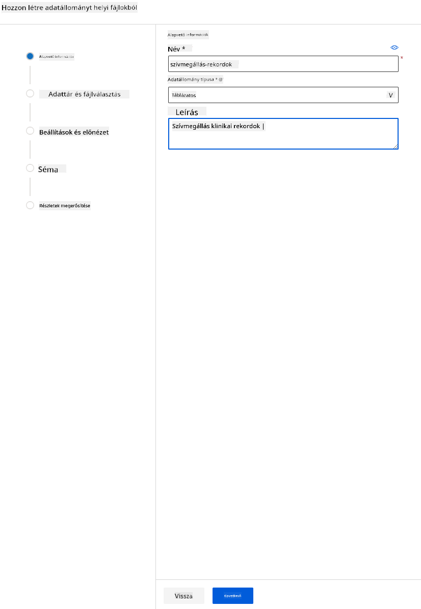

3. A séma beállításainál állítsd a következő jellemzők adattípusát Boolean-ra: anaemia, diabetes, high blood pressure, sex, smoking, és DEATH_EVENT. Kattints a "Next" gombra, majd a "Create" gombra.

   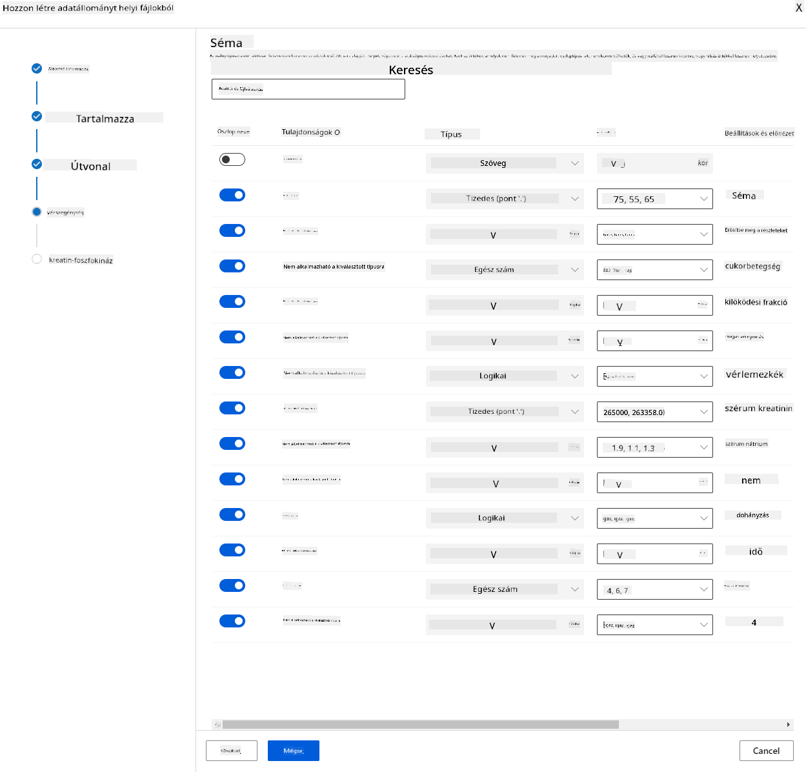

Nagyszerű! Most, hogy az adathalmaz készen áll, és a számítási klaszter létrejött, elkezdhetjük a modell betanítását!

### 2.4 Kódmentes/Kódminimalizált betanítás AutoML-lel

A hagyományos gépi tanulási modellek fejlesztése erőforrás-igényes, jelentős szaktudást és időt igényel, hogy több tucat modellt előállítsunk és összehasonlítsunk. Az automatizált gépi tanulás (AutoML) a gépi tanulási modellek fejlesztésének időigényes, iteratív feladatait automatizálja. Lehetővé teszi az adatelemzők, fejlesztők számára, hogy nagy léptékben, hatékonyan és produktívan építsenek ML modelleket, miközben fenntartják a modell minőségét. Ez jelentősen csökkenti az időt, amely a gyártásra kész ML modellek előállításához szükséges. [Tudj meg többet](https://docs.microsoft.com/azure/machine-learning/concept-automated-ml?WT.mc_id=academic-77958-bethanycheum&ocid=AID3041109).

1. Az [Azure ML munkaterületen](https://ml.azure.com/), amelyet korábban létrehoztunk, kattints a bal oldali menüben az "Automated ML" menüpontra, és válaszd ki az imént feltöltött adathalmazt. Kattints a "Next" gombra.

   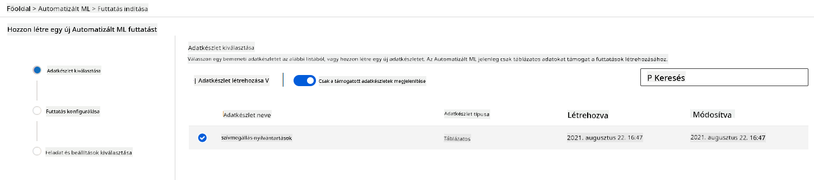

2. Adj meg egy új kísérletnevet, a céloszlopot (DEATH_EVENT) és a létrehozott számítási klasztert. Kattints a "Next" gombra.

   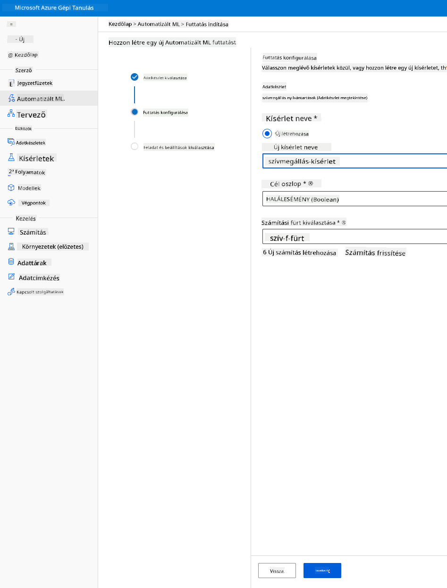

3. Válaszd a "Classification" lehetőséget, majd kattints a "Finish" gombra. Ez a lépés 30 perctől 1 óráig tarthat, a számítási klaszter méretétől függően.

   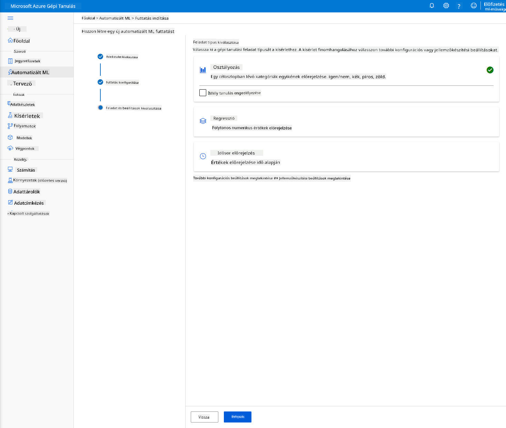

4. Amikor a futtatás befejeződött, kattints az "Automated ML" fülre, válaszd ki a futtatásodat, majd kattints az "Algorithm" gombra a "Best model summary" kártyán.

   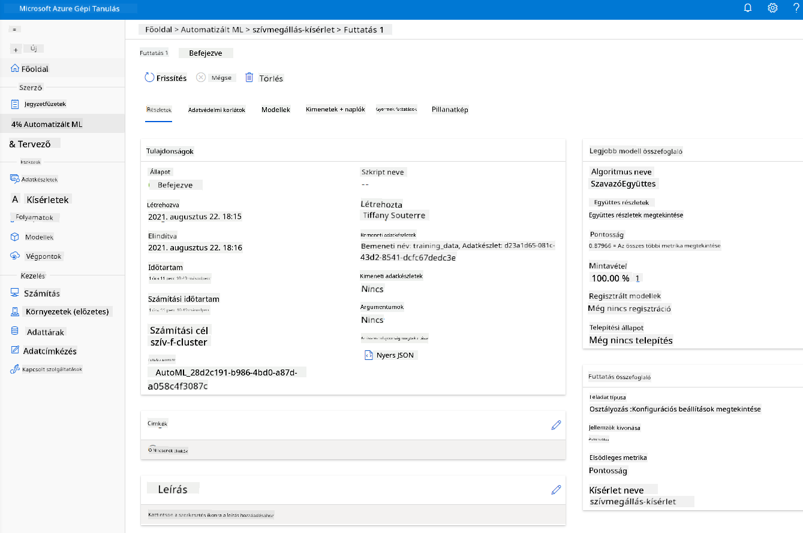

Itt részletes leírást találsz az AutoML által generált legjobb modellről. Fedezd fel a többi modellt is a "Models" fülön. Szánj néhány percet a modellek magyarázatainak (előzetes) megtekintésére. Miután kiválasztottad a használni kívánt modellt (itt az AutoML által kiválasztott legjobb modellt választjuk), megnézzük, hogyan lehet azt telepíteni.

## 3. Kódmentes/Kódminimalizált modelltelepítés és végpontfogyasztás
### 3.1 Modelltelepítés

Az automatizált gépi tanulási felület lehetővé teszi, hogy néhány lépésben webszolgáltatásként telepítsd a legjobb modellt. A telepítés a modell integrációját jelenti, hogy az új adatok alapján előrejelzéseket készíthessen, és azonosíthassa a potenciális lehetőségeket. Ebben a projektben a webszolgáltatásként történő telepítés azt jelenti, hogy az orvosi alkalmazások képesek lesznek élő előrejelzéseket készíteni a betegek szívrohamkockázatáról.

A legjobb modell leírásában kattints a "Deploy" gombra.

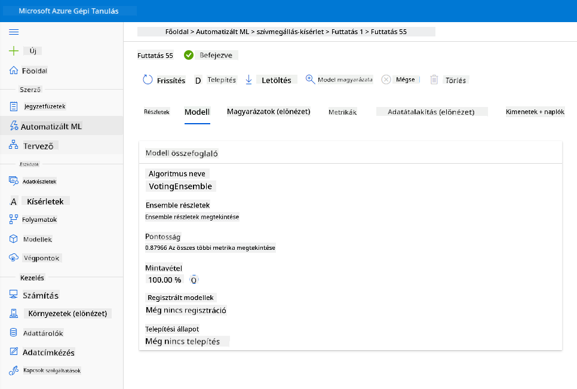

15. Adj neki egy nevet, egy leírást, válaszd ki a számítási típust (Azure Container Instance), engedélyezd az autentikációt, majd kattints a "Deploy" gombra. Ez a lépés körülbelül 20 percet vehet igénybe. A telepítési folyamat több lépést tartalmaz, beleértve a modell regisztrálását, az erőforrások létrehozását és azok konfigurálását a webszolgáltatáshoz. Egy állapotüzenet jelenik meg a "Deploy status" alatt. Időnként kattints a "Refresh" gombra az állapot ellenőrzéséhez. A telepítés akkor sikeres, ha az állapot "Healthy".

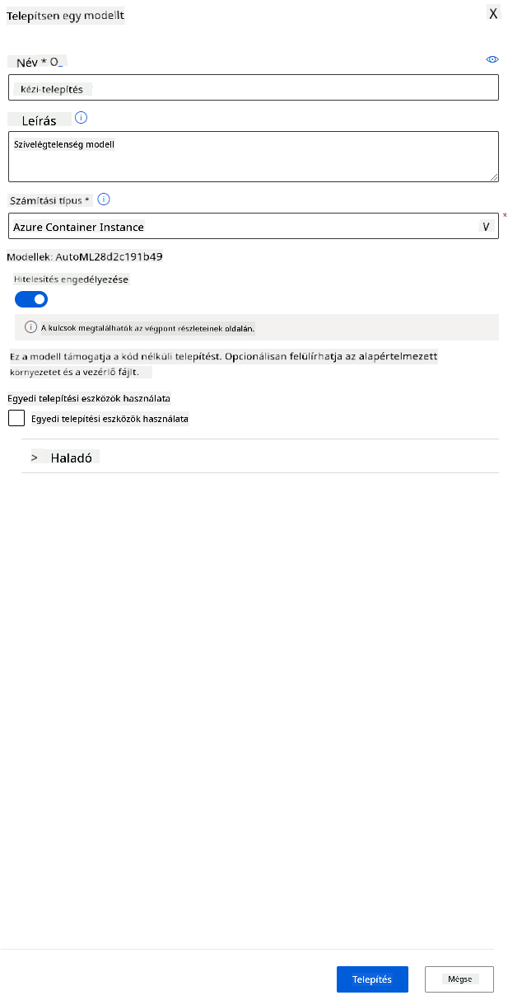

16. Miután a telepítés befejeződött, kattints az "Endpoint" fülre, majd a most telepített végpontra. Itt megtalálod az összes részletet, amit a végpontról tudnod kell.

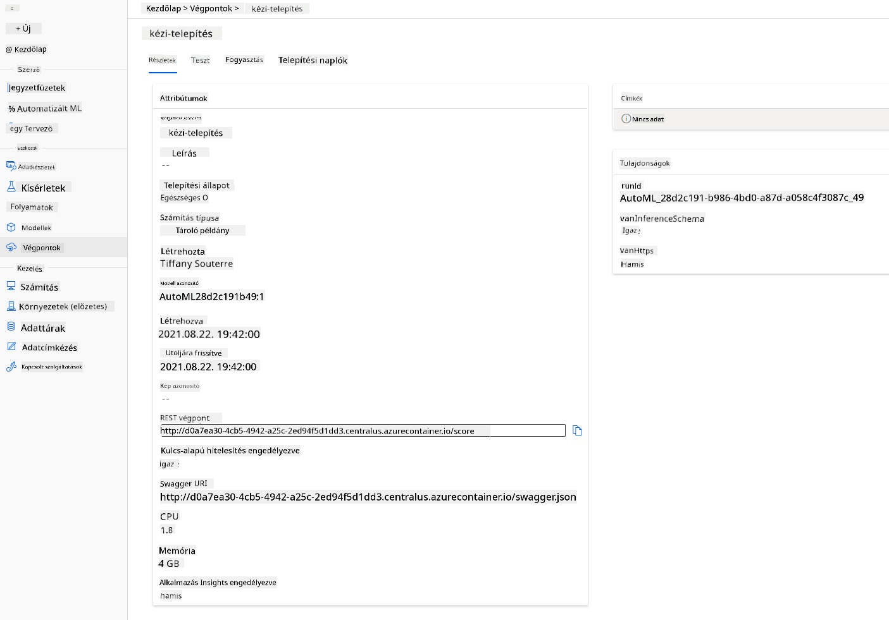

Fantasztikus! Most, hogy a modell telepítve van, elkezdhetjük a végpont fogyasztását.

### 3.2 Végpontfogyasztás

Kattints a "Consume" fülre. Itt megtalálod a REST végpontot és egy Python szkriptet a fogyasztási opcióban. Szánj időt a Python kód elolvasására.

Ez a szkript közvetlenül a helyi gépedről futtatható, és fogyasztja a végpontot.

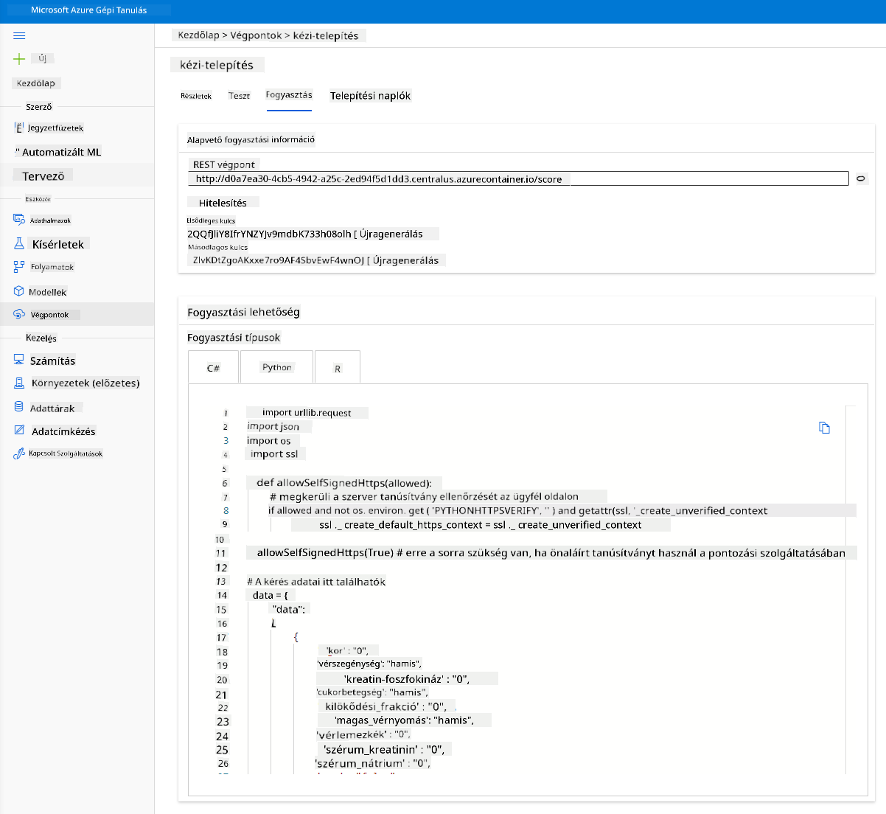

Nézd meg közelebbről ezt a két kódsort:

```python
url = 'http://98e3715f-xxxx-xxxx-xxxx-9ec22d57b796.centralus.azurecontainer.io/score'
api_key = '' # Replace this with the API key for the web service
```
Az `url` változó a "Consume" fülön található REST végpontot tartalmazza, az `api_key` változó pedig az elsődleges kulcsot (csak akkor, ha engedélyezted az autentikációt). Ez a szkript így tudja fogyasztani a végpontot.

18. A szkript futtatásakor a következő kimenetet kell látnod:
    ```python
    b'"{\\"result\\": [true]}"'
    ```
Ez azt jelenti, hogy a szívleállás előrejelzése az adott adatok alapján igaz. Ez logikus, mert ha közelebbről megnézed a szkriptben automatikusan generált adatokat, minden alapértelmezés szerint 0 és hamis. Az adatokat a következő mintával módosíthatod:

```python
data = {
    "data":
    [
        {
            'age': "0",
            'anaemia': "false",
            'creatinine_phosphokinase': "0",
            'diabetes': "false",
            'ejection_fraction': "0",
            'high_blood_pressure': "false",
            'platelets': "0",
            'serum_creatinine': "0",
            'serum_sodium': "0",
            'sex': "false",
            'smoking': "false",
            'time': "0",
        },
        {
            'age': "60",
            'anaemia': "false",
            'creatinine_phosphokinase': "500",
            'diabetes': "false",
            'ejection_fraction': "38",
            'high_blood_pressure': "false",
            'platelets': "260000",
            'serum_creatinine': "1.40",
            'serum_sodium': "137",
            'sex': "false",
            'smoking': "false",
            'time': "130",
        },
    ],
}
```
A szkriptnek a következőt kell visszaadnia:
    ```python
    b'"{\\"result\\": [true, false]}"'
    ```

Gratulálok! Most már fogyasztottad a telepített modellt, és betanítottad az Azure ML-en!

> **_MEGJEGYZÉS:_** Miután befejezted a projektet, ne felejtsd el törölni az összes erőforrást.
## 🚀 Kihívás

Nézd meg alaposan az AutoML által generált modellmagyarázatokat és részleteket a legjobb modellekhez. Próbáld megérteni, miért jobb a legjobb modell a többinél. Milyen algoritmusokat hasonlítottak össze? Mik a különbségek közöttük? Miért teljesít jobban a legjobb ebben az esetben?

## [Utólagos előadás kvíz](https://purple-hill-04aebfb03.1.azurestaticapps.net/quiz/35)

## Áttekintés és önálló tanulás

Ebben a leckében megtanultad, hogyan kell betanítani, telepíteni és fogyasztani egy modellt, amely a szívleállás kockázatát jósolja kódmentes/kódminimalizált módon a felhőben. Ha még nem tetted meg, merülj el mélyebben az AutoML által generált modellmagyarázatokban, és próbáld megérteni, miért jobb a legjobb modell a többinél.

További információkat találhatsz a kódmentes/kódminimalizált AutoML-ről ebben a [dokumentációban](https://docs.microsoft.com/azure/machine-learning/tutorial-first-experiment-automated-ml?WT.mc_id=academic-77958-bethanycheum&ocid=AID3041109).

## Feladat

[Low code/No code Data Science projekt az Azure ML-en](assignment.md)

---

**Felelősség kizárása**:  
Ez a dokumentum az AI fordítási szolgáltatás [Co-op Translator](https://github.com/Azure/co-op-translator) segítségével lett lefordítva. Bár törekszünk a pontosságra, kérjük, vegye figyelembe, hogy az automatikus fordítások hibákat vagy pontatlanságokat tartalmazhatnak. Az eredeti dokumentum az eredeti nyelvén tekintendő hiteles forrásnak. Kritikus információk esetén javasolt professzionális emberi fordítást igénybe venni. Nem vállalunk felelősséget semmilyen félreértésért vagy téves értelmezésért, amely a fordítás használatából eredhet.