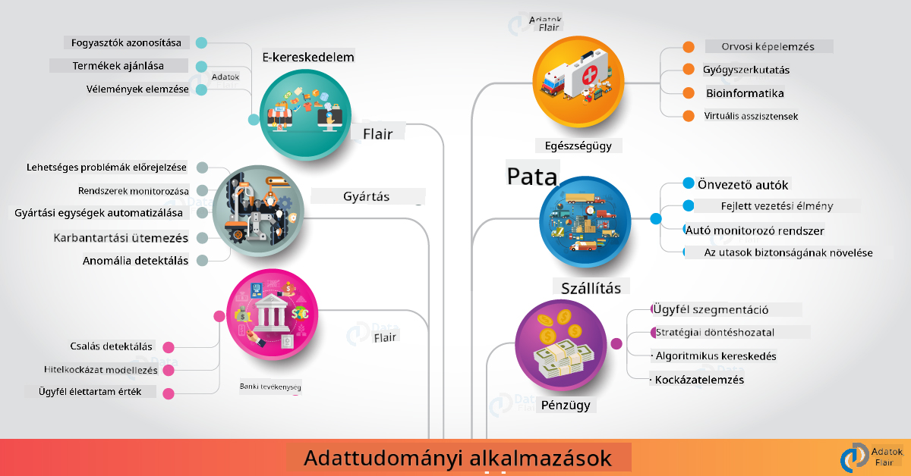

<!--
CO_OP_TRANSLATOR_METADATA:
{
  "original_hash": "67076ed50f54e7d26ba1ba378d6078f1",
  "translation_date": "2025-08-26T15:45:32+00:00",
  "source_file": "6-Data-Science-In-Wild/20-Real-World-Examples/README.md",
  "language_code": "hu"
}
-->
# Adattudomány a való világban

|  ](../../sketchnotes/20-DataScience-RealWorld.png) |
| :--------------------------------------------------------------------------------------------------------------: |
|               Adattudomány a való világban - _Sketchnote by [@nitya](https://twitter.com/nitya)_               |

Majdnem a tanulási utazás végére értünk!

Az adattudomány és etika definícióival kezdtük, különböző eszközöket és technikákat fedeztünk fel az adatelemzéshez és vizualizációhoz, áttekintettük az adattudomány életciklusát, valamint megvizsgáltuk, hogyan lehet az adattudományi munkafolyamatokat méretezni és automatizálni felhőalapú szolgáltatásokkal. Valószínűleg most azt kérdezed: _"Hogyan tudom mindezt a való világban alkalmazni?"_

Ebben a leckében az adattudomány iparági alkalmazásait vizsgáljuk meg, és konkrét példákat nézünk meg a kutatás, digitális humán tudományok és fenntarthatóság területén. Megnézzük a diákprojektek lehetőségeit, és hasznos forrásokkal zárjuk, amelyek segítenek folytatni a tanulási utadat!

## Előadás előtti kvíz

[Előadás előtti kvíz](https://purple-hill-04aebfb03.1.azurestaticapps.net/quiz/38)

## Adattudomány + Ipar

Az AI demokratizálásának köszönhetően a fejlesztők számára egyre könnyebb AI-alapú döntéshozatali és adatvezérelt betekintéseket integrálni a felhasználói élményekbe és fejlesztési munkafolyamatokba. Íme néhány példa arra, hogyan alkalmazzák az adattudományt a való világban az ipar különböző területein:

 * [Google Flu Trends](https://www.wired.com/2015/10/can-learn-epic-failure-google-flu-trends/) az adattudományt használta arra, hogy összefüggést találjon a keresési kifejezések és az influenzatrendek között. Bár a megközelítésnek voltak hibái, felhívta a figyelmet az adatvezérelt egészségügyi előrejelzések lehetőségeire (és kihívásaira).

 * [UPS Routing Predictions](https://www.technologyreview.com/2018/11/21/139000/how-ups-uses-ai-to-outsmart-bad-weather/) - bemutatja, hogyan használja az UPS az adattudományt és gépi tanulást az optimális útvonalak előrejelzésére, figyelembe véve az időjárási viszonyokat, forgalmi mintákat, szállítási határidőket és egyebeket.

 * [NYC Taxicab Route Visualization](http://chriswhong.github.io/nyctaxi/) - az [Információszabadság törvények](https://chriswhong.com/open-data/foil_nyc_taxi/) alapján gyűjtött adatok segítségével vizualizálták egy napot az NYC taxik életéből, megértve, hogyan navigálnak a zsúfolt városban, mennyi pénzt keresnek, és mennyi ideig tartanak az utazások egy 24 órás időszak alatt.

 * [Uber Data Science Workbench](https://eng.uber.com/dsw/) - napi szinten gyűjtött adatok (felvételi és leadási helyek, utazási időtartam, preferált útvonalak stb.) felhasználásával épít adattudományi eszközt az árképzés, biztonság, csalásfelismerés és navigációs döntések támogatására.

 * [Sports Analytics](https://towardsdatascience.com/scope-of-analytics-in-sports-world-37ed09c39860) - a _prediktív analitikára_ (csapat- és játékoselemzés - gondolj [Moneyball](https://datasciencedegree.wisconsin.edu/blog/moneyball-proves-importance-big-data-big-ideas/) - és rajongói menedzsmentre) és _adatvizualizációra_ (csapat- és rajongói irányítópultok, játékok stb.) összpontosít, olyan alkalmazásokkal, mint tehetségkutatás, sportfogadás és készlet/helyszín menedzsment.

 * [Adattudomány a banki szektorban](https://data-flair.training/blogs/data-science-in-banking/) - kiemeli az adattudomány értékét a pénzügyi iparban, olyan alkalmazásokkal, mint kockázatmodellezés, csalásfelismerés, ügyfél szegmentáció, valós idejű előrejelzés és ajánlórendszerek. A prediktív analitika kritikus intézkedéseket is támogat, mint például [hitelpontszámok](https://dzone.com/articles/using-big-data-and-predictive-analytics-for-credit).

 * [Adattudomány az egészségügyben](https://data-flair.training/blogs/data-science-in-healthcare/) - kiemeli az alkalmazásokat, mint orvosi képalkotás (pl. MRI, röntgen, CT-vizsgálat), genomika (DNS szekvenálás), gyógyszerfejlesztés (kockázatértékelés, siker előrejelzés), prediktív analitika (betegellátás és ellátási logisztika), betegségek nyomon követése és megelőzése stb.

 Kép forrása: [Data Flair: 6 Amazing Data Science Applications ](https://data-flair.training/blogs/data-science-applications/)

A fenti ábra további területeket és példákat mutat be az adattudományi technikák alkalmazására. Szeretnél további alkalmazásokat felfedezni? Nézd meg az [Áttekintés és önálló tanulás](../../../../6-Data-Science-In-Wild/20-Real-World-Examples) szekciót alább.

## Adattudomány + Kutatás

|  ](../../sketchnotes/20-DataScience-Research.png) |
| :---------------------------------------------------------------------------------------------------------------: |
|              Adattudomány és Kutatás - _Sketchnote by [@nitya](https://twitter.com/nitya)_              |

Míg a való világban az alkalmazások gyakran az ipari felhasználási esetekre összpontosítanak, a _kutatási_ alkalmazások és projektek két szempontból is hasznosak lehetnek:

* _innovációs lehetőségek_ - fejlett koncepciók gyors prototípusának kidolgozása és felhasználói élmények tesztelése a következő generációs alkalmazásokhoz.
* _telepítési kihívások_ - az adattudományi technológiák potenciális káros hatásainak vagy nem szándékos következményeinek vizsgálata a való világban.

A diákok számára ezek a kutatási projektek tanulási és együttműködési lehetőségeket kínálhatnak, amelyek javíthatják a téma megértését, és szélesíthetik a releváns emberekkel vagy csapatokkal való kapcsolataikat az érdeklődési területeken. De hogyan néznek ki ezek a kutatási projektek, és milyen hatással lehetnek?

Nézzünk meg egy példát - az [MIT Gender Shades Study](http://gendershades.org/overview.html) projektet Joy Buolamwini (MIT Media Labs) vezetésével, amelyhez egy [jelentős kutatási tanulmány](http://proceedings.mlr.press/v81/buolamwini18a/buolamwini18a.pdf) is kapcsolódik, Timnit Gebru (akkor Microsoft Research) társszerzőként. A projekt célja:

 * **Mi:** A kutatási projekt célja az volt, hogy _értékelje az automatikus arcfelismerési algoritmusok és adathalmazok torzításait_ nem és bőrtípus alapján.
 * **Miért:** Az arcfelismerés olyan területeken használatos, mint a bűnüldözés, repülőtéri biztonság, munkaerő-felvételi rendszerek és mások - olyan kontextusok, ahol a pontatlan osztályozás (pl. torzítás miatt) gazdasági és társadalmi károkat okozhat az érintett egyéneknek vagy csoportoknak. A torzítások megértése (és megszüntetése vagy enyhítése) kulcsfontosságú a használat méltányosságához.
 * **Hogyan:** A kutatók felismerték, hogy a meglévő referenciaértékek túlnyomórészt világos bőrű alanyokat használtak, és egy új adathalmazt (1000+ kép) állítottak össze, amely _kiegyensúlyozottabb_ volt nem és bőrtípus szerint. Az adathalmazt három nemi osztályozási termék (Microsoft, IBM és Face++) pontosságának értékelésére használták.

Az eredmények azt mutatták, hogy bár az általános osztályozási pontosság jó volt, észrevehető különbség volt a hibaarányok között az egyes alcsoportok esetében - a **rossz nemi besorolás** gyakoribb volt nőknél vagy sötétebb bőrtípusú személyeknél, ami torzításra utal.

**Fő eredmények:** Felhívta a figyelmet arra, hogy az adattudománynak szüksége van _reprezentatívabb adathalmazokra_ (kiegyensúlyozott alcsoportok) és _inkluzívabb csapatokra_ (sokszínű háttérrel), hogy korábban felismerjék és megszüntessék vagy enyhítsék az ilyen torzításokat az AI megoldásokban. Az ilyen kutatási erőfeszítések kulcsfontosságúak abban, hogy sok szervezet meghatározza az _felelős AI_ elveit és gyakorlatát, hogy javítsa a méltányosságot AI termékeik és folyamataik során.

**Szeretnél többet megtudni a Microsoft releváns kutatási erőfeszítéseiről?**

* Nézd meg a [Microsoft Research Projects](https://www.microsoft.com/research/research-area/artificial-intelligence/?facet%5Btax%5D%5Bmsr-research-area%5D%5B%5D=13556&facet%5Btax%5D%5Bmsr-content-type%5D%5B%5D=msr-project) oldalát az AI területén.
* Fedezd fel a diákprojektek lehetőségeit a [Microsoft Research Data Science Summer School](https://www.microsoft.com/en-us/research/academic-program/data-science-summer-school/) programban.
* Nézd meg a [Fairlearn](https://fairlearn.org/) projektet és a [Responsible AI](https://www.microsoft.com/en-us/ai/responsible-ai?activetab=pivot1%3aprimaryr6) kezdeményezéseket.

## Adattudomány + Humán tudományok

|  ](../../sketchnotes/20-DataScience-Humanities.png) |
| :---------------------------------------------------------------------------------------------------------------: |
|              Adattudomány és Digitális Humán tudományok - _Sketchnote by [@nitya](https://twitter.com/nitya)_              |

A digitális humán tudományokat [úgy definiálták](https://digitalhumanities.stanford.edu/about-dh-stanford), mint "gyakorlatok és megközelítések gyűjteménye, amelyek kombinálják a számítástechnikai módszereket a humán tudományos kutatással". A [Stanford projektek](https://digitalhumanities.stanford.edu/projects), mint például _"rebooting history"_ és _"poetic thinking"_ bemutatják a kapcsolatot a [Digitális Humán tudományok és Adattudomány](https://digitalhumanities.stanford.edu/digital-humanities-and-data-science) között - hangsúlyozva olyan technikákat, mint hálózatelemzés, információvizualizáció, térbeli és szövegelemzés, amelyek segíthetnek új betekintéseket és perspektívákat nyerni történelmi és irodalmi adathalmazokból.

*Szeretnél felfedezni és kiterjeszteni egy projektet ezen a területen?*

Nézd meg az ["Emily Dickinson and the Meter of Mood"](https://gist.github.com/jlooper/ce4d102efd057137bc000db796bfd671) projektet - egy remek példát [Jen Looper](https://twitter.com/jenlooper) munkájából, amely azt kérdezi, hogyan használhatjuk az adattudományt, hogy újraértékeljük az ismert költészetet, és új kontextusban vizsgáljuk meg annak jelentését és szerzőjének hozzájárulását. Például, _meg tudjuk-e jósolni, hogy egy vers melyik évszakban íródott a hangulatának vagy érzelmi tónusának elemzésével_ - és mit mond ez nekünk a szerző lelkiállapotáról az adott időszakban?

Ennek a kérdésnek a megválaszolásához követjük az adattudományi életciklus lépéseit:
 * [`Adatgyűjtés`](https://gist.github.com/jlooper/ce4d102efd057137bc000db796bfd671#acquiring-the-dataset) - releváns adathalmaz gyűjtése elemzéshez. Lehetőségek közé tartozik API használata (pl. [Poetry DB API](https://poetrydb.org/index.html)) vagy weboldalak adatainak lekaparása (pl. [Project Gutenberg](https://www.gutenberg.org/files/12242/12242-h/12242-h.htm)) olyan eszközökkel, mint [Scrapy](https://scrapy.org/).
 * [`Adattisztítás`](https://gist.github.com/jlooper/ce4d102efd057137bc000db796bfd671#clean-the-data) - bemutatja, hogyan lehet a szöveget formázni, tisztítani és egyszerűsíteni alapvető eszközökkel, mint a Visual Studio Code és Microsoft Excel.
 * [`Adatelemzés`](https://gist.github.com/jlooper/ce4d102efd057137bc000db796bfd671#working-with-the-data-in-a-notebook) - bemutatja, hogyan importálhatjuk az adathalmazt "Notebookokba" elemzéshez Python csomagokkal (mint pandas, numpy és matplotlib), hogy szervezzük és vizualizáljuk az adatokat.
 * [`Érzelemelemzés`](https://gist.github.com/jlooper/ce4d102efd057137bc000db796bfd671#sentiment-analysis-using-cognitive-services) - bemutatja, hogyan integrálhatunk felhőszolgáltatásokat, mint például Text Analytics, alacsony kódú eszközökkel, mint [Power Automate](https://flow.microsoft.com/en-us/) az automatizált adatfeldolgozási munkafolyamatokhoz.

Ezzel a munkafolyamattal felfedezhetjük a szezonális hatásokat a versek érzelmi tónusára, és segíthetünk saját perspektíváink kialakításában a szerzőről. Próbáld ki magad - majd bővítsd a notebookot, hogy más kérdéseket tegyél fel, vagy új módokon vizualizáld az adatokat!

> Használhatod a [Digitális Humán tudományok eszköztárának](https://github.com/Digital-Humanities-Toolkit) néhány eszközét, hogy folytasd ezeket a kutatásokat.

## Adattudomány + Fenntarthatóság

|  ](../../sketchnotes/20-DataScience-Sustainability.png) |
| :---------------------------------------------------------------------------------------------------------------: |
|              Adattudomány és Fenntarthatóság - _Sketchnote by [@nitya](https://twitter.com/nitya)_              |

A [2030 Fenntartható Fejlődési Agenda](https://sdgs.un.org/2030agenda) - amelyet az ENSZ minden tagja elfogadott 2015-ben - 17 célt határoz meg, köztük olyanokat, amelyek a **bolygó védelmére** összpontosítanak a degradációtól és az éghajlatváltozás hatásaitól. A [Microsoft Fenntarthatósági](https://www.microsoft.com/en-us/sustainability) kezdeményezés támogatja ezeket a célokat, azzal, hogy technológiai megoldásokat keres és fejleszt a fenntarthatóbb jövők érdekében, [4 célra összpontosítva](https://dev.to/azure/a-visual-guide-to-sustainable-software-engineering-53hh) - szén-negatív
**A Planetary Computer Project jelenleg előzetes verzióban van (2021. szeptember)** - íme, hogyan kezdheted el hozzájárulásodat a fenntarthatósági megoldásokhoz adattudomány segítségével.

* [Kérj hozzáférést](https://planetarycomputer.microsoft.com/account/request), hogy elkezdhesd a felfedezést és kapcsolatba léphess másokkal.
* [Fedezd fel a dokumentációt](https://planetarycomputer.microsoft.com/docs/overview/about), hogy megértsd a támogatott adatállományokat és API-kat.
* Fedezz fel alkalmazásokat, mint például az [Ecosystem Monitoring](https://analytics-lab.org/ecosystemmonitoring/), hogy inspirációt nyerj alkalmazási ötletekhez.

Gondolkodj azon, hogyan használhatod az adatvizualizációt arra, hogy releváns betekintéseket tárj fel vagy erősíts meg olyan területeken, mint a klímaváltozás és az erdőirtás. Vagy gondolkodj azon, hogyan lehet ezeket a betekintéseket új felhasználói élmények létrehozására használni, amelyek viselkedésbeli változásokat motiválnak a fenntarthatóbb élet érdekében.

## Adattudomány + Diákok

Beszéltünk az iparban és kutatásban alkalmazott valós példákról, valamint felfedeztünk adattudományi alkalmazási példákat a digitális humán tudományokban és a fenntarthatóság területén. Hogyan építheted fel készségeidet és oszthatod meg szakértelmedet adattudományi kezdőként?

Íme néhány példa adattudományi diákprojektekre, amelyek inspirálhatnak.

 * [MSR Data Science Summer School](https://www.microsoft.com/en-us/research/academic-program/data-science-summer-school/#!projects) GitHub [projektek](https://github.com/msr-ds3) témákkal, mint például:
    - [Faji elfogultság a rendőri erőszak alkalmazásában](https://www.microsoft.com/en-us/research/video/data-science-summer-school-2019-replicating-an-empirical-analysis-of-racial-differences-in-police-use-of-force/) | [Github](https://github.com/msr-ds3/stop-question-frisk)
    - [A New York-i metró rendszer megbízhatósága](https://www.microsoft.com/en-us/research/video/data-science-summer-school-2018-exploring-the-reliability-of-the-nyc-subway-system/) | [Github](https://github.com/msr-ds3/nyctransit)
 * [Anyagi kultúra digitalizálása: társadalmi-gazdasági eloszlások vizsgálata Sirkapban](https://claremont.maps.arcgis.com/apps/Cascade/index.html?appid=bdf2aef0f45a4674ba41cd373fa23afc) - [Ornella Altunyan](https://twitter.com/ornelladotcom) és csapata Claremontból, [ArcGIS StoryMaps](https://storymaps.arcgis.com/) használatával.

## 🚀 Kihívás

Keress cikkeket, amelyek kezdőbarát adattudományi projekteket ajánlanak - például [ez az 50 téma](https://www.upgrad.com/blog/data-science-project-ideas-topics-beginners/), [ez a 21 projektötlet](https://www.intellspot.com/data-science-project-ideas) vagy [ez a 16 projekt forráskóddal](https://data-flair.training/blogs/data-science-project-ideas/), amelyeket elemezhetsz és újraalkothatsz. Ne felejtsd el blogolni tanulási utazásaidról, és oszd meg betekintéseidet velünk.

## Előadás utáni kvíz

[Előadás utáni kvíz](https://purple-hill-04aebfb03.1.azurestaticapps.net/quiz/39)

## Áttekintés és önálló tanulás

Szeretnél további felhasználási eseteket felfedezni? Íme néhány releváns cikk:
 * [17 adattudományi alkalmazás és példa](https://builtin.com/data-science/data-science-applications-examples) - 2021. július
 * [11 lenyűgöző adattudományi alkalmazás a való világban](https://myblindbird.com/data-science-applications-real-world/) - 2021. május
 * [Adattudomány a való világban](https://towardsdatascience.com/data-science-in-the-real-world/home) - cikkgyűjtemény
 * Adattudomány az alábbi területeken: [Oktatás](https://data-flair.training/blogs/data-science-in-education/), [Mezőgazdaság](https://data-flair.training/blogs/data-science-in-agriculture/), [Pénzügy](https://data-flair.training/blogs/data-science-in-finance/), [Filmek](https://data-flair.training/blogs/data-science-at-movies/) és még sok más.

## Feladat

[Fedezz fel egy Planetary Computer adatállományt](assignment.md)

---

**Felelősség kizárása**:  
Ez a dokumentum az AI fordítási szolgáltatás, a [Co-op Translator](https://github.com/Azure/co-op-translator) segítségével lett lefordítva. Bár törekszünk a pontosságra, kérjük, vegye figyelembe, hogy az automatikus fordítások hibákat vagy pontatlanságokat tartalmazhatnak. Az eredeti dokumentum az eredeti nyelvén tekintendő hiteles forrásnak. Kritikus információk esetén javasolt professzionális emberi fordítást igénybe venni. Nem vállalunk felelősséget semmilyen félreértésért vagy téves értelmezésért, amely a fordítás használatából eredhet.