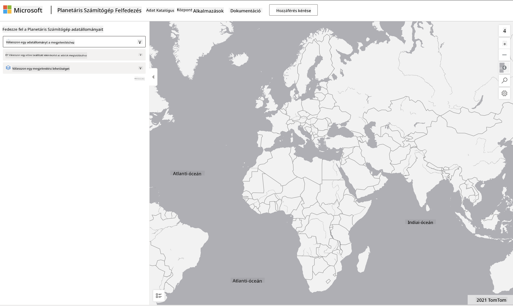

<!--
CO_OP_TRANSLATOR_METADATA:
{
  "original_hash": "d1e05715f9d97de6c4f1fb0c5a4702c0",
  "translation_date": "2025-08-26T15:51:31+00:00",
  "source_file": "6-Data-Science-In-Wild/20-Real-World-Examples/assignment.md",
  "language_code": "hu"
}
-->
# Fedezz fel egy Planetary Computer adatállományt

## Útmutató

Ebben a leckében különböző adat-tudományi alkalmazási területekről beszéltünk – mélyebben belemerülve a kutatás, fenntarthatóság és digitális humán tudományok példáiba. Ebben a feladatban ezek közül az egyik példát fogod részletesebben megvizsgálni, és alkalmazni fogod az adatvizualizációval és elemzéssel kapcsolatos tanulmányaidat, hogy fenntarthatósági adatokból nyerj betekintést.

A [Planetary Computer](https://planetarycomputer.microsoft.com/) projekt adatállományokat és API-kat kínál, amelyekhez fiókkal lehet hozzáférni – kérj hozzáférést, ha szeretnéd kipróbálni a feladat bónusz lépését. Az oldal egy [Explorer](https://planetarycomputer.microsoft.com/explore) funkciót is biztosít, amelyet fiók létrehozása nélkül is használhatsz.

`Lépések:`
Az Explorer felület (az alábbi képernyőképen látható) lehetővé teszi, hogy kiválassz egy adatállományt (a megadott lehetőségek közül), egy előre beállított lekérdezést (az adatok szűrésére), és egy megjelenítési opciót (releváns vizualizáció létrehozására). Ebben a feladatban a következőket kell tenned:

 1. Olvasd el az [Explorer dokumentációját](https://planetarycomputer.microsoft.com/docs/overview/explorer/) – értsd meg a lehetőségeket.
 2. Fedezd fel az adatállományok [katalógusát](https://planetarycomputer.microsoft.com/catalog) – ismerd meg mindegyik célját.
 3. Használd az Explorert – válassz egy érdekes adatállományt, válassz egy releváns lekérdezést és megjelenítési opciót.

`Feladatod:`
Tanulmányozd a böngészőben megjelenített vizualizációt, és válaszolj az alábbiakra:
 * Milyen _jellemzői_ vannak az adatállománynak?
 * Milyen _betekintést_ vagy eredményeket nyújt a vizualizáció?
 * Milyen _következményei_ vannak ezeknek a betekintéseknek a projekt fenntarthatósági céljaira?
 * Milyen _korlátai_ vannak a vizualizációnak (azaz milyen betekintést nem kaptál meg)?
 * Ha hozzáférnél a nyers adatokhoz, milyen _alternatív vizualizációkat_ készítenél, és miért?

`Bónusz pontok:`
Jelentkezz egy fiókra – és lépj be, ha elfogadták.
 * Használd a _Launch Hub_ opciót, hogy megnyisd a nyers adatokat egy Notebookban.
 * Fedezd fel az adatokat interaktívan, és valósítsd meg az általad elképzelt alternatív vizualizációkat.
 * Elemezd az egyedi vizualizációidat – sikerült-e olyan betekintéseket nyerni, amelyeket korábban nem kaptál meg?

## Értékelési szempontok

Kiemelkedő | Megfelelő | Fejlesztésre szorul
--- | --- | -- |
Mind az öt alapvető kérdésre válaszolt. A diák egyértelműen azonosította, hogyan nyújthatnak a jelenlegi és alternatív vizualizációk betekintést a fenntarthatósági célokba vagy eredményekbe. | A diák legalább az első három kérdésre részletesen válaszolt, ami azt mutatja, hogy gyakorlati tapasztalatot szerzett az Explorer használatával. | A diák több kérdésre nem válaszolt, vagy nem adott elegendő részletet – ami arra utal, hogy nem tett jelentős erőfeszítést a projekt elvégzésére. |

---

**Felelősség kizárása**:  
Ez a dokumentum az [Co-op Translator](https://github.com/Azure/co-op-translator) AI fordítási szolgáltatás segítségével lett lefordítva. Bár törekszünk a pontosságra, kérjük, vegye figyelembe, hogy az automatikus fordítások hibákat vagy pontatlanságokat tartalmazhatnak. Az eredeti dokumentum az eredeti nyelvén tekintendő hiteles forrásnak. Kritikus információk esetén javasolt professzionális emberi fordítást igénybe venni. Nem vállalunk felelősséget semmilyen félreértésért vagy téves értelmezésért, amely a fordítás használatából eredhet.