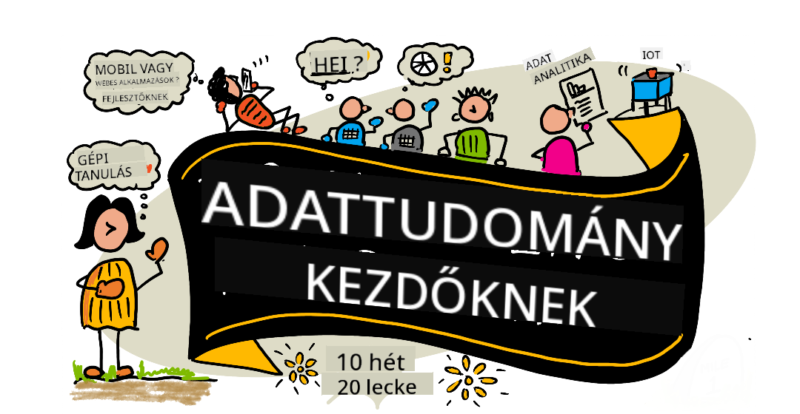

<!--
CO_OP_TRANSLATOR_METADATA:
{
  "original_hash": "210052dafe5b5d956c427824e2c96686",
  "translation_date": "2025-12-19T11:58:23+00:00",
  "source_file": "README.md",
  "language_code": "hu"
}
-->
# Adattudomány kezdőknek - Tanterv

A Microsoft Azure Cloud Advocates örömmel kínál egy 10 hetes, 20 leckéből álló tantervet, amely az adattudományról szól. Minden lecke tartalmaz elő- és utóteszteket, írásos útmutatót a lecke elvégzéséhez, megoldást és feladatot. Projektalapú oktatásunk lehetővé teszi, hogy tanulás közben építs, ami bizonyítottan segíti az új készségek elsajátítását.

**Szívből köszönjük szerzőinknek:** [Jasmine Greenaway](https://www.twitter.com/paladique), [Dmitry Soshnikov](http://soshnikov.com), [Nitya Narasimhan](https://twitter.com/nitya), [Jalen McGee](https://twitter.com/JalenMcG), [Jen Looper](https://twitter.com/jenlooper), [Maud Levy](https://twitter.com/maudstweets), [Tiffany Souterre](https://twitter.com/TiffanySouterre), [Christopher Harrison](https://www.twitter.com/geektrainer).

**🙏 Külön köszönet 🙏 a [Microsoft Student Ambassador](https://studentambassadors.microsoft.com/) szerzőinknek, lektorainknak és tartalomközreműködőinknek,** különösen Aaryan Arora, [Aditya Garg](https://github.com/AdityaGarg00), [Alondra Sanchez](https://www.linkedin.com/in/alondra-sanchez-molina/), [Ankita Singh](https://www.linkedin.com/in/ankitasingh007), [Anupam Mishra](https://www.linkedin.com/in/anupam--mishra/), [Arpita Das](https://www.linkedin.com/in/arpitadas01/), ChhailBihari Dubey, [Dibri Nsofor](https://www.linkedin.com/in/dibrinsofor), [Dishita Bhasin](https://www.linkedin.com/in/dishita-bhasin-7065281bb), [Majd Safi](https://www.linkedin.com/in/majd-s/), [Max Blum](https://www.linkedin.com/in/max-blum-6036a1186/), [Miguel Correa](https://www.linkedin.com/in/miguelmque/), [Mohamma Iftekher (Iftu) Ebne Jalal](https://twitter.com/iftu119), [Nawrin Tabassum](https://www.linkedin.com/in/nawrin-tabassum), [Raymond Wangsa Putra](https://www.linkedin.com/in/raymond-wp/), [Rohit Yadav](https://www.linkedin.com/in/rty2423), Samridhi Sharma, [Sanya Sinha](https://www.linkedin.com/mwlite/in/sanya-sinha-13aab1200),
[Sheena Narula](https://www.linkedin.com/in/sheena-narua-n/), [Tauqeer Ahmad](https://www.linkedin.com/in/tauqeerahmad5201/), Yogendrasingh Pawar , [Vidushi Gupta](https://www.linkedin.com/in/vidushi-gupta07/), [Jasleen Sondhi](https://www.linkedin.com/in/jasleen-sondhi/)

||
|:---:|
| Adattudomány kezdőknek - _Sketchnote [@nitya](https://twitter.com/nitya) tollából_ |

### 🌐 Többnyelvű támogatás

#### GitHub Action által támogatott (Automatizált és mindig naprakész)

<!-- CO-OP TRANSLATOR LANGUAGES TABLE START -->
[Arabic](../ar/README.md) | [Bengali](../bn/README.md) | [Bulgarian](../bg/README.md) | [Burmese (Myanmar)](../my/README.md) | [Chinese (Simplified)](../zh/README.md) | [Chinese (Traditional, Hong Kong)](../hk/README.md) | [Chinese (Traditional, Macau)](../mo/README.md) | [Chinese (Traditional, Taiwan)](../tw/README.md) | [Croatian](../hr/README.md) | [Czech](../cs/README.md) | [Danish](../da/README.md) | [Dutch](../nl/README.md) | [Estonian](../et/README.md) | [Finnish](../fi/README.md) | [French](../fr/README.md) | [German](../de/README.md) | [Greek](../el/README.md) | [Hebrew](../he/README.md) | [Hindi](../hi/README.md) | [Hungarian](./README.md) | [Indonesian](../id/README.md) | [Italian](../it/README.md) | [Japanese](../ja/README.md) | [Kannada](../kn/README.md) | [Korean](../ko/README.md) | [Lithuanian](../lt/README.md) | [Malay](../ms/README.md) | [Malayalam](../ml/README.md) | [Marathi](../mr/README.md) | [Nepali](../ne/README.md) | [Nigerian Pidgin](../pcm/README.md) | [Norwegian](../no/README.md) | [Persian (Farsi)](../fa/README.md) | [Polish](../pl/README.md) | [Portuguese (Brazil)](../br/README.md) | [Portuguese (Portugal)](../pt/README.md) | [Punjabi (Gurmukhi)](../pa/README.md) | [Romanian](../ro/README.md) | [Russian](../ru/README.md) | [Serbian (Cyrillic)](../sr/README.md) | [Slovak](../sk/README.md) | [Slovenian](../sl/README.md) | [Spanish](../es/README.md) | [Swahili](../sw/README.md) | [Swedish](../sv/README.md) | [Tagalog (Filipino)](../tl/README.md) | [Tamil](../ta/README.md) | [Telugu](../te/README.md) | [Thai](../th/README.md) | [Turkish](../tr/README.md) | [Ukrainian](../uk/README.md) | [Urdu](../ur/README.md) | [Vietnamese](../vi/README.md)
<!-- CO-OP TRANSLATOR LANGUAGES TABLE END -->

**Ha további fordítási nyelveket szeretnél támogatni, azok listája [itt található](https://github.com/Azure/co-op-translator/blob/main/getting_started/supported-languages.md)**

#### Csatlakozz közösségünkhöz 

Folyamatban van egy Discord tanulási sorozat AI-val, további információkért és csatlakozáshoz látogass el a [Learn with AI Series](https://aka.ms/learnwithai/discord) oldalra 2025. szeptember 18-30. között. Tippeket és trükköket kapsz a GitHub Copilot adattudományi használatához.

# Diák vagy?

Kezdd az alábbi forrásokkal:

- [Student Hub oldal](https://docs.microsoft.com/en-gb/learn/student-hub?WT.mc_id=academic-77958-bethanycheum) Ezen az oldalon kezdő forrásokat, diákcsomagokat és akár ingyenes tanúsítvány-vouchert is találsz. Ezt az oldalt érdemes könyvjelzőzni és időnként megnézni, mert legalább havonta frissítjük a tartalmat.
- [Microsoft Learn Student Ambassadors](https://studentambassadors.microsoft.com?WT.mc_id=academic-77958-bethanycheum) Csatlakozz egy globális diák nagykövet közösséghez, ez lehet a belépőd a Microsofthoz.

# Kezdés

## 📚 Dokumentáció

- **[Telepítési útmutató](INSTALLATION.md)** - Lépésről lépésre útmutató kezdőknek
- **[Használati útmutató](USAGE.md)** - Példák és gyakori munkafolyamatok
- **[Hibaelhárítás](TROUBLESHOOTING.md)** - Gyakori problémák megoldásai
- **[Hozzájárulási útmutató](CONTRIBUTING.md)** - Hogyan járulhatsz hozzá ehhez a projekthez
- **[Tanárnak](for-teachers.md)** - Oktatási útmutató és osztálytermi források

## 👨‍🎓 Diákoknak
> **Teljesen kezdőknek**: Új vagy az adattudományban? Kezdd a [kezdőbarát példáinkkal](examples/README.md)! Ezek az egyszerű, jól kommentált példák segítenek megérteni az alapokat, mielőtt belevágsz a teljes tantervbe.
> **[Diákok](https://aka.ms/student-page)**: ha egyedül szeretnéd használni ezt a tantervet, forkold a teljes repót, és végezd el a gyakorlatokat egyedül, kezdve egy előadás előtti kvízzel. Ezután olvasd el az előadást és végezd el a többi tevékenységet. Próbáld meg a projekteket a leckék megértésével elkészíteni, ne csak a megoldás kódját másold; azonban ez a kód elérhető a /solutions mappákban minden projektorientált leckénél. Egy másik ötlet, hogy barátokkal tanulócsoportot alakítotok és együtt mentek végig a tartalmon. További tanuláshoz ajánljuk a [Microsoft Learn](https://docs.microsoft.com/en-us/users/jenlooper-2911/collections/qprpajyoy3x0g7?WT.mc_id=academic-77958-bethanycheum) platformot.

**Gyors kezdés:**
1. Nézd meg a [Telepítési útmutatót](INSTALLATION.md) a környezet beállításához
2. Tekintsd át a [Használati útmutatót](USAGE.md), hogy megtanuld a tanterv használatát
3. Kezdd az 1. leckével és haladj sorban
4. Csatlakozz a [Discord közösségünkhöz](https://aka.ms/ds4beginners/discord) támogatásért

## 👩‍🏫 Tanároknak

> **Tanárok**: [tartalmazunk néhány javaslatot](for-teachers.md) a tanterv használatához. Szívesen fogadjuk visszajelzéseiteket [a vitafórumunkon](https://github.com/microsoft/Data-Science-For-Beginners/discussions)!

## Ismerd meg a csapatot

**Gif készítője:** [Mohit Jaisal](https://www.linkedin.com/in/mohitjaisal)
> 🎥 Kattints a fenti képre egy videóért a projektről és az alkotóiról!

## Pedagógia

Két pedagógiai alapelvet választottunk a tananyag összeállításakor: biztosítani, hogy projektalapú legyen, és hogy gyakori kvízeket tartalmazzon. A sorozat végére a tanulók elsajátítják az adattudomány alapelveit, beleértve az etikai fogalmakat, az adatelőkészítést, az adatokkal való különböző munkamódokat, az adatvizualizációt, az adatelemzést, az adattudomány valós használati eseteit és még sok mást.

Ezen felül egy alacsony tétű kvíz az óra előtt beállítja a tanuló szándékát a téma elsajátítására, míg egy második kvíz az óra után biztosítja a további megtartást. Ez a tananyag rugalmas és szórakoztató, egészben vagy részben is elvégezhető. A projektek kicsiben kezdődnek, és a 10 hetes ciklus végére egyre összetettebbé válnak.

> Találd meg a [Magatartási Kódexünket](CODE_OF_CONDUCT.md), a [Hozzájárulási](CONTRIBUTING.md), és a [Fordítási](TRANSLATIONS.md) irányelveket. Várjuk építő jellegű visszajelzéseidet!

## Minden leckéhez tartozik:

- Opcionális vázlatjegyzet
- Opcionális kiegészítő videó
- Óra előtti bemelegítő kvíz
- Írott lecke
- Projektalapú leckékhez lépésről lépésre útmutatók a projekt elkészítéséhez
- Tudásellenőrzések
- Egy kihívás
- Kiegészítő olvasmány
- Feladat
- [Óra utáni kvíz](https://ff-quizzes.netlify.app/en/)

> **Megjegyzés a kvízekről**: Minden kvíz a Quiz-App mappában található, összesen 40 kvíz három kérdéssel. Ezek a leckékből vannak linkelve, de a kvíz alkalmazás helyileg is futtatható vagy Azure-ra telepíthető; kövesd az utasításokat a `quiz-app` mappában. Fokozatosan lokalizálódnak.

## 🎓 Kezdőknek szóló példák

**Új vagy az Adattudományban?** Készítettünk egy különleges [példakönyvtárat](examples/README.md) egyszerű, jól kommentált kódokkal, hogy segítsünk elindulni:

- 🌟 **Hello World** - Az első adattudományi programod
- 📂 **Adatok betöltése** - Tanulj meg adatokat olvasni és felfedezni
- 📊 **Egyszerű elemzés** - Statisztikák számítása és minták keresése
- 📈 **Alapvető vizualizáció** - Diagramok és grafikonok készítése
- 🔬 **Valós projekt** - Teljes munkafolyamat az elejétől a végéig

Minden példa részletes kommentárokat tartalmaz, amelyek minden lépést elmagyaráznak, így tökéletesek abszolút kezdőknek!

👉 **[Kezdd a példákkal](examples/README.md)** 👈

## Leckék

||
|:---:|
| Adattudomány kezdőknek: Útvonalterv - _Vázlatjegyzet [@nitya](https://twitter.com/nitya) tollából_ |

| Lecke száma | Téma | Lecke csoportosítás | Tanulási célok | Linkelt lecke | Szerző |
| :-----------: | :----------------------------------------: | :--------------------------------------------------: | :-----------------------------------------------------------------------------------------------------------------------------------------------------------------------: | :---------------------------------------------------------------------: | :----: |
| 01 | Az adattudomány meghatározása | [Bevezetés](1-Introduction/README.md) | Ismerd meg az adattudomány alapfogalmait és kapcsolatát a mesterséges intelligenciával, gépi tanulással és a big datával. | [lecke](1-Introduction/01-defining-data-science/README.md) [videó](https://youtu.be/beZ7Mb_oz9I) | [Dmitry](http://soshnikov.com) |
| 02 | Adattudományi etika | [Bevezetés](1-Introduction/README.md) | Az adat-etika fogalmai, kihívásai és keretrendszerei. | [lecke](1-Introduction/02-ethics/README.md) | [Nitya](https://twitter.com/nitya) |
| 03 | Az adatok meghatározása | [Bevezetés](1-Introduction/README.md) | Hogyan osztályozzák az adatokat és azok gyakori forrásai. | [lecke](1-Introduction/03-defining-data/README.md) | [Jasmine](https://www.twitter.com/paladique) |
| 04 | Bevezetés a statisztikába és valószínűségszámításba | [Bevezetés](1-Introduction/README.md) | A valószínűség és statisztika matematikai módszerei az adatok megértéséhez. | [lecke](1-Introduction/04-stats-and-probability/README.md) [videó](https://youtu.be/Z5Zy85g4Yjw) | [Dmitry](http://soshnikov.com) |
| 05 | Munkavégzés relációs adatokkal | [Adatokkal való munka](2-Working-With-Data/README.md) | Bevezetés a relációs adatokba és az alapok a relációs adatok felfedezéséhez és elemzéséhez a Strukturált Lekérdező Nyelvvel, azaz SQL-lel (kiejtve „esz-kju-el”). | [lecke](2-Working-With-Data/05-relational-databases/README.md) | [Christopher](https://www.twitter.com/geektrainer) | | |
| 06 | Munkavégzés NoSQL adatokkal | [Adatokkal való munka](2-Working-With-Data/README.md) | Bevezetés a nem relációs adatokba, azok különböző típusai és az alapok a dokumentum adatbázisok felfedezéséhez és elemzéséhez. | [lecke](2-Working-With-Data/06-non-relational/README.md) | [Jasmine](https://twitter.com/paladique)|
| 07 | Munkavégzés Python-nal | [Adatokkal való munka](2-Working-With-Data/README.md) | A Python használatának alapjai az adatok felfedezéséhez olyan könyvtárakkal, mint a Pandas. Alapvető Python programozási ismeretek ajánlottak. | [lecke](2-Working-With-Data/07-python/README.md) [videó](https://youtu.be/dZjWOGbsN4Y) | [Dmitry](http://soshnikov.com) |
| 08 | Adatelőkészítés | [Adatokkal való munka](2-Working-With-Data/README.md) | Adattisztítási és átalakítási technikák a hiányzó, pontatlan vagy hiányos adatok kezelésére. | [lecke](2-Working-With-Data/08-data-preparation/README.md) | [Jasmine](https://www.twitter.com/paladique) |
| 09 | Mennyiségek vizualizálása | [Adatvizualizáció](3-Data-Visualization/README.md) | Tanuld meg, hogyan használd a Matplotlib-et madáradatok vizualizálására 🦆 | [lecke](3-Data-Visualization/09-visualization-quantities/README.md) | [Jen](https://twitter.com/jenlooper) |
| 10 | Adatok eloszlásának vizualizálása | [Adatvizualizáció](3-Data-Visualization/README.md) | Megfigyelések és trendek vizualizálása egy intervallumon belül. | [lecke](3-Data-Visualization/10-visualization-distributions/README.md) | [Jen](https://twitter.com/jenlooper) |
| 11 | Arányok vizualizálása | [Adatvizualizáció](3-Data-Visualization/README.md) | Diszkrét és csoportosított százalékok vizualizálása. | [lecke](3-Data-Visualization/11-visualization-proportions/README.md) | [Jen](https://twitter.com/jenlooper) |
| 12 | Kapcsolatok vizualizálása | [Adatvizualizáció](3-Data-Visualization/README.md) | Kapcsolatok és korrelációk vizualizálása adathalmazok és változóik között. | [lecke](3-Data-Visualization/12-visualization-relationships/README.md) | [Jen](https://twitter.com/jenlooper) |
| 13 | Értelmes vizualizációk | [Adatvizualizáció](3-Data-Visualization/README.md) | Technikák és útmutatás, hogy vizualizációid értékesek legyenek a hatékony problémamegoldáshoz és betekintésekhez. | [lecke](3-Data-Visualization/13-meaningful-visualizations/README.md) | [Jen](https://twitter.com/jenlooper) |
| 14 | Bevezetés az adattudományi életciklusba | [Életciklus](4-Data-Science-Lifecycle/README.md) | Bevezetés az adattudományi életciklusba és az első lépésbe, az adatok beszerzésébe és kinyerésébe. | [lecke](4-Data-Science-Lifecycle/14-Introduction/README.md) | [Jasmine](https://twitter.com/paladique) |
| 15 | Elemzés | [Életciklus](4-Data-Science-Lifecycle/README.md) | Az adattudományi életciklus ezen szakasza az adatok elemzésére fókuszál. | [lecke](4-Data-Science-Lifecycle/15-analyzing/README.md) | [Jasmine](https://twitter.com/paladique) | | |
| 16 | Kommunikáció | [Életciklus](4-Data-Science-Lifecycle/README.md) | Az adattudományi életciklus ezen szakasza az adatokból származó betekintések bemutatására fókuszál úgy, hogy a döntéshozók könnyebben megértsék azokat. | [lecke](4-Data-Science-Lifecycle/16-communication/README.md) | [Jalen](https://twitter.com/JalenMcG) | | |
| 17 | Adattudomány a felhőben | [Felhőadatok](5-Data-Science-In-Cloud/README.md) | Ez a leckesorozat bevezeti az adattudományt a felhőben és annak előnyeit. | [lecke](5-Data-Science-In-Cloud/17-Introduction/README.md) | [Tiffany](https://twitter.com/TiffanySouterre) és [Maud](https://twitter.com/maudstweets) |
| 18 | Adattudomány a felhőben | [Felhőadatok](5-Data-Science-In-Cloud/README.md) | Modellek képzése Low Code eszközökkel. |[lecke](5-Data-Science-In-Cloud/18-Low-Code/README.md) | [Tiffany](https://twitter.com/TiffanySouterre) és [Maud](https://twitter.com/maudstweets) |
| 19 | Adattudomány a felhőben | [Felhőadatok](5-Data-Science-In-Cloud/README.md) | Modellek telepítése az Azure Machine Learning Studio-val. | [lecke](5-Data-Science-In-Cloud/19-Azure/README.md)| [Tiffany](https://twitter.com/TiffanySouterre) és [Maud](https://twitter.com/maudstweets) |
| 20 | Adattudomány a valóságban | [A vadonban](6-Data-Science-In-Wild/README.md) | Adattudomány által vezérelt projektek a való életben. | [lecke](6-Data-Science-In-Wild/20-Real-World-Examples/README.md) | [Nitya](https://twitter.com/nitya) |

## GitHub Codespaces

Kövesd az alábbi lépéseket, hogy megnyisd ezt a mintát egy Codespace-ben:
1. Kattints a Code legördülő menüre, és válaszd az Open with Codespaces opciót.
2. Válaszd a + New codespace lehetőséget az ablak alján.
További információért nézd meg a [GitHub dokumentációt](https://docs.github.com/en/codespaces/developing-in-codespaces/creating-a-codespace-for-a-repository#creating-a-codespace).

## VSCode Remote - Containers
Kövesd az alábbi lépéseket, hogy megnyisd ezt a repót egy konténerben a helyi gépeden és a VSCode segítségével a VS Code Remote - Containers kiterjesztéssel:

1. Ha először használsz fejlesztői konténert, győződj meg róla, hogy a rendszered megfelel az előfeltételeknek (pl. telepítve van a Docker) a [kezdő dokumentációban](https://code.visualstudio.com/docs/devcontainers/containers#_getting-started).

A repó használatához megnyithatod a repót egy izolált Docker kötetben:

**Megjegyzés**: A háttérben a Remote-Containers: **Clone Repository in Container Volume...** parancsot használja, hogy a forráskódot egy Docker kötetbe klónozza a helyi fájlrendszer helyett. A [kötetek](https://docs.docker.com/storage/volumes/) a preferált mechanizmusok a konténeradatok megőrzésére.

Vagy megnyithatsz egy helyileg klónozott vagy letöltött verziót a repóból:

- Klónozd ezt a repót a helyi fájlrendszeredre.
- Nyomd meg az F1-et, és válaszd a **Remote-Containers: Open Folder in Container...** parancsot.
- Válaszd ki a klónozott mappát, várd meg, míg elindul a konténer, és próbáld ki.

## Offline hozzáférés

Ezt a dokumentációt offline is futtathatod a [Docsify](https://docsify.js.org/#/) használatával. Forkold ezt a repót, [telepítsd a Docsify-t](https://docsify.js.org/#/quickstart) a helyi gépeden, majd a repó gyökérmappájában írd be, hogy `docsify serve`. A weboldal a 3000-es porton lesz elérhető a localhostodon: `localhost:3000`.

> Megjegyzés: a jegyzetfüzetek nem jelennek meg Docsify-val, így ha jegyzetfüzetet kell futtatnod, azt külön tedd meg VS Code-ban Python kernel futtatásával.

## Egyéb tananyagok

Csapatunk más tananyagokat is készít! Nézd meg:

<!-- CO-OP TRANSLATOR OTHER COURSES START -->
### LangChain

---

### Azure / Edge / MCP / Agents

---
 
### Generatív AI sorozat

[-9333EA?style=for-the-badge&labelColor=E5E7EB&color=9333EA)](https://github.com/microsoft/Generative-AI-for-beginners-dotnet?WT.mc_id=academic-105485-koreyst)
[-C084FC?style=for-the-badge&labelColor=E5E7EB&color=C084FC)](https://github.com/microsoft/generative-ai-for-beginners-java?WT.mc_id=academic-105485-koreyst)
[-E879F9?style=for-the-badge&labelColor=E5E7EB&color=E879F9)](https://github.com/microsoft/generative-ai-with-javascript?WT.mc_id=academic-105485-koreyst)

---
 
### Alapvető tanulás

---
 
### Copilot sorozat

<!-- CO-OP TRANSLATOR OTHER COURSES END -->

## Segítségkérés

**Problémába ütköztél?** Nézd meg a [Hibaelhárítási útmutatónkat](TROUBLESHOOTING.md), ahol gyakori problémák megoldásait találod.

Ha elakadsz vagy kérdésed van az AI alkalmazások fejlesztésével kapcsolatban, csatlakozz a többi tanulóhoz és tapasztalt fejlesztőhöz az MCP-vel kapcsolatos beszélgetésekben. Ez egy támogató közösség, ahol a kérdések szívesen fogadottak és a tudás szabadon megosztott.

Ha termék visszajelzésed vagy hibákba ütközöl fejlesztés közben, látogass el ide:

---

<!-- CO-OP TRANSLATOR DISCLAIMER START -->
**Jogi nyilatkozat**:
Ezt a dokumentumot az AI fordító szolgáltatás, a [Co-op Translator](https://github.com/Azure/co-op-translator) segítségével fordítottuk le. Bár a pontosságra törekszünk, kérjük, vegye figyelembe, hogy az automatikus fordítások hibákat vagy pontatlanságokat tartalmazhatnak. Az eredeti dokumentum az anyanyelvén tekintendő hiteles forrásnak. Fontos információk esetén szakmai, emberi fordítást javaslunk. Nem vállalunk felelősséget a fordítás használatából eredő félreértésekért vagy félreértelmezésekért.
<!-- CO-OP TRANSLATOR DISCLAIMER END -->