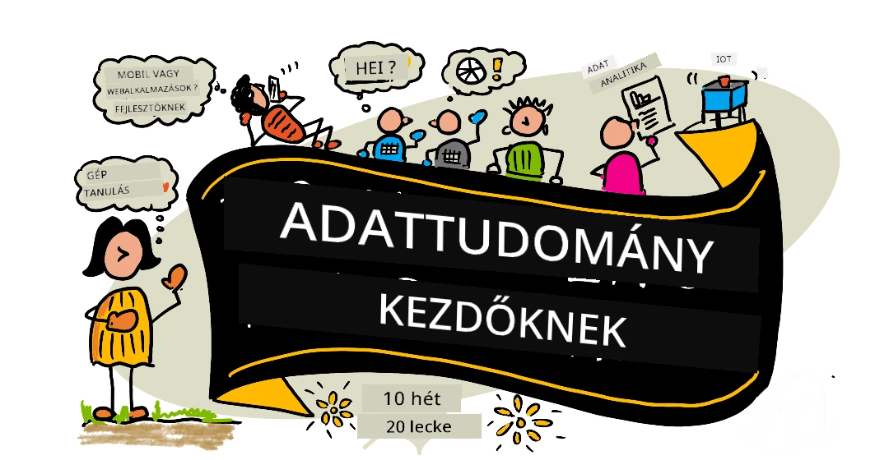
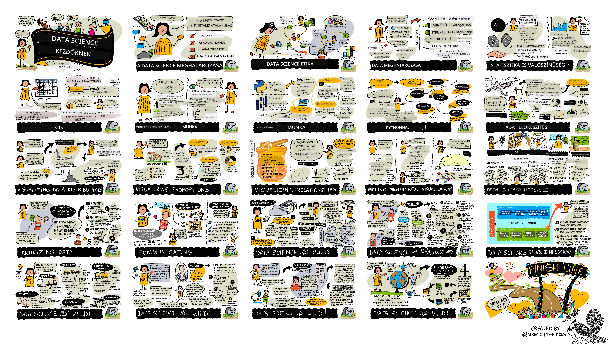

# Data Science kezdőknek - Egy tanterv

[](https://github.com/codespaces/new?hide_repo_select=true&ref=main&repo=344191198)

[](https://github.com/microsoft/Data-Science-For-Beginners/blob/master/LICENSE)
[](https://GitHub.com/microsoft/Data-Science-For-Beginners/graphs/contributors/)
[](https://GitHub.com/microsoft/Data-Science-For-Beginners/issues/)
[](https://GitHub.com/microsoft/Data-Science-For-Beginners/pulls/)
[](http://makeapullrequest.com)

[](https://GitHub.com/microsoft/Data-Science-For-Beginners/watchers/)
[](https://GitHub.com/microsoft/Data-Science-For-Beginners/network/)
[](https://GitHub.com/microsoft/Data-Science-For-Beginners/stargazers/)


[](https://discord.gg/nTYy5BXMWG)

[](https://aka.ms/foundry/forum)

A Microsoft Azure Cloud Advocates örömmel kínál egy 10 hetes, 20 leckéből álló tananyagot, amely teljes egészében az Adattudományról szól. Minden lecke tartalmaz előtti és utáni kvízeket, írott utasításokat a lecke elvégzéséhez, megoldást, és egy házi feladatot. Projekt-alapú oktatásunk lehetővé teszi, hogy tanulj miközben építesz, ami bizonyítottan segít az új készségek megtartásában.

**Őszinte köszönet szerzőinknek:** [Jasmine Greenaway](https://www.twitter.com/paladique), [Dmitry Soshnikov](http://soshnikov.com), [Nitya Narasimhan](https://twitter.com/nitya), [Jalen McGee](https://twitter.com/JalenMcG), [Jen Looper](https://twitter.com/jenlooper), [Maud Levy](https://twitter.com/maudstweets), [Tiffany Souterre](https://twitter.com/TiffanySouterre), [Christopher Harrison](https://www.twitter.com/geektrainer).

**🙏 Külön köszönet 🙏 a [Microsoft Student Ambassador](https://studentambassadors.microsoft.com/) szerzőinknek, értékelőinknek és tartalomközreműködőinknek,** nevezetesen Aaryan Arora, [Aditya Garg](https://github.com/AdityaGarg00), [Alondra Sanchez](https://www.linkedin.com/in/alondra-sanchez-molina/), [Ankita Singh](https://www.linkedin.com/in/ankitasingh007), [Anupam Mishra](https://www.linkedin.com/in/anupam--mishra/), [Arpita Das](https://www.linkedin.com/in/arpitadas01/), ChhailBihari Dubey, [Dibri Nsofor](https://www.linkedin.com/in/dibrinsofor), [Dishita Bhasin](https://www.linkedin.com/in/dishita-bhasin-7065281bb), [Majd Safi](https://www.linkedin.com/in/majd-s/), [Max Blum](https://www.linkedin.com/in/max-blum-6036a1186/), [Miguel Correa](https://www.linkedin.com/in/miguelmque/), [Mohamma Iftekher (Iftu) Ebne Jalal](https://twitter.com/iftu119), [Nawrin Tabassum](https://www.linkedin.com/in/nawrin-tabassum), [Raymond Wangsa Putra](https://www.linkedin.com/in/raymond-wp/), [Rohit Yadav](https://www.linkedin.com/in/rty2423), Samridhi Sharma, [Sanya Sinha](https://www.linkedin.com/mwlite/in/sanya-sinha-13aab1200),
[Sheena Narula](https://www.linkedin.com/in/sheena-narua-n/), [Tauqeer Ahmad](https://www.linkedin.com/in/tauqeerahmad5201/), Yogendrasingh Pawar , [Vidushi Gupta](https://www.linkedin.com/in/vidushi-gupta07/), [Jasleen Sondhi](https://www.linkedin.com/in/jasleen-sondhi/)

||
|:---:|
| Adattudomány kezdőknek - _Sketchnote [@nitya](https://twitter.com/nitya) tollából_ |

### 🌐 Többnyelvű támogatás

#### GitHub Action által támogatott (Automatizált & Mindig naprakész)

<!-- CO-OP TRANSLATOR LANGUAGES TABLE START -->
[Arab](../ar/README.md) | [Bengáli](../bn/README.md) | [Bolgár](../bg/README.md) | [Burmai (Mianmar)](../my/README.md) | [Kínai (egyszerűsített)](../zh-CN/README.md) | [Kínai (hagyományos, Hongkong)](../zh-HK/README.md) | [Kínai (hagyományos, Makaó)](../zh-MO/README.md) | [Kínai (hagyományos, Tajvan)](../zh-TW/README.md) | [Horvát](../hr/README.md) | [Cseh](../cs/README.md) | [Dán](../da/README.md) | [Holland](../nl/README.md) | [Észt](../et/README.md) | [Finn](../fi/README.md) | [Francia](../fr/README.md) | [Német](../de/README.md) | [Görög](../el/README.md) | [Héber](../he/README.md) | [Hindi](../hi/README.md) | [Magyar](./README.md) | [Indonéz](../id/README.md) | [Olasz](../it/README.md) | [Japán](../ja/README.md) | [Kannada](../kn/README.md) | [Khmer](../km/README.md) | [Koreai](../ko/README.md) | [Litván](../lt/README.md) | [Maláj](../ms/README.md) | [Malayalam](../ml/README.md) | [Marathi](../mr/README.md) | [Nepáli](../ne/README.md) | [Nigériai Pidgin](../pcm/README.md) | [Norvég](../no/README.md) | [Perzsa (Farsi)](../fa/README.md) | [Lengyel](../pl/README.md) | [Portugál (Brazília)](../pt-BR/README.md) | [Portugál (Portugália)](../pt-PT/README.md) | [Pandzsábi (Gurmukhi)](../pa/README.md) | [Román](../ro/README.md) | [Orosz](../ru/README.md) | [Szerb (cirill)](../sr/README.md) | [Szlovák](../sk/README.md) | [Szlovén](../sl/README.md) | [Spanyol](../es/README.md) | [Szuahéli](../sw/README.md) | [Svéd](../sv/README.md) | [Tagalog (filippínó)](../tl/README.md) | [Tamil](../ta/README.md) | [Telugu](../te/README.md) | [Thai](../th/README.md) | [Török](../tr/README.md) | [Ukrán](../uk/README.md) | [Urdu](../ur/README.md) | [Vietnamita](../vi/README.md)

> **Szeretnéd inkább helyben klónozni?**
>
> Ez a tároló több mint 50 nyelvű fordítást tartalmaz, ami jelentősen megnöveli a letöltési méretet. Ha a fordítások nélkül szeretnéd klónozni, használd a sparse checkout-ot:
>
> **Bash / macOS / Linux:**
> ```bash
> git clone --filter=blob:none --sparse https://github.com/microsoft/Data-Science-For-Beginners.git
> cd Data-Science-For-Beginners
> git sparse-checkout set --no-cone '/*' '!translations' '!translated_images'
> ```
>
> **CMD (Windows):**
> ```cmd
> git clone --filter=blob:none --sparse https://github.com/microsoft/Data-Science-For-Beginners.git
> cd Data-Science-For-Beginners
> git sparse-checkout set --no-cone "/*" "!translations" "!translated_images"
> ```
>
> Ez mindent megad, amire a kurzushoz szükséged van, jóval gyorsabb letöltéssel.
<!-- CO-OP TRANSLATOR LANGUAGES TABLE END -->

**Ha szeretnél további támogatott nyelveket hozzáadni, megtalálhatók [itt](https://github.com/Azure/co-op-translator/blob/main/getting_started/supported-languages.md)**

#### Csatlakozz közösségünkhöz 
[](https://discord.gg/nTYy5BXMWG)

Folyamatban van egy Discord "Tanulj mesterséges intelligenciával" sorozatunk, tudj meg többet és csatlakozz hozzánk a [Tanulj mesterséges intelligenciával sorozatban](https://aka.ms/learnwithai/discord) 2025. szeptember 18-30 között. Tippeket és trükköket kapsz a GitHub Copilot adattudományos felhasználásához.


# Diák vagy?

Kezdd az alábbi erőforrásokkal:

- [Diák Hub oldal](https://docs.microsoft.com/en-gb/learn/student-hub?WT.mc_id=academic-77958-bethanycheum) Ezen az oldalon kezdő erőforrásokat, Diák csomagokat és ingyenes tanúsítvány-kuponokat találsz. Érdemes ezt az oldalt elmenteni, és időről időre visszanézni, mivel havonta frissítjük a tartalmat.
- [Microsoft Learn Student Ambassadors](https://studentambassadors.microsoft.com?WT.mc_id=academic-77958-bethanycheum) Csatlakozz a globális diák nagykövet közösséghez, ez lehet az utad a Microsoft-hoz.

# Kezdés

## 📚 Dokumentáció

- **[Telepítési útmutató](INSTALLATION.md)** - Lépésről lépésre telepítési instrukciók kezdőknek
- **[Használati útmutató](USAGE.md)** - Példák és gyakori munkafolyamatok
- **[Hibaelhárítás](TROUBLESHOOTING.md)** - Gyakori problémák megoldásai
- **[Hozzájárulási útmutató](CONTRIBUTING.md)** - Hogyan járulj hozzá ehhez a projekthez
- **[Tanároknak](for-teachers.md)** - Oktatási irányelvek és osztálytermi anyagok

## 👨‍🎓 Diákoknak
> **Teljesen kezdőknek**: Új vagy az adattudományban? Kezdd el a [kezdőbarát példáinkkal](examples/README.md)! Ezek az egyszerű, jól kommentált példák segítenek megérteni az alapokat, mielőtt belemennél az egész tantervbe.
> **[Diákok](https://aka.ms/student-page)**: hogy saját magad használd ezt a tananyagot, forkolj le az egész repót, és dolgozd végig a feladatokat önállóan, először a bevezető kvízzel. Olvasd el az előadást, majd végezd el a többi tevékenységet. Próbálj meg tanulás közben megalkotni projekteket, ne csak másold a megoldások kódját; ezek a kódok azonban elérhetők megoldásként az egyes projekt-orientált leckék /solutions mappáiban. Egy másik ötlet, hogy hozz létre egy tanulócsoportot barátokkal, és együtt haladjatok át a tartalmon. További tanuláshoz ajánljuk a [Microsoft Learnt](https://docs.microsoft.com/en-us/users/jenlooper-2911/collections/qprpajyoy3x0g7?WT.mc_id=academic-77958-bethanycheum).

**Gyors indulás:**
1. Nézd meg a [Telepítési útmutatót](INSTALLATION.md) a környezeted beállításához
2. Tanulmányozd a [Használati útmutatót](USAGE.md) a tananyag kezeléséhez
3. Kezdd az 1. leckével és haladj sorrendben
4. Csatlakozz [Discord közösségünkhöz](https://aka.ms/ds4beginners/discord) támogatásért

## 👩‍🏫 Tanároknak
> **Tanárok**: [tartalmaztunk néhány javaslatot](for-teachers.md) arra vonatkozóan, hogyan használhatják ezt a tantervet. Nagyon várjuk visszajelzéseiket [a vitafórumunkon](https://github.com/microsoft/Data-Science-For-Beginners/discussions)!

## Ismerd meg a Csapatot

[](https://youtu.be/8mzavjQSMM4 "Promóciós videó")

**Gif készítője:** [Mohit Jaisal](https://www.linkedin.com/in/mohitjaisal)

> 🎥 Kattints a fenti képre, hogy megnézz egy videót a projektről és a készítőcsapatról!

## Pedagógia

Ennek a tantervnek a felépítésekor két pedagógiai alapelvet választottunk: garantálni, hogy projektalapú legyen, és belefoglalni gyakori kvízeket. A sorozat végére a hallgatók elsajátítják az adattudomány alapelveit, beleértve az etikai fogalmakat, az adatelőkészítést, az adatokkal való különböző munkamódszereket, adatvizualizációt, adat elemzést, az adattudomány valós használati eseteit és még sok mást.

Emellett egy alacsony tétű kvíz az óra előtt a tanuló tanulási szándékát állítja be a témára, míg az óra utáni második kvíz további megőrzést biztosít. A tanterv rugalmas és szórakoztató, egészében vagy részleteiben is végezhető. A projektek kezdetben kicsik, és a 10 hetes ciklus végére egyre összetettebbek lesznek.

> Tekintsd meg [Magatartási Kódexünket](CODE_OF_CONDUCT.md), [Hozzájárulás](CONTRIBUTING.md), [Fordítás](TRANSLATIONS.md) útmutatóinkat. Várjuk építő jellegű visszajelzéseiteket!

## Minden óra tartalmazza:

- Választható skiccjegyzetet
- Választható kiegészítő videót
- Óra előtti bemelegítő kvízt
- Írásos órát
- Projektalapú órákhoz lépésről lépésre útmutatót a projekt építéséhez
- Tudásellenőrzéseket
- Egy kihívást
- Kiegészítő olvasmányt
- Feladatot
- [Óra utáni kvízt](https://ff-quizzes.netlify.app/en/)

> **Megjegyzés a kvízekhez**: Minden kvíz a Quiz-App mappában található, összesen 40 kvíz három kérdéssel mindegyikben. Az órákból vannak linkelve, de a kvíz app helyileg futtatható vagy Azure-ra telepíthető; kövesd az utasításokat a `quiz-app` mappában. Fokozatosan lokalizálják őket.

## 🎓 Kezdőbarát példák

**Új vagy az adattudományban?** Különleges [példakönyvtárat](examples/README.md) hoztunk létre egyszerű, jól kommentált kódokkal, hogy segítsünk elkezdeni:

- 🌟 **Hello World** - Az első adat tudomány programod
- 📂 **Adatok betöltése** - Tanuld meg az adatkészletek olvasását és felfedezését
- 📊 **Egyszerű elemzés** - Statisztikák számítása és minták keresése
- 📈 **Alapvető vizualizáció** - Diagramok és grafikonok készítése
- 🔬 **Valós világ projekt** - Teljes munkafolyamat az elejétől a végéig

Minden példa részletes megjegyzéseket tartalmaz, amelyek minden lépést elmagyaráznak, így tökéletes abszolút kezdőknek!

👉 **[Kezdd a példákkal](examples/README.md)** 👈

## Órák


||
|:---:|
| Adattudomány kezdőknek: Útvonalterv - _Skiccjegyzet [@nitya](https://twitter.com/nitya) által_ |


| Óra szám | Téma | Órafoglalás | Tanulási célok | Linkelt óra | Szerző |
| :-------: | :----------------------------------------: | :--------------------------------------------------: | :-----------------------------------------------------------------------------------------------------------------------------------------------------------------------: | :---------------------------------------------------------------------: | :----: |
| 01 | Az adattudomány meghatározása | [Bevezetés](1-Introduction/README.md) | Ismerd meg az adattudomány alapfogalmait, és hogy miként kapcsolódik a mesterséges intelligenciához, gépi tanuláshoz és nagy adatokhoz. | [óra](1-Introduction/01-defining-data-science/README.md) [videó](https://youtu.be/beZ7Mb_oz9I) | [Dmitry](http://soshnikov.com) |
| 02 | Adattudományi etika | [Bevezetés](1-Introduction/README.md) | Az adat etika fogalmai, kihívásai és keretrendszerei. | [óra](1-Introduction/02-ethics/README.md) | [Nitya](https://twitter.com/nitya) |
| 03 | Az adatok meghatározása | [Bevezetés](1-Introduction/README.md) | Hogyan osztályozzuk az adatokat és azok gyakori forrásai. | [óra](1-Introduction/03-defining-data/README.md) | [Jasmine](https://www.twitter.com/paladique) |
| 04 | Bevezetés a statisztikába és valószínűségszámításba | [Bevezetés](1-Introduction/README.md) | Valószínűség- és statisztikai matematikai technikák az adatok megértéséhez. | [óra](1-Introduction/04-stats-and-probability/README.md) [videó](https://youtu.be/Z5Zy85g4Yjw) | [Dmitry](http://soshnikov.com) |
| 05 | Relációs adatokkal való munka | [Adatokkal való munka](2-Working-With-Data/README.md) | Bevezetés a relációs adatbázisokba és az alapok az adatok felfedezéséhez és elemzéséhez a Strukturált Lekérdező Nyelvvel, más néven SQL-lel (ejtsd: „szíkell”). | [óra](2-Working-With-Data/05-relational-databases/README.md) | [Christopher](https://www.twitter.com/geektrainer) |
| 06 | Nem relációs adatokkal való munka | [Adatokkal való munka](2-Working-With-Data/README.md) | Bevezetés a nem relációs adatokba, különféle típusaik és az alapok a dokumentum adatbázisok felfedezéséhez és elemzéséhez. | [óra](2-Working-With-Data/06-non-relational/README.md) | [Jasmine](https://twitter.com/paladique) |
| 07 | Python használata | [Adatokkal való munka](2-Working-With-Data/README.md) | Python használatának alapjai az adatok felfedezéséhez olyan könyvtárakkal, mint a Pandas. Ajánlott a Python programozás alapjainak ismerete. | [óra](2-Working-With-Data/07-python/README.md) [videó](https://youtu.be/dZjWOGbsN4Y) | [Dmitry](http://soshnikov.com) |
| 08 | Adatelőkészítés | [Adatokkal való munka](2-Working-With-Data/README.md) | Témák az adattisztítás és átalakítás technikáiról, hogy kezelni lehessen a hiányzó, pontatlan vagy hiányos adatokat. | [óra](2-Working-With-Data/08-data-preparation/README.md) | [Jasmine](https://www.twitter.com/paladique) |
| 09 | Mennyiségek vizualizálása | [Adatvizualizáció](3-Data-Visualization/README.md) | Tanulj meg Matplotlib-pel vizualizálni madáradatokat 🦆 | [óra](3-Data-Visualization/09-visualization-quantities/README.md) | [Jen](https://twitter.com/jenlooper) |
| 10 | Az adatok eloszlásának vizualizálása | [Adatvizualizáció](3-Data-Visualization/README.md) | Megfigyelések és trendek vizualizációja egy intervallumon belül. | [óra](3-Data-Visualization/10-visualization-distributions/README.md) | [Jen](https://twitter.com/jenlooper) |
| 11 | Arányok vizualizálása | [Adatvizualizáció](3-Data-Visualization/README.md) | Diszkrét és csoportos százalékok vizualizálása. | [óra](3-Data-Visualization/11-visualization-proportions/README.md) | [Jen](https://twitter.com/jenlooper) |
| 12 | Kapcsolatok vizualizálása | [Adatvizualizáció](3-Data-Visualization/README.md) | Kapcsolatok és korrelációk vizualizálása különböző adatkészletek és változóik között. | [óra](3-Data-Visualization/12-visualization-relationships/README.md) | [Jen](https://twitter.com/jenlooper) |
| 13 | Értelmes vizualizációk | [Adatvizualizáció](3-Data-Visualization/README.md) | Technikák és útmutató a vizualizációk értékessé tételéhez a hatékony problémamegoldás és betekintés érdekében. | [óra](3-Data-Visualization/13-meaningful-visualizations/README.md) | [Jen](https://twitter.com/jenlooper) |
| 14 | Bevezetés az adattudomány életciklusába | [Életciklus](4-Data-Science-Lifecycle/README.md) | Bevezetés az adattudomány életciklusába és az adatgyűjtés, adatkinyerés első lépésébe. | [óra](4-Data-Science-Lifecycle/14-Introduction/README.md) | [Jasmine](https://twitter.com/paladique) |
| 15 | Elemzés | [Életciklus](4-Data-Science-Lifecycle/README.md) | Az adattudomány életciklusának ezen szakasza az adatok elemzésére koncentrál. | [óra](4-Data-Science-Lifecycle/15-analyzing/README.md) | [Jasmine](https://twitter.com/paladique) |
| 16 | Kommunikáció | [Életciklus](4-Data-Science-Lifecycle/README.md) | Az adattudomány életciklusának ezen szakasza az adatból származó betekintések bemutatására összpontosít úgy, hogy azt a döntéshozók könnyebben megérthessék. | [óra](4-Data-Science-Lifecycle/16-communication/README.md) | [Jalen](https://twitter.com/JalenMcG) |
| 17 | Adattudomány a felhőben | [Felhőadat](5-Data-Science-In-Cloud/README.md) | Ezek az órák bevezetik az adattudományt a felhőben és annak előnyeit. | [óra](5-Data-Science-In-Cloud/17-Introduction/README.md) | [Tiffany](https://twitter.com/TiffanySouterre) és [Maud](https://twitter.com/maudstweets) |
| 18 | Adattudomány a felhőben | [Felhőadat](5-Data-Science-In-Cloud/README.md) | Modellek tanítása Low Code eszközökkel. | [óra](5-Data-Science-In-Cloud/18-Low-Code/README.md) | [Tiffany](https://twitter.com/TiffanySouterre) és [Maud](https://twitter.com/maudstweets) |
| 19 | Adattudomány a felhőben | [Felhőadat](5-Data-Science-In-Cloud/README.md) | Modellek telepítése Azure Machine Learning Studioval. | [óra](5-Data-Science-In-Cloud/19-Azure/README.md) | [Tiffany](https://twitter.com/TiffanySouterre) és [Maud](https://twitter.com/maudstweets) |
| 20 | Adattudomány a valóságban | [A vadonban](6-Data-Science-In-Wild/README.md) | Adattudomány által vezérelt projektek a való életben. | [óra](6-Data-Science-In-Wild/20-Real-World-Examples/README.md) | [Nitya](https://twitter.com/nitya) |

## GitHub Codespaces

Kövesd ezeket a lépéseket, hogy megnyisd ezt a mintát egy Codespace-ben:
1. Kattints a Code legördülő menüre, és válaszd az Open with Codespaces opciót.
2. Válaszd a + New codespace-t az ablak alján.
További információért nézd meg a [GitHub dokumentációját](https://docs.github.com/en/codespaces/developing-in-codespaces/creating-a-codespace-for-a-repository#creating-a-codespace).

## VSCode Remote - Konténerek
Kövesd az alábbi lépéseket, hogy konténerben nyisd meg a repo-t a helyi gépeden és VSCode használatával a VS Code Remote - Containers kiterjesztés segítségével:

1. Ha először használod a fejlesztői konténert, győződj meg arról, hogy a rendszer megfelel az előfeltételeknek (pl. Docker telepítve legyen) az [első lépések dokumentációban](https://code.visualstudio.com/docs/devcontainers/containers#_getting-started).

A repó használatához vagy megnyithatod izolált Docker kötetben a repót:

**Megjegyzés:** A háttérben a Remote-Containers: **Clone Repository in Container Volume...** parancsot használja a forráskód Docker kötetbe klónozására a helyi fájlrendszer helyett. A [kötetek](https://docs.docker.com/storage/volumes/) a preferált mechanizmusok a konténer adatok megőrzésére.

Vagy megnyithatsz egy helyben klónozott vagy letöltött repó verziót:

- Klónozd ezt a repót a helyi fájlrendszeredre.
- Nyomd meg az F1-et és válaszd a **Remote-Containers: Open Folder in Container...** parancsot.
- Válaszd ki a klónozott mappát, várd meg, míg elindul a konténer, és próbáld ki.

## Offline hozzáférés

Ezt a dokumentációt offline is futtathatod [Docsify](https://docsify.js.org/#/) használatával. Forkold a repót, [telepítsd a Docsify-t](https://docsify.js.org/#/quickstart) a helyi gépeden, majd a repó gyökérmappájában írd be: `docsify serve`. A weboldal a 3000-es porton érhető el a helyi gépeden: `localhost:3000`.

> Megjegyzés: a jegyzetfüzetek nem jelennek meg Docsify-val, ezért amikor szükséges jegyzetfüzetet futtatni, azt külön futtasd VS Code-ban Python kernel segítségével.

## Egyéb tantervek

Csapatunk más tanterveket is készít! Nézd meg:

<!-- CO-OP TRANSLATOR OTHER COURSES START -->
### LangChain
[](https://aka.ms/langchain4j-for-beginners)
[](https://aka.ms/langchainjs-for-beginners?WT.mc_id=m365-94501-dwahlin)
[](https://github.com/microsoft/langchain-for-beginners?WT.mc_id=m365-94501-dwahlin)
---

### Azure / Edge / MCP / Ügynökök
[](https://github.com/microsoft/AZD-for-beginners?WT.mc_id=academic-105485-koreyst)
[](https://github.com/microsoft/edgeai-for-beginners?WT.mc_id=academic-105485-koreyst)
[](https://github.com/microsoft/mcp-for-beginners?WT.mc_id=academic-105485-koreyst)
[](https://github.com/microsoft/ai-agents-for-beginners?WT.mc_id=academic-105485-koreyst)

---
 
### Generatív AI sorozat
[](https://github.com/microsoft/generative-ai-for-beginners?WT.mc_id=academic-105485-koreyst)
[-9333EA?style=for-the-badge&labelColor=E5E7EB&color=9333EA)](https://github.com/microsoft/Generative-AI-for-beginners-dotnet?WT.mc_id=academic-105485-koreyst)
[-C084FC?style=for-the-badge&labelColor=E5E7EB&color=C084FC)](https://github.com/microsoft/generative-ai-for-beginners-java?WT.mc_id=academic-105485-koreyst)
[-E879F9?style=for-the-badge&labelColor=E5E7EB&color=E879F9)](https://github.com/microsoft/generative-ai-with-javascript?WT.mc_id=academic-105485-koreyst)

---
 
### Alapvető tanulás
[](https://aka.ms/ml-beginners?WT.mc_id=academic-105485-koreyst)
[](https://aka.ms/datascience-beginners?WT.mc_id=academic-105485-koreyst)
[](https://aka.ms/ai-beginners?WT.mc_id=academic-105485-koreyst)
[](https://github.com/microsoft/Security-101?WT.mc_id=academic-96948-sayoung)
[](https://aka.ms/webdev-beginners?WT.mc_id=academic-105485-koreyst)
[](https://aka.ms/iot-beginners?WT.mc_id=academic-105485-koreyst)
[](https://github.com/microsoft/xr-development-for-beginners?WT.mc_id=academic-105485-koreyst)

---
 
### Copilot sorozat
[](https://aka.ms/GitHubCopilotAI?WT.mc_id=academic-105485-koreyst)
[](https://github.com/microsoft/mastering-github-copilot-for-dotnet-csharp-developers?WT.mc_id=academic-105485-koreyst)
[](https://github.com/microsoft/CopilotAdventures?WT.mc_id=academic-105485-koreyst)
<!-- CO-OP TRANSLATOR OTHER COURSES END -->

## Segítségkérés

**Problémát tapasztalsz?** Nézd meg a [Hibaelhárítási útmutatót](TROUBLESHOOTING.md), ahol gyakori problémák megoldásait találod.

Ha elakadsz vagy kérdéseid vannak az AI alkalmazások fejlesztésével kapcsolatban, csatlakozz más tanulókhoz és tapasztalt fejlesztőkhöz az MCP közösségi beszélgetéseiben. Ez egy támogató közösség, ahol a kérdések szívesen fogadottak és a tudás szabadon megosztott.

[](https://discord.gg/nTYy5BXMWG)

Ha visszajelzésed vagy hibajelentésed van fejlesztés közben, látogass el ide:

[](https://aka.ms/foundry/forum)

---

<!-- CO-OP TRANSLATOR DISCLAIMER START -->
**Nyilatkozat**:  
Ez a dokumentum az AI fordító szolgáltatás [Co-op Translator](https://github.com/Azure/co-op-translator) használatával készült. Bár az pontosságra törekszünk, kérjük, vegye figyelembe, hogy az automatikus fordítások hibákat vagy pontatlanságokat tartalmazhatnak. Az eredeti, anyanyelvi dokumentum tekintendő hivatalos forrásnak. Kritikus információk esetén javasolt professzionális emberi fordítást igénybe venni. Nem vállalunk felelősséget az ebből a fordításból eredő félreértésekért vagy félreértelmezésekért.
<!-- CO-OP TRANSLATOR DISCLAIMER END -->