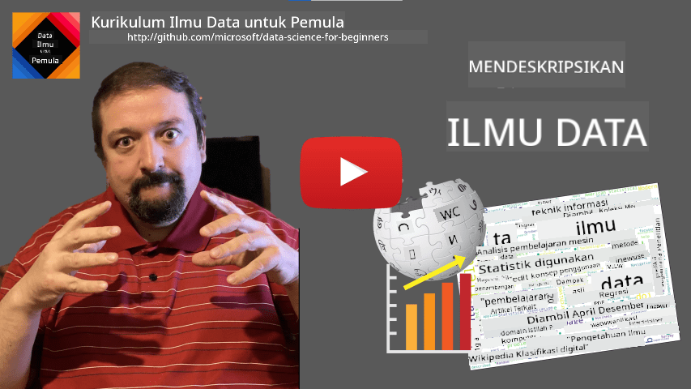

<!--
CO_OP_TRANSLATOR_METADATA:
{
  "original_hash": "2583a9894af7123b2fcae3376b14c035",
  "translation_date": "2025-08-28T18:56:03+00:00",
  "source_file": "1-Introduction/01-defining-data-science/README.md",
  "language_code": "id"
}
-->
# Mendefinisikan Ilmu Data

|  ](../../sketchnotes/01-Definitions.png) |
| :----------------------------------------------------------------------------------------------------: |
|              Mendefinisikan Ilmu Data - _Sketchnote oleh [@nitya](https://twitter.com/nitya)_           |

---

## [Kuis Pra-Kuliah](https://purple-hill-04aebfb03.1.azurestaticapps.net/quiz/0)

## Apa itu Data?
Dalam kehidupan sehari-hari, kita selalu dikelilingi oleh data. Teks yang sedang Anda baca sekarang adalah data. Daftar nomor telepon teman-teman Anda di ponsel adalah data, begitu juga dengan waktu saat ini yang ditampilkan di jam tangan Anda. Sebagai manusia, kita secara alami beroperasi dengan data, seperti menghitung uang yang kita miliki atau menulis surat kepada teman.

Namun, data menjadi jauh lebih penting dengan adanya komputer. Peran utama komputer adalah melakukan perhitungan, tetapi mereka memerlukan data untuk diolah. Oleh karena itu, kita perlu memahami bagaimana komputer menyimpan dan memproses data.

Dengan munculnya Internet, peran komputer sebagai perangkat pengolah data semakin meningkat. Jika dipikirkan, kita sekarang lebih sering menggunakan komputer untuk memproses dan berkomunikasi data daripada untuk perhitungan sebenarnya. Ketika kita menulis email kepada teman atau mencari informasi di Internet, kita pada dasarnya sedang menciptakan, menyimpan, mengirimkan, dan memanipulasi data.
> Bisakah Anda mengingat kapan terakhir kali Anda menggunakan komputer untuk benar-benar menghitung sesuatu?

## Apa itu Ilmu Data?

Menurut [Wikipedia](https://en.wikipedia.org/wiki/Data_science), **Ilmu Data** didefinisikan sebagai *bidang ilmiah yang menggunakan metode ilmiah untuk mengekstrak pengetahuan dan wawasan dari data terstruktur dan tidak terstruktur, serta menerapkan pengetahuan dan wawasan yang dapat ditindaklanjuti dari data di berbagai domain aplikasi*. 

Definisi ini menyoroti beberapa aspek penting dari ilmu data:

* Tujuan utama ilmu data adalah **mengekstrak pengetahuan** dari data, dengan kata lain - untuk **memahami** data, menemukan hubungan tersembunyi, dan membangun **model**.
* Ilmu data menggunakan **metode ilmiah**, seperti probabilitas dan statistik. Faktanya, ketika istilah *ilmu data* pertama kali diperkenalkan, beberapa orang berpendapat bahwa ilmu data hanyalah nama baru yang keren untuk statistik. Namun, sekarang telah jelas bahwa bidang ini jauh lebih luas.
* Pengetahuan yang diperoleh harus diterapkan untuk menghasilkan **wawasan yang dapat ditindaklanjuti**, yaitu wawasan praktis yang dapat diterapkan pada situasi bisnis nyata.
* Kita harus mampu mengolah data **terstruktur** maupun **tidak terstruktur**. Kita akan kembali membahas berbagai jenis data ini nanti dalam kursus.
* **Domain aplikasi** adalah konsep penting, dan ilmuwan data sering kali memerlukan setidaknya sedikit keahlian dalam domain masalah, misalnya: keuangan, kedokteran, pemasaran, dll.

> Aspek penting lain dari Ilmu Data adalah mempelajari bagaimana data dapat dikumpulkan, disimpan, dan diolah menggunakan komputer. Sementara statistik memberikan dasar matematika, ilmu data menerapkan konsep matematika untuk benar-benar mendapatkan wawasan dari data.

Salah satu cara (yang dikaitkan dengan [Jim Gray](https://en.wikipedia.org/wiki/Jim_Gray_(computer_scientist))) untuk melihat ilmu data adalah menganggapnya sebagai paradigma ilmu pengetahuan yang terpisah:
* **Empiris**, di mana kita terutama mengandalkan observasi dan hasil eksperimen
* **Teoretis**, di mana konsep baru muncul dari pengetahuan ilmiah yang sudah ada
* **Komputasional**, di mana kita menemukan prinsip baru berdasarkan eksperimen komputasi
* **Berbasis Data**, berdasarkan penemuan hubungan dan pola dalam data  

## Bidang Terkait Lainnya

Karena data ada di mana-mana, ilmu data itu sendiri juga merupakan bidang yang luas, yang menyentuh banyak disiplin ilmu lainnya.

## Jenis Data

Seperti yang telah disebutkan, data ada di mana-mana. Kita hanya perlu menangkapnya dengan cara yang tepat! Penting untuk membedakan antara **data terstruktur** dan **tidak terstruktur**. Data terstruktur biasanya direpresentasikan dalam bentuk yang terorganisir dengan baik, sering kali sebagai tabel atau sejumlah tabel, sedangkan data tidak terstruktur hanyalah kumpulan file. Kadang-kadang kita juga dapat berbicara tentang **data semi-terstruktur**, yang memiliki semacam struktur yang dapat sangat bervariasi.

| Terstruktur                                                                  | Semi-terstruktur                                                                               | Tidak Terstruktur                       |
| ---------------------------------------------------------------------------- | --------------------------------------------------------------------------------------------- | --------------------------------------- |
| Daftar orang dengan nomor telepon mereka                                    | Halaman Wikipedia dengan tautan                                                               | Teks dari Ensiklopedia Britannica       |
| Suhu di semua ruangan sebuah gedung setiap menit selama 20 tahun terakhir    | Koleksi makalah ilmiah dalam format JSON dengan penulis, tanggal publikasi, dan abstrak       | Berkas dokumen perusahaan               |
| Data usia dan jenis kelamin semua orang yang memasuki gedung                 | Halaman internet                                                                              | Rekaman video mentah dari kamera CCTV   |

## Dari Mana Mendapatkan Data

Ada banyak sumber data yang mungkin, dan tidak mungkin untuk mencantumkan semuanya! Namun, mari kita sebutkan beberapa tempat khas di mana Anda dapat memperoleh data:

* **Terstruktur**
  - **Internet of Things** (IoT), termasuk data dari berbagai sensor, seperti sensor suhu atau tekanan, menyediakan banyak data yang berguna. Misalnya, jika sebuah gedung perkantoran dilengkapi dengan sensor IoT, kita dapat secara otomatis mengontrol pemanasan dan pencahayaan untuk meminimalkan biaya.
  - **Survei** yang kita minta pengguna untuk mengisi setelah pembelian, atau setelah mengunjungi situs web.
  - **Analisis perilaku** dapat, misalnya, membantu kita memahami seberapa dalam pengguna menjelajahi situs, dan apa alasan utama mereka meninggalkan situs.
* **Tidak Terstruktur**
  - **Teks** dapat menjadi sumber wawasan yang kaya, seperti **skor sentimen** secara keseluruhan, atau mengekstraksi kata kunci dan makna semantik.
  - **Gambar** atau **Video**. Rekaman video dari kamera pengawas dapat digunakan untuk memperkirakan lalu lintas di jalan, dan memberi tahu orang-orang tentang potensi kemacetan.
  - **Log** server web dapat digunakan untuk memahami halaman mana dari situs kita yang paling sering dikunjungi, dan berapa lama.
* **Semi-terstruktur**
  - Grafik **Jejaring Sosial** dapat menjadi sumber data yang hebat tentang kepribadian pengguna dan potensi efektivitas dalam menyebarkan informasi.
  - Ketika kita memiliki sekumpulan foto dari sebuah pesta, kita dapat mencoba mengekstrak data **Dinamika Kelompok** dengan membangun grafik orang-orang yang berfoto bersama.

Dengan mengetahui berbagai sumber data yang mungkin, Anda dapat mencoba memikirkan berbagai skenario di mana teknik ilmu data dapat diterapkan untuk memahami situasi dengan lebih baik, dan meningkatkan proses bisnis.

## Apa yang Bisa Dilakukan dengan Data

Dalam Ilmu Data, kita fokus pada langkah-langkah berikut dalam perjalanan data:

Tentu saja, tergantung pada data yang sebenarnya, beberapa langkah mungkin tidak diperlukan (misalnya, ketika kita sudah memiliki data di database, atau ketika kita tidak memerlukan pelatihan model), atau beberapa langkah mungkin diulang beberapa kali (seperti pemrosesan data).

## Digitalisasi dan Transformasi Digital

Dalam dekade terakhir, banyak bisnis mulai memahami pentingnya data dalam pengambilan keputusan bisnis. Untuk menerapkan prinsip-prinsip ilmu data dalam menjalankan bisnis, pertama-tama kita perlu mengumpulkan data, yaitu menerjemahkan proses bisnis ke dalam bentuk digital. Ini dikenal sebagai **digitalisasi**. Menerapkan teknik ilmu data pada data ini untuk memandu keputusan dapat menghasilkan peningkatan produktivitas yang signifikan (atau bahkan perubahan arah bisnis), yang disebut **transformasi digital**.

Mari kita pertimbangkan sebuah contoh. Misalkan kita memiliki kursus ilmu data (seperti ini) yang kita sampaikan secara online kepada siswa, dan kita ingin menggunakan ilmu data untuk meningkatkannya. Bagaimana kita bisa melakukannya?

Kita dapat mulai dengan bertanya "Apa yang bisa didigitalisasi?" Cara paling sederhana adalah dengan mengukur waktu yang dibutuhkan setiap siswa untuk menyelesaikan setiap modul, dan mengukur pengetahuan yang diperoleh dengan memberikan tes pilihan ganda di akhir setiap modul. Dengan menghitung rata-rata waktu penyelesaian di seluruh siswa, kita dapat mengetahui modul mana yang paling sulit bagi siswa, dan bekerja untuk menyederhanakannya.
Anda mungkin berpendapat bahwa pendekatan ini tidak ideal, karena modul dapat memiliki panjang yang berbeda. Mungkin lebih adil untuk membagi waktu berdasarkan panjang modul (dalam jumlah karakter), dan membandingkan nilai-nilai tersebut sebagai gantinya.
Ketika kita mulai menganalisis hasil tes pilihan ganda, kita dapat mencoba menentukan konsep mana yang sulit dipahami oleh siswa, dan menggunakan informasi tersebut untuk meningkatkan konten. Untuk melakukannya, kita perlu merancang tes sedemikian rupa sehingga setiap pertanyaan terkait dengan konsep atau bagian pengetahuan tertentu.

Jika kita ingin membuatnya lebih rumit, kita dapat memplot waktu yang dibutuhkan untuk setiap modul terhadap kategori usia siswa. Kita mungkin menemukan bahwa untuk beberapa kategori usia, dibutuhkan waktu yang terlalu lama untuk menyelesaikan modul, atau siswa berhenti sebelum menyelesaikannya. Hal ini dapat membantu kita memberikan rekomendasi usia untuk modul tersebut, dan meminimalkan ketidakpuasan orang akibat ekspektasi yang salah.

## 🚀 Tantangan

Dalam tantangan ini, kita akan mencoba menemukan konsep-konsep yang relevan dengan bidang Data Science dengan melihat teks. Kita akan mengambil artikel Wikipedia tentang Data Science, mengunduh dan memproses teksnya, lalu membuat word cloud seperti ini:

Kunjungi [`notebook.ipynb`](../../../../../../../../../1-Introduction/01-defining-data-science/notebook.ipynb ':ignore') untuk membaca kode. Anda juga dapat menjalankan kode tersebut, dan melihat bagaimana kode tersebut melakukan semua transformasi data secara real time.

> Jika Anda tidak tahu cara menjalankan kode di Jupyter Notebook, lihat [artikel ini](https://soshnikov.com/education/how-to-execute-notebooks-from-github/).

## [Kuis setelah kuliah](https://purple-hill-04aebfb03.1.azurestaticapps.net/quiz/1)

## Tugas

* **Tugas 1**: Modifikasi kode di atas untuk menemukan konsep terkait untuk bidang **Big Data** dan **Machine Learning**
* **Tugas 2**: [Pikirkan Tentang Skenario Data Science](assignment.md)

## Kredit

Pelajaran ini dibuat dengan ♥️ oleh [Dmitry Soshnikov](http://soshnikov.com)

---

**Penafian**:  
Dokumen ini telah diterjemahkan menggunakan layanan penerjemahan AI [Co-op Translator](https://github.com/Azure/co-op-translator). Meskipun kami berusaha untuk memberikan hasil yang akurat, harap diingat bahwa terjemahan otomatis mungkin mengandung kesalahan atau ketidakakuratan. Dokumen asli dalam bahasa aslinya harus dianggap sebagai sumber yang otoritatif. Untuk informasi yang bersifat kritis, disarankan menggunakan jasa penerjemahan profesional oleh manusia. Kami tidak bertanggung jawab atas kesalahpahaman atau penafsiran yang keliru yang timbul dari penggunaan terjemahan ini.