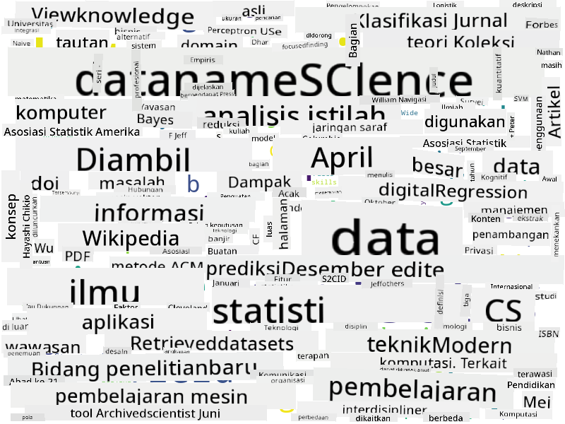

<!--
CO_OP_TRANSLATOR_METADATA:
{
  "original_hash": "a76ab694b1534fa57981311975660bfe",
  "translation_date": "2025-09-06T12:26:30+00:00",
  "source_file": "1-Introduction/01-defining-data-science/README.md",
  "language_code": "id"
}
-->
## Jenis Data

Seperti yang telah disebutkan sebelumnya, data ada di mana-mana. Kita hanya perlu menangkapnya dengan cara yang tepat! Penting untuk membedakan antara **data terstruktur** dan **data tidak terstruktur**. Data terstruktur biasanya direpresentasikan dalam bentuk yang terorganisir dengan baik, sering kali berupa tabel atau sejumlah tabel, sedangkan data tidak terstruktur hanyalah kumpulan file. Kadang-kadang kita juga dapat berbicara tentang **data semi-terstruktur**, yang memiliki semacam struktur yang dapat sangat bervariasi.

| Terstruktur                                                                  | Semi-terstruktur                                                                               | Tidak terstruktur                       |
| --------------------------------------------------------------------------- | --------------------------------------------------------------------------------------------- | --------------------------------------- |
| Daftar orang dengan nomor telepon mereka                                    | Halaman Wikipedia dengan tautan                                                               | Teks dari Ensiklopedia Britannica       |
| Suhu di semua ruangan gedung setiap menit selama 20 tahun terakhir          | Kumpulan makalah ilmiah dalam format JSON dengan penulis, tanggal publikasi, dan abstrak      | File berbagi dengan dokumen perusahaan  |
| Data usia dan jenis kelamin semua orang yang masuk ke gedung                | Halaman internet                                                                              | Rekaman video mentah dari kamera pengawas |

## Sumber Data

Ada banyak sumber data yang mungkin, dan tidak mungkin untuk mencantumkan semuanya! Namun, mari kita sebutkan beberapa tempat umum di mana Anda dapat memperoleh data:

* **Terstruktur**
  - **Internet of Things** (IoT), termasuk data dari berbagai sensor seperti sensor suhu atau tekanan, menyediakan banyak data yang berguna. Misalnya, jika sebuah gedung kantor dilengkapi dengan sensor IoT, kita dapat secara otomatis mengontrol pemanasan dan pencahayaan untuk meminimalkan biaya.
  - **Survei** yang kita minta pengguna untuk isi setelah pembelian, atau setelah mengunjungi situs web.
  - **Analisis perilaku** dapat, misalnya, membantu kita memahami seberapa dalam pengguna menjelajahi situs, dan apa alasan umum mereka meninggalkan situs.
* **Tidak terstruktur**
  - **Teks** dapat menjadi sumber wawasan yang kaya, seperti skor **sentimen keseluruhan**, atau ekstraksi kata kunci dan makna semantik.
  - **Gambar** atau **Video**. Video dari kamera pengawas dapat digunakan untuk memperkirakan lalu lintas di jalan, dan memberi tahu orang-orang tentang potensi kemacetan.
  - **Log** server web dapat digunakan untuk memahami halaman mana dari situs kita yang paling sering dikunjungi, dan berapa lama.
* **Semi-terstruktur**
  - Grafik **Jejaring Sosial** dapat menjadi sumber data yang hebat tentang kepribadian pengguna dan potensi efektivitas dalam menyebarkan informasi.
  - Ketika kita memiliki kumpulan foto dari sebuah pesta, kita dapat mencoba mengekstrak data **Dinamika Kelompok** dengan membangun grafik orang-orang yang berfoto bersama.

Dengan mengetahui berbagai sumber data yang mungkin, Anda dapat mencoba memikirkan berbagai skenario di mana teknik ilmu data dapat diterapkan untuk memahami situasi dengan lebih baik, dan untuk meningkatkan proses bisnis.

## Apa yang Bisa Dilakukan dengan Data

Dalam Ilmu Data, kita fokus pada langkah-langkah berikut dalam perjalanan data:

Tentu saja, tergantung pada data yang sebenarnya, beberapa langkah mungkin tidak diperlukan (misalnya, ketika kita sudah memiliki data di dalam database, atau ketika kita tidak memerlukan pelatihan model), atau beberapa langkah mungkin diulang beberapa kali (seperti pemrosesan data).

## Digitalisasi dan Transformasi Digital

Dalam dekade terakhir, banyak bisnis mulai memahami pentingnya data dalam membuat keputusan bisnis. Untuk menerapkan prinsip ilmu data dalam menjalankan bisnis, pertama-tama kita perlu mengumpulkan data, yaitu menerjemahkan proses bisnis ke dalam bentuk digital. Ini dikenal sebagai **digitalisasi**. Menerapkan teknik ilmu data pada data ini untuk memandu keputusan dapat menghasilkan peningkatan produktivitas yang signifikan (atau bahkan perubahan arah bisnis), yang disebut **transformasi digital**.

Mari kita pertimbangkan sebuah contoh. Misalkan kita memiliki kursus ilmu data (seperti ini) yang kita sampaikan secara online kepada siswa, dan kita ingin menggunakan ilmu data untuk meningkatkannya. Bagaimana kita bisa melakukannya?

Kita dapat mulai dengan bertanya "Apa yang bisa didigitalisasi?" Cara paling sederhana adalah dengan mengukur waktu yang dibutuhkan setiap siswa untuk menyelesaikan setiap modul, dan mengukur pengetahuan yang diperoleh dengan memberikan tes pilihan ganda di akhir setiap modul. Dengan merata-ratakan waktu penyelesaian di seluruh siswa, kita dapat mengetahui modul mana yang paling sulit bagi siswa, dan bekerja untuk menyederhanakannya.
Anda mungkin berpendapat bahwa pendekatan ini tidak ideal, karena modul dapat memiliki panjang yang berbeda. Mungkin lebih adil untuk membagi waktu berdasarkan panjang modul (dalam jumlah karakter), dan membandingkan nilai-nilai tersebut sebagai gantinya.
Ketika kita mulai menganalisis hasil tes pilihan ganda, kita dapat mencoba menentukan konsep mana yang sulit dipahami oleh siswa, dan menggunakan informasi tersebut untuk meningkatkan konten. Untuk melakukan itu, kita perlu merancang tes sedemikian rupa sehingga setiap pertanyaan terhubung dengan konsep atau bagian pengetahuan tertentu.

Jika kita ingin membuatnya lebih kompleks, kita dapat memplot waktu yang dihabiskan untuk setiap modul terhadap kategori usia siswa. Kita mungkin menemukan bahwa untuk beberapa kategori usia, waktu yang diperlukan untuk menyelesaikan modul terlalu lama, atau siswa berhenti sebelum menyelesaikannya. Hal ini dapat membantu kita memberikan rekomendasi usia untuk modul tersebut, dan meminimalkan ketidakpuasan orang akibat ekspektasi yang salah.

## 🚀 Tantangan

Dalam tantangan ini, kita akan mencoba menemukan konsep yang relevan dengan bidang Data Science dengan melihat teks. Kita akan mengambil artikel Wikipedia tentang Data Science, mengunduh dan memproses teksnya, lalu membuat word cloud seperti ini:

Kunjungi [`notebook.ipynb`](../../../../1-Introduction/01-defining-data-science/notebook.ipynb ':ignore') untuk membaca kode. Anda juga dapat menjalankan kode tersebut, dan melihat bagaimana kode tersebut melakukan semua transformasi data secara langsung.

> Jika Anda tidak tahu cara menjalankan kode di Jupyter Notebook, lihat [artikel ini](https://soshnikov.com/education/how-to-execute-notebooks-from-github/).

## [Kuis setelah pelajaran](https://ff-quizzes.netlify.app/en/ds/quiz/1)

## Tugas

* **Tugas 1**: Modifikasi kode di atas untuk menemukan konsep terkait untuk bidang **Big Data** dan **Machine Learning**
* **Tugas 2**: [Pikirkan tentang Skenario Data Science](assignment.md)

## Kredit

Pelajaran ini telah dibuat dengan ♥️ oleh [Dmitry Soshnikov](http://soshnikov.com)

---

**Penafian**:  
Dokumen ini telah diterjemahkan menggunakan layanan terjemahan AI [Co-op Translator](https://github.com/Azure/co-op-translator). Meskipun kami berupaya untuk memberikan hasil yang akurat, harap diperhatikan bahwa terjemahan otomatis mungkin mengandung kesalahan atau ketidakakuratan. Dokumen asli dalam bahasa aslinya harus dianggap sebagai sumber yang berwenang. Untuk informasi yang bersifat kritis, disarankan menggunakan jasa penerjemah manusia profesional. Kami tidak bertanggung jawab atas kesalahpahaman atau penafsiran yang keliru yang timbul dari penggunaan terjemahan ini.