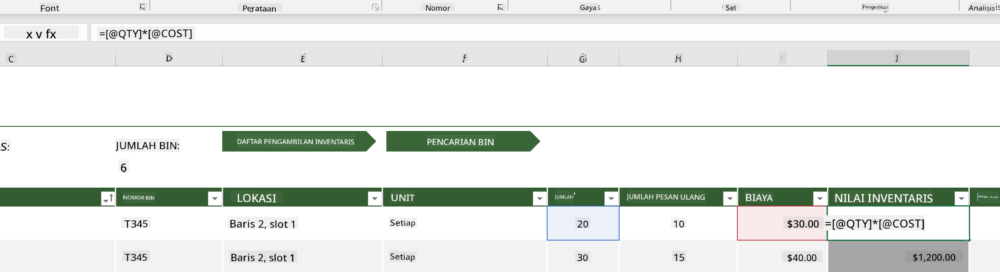
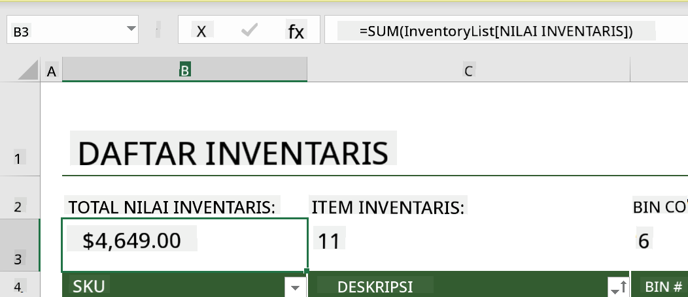
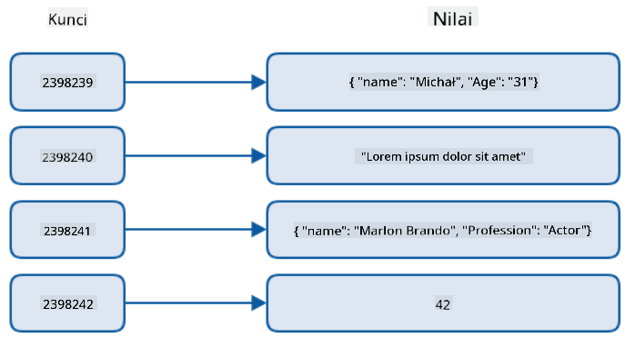
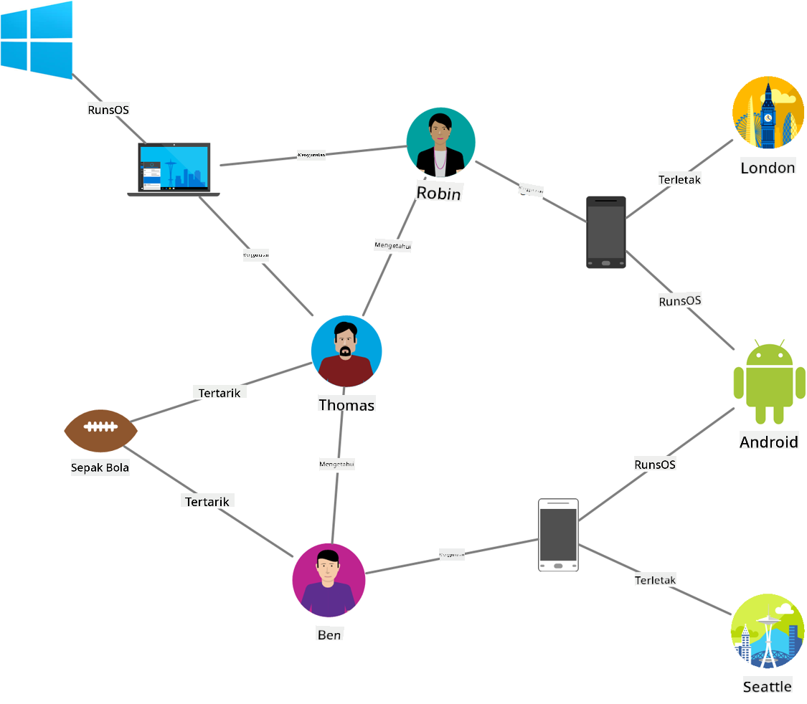
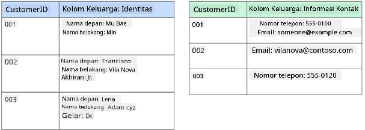
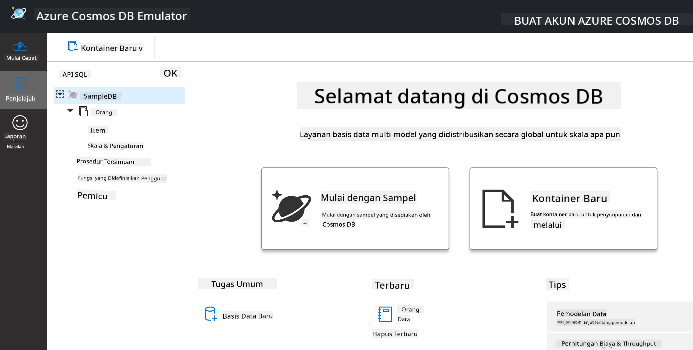
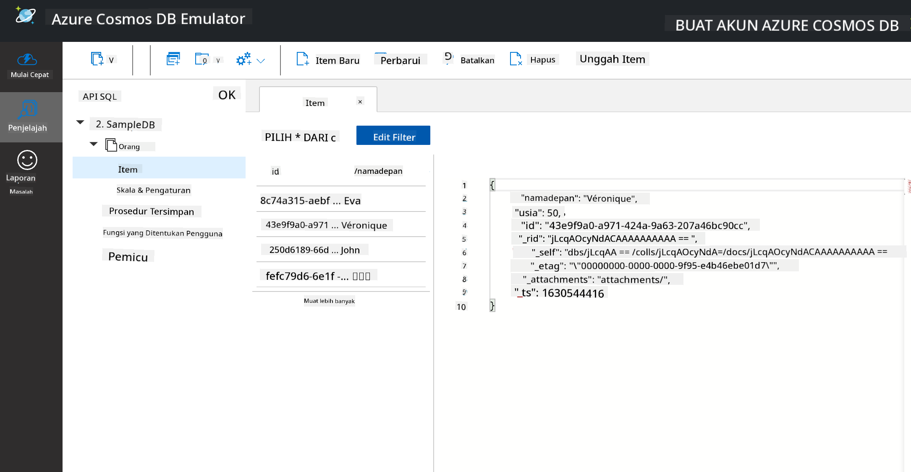
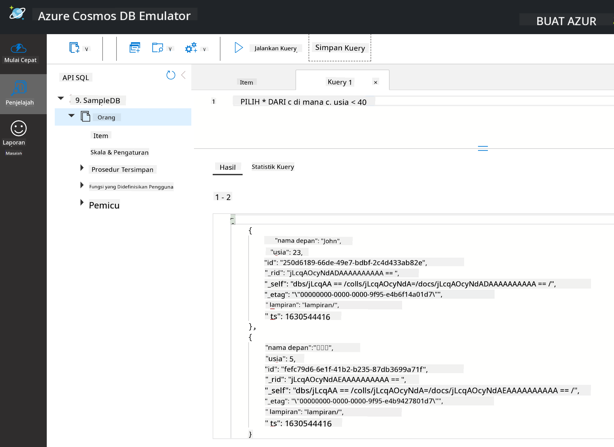

<!--
CO_OP_TRANSLATOR_METADATA:
{
  "original_hash": "54c5a1c74aecb69d2f9099300a4b7eea",
  "translation_date": "2025-09-04T20:32:00+00:00",
  "source_file": "2-Working-With-Data/06-non-relational/README.md",
  "language_code": "id"
}
-->
# Bekerja dengan Data: Data Non-Relasional

| ](../../sketchnotes/06-NoSQL.png)|
|:---:|
|Bekerja dengan Data NoSQL - _Sketchnote oleh [@nitya](https://twitter.com/nitya)_ |

## [Kuis Pra-Pelajaran](https://purple-hill-04aebfb03.1.azurestaticapps.net/quiz/10)

Data tidak terbatas pada basis data relasional. Pelajaran ini berfokus pada data non-relasional dan akan mencakup dasar-dasar spreadsheet dan NoSQL.

## Spreadsheet

Spreadsheet adalah cara yang populer untuk menyimpan dan mengeksplorasi data karena memerlukan sedikit usaha untuk memulai. Dalam pelajaran ini, Anda akan mempelajari komponen dasar dari spreadsheet, serta rumus dan fungsi. Contoh-contoh akan diilustrasikan menggunakan Microsoft Excel, tetapi sebagian besar bagian dan topik akan memiliki nama dan langkah yang serupa dibandingkan dengan perangkat lunak spreadsheet lainnya.


Spreadsheet adalah file yang dapat diakses di sistem file komputer, perangkat, atau sistem file berbasis cloud. Perangkat lunaknya sendiri mungkin berbasis browser atau aplikasi yang harus diinstal di komputer atau diunduh sebagai aplikasi. Dalam Excel, file-file ini juga disebut sebagai **workbook**, dan istilah ini akan digunakan sepanjang pelajaran ini.

Sebuah workbook berisi satu atau lebih **worksheet**, di mana setiap worksheet diberi label dengan tab. Di dalam worksheet terdapat persegi panjang yang disebut **sel**, yang akan berisi data sebenarnya. Sebuah sel adalah perpotongan antara baris dan kolom, di mana kolom diberi label dengan karakter alfabet dan baris diberi label secara numerik. Beberapa spreadsheet akan memiliki header di beberapa baris pertama untuk menjelaskan data dalam sel.

Dengan elemen-elemen dasar workbook Excel ini, kita akan menggunakan contoh dari [Microsoft Templates](https://templates.office.com/) yang berfokus pada inventaris untuk menjelaskan beberapa bagian tambahan dari spreadsheet.

### Mengelola Inventaris

File spreadsheet bernama "InventoryExample" adalah spreadsheet yang diformat dari item-item dalam inventaris yang berisi tiga worksheet, di mana tab-tabnya diberi label "Inventory List", "Inventory Pick List", dan "Bin Lookup". Baris 4 dari worksheet Inventory List adalah header, yang menjelaskan nilai dari setiap sel di kolom header.



Ada situasi di mana sebuah sel bergantung pada nilai dari sel lain untuk menghasilkan nilainya. Spreadsheet Inventory List melacak biaya setiap item dalam inventarisnya, tetapi bagaimana jika kita perlu mengetahui nilai dari seluruh inventaris? [**Rumus**](https://support.microsoft.com/en-us/office/overview-of-formulas-34519a4e-1e8d-4f4b-84d4-d642c4f63263) melakukan tindakan pada data sel dan digunakan untuk menghitung biaya inventaris dalam contoh ini. Spreadsheet ini menggunakan rumus di kolom Inventory Value untuk menghitung nilai setiap item dengan mengalikan jumlah di bawah header QTY dan biayanya di bawah header COST. Dengan mengklik dua kali atau menyorot sebuah sel, Anda dapat melihat rumusnya. Anda akan melihat bahwa rumus dimulai dengan tanda sama dengan, diikuti oleh perhitungan atau operasi.



Kita dapat menggunakan rumus lain untuk menjumlahkan semua nilai di kolom Inventory Value untuk mendapatkan totalnya. Ini bisa dihitung dengan menambahkan setiap sel satu per satu, tetapi itu bisa menjadi tugas yang melelahkan. Excel memiliki [**fungsi**](https://support.microsoft.com/en-us/office/sum-function-043e1c7d-7726-4e80-8f32-07b23e057f89), atau rumus yang sudah didefinisikan sebelumnya untuk melakukan perhitungan pada nilai sel. Fungsi memerlukan argumen, yaitu nilai-nilai yang diperlukan untuk melakukan perhitungan ini. Ketika fungsi memerlukan lebih dari satu argumen, mereka harus dicantumkan dalam urutan tertentu atau fungsi mungkin tidak menghitung nilai yang benar. Contoh ini menggunakan fungsi SUM, dan menggunakan nilai-nilai di kolom Inventory Value sebagai argumen untuk menghasilkan total yang terdaftar di bawah baris 3, kolom B (juga disebut sebagai B3).

## NoSQL

NoSQL adalah istilah umum untuk berbagai cara menyimpan data non-relasional dan dapat diartikan sebagai "non-SQL", "non-relasional", atau "tidak hanya SQL". Jenis sistem basis data ini dapat dikategorikan menjadi 4 jenis.


> Sumber dari [Blog Michał Białecki](https://www.michalbialecki.com/2018/03/18/azure-cosmos-db-key-value-database-cloud/)

[Key-value](https://docs.microsoft.com/en-us/azure/architecture/data-guide/big-data/non-relational-data#keyvalue-data-stores) database memasangkan kunci unik, yang merupakan pengidentifikasi unik yang terkait dengan nilai. Pasangan ini disimpan menggunakan [hash table](https://www.hackerearth.com/practice/data-structures/hash-tables/basics-of-hash-tables/tutorial/) dengan fungsi hashing yang sesuai.


> Sumber dari [Microsoft](https://docs.microsoft.com/en-us/azure/cosmos-db/graph/graph-introduction#graph-database-by-example)

[Graph](https://docs.microsoft.com/en-us/azure/architecture/data-guide/big-data/non-relational-data#graph-data-stores) database menggambarkan hubungan dalam data dan direpresentasikan sebagai kumpulan node dan edge. Node mewakili entitas, sesuatu yang ada di dunia nyata seperti siswa atau laporan bank. Edge mewakili hubungan antara dua entitas. Setiap node dan edge memiliki properti yang memberikan informasi tambahan tentang masing-masing node dan edge.



[Columnar](https://docs.microsoft.com/en-us/azure/architecture/data-guide/big-data/non-relational-data#columnar-data-stores) data store mengorganisasi data ke dalam kolom dan baris seperti struktur data relasional tetapi setiap kolom dibagi menjadi kelompok yang disebut keluarga kolom, di mana semua data di bawah satu kolom terkait dan dapat diambil serta diubah dalam satu unit.

### Penyimpanan Data Dokumen dengan Azure Cosmos DB

[Document](https://docs.microsoft.com/en-us/azure/architecture/data-guide/big-data/non-relational-data#document-data-stores) data store dibangun di atas konsep penyimpanan data key-value dan terdiri dari serangkaian field dan objek. Bagian ini akan mengeksplorasi basis data dokumen dengan emulator Cosmos DB.

Basis data Cosmos DB sesuai dengan definisi "Not Only SQL", di mana basis data dokumen Cosmos DB bergantung pada SQL untuk melakukan query data. [Pelajaran sebelumnya](../05-relational-databases/README.md) tentang SQL mencakup dasar-dasar bahasa ini, dan kita akan dapat menerapkan beberapa query yang sama pada basis data dokumen di sini. Kita akan menggunakan Emulator Cosmos DB, yang memungkinkan kita membuat dan mengeksplorasi basis data dokumen secara lokal di komputer. Baca lebih lanjut tentang Emulator [di sini](https://docs.microsoft.com/en-us/azure/cosmos-db/local-emulator?tabs=ssl-netstd21).

Sebuah dokumen adalah kumpulan field dan nilai objek, di mana field menjelaskan apa yang direpresentasikan oleh nilai objek. Di bawah ini adalah contoh dokumen.

```json
{
    "firstname": "Eva",
    "age": 44,
    "id": "8c74a315-aebf-4a16-bb38-2430a9896ce5",
    "_rid": "bHwDAPQz8s0BAAAAAAAAAA==",
    "_self": "dbs/bHwDAA==/colls/bHwDAPQz8s0=/docs/bHwDAPQz8s0BAAAAAAAAAA==/",
    "_etag": "\"00000000-0000-0000-9f95-010a691e01d7\"",
    "_attachments": "attachments/",
    "_ts": 1630544034
}
```

Field yang menarik dalam dokumen ini adalah: `firstname`, `id`, dan `age`. Field lainnya dengan garis bawah dihasilkan oleh Cosmos DB.

#### Mengeksplorasi Data dengan Emulator Cosmos DB

Anda dapat mengunduh dan menginstal emulator [untuk Windows di sini](https://aka.ms/cosmosdb-emulator). Lihat [dokumentasi ini](https://docs.microsoft.com/en-us/azure/cosmos-db/local-emulator?tabs=ssl-netstd21#run-on-linux-macos) untuk opsi menjalankan Emulator di macOS dan Linux.

Emulator meluncurkan jendela browser, di mana tampilan Explorer memungkinkan Anda mengeksplorasi dokumen.



Jika Anda mengikuti langkah-langkah ini, klik "Start with Sample" untuk menghasilkan basis data contoh bernama SampleDB. Jika Anda memperluas SampleDB dengan mengklik panah, Anda akan menemukan sebuah container bernama `Persons`. Container ini berisi kumpulan item, yang merupakan dokumen dalam container tersebut. Anda dapat mengeksplorasi empat dokumen individual di bawah `Items`.



#### Melakukan Query Data Dokumen dengan Emulator Cosmos DB

Kita juga dapat melakukan query pada data contoh dengan mengklik tombol new SQL Query (tombol kedua dari kiri).

`SELECT * FROM c` mengembalikan semua dokumen dalam container. Mari tambahkan klausa where dan temukan semua orang yang berusia di bawah 40 tahun.

`SELECT * FROM c where c.age < 40`



Query ini mengembalikan dua dokumen, perhatikan bahwa nilai age untuk setiap dokumen kurang dari 40.

#### JSON dan Dokumen

Jika Anda familiar dengan JavaScript Object Notation (JSON), Anda akan melihat bahwa dokumen terlihat mirip dengan JSON. Ada file `PersonsData.json` di direktori ini dengan lebih banyak data yang dapat Anda unggah ke container Persons di Emulator melalui tombol `Upload Item`.

Dalam banyak kasus, API yang mengembalikan data JSON dapat langsung ditransfer dan disimpan dalam basis data dokumen. Di bawah ini adalah dokumen lain, yang mewakili tweet dari akun Twitter Microsoft yang diambil menggunakan Twitter API, lalu dimasukkan ke dalam Cosmos DB.

```json
{
    "created_at": "2021-08-31T19:03:01.000Z",
    "id": "1432780985872142341",
    "text": "Blank slate. Like this tweet if you’ve ever painted in Microsoft Paint before. https://t.co/cFeEs8eOPK",
    "_rid": "dhAmAIUsA4oHAAAAAAAAAA==",
    "_self": "dbs/dhAmAA==/colls/dhAmAIUsA4o=/docs/dhAmAIUsA4oHAAAAAAAAAA==/",
    "_etag": "\"00000000-0000-0000-9f84-a0958ad901d7\"",
    "_attachments": "attachments/",
    "_ts": 1630537000
```

Field yang menarik dalam dokumen ini adalah: `created_at`, `id`, dan `text`.

## 🚀 Tantangan

Ada file `TwitterData.json` yang dapat Anda unggah ke basis data SampleDB. Disarankan untuk menambahkannya ke container terpisah. Ini dapat dilakukan dengan:

1. Mengklik tombol new container di kanan atas
1. Memilih basis data yang ada (SampleDB) dan membuat id container untuk container tersebut
1. Menetapkan partition key ke `/id`
1. Mengklik OK (Anda dapat mengabaikan informasi lainnya di tampilan ini karena ini adalah dataset kecil yang berjalan secara lokal di komputer Anda)
1. Membuka container baru Anda dan mengunggah file Twitter Data dengan tombol `Upload Item`

Cobalah menjalankan beberapa query SELECT untuk menemukan dokumen yang memiliki kata Microsoft di field text. Petunjuk: coba gunakan [kata kunci LIKE](https://docs.microsoft.com/en-us/azure/cosmos-db/sql/sql-query-keywords#using-like-with-the--wildcard-character).

## [Kuis Pasca-Pelajaran](https://ff-quizzes.netlify.app/en/ds/)

## Tinjauan & Studi Mandiri

- Ada beberapa format dan fitur tambahan yang ditambahkan ke spreadsheet ini yang tidak dibahas dalam pelajaran ini. Microsoft memiliki [perpustakaan besar dokumentasi dan video](https://support.microsoft.com/excel) tentang Excel jika Anda tertarik untuk mempelajari lebih lanjut.

- Dokumentasi arsitektur ini merinci karakteristik dalam berbagai jenis data non-relasional: [Data Non-Relasional dan NoSQL](https://docs.microsoft.com/en-us/azure/architecture/data-guide/big-data/non-relational-data)

- Cosmos DB adalah basis data non-relasional berbasis cloud yang juga dapat menyimpan berbagai jenis NoSQL yang disebutkan dalam pelajaran ini. Pelajari lebih lanjut tentang jenis-jenis ini dalam [Modul Microsoft Learn Cosmos DB](https://docs.microsoft.com/en-us/learn/paths/work-with-nosql-data-in-azure-cosmos-db/)

## Tugas

[Soda Profits](assignment.md)

---

**Penafian**:  
Dokumen ini telah diterjemahkan menggunakan layanan penerjemahan AI [Co-op Translator](https://github.com/Azure/co-op-translator). Meskipun kami berupaya untuk memberikan hasil yang akurat, harap diperhatikan bahwa terjemahan otomatis mungkin mengandung kesalahan atau ketidakakuratan. Dokumen asli dalam bahasa aslinya harus dianggap sebagai sumber yang berwenang. Untuk informasi yang bersifat kritis, disarankan menggunakan jasa penerjemahan manusia profesional. Kami tidak bertanggung jawab atas kesalahpahaman atau penafsiran yang keliru yang timbul dari penggunaan terjemahan ini.