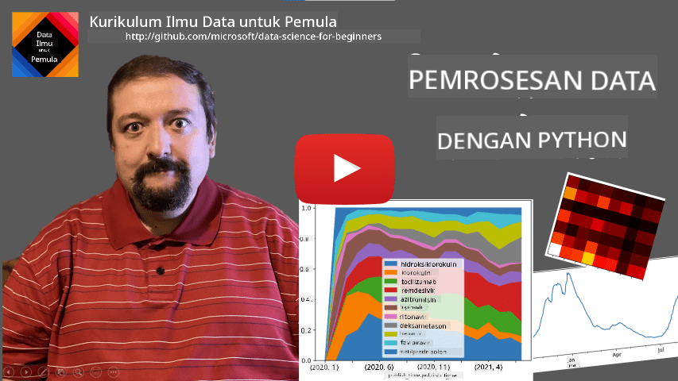
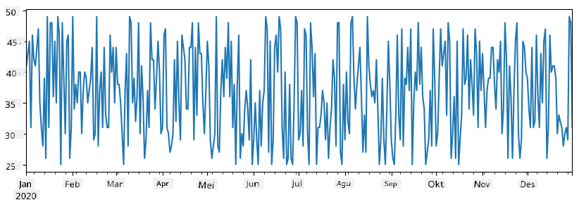
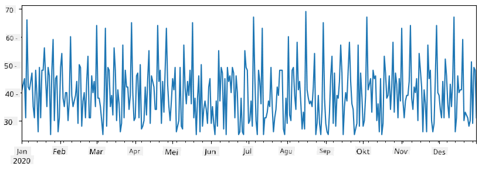
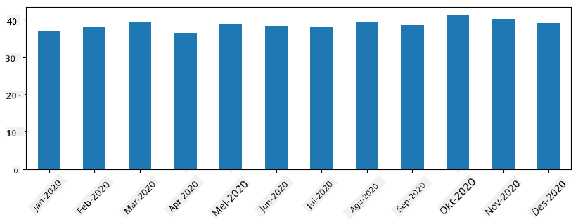
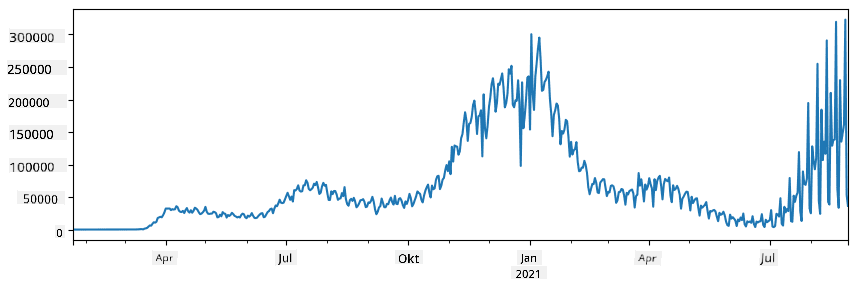
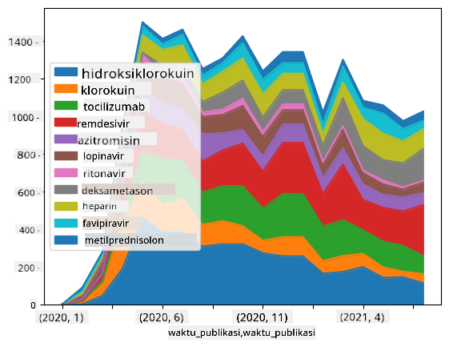

<!--
CO_OP_TRANSLATOR_METADATA:
{
  "original_hash": "116c5d361fbe812e59a73f37ce721d36",
  "translation_date": "2025-08-28T18:09:01+00:00",
  "source_file": "2-Working-With-Data/07-python/README.md",
  "language_code": "id"
}
-->
# Bekerja dengan Data: Python dan Pustaka Pandas

|  ](../../sketchnotes/07-WorkWithPython.png) |
| :-------------------------------------------------------------------------------------------------------: |
|                 Bekerja dengan Python - _Sketchnote oleh [@nitya](https://twitter.com/nitya)_             |

[](https://youtu.be/dZjWOGbsN4Y)

Meskipun basis data menawarkan cara yang sangat efisien untuk menyimpan data dan melakukan kueri menggunakan bahasa kueri, cara paling fleksibel untuk memproses data adalah dengan menulis program Anda sendiri untuk memanipulasi data. Dalam banyak kasus, melakukan kueri basis data akan lebih efektif. Namun, dalam beberapa kasus ketika pemrosesan data yang lebih kompleks diperlukan, hal tersebut tidak dapat dilakukan dengan mudah menggunakan SQL.  
Pemrosesan data dapat diprogram dalam bahasa pemrograman apa pun, tetapi ada beberapa bahasa yang lebih tinggi tingkatannya dalam hal bekerja dengan data. Para ilmuwan data biasanya lebih memilih salah satu dari bahasa berikut:

* **[Python](https://www.python.org/)**, bahasa pemrograman umum, yang sering dianggap sebagai salah satu pilihan terbaik untuk pemula karena kesederhanaannya. Python memiliki banyak pustaka tambahan yang dapat membantu Anda menyelesaikan banyak masalah praktis, seperti mengekstrak data dari arsip ZIP, atau mengonversi gambar menjadi skala abu-abu. Selain untuk ilmu data, Python juga sering digunakan untuk pengembangan web.  
* **[R](https://www.r-project.org/)** adalah alat tradisional yang dikembangkan dengan pemrosesan data statistik dalam pikiran. R juga memiliki repositori pustaka yang besar (CRAN), menjadikannya pilihan yang baik untuk pemrosesan data. Namun, R bukanlah bahasa pemrograman umum, dan jarang digunakan di luar domain ilmu data.  
* **[Julia](https://julialang.org/)** adalah bahasa lain yang dikembangkan khusus untuk ilmu data. Julia dirancang untuk memberikan kinerja yang lebih baik daripada Python, menjadikannya alat yang hebat untuk eksperimen ilmiah.

Dalam pelajaran ini, kita akan fokus menggunakan Python untuk pemrosesan data sederhana. Kami mengasumsikan Anda sudah memiliki pemahaman dasar tentang bahasa ini. Jika Anda ingin mempelajari Python lebih dalam, Anda dapat merujuk ke salah satu sumber berikut:

* [Belajar Python dengan Cara Menyenangkan menggunakan Turtle Graphics dan Fractals](https://github.com/shwars/pycourse) - Kursus pengantar Python berbasis GitHub  
* [Langkah Pertama Anda dengan Python](https://docs.microsoft.com/en-us/learn/paths/python-first-steps/?WT.mc_id=academic-77958-bethanycheum) di Microsoft Learn  

Data dapat hadir dalam berbagai bentuk. Dalam pelajaran ini, kita akan membahas tiga bentuk data - **data tabular**, **teks**, dan **gambar**.

Kami akan fokus pada beberapa contoh pemrosesan data, daripada memberikan gambaran lengkap tentang semua pustaka terkait. Ini akan memungkinkan Anda memahami ide utama tentang apa yang mungkin dilakukan, dan memberi Anda pemahaman tentang di mana menemukan solusi untuk masalah Anda saat membutuhkannya.

> **Saran paling berguna**. Ketika Anda perlu melakukan operasi tertentu pada data yang tidak Anda ketahui caranya, cobalah mencarinya di internet. [Stackoverflow](https://stackoverflow.com/) biasanya memiliki banyak contoh kode Python yang berguna untuk banyak tugas umum.

## [Kuis Pra-Pelajaran](https://purple-hill-04aebfb03.1.azurestaticapps.net/quiz/12)

## Data Tabular dan DataFrame

Anda sudah mengenal data tabular ketika kita membahas tentang basis data relasional. Ketika Anda memiliki banyak data yang tersimpan dalam banyak tabel yang saling terhubung, menggunakan SQL jelas masuk akal. Namun, ada banyak kasus di mana kita memiliki tabel data, dan kita perlu mendapatkan **pemahaman** atau **wawasan** tentang data ini, seperti distribusi, korelasi antar nilai, dll. Dalam ilmu data, sering kali kita perlu melakukan beberapa transformasi pada data asli, diikuti dengan visualisasi. Kedua langkah tersebut dapat dengan mudah dilakukan menggunakan Python.

Ada dua pustaka paling berguna di Python yang dapat membantu Anda menangani data tabular:
* **[Pandas](https://pandas.pydata.org/)** memungkinkan Anda memanipulasi **DataFrame**, yang mirip dengan tabel relasional. Anda dapat memiliki kolom bernama, dan melakukan berbagai operasi pada baris, kolom, dan DataFrame secara umum.  
* **[Numpy](https://numpy.org/)** adalah pustaka untuk bekerja dengan **tensor**, yaitu **array** multi-dimensi. Array memiliki nilai dengan tipe dasar yang sama, dan lebih sederhana daripada DataFrame, tetapi menawarkan lebih banyak operasi matematika, serta menciptakan overhead yang lebih sedikit.

Ada juga beberapa pustaka lain yang perlu Anda ketahui:
* **[Matplotlib](https://matplotlib.org/)** adalah pustaka yang digunakan untuk visualisasi data dan membuat grafik  
* **[SciPy](https://www.scipy.org/)** adalah pustaka dengan beberapa fungsi ilmiah tambahan. Kita sudah pernah membahas pustaka ini saat berbicara tentang probabilitas dan statistik  

Berikut adalah potongan kode yang biasanya Anda gunakan untuk mengimpor pustaka-pustaka tersebut di awal program Python Anda:  
```python
import numpy as np
import pandas as pd
import matplotlib.pyplot as plt
from scipy import ... # you need to specify exact sub-packages that you need
```  

Pandas berpusat pada beberapa konsep dasar.

### Series

**Series** adalah urutan nilai, mirip dengan daftar atau array numpy. Perbedaan utamanya adalah bahwa Series juga memiliki **index**, dan ketika kita melakukan operasi pada Series (misalnya, menambahkannya), index diperhitungkan. Index dapat sesederhana nomor baris integer (ini adalah index yang digunakan secara default saat membuat Series dari daftar atau array), atau dapat memiliki struktur yang kompleks, seperti interval tanggal.

> **Catatan**: Ada beberapa kode pengantar Pandas di notebook pendamping [`notebook.ipynb`](notebook.ipynb). Kami hanya menguraikan beberapa contoh di sini, dan Anda sangat disarankan untuk memeriksa notebook lengkapnya.

Misalkan kita ingin menganalisis penjualan di toko es krim kita. Mari kita buat Series angka penjualan (jumlah barang yang terjual setiap hari) untuk beberapa periode waktu:

```python
start_date = "Jan 1, 2020"
end_date = "Mar 31, 2020"
idx = pd.date_range(start_date,end_date)
print(f"Length of index is {len(idx)}")
items_sold = pd.Series(np.random.randint(25,50,size=len(idx)),index=idx)
items_sold.plot()
```  


Sekarang misalkan setiap minggu kita mengadakan pesta untuk teman-teman, dan kita mengambil tambahan 10 bungkus es krim untuk pesta. Kita dapat membuat Series lain, diindeks berdasarkan minggu, untuk menunjukkan hal itu:  
```python
additional_items = pd.Series(10,index=pd.date_range(start_date,end_date,freq="W"))
```  
Ketika kita menambahkan dua Series bersama-sama, kita mendapatkan total jumlah:  
```python
total_items = items_sold.add(additional_items,fill_value=0)
total_items.plot()
```  


> **Catatan** bahwa kita tidak menggunakan sintaks sederhana `total_items+additional_items`. Jika kita melakukannya, kita akan mendapatkan banyak nilai `NaN` (*Not a Number*) dalam Series hasil. Hal ini karena ada nilai yang hilang untuk beberapa titik index dalam Series `additional_items`, dan menambahkan `NaN` ke apa pun menghasilkan `NaN`. Oleh karena itu, kita perlu menentukan parameter `fill_value` selama penjumlahan.

Dengan time series, kita juga dapat **mengubah sampel ulang** Series dengan interval waktu yang berbeda. Misalnya, misalkan kita ingin menghitung rata-rata volume penjualan bulanan. Kita dapat menggunakan kode berikut:  
```python
monthly = total_items.resample("1M").mean()
ax = monthly.plot(kind='bar')
```  


### DataFrame

DataFrame pada dasarnya adalah kumpulan Series dengan index yang sama. Kita dapat menggabungkan beberapa Series menjadi sebuah DataFrame:  
```python
a = pd.Series(range(1,10))
b = pd.Series(["I","like","to","play","games","and","will","not","change"],index=range(0,9))
df = pd.DataFrame([a,b])
```  
Ini akan membuat tabel horizontal seperti ini:  
|     | 0   | 1    | 2   | 3   | 4      | 5   | 6      | 7    | 8    |
| --- | --- | ---- | --- | --- | ------ | --- | ------ | ---- | ---- |
| 0   | 1   | 2    | 3   | 4   | 5      | 6   | 7      | 8    | 9    |
| 1   | I   | like | to  | use | Python | and | Pandas | very | much |

Kita juga dapat menggunakan Series sebagai kolom, dan menentukan nama kolom menggunakan dictionary:  
```python
df = pd.DataFrame({ 'A' : a, 'B' : b })
```  
Ini akan menghasilkan tabel seperti ini:

|     | A   | B      |
| --- | --- | ------ |
| 0   | 1   | I      |
| 1   | 2   | like   |
| 2   | 3   | to     |
| 3   | 4   | use    |
| 4   | 5   | Python |
| 5   | 6   | and    |
| 6   | 7   | Pandas |
| 7   | 8   | very   |
| 8   | 9   | much   |

**Catatan** bahwa kita juga dapat mendapatkan tata letak tabel ini dengan mentranspos tabel sebelumnya, misalnya dengan menulis  
```python
df = pd.DataFrame([a,b]).T..rename(columns={ 0 : 'A', 1 : 'B' })
```  
Di sini `.T` berarti operasi mentranspos DataFrame, yaitu menukar baris dan kolom, dan operasi `rename` memungkinkan kita mengganti nama kolom agar sesuai dengan contoh sebelumnya.

Berikut adalah beberapa operasi paling penting yang dapat kita lakukan pada DataFrame:

**Pemilihan kolom**. Kita dapat memilih kolom individual dengan menulis `df['A']` - operasi ini mengembalikan Series. Kita juga dapat memilih subset kolom ke dalam DataFrame lain dengan menulis `df[['B','A']]` - ini mengembalikan DataFrame lain.

**Menyaring** hanya baris tertentu berdasarkan kriteria. Misalnya, untuk hanya menyisakan baris dengan kolom `A` lebih besar dari 5, kita dapat menulis `df[df['A']>5]`.

> **Catatan**: Cara kerja penyaringan adalah sebagai berikut. Ekspresi `df['A']<5` mengembalikan Series boolean, yang menunjukkan apakah ekspresi tersebut `True` atau `False` untuk setiap elemen dari Series asli `df['A']`. Ketika Series boolean digunakan sebagai index, ini mengembalikan subset baris dalam DataFrame. Oleh karena itu, tidak mungkin menggunakan ekspresi boolean Python sembarang, misalnya, menulis `df[df['A']>5 and df['A']<7]` akan salah. Sebagai gantinya, Anda harus menggunakan operasi khusus `&` pada Series boolean, menulis `df[(df['A']>5) & (df['A']<7)]` (*tanda kurung penting di sini*).

**Membuat kolom baru yang dapat dihitung**. Kita dapat dengan mudah membuat kolom baru yang dapat dihitung untuk DataFrame kita dengan menggunakan ekspresi intuitif seperti ini:  
```python
df['DivA'] = df['A']-df['A'].mean() 
```  
Contoh ini menghitung deviasi A dari nilai rata-ratanya. Apa yang sebenarnya terjadi di sini adalah kita menghitung sebuah Series, lalu menetapkan Series ini ke sisi kiri, menciptakan kolom baru. Oleh karena itu, kita tidak dapat menggunakan operasi apa pun yang tidak kompatibel dengan Series, misalnya, kode di bawah ini salah:  
```python
# Wrong code -> df['ADescr'] = "Low" if df['A'] < 5 else "Hi"
df['LenB'] = len(df['B']) # <- Wrong result
```  
Contoh terakhir, meskipun secara sintaksis benar, memberikan hasil yang salah, karena menetapkan panjang Series `B` ke semua nilai dalam kolom, dan bukan panjang elemen individual seperti yang kita maksudkan.

Jika kita perlu menghitung ekspresi kompleks seperti ini, kita dapat menggunakan fungsi `apply`. Contoh terakhir dapat ditulis sebagai berikut:  
```python
df['LenB'] = df['B'].apply(lambda x : len(x))
# or 
df['LenB'] = df['B'].apply(len)
```  

Setelah operasi di atas, kita akan mendapatkan DataFrame berikut:

|     | A   | B      | DivA | LenB |
| --- | --- | ------ | ---- | ---- |
| 0   | 1   | I      | -4.0 | 1    |
| 1   | 2   | like   | -3.0 | 4    |
| 2   | 3   | to     | -2.0 | 2    |
| 3   | 4   | use    | -1.0 | 3    |
| 4   | 5   | Python | 0.0  | 6    |
| 5   | 6   | and    | 1.0  | 3    |
| 6   | 7   | Pandas | 2.0  | 6    |
| 7   | 8   | very   | 3.0  | 4    |
| 8   | 9   | much   | 4.0  | 4    |

**Memilih baris berdasarkan nomor** dapat dilakukan menggunakan konstruk `iloc`. Misalnya, untuk memilih 5 baris pertama dari DataFrame:  
```python
df.iloc[:5]
```  

**Pengelompokan** sering digunakan untuk mendapatkan hasil yang mirip dengan *pivot table* di Excel. Misalkan kita ingin menghitung nilai rata-rata kolom `A` untuk setiap jumlah tertentu dari `LenB`. Maka kita dapat mengelompokkan DataFrame kita berdasarkan `LenB`, dan memanggil `mean`:  
```python
df.groupby(by='LenB').mean()
```  
Jika kita perlu menghitung rata-rata dan jumlah elemen dalam grup, maka kita dapat menggunakan fungsi `aggregate` yang lebih kompleks:  
```python
df.groupby(by='LenB') \
 .aggregate({ 'DivA' : len, 'A' : lambda x: x.mean() }) \
 .rename(columns={ 'DivA' : 'Count', 'A' : 'Mean'})
```  
Ini memberikan kita tabel berikut:

| LenB | Count | Mean     |
| ---- | ----- | -------- |
| 1    | 1     | 1.000000 |
| 2    | 1     | 3.000000 |
| 3    | 2     | 5.000000 |
| 4    | 3     | 6.333333 |
| 6    | 2     | 6.000000 |

### Mendapatkan Data
Kita telah melihat betapa mudahnya membangun Series dan DataFrames dari objek Python. Namun, data biasanya tersedia dalam bentuk file teks atau tabel Excel. Untungnya, Pandas menawarkan cara sederhana untuk memuat data dari disk. Sebagai contoh, membaca file CSV semudah ini:
```python
df = pd.read_csv('file.csv')
```
Kita akan melihat lebih banyak contoh memuat data, termasuk mengambilnya dari situs web eksternal, di bagian "Tantangan".

### Mencetak dan Memvisualisasikan

Seorang Data Scientist sering kali harus mengeksplorasi data, sehingga penting untuk dapat memvisualisasikannya. Ketika DataFrame besar, sering kali kita hanya ingin memastikan bahwa kita melakukan segalanya dengan benar dengan mencetak beberapa baris pertama. Hal ini dapat dilakukan dengan memanggil `df.head()`. Jika Anda menjalankannya dari Jupyter Notebook, itu akan mencetak DataFrame dalam bentuk tabel yang rapi.

Kita juga telah melihat penggunaan fungsi `plot` untuk memvisualisasikan beberapa kolom. Meskipun `plot` sangat berguna untuk banyak tugas, dan mendukung berbagai jenis grafik melalui parameter `kind=`, Anda selalu dapat menggunakan pustaka `matplotlib` mentah untuk memplot sesuatu yang lebih kompleks. Kita akan membahas visualisasi data secara mendetail dalam pelajaran kursus terpisah.

Ikhtisar ini mencakup konsep-konsep terpenting dari Pandas, namun pustaka ini sangat kaya, dan tidak ada batasan untuk apa yang dapat Anda lakukan dengannya! Sekarang mari kita terapkan pengetahuan ini untuk menyelesaikan masalah tertentu.

## 🚀 Tantangan 1: Menganalisis Penyebaran COVID

Masalah pertama yang akan kita fokuskan adalah pemodelan penyebaran epidemi COVID-19. Untuk itu, kita akan menggunakan data tentang jumlah individu yang terinfeksi di berbagai negara, yang disediakan oleh [Center for Systems Science and Engineering](https://systems.jhu.edu/) (CSSE) di [Johns Hopkins University](https://jhu.edu/). Dataset tersedia di [Repositori GitHub ini](https://github.com/CSSEGISandData/COVID-19).

Karena kita ingin menunjukkan cara menangani data, kami mengundang Anda untuk membuka [`notebook-covidspread.ipynb`](notebook-covidspread.ipynb) dan membacanya dari atas ke bawah. Anda juga dapat mengeksekusi sel, dan melakukan beberapa tantangan yang telah kami siapkan di akhir.



> Jika Anda tidak tahu cara menjalankan kode di Jupyter Notebook, lihat [artikel ini](https://soshnikov.com/education/how-to-execute-notebooks-from-github/).

## Bekerja dengan Data Tidak Terstruktur

Meskipun data sering kali tersedia dalam bentuk tabel, dalam beberapa kasus kita perlu menangani data yang kurang terstruktur, misalnya teks atau gambar. Dalam kasus ini, untuk menerapkan teknik pemrosesan data yang telah kita lihat sebelumnya, kita perlu **mengekstrak** data terstruktur. Berikut beberapa contohnya:

* Mengekstrak kata kunci dari teks, dan melihat seberapa sering kata kunci tersebut muncul
* Menggunakan jaringan saraf untuk mengekstrak informasi tentang objek dalam gambar
* Mendapatkan informasi tentang emosi orang dari umpan kamera video

## 🚀 Tantangan 2: Menganalisis Makalah COVID

Dalam tantangan ini, kita akan melanjutkan topik pandemi COVID, dan fokus pada pemrosesan makalah ilmiah tentang subjek ini. Ada [Dataset CORD-19](https://www.kaggle.com/allen-institute-for-ai/CORD-19-research-challenge) dengan lebih dari 7000 (pada saat penulisan) makalah tentang COVID, tersedia dengan metadata dan abstrak (dan untuk sekitar setengahnya juga tersedia teks lengkap).

Contoh lengkap analisis dataset ini menggunakan layanan kognitif [Text Analytics for Health](https://docs.microsoft.com/azure/cognitive-services/text-analytics/how-tos/text-analytics-for-health/?WT.mc_id=academic-77958-bethanycheum) dijelaskan [dalam posting blog ini](https://soshnikov.com/science/analyzing-medical-papers-with-azure-and-text-analytics-for-health/). Kita akan membahas versi analisis yang disederhanakan.

> **NOTE**: Kami tidak menyediakan salinan dataset sebagai bagian dari repositori ini. Anda mungkin perlu mengunduh file [`metadata.csv`](https://www.kaggle.com/allen-institute-for-ai/CORD-19-research-challenge?select=metadata.csv) dari [dataset ini di Kaggle](https://www.kaggle.com/allen-institute-for-ai/CORD-19-research-challenge). Pendaftaran dengan Kaggle mungkin diperlukan. Anda juga dapat mengunduh dataset tanpa pendaftaran [dari sini](https://ai2-semanticscholar-cord-19.s3-us-west-2.amazonaws.com/historical_releases.html), tetapi akan mencakup semua teks lengkap selain file metadata.

Buka [`notebook-papers.ipynb`](notebook-papers.ipynb) dan bacalah dari atas ke bawah. Anda juga dapat mengeksekusi sel, dan melakukan beberapa tantangan yang telah kami siapkan di akhir.



## Pemrosesan Data Gambar

Baru-baru ini, model AI yang sangat kuat telah dikembangkan yang memungkinkan kita memahami gambar. Ada banyak tugas yang dapat diselesaikan menggunakan jaringan saraf yang telah dilatih sebelumnya, atau layanan cloud. Beberapa contohnya termasuk:

* **Klasifikasi Gambar**, yang dapat membantu Anda mengkategorikan gambar ke dalam salah satu kelas yang telah ditentukan. Anda dapat dengan mudah melatih pengklasifikasi gambar Anda sendiri menggunakan layanan seperti [Custom Vision](https://azure.microsoft.com/services/cognitive-services/custom-vision-service/?WT.mc_id=academic-77958-bethanycheum)
* **Deteksi Objek** untuk mendeteksi berbagai objek dalam gambar. Layanan seperti [computer vision](https://azure.microsoft.com/services/cognitive-services/computer-vision/?WT.mc_id=academic-77958-bethanycheum) dapat mendeteksi sejumlah objek umum, dan Anda dapat melatih model [Custom Vision](https://azure.microsoft.com/services/cognitive-services/custom-vision-service/?WT.mc_id=academic-77958-bethanycheum) untuk mendeteksi beberapa objek spesifik yang menarik.
* **Deteksi Wajah**, termasuk deteksi Usia, Jenis Kelamin, dan Emosi. Hal ini dapat dilakukan melalui [Face API](https://azure.microsoft.com/services/cognitive-services/face/?WT.mc_id=academic-77958-bethanycheum).

Semua layanan cloud tersebut dapat dipanggil menggunakan [Python SDKs](https://docs.microsoft.com/samples/azure-samples/cognitive-services-python-sdk-samples/cognitive-services-python-sdk-samples/?WT.mc_id=academic-77958-bethanycheum), dan dengan demikian dapat dengan mudah dimasukkan ke dalam alur kerja eksplorasi data Anda.

Berikut beberapa contoh eksplorasi data dari sumber data gambar:
* Dalam posting blog [Cara Belajar Data Science Tanpa Coding](https://soshnikov.com/azure/how-to-learn-data-science-without-coding/) kita mengeksplorasi foto Instagram, mencoba memahami apa yang membuat orang memberikan lebih banyak suka pada sebuah foto. Kita pertama-tama mengekstrak sebanyak mungkin informasi dari gambar menggunakan [computer vision](https://azure.microsoft.com/services/cognitive-services/computer-vision/?WT.mc_id=academic-77958-bethanycheum), dan kemudian menggunakan [Azure Machine Learning AutoML](https://docs.microsoft.com/azure/machine-learning/concept-automated-ml/?WT.mc_id=academic-77958-bethanycheum) untuk membangun model yang dapat diinterpretasikan.
* Dalam [Workshop Studi Wajah](https://github.com/CloudAdvocacy/FaceStudies) kita menggunakan [Face API](https://azure.microsoft.com/services/cognitive-services/face/?WT.mc_id=academic-77958-bethanycheum) untuk mengekstrak emosi orang dalam foto dari acara, untuk mencoba memahami apa yang membuat orang bahagia.

## Kesimpulan

Baik Anda sudah memiliki data terstruktur atau tidak terstruktur, menggunakan Python Anda dapat melakukan semua langkah terkait pemrosesan dan pemahaman data. Ini mungkin cara paling fleksibel untuk pemrosesan data, dan itulah alasan mengapa mayoritas data scientist menggunakan Python sebagai alat utama mereka. Mempelajari Python secara mendalam mungkin merupakan ide yang baik jika Anda serius dengan perjalanan data science Anda!

## [Kuis setelah pelajaran](https://purple-hill-04aebfb03.1.azurestaticapps.net/quiz/13)

## Tinjauan & Studi Mandiri

**Buku**
* [Wes McKinney. Python for Data Analysis: Data Wrangling with Pandas, NumPy, and IPython](https://www.amazon.com/gp/product/1491957662)

**Sumber Daya Online**
* Tutorial resmi [10 menit untuk Pandas](https://pandas.pydata.org/pandas-docs/stable/user_guide/10min.html)
* [Dokumentasi tentang Visualisasi Pandas](https://pandas.pydata.org/pandas-docs/stable/user_guide/visualization.html)

**Belajar Python**
* [Belajar Python dengan Cara Menyenangkan menggunakan Turtle Graphics dan Fraktal](https://github.com/shwars/pycourse)
* [Ambil Langkah Pertama Anda dengan Python](https://docs.microsoft.com/learn/paths/python-first-steps/?WT.mc_id=academic-77958-bethanycheum) Jalur Pembelajaran di [Microsoft Learn](http://learn.microsoft.com/?WT.mc_id=academic-77958-bethanycheum)

## Tugas

[Lakukan studi data yang lebih mendetail untuk tantangan di atas](assignment.md)

## Kredit

Pelajaran ini telah ditulis dengan ♥️ oleh [Dmitry Soshnikov](http://soshnikov.com)

---

**Penafian**:  
Dokumen ini telah diterjemahkan menggunakan layanan penerjemahan AI [Co-op Translator](https://github.com/Azure/co-op-translator). Meskipun kami berupaya untuk memberikan hasil yang akurat, harap diperhatikan bahwa terjemahan otomatis mungkin mengandung kesalahan atau ketidakakuratan. Dokumen asli dalam bahasa aslinya harus dianggap sebagai sumber yang berwenang. Untuk informasi yang bersifat kritis, disarankan menggunakan jasa penerjemahan manusia profesional. Kami tidak bertanggung jawab atas kesalahpahaman atau penafsiran yang keliru yang timbul dari penggunaan terjemahan ini.