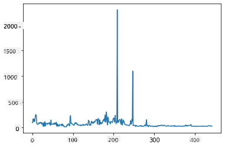
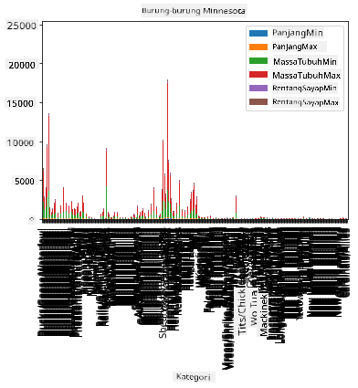

<!--
CO_OP_TRANSLATOR_METADATA:
{
  "original_hash": "69b32b6789a91f796ebc7a02f5575e03",
  "translation_date": "2025-09-04T20:37:33+00:00",
  "source_file": "3-Data-Visualization/09-visualization-quantities/README.md",
  "language_code": "id"
}
-->
# Visualisasi Kuantitas

| ](../../sketchnotes/09-Visualizing-Quantities.png)|
|:---:|
| Visualisasi Kuantitas - _Sketchnote oleh [@nitya](https://twitter.com/nitya)_ |

Dalam pelajaran ini, Anda akan mempelajari cara menggunakan salah satu dari banyak pustaka Python yang tersedia untuk membuat visualisasi menarik seputar konsep kuantitas. Dengan menggunakan dataset yang telah dibersihkan tentang burung-burung di Minnesota, Anda dapat mempelajari banyak fakta menarik tentang satwa liar lokal.

## [Kuis sebelum pelajaran](https://purple-hill-04aebfb03.1.azurestaticapps.net/quiz/16)

## Mengamati lebar sayap dengan Matplotlib

Pustaka yang sangat baik untuk membuat plot dan grafik sederhana maupun kompleks dari berbagai jenis adalah [Matplotlib](https://matplotlib.org/stable/index.html). Secara umum, proses memplot data menggunakan pustaka ini melibatkan identifikasi bagian dari dataframe yang ingin Anda targetkan, melakukan transformasi data yang diperlukan, menetapkan nilai sumbu x dan y, memutuskan jenis plot yang akan ditampilkan, dan kemudian menampilkan plot tersebut. Matplotlib menawarkan berbagai macam visualisasi, tetapi untuk pelajaran ini, mari fokus pada jenis yang paling sesuai untuk memvisualisasikan kuantitas: grafik garis, scatterplot, dan grafik batang.

> ✅ Gunakan grafik terbaik yang sesuai dengan struktur data Anda dan cerita yang ingin Anda sampaikan. 
> - Untuk menganalisis tren dari waktu ke waktu: garis
> - Untuk membandingkan nilai: batang, kolom, pie, scatterplot
> - Untuk menunjukkan bagaimana bagian-bagian berhubungan dengan keseluruhan: pie
> - Untuk menunjukkan distribusi data: scatterplot, batang
> - Untuk menunjukkan tren: garis, kolom
> - Untuk menunjukkan hubungan antar nilai: garis, scatterplot, bubble

Jika Anda memiliki dataset dan perlu mengetahui seberapa banyak suatu item tertentu termasuk, salah satu tugas pertama yang harus Anda lakukan adalah memeriksa nilainya.

✅ Ada banyak 'cheat sheet' yang sangat baik untuk Matplotlib [di sini](https://matplotlib.org/cheatsheets/cheatsheets.pdf).

## Membuat grafik garis tentang nilai lebar sayap burung

Buka file `notebook.ipynb` di root folder pelajaran ini dan tambahkan sel.

> Catatan: data disimpan di root repositori ini dalam folder `/data`.

```python
import pandas as pd
import matplotlib.pyplot as plt
birds = pd.read_csv('../../data/birds.csv')
birds.head()
```
Data ini adalah campuran teks dan angka:

|      | Nama                         | NamaIlmiah             | Kategori              | Ordo         | Famili   | Genus       | StatusKonservasi    | PanjangMin | PanjangMax | MassaTubuhMin | MassaTubuhMax | LebarSayapMin | LebarSayapMax |
| ---: | :--------------------------- | :--------------------- | :-------------------- | :----------- | :------- | :---------- | :----------------- | --------: | --------: | ----------: | ----------: | ----------: | ----------: |
|    0 | Black-bellied whistling-duck | Dendrocygna autumnalis | Bebek/Angsa/BurungAir | Anseriformes | Anatidae | Dendrocygna | LC                 |        47 |        56 |         652 |        1020 |          76 |          94 |
|    1 | Fulvous whistling-duck       | Dendrocygna bicolor    | Bebek/Angsa/BurungAir | Anseriformes | Anatidae | Dendrocygna | LC                 |        45 |        53 |         712 |        1050 |          85 |          93 |
|    2 | Snow goose                   | Anser caerulescens     | Bebek/Angsa/BurungAir | Anseriformes | Anatidae | Anser       | LC                 |        64 |        79 |        2050 |        4050 |         135 |         165 |
|    3 | Ross's goose                 | Anser rossii           | Bebek/Angsa/BurungAir | Anseriformes | Anatidae | Anser       | LC                 |      57.3 |        64 |        1066 |        1567 |         113 |         116 |
|    4 | Greater white-fronted goose  | Anser albifrons        | Bebek/Angsa/BurungAir | Anseriformes | Anatidae | Anser       | LC                 |        64 |        81 |        1930 |        3310 |         130 |         165 |

Mari mulai dengan memplot beberapa data numerik menggunakan grafik garis dasar. Misalnya, Anda ingin melihat lebar sayap maksimum dari burung-burung menarik ini.

```python
wingspan = birds['MaxWingspan'] 
wingspan.plot()
```


Apa yang langsung Anda perhatikan? Tampaknya ada setidaknya satu outlier - itu lebar sayap yang luar biasa! Lebar sayap 2300 sentimeter sama dengan 23 meter - apakah ada Pterodactyl yang berkeliaran di Minnesota? Mari kita selidiki.

Meskipun Anda bisa melakukan sort cepat di Excel untuk menemukan outlier tersebut, yang mungkin adalah kesalahan pengetikan, lanjutkan proses visualisasi dengan bekerja dari dalam plot.

Tambahkan label ke sumbu x untuk menunjukkan jenis burung yang dimaksud:

```
plt.title('Max Wingspan in Centimeters')
plt.ylabel('Wingspan (CM)')
plt.xlabel('Birds')
plt.xticks(rotation=45)
x = birds['Name'] 
y = birds['MaxWingspan']

plt.plot(x, y)

plt.show()
```


Bahkan dengan rotasi label diatur ke 45 derajat, terlalu banyak untuk dibaca. Mari coba strategi berbeda: beri label hanya pada outlier dan atur label di dalam grafik. Anda dapat menggunakan scatter chart untuk memberikan lebih banyak ruang bagi pelabelan:

```python
plt.title('Max Wingspan in Centimeters')
plt.ylabel('Wingspan (CM)')
plt.tick_params(axis='both',which='both',labelbottom=False,bottom=False)

for i in range(len(birds)):
    x = birds['Name'][i]
    y = birds['MaxWingspan'][i]
    plt.plot(x, y, 'bo')
    if birds['MaxWingspan'][i] > 500:
        plt.text(x, y * (1 - 0.05), birds['Name'][i], fontsize=12)
    
plt.show()
```
Apa yang terjadi di sini? Anda menggunakan `tick_params` untuk menyembunyikan label bawah dan kemudian membuat loop pada dataset burung Anda. Dengan memplot grafik menggunakan titik biru kecil dengan `bo`, Anda memeriksa setiap burung dengan lebar sayap maksimum lebih dari 500 dan menampilkan label mereka di sebelah titik jika demikian. Anda menggeser label sedikit pada sumbu y (`y * (1 - 0.05)`) dan menggunakan nama burung sebagai label.

Apa yang Anda temukan?


## Memfilter data Anda

Baik Bald Eagle maupun Prairie Falcon, meskipun mungkin burung yang sangat besar, tampaknya salah diberi label, dengan tambahan `0` pada lebar sayap maksimum mereka. Tidak mungkin Anda akan bertemu Bald Eagle dengan lebar sayap 25 meter, tetapi jika iya, beri tahu kami! Mari buat dataframe baru tanpa dua outlier tersebut:

```python
plt.title('Max Wingspan in Centimeters')
plt.ylabel('Wingspan (CM)')
plt.xlabel('Birds')
plt.tick_params(axis='both',which='both',labelbottom=False,bottom=False)
for i in range(len(birds)):
    x = birds['Name'][i]
    y = birds['MaxWingspan'][i]
    if birds['Name'][i] not in ['Bald eagle', 'Prairie falcon']:
        plt.plot(x, y, 'bo')
plt.show()
```

Dengan memfilter outlier, data Anda sekarang lebih kohesif dan dapat dipahami.


Sekarang kita memiliki dataset yang lebih bersih setidaknya dalam hal lebar sayap, mari temukan lebih banyak tentang burung-burung ini.

Meskipun grafik garis dan scatter plot dapat menampilkan informasi tentang nilai data dan distribusinya, kita ingin memikirkan nilai-nilai yang melekat dalam dataset ini. Anda dapat membuat visualisasi untuk menjawab pertanyaan berikut tentang kuantitas:

> Berapa banyak kategori burung yang ada, dan berapa jumlahnya?
> Berapa banyak burung yang punah, terancam, langka, atau umum?
> Berapa banyak genus dan ordo dalam terminologi Linnaeus?

## Mengeksplorasi grafik batang

Grafik batang praktis ketika Anda perlu menunjukkan pengelompokan data. Mari eksplorasi kategori burung yang ada dalam dataset ini untuk melihat mana yang paling umum berdasarkan jumlah.

Dalam file notebook, buat grafik batang dasar.

✅ Catatan, Anda dapat memfilter dua burung outlier yang kami identifikasi di bagian sebelumnya, mengedit kesalahan pada lebar sayap mereka, atau membiarkan mereka tetap ada untuk latihan ini yang tidak bergantung pada nilai lebar sayap.

Jika Anda ingin membuat grafik batang, Anda dapat memilih data yang ingin Anda fokuskan. Grafik batang dapat dibuat dari data mentah:

```python
birds.plot(x='Category',
        kind='bar',
        stacked=True,
        title='Birds of Minnesota')

```


Namun, grafik batang ini tidak dapat dibaca karena terlalu banyak data yang tidak dikelompokkan. Anda perlu memilih hanya data yang ingin Anda plot, jadi mari lihat panjang burung berdasarkan kategori mereka.

Filter data Anda untuk hanya menyertakan kategori burung.

✅ Perhatikan bahwa Anda menggunakan Pandas untuk mengelola data, dan kemudian membiarkan Matplotlib melakukan pemetaan grafik.

Karena ada banyak kategori, Anda dapat menampilkan grafik ini secara vertikal dan menyesuaikan tingginya untuk mengakomodasi semua data:

```python
category_count = birds.value_counts(birds['Category'].values, sort=True)
plt.rcParams['figure.figsize'] = [6, 12]
category_count.plot.barh()
```


Grafik batang ini menunjukkan pandangan yang baik tentang jumlah burung dalam setiap kategori. Sekilas, Anda melihat bahwa jumlah burung terbesar di wilayah ini berada dalam kategori Bebek/Angsa/BurungAir. Minnesota adalah 'tanah 10.000 danau', jadi ini tidak mengejutkan!

✅ Coba beberapa hitungan lain pada dataset ini. Apakah ada yang mengejutkan Anda?

## Membandingkan data

Anda dapat mencoba perbandingan data yang dikelompokkan dengan membuat sumbu baru. Coba perbandingan PanjangMax burung, berdasarkan kategorinya:

```python
maxlength = birds['MaxLength']
plt.barh(y=birds['Category'], width=maxlength)
plt.rcParams['figure.figsize'] = [6, 12]
plt.show()
```


Tidak ada yang mengejutkan di sini: burung kolibri memiliki PanjangMax paling kecil dibandingkan dengan Pelikan atau Angsa. Bagus ketika data masuk akal secara logis!

Anda dapat membuat visualisasi grafik batang yang lebih menarik dengan menumpangkan data. Mari tumpangkan Panjang Minimum dan Panjang Maksimum pada kategori burung tertentu:

```python
minLength = birds['MinLength']
maxLength = birds['MaxLength']
category = birds['Category']

plt.barh(category, maxLength)
plt.barh(category, minLength)

plt.show()
```
Dalam plot ini, Anda dapat melihat rentang per kategori burung dari Panjang Minimum dan Panjang Maksimum. Anda dapat dengan aman mengatakan bahwa, berdasarkan data ini, semakin besar burung, semakin besar rentang panjangnya. Menarik!


## 🚀 Tantangan

Dataset burung ini menawarkan banyak informasi tentang berbagai jenis burung dalam ekosistem tertentu. Cari di internet dan lihat apakah Anda dapat menemukan dataset lain yang berorientasi pada burung. Latihlah membuat grafik dan diagram tentang burung-burung ini untuk menemukan fakta yang tidak Anda sadari.

## [Kuis setelah pelajaran](https://ff-quizzes.netlify.app/en/ds/)

## Tinjauan & Studi Mandiri

Pelajaran pertama ini telah memberikan Anda beberapa informasi tentang cara menggunakan Matplotlib untuk memvisualisasikan kuantitas. Lakukan penelitian tentang cara lain untuk bekerja dengan dataset untuk visualisasi. [Plotly](https://github.com/plotly/plotly.py) adalah salah satu yang tidak akan kita bahas dalam pelajaran ini, jadi lihatlah apa yang dapat ditawarkannya.

## Tugas

[Lines, Scatters, and Bars](assignment.md)

---

**Penafian**:  
Dokumen ini telah diterjemahkan menggunakan layanan penerjemahan AI [Co-op Translator](https://github.com/Azure/co-op-translator). Meskipun kami berupaya untuk memberikan hasil yang akurat, harap diperhatikan bahwa terjemahan otomatis mungkin mengandung kesalahan atau ketidakakuratan. Dokumen asli dalam bahasa aslinya harus dianggap sebagai sumber yang berwenang. Untuk informasi yang bersifat kritis, disarankan menggunakan jasa penerjemahan manusia profesional. Kami tidak bertanggung jawab atas kesalahpahaman atau penafsiran yang keliru yang timbul dari penggunaan terjemahan ini.