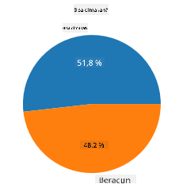
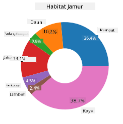
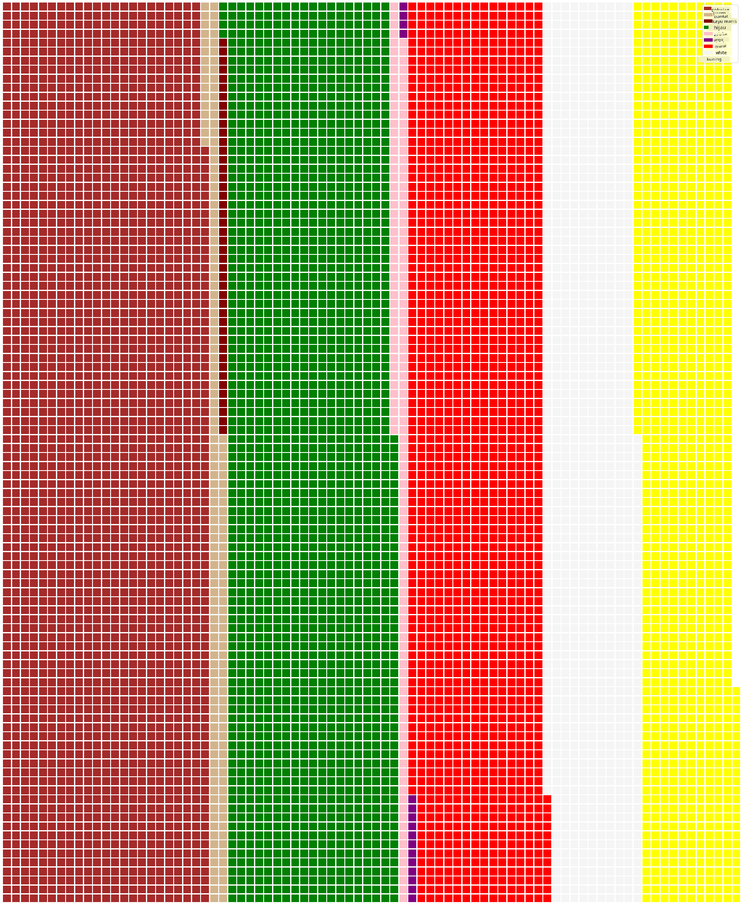

<!--
CO_OP_TRANSLATOR_METADATA:
{
  "original_hash": "cc490897ee2d276870472bcb31602d03",
  "translation_date": "2025-09-04T20:36:38+00:00",
  "source_file": "3-Data-Visualization/11-visualization-proportions/README.md",
  "language_code": "id"
}
-->
# Memvisualisasikan Proporsi

|](../../sketchnotes/11-Visualizing-Proportions.png)|
|:---:|
|Memvisualisasikan Proporsi - _Sketchnote oleh [@nitya](https://twitter.com/nitya)_|

Dalam pelajaran ini, Anda akan menggunakan dataset bertema alam untuk memvisualisasikan proporsi, seperti berapa banyak jenis jamur yang terdapat dalam dataset tertentu tentang jamur. Mari kita eksplorasi jamur yang menarik ini menggunakan dataset dari Audubon yang mencantumkan detail tentang 23 spesies jamur berinsang dalam keluarga Agaricus dan Lepiota. Anda akan bereksperimen dengan visualisasi menarik seperti:

- Diagram lingkaran 🥧
- Diagram donat 🍩
- Diagram waffle 🧇

> 💡 Sebuah proyek menarik bernama [Charticulator](https://charticulator.com) oleh Microsoft Research menawarkan antarmuka drag-and-drop gratis untuk visualisasi data. Dalam salah satu tutorialnya, mereka juga menggunakan dataset jamur ini! Jadi Anda bisa mengeksplorasi data sekaligus mempelajari pustaka tersebut: [Tutorial Charticulator](https://charticulator.com/tutorials/tutorial4.html).

## [Kuis setelah pelajaran](https://ff-quizzes.netlify.app/en/ds/)

## Mengenal Jamur Anda 🍄

Jamur sangat menarik. Mari kita impor dataset untuk mempelajarinya:

```python
import pandas as pd
import matplotlib.pyplot as plt
mushrooms = pd.read_csv('../../data/mushrooms.csv')
mushrooms.head()
```
Sebuah tabel dicetak dengan beberapa data yang bagus untuk dianalisis:

| class     | cap-shape | cap-surface | cap-color | bruises | odor    | gill-attachment | gill-spacing | gill-size | gill-color | stalk-shape | stalk-root | stalk-surface-above-ring | stalk-surface-below-ring | stalk-color-above-ring | stalk-color-below-ring | veil-type | veil-color | ring-number | ring-type | spore-print-color | population | habitat |
| --------- | --------- | ----------- | --------- | ------- | ------- | --------------- | ------------ | --------- | ---------- | ----------- | ---------- | ------------------------ | ------------------------ | ---------------------- | ---------------------- | --------- | ---------- | ----------- | --------- | ----------------- | ---------- | ------- |
| Beracun   | Cembung   | Halus       | Cokelat   | Memar   | Menyengat | Bebas          | Rapat        | Sempit    | Hitam      | Membesar    | Sama       | Halus                   | Halus                   | Putih                  | Putih                  | Parsial   | Putih      | Satu        | Gantung   | Hitam             | Tersebar   | Perkotaan |
| Dapat Dimakan | Cembung | Halus      | Kuning    | Memar   | Almond  | Bebas           | Rapat        | Lebar     | Hitam      | Membesar    | Klub       | Halus                   | Halus                   | Putih                  | Putih                  | Parsial   | Putih      | Satu        | Gantung   | Cokelat           | Banyak     | Rumput |
| Dapat Dimakan | Lonceng | Halus      | Putih     | Memar   | Adas Manis | Bebas         | Rapat        | Lebar     | Cokelat    | Membesar    | Klub       | Halus                   | Halus                   | Putih                  | Putih                  | Parsial   | Putih      | Satu        | Gantung   | Cokelat           | Banyak     | Padang Rumput |
| Beracun   | Cembung   | Bersisik    | Putih     | Memar   | Menyengat | Bebas          | Rapat        | Sempit    | Cokelat    | Membesar    | Sama       | Halus                   | Halus                   | Putih                  | Putih                  | Parsial   | Putih      | Satu        | Gantung   | Hitam             | Tersebar   | Perkotaan |

Langsung terlihat bahwa semua data berbentuk teks. Anda harus mengonversi data ini agar dapat digunakan dalam diagram. Sebagian besar data, pada kenyataannya, direpresentasikan sebagai objek:

```python
print(mushrooms.select_dtypes(["object"]).columns)
```

Hasilnya adalah:

```output
Index(['class', 'cap-shape', 'cap-surface', 'cap-color', 'bruises', 'odor',
       'gill-attachment', 'gill-spacing', 'gill-size', 'gill-color',
       'stalk-shape', 'stalk-root', 'stalk-surface-above-ring',
       'stalk-surface-below-ring', 'stalk-color-above-ring',
       'stalk-color-below-ring', 'veil-type', 'veil-color', 'ring-number',
       'ring-type', 'spore-print-color', 'population', 'habitat'],
      dtype='object')
```
Ambil data ini dan ubah kolom 'class' menjadi kategori:

```python
cols = mushrooms.select_dtypes(["object"]).columns
mushrooms[cols] = mushrooms[cols].astype('category')
```

```python
edibleclass=mushrooms.groupby(['class']).count()
edibleclass
```

Sekarang, jika Anda mencetak data jamur, Anda dapat melihat bahwa data tersebut telah dikelompokkan ke dalam kategori berdasarkan kelas beracun/dapat dimakan:

|           | cap-shape | cap-surface | cap-color | bruises | odor | gill-attachment | gill-spacing | gill-size | gill-color | stalk-shape | ... | stalk-surface-below-ring | stalk-color-above-ring | stalk-color-below-ring | veil-type | veil-color | ring-number | ring-type | spore-print-color | population | habitat |
| --------- | --------- | ----------- | --------- | ------- | ---- | --------------- | ------------ | --------- | ---------- | ----------- | --- | ------------------------ | ---------------------- | ---------------------- | --------- | ---------- | ----------- | --------- | ----------------- | ---------- | ------- |
| class     |           |             |           |         |      |                 |              |           |            |             |     |                          |                        |                        |           |            |             |           |                   |            |         |
| Dapat Dimakan | 4208  | 4208        | 4208      | 4208    | 4208 | 4208            | 4208         | 4208      | 4208       | 4208        | ... | 4208                     | 4208                   | 4208                   | 4208      | 4208       | 4208        | 4208      | 4208              | 4208       | 4208    |
| Beracun   | 3916      | 3916        | 3916      | 3916    | 3916 | 3916            | 3916         | 3916      | 3916       | 3916        | ... | 3916                     | 3916                   | 3916                   | 3916      | 3916       | 3916        | 3916      | 3916              | 3916       | 3916    |

Jika Anda mengikuti urutan yang disajikan dalam tabel ini untuk membuat label kategori kelas Anda, Anda dapat membuat diagram lingkaran:

## Lingkaran!

```python
labels=['Edible','Poisonous']
plt.pie(edibleclass['population'],labels=labels,autopct='%.1f %%')
plt.title('Edible?')
plt.show()
```
Voila, sebuah diagram lingkaran yang menunjukkan proporsi data ini berdasarkan dua kelas jamur tersebut. Sangat penting untuk memastikan urutan label benar, terutama di sini, jadi pastikan untuk memverifikasi urutan saat membangun array label!



## Donat!

Diagram lingkaran yang sedikit lebih menarik secara visual adalah diagram donat, yaitu diagram lingkaran dengan lubang di tengah. Mari kita lihat data kita menggunakan metode ini.

Lihat berbagai habitat tempat jamur tumbuh:

```python
habitat=mushrooms.groupby(['habitat']).count()
habitat
```
Di sini, Anda mengelompokkan data berdasarkan habitat. Ada 7 habitat yang tercantum, jadi gunakan itu sebagai label untuk diagram donat Anda:

```python
labels=['Grasses','Leaves','Meadows','Paths','Urban','Waste','Wood']

plt.pie(habitat['class'], labels=labels,
        autopct='%1.1f%%', pctdistance=0.85)
  
center_circle = plt.Circle((0, 0), 0.40, fc='white')
fig = plt.gcf()

fig.gca().add_artist(center_circle)
  
plt.title('Mushroom Habitats')
  
plt.show()
```



Kode ini menggambar diagram dan lingkaran tengah, lalu menambahkan lingkaran tengah tersebut ke dalam diagram. Ubah lebar lingkaran tengah dengan mengubah `0.40` ke nilai lain.

Diagram donat dapat disesuaikan dalam berbagai cara untuk mengubah label. Label khususnya dapat disorot untuk meningkatkan keterbacaan. Pelajari lebih lanjut di [dokumentasi](https://matplotlib.org/stable/gallery/pie_and_polar_charts/pie_and_donut_labels.html?highlight=donut).

Sekarang setelah Anda tahu cara mengelompokkan data dan menampilkannya sebagai lingkaran atau donat, Anda dapat mengeksplorasi jenis diagram lainnya. Cobalah diagram waffle, yang merupakan cara berbeda untuk mengeksplorasi kuantitas.

## Waffle!

Diagram tipe 'waffle' adalah cara berbeda untuk memvisualisasikan kuantitas sebagai array 2D dari kotak-kotak. Cobalah memvisualisasikan jumlah warna topi jamur yang berbeda dalam dataset ini. Untuk melakukannya, Anda perlu menginstal pustaka pembantu bernama [PyWaffle](https://pypi.org/project/pywaffle/) dan menggunakan Matplotlib:

```python
pip install pywaffle
```

Pilih segmen data Anda untuk dikelompokkan:

```python
capcolor=mushrooms.groupby(['cap-color']).count()
capcolor
```

Buat diagram waffle dengan membuat label dan kemudian mengelompokkan data Anda:

```python
import pandas as pd
import matplotlib.pyplot as plt
from pywaffle import Waffle
  
data ={'color': ['brown', 'buff', 'cinnamon', 'green', 'pink', 'purple', 'red', 'white', 'yellow'],
    'amount': capcolor['class']
     }
  
df = pd.DataFrame(data)
  
fig = plt.figure(
    FigureClass = Waffle,
    rows = 100,
    values = df.amount,
    labels = list(df.color),
    figsize = (30,30),
    colors=["brown", "tan", "maroon", "green", "pink", "purple", "red", "whitesmoke", "yellow"],
)
```

Menggunakan diagram waffle, Anda dapat dengan jelas melihat proporsi warna topi dalam dataset jamur ini. Menariknya, ada banyak jamur dengan topi hijau!



✅ PyWaffle mendukung ikon dalam diagram yang menggunakan ikon apa pun yang tersedia di [Font Awesome](https://fontawesome.com/). Lakukan beberapa eksperimen untuk membuat diagram waffle yang lebih menarik menggunakan ikon alih-alih kotak.

Dalam pelajaran ini, Anda mempelajari tiga cara untuk memvisualisasikan proporsi. Pertama, Anda perlu mengelompokkan data Anda ke dalam kategori dan kemudian memutuskan cara terbaik untuk menampilkan data tersebut - lingkaran, donat, atau waffle. Semuanya menarik dan memberikan gambaran instan tentang dataset kepada pengguna.

## 🚀 Tantangan

Cobalah membuat ulang diagram menarik ini di [Charticulator](https://charticulator.com).
## [Kuis setelah pelajaran](https://purple-hill-04aebfb03.1.azurestaticapps.net/quiz/21)

## Tinjauan & Studi Mandiri

Terkadang tidak jelas kapan harus menggunakan diagram lingkaran, donat, atau waffle. Berikut beberapa artikel untuk dibaca tentang topik ini:

https://www.beautiful.ai/blog/battle-of-the-charts-pie-chart-vs-donut-chart

https://medium.com/@hypsypops/pie-chart-vs-donut-chart-showdown-in-the-ring-5d24fd86a9ce

https://www.mit.edu/~mbarker/formula1/f1help/11-ch-c6.htm

https://medium.datadriveninvestor.com/data-visualization-done-the-right-way-with-tableau-waffle-chart-fdf2a19be402

Lakukan penelitian untuk menemukan lebih banyak informasi tentang keputusan yang membingungkan ini.

## Tugas

[Cobalah di Excel](assignment.md)

---

**Penafian**:  
Dokumen ini telah diterjemahkan menggunakan layanan terjemahan AI [Co-op Translator](https://github.com/Azure/co-op-translator). Meskipun kami berupaya untuk memberikan hasil yang akurat, harap diperhatikan bahwa terjemahan otomatis mungkin mengandung kesalahan atau ketidakakuratan. Dokumen asli dalam bahasa aslinya harus dianggap sebagai sumber yang berwenang. Untuk informasi yang bersifat kritis, disarankan menggunakan jasa penerjemah manusia profesional. Kami tidak bertanggung jawab atas kesalahpahaman atau penafsiran yang keliru yang timbul dari penggunaan terjemahan ini.