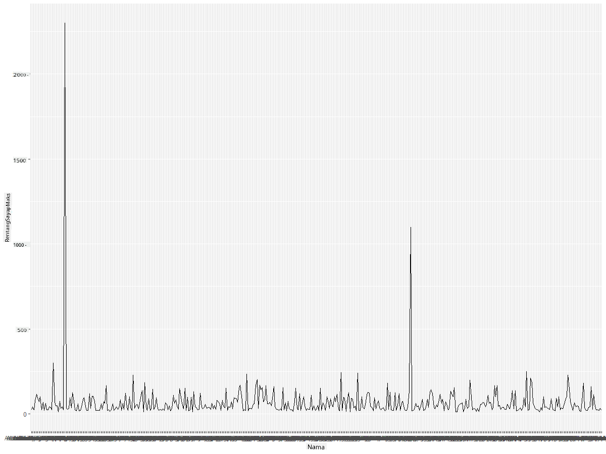
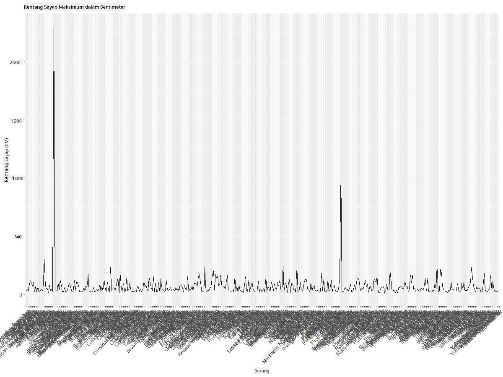
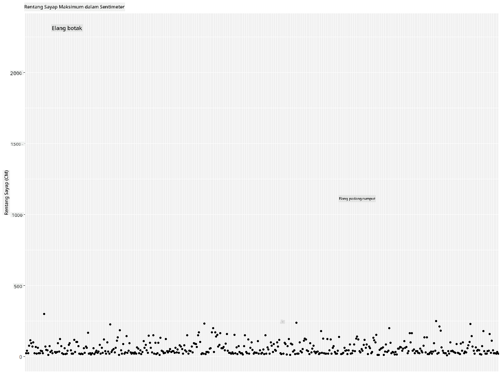
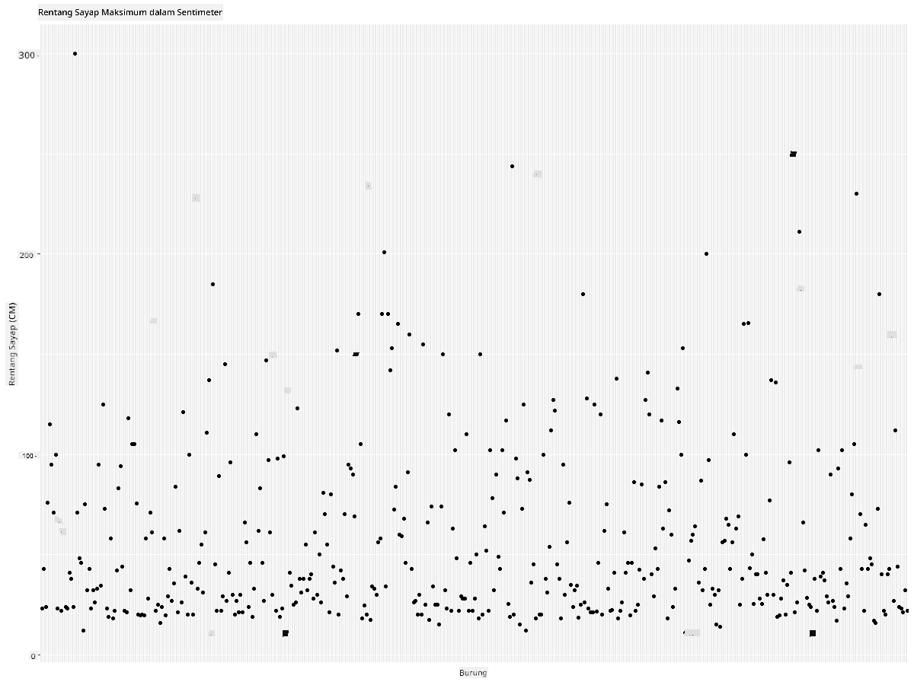
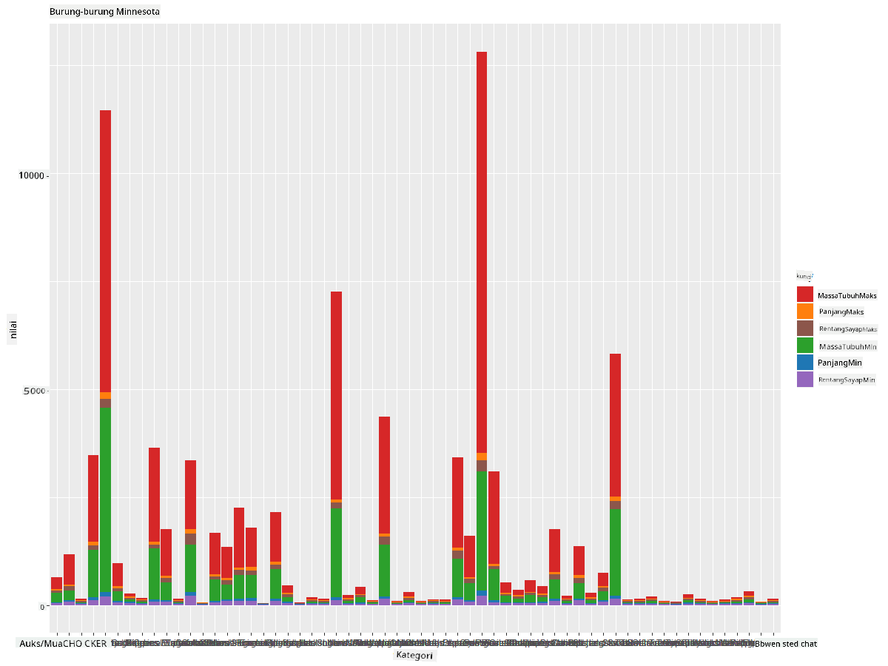
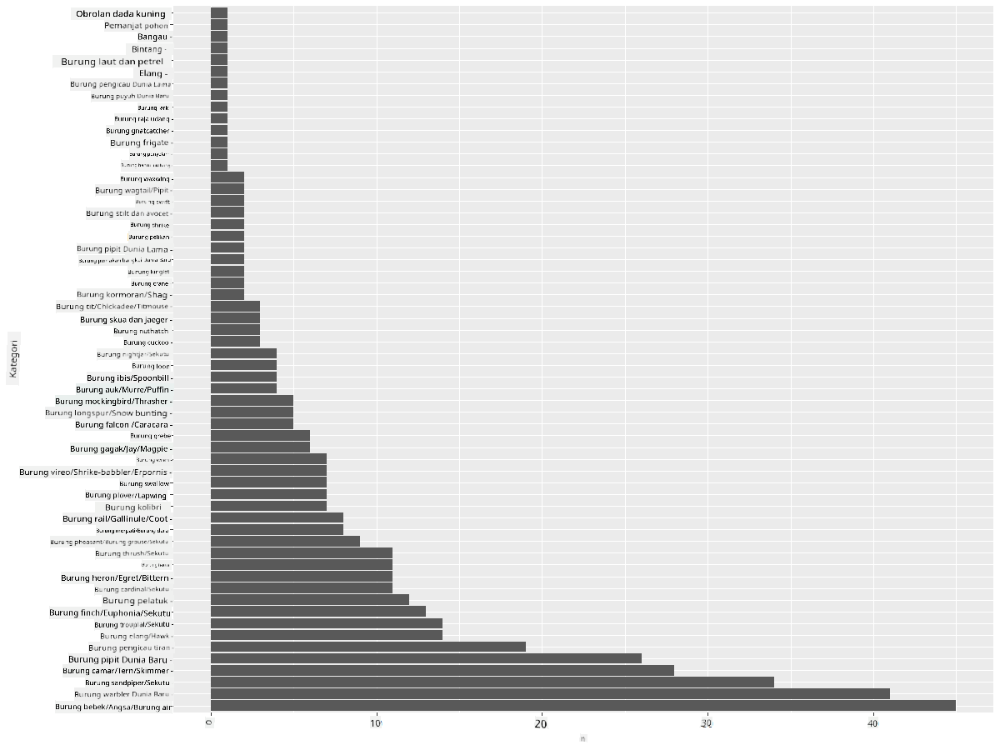
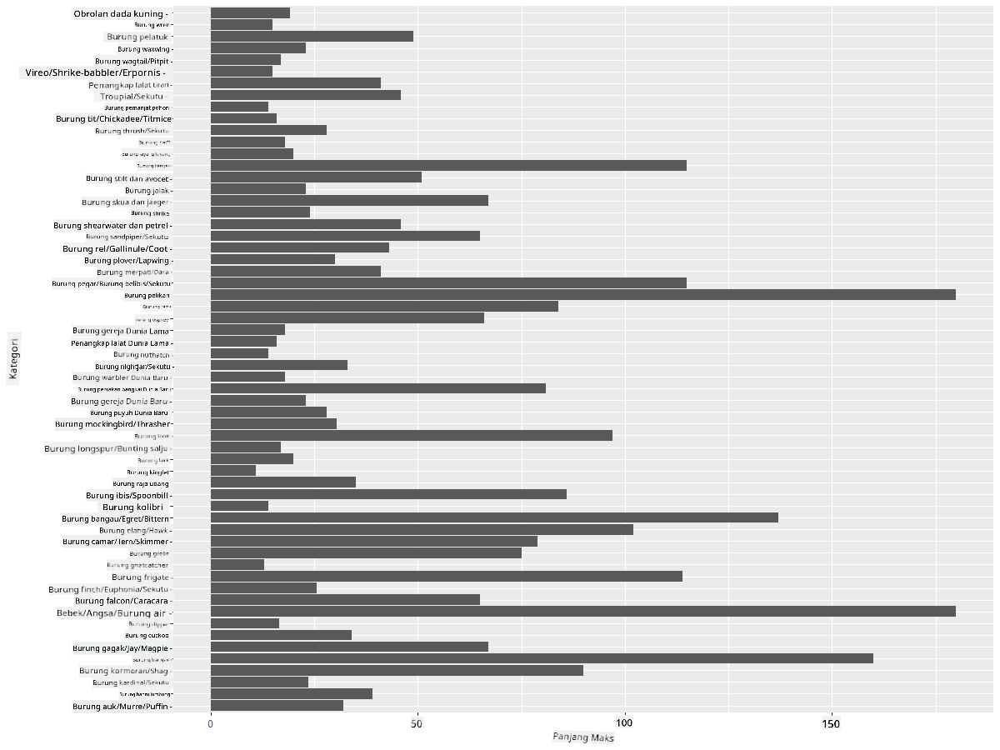
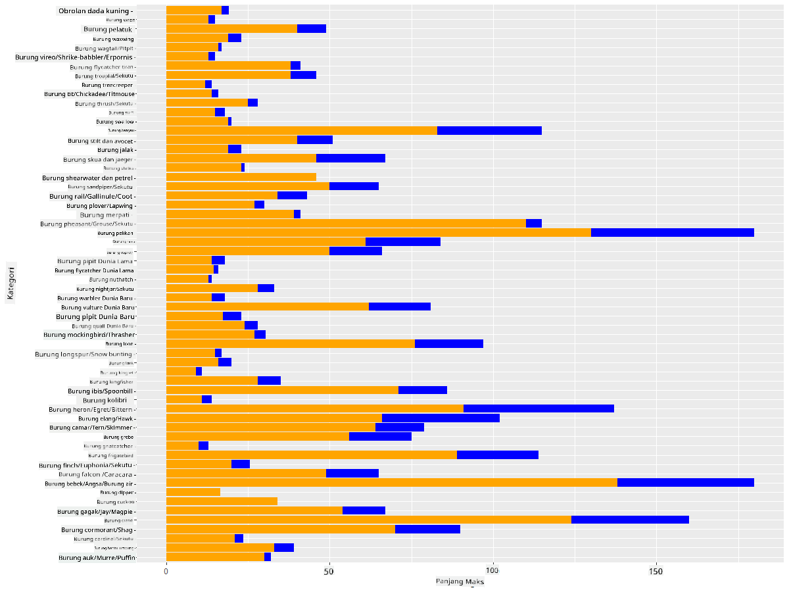

<!--
CO_OP_TRANSLATOR_METADATA:
{
  "original_hash": "22acf28f518a4769ea14fa42f4734b9f",
  "translation_date": "2025-08-28T18:31:26+00:00",
  "source_file": "3-Data-Visualization/R/09-visualization-quantities/README.md",
  "language_code": "id"
}
-->
# Visualisasi Kuantitas
| ](https://github.com/microsoft/Data-Science-For-Beginners/blob/main/sketchnotes/09-Visualizing-Quantities.png)|
|:---:|
| Visualisasi Kuantitas - _Sketchnote oleh [@nitya](https://twitter.com/nitya)_ |

Dalam pelajaran ini, Anda akan mempelajari cara menggunakan beberapa pustaka paket R yang tersedia untuk membuat visualisasi menarik seputar konsep kuantitas. Dengan menggunakan dataset yang telah dibersihkan tentang burung-burung di Minnesota, Anda dapat mempelajari banyak fakta menarik tentang satwa liar lokal.  
## [Kuis sebelum pelajaran](https://purple-hill-04aebfb03.1.azurestaticapps.net/quiz/16)

## Mengamati lebar sayap dengan ggplot2
Pustaka yang sangat baik untuk membuat plot dan grafik sederhana maupun kompleks dari berbagai jenis adalah [ggplot2](https://cran.r-project.org/web/packages/ggplot2/index.html). Secara umum, proses memplot data menggunakan pustaka ini melibatkan identifikasi bagian dari dataframe yang ingin Anda targetkan, melakukan transformasi data yang diperlukan, menetapkan nilai sumbu x dan y, memutuskan jenis plot yang akan ditampilkan, dan kemudian menampilkan plot tersebut.

`ggplot2` adalah sistem untuk membuat grafik secara deklaratif, berdasarkan The Grammar of Graphics. [Grammar of Graphics](https://en.wikipedia.org/wiki/Ggplot2) adalah skema umum untuk visualisasi data yang memecah grafik menjadi komponen semantik seperti skala dan lapisan. Dengan kata lain, kemudahan membuat plot dan grafik untuk data univariat atau multivariat dengan sedikit kode menjadikan `ggplot2` paket paling populer yang digunakan untuk visualisasi di R. Pengguna memberi tahu `ggplot2` cara memetakan variabel ke estetika, primitif grafis yang akan digunakan, dan `ggplot2` mengurus sisanya.

> ✅ Plot = Data + Estetika + Geometri  
> - Data mengacu pada dataset  
> - Estetika menunjukkan variabel yang akan dipelajari (variabel x dan y)  
> - Geometri mengacu pada jenis plot (plot garis, plot batang, dll.)  

Pilih geometri terbaik (jenis plot) sesuai dengan data Anda dan cerita yang ingin Anda sampaikan melalui plot.  

> - Untuk menganalisis tren: garis, kolom  
> - Untuk membandingkan nilai: batang, kolom, pie, scatterplot  
> - Untuk menunjukkan bagaimana bagian-bagian berhubungan dengan keseluruhan: pie  
> - Untuk menunjukkan distribusi data: scatterplot, batang  
> - Untuk menunjukkan hubungan antar nilai: garis, scatterplot, bubble  

✅ Anda juga dapat melihat [cheatsheet](https://nyu-cdsc.github.io/learningr/assets/data-visualization-2.1.pdf) deskriptif ini untuk ggplot2.

## Membuat plot garis tentang nilai lebar sayap burung

Buka konsol R dan impor dataset.  
> Catatan: Dataset disimpan di root repositori ini dalam folder `/data`.

Mari kita impor dataset dan amati bagian atas (5 baris pertama) data.

```r
birds <- read.csv("../../data/birds.csv",fileEncoding="UTF-8-BOM")
head(birds)
```  
Bagian atas data memiliki campuran teks dan angka:

|      | Nama                         | NamaIlmiah             | Kategori              | Ordo         | Famili   | Genus       | StatusKonservasi    | PanjangMin | PanjangMax | MassaTubuhMin | MassaTubuhMax | LebarSayapMin | LebarSayapMax |
| ---: | :--------------------------- | :--------------------- | :-------------------- | :----------- | :------- | :---------- | :----------------- | --------: | --------: | ----------: | ----------: | ----------: | ----------: |
|    0 | Black-bellied whistling-duck | Dendrocygna autumnalis | Bebek/Angsa/BurungAir | Anseriformes | Anatidae | Dendrocygna | LC                 |        47 |        56 |         652 |        1020 |          76 |          94 |
|    1 | Fulvous whistling-duck       | Dendrocygna bicolor    | Bebek/Angsa/BurungAir | Anseriformes | Anatidae | Dendrocygna | LC                 |        45 |        53 |         712 |        1050 |          85 |          93 |
|    2 | Snow goose                   | Anser caerulescens     | Bebek/Angsa/BurungAir | Anseriformes | Anatidae | Anser       | LC                 |        64 |        79 |        2050 |        4050 |         135 |         165 |
|    3 | Ross's goose                 | Anser rossii           | Bebek/Angsa/BurungAir | Anseriformes | Anatidae | Anser       | LC                 |      57.3 |        64 |        1066 |        1567 |         113 |         116 |
|    4 | Greater white-fronted goose  | Anser albifrons        | Bebek/Angsa/BurungAir | Anseriformes | Anatidae | Anser       | LC                 |        64 |        81 |        1930 |        3310 |         130 |         165 |

Mari kita mulai dengan memplot beberapa data numerik menggunakan plot garis dasar. Misalnya, Anda ingin melihat lebar sayap maksimum untuk burung-burung menarik ini.

```r
install.packages("ggplot2")
library("ggplot2")
ggplot(data=birds, aes(x=Name, y=MaxWingspan,group=1)) +
  geom_line() 
```  
Di sini, Anda menginstal paket `ggplot2` dan kemudian mengimpornya ke dalam workspace menggunakan perintah `library("ggplot2")`. Untuk memplot grafik apa pun di ggplot, fungsi `ggplot()` digunakan dan Anda menentukan dataset, variabel x dan y sebagai atribut. Dalam kasus ini, kita menggunakan fungsi `geom_line()` karena kita ingin memplot grafik garis.



Apa yang Anda perhatikan segera? Tampaknya ada setidaknya satu outlier - itu lebar sayap yang luar biasa! Lebar sayap lebih dari 2000+ sentimeter sama dengan lebih dari 20 meter - apakah ada Pterodactyl yang berkeliaran di Minnesota? Mari kita selidiki.

Meskipun Anda dapat melakukan pengurutan cepat di Excel untuk menemukan outlier tersebut, yang mungkin adalah kesalahan pengetikan, lanjutkan proses visualisasi dengan bekerja dari dalam plot.

Tambahkan label ke sumbu x untuk menunjukkan jenis burung yang dimaksud:

```r
ggplot(data=birds, aes(x=Name, y=MaxWingspan,group=1)) +
  geom_line() +
  theme(axis.text.x = element_text(angle = 45, hjust=1))+
  xlab("Birds") +
  ylab("Wingspan (CM)") +
  ggtitle("Max Wingspan in Centimeters")
```  
Kami menentukan sudut dalam `theme` dan menentukan label sumbu x dan y dalam `xlab()` dan `ylab()` masing-masing. `ggtitle()` memberikan nama pada grafik/plot.



Bahkan dengan rotasi label yang diatur ke 45 derajat, masih terlalu banyak untuk dibaca. Mari coba strategi yang berbeda: hanya beri label pada outlier dan atur label di dalam grafik. Anda dapat menggunakan grafik scatter untuk memberikan lebih banyak ruang untuk pelabelan:

```r
ggplot(data=birds, aes(x=Name, y=MaxWingspan,group=1)) +
  geom_point() +
  geom_text(aes(label=ifelse(MaxWingspan>500,as.character(Name),'')),hjust=0,vjust=0) + 
  theme(axis.title.x=element_blank(), axis.text.x=element_blank(), axis.ticks.x=element_blank())
  ylab("Wingspan (CM)") +
  ggtitle("Max Wingspan in Centimeters") + 
```  
Apa yang terjadi di sini? Anda menggunakan fungsi `geom_point()` untuk memplot titik-titik scatter. Dengan ini, Anda menambahkan label untuk burung yang memiliki `MaxWingspan > 500` dan juga menyembunyikan label pada sumbu x untuk mengurangi kekacauan pada plot.

Apa yang Anda temukan?



## Memfilter data Anda

Baik Bald Eagle maupun Prairie Falcon, meskipun mungkin burung yang sangat besar, tampaknya salah diberi label, dengan tambahan angka 0 pada lebar sayap maksimum mereka. Tidak mungkin Anda akan bertemu Bald Eagle dengan lebar sayap 25 meter, tetapi jika iya, beri tahu kami! Mari buat dataframe baru tanpa dua outlier tersebut:

```r
birds_filtered <- subset(birds, MaxWingspan < 500)

ggplot(data=birds_filtered, aes(x=Name, y=MaxWingspan,group=1)) +
  geom_point() +
  ylab("Wingspan (CM)") +
  xlab("Birds") +
  ggtitle("Max Wingspan in Centimeters") + 
  geom_text(aes(label=ifelse(MaxWingspan>500,as.character(Name),'')),hjust=0,vjust=0) +
  theme(axis.text.x=element_blank(), axis.ticks.x=element_blank())
```  
Kami membuat dataframe baru `birds_filtered` dan kemudian memplot grafik scatter. Dengan memfilter outlier, data Anda sekarang lebih kohesif dan dapat dipahami.



Sekarang kita memiliki dataset yang lebih bersih setidaknya dalam hal lebar sayap, mari kita temukan lebih banyak tentang burung-burung ini.

Meskipun grafik garis dan scatter dapat menampilkan informasi tentang nilai data dan distribusinya, kita ingin memikirkan nilai-nilai yang melekat dalam dataset ini. Anda dapat membuat visualisasi untuk menjawab pertanyaan berikut tentang kuantitas:

> Berapa banyak kategori burung yang ada, dan berapa jumlahnya?  
> Berapa banyak burung yang punah, terancam, langka, atau umum?  
> Berapa banyak genus dan ordo yang ada dalam terminologi Linnaeus?  
## Mengeksplorasi grafik batang

Grafik batang praktis ketika Anda perlu menunjukkan pengelompokan data. Mari kita eksplorasi kategori burung yang ada dalam dataset ini untuk melihat mana yang paling umum berdasarkan jumlah.  
Mari kita buat grafik batang pada data yang telah difilter.

```r
install.packages("dplyr")
install.packages("tidyverse")

library(lubridate)
library(scales)
library(dplyr)
library(ggplot2)
library(tidyverse)

birds_filtered %>% group_by(Category) %>%
  summarise(n=n(),
  MinLength = mean(MinLength),
  MaxLength = mean(MaxLength),
  MinBodyMass = mean(MinBodyMass),
  MaxBodyMass = mean(MaxBodyMass),
  MinWingspan=mean(MinWingspan),
  MaxWingspan=mean(MaxWingspan)) %>% 
  gather("key", "value", - c(Category, n)) %>%
  ggplot(aes(x = Category, y = value, group = key, fill = key)) +
  geom_bar(stat = "identity") +
  scale_fill_manual(values = c("#D62728", "#FF7F0E", "#8C564B","#2CA02C", "#1F77B4", "#9467BD")) +                   
  xlab("Category")+ggtitle("Birds of Minnesota")

```  
Dalam cuplikan berikut, kami menginstal paket [dplyr](https://www.rdocumentation.org/packages/dplyr/versions/0.7.8) dan [lubridate](https://www.rdocumentation.org/packages/lubridate/versions/1.8.0) untuk membantu memanipulasi dan mengelompokkan data guna memplot grafik batang bertumpuk. Pertama, Anda mengelompokkan data berdasarkan `Category` burung dan kemudian merangkum kolom `MinLength`, `MaxLength`, `MinBodyMass`, `MaxBodyMass`, `MinWingspan`, `MaxWingspan`. Kemudian, plot grafik batang menggunakan paket `ggplot2` dan tentukan warna untuk kategori yang berbeda serta labelnya.



Namun, grafik batang ini tidak dapat dibaca karena terlalu banyak data yang tidak dikelompokkan. Anda perlu memilih hanya data yang ingin Anda plot, jadi mari kita lihat panjang burung berdasarkan kategorinya.

Filter data Anda untuk hanya menyertakan kategori burung.

Karena ada banyak kategori, Anda dapat menampilkan grafik ini secara vertikal dan menyesuaikan tingginya untuk mengakomodasi semua data:

```r
birds_count<-dplyr::count(birds_filtered, Category, sort = TRUE)
birds_count$Category <- factor(birds_count$Category, levels = birds_count$Category)
ggplot(birds_count,aes(Category,n))+geom_bar(stat="identity")+coord_flip()
```  
Anda pertama-tama menghitung nilai unik dalam kolom `Category` dan kemudian mengurutkannya ke dalam dataframe baru `birds_count`. Data yang diurutkan ini kemudian difaktorkan pada level yang sama sehingga dapat diplot dengan cara yang diurutkan. Menggunakan `ggplot2` Anda kemudian memplot data dalam grafik batang. `coord_flip()` memplot batang horizontal.



Grafik batang ini menunjukkan pandangan yang baik tentang jumlah burung dalam setiap kategori. Sekilas, Anda melihat bahwa jumlah burung terbesar di wilayah ini berada dalam kategori Bebek/Angsa/BurungAir. Minnesota adalah 'tanah 10.000 danau' jadi ini tidak mengejutkan!

✅ Coba beberapa hitungan lain pada dataset ini. Apakah ada yang mengejutkan Anda?

## Membandingkan data

Anda dapat mencoba berbagai perbandingan data yang dikelompokkan dengan membuat sumbu baru. Coba perbandingan MaxLength burung, berdasarkan kategorinya:

```r
birds_grouped <- birds_filtered %>%
  group_by(Category) %>%
  summarise(
  MaxLength = max(MaxLength, na.rm = T),
  MinLength = max(MinLength, na.rm = T)
           ) %>%
  arrange(Category)
  
ggplot(birds_grouped,aes(Category,MaxLength))+geom_bar(stat="identity")+coord_flip()
```  
Kami mengelompokkan data `birds_filtered` berdasarkan `Category` dan kemudian memplot grafik batang.



Tidak ada yang mengejutkan di sini: burung kolibri memiliki MaxLength paling kecil dibandingkan dengan Pelikan atau Angsa. Bagus ketika data masuk akal secara logis!

Anda dapat membuat visualisasi grafik batang yang lebih menarik dengan menumpangkan data. Mari kita tumpangkan Panjang Minimum dan Maksimum pada kategori burung tertentu:

```r
ggplot(data=birds_grouped, aes(x=Category)) +
  geom_bar(aes(y=MaxLength), stat="identity", position ="identity",  fill='blue') +
  geom_bar(aes(y=MinLength), stat="identity", position="identity", fill='orange')+
  coord_flip()
```  


## 🚀 Tantangan

Dataset burung ini menawarkan banyak informasi tentang berbagai jenis burung dalam ekosistem tertentu. Cari di internet dan lihat apakah Anda dapat menemukan dataset lain yang berorientasi pada burung. Latihlah membuat grafik dan diagram seputar burung-burung ini untuk menemukan fakta yang tidak Anda sadari.  
## [Kuis setelah pelajaran](https://purple-hill-04aebfb03.1.azurestaticapps.net/quiz/17)

## Tinjauan & Studi Mandiri

Pelajaran pertama ini telah memberikan Anda beberapa informasi tentang cara menggunakan `ggplot2` untuk memvisualisasikan kuantitas. Lakukan penelitian tentang cara lain untuk bekerja dengan dataset untuk visualisasi. Cari dan temukan dataset yang dapat Anda visualisasikan menggunakan paket lain seperti [Lattice](https://stat.ethz.ch/R-manual/R-devel/library/lattice/html/Lattice.html) dan [Plotly](https://github.com/plotly/plotly.R#readme).

## Tugas  
[Lines, Scatters, and Bars](assignment.md)

---

**Penafian**:  
Dokumen ini telah diterjemahkan menggunakan layanan penerjemahan AI [Co-op Translator](https://github.com/Azure/co-op-translator). Meskipun kami berupaya untuk memberikan hasil yang akurat, harap diperhatikan bahwa terjemahan otomatis mungkin mengandung kesalahan atau ketidakakuratan. Dokumen asli dalam bahasa aslinya harus dianggap sebagai sumber yang berwenang. Untuk informasi yang bersifat kritis, disarankan menggunakan jasa penerjemahan manusia profesional. Kami tidak bertanggung jawab atas kesalahpahaman atau penafsiran yang keliru yang timbul dari penggunaan terjemahan ini.