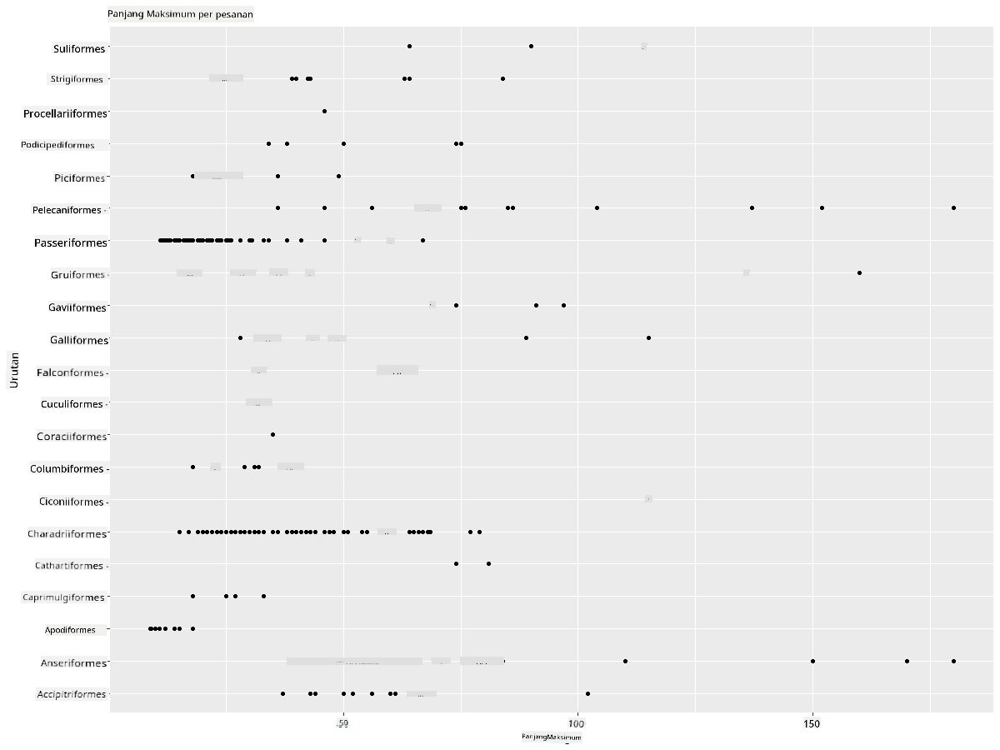

<!--
CO_OP_TRANSLATOR_METADATA:
{
  "original_hash": "ea67c0c40808fd723594de6896c37ccf",
  "translation_date": "2025-08-28T18:35:48+00:00",
  "source_file": "3-Data-Visualization/R/10-visualization-distributions/README.md",
  "language_code": "id"
}
-->
# Visualisasi Distribusi

| ](https://github.com/microsoft/Data-Science-For-Beginners/blob/main/sketchnotes/10-Visualizing-Distributions.png)|
|:---:|
| Visualisasi Distribusi - _Sketchnote oleh [@nitya](https://twitter.com/nitya)_ |

Pada pelajaran sebelumnya, Anda mempelajari beberapa fakta menarik tentang dataset burung di Minnesota. Anda menemukan data yang salah dengan memvisualisasikan outlier dan melihat perbedaan antara kategori burung berdasarkan panjang maksimum mereka.

## [Kuis sebelum pelajaran](https://purple-hill-04aebfb03.1.azurestaticapps.net/quiz/18)
## Jelajahi dataset burung

Cara lain untuk menggali data adalah dengan melihat distribusinya, atau bagaimana data diorganisasikan sepanjang sumbu. Misalnya, Anda mungkin ingin mengetahui distribusi umum, untuk dataset ini, dari rentang maksimum sayap atau massa tubuh maksimum burung di Minnesota.

Mari kita temukan beberapa fakta tentang distribusi data dalam dataset ini. Di konsol R Anda, impor `ggplot2` dan database. Hapus outlier dari database seperti yang dilakukan pada topik sebelumnya.

```r
library(ggplot2)

birds <- read.csv("../../data/birds.csv",fileEncoding="UTF-8-BOM")

birds_filtered <- subset(birds, MaxWingspan < 500)
head(birds_filtered)
```
|      | Nama                         | NamaIlmiah             | Kategori              | Ordo         | Famili   | Genus       | StatusKonservasi    | MinPanjang | MaxPanjang | MinMassaTubuh | MaxMassaTubuh | MinRentangSayap | MaxRentangSayap |
| ---: | :--------------------------- | :--------------------- | :-------------------- | :----------- | :------- | :---------- | :----------------- | --------: | --------: | ----------: | ----------: | ----------: | ----------: |
|    0 | Black-bellied whistling-duck | Dendrocygna autumnalis | Bebek/Angsa/BurungAir | Anseriformes | Anatidae | Dendrocygna | LC                 |        47 |        56 |         652 |        1020 |          76 |          94 |
|    1 | Fulvous whistling-duck       | Dendrocygna bicolor    | Bebek/Angsa/BurungAir | Anseriformes | Anatidae | Dendrocygna | LC                 |        45 |        53 |         712 |        1050 |          85 |          93 |
|    2 | Snow goose                   | Anser caerulescens     | Bebek/Angsa/BurungAir | Anseriformes | Anatidae | Anser       | LC                 |        64 |        79 |        2050 |        4050 |         135 |         165 |
|    3 | Ross's goose                 | Anser rossii           | Bebek/Angsa/BurungAir | Anseriformes | Anatidae | Anser       | LC                 |      57.3 |        64 |        1066 |        1567 |         113 |         116 |
|    4 | Greater white-fronted goose  | Anser albifrons        | Bebek/Angsa/BurungAir | Anseriformes | Anatidae | Anser       | LC                 |        64 |        81 |        1930 |        3310 |         130 |         165 |

Secara umum, Anda dapat dengan cepat melihat cara data didistribusikan dengan menggunakan scatter plot seperti yang dilakukan pada pelajaran sebelumnya:

```r
ggplot(data=birds_filtered, aes(x=Order, y=MaxLength,group=1)) +
  geom_point() +
  ggtitle("Max Length per order") + coord_flip()
```


Ini memberikan gambaran umum tentang distribusi panjang tubuh per Ordo burung, tetapi ini bukan cara terbaik untuk menampilkan distribusi yang sebenarnya. Tugas ini biasanya dilakukan dengan membuat Histogram.
## Bekerja dengan histogram

`ggplot2` menawarkan cara yang sangat baik untuk memvisualisasikan distribusi data menggunakan Histogram. Jenis grafik ini mirip dengan grafik batang di mana distribusi dapat dilihat melalui naik turunnya batang. Untuk membuat histogram, Anda memerlukan data numerik. Untuk membuat Histogram, Anda dapat membuat grafik dengan mendefinisikan jenisnya sebagai 'hist' untuk Histogram. Grafik ini menunjukkan distribusi MaxBodyMass untuk rentang data numerik seluruh dataset. Dengan membagi array data menjadi beberapa bin yang lebih kecil, histogram dapat menampilkan distribusi nilai data:

```r
ggplot(data = birds_filtered, aes(x = MaxBodyMass)) + 
  geom_histogram(bins=10)+ylab('Frequency')
```


Seperti yang Anda lihat, sebagian besar dari 400+ burung dalam dataset ini berada dalam rentang di bawah 2000 untuk Max Body Mass mereka. Dapatkan lebih banyak wawasan tentang data dengan mengubah parameter `bins` ke angka yang lebih tinggi, seperti 30:

```r
ggplot(data = birds_filtered, aes(x = MaxBodyMass)) + geom_histogram(bins=30)+ylab('Frequency')
```


Grafik ini menunjukkan distribusi dengan cara yang sedikit lebih rinci. Grafik yang kurang condong ke kiri dapat dibuat dengan memastikan bahwa Anda hanya memilih data dalam rentang tertentu:

Saring data Anda untuk mendapatkan hanya burung yang massa tubuhnya di bawah 60, dan tampilkan 30 `bins`:

```r
birds_filtered_1 <- subset(birds_filtered, MaxBodyMass > 1 & MaxBodyMass < 60)
ggplot(data = birds_filtered_1, aes(x = MaxBodyMass)) + 
  geom_histogram(bins=30)+ylab('Frequency')
```


✅ Coba beberapa filter dan titik data lainnya. Untuk melihat distribusi penuh data, hapus filter `['MaxBodyMass']` untuk menampilkan distribusi yang diberi label.

Histogram menawarkan beberapa peningkatan warna dan pelabelan yang menarik untuk dicoba juga:

Buat histogram 2D untuk membandingkan hubungan antara dua distribusi. Mari bandingkan `MaxBodyMass` vs. `MaxLength`. `ggplot2` menawarkan cara bawaan untuk menunjukkan konvergensi menggunakan warna yang lebih cerah:

```r
ggplot(data=birds_filtered_1, aes(x=MaxBodyMass, y=MaxLength) ) +
  geom_bin2d() +scale_fill_continuous(type = "viridis")
```
Tampaknya ada korelasi yang diharapkan antara kedua elemen ini sepanjang sumbu yang diharapkan, dengan satu titik konvergensi yang sangat kuat:


Histogram bekerja dengan baik secara default untuk data numerik. Bagaimana jika Anda perlu melihat distribusi berdasarkan data teks? 
## Jelajahi dataset untuk distribusi menggunakan data teks 

Dataset ini juga mencakup informasi yang baik tentang kategori burung serta genus, spesies, dan famili mereka, serta status konservasi mereka. Mari kita gali informasi konservasi ini. Bagaimana distribusi burung berdasarkan status konservasi mereka?

> ✅ Dalam dataset, beberapa akronim digunakan untuk menggambarkan status konservasi. Akronim ini berasal dari [Kategori Daftar Merah IUCN](https://www.iucnredlist.org/), sebuah organisasi yang mengkatalogkan status spesies.
> 
> - CR: Sangat Terancam Punah
> - EN: Terancam Punah
> - EX: Punah
> - LC: Risiko Rendah
> - NT: Hampir Terancam
> - VU: Rentan

Nilai-nilai ini berbasis teks sehingga Anda perlu melakukan transformasi untuk membuat histogram. Menggunakan dataframe filteredBirds, tampilkan status konservasi bersama dengan Rentang Sayap Minimum. Apa yang Anda lihat? 

```r
birds_filtered_1$ConservationStatus[birds_filtered_1$ConservationStatus == 'EX'] <- 'x1' 
birds_filtered_1$ConservationStatus[birds_filtered_1$ConservationStatus == 'CR'] <- 'x2'
birds_filtered_1$ConservationStatus[birds_filtered_1$ConservationStatus == 'EN'] <- 'x3'
birds_filtered_1$ConservationStatus[birds_filtered_1$ConservationStatus == 'NT'] <- 'x4'
birds_filtered_1$ConservationStatus[birds_filtered_1$ConservationStatus == 'VU'] <- 'x5'
birds_filtered_1$ConservationStatus[birds_filtered_1$ConservationStatus == 'LC'] <- 'x6'

ggplot(data=birds_filtered_1, aes(x = MinWingspan, fill = ConservationStatus)) +
  geom_histogram(position = "identity", alpha = 0.4, bins = 20) +
  scale_fill_manual(name="Conservation Status",values=c("red","green","blue","pink"),labels=c("Endangered","Near Threathened","Vulnerable","Least Concern"))
```


Tampaknya tidak ada korelasi yang baik antara rentang sayap minimum dan status konservasi. Uji elemen lain dari dataset menggunakan metode ini. Anda juga dapat mencoba filter yang berbeda. Apakah Anda menemukan korelasi?

## Plot Kepadatan

Anda mungkin telah memperhatikan bahwa histogram yang kita lihat sejauh ini 'bertingkat' dan tidak mengalir dengan mulus dalam bentuk lengkung. Untuk menunjukkan grafik kepadatan yang lebih halus, Anda dapat mencoba plot kepadatan.

Mari kita bekerja dengan plot kepadatan sekarang!

```r
ggplot(data = birds_filtered_1, aes(x = MinWingspan)) + 
  geom_density()
```


Anda dapat melihat bagaimana plot ini mencerminkan grafik sebelumnya untuk data Rentang Sayap Minimum; hanya saja sedikit lebih halus. Jika Anda ingin melihat garis MaxBodyMass yang bergerigi pada grafik kedua yang Anda buat, Anda dapat menghaluskannya dengan sangat baik dengan membuat ulang menggunakan metode ini:

```r
ggplot(data = birds_filtered_1, aes(x = MaxBodyMass)) + 
  geom_density()
```


Jika Anda menginginkan garis yang halus, tetapi tidak terlalu halus, edit parameter `adjust`: 

```r
ggplot(data = birds_filtered_1, aes(x = MaxBodyMass)) + 
  geom_density(adjust = 1/5)
```


✅ Baca tentang parameter yang tersedia untuk jenis plot ini dan bereksperimenlah!

Jenis grafik ini menawarkan visualisasi yang sangat informatif. Dengan beberapa baris kode, misalnya, Anda dapat menunjukkan kepadatan massa tubuh maksimum per Ordo burung:

```r
ggplot(data=birds_filtered_1,aes(x = MaxBodyMass, fill = Order)) +
  geom_density(alpha=0.5)
```


## 🚀 Tantangan

Histogram adalah jenis grafik yang lebih canggih dibandingkan scatterplot, grafik batang, atau grafik garis dasar. Lakukan pencarian di internet untuk menemukan contoh penggunaan histogram yang baik. Bagaimana mereka digunakan, apa yang mereka tunjukkan, dan di bidang atau area penyelidikan apa mereka cenderung digunakan?

## [Kuis setelah pelajaran](https://purple-hill-04aebfb03.1.azurestaticapps.net/quiz/19)

## Tinjauan & Studi Mandiri

Dalam pelajaran ini, Anda menggunakan `ggplot2` dan mulai bekerja untuk menunjukkan grafik yang lebih canggih. Lakukan penelitian tentang `geom_density_2d()` sebuah "kurva kepadatan probabilitas kontinu dalam satu atau lebih dimensi". Baca [dokumentasi](https://ggplot2.tidyverse.org/reference/geom_density_2d.html) untuk memahami cara kerjanya.

## Tugas

[Terapkan keterampilan Anda](assignment.md)

---

**Penafian**:  
Dokumen ini telah diterjemahkan menggunakan layanan penerjemahan AI [Co-op Translator](https://github.com/Azure/co-op-translator). Meskipun kami berupaya untuk memberikan hasil yang akurat, harap diperhatikan bahwa terjemahan otomatis mungkin mengandung kesalahan atau ketidakakuratan. Dokumen asli dalam bahasa aslinya harus dianggap sebagai sumber yang berwenang. Untuk informasi yang bersifat kritis, disarankan menggunakan jasa penerjemahan manusia profesional. Kami tidak bertanggung jawab atas kesalahpahaman atau interpretasi yang keliru yang timbul dari penggunaan terjemahan ini.