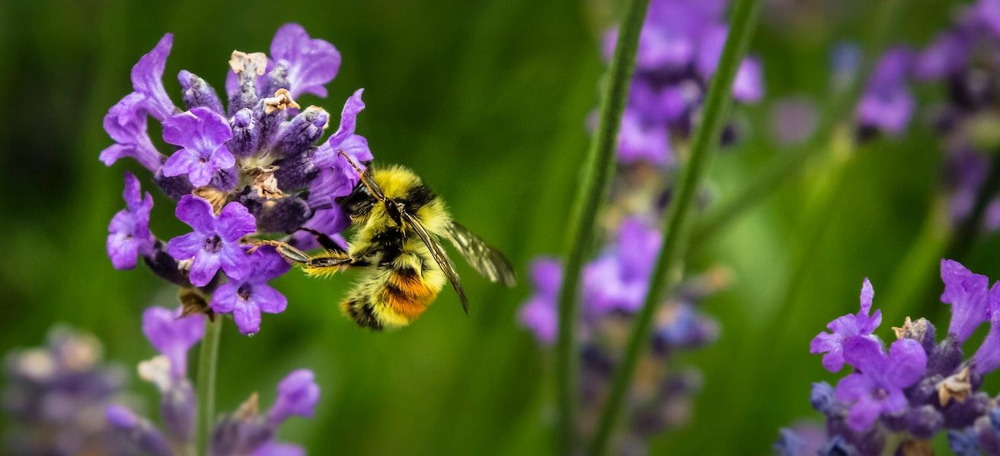

<!--
CO_OP_TRANSLATOR_METADATA:
{
  "original_hash": "1441550a0d789796b2821e04f7f4cc94",
  "translation_date": "2025-08-28T18:28:43+00:00",
  "source_file": "3-Data-Visualization/README.md",
  "language_code": "id"
}
-->
# Visualisasi

> Foto oleh <a href="https://unsplash.com/@jenna2980?utm_source=unsplash&utm_medium=referral&utm_content=creditCopyText">Jenna Lee</a> di <a href="https://unsplash.com/s/photos/bees-in-a-meadow?utm_source=unsplash&utm_medium=referral&utm_content=creditCopyText">Unsplash</a>

Memvisualisasikan data adalah salah satu tugas terpenting seorang data scientist. Gambar bernilai 1000 kata, dan sebuah visualisasi dapat membantu Anda mengidentifikasi berbagai aspek menarik dari data Anda seperti lonjakan, pencilan, pengelompokan, kecenderungan, dan lainnya, yang dapat membantu Anda memahami cerita yang ingin disampaikan oleh data Anda.

Dalam lima pelajaran ini, Anda akan mengeksplorasi data yang bersumber dari alam dan membuat visualisasi yang menarik dan indah menggunakan berbagai teknik.

| Nomor Topik | Topik | Pelajaran Terkait | Penulis |
| :-----------: | :--: | :-----------: | :----: |
| 1. | Memvisualisasikan kuantitas | <ul> <li> [Python](09-visualization-quantities/README.md)</li>  <li>[R](../../../3-Data-Visualization/R/09-visualization-quantities) </li> </ul>|<ul> <li> [Jen Looper](https://twitter.com/jenlooper)</li><li> [Vidushi Gupta](https://github.com/Vidushi-Gupta)</li> <li>[Jasleen Sondhi](https://github.com/jasleen101010)</li></ul> |
| 2. | Memvisualisasikan distribusi | <ul> <li> [Python](10-visualization-distributions/README.md)</li>  <li>[R](../../../3-Data-Visualization/R/10-visualization-distributions) </li> </ul>|<ul> <li> [Jen Looper](https://twitter.com/jenlooper)</li><li> [Vidushi Gupta](https://github.com/Vidushi-Gupta)</li> <li>[Jasleen Sondhi](https://github.com/jasleen101010)</li></ul> |
| 3. | Memvisualisasikan proporsi | <ul> <li> [Python](11-visualization-proportions/README.md)</li>  <li>[R](../../../3-Data-Visualization) </li> </ul>|<ul> <li> [Jen Looper](https://twitter.com/jenlooper)</li><li> [Vidushi Gupta](https://github.com/Vidushi-Gupta)</li> <li>[Jasleen Sondhi](https://github.com/jasleen101010)</li></ul> |
| 4. | Memvisualisasikan hubungan | <ul> <li> [Python](12-visualization-relationships/README.md)</li>  <li>[R](../../../3-Data-Visualization) </li> </ul>|<ul> <li> [Jen Looper](https://twitter.com/jenlooper)</li><li> [Vidushi Gupta](https://github.com/Vidushi-Gupta)</li> <li>[Jasleen Sondhi](https://github.com/jasleen101010)</li></ul> |
| 5. | Membuat Visualisasi yang Bermakna | <ul> <li> [Python](13-meaningful-visualizations/README.md)</li>  <li>[R](../../../3-Data-Visualization) </li> </ul>|<ul> <li> [Jen Looper](https://twitter.com/jenlooper)</li><li> [Vidushi Gupta](https://github.com/Vidushi-Gupta)</li> <li>[Jasleen Sondhi](https://github.com/jasleen101010)</li></ul> |

### Kredit

Pelajaran visualisasi ini ditulis dengan 🌸 oleh [Jen Looper](https://twitter.com/jenlooper), [Jasleen Sondhi](https://github.com/jasleen101010), dan [Vidushi Gupta](https://github.com/Vidushi-Gupta).

🍯 Data untuk Produksi Madu di AS bersumber dari proyek Jessica Li di [Kaggle](https://www.kaggle.com/jessicali9530/honey-production). [Data](https://usda.library.cornell.edu/concern/publications/rn301137d) ini berasal dari [United States Department of Agriculture](https://www.nass.usda.gov/About_NASS/index.php).

🍄 Data untuk jamur juga bersumber dari [Kaggle](https://www.kaggle.com/hatterasdunton/mushroom-classification-updated-dataset) yang direvisi oleh Hatteras Dunton. Dataset ini mencakup deskripsi sampel hipotetis yang sesuai dengan 23 spesies jamur berinsang dalam keluarga Agaricus dan Lepiota. Jamur diambil dari The Audubon Society Field Guide to North American Mushrooms (1981). Dataset ini disumbangkan ke UCI ML 27 pada tahun 1987.

🦆 Data untuk Burung Minnesota berasal dari [Kaggle](https://www.kaggle.com/hannahcollins/minnesota-birds) yang diambil dari [Wikipedia](https://en.wikipedia.org/wiki/List_of_birds_of_Minnesota) oleh Hannah Collins.

Semua dataset ini dilisensikan sebagai [CC0: Creative Commons](https://creativecommons.org/publicdomain/zero/1.0/).

---

**Penafian**:  
Dokumen ini telah diterjemahkan menggunakan layanan penerjemahan AI [Co-op Translator](https://github.com/Azure/co-op-translator). Meskipun kami berupaya untuk memberikan hasil yang akurat, harap diperhatikan bahwa terjemahan otomatis mungkin mengandung kesalahan atau ketidakakuratan. Dokumen asli dalam bahasa aslinya harus dianggap sebagai sumber yang berwenang. Untuk informasi yang bersifat kritis, disarankan menggunakan jasa penerjemahan manusia profesional. Kami tidak bertanggung jawab atas kesalahpahaman atau penafsiran yang keliru yang timbul dari penggunaan terjemahan ini.