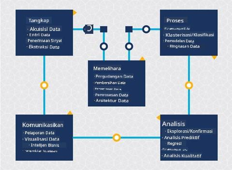
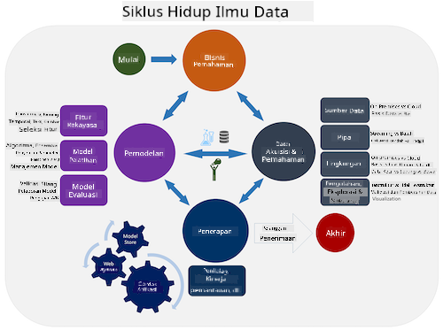
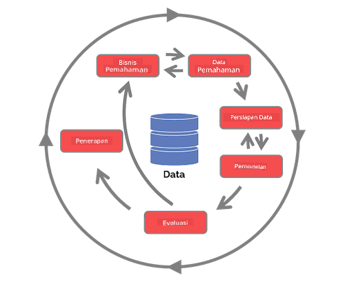

<!--
CO_OP_TRANSLATOR_METADATA:
{
  "original_hash": "c368f8f2506fe56bca0f7be05c4eb71d",
  "translation_date": "2025-08-28T18:22:32+00:00",
  "source_file": "4-Data-Science-Lifecycle/14-Introduction/README.md",
  "language_code": "id"
}
-->
# Pengantar Siklus Hidup Data Science

| ](../../sketchnotes/14-DataScience-Lifecycle.png)|
|:---:|
| Pengantar Siklus Hidup Data Science - _Sketchnote oleh [@nitya](https://twitter.com/nitya)_ |

## [Kuis Pra-Pelajaran](https://red-water-0103e7a0f.azurestaticapps.net/quiz/26)

Pada titik ini, Anda mungkin sudah menyadari bahwa data science adalah sebuah proses. Proses ini dapat dibagi menjadi 5 tahap:

- Pengumpulan
- Pemrosesan
- Analisis
- Komunikasi
- Pemeliharaan

Pelajaran ini berfokus pada 3 bagian dari siklus hidup: pengumpulan, pemrosesan, dan pemeliharaan.

> Foto oleh [Berkeley School of Information](https://ischoolonline.berkeley.edu/data-science/what-is-data-science/)

## Pengumpulan

Tahap pertama dari siklus hidup sangat penting karena tahap-tahap berikutnya bergantung padanya. Tahap ini pada dasarnya adalah gabungan dari dua tahap: memperoleh data dan mendefinisikan tujuan serta masalah yang perlu diselesaikan.  
Mendefinisikan tujuan proyek membutuhkan pemahaman yang lebih mendalam tentang masalah atau pertanyaan yang ada. Pertama, kita perlu mengidentifikasi dan memperoleh pihak-pihak yang membutuhkan solusi atas masalah mereka. Pihak-pihak ini bisa berupa pemangku kepentingan dalam bisnis atau sponsor proyek, yang dapat membantu mengidentifikasi siapa atau apa yang akan mendapatkan manfaat dari proyek ini serta apa dan mengapa mereka membutuhkannya. Tujuan yang terdefinisi dengan baik harus dapat diukur dan dihitung untuk menentukan hasil yang dapat diterima.

Pertanyaan yang mungkin diajukan oleh seorang data scientist:
- Apakah masalah ini pernah didekati sebelumnya? Apa yang ditemukan?
- Apakah tujuan dan maksud proyek dipahami oleh semua pihak yang terlibat?
- Apakah ada ambiguitas dan bagaimana cara menguranginya?
- Apa saja batasannya?
- Seperti apa hasil akhirnya nanti?
- Berapa banyak sumber daya (waktu, tenaga, komputasi) yang tersedia?

Selanjutnya adalah mengidentifikasi, mengumpulkan, dan akhirnya mengeksplorasi data yang diperlukan untuk mencapai tujuan yang telah ditentukan. Pada langkah akuisisi ini, data scientist juga harus mengevaluasi kuantitas dan kualitas data. Hal ini membutuhkan eksplorasi data untuk memastikan bahwa data yang diperoleh akan mendukung pencapaian hasil yang diinginkan.

Pertanyaan yang mungkin diajukan oleh seorang data scientist tentang data:
- Data apa yang sudah tersedia untuk saya?
- Siapa pemilik data ini?
- Apa saja kekhawatiran terkait privasi?
- Apakah saya memiliki cukup data untuk menyelesaikan masalah ini?
- Apakah kualitas data cukup baik untuk masalah ini?
- Jika saya menemukan informasi tambahan melalui data ini, apakah kita perlu mempertimbangkan untuk mengubah atau mendefinisikan ulang tujuan?

## Pemrosesan

Tahap pemrosesan dalam siklus hidup berfokus pada menemukan pola dalam data serta pemodelan. Beberapa teknik yang digunakan dalam tahap pemrosesan memerlukan metode statistik untuk mengungkap pola. Biasanya, ini akan menjadi tugas yang membosankan bagi manusia untuk dilakukan dengan kumpulan data yang besar, sehingga akan mengandalkan komputer untuk mempercepat proses. Tahap ini juga merupakan tempat data science dan machine learning saling beririsan. Seperti yang Anda pelajari dalam pelajaran pertama, machine learning adalah proses membangun model untuk memahami data. Model adalah representasi hubungan antara variabel dalam data yang membantu memprediksi hasil.

Teknik umum yang digunakan dalam tahap ini dibahas dalam kurikulum ML untuk Pemula. Ikuti tautan berikut untuk mempelajari lebih lanjut:

- [Klasifikasi](https://github.com/microsoft/ML-For-Beginners/tree/main/4-Classification): Mengorganisasi data ke dalam kategori untuk penggunaan yang lebih efisien.
- [Klasterisasi](https://github.com/microsoft/ML-For-Beginners/tree/main/5-Clustering): Mengelompokkan data ke dalam grup yang serupa.
- [Regresi](https://github.com/microsoft/ML-For-Beginners/tree/main/2-Regression): Menentukan hubungan antara variabel untuk memprediksi atau meramalkan nilai.

## Pemeliharaan

Dalam diagram siklus hidup, Anda mungkin memperhatikan bahwa pemeliharaan berada di antara pengumpulan dan pemrosesan. Pemeliharaan adalah proses berkelanjutan untuk mengelola, menyimpan, dan mengamankan data sepanjang proses proyek dan harus dipertimbangkan selama keseluruhan proyek.

### Penyimpanan Data

Pertimbangan tentang bagaimana dan di mana data disimpan dapat memengaruhi biaya penyimpanan serta kinerja kecepatan akses data. Keputusan seperti ini kemungkinan besar tidak dibuat oleh data scientist saja, tetapi mereka mungkin harus membuat pilihan tentang bagaimana bekerja dengan data berdasarkan cara data disimpan.

Berikut beberapa aspek sistem penyimpanan data modern yang dapat memengaruhi pilihan ini:

**On premise vs off premise vs cloud publik atau privat**

On premise mengacu pada hosting dan pengelolaan data di peralatan milik sendiri, seperti memiliki server dengan hard drive yang menyimpan data, sementara off premise mengandalkan peralatan yang tidak dimiliki sendiri, seperti pusat data. Cloud publik adalah pilihan populer untuk menyimpan data yang tidak memerlukan pengetahuan tentang bagaimana atau di mana data disimpan secara tepat, di mana publik mengacu pada infrastruktur dasar yang seragam dan digunakan bersama oleh semua pengguna cloud. Beberapa organisasi memiliki kebijakan keamanan yang ketat yang mengharuskan mereka memiliki akses penuh ke peralatan tempat data di-host dan akan mengandalkan cloud privat yang menyediakan layanan cloud sendiri. Anda akan mempelajari lebih lanjut tentang data di cloud dalam [pelajaran berikutnya](https://github.com/microsoft/Data-Science-For-Beginners/tree/main/5-Data-Science-In-Cloud).

**Data dingin vs data panas**

Saat melatih model Anda, Anda mungkin memerlukan lebih banyak data pelatihan. Jika Anda puas dengan model Anda, lebih banyak data akan datang untuk model tersebut agar dapat menjalankan tujuannya. Dalam kasus apa pun, biaya penyimpanan dan akses data akan meningkat seiring dengan bertambahnya data. Memisahkan data yang jarang digunakan, yang dikenal sebagai data dingin, dari data yang sering diakses, yang dikenal sebagai data panas, dapat menjadi opsi penyimpanan data yang lebih murah melalui layanan perangkat keras atau perangkat lunak. Jika data dingin perlu diakses, mungkin akan memakan waktu lebih lama untuk mengambilnya dibandingkan dengan data panas.

### Pengelolaan Data

Saat Anda bekerja dengan data, Anda mungkin menemukan bahwa beberapa data perlu dibersihkan menggunakan beberapa teknik yang dibahas dalam pelajaran yang berfokus pada [persiapan data](https://github.com/microsoft/Data-Science-For-Beginners/tree/main/2-Working-With-Data/08-data-preparation) untuk membangun model yang akurat. Ketika data baru tiba, data tersebut akan memerlukan beberapa aplikasi yang sama untuk menjaga konsistensi kualitas. Beberapa proyek akan melibatkan penggunaan alat otomatis untuk pembersihan, agregasi, dan kompresi sebelum data dipindahkan ke lokasi akhirnya. Azure Data Factory adalah salah satu contoh alat ini.

### Pengamanan Data

Salah satu tujuan utama pengamanan data adalah memastikan bahwa mereka yang bekerja dengan data memiliki kendali atas apa yang dikumpulkan dan dalam konteks apa data tersebut digunakan. Menjaga data tetap aman melibatkan pembatasan akses hanya kepada mereka yang membutuhkannya, mematuhi undang-undang dan peraturan setempat, serta menjaga standar etika, seperti yang dibahas dalam [pelajaran etika](https://github.com/microsoft/Data-Science-For-Beginners/tree/main/1-Introduction/02-ethics).

Berikut beberapa hal yang mungkin dilakukan oleh tim dengan mempertimbangkan keamanan:
- Memastikan bahwa semua data dienkripsi
- Memberikan informasi kepada pelanggan tentang bagaimana data mereka digunakan
- Menghapus akses data dari mereka yang telah meninggalkan proyek
- Membatasi hanya anggota proyek tertentu yang dapat mengubah data

## 🚀 Tantangan

Ada banyak versi Siklus Hidup Data Science, di mana setiap langkah mungkin memiliki nama dan jumlah tahap yang berbeda tetapi akan mencakup proses yang sama seperti yang disebutkan dalam pelajaran ini.

Jelajahi [Siklus Hidup Proses Data Science Tim](https://docs.microsoft.com/en-us/azure/architecture/data-science-process/lifecycle) dan [Proses standar lintas-industri untuk data mining](https://www.datascience-pm.com/crisp-dm-2/). Sebutkan 3 kesamaan dan perbedaan antara keduanya.

|Proses Data Science Tim (TDSP)|Proses standar lintas-industri untuk data mining (CRISP-DM)|
|--|--|
| |  |
| Gambar oleh [Microsoft](https://docs.microsoft.comazure/architecture/data-science-process/lifecycle) | Gambar oleh [Data Science Process Alliance](https://www.datascience-pm.com/crisp-dm-2/) |

## [Kuis Pasca-Pelajaran](https://red-water-0103e7a0f.azurestaticapps.net/quiz/27)

## Tinjauan & Studi Mandiri

Menerapkan Siklus Hidup Data Science melibatkan berbagai peran dan tugas, di mana beberapa mungkin berfokus pada bagian tertentu dari setiap tahap. Proses Data Science Tim menyediakan beberapa sumber daya yang menjelaskan jenis peran dan tugas yang mungkin dimiliki seseorang dalam sebuah proyek.

* [Peran dan tugas Proses Data Science Tim](https://docs.microsoft.com/en-us/azure/architecture/data-science-process/roles-tasks)
* [Melaksanakan tugas data science: eksplorasi, pemodelan, dan penerapan](https://docs.microsoft.com/en-us/azure/architecture/data-science-process/execute-data-science-tasks)

## Tugas

[Menilai Dataset](assignment.md)

---

**Penafian**:  
Dokumen ini telah diterjemahkan menggunakan layanan penerjemahan AI [Co-op Translator](https://github.com/Azure/co-op-translator). Meskipun kami berupaya untuk memberikan hasil yang akurat, harap diperhatikan bahwa terjemahan otomatis mungkin mengandung kesalahan atau ketidakakuratan. Dokumen asli dalam bahasa aslinya harus dianggap sebagai sumber yang berwenang. Untuk informasi yang bersifat kritis, disarankan menggunakan jasa penerjemahan manusia profesional. Kami tidak bertanggung jawab atas kesalahpahaman atau penafsiran yang keliru yang timbul dari penggunaan terjemahan ini.