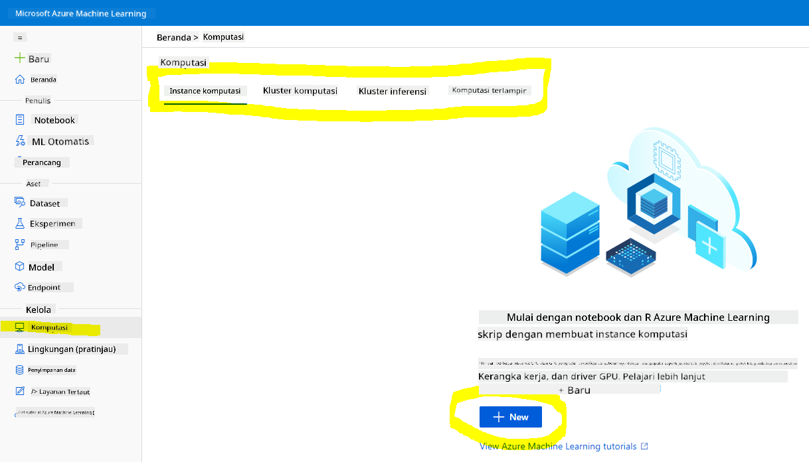
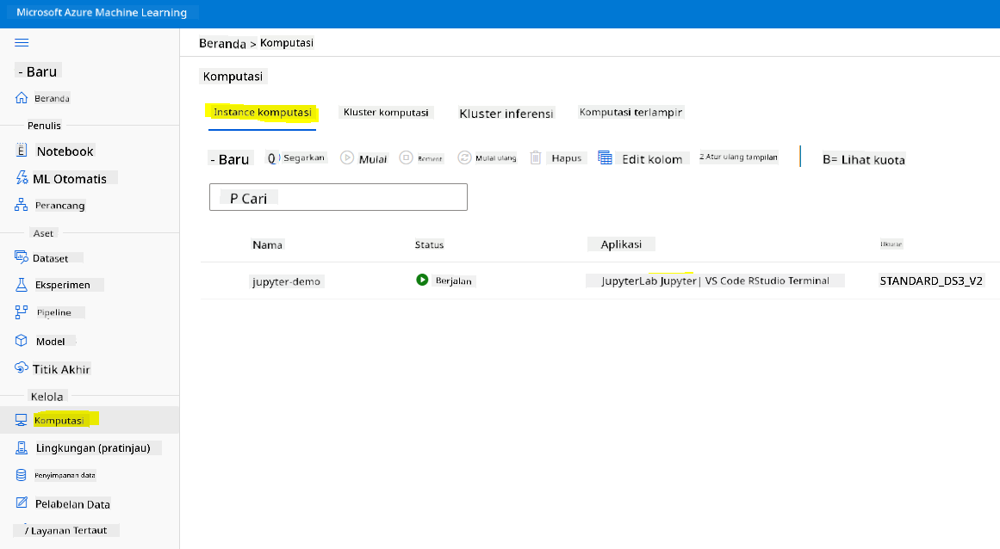
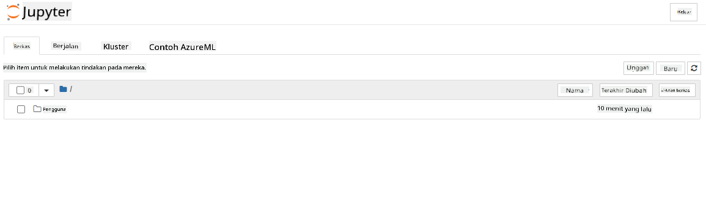

<!--
CO_OP_TRANSLATOR_METADATA:
{
  "original_hash": "73dead89dc2ddda4d6ec0232814a191e",
  "translation_date": "2025-08-28T18:02:04+00:00",
  "source_file": "5-Data-Science-In-Cloud/19-Azure/README.md",
  "language_code": "id"
}
-->
# Data Science di Cloud: Cara "Azure ML SDK"

| ](../../sketchnotes/19-DataScience-Cloud.png)|
|:---:|
| Data Science di Cloud: Azure ML SDK - _Sketchnote oleh [@nitya](https://twitter.com/nitya)_ |

Daftar isi:

- [Data Science di Cloud: Cara "Azure ML SDK"](../../../../5-Data-Science-In-Cloud/19-Azure)
  - [Kuis Pra-Pelajaran](../../../../5-Data-Science-In-Cloud/19-Azure)
  - [1. Pendahuluan](../../../../5-Data-Science-In-Cloud/19-Azure)
    - [1.1 Apa itu Azure ML SDK?](../../../../5-Data-Science-In-Cloud/19-Azure)
    - [1.2 Proyek prediksi gagal jantung dan pengenalan dataset](../../../../5-Data-Science-In-Cloud/19-Azure)
  - [2. Melatih model dengan Azure ML SDK](../../../../5-Data-Science-In-Cloud/19-Azure)
    - [2.1 Membuat workspace Azure ML](../../../../5-Data-Science-In-Cloud/19-Azure)
    - [2.2 Membuat instance komputasi](../../../../5-Data-Science-In-Cloud/19-Azure)
    - [2.3 Memuat dataset](../../../../5-Data-Science-In-Cloud/19-Azure)
    - [2.4 Membuat Notebook](../../../../5-Data-Science-In-Cloud/19-Azure)
    - [2.5 Melatih model](../../../../5-Data-Science-In-Cloud/19-Azure)
      - [2.5.1 Menyiapkan Workspace, eksperimen, cluster komputasi, dan dataset](../../../../5-Data-Science-In-Cloud/19-Azure)
      - [2.5.2 Konfigurasi AutoML dan pelatihan](../../../../5-Data-Science-In-Cloud/19-Azure)
  - [3. Penerapan model dan konsumsi endpoint dengan Azure ML SDK](../../../../5-Data-Science-In-Cloud/19-Azure)
    - [3.1 Menyimpan model terbaik](../../../../5-Data-Science-In-Cloud/19-Azure)
    - [3.2 Penerapan model](../../../../5-Data-Science-In-Cloud/19-Azure)
    - [3.3 Konsumsi endpoint](../../../../5-Data-Science-In-Cloud/19-Azure)
  - [🚀 Tantangan](../../../../5-Data-Science-In-Cloud/19-Azure)
  - [Kuis Pasca-Pelajaran](../../../../5-Data-Science-In-Cloud/19-Azure)
  - [Tinjauan & Studi Mandiri](../../../../5-Data-Science-In-Cloud/19-Azure)
  - [Tugas](../../../../5-Data-Science-In-Cloud/19-Azure)

## [Kuis Pra-Pelajaran](https://purple-hill-04aebfb03.1.azurestaticapps.net/quiz/36)

## 1. Pendahuluan

### 1.1 Apa itu Azure ML SDK?

Data scientist dan pengembang AI menggunakan Azure Machine Learning SDK untuk membangun dan menjalankan alur kerja pembelajaran mesin dengan layanan Azure Machine Learning. Anda dapat berinteraksi dengan layanan ini di lingkungan Python mana pun, termasuk Jupyter Notebooks, Visual Studio Code, atau IDE Python favorit Anda.

Area utama dari SDK meliputi:

- Mengeksplorasi, mempersiapkan, dan mengelola siklus hidup dataset yang digunakan dalam eksperimen pembelajaran mesin.
- Mengelola sumber daya cloud untuk pemantauan, pencatatan, dan pengorganisasian eksperimen pembelajaran mesin.
- Melatih model baik secara lokal maupun menggunakan sumber daya cloud, termasuk pelatihan model yang dipercepat GPU.
- Menggunakan pembelajaran mesin otomatis, yang menerima parameter konfigurasi dan data pelatihan. Secara otomatis mengiterasi algoritma dan pengaturan hyperparameter untuk menemukan model terbaik untuk menjalankan prediksi.
- Menerapkan layanan web untuk mengubah model yang telah dilatih menjadi layanan RESTful yang dapat dikonsumsi dalam aplikasi apa pun.

[Pelajari lebih lanjut tentang Azure Machine Learning SDK](https://docs.microsoft.com/python/api/overview/azure/ml?WT.mc_id=academic-77958-bethanycheum&ocid=AID3041109)

Dalam [pelajaran sebelumnya](../18-Low-Code/README.md), kita telah melihat cara melatih, menerapkan, dan mengonsumsi model dengan pendekatan Low code/No code. Kita menggunakan dataset Gagal Jantung untuk menghasilkan model prediksi gagal jantung. Dalam pelajaran ini, kita akan melakukan hal yang sama tetapi menggunakan Azure Machine Learning SDK.


### 1.2 Proyek prediksi gagal jantung dan pengenalan dataset

Lihat [di sini](../18-Low-Code/README.md) untuk pengenalan proyek prediksi gagal jantung dan dataset.

## 2. Melatih model dengan Azure ML SDK
### 2.1 Membuat workspace Azure ML

Untuk kemudahan, kita akan bekerja di jupyter notebook. Ini berarti Anda sudah memiliki Workspace dan instance komputasi. Jika Anda sudah memiliki Workspace, Anda dapat langsung melompat ke bagian 2.3 Pembuatan Notebook.

Jika belum, silakan ikuti instruksi di bagian **2.1 Membuat workspace Azure ML** dalam [pelajaran sebelumnya](../18-Low-Code/README.md) untuk membuat workspace.

### 2.2 Membuat instance komputasi

Di [workspace Azure ML](https://ml.azure.com/) yang kita buat sebelumnya, buka menu komputasi dan Anda akan melihat berbagai sumber daya komputasi yang tersedia.



Mari kita buat instance komputasi untuk menyediakan jupyter notebook. 
1. Klik tombol + Baru. 
2. Beri nama untuk instance komputasi Anda.
3. Pilih opsi Anda: CPU atau GPU, ukuran VM, dan jumlah inti.
4. Klik tombol Buat.

Selamat, Anda baru saja membuat instance komputasi! Kita akan menggunakan instance komputasi ini untuk membuat Notebook di bagian [Membuat Notebook](../../../../5-Data-Science-In-Cloud/19-Azure).

### 2.3 Memuat dataset
Lihat [pelajaran sebelumnya](../18-Low-Code/README.md) di bagian **2.3 Memuat dataset** jika Anda belum mengunggah dataset.

### 2.4 Membuat Notebook

> **_CATATAN:_** Untuk langkah berikutnya, Anda dapat membuat notebook baru dari awal, atau Anda dapat mengunggah [notebook yang telah kita buat](notebook.ipynb) ke Azure ML Studio Anda. Untuk mengunggahnya, cukup klik menu "Notebook" dan unggah notebook.

Notebook adalah bagian yang sangat penting dari proses data science. Notebook dapat digunakan untuk melakukan Analisis Data Eksplorasi (EDA), memanggil cluster komputasi untuk melatih model, atau memanggil cluster inferensi untuk menerapkan endpoint. 

Untuk membuat Notebook, kita memerlukan node komputasi yang menjalankan instance jupyter notebook. Kembali ke [workspace Azure ML](https://ml.azure.com/) dan klik pada Instance komputasi. Dalam daftar instance komputasi, Anda seharusnya melihat [instance komputasi yang kita buat sebelumnya](../../../../5-Data-Science-In-Cloud/19-Azure). 

1. Di bagian Aplikasi, klik opsi Jupyter. 
2. Centang kotak "Ya, saya mengerti" dan klik tombol Lanjutkan.

3. Ini akan membuka tab browser baru dengan instance jupyter notebook Anda seperti berikut. Klik tombol "Baru" untuk membuat notebook.



Sekarang kita memiliki Notebook, kita dapat mulai melatih model dengan Azure ML SDK.

### 2.5 Melatih model

Pertama-tama, jika Anda memiliki keraguan, lihat [dokumentasi Azure ML SDK](https://docs.microsoft.com/python/api/overview/azure/ml?WT.mc_id=academic-77958-bethanycheum&ocid=AID3041109). Dokumentasi ini berisi semua informasi yang diperlukan untuk memahami modul yang akan kita bahas dalam pelajaran ini.

#### 2.5.1 Menyiapkan Workspace, eksperimen, cluster komputasi, dan dataset

Anda perlu memuat `workspace` dari file konfigurasi menggunakan kode berikut:

```python
from azureml.core import Workspace
ws = Workspace.from_config()
```

Ini mengembalikan objek tipe `Workspace` yang mewakili workspace. Kemudian Anda perlu membuat `eksperimen` menggunakan kode berikut:

```python
from azureml.core import Experiment
experiment_name = 'aml-experiment'
experiment = Experiment(ws, experiment_name)
```
Untuk mendapatkan atau membuat eksperimen dari workspace, Anda meminta eksperimen menggunakan nama eksperimen. Nama eksperimen harus terdiri dari 3-36 karakter, dimulai dengan huruf atau angka, dan hanya dapat berisi huruf, angka, garis bawah, dan tanda hubung. Jika eksperimen tidak ditemukan di workspace, eksperimen baru akan dibuat.

Sekarang Anda perlu membuat cluster komputasi untuk pelatihan menggunakan kode berikut. Perhatikan bahwa langkah ini dapat memakan waktu beberapa menit. 

```python
from azureml.core.compute import AmlCompute

aml_name = "heart-f-cluster"
try:
    aml_compute = AmlCompute(ws, aml_name)
    print('Found existing AML compute context.')
except:
    print('Creating new AML compute context.')
    aml_config = AmlCompute.provisioning_configuration(vm_size = "Standard_D2_v2", min_nodes=1, max_nodes=3)
    aml_compute = AmlCompute.create(ws, name = aml_name, provisioning_configuration = aml_config)
    aml_compute.wait_for_completion(show_output = True)

cts = ws.compute_targets
compute_target = cts[aml_name]
```

Anda dapat mendapatkan dataset dari workspace menggunakan nama dataset dengan cara berikut:

```python
dataset = ws.datasets['heart-failure-records']
df = dataset.to_pandas_dataframe()
df.describe()
```
#### 2.5.2 Konfigurasi AutoML dan pelatihan

Untuk mengatur konfigurasi AutoML, gunakan [kelas AutoMLConfig](https://docs.microsoft.com/python/api/azureml-train-automl-client/azureml.train.automl.automlconfig(class)?WT.mc_id=academic-77958-bethanycheum&ocid=AID3041109).

Seperti yang dijelaskan dalam dokumentasi, ada banyak parameter yang dapat Anda gunakan. Untuk proyek ini, kita akan menggunakan parameter berikut:

- `experiment_timeout_minutes`: Jumlah waktu maksimum (dalam menit) yang diizinkan untuk eksperimen berjalan sebelum secara otomatis dihentikan dan hasilnya secara otomatis tersedia.
- `max_concurrent_iterations`: Jumlah maksimum iterasi pelatihan bersamaan yang diizinkan untuk eksperimen.
- `primary_metric`: Metrik utama yang digunakan untuk menentukan status eksperimen.
- `compute_target`: Target komputasi Azure Machine Learning untuk menjalankan eksperimen Pembelajaran Mesin Otomatis.
- `task`: Jenis tugas yang akan dijalankan. Nilai dapat berupa 'classification', 'regression', atau 'forecasting' tergantung pada jenis masalah pembelajaran mesin otomatis yang akan diselesaikan.
- `training_data`: Data pelatihan yang akan digunakan dalam eksperimen. Data ini harus berisi fitur pelatihan dan kolom label (opsional kolom bobot sampel).
- `label_column_name`: Nama kolom label.
- `path`: Jalur lengkap ke folder proyek Azure Machine Learning.
- `enable_early_stopping`: Apakah akan mengaktifkan penghentian dini jika skor tidak meningkat dalam jangka pendek.
- `featurization`: Indikator apakah langkah featurisasi harus dilakukan secara otomatis atau tidak, atau apakah featurisasi yang disesuaikan harus digunakan.
- `debug_log`: File log untuk menulis informasi debug.

```python
from azureml.train.automl import AutoMLConfig

project_folder = './aml-project'

automl_settings = {
    "experiment_timeout_minutes": 20,
    "max_concurrent_iterations": 3,
    "primary_metric" : 'AUC_weighted'
}

automl_config = AutoMLConfig(compute_target=compute_target,
                             task = "classification",
                             training_data=dataset,
                             label_column_name="DEATH_EVENT",
                             path = project_folder,  
                             enable_early_stopping= True,
                             featurization= 'auto',
                             debug_log = "automl_errors.log",
                             **automl_settings
                            )
```
Sekarang setelah konfigurasi Anda diatur, Anda dapat melatih model menggunakan kode berikut. Langkah ini dapat memakan waktu hingga satu jam tergantung pada ukuran cluster Anda.

```python
remote_run = experiment.submit(automl_config)
```
Anda dapat menjalankan widget RunDetails untuk menunjukkan berbagai eksperimen.
```python
from azureml.widgets import RunDetails
RunDetails(remote_run).show()
```
## 3. Penerapan model dan konsumsi endpoint dengan Azure ML SDK

### 3.1 Menyimpan model terbaik

`remote_run` adalah objek tipe [AutoMLRun](https://docs.microsoft.com/python/api/azureml-train-automl-client/azureml.train.automl.run.automlrun?WT.mc_id=academic-77958-bethanycheum&ocid=AID3041109). Objek ini berisi metode `get_output()` yang mengembalikan run terbaik dan model yang sesuai.

```python
best_run, fitted_model = remote_run.get_output()
```
Anda dapat melihat parameter yang digunakan untuk model terbaik dengan mencetak fitted_model dan melihat properti model terbaik dengan menggunakan metode [get_properties()](https://docs.microsoft.com/python/api/azureml-core/azureml.core.run(class)?view=azure-ml-py#azureml_core_Run_get_properties?WT.mc_id=academic-77958-bethanycheum&ocid=AID3041109).

```python
best_run.get_properties()
```

Sekarang daftarkan model dengan metode [register_model](https://docs.microsoft.com/python/api/azureml-train-automl-client/azureml.train.automl.run.automlrun?view=azure-ml-py#register-model-model-name-none--description-none--tags-none--iteration-none--metric-none-?WT.mc_id=academic-77958-bethanycheum&ocid=AID3041109).
```python
model_name = best_run.properties['model_name']
script_file_name = 'inference/score.py'
best_run.download_file('outputs/scoring_file_v_1_0_0.py', 'inference/score.py')
description = "aml heart failure project sdk"
model = best_run.register_model(model_name = model_name,
                                model_path = './outputs/',
                                description = description,
                                tags = None)
```
### 3.2 Penerapan model

Setelah model terbaik disimpan, kita dapat menerapkannya dengan kelas [InferenceConfig](https://docs.microsoft.com/python/api/azureml-core/azureml.core.model.inferenceconfig?view=azure-ml-py?ocid=AID3041109). InferenceConfig mewakili pengaturan konfigurasi untuk lingkungan khusus yang digunakan untuk penerapan. Kelas [AciWebservice](https://docs.microsoft.com/python/api/azureml-core/azureml.core.webservice.aciwebservice?view=azure-ml-py) mewakili model pembelajaran mesin yang diterapkan sebagai endpoint layanan web pada Azure Container Instances. Layanan web yang diterapkan dibuat dari model, skrip, dan file terkait. Layanan web yang dihasilkan adalah endpoint HTTP yang seimbang dengan REST API. Anda dapat mengirim data ke API ini dan menerima prediksi yang dikembalikan oleh model.

Model diterapkan menggunakan metode [deploy](https://docs.microsoft.com/python/api/azureml-core/azureml.core.model(class)?view=azure-ml-py#deploy-workspace--name--models--inference-config-none--deployment-config-none--deployment-target-none--overwrite-false--show-output-false-?WT.mc_id=academic-77958-bethanycheum&ocid=AID3041109).

```python
from azureml.core.model import InferenceConfig, Model
from azureml.core.webservice import AciWebservice

inference_config = InferenceConfig(entry_script=script_file_name, environment=best_run.get_environment())

aciconfig = AciWebservice.deploy_configuration(cpu_cores = 1,
                                               memory_gb = 1,
                                               tags = {'type': "automl-heart-failure-prediction"},
                                               description = 'Sample service for AutoML Heart Failure Prediction')

aci_service_name = 'automl-hf-sdk'
aci_service = Model.deploy(ws, aci_service_name, [model], inference_config, aciconfig)
aci_service.wait_for_deployment(True)
print(aci_service.state)
```
Langkah ini akan memakan waktu beberapa menit.

### 3.3 Konsumsi endpoint

Anda dapat mengonsumsi endpoint Anda dengan membuat input sampel:

```python
data = {
    "data":
    [
        {
            'age': "60",
            'anaemia': "false",
            'creatinine_phosphokinase': "500",
            'diabetes': "false",
            'ejection_fraction': "38",
            'high_blood_pressure': "false",
            'platelets': "260000",
            'serum_creatinine': "1.40",
            'serum_sodium': "137",
            'sex': "false",
            'smoking': "false",
            'time': "130",
        },
    ],
}

test_sample = str.encode(json.dumps(data))
```
Dan kemudian Anda dapat mengirimkan input ini ke model Anda untuk prediksi:
```python
response = aci_service.run(input_data=test_sample)
response
```
Ini akan menghasilkan `'{"result": [false]}'`. Ini berarti bahwa input pasien yang kita kirimkan ke endpoint menghasilkan prediksi `false`, yang berarti orang ini tidak mungkin mengalami serangan jantung.

Selamat! Anda baru saja menggunakan model yang dideploy dan dilatih di Azure ML dengan Azure ML SDK!

> **_NOTE:_** Setelah Anda menyelesaikan proyek ini, jangan lupa untuk menghapus semua sumber daya.

## 🚀 Tantangan

Ada banyak hal lain yang dapat Anda lakukan melalui SDK, sayangnya, kita tidak dapat membahas semuanya dalam pelajaran ini. Tapi kabar baiknya, belajar cara menjelajahi dokumentasi SDK dapat membantu Anda melangkah jauh secara mandiri. Lihat dokumentasi Azure ML SDK dan temukan kelas `Pipeline` yang memungkinkan Anda membuat pipeline. Pipeline adalah kumpulan langkah-langkah yang dapat dijalankan sebagai alur kerja.

**PETUNJUK:** Kunjungi [dokumentasi SDK](https://docs.microsoft.com/python/api/overview/azure/ml/?view=azure-ml-py?WT.mc_id=academic-77958-bethanycheum&ocid=AID3041109) dan ketik kata kunci seperti "Pipeline" di bilah pencarian. Anda seharusnya menemukan kelas `azureml.pipeline.core.Pipeline` dalam hasil pencarian.

## [Kuis setelah pelajaran](https://purple-hill-04aebfb03.1.azurestaticapps.net/quiz/37)

## Tinjauan & Studi Mandiri

Dalam pelajaran ini, Anda telah belajar cara melatih, mendeply, dan menggunakan model untuk memprediksi risiko gagal jantung dengan Azure ML SDK di cloud. Periksa [dokumentasi ini](https://docs.microsoft.com/python/api/overview/azure/ml/?view=azure-ml-py?WT.mc_id=academic-77958-bethanycheum&ocid=AID3041109) untuk informasi lebih lanjut tentang Azure ML SDK. Cobalah untuk membuat model Anda sendiri dengan Azure ML SDK.

## Tugas

[Proyek Data Science menggunakan Azure ML SDK](assignment.md)

---

**Penafian**:  
Dokumen ini telah diterjemahkan menggunakan layanan penerjemahan AI [Co-op Translator](https://github.com/Azure/co-op-translator). Meskipun kami berupaya untuk memberikan hasil yang akurat, harap diperhatikan bahwa terjemahan otomatis mungkin mengandung kesalahan atau ketidakakuratan. Dokumen asli dalam bahasa aslinya harus dianggap sebagai sumber yang berwenang. Untuk informasi yang bersifat kritis, disarankan menggunakan jasa penerjemahan manusia profesional. Kami tidak bertanggung jawab atas kesalahpahaman atau penafsiran yang keliru yang timbul dari penggunaan terjemahan ini.