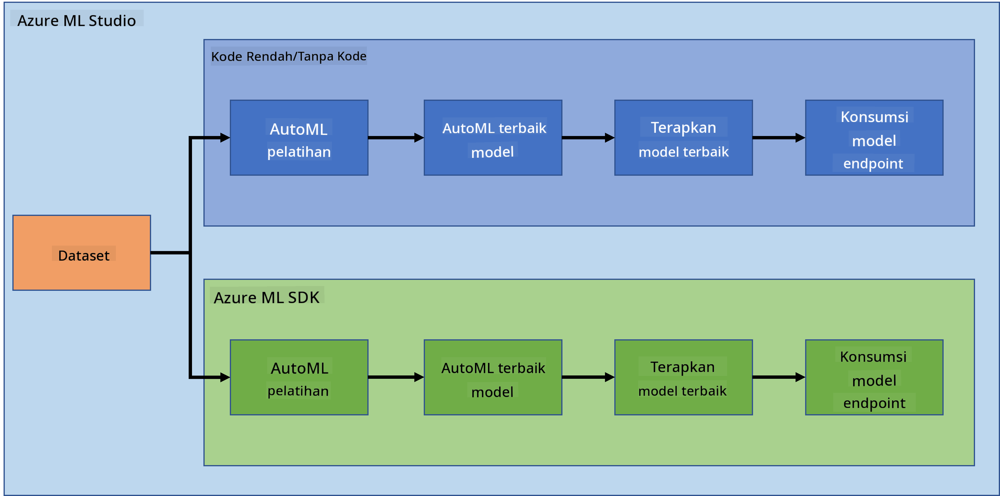

<!--
CO_OP_TRANSLATOR_METADATA:
{
  "original_hash": "8dfe141a0f46f7d253e07f74913c7f44",
  "translation_date": "2025-08-28T17:54:02+00:00",
  "source_file": "5-Data-Science-In-Cloud/README.md",
  "language_code": "id"
}
-->
# Data Science di Cloud

> Foto oleh [Jelleke Vanooteghem](https://unsplash.com/@ilumire) dari [Unsplash](https://unsplash.com/s/photos/cloud?orientation=landscape)

Ketika berbicara tentang data science dengan data besar, cloud bisa menjadi pengubah permainan. Dalam tiga pelajaran berikutnya, kita akan melihat apa itu cloud dan mengapa ini bisa sangat membantu. Kita juga akan mengeksplorasi dataset gagal jantung dan membangun model untuk membantu menilai kemungkinan seseorang mengalami gagal jantung. Kita akan menggunakan kekuatan cloud untuk melatih, menerapkan, dan menggunakan model dengan dua cara berbeda. Satu cara menggunakan antarmuka pengguna dalam pendekatan Low code/No code, dan cara lainnya menggunakan Azure Machine Learning Software Developer Kit (Azure ML SDK).

### Topik

1. [Mengapa menggunakan Cloud untuk Data Science?](17-Introduction/README.md)
2. [Data Science di Cloud: Cara "Low code/No code"](18-Low-Code/README.md)
3. [Data Science di Cloud: Cara "Azure ML SDK"](19-Azure/README.md)

### Kredit
Pelajaran ini ditulis dengan ☁️ dan 💕 oleh [Maud Levy](https://twitter.com/maudstweets) dan [Tiffany Souterre](https://twitter.com/TiffanySouterre)

Data untuk proyek Prediksi Gagal Jantung bersumber dari [
Larxel](https://www.kaggle.com/andrewmvd) di [Kaggle](https://www.kaggle.com/andrewmvd/heart-failure-clinical-data). Data ini dilisensikan di bawah [Attribution 4.0 International (CC BY 4.0)](https://creativecommons.org/licenses/by/4.0/)

---

**Penafian**:  
Dokumen ini telah diterjemahkan menggunakan layanan penerjemahan AI [Co-op Translator](https://github.com/Azure/co-op-translator). Meskipun kami berusaha untuk memberikan hasil yang akurat, harap diingat bahwa terjemahan otomatis mungkin mengandung kesalahan atau ketidakakuratan. Dokumen asli dalam bahasa aslinya harus dianggap sebagai sumber yang otoritatif. Untuk informasi yang bersifat kritis, disarankan menggunakan jasa penerjemahan profesional oleh manusia. Kami tidak bertanggung jawab atas kesalahpahaman atau penafsiran yang keliru yang timbul dari penggunaan terjemahan ini.