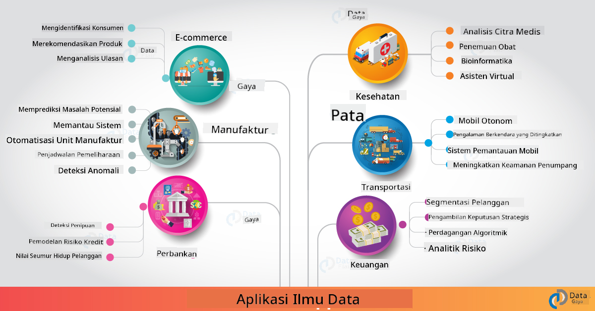

<!--
CO_OP_TRANSLATOR_METADATA:
{
  "original_hash": "f95679140c7cb39c30ccba535cd8f03f",
  "translation_date": "2025-09-04T20:40:52+00:00",
  "source_file": "6-Data-Science-In-Wild/20-Real-World-Examples/README.md",
  "language_code": "id"
}
-->
# Ilmu Data di Dunia Nyata

|  ](../../sketchnotes/20-DataScience-RealWorld.png) |
| :--------------------------------------------------------------------------------------------------------------: |
|               Ilmu Data di Dunia Nyata - _Sketchnote oleh [@nitya](https://twitter.com/nitya)_               |

Kita hampir sampai di akhir perjalanan pembelajaran ini!

Kita mulai dengan definisi ilmu data dan etika, mengeksplorasi berbagai alat & teknik untuk analisis dan visualisasi data, meninjau siklus hidup ilmu data, dan melihat bagaimana cara memperbesar dan mengotomatisasi alur kerja ilmu data dengan layanan komputasi awan. Jadi, Anda mungkin bertanya: _"Bagaimana tepatnya saya memetakan semua pembelajaran ini ke dalam konteks dunia nyata?"_

Dalam pelajaran ini, kita akan mengeksplorasi aplikasi ilmu data di dunia nyata di berbagai industri dan menyelami contoh spesifik dalam konteks penelitian, humaniora digital, dan keberlanjutan. Kita juga akan melihat peluang proyek mahasiswa dan menyimpulkan dengan sumber daya yang berguna untuk membantu Anda melanjutkan perjalanan pembelajaran Anda!

## Kuis Pra-Kuliah

[Kuis pra-kuliah](https://ff-quizzes.netlify.app/en/ds/)

## Ilmu Data + Industri

Berkat demokratisasi AI, pengembang kini lebih mudah merancang dan mengintegrasikan pengambilan keputusan berbasis AI dan wawasan berbasis data ke dalam pengalaman pengguna dan alur kerja pengembangan. Berikut beberapa contoh bagaimana ilmu data "diterapkan" dalam aplikasi dunia nyata di berbagai industri:

 * [Google Flu Trends](https://www.wired.com/2015/10/can-learn-epic-failure-google-flu-trends/) menggunakan ilmu data untuk menghubungkan istilah pencarian dengan tren flu. Meskipun pendekatan ini memiliki kekurangan, hal ini meningkatkan kesadaran akan kemungkinan (dan tantangan) prediksi kesehatan berbasis data.

 * [Prediksi Rute UPS](https://www.technologyreview.com/2018/11/21/139000/how-ups-uses-ai-to-outsmart-bad-weather/) - menjelaskan bagaimana UPS menggunakan ilmu data dan pembelajaran mesin untuk memprediksi rute optimal untuk pengiriman, dengan mempertimbangkan kondisi cuaca, pola lalu lintas, tenggat waktu pengiriman, dan lainnya.

 * [Visualisasi Rute Taksi NYC](http://chriswhong.github.io/nyctaxi/) - data yang dikumpulkan menggunakan [Freedom Of Information Laws](https://chriswhong.com/open-data/foil_nyc_taxi/) membantu memvisualisasikan satu hari dalam kehidupan taksi NYC, membantu kita memahami bagaimana mereka menavigasi kota yang sibuk, uang yang mereka hasilkan, dan durasi perjalanan selama setiap periode 24 jam.

 * [Uber Data Science Workbench](https://eng.uber.com/dsw/) - menggunakan data (lokasi penjemputan & pengantaran, durasi perjalanan, rute yang disukai, dll.) yang dikumpulkan dari jutaan perjalanan Uber *setiap hari* untuk membangun alat analitik data yang membantu dalam penetapan harga, keselamatan, deteksi penipuan, dan keputusan navigasi.

 * [Analitik Olahraga](https://towardsdatascience.com/scope-of-analytics-in-sports-world-37ed09c39860) - berfokus pada _analitik prediktif_ (analisis tim dan pemain - seperti [Moneyball](https://datasciencedegree.wisconsin.edu/blog/moneyball-proves-importance-big-data-big-ideas/) - dan manajemen penggemar) dan _visualisasi data_ (dasbor tim & penggemar, permainan, dll.) dengan aplikasi seperti pencarian bakat, perjudian olahraga, dan manajemen inventaris/venue.

 * [Ilmu Data dalam Perbankan](https://data-flair.training/blogs/data-science-in-banking/) - menyoroti nilai ilmu data dalam industri keuangan dengan aplikasi mulai dari pemodelan risiko dan deteksi penipuan, hingga segmentasi pelanggan, prediksi waktu nyata, dan sistem rekomendasi. Analitik prediktif juga mendorong langkah-langkah penting seperti [skor kredit](https://dzone.com/articles/using-big-data-and-predictive-analytics-for-credit).

 * [Ilmu Data dalam Kesehatan](https://data-flair.training/blogs/data-science-in-healthcare/) - menyoroti aplikasi seperti pencitraan medis (misalnya, MRI, X-Ray, CT-Scan), genomik (pengurutan DNA), pengembangan obat (penilaian risiko, prediksi keberhasilan), analitik prediktif (perawatan pasien & logistik pasokan), pelacakan & pencegahan penyakit, dll.

 Kredit Gambar: [Data Flair: 6 Amazing Data Science Applications ](https://data-flair.training/blogs/data-science-applications/)

Gambar tersebut menunjukkan domain lain dan contoh penerapan teknik ilmu data. Ingin mengeksplorasi aplikasi lainnya? Lihat bagian [Review & Self Study](../../../../6-Data-Science-In-Wild/20-Real-World-Examples) di bawah.

## Ilmu Data + Penelitian

|  ](../../sketchnotes/20-DataScience-Research.png) |
| :---------------------------------------------------------------------------------------------------------------: |
|              Ilmu Data & Penelitian - _Sketchnote oleh [@nitya](https://twitter.com/nitya)_              |

Sementara aplikasi dunia nyata sering kali berfokus pada kasus penggunaan industri dalam skala besar, aplikasi dan proyek _penelitian_ dapat berguna dari dua perspektif:

* _peluang inovasi_ - mengeksplorasi prototipe cepat konsep canggih dan pengujian pengalaman pengguna untuk aplikasi generasi berikutnya.
* _tantangan penerapan_ - menyelidiki potensi bahaya atau konsekuensi yang tidak diinginkan dari teknologi ilmu data dalam konteks dunia nyata.

Bagi mahasiswa, proyek penelitian ini dapat memberikan peluang pembelajaran dan kolaborasi yang dapat meningkatkan pemahaman Anda tentang topik tersebut, serta memperluas kesadaran dan keterlibatan Anda dengan orang atau tim yang relevan yang bekerja di bidang yang diminati. Jadi, seperti apa proyek penelitian itu dan bagaimana mereka dapat memberikan dampak?

Mari kita lihat satu contoh - [MIT Gender Shades Study](http://gendershades.org/overview.html) dari Joy Buolamwini (MIT Media Labs) dengan [makalah penelitian utama](http://proceedings.mlr.press/v81/buolamwini18a/buolamwini18a.pdf) yang ditulis bersama dengan Timnit Gebru (saat itu di Microsoft Research) yang berfokus pada:

 * **Apa:** Tujuan proyek penelitian ini adalah untuk _mengevaluasi bias yang ada dalam algoritma analisis wajah otomatis dan dataset_ berdasarkan jenis kelamin dan warna kulit.
 * **Mengapa:** Analisis wajah digunakan di bidang seperti penegakan hukum, keamanan bandara, sistem perekrutan, dan lainnya - konteks di mana klasifikasi yang tidak akurat (misalnya, karena bias) dapat menyebabkan potensi kerugian ekonomi dan sosial bagi individu atau kelompok yang terkena dampak. Memahami (dan menghilangkan atau mengurangi) bias adalah kunci keadilan dalam penggunaan.
 * **Bagaimana:** Peneliti menyadari bahwa tolok ukur yang ada sebagian besar menggunakan subjek berkulit terang, dan mengkurasi dataset baru (1000+ gambar) yang _lebih seimbang_ berdasarkan jenis kelamin dan warna kulit. Dataset ini digunakan untuk mengevaluasi akurasi tiga produk klasifikasi gender (dari Microsoft, IBM & Face++).

Hasil menunjukkan bahwa meskipun akurasi klasifikasi keseluruhan baik, terdapat perbedaan yang mencolok dalam tingkat kesalahan antara berbagai subkelompok - dengan **misgendering** lebih tinggi pada perempuan atau orang dengan warna kulit lebih gelap, yang menunjukkan adanya bias.

**Hasil Utama:** Meningkatkan kesadaran bahwa ilmu data membutuhkan lebih banyak _dataset yang representatif_ (subkelompok yang seimbang) dan lebih banyak _tim yang inklusif_ (latar belakang yang beragam) untuk mengenali dan menghilangkan atau mengurangi bias tersebut lebih awal dalam solusi AI. Upaya penelitian seperti ini juga berperan penting dalam banyak organisasi dalam mendefinisikan prinsip dan praktik untuk _AI yang bertanggung jawab_ guna meningkatkan keadilan di seluruh produk dan proses AI mereka.

**Ingin belajar tentang upaya penelitian yang relevan di Microsoft?**

* Lihat [Proyek Penelitian Microsoft](https://www.microsoft.com/research/research-area/artificial-intelligence/?facet%5Btax%5D%5Bmsr-research-area%5D%5B%5D=13556&facet%5Btax%5D%5Bmsr-content-type%5D%5B%5D=msr-project) tentang Kecerdasan Buatan.
* Jelajahi proyek mahasiswa dari [Microsoft Research Data Science Summer School](https://www.microsoft.com/en-us/research/academic-program/data-science-summer-school/).
* Lihat proyek [Fairlearn](https://fairlearn.org/) dan inisiatif [AI yang Bertanggung Jawab](https://www.microsoft.com/en-us/ai/responsible-ai?activetab=pivot1%3aprimaryr6).

## Ilmu Data + Humaniora

|  ](../../sketchnotes/20-DataScience-Humanities.png) |
| :---------------------------------------------------------------------------------------------------------------: |
|              Ilmu Data & Humaniora Digital - _Sketchnote oleh [@nitya](https://twitter.com/nitya)_              |

Humaniora Digital [didefinisikan](https://digitalhumanities.stanford.edu/about-dh-stanford) sebagai "sebuah kumpulan praktik dan pendekatan yang menggabungkan metode komputasi dengan penyelidikan humanistik". [Proyek Stanford](https://digitalhumanities.stanford.edu/projects) seperti _"rebooting history"_ dan _"poetic thinking"_ menggambarkan hubungan antara [Humaniora Digital dan Ilmu Data](https://digitalhumanities.stanford.edu/digital-humanities-and-data-science) - menekankan teknik seperti analisis jaringan, visualisasi informasi, analisis spasial dan teks yang dapat membantu kita meninjau kembali dataset sejarah dan sastra untuk mendapatkan wawasan dan perspektif baru.

*Ingin mengeksplorasi dan memperluas proyek di bidang ini?*

Lihat ["Emily Dickinson and the Meter of Mood"](https://gist.github.com/jlooper/ce4d102efd057137bc000db796bfd671) - contoh hebat dari [Jen Looper](https://twitter.com/jenlooper) yang bertanya bagaimana kita dapat menggunakan ilmu data untuk meninjau kembali puisi yang sudah dikenal dan mengevaluasi ulang maknanya serta kontribusi penulisnya dalam konteks baru. Misalnya, _bisakah kita memprediksi musim di mana sebuah puisi ditulis dengan menganalisis nada atau sentimennya_ - dan apa yang hal ini katakan tentang keadaan pikiran penulis selama periode tersebut?

Untuk menjawab pertanyaan itu, kita mengikuti langkah-langkah siklus hidup ilmu data:
 * [`Akuisisi Data`](https://gist.github.com/jlooper/ce4d102efd057137bc000db796bfd671#acquiring-the-dataset) - untuk mengumpulkan dataset yang relevan untuk analisis. Pilihan termasuk menggunakan API (misalnya, [Poetry DB API](https://poetrydb.org/index.html)) atau scraping halaman web (misalnya, [Project Gutenberg](https://www.gutenberg.org/files/12242/12242-h/12242-h.htm)) menggunakan alat seperti [Scrapy](https://scrapy.org/).
 * [`Pembersihan Data`](https://gist.github.com/jlooper/ce4d102efd057137bc000db796bfd671#clean-the-data) - menjelaskan bagaimana teks dapat diformat, disanitasi, dan disederhanakan menggunakan alat dasar seperti Visual Studio Code dan Microsoft Excel.
 * [`Analisis Data`](https://gist.github.com/jlooper/ce4d102efd057137bc000db796bfd671#working-with-the-data-in-a-notebook) - menjelaskan bagaimana kita dapat mengimpor dataset ke dalam "Notebook" untuk analisis menggunakan paket Python (seperti pandas, numpy, dan matplotlib) untuk mengorganisasi dan memvisualisasikan data.
 * [`Analisis Sentimen`](https://gist.github.com/jlooper/ce4d102efd057137bc000db796bfd671#sentiment-analysis-using-cognitive-services) - menjelaskan bagaimana kita dapat mengintegrasikan layanan cloud seperti Text Analytics, menggunakan alat low-code seperti [Power Automate](https://flow.microsoft.com/en-us/) untuk alur kerja pemrosesan data otomatis.

Menggunakan alur kerja ini, kita dapat mengeksplorasi dampak musiman pada sentimen puisi, dan membantu kita membentuk perspektif kita sendiri tentang penulisnya. Cobalah sendiri - lalu perluas notebook untuk mengajukan pertanyaan lain atau memvisualisasikan data dengan cara baru!

> Anda dapat menggunakan beberapa alat dalam [Digital Humanities toolkit](https://github.com/Digital-Humanities-Toolkit) untuk mengejar jalur penyelidikan ini.

## Ilmu Data + Keberlanjutan

|  ](../../sketchnotes/20-DataScience-Sustainability.png) |
| :---------------------------------------------------------------------------------------------------------------: |
|              Ilmu Data & Keberlanjutan - _Sketchnote oleh [@nitya](https://twitter.com/nitya)_              |

[Agenda 2030 untuk Pembangunan Berkelanjutan](https://sdgs.un.org/2030agenda) - yang diadopsi oleh semua anggota Perserikatan Bangsa-Bangsa pada tahun 2015 - mengidentifikasi 17 tujuan termasuk yang berfokus pada **Melindungi Planet** dari degradasi dan dampak perubahan iklim. Inisiatif [Keberlanjutan Microsoft](https://www.microsoft.com/en-us/sustainability) mendukung tujuan-tujuan ini dengan mengeksplorasi cara-cara di mana solusi teknologi dapat mendukung dan membangun masa depan yang lebih berkelanjutan dengan [fokus pada 4 tujuan](https://dev.to/azure/a-visual-guide-to-sustainable-software-engineering-53hh) - menjadi karbon negatif, air positif, nol limbah, dan bio-diversitas pada tahun 2030.

Mengatasi tantangan ini secara skala besar dan tepat waktu membutuhkan pemikiran skala cloud - dan data dalam jumlah besar. Inisiatif [Planetary Computer](https://planetarycomputer.microsoft.com/) menyediakan 4 komponen untuk membantu ilmuwan data dan pengembang dalam upaya ini:

 * [Data Catalog](https://planetarycomputer.microsoft.com/catalog) - dengan petabyte data Sistem Bumi (gratis & di-host di Azure).
 * [Planetary API](https://planetarycomputer.microsoft.com/docs/reference/stac/) - untuk membantu pengguna mencari data yang relevan di berbagai ruang dan waktu.
 * [Hub](https://planetarycomputer.microsoft.com/docs/overview/environment/) - lingkungan terkelola untuk ilmuwan memproses dataset geospasial besar.
 * [Aplikasi](https://planetarycomputer.microsoft.com/applications) - menampilkan kasus penggunaan & alat untuk wawasan keberlanjutan.
**Proyek Planetary Computer saat ini dalam tahap pratinjau (per September 2021)** - berikut cara Anda dapat mulai berkontribusi pada solusi keberlanjutan menggunakan ilmu data.

* [Ajukan akses](https://planetarycomputer.microsoft.com/account/request) untuk mulai eksplorasi dan terhubung dengan rekan-rekan.
* [Jelajahi dokumentasi](https://planetarycomputer.microsoft.com/docs/overview/about) untuk memahami dataset dan API yang didukung.
* Jelajahi aplikasi seperti [Ecosystem Monitoring](https://analytics-lab.org/ecosystemmonitoring/) untuk mendapatkan inspirasi ide aplikasi.

Pikirkan bagaimana Anda dapat menggunakan visualisasi data untuk mengungkapkan atau memperkuat wawasan yang relevan dalam bidang seperti perubahan iklim dan deforestasi. Atau pikirkan bagaimana wawasan tersebut dapat digunakan untuk menciptakan pengalaman pengguna baru yang memotivasi perubahan perilaku menuju gaya hidup yang lebih berkelanjutan.

## Ilmu Data + Mahasiswa

Kami telah membahas aplikasi dunia nyata di industri dan penelitian, serta mengeksplorasi contoh aplikasi ilmu data dalam humaniora digital dan keberlanjutan. Jadi, bagaimana Anda dapat membangun keterampilan Anda dan berbagi keahlian sebagai pemula dalam ilmu data?

Berikut beberapa contoh proyek ilmu data mahasiswa untuk menginspirasi Anda.

* [MSR Data Science Summer School](https://www.microsoft.com/en-us/research/academic-program/data-science-summer-school/#!projects) dengan [proyek GitHub](https://github.com/msr-ds3) yang mengeksplorasi topik seperti:
   - [Bias Rasial dalam Penggunaan Kekerasan oleh Polisi](https://www.microsoft.com/en-us/research/video/data-science-summer-school-2019-replicating-an-empirical-analysis-of-racial-differences-in-police-use-of-force/) | [Github](https://github.com/msr-ds3/stop-question-frisk)
   - [Keandalan Sistem Subway NYC](https://www.microsoft.com/en-us/research/video/data-science-summer-school-2018-exploring-the-reliability-of-the-nyc-subway-system/) | [Github](https://github.com/msr-ds3/nyctransit)
* [Digitizing Material Culture: Menjelajahi distribusi sosial-ekonomi di Sirkap](https://claremont.maps.arcgis.com/apps/Cascade/index.html?appid=bdf2aef0f45a4674ba41cd373fa23afc) - dari [Ornella Altunyan](https://twitter.com/ornelladotcom) dan tim di Claremont, menggunakan [ArcGIS StoryMaps](https://storymaps.arcgis.com/).

## 🚀 Tantangan

Cari artikel yang merekomendasikan proyek ilmu data yang ramah pemula - seperti [50 topik ini](https://www.upgrad.com/blog/data-science-project-ideas-topics-beginners/) atau [21 ide proyek ini](https://www.intellspot.com/data-science-project-ideas) atau [16 proyek dengan kode sumber ini](https://data-flair.training/blogs/data-science-project-ideas/) yang dapat Anda analisis dan modifikasi. Jangan lupa untuk menulis blog tentang perjalanan pembelajaran Anda dan berbagi wawasan dengan kami semua.

## Kuis Pasca-Kuliah

## [Kuis pasca-kuliah](https://ff-quizzes.netlify.app/en/ds/)

## Tinjauan & Studi Mandiri

Ingin mengeksplorasi lebih banyak kasus penggunaan? Berikut beberapa artikel yang relevan:
* [17 Aplikasi dan Contoh Ilmu Data](https://builtin.com/data-science/data-science-applications-examples) - Jul 2021
* [11 Aplikasi Ilmu Data yang Menakjubkan di Dunia Nyata](https://myblindbird.com/data-science-applications-real-world/) - Mei 2021
* [Ilmu Data di Dunia Nyata](https://towardsdatascience.com/data-science-in-the-real-world/home) - Koleksi Artikel
* Ilmu Data Dalam: [Pendidikan](https://data-flair.training/blogs/data-science-in-education/), [Pertanian](https://data-flair.training/blogs/data-science-in-agriculture/), [Keuangan](https://data-flair.training/blogs/data-science-in-finance/), [Film](https://data-flair.training/blogs/data-science-at-movies/) & lainnya.

## Tugas

[Eksplorasi Dataset Planetary Computer](assignment.md)

---

**Penafian**:  
Dokumen ini telah diterjemahkan menggunakan layanan terjemahan AI [Co-op Translator](https://github.com/Azure/co-op-translator). Meskipun kami berupaya untuk memberikan hasil yang akurat, harap diperhatikan bahwa terjemahan otomatis mungkin mengandung kesalahan atau ketidakakuratan. Dokumen asli dalam bahasa aslinya harus dianggap sebagai sumber yang berwenang. Untuk informasi yang bersifat kritis, disarankan menggunakan jasa terjemahan manusia profesional. Kami tidak bertanggung jawab atas kesalahpahaman atau penafsiran yang keliru yang timbul dari penggunaan terjemahan ini.