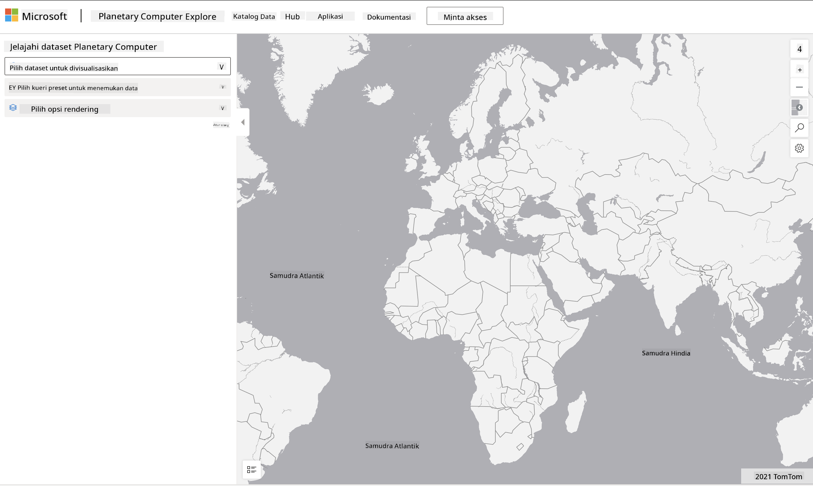

<!--
CO_OP_TRANSLATOR_METADATA:
{
  "original_hash": "d1e05715f9d97de6c4f1fb0c5a4702c0",
  "translation_date": "2025-08-28T19:10:04+00:00",
  "source_file": "6-Data-Science-In-Wild/20-Real-World-Examples/assignment.md",
  "language_code": "id"
}
-->
# Jelajahi Dataset Planetary Computer

## Instruksi

Dalam pelajaran ini, kita membahas berbagai domain aplikasi ilmu data - dengan penjelasan mendalam tentang contoh-contoh terkait penelitian, keberlanjutan, dan humaniora digital. Dalam tugas ini, Anda akan mengeksplorasi salah satu contoh tersebut secara lebih mendalam, dan menerapkan beberapa pembelajaran Anda tentang visualisasi dan analisis data untuk mendapatkan wawasan tentang data keberlanjutan.

Proyek [Planetary Computer](https://planetarycomputer.microsoft.com/) memiliki dataset dan API yang dapat diakses dengan akun - ajukan permintaan untuk mendapatkan akses jika Anda ingin mencoba langkah bonus dari tugas ini. Situs ini juga menyediakan fitur [Explorer](https://planetarycomputer.microsoft.com/explore) yang dapat Anda gunakan tanpa membuat akun.

`Langkah-langkah:`
Antarmuka Explorer (ditampilkan dalam tangkapan layar di bawah) memungkinkan Anda memilih dataset (dari opsi yang tersedia), kueri preset (untuk memfilter data), dan opsi rendering (untuk membuat visualisasi yang relevan). Dalam tugas ini, tugas Anda adalah:

 1. Baca [dokumentasi Explorer](https://planetarycomputer.microsoft.com/docs/overview/explorer/) - pahami opsinya.
 2. Jelajahi [Katalog dataset](https://planetarycomputer.microsoft.com/catalog) - pelajari tujuan masing-masing.
 3. Gunakan Explorer - pilih dataset yang menarik, pilih kueri dan opsi rendering yang relevan.

`Tugas Anda:`
Sekarang pelajari visualisasi yang ditampilkan di browser dan jawab pertanyaan berikut:
 * Apa _fitur_ yang dimiliki dataset tersebut?
 * Apa _wawasan_ atau hasil yang diberikan oleh visualisasi tersebut?
 * Apa _implikasi_ dari wawasan tersebut terhadap tujuan keberlanjutan proyek?
 * Apa _keterbatasan_ dari visualisasi tersebut (yaitu, wawasan apa yang tidak Anda dapatkan)?
 * Jika Anda bisa mendapatkan data mentah, _visualisasi alternatif_ apa yang akan Anda buat, dan mengapa?

`Poin Bonus:`
Ajukan permohonan akun - dan masuk setelah diterima.
 * Gunakan opsi _Launch Hub_ untuk membuka data mentah di Notebook.
 * Jelajahi data secara interaktif, dan terapkan visualisasi alternatif yang Anda pikirkan.
 * Sekarang analisis visualisasi kustom Anda - apakah Anda berhasil mendapatkan wawasan yang sebelumnya terlewatkan?

## Rubrik

Unggul | Memadai | Perlu Perbaikan
--- | --- | -- |
Kelima pertanyaan inti dijawab. Mahasiswa dengan jelas mengidentifikasi bagaimana visualisasi saat ini dan alternatif dapat memberikan wawasan tentang tujuan atau hasil keberlanjutan.| Mahasiswa menjawab setidaknya 3 pertanyaan teratas dengan sangat rinci, menunjukkan bahwa mereka memiliki pengalaman praktis dengan Explorer. | Mahasiswa gagal menjawab beberapa pertanyaan, atau memberikan detail yang tidak memadai - menunjukkan bahwa tidak ada upaya yang berarti untuk menyelesaikan proyek |

---

**Penafian**:  
Dokumen ini telah diterjemahkan menggunakan layanan penerjemahan AI [Co-op Translator](https://github.com/Azure/co-op-translator). Meskipun kami berusaha untuk memberikan hasil yang akurat, harap diingat bahwa terjemahan otomatis mungkin mengandung kesalahan atau ketidakakuratan. Dokumen asli dalam bahasa aslinya harus dianggap sebagai sumber yang otoritatif. Untuk informasi yang bersifat kritis, disarankan menggunakan jasa penerjemahan manusia profesional. Kami tidak bertanggung jawab atas kesalahpahaman atau penafsiran yang keliru yang timbul dari penggunaan terjemahan ini.