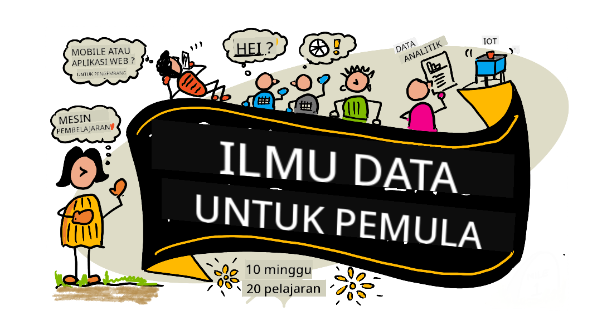

<!--
CO_OP_TRANSLATOR_METADATA:
{
  "original_hash": "dd9a1deb4da680b2cf11ba2e9f5a0a6e",
  "translation_date": "2025-09-29T22:00:58+00:00",
  "source_file": "README.md",
  "language_code": "id"
}
-->
# Data Science untuk Pemula - Kurikulum

Azure Cloud Advocates di Microsoft dengan senang hati menawarkan kurikulum 10 minggu, 20 pelajaran tentang Data Science. Setiap pelajaran mencakup kuis sebelum dan sesudah pelajaran, instruksi tertulis untuk menyelesaikan pelajaran, solusi, dan tugas. Pendekatan berbasis proyek kami memungkinkan Anda belajar sambil membangun, cara yang terbukti efektif untuk membuat keterampilan baru lebih melekat.

**Terima kasih banyak kepada para penulis kami:** [Jasmine Greenaway](https://www.twitter.com/paladique), [Dmitry Soshnikov](http://soshnikov.com), [Nitya Narasimhan](https://twitter.com/nitya), [Jalen McGee](https://twitter.com/JalenMcG), [Jen Looper](https://twitter.com/jenlooper), [Maud Levy](https://twitter.com/maudstweets), [Tiffany Souterre](https://twitter.com/TiffanySouterre), [Christopher Harrison](https://www.twitter.com/geektrainer).

**🙏 Terima kasih khusus 🙏 kepada [Microsoft Student Ambassador](https://studentambassadors.microsoft.com/) penulis, peninjau, dan kontributor konten kami,** terutama Aaryan Arora, [Aditya Garg](https://github.com/AdityaGarg00), [Alondra Sanchez](https://www.linkedin.com/in/alondra-sanchez-molina/), [Ankita Singh](https://www.linkedin.com/in/ankitasingh007), [Anupam Mishra](https://www.linkedin.com/in/anupam--mishra/), [Arpita Das](https://www.linkedin.com/in/arpitadas01/), ChhailBihari Dubey, [Dibri Nsofor](https://www.linkedin.com/in/dibrinsofor), [Dishita Bhasin](https://www.linkedin.com/in/dishita-bhasin-7065281bb), [Majd Safi](https://www.linkedin.com/in/majd-s/), [Max Blum](https://www.linkedin.com/in/max-blum-6036a1186/), [Miguel Correa](https://www.linkedin.com/in/miguelmque/), [Mohamma Iftekher (Iftu) Ebne Jalal](https://twitter.com/iftu119), [Nawrin Tabassum](https://www.linkedin.com/in/nawrin-tabassum), [Raymond Wangsa Putra](https://www.linkedin.com/in/raymond-wp/), [Rohit Yadav](https://www.linkedin.com/in/rty2423), Samridhi Sharma, [Sanya Sinha](https://www.linkedin.com/mwlite/in/sanya-sinha-13aab1200),
[Sheena Narula](https://www.linkedin.com/in/sheena-narua-n/), [Tauqeer Ahmad](https://www.linkedin.com/in/tauqeerahmad5201/), Yogendrasingh Pawar , [Vidushi Gupta](https://www.linkedin.com/in/vidushi-gupta07/), [Jasleen Sondhi](https://www.linkedin.com/in/jasleen-sondhi/)

||
|:---:|
| Data Science untuk Pemula - _Sketchnote oleh [@nitya](https://twitter.com/nitya)_ |

### 🌐 Dukungan Multi-Bahasa

#### Didukung melalui GitHub Action (Otomatis & Selalu Terbaru)

[Prancis](../fr/README.md) | [Spanyol](../es/README.md) | [Jerman](../de/README.md) | [Rusia](../ru/README.md) | [Arab](../ar/README.md) | [Persia (Farsi)](../fa/README.md) | [Urdu](../ur/README.md) | [Cina (Sederhana)](../zh/README.md) | [Cina (Tradisional, Makau)](../mo/README.md) | [Cina (Tradisional, Hong Kong)](../hk/README.md) | [Cina (Tradisional, Taiwan)](../tw/README.md) | [Jepang](../ja/README.md) | [Korea](../ko/README.md) | [Hindi](../hi/README.md) | [Bengali](../bn/README.md) | [Marathi](../mr/README.md) | [Nepali](../ne/README.md) | [Punjabi (Gurmukhi)](../pa/README.md) | [Portugis (Portugal)](../pt/README.md) | [Portugis (Brasil)](../br/README.md) | [Italia](../it/README.md) | [Polandia](../pl/README.md) | [Turki](../tr/README.md) | [Yunani](../el/README.md) | [Thailand](../th/README.md) | [Swedia](../sv/README.md) | [Denmark](../da/README.md) | [Norwegia](../no/README.md) | [Finlandia](../fi/README.md) | [Belanda](../nl/README.md) | [Ibrani](../he/README.md) | [Vietnam](../vi/README.md) | [Indonesia](./README.md) | [Melayu](../ms/README.md) | [Tagalog (Filipina)](../tl/README.md) | [Swahili](../sw/README.md) | [Hungaria](../hu/README.md) | [Ceko](../cs/README.md) | [Slovakia](../sk/README.md) | [Rumania](../ro/README.md) | [Bulgaria](../bg/README.md) | [Serbia (Kiril)](../sr/README.md) | [Kroasia](../hr/README.md) | [Slovenia](../sl/README.md) | [Ukraina](../uk/README.md) | [Burma (Myanmar)](../my/README.md)

**Jika Anda ingin mendukung bahasa tambahan, daftar bahasa tersedia [di sini](https://github.com/Azure/co-op-translator/blob/main/getting_started/supported-languages.md)**

#### Bergabunglah dengan Komunitas Kami 

Kami memiliki seri belajar dengan AI yang sedang berlangsung di Discord, pelajari lebih lanjut dan bergabunglah dengan kami di [Learn with AI Series](https://aka.ms/learnwithai/discord) dari 18 - 30 September, 2025. Anda akan mendapatkan tips dan trik menggunakan GitHub Copilot untuk Data Science.

# Apakah Anda seorang pelajar?

Mulailah dengan sumber daya berikut:

- [Halaman Student Hub](https://docs.microsoft.com/en-gb/learn/student-hub?WT.mc_id=academic-77958-bethanycheum) Di halaman ini, Anda akan menemukan sumber daya untuk pemula, paket pelajar, dan bahkan cara mendapatkan voucher sertifikat gratis. Ini adalah halaman yang ingin Anda tandai dan periksa dari waktu ke waktu karena kami mengganti konten setidaknya setiap bulan.
- [Microsoft Learn Student Ambassadors](https://studentambassadors.microsoft.com?WT.mc_id=academic-77958-bethanycheum) Bergabunglah dengan komunitas global duta pelajar, ini bisa menjadi jalan Anda ke Microsoft.

# Memulai

> **Guru**: kami telah [menyertakan beberapa saran](for-teachers.md) tentang cara menggunakan kurikulum ini. Kami akan senang mendengar umpan balik Anda [di forum diskusi kami](https://github.com/microsoft/Data-Science-For-Beginners/discussions)!

> **[Pelajar](https://aka.ms/student-page)**: untuk menggunakan kurikulum ini secara mandiri, fork seluruh repo dan selesaikan latihan secara mandiri, dimulai dengan kuis pra-pelajaran. Kemudian baca materi pelajaran dan selesaikan aktivitas lainnya. Cobalah untuk membuat proyek dengan memahami pelajaran daripada menyalin kode solusi; namun, kode tersebut tersedia di folder /solutions dalam setiap pelajaran berbasis proyek. Ide lainnya adalah membentuk kelompok belajar dengan teman-teman dan mempelajari konten bersama-sama. Untuk studi lebih lanjut, kami merekomendasikan [Microsoft Learn](https://docs.microsoft.com/en-us/users/jenlooper-2911/collections/qprpajyoy3x0g7?WT.mc_id=academic-77958-bethanycheum).

## Kenali Tim

**Gif oleh** [Mohit Jaisal](https://www.linkedin.com/in/mohitjaisal)

> 🎥 Klik gambar di atas untuk video tentang proyek dan orang-orang yang membuatnya!

## Pedagogi

Kami memilih dua prinsip pedagogi saat membangun kurikulum ini: memastikan bahwa kurikulum berbasis proyek dan mencakup kuis yang sering. Pada akhir seri ini, pelajar akan mempelajari prinsip dasar data science, termasuk konsep etika, persiapan data, berbagai cara bekerja dengan data, visualisasi data, analisis data, kasus penggunaan nyata data science, dan lainnya.

Selain itu, kuis dengan risiko rendah sebelum kelas membantu siswa memfokuskan niat mereka untuk mempelajari topik tertentu, sementara kuis kedua setelah kelas memastikan retensi lebih lanjut. Kurikulum ini dirancang agar fleksibel dan menyenangkan serta dapat diambil secara keseluruhan atau sebagian. Proyek dimulai dari yang kecil dan menjadi semakin kompleks pada akhir siklus 10 minggu.

> Temukan [Kode Etik](CODE_OF_CONDUCT.md), [Kontribusi](CONTRIBUTING.md), [Panduan Terjemahan](TRANSLATIONS.md). Kami menyambut umpan balik konstruktif Anda!

## Setiap pelajaran mencakup:

- Sketchnote opsional
- Video tambahan opsional
- Kuis pemanasan sebelum pelajaran
- Pelajaran tertulis
- Untuk pelajaran berbasis proyek, panduan langkah demi langkah tentang cara membangun proyek
- Pemeriksaan pengetahuan
- Tantangan
- Bacaan tambahan
- Tugas
- [Kuis setelah pelajaran](https://ff-quizzes.netlify.app/en/)

> **Catatan tentang kuis**: Semua kuis terdapat di folder Quiz-App, dengan total 40 kuis masing-masing terdiri dari tiga pertanyaan. Kuis tersebut terhubung dari dalam pelajaran, tetapi aplikasi kuis dapat dijalankan secara lokal atau diterapkan ke Azure; ikuti instruksi di folder `quiz-app`. Kuis ini secara bertahap sedang dilokalkan.

## Pelajaran
||
|:---:|
| Data Science Untuk Pemula: Roadmap - _Sketchnote oleh [@nitya](https://twitter.com/nitya)_ |

| Nomor Pelajaran | Topik | Kelompok Pelajaran | Tujuan Pembelajaran | Pelajaran Terkait | Penulis |
| :-----------: | :----------------------------------------: | :--------------------------------------------------: | :-----------------------------------------------------------------------------------------------------------------------------------------------------------------------: | :---------------------------------------------------------------------: | :----: |
| 01 | Mendefinisikan Data Science | [Pendahuluan](1-Introduction/README.md) | Pelajari konsep dasar di balik data science dan hubungannya dengan kecerdasan buatan, pembelajaran mesin, dan big data. | [pelajaran](1-Introduction/01-defining-data-science/README.md) [video](https://youtu.be/beZ7Mb_oz9I) | [Dmitry](http://soshnikov.com) |
| 02 | Etika Data Science | [Pendahuluan](1-Introduction/README.md) | Konsep Etika Data, Tantangan & Kerangka Kerja. | [pelajaran](1-Introduction/02-ethics/README.md) | [Nitya](https://twitter.com/nitya) |
| 03 | Mendefinisikan Data | [Pendahuluan](1-Introduction/README.md) | Bagaimana data diklasifikasikan dan sumber-sumber umumnya. | [pelajaran](1-Introduction/03-defining-data/README.md) | [Jasmine](https://www.twitter.com/paladique) |
| 04 | Pengantar Statistik & Probabilitas | [Pendahuluan](1-Introduction/README.md) | Teknik matematika probabilitas dan statistik untuk memahami data. | [pelajaran](1-Introduction/04-stats-and-probability/README.md) [video](https://youtu.be/Z5Zy85g4Yjw) | [Dmitry](http://soshnikov.com) |
| 05 | Bekerja dengan Data Relasional | [Bekerja Dengan Data](2-Working-With-Data/README.md) | Pengantar data relasional dan dasar-dasar eksplorasi serta analisis data relasional dengan Structured Query Language, yang juga dikenal sebagai SQL (diucapkan “see-quell”). | [pelajaran](2-Working-With-Data/05-relational-databases/README.md) | [Christopher](https://www.twitter.com/geektrainer) | | |
| 06 | Bekerja dengan Data NoSQL | [Bekerja Dengan Data](2-Working-With-Data/README.md) | Pengantar data non-relasional, berbagai jenisnya, dan dasar-dasar eksplorasi serta analisis basis data dokumen. | [pelajaran](2-Working-With-Data/06-non-relational/README.md) | [Jasmine](https://twitter.com/paladique)|
| 07 | Bekerja dengan Python | [Bekerja Dengan Data](2-Working-With-Data/README.md) | Dasar-dasar menggunakan Python untuk eksplorasi data dengan pustaka seperti Pandas. Pemahaman dasar tentang pemrograman Python direkomendasikan. | [pelajaran](2-Working-With-Data/07-python/README.md) [video](https://youtu.be/dZjWOGbsN4Y) | [Dmitry](http://soshnikov.com) |
| 08 | Persiapan Data | [Bekerja Dengan Data](2-Working-With-Data/README.md) | Topik tentang teknik data untuk membersihkan dan mentransformasi data guna menangani tantangan data yang hilang, tidak akurat, atau tidak lengkap. | [pelajaran](2-Working-With-Data/08-data-preparation/README.md) | [Jasmine](https://www.twitter.com/paladique) |
| 09 | Visualisasi Kuantitas | [Visualisasi Data](3-Data-Visualization/README.md) | Pelajari cara menggunakan Matplotlib untuk memvisualisasikan data burung 🦆 | [pelajaran](3-Data-Visualization/09-visualization-quantities/README.md) | [Jen](https://twitter.com/jenlooper) |
| 10 | Visualisasi Distribusi Data | [Visualisasi Data](3-Data-Visualization/README.md) | Memvisualisasikan pengamatan dan tren dalam suatu interval. | [pelajaran](3-Data-Visualization/10-visualization-distributions/README.md) | [Jen](https://twitter.com/jenlooper) |
| 11 | Visualisasi Proporsi | [Visualisasi Data](3-Data-Visualization/README.md) | Memvisualisasikan persentase diskret dan terkelompok. | [pelajaran](3-Data-Visualization/11-visualization-proportions/README.md) | [Jen](https://twitter.com/jenlooper) |
| 12 | Visualisasi Hubungan | [Visualisasi Data](3-Data-Visualization/README.md) | Memvisualisasikan koneksi dan korelasi antara kumpulan data dan variabelnya. | [pelajaran](3-Data-Visualization/12-visualization-relationships/README.md) | [Jen](https://twitter.com/jenlooper) |
| 13 | Visualisasi yang Bermakna | [Visualisasi Data](3-Data-Visualization/README.md) | Teknik dan panduan untuk membuat visualisasi Anda bernilai untuk pemecahan masalah dan wawasan yang efektif. | [pelajaran](3-Data-Visualization/13-meaningful-visualizations/README.md) | [Jen](https://twitter.com/jenlooper) |
| 14 | Pengantar Siklus Hidup Data Science | [Siklus Hidup](4-Data-Science-Lifecycle/README.md) | Pengantar siklus hidup data science dan langkah pertama dalam memperoleh serta mengekstraksi data. | [pelajaran](4-Data-Science-Lifecycle/14-Introduction/README.md) | [Jasmine](https://twitter.com/paladique) |
| 15 | Menganalisis | [Siklus Hidup](4-Data-Science-Lifecycle/README.md) | Fase ini dalam siklus hidup data science berfokus pada teknik untuk menganalisis data. | [pelajaran](4-Data-Science-Lifecycle/15-analyzing/README.md) | [Jasmine](https://twitter.com/paladique) | | |
| 16 | Komunikasi | [Siklus Hidup](4-Data-Science-Lifecycle/README.md) | Fase ini dalam siklus hidup data science berfokus pada menyajikan wawasan dari data dengan cara yang memudahkan pengambil keputusan untuk memahami. | [pelajaran](4-Data-Science-Lifecycle/16-communication/README.md) | [Jalen](https://twitter.com/JalenMcG) | | |
| 17 | Data Science di Cloud | [Data Cloud](5-Data-Science-In-Cloud/README.md) | Seri pelajaran ini memperkenalkan data science di cloud dan manfaatnya. | [pelajaran](5-Data-Science-In-Cloud/17-Introduction/README.md) | [Tiffany](https://twitter.com/TiffanySouterre) dan [Maud](https://twitter.com/maudstweets) |
| 18 | Data Science di Cloud | [Data Cloud](5-Data-Science-In-Cloud/README.md) | Melatih model menggunakan alat Low Code. |[pelajaran](5-Data-Science-In-Cloud/18-Low-Code/README.md) | [Tiffany](https://twitter.com/TiffanySouterre) dan [Maud](https://twitter.com/maudstweets) |
| 19 | Data Science di Cloud | [Data Cloud](5-Data-Science-In-Cloud/README.md) | Menerapkan model dengan Azure Machine Learning Studio. | [pelajaran](5-Data-Science-In-Cloud/19-Azure/README.md)| [Tiffany](https://twitter.com/TiffanySouterre) dan [Maud](https://twitter.com/maudstweets) |
| 20 | Data Science di Dunia Nyata | [Di Dunia Nyata](6-Data-Science-In-Wild/README.md) | Proyek berbasis data science di dunia nyata. | [pelajaran](6-Data-Science-In-Wild/20-Real-World-Examples/README.md) | [Nitya](https://twitter.com/nitya) |

## GitHub Codespaces

Ikuti langkah-langkah berikut untuk membuka contoh ini di Codespace:
1. Klik menu drop-down Code dan pilih opsi Open with Codespaces.
2. Pilih + New codespace di bagian bawah panel.
Untuk informasi lebih lanjut, lihat [dokumentasi GitHub](https://docs.github.com/en/codespaces/developing-in-codespaces/creating-a-codespace-for-a-repository#creating-a-codespace).

## VSCode Remote - Containers
Ikuti langkah-langkah berikut untuk membuka repositori ini dalam container menggunakan mesin lokal Anda dan VSCode dengan ekstensi VS Code Remote - Containers:

1. Jika ini pertama kali Anda menggunakan container pengembangan, pastikan sistem Anda memenuhi persyaratan awal (misalnya, memiliki Docker terinstal) dalam [dokumentasi memulai](https://code.visualstudio.com/docs/devcontainers/containers#_getting-started).

Untuk menggunakan repositori ini, Anda dapat membukanya dalam volume Docker yang terisolasi:

**Catatan**: Di balik layar, ini akan menggunakan perintah Remote-Containers: **Clone Repository in Container Volume...** untuk mengkloning kode sumber dalam volume Docker alih-alih sistem file lokal. [Volumes](https://docs.docker.com/storage/volumes/) adalah mekanisme yang disukai untuk menyimpan data container.

Atau buka versi repositori yang telah diklon atau diunduh secara lokal:

- Klon repositori ini ke sistem file lokal Anda.
- Tekan F1 dan pilih perintah **Remote-Containers: Open Folder in Container...**.
- Pilih salinan yang telah diklon dari folder ini, tunggu hingga container dimulai, dan coba berbagai hal.

## Akses Offline

Anda dapat menjalankan dokumentasi ini secara offline dengan menggunakan [Docsify](https://docsify.js.org/#/). Fork repositori ini, [instal Docsify](https://docsify.js.org/#/quickstart) di mesin lokal Anda, lalu di folder root repositori ini, ketik `docsify serve`. Situs web akan disajikan di port 3000 di localhost Anda: `localhost:3000`.

> Catatan, notebook tidak akan dirender melalui Docsify, jadi ketika Anda perlu menjalankan notebook, lakukan itu secara terpisah di VS Code dengan kernel Python.

## Kurikulum Lainnya

Tim kami menghasilkan kurikulum lainnya! Lihat:

- [Edge AI untuk Pemula](https://aka.ms/edgeai-for-beginners)
- [AI Agents untuk Pemula](https://aka.ms/ai-agents-beginners)
- [Generative AI untuk Pemula](https://aka.ms/genai-beginners)
- [Generative AI untuk Pemula .NET](https://github.com/microsoft/Generative-AI-for-beginners-dotnet)
- [Generative AI dengan JavaScript](https://github.com/microsoft/generative-ai-with-javascript)
- [Generative AI dengan Java](https://aka.ms/genaijava)
- [AI untuk Pemula](https://aka.ms/ai-beginners)
- [Data Science untuk Pemula](https://aka.ms/datascience-beginners)
- [Bash untuk Pemula](https://github.com/microsoft/bash-for-beginners)
- [ML untuk Pemula](https://aka.ms/ml-beginners)
- [Keamanan Siber untuk Pemula](https://github.com/microsoft/Security-101) 
- [Pengembangan Web untuk Pemula](https://aka.ms/webdev-beginners)
- [IoT untuk Pemula](https://aka.ms/iot-beginners)
- [Machine Learning untuk Pemula](https://aka.ms/ml-beginners)
- [Pengembangan XR untuk Pemula](https://aka.ms/xr-dev-for-beginners)
- [Menguasai GitHub Copilot untuk Pemrograman Berpasangan AI](https://aka.ms/GitHubCopilotAI)
- [Pengembangan XR untuk Pemula](https://github.com/microsoft/xr-development-for-beginners)
- [Menguasai GitHub Copilot untuk Pengembang C#/.NET](https://github.com/microsoft/mastering-github-copilot-for-dotnet-csharp-developers)
- [Pilih Petualangan Copilot Anda Sendiri](https://github.com/microsoft/CopilotAdventures)

---

**Penafian**:  
Dokumen ini telah diterjemahkan menggunakan layanan penerjemahan AI [Co-op Translator](https://github.com/Azure/co-op-translator). Meskipun kami berusaha untuk memberikan hasil yang akurat, harap diperhatikan bahwa terjemahan otomatis mungkin mengandung kesalahan atau ketidakakuratan. Dokumen asli dalam bahasa aslinya harus dianggap sebagai sumber yang otoritatif. Untuk informasi yang bersifat kritis, disarankan menggunakan jasa penerjemahan manusia profesional. Kami tidak bertanggung jawab atas kesalahpahaman atau penafsiran yang keliru yang timbul dari penggunaan terjemahan ini.