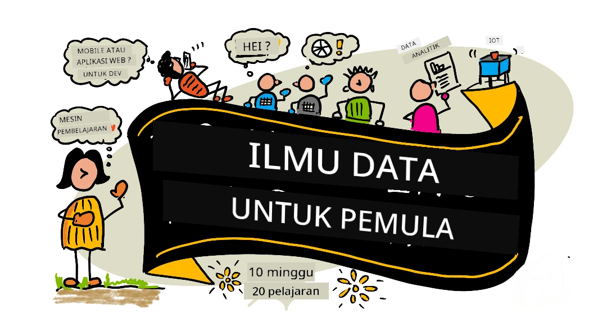
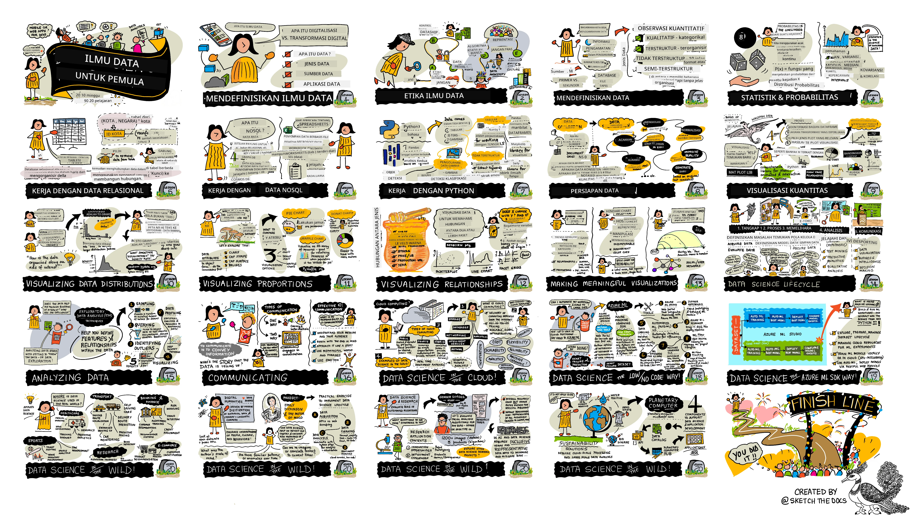

# Data Science untuk Pemula - Kurikulum

[](https://github.com/codespaces/new?hide_repo_select=true&ref=main&repo=344191198)

[](https://github.com/microsoft/Data-Science-For-Beginners/blob/master/LICENSE)
[](https://GitHub.com/microsoft/Data-Science-For-Beginners/graphs/contributors/)
[](https://GitHub.com/microsoft/Data-Science-For-Beginners/issues/)
[](https://GitHub.com/microsoft/Data-Science-For-Beginners/pulls/)
[](http://makeapullrequest.com)

[](https://GitHub.com/microsoft/Data-Science-For-Beginners/watchers/)
[](https://GitHub.com/microsoft/Data-Science-For-Beginners/network/)
[](https://GitHub.com/microsoft/Data-Science-For-Beginners/stargazers/)


[](https://discord.gg/nTYy5BXMWG)

[](https://aka.ms/foundry/forum)

Azure Cloud Advocates di Microsoft dengan senang hati menawarkan kurikulum 10 minggu, 20 pelajaran yang membahas Data Science. Setiap pelajaran mencakup kuis pra-pelajaran dan pasca-pelajaran, instruksi tertulis untuk menyelesaikan pelajaran, solusi, dan tugas. Metode pembelajaran berbasis proyek kami memungkinkan Anda belajar sambil membangun, cara yang terbukti efektif agar keterampilan baru dapat 'melekat'.

**Terima kasih sebesar-besarnya kepada penulis kami:** [Jasmine Greenaway](https://www.twitter.com/paladique), [Dmitry Soshnikov](http://soshnikov.com), [Nitya Narasimhan](https://twitter.com/nitya), [Jalen McGee](https://twitter.com/JalenMcG), [Jen Looper](https://twitter.com/jenlooper), [Maud Levy](https://twitter.com/maudstweets), [Tiffany Souterre](https://twitter.com/TiffanySouterre), [Christopher Harrison](https://www.twitter.com/geektrainer).

**🙏 Terima kasih khusus 🙏 kepada para penulis, pengulas, dan kontributor konten [Microsoft Student Ambassador](https://studentambassadors.microsoft.com/),** terutama Aaryan Arora, [Aditya Garg](https://github.com/AdityaGarg00), [Alondra Sanchez](https://www.linkedin.com/in/alondra-sanchez-molina/), [Ankita Singh](https://www.linkedin.com/in/ankitasingh007), [Anupam Mishra](https://www.linkedin.com/in/anupam--mishra/), [Arpita Das](https://www.linkedin.com/in/arpitadas01/), ChhailBihari Dubey, [Dibri Nsofor](https://www.linkedin.com/in/dibrinsofor), [Dishita Bhasin](https://www.linkedin.com/in/dishita-bhasin-7065281bb), [Majd Safi](https://www.linkedin.com/in/majd-s/), [Max Blum](https://www.linkedin.com/in/max-blum-6036a1186/), [Miguel Correa](https://www.linkedin.com/in/miguelmque/), [Mohamma Iftekher (Iftu) Ebne Jalal](https://twitter.com/iftu119), [Nawrin Tabassum](https://www.linkedin.com/in/nawrin-tabassum), [Raymond Wangsa Putra](https://www.linkedin.com/in/raymond-wp/), [Rohit Yadav](https://www.linkedin.com/in/rty2423), Samridhi Sharma, [Sanya Sinha](https://www.linkedin.com/mwlite/in/sanya-sinha-13aab1200),
[Sheena Narula](https://www.linkedin.com/in/sheena-narua-n/), [Tauqeer Ahmad](https://www.linkedin.com/in/tauqeerahmad5201/), Yogendrasingh Pawar , [Vidushi Gupta](https://www.linkedin.com/in/vidushi-gupta07/), [Jasleen Sondhi](https://www.linkedin.com/in/jasleen-sondhi/)

||
|:---:|
| Data Science untuk Pemula - _Sketchnote oleh [@nitya](https://twitter.com/nitya)_ |

### 🌐 Dukungan Multi-Bahasa

#### Didukung melalui GitHub Action (Otomatis & Selalu Terbaru)

<!-- CO-OP TRANSLATOR LANGUAGES TABLE START -->
[Arabic](../ar/README.md) | [Bengali](../bn/README.md) | [Bulgarian](../bg/README.md) | [Burmese (Myanmar)](../my/README.md) | [Chinese (Simplified)](../zh-CN/README.md) | [Chinese (Traditional, Hong Kong)](../zh-HK/README.md) | [Chinese (Traditional, Macau)](../zh-MO/README.md) | [Chinese (Traditional, Taiwan)](../zh-TW/README.md) | [Croatian](../hr/README.md) | [Czech](../cs/README.md) | [Danish](../da/README.md) | [Dutch](../nl/README.md) | [Estonian](../et/README.md) | [Finnish](../fi/README.md) | [French](../fr/README.md) | [German](../de/README.md) | [Greek](../el/README.md) | [Hebrew](../he/README.md) | [Hindi](../hi/README.md) | [Hungarian](../hu/README.md) | [Indonesian](./README.md) | [Italian](../it/README.md) | [Japanese](../ja/README.md) | [Kannada](../kn/README.md) | [Khmer](../km/README.md) | [Korean](../ko/README.md) | [Lithuanian](../lt/README.md) | [Malay](../ms/README.md) | [Malayalam](../ml/README.md) | [Marathi](../mr/README.md) | [Nepali](../ne/README.md) | [Nigerian Pidgin](../pcm/README.md) | [Norwegian](../no/README.md) | [Persian (Farsi)](../fa/README.md) | [Polish](../pl/README.md) | [Portuguese (Brazil)](../pt-BR/README.md) | [Portuguese (Portugal)](../pt-PT/README.md) | [Punjabi (Gurmukhi)](../pa/README.md) | [Romanian](../ro/README.md) | [Russian](../ru/README.md) | [Serbian (Cyrillic)](../sr/README.md) | [Slovak](../sk/README.md) | [Slovenian](../sl/README.md) | [Spanish](../es/README.md) | [Swahili](../sw/README.md) | [Swedish](../sv/README.md) | [Tagalog (Filipino)](../tl/README.md) | [Tamil](../ta/README.md) | [Telugu](../te/README.md) | [Thai](../th/README.md) | [Turkish](../tr/README.md) | [Ukrainian](../uk/README.md) | [Urdu](../ur/README.md) | [Vietnamese](../vi/README.md)

> **Lebih suka Mengkloning Secara Lokal?**
>
> Repositori ini menyertakan lebih dari 50 terjemahan bahasa yang secara signifikan meningkatkan ukuran unduhan. Untuk mengkloning tanpa terjemahan, gunakan sparse checkout:
>
> **Bash / macOS / Linux:**
> ```bash
> git clone --filter=blob:none --sparse https://github.com/microsoft/Data-Science-For-Beginners.git
> cd Data-Science-For-Beginners
> git sparse-checkout set --no-cone '/*' '!translations' '!translated_images'
> ```
>
> **CMD (Windows):**
> ```cmd
> git clone --filter=blob:none --sparse https://github.com/microsoft/Data-Science-For-Beginners.git
> cd Data-Science-For-Beginners
> git sparse-checkout set --no-cone "/*" "!translations" "!translated_images"
> ```
>
> Ini memberikan Anda semua yang diperlukan untuk menyelesaikan kursus dengan unduhan yang jauh lebih cepat.
<!-- CO-OP TRANSLATOR LANGUAGES TABLE END -->

**Jika Anda menginginkan dukungan bahasa terjemahan tambahan, bahasa-bahasa yang didukung tercantum [di sini](https://github.com/Azure/co-op-translator/blob/main/getting_started/supported-languages.md)**

#### Bergabung dengan Komunitas Kami 
[](https://discord.gg/nTYy5BXMWG)

Kami memiliki seri Discord belajar dengan AI yang sedang berlangsung, pelajari lebih lanjut dan bergabunglah dengan kami di [Seri Learn with AI](https://aka.ms/learnwithai/discord) dari 18 - 30 September 2025. Anda akan mendapatkan tips dan trik menggunakan GitHub Copilot untuk Data Science.


# Apakah Anda seorang pelajar?

Mulailah dengan sumber berikut:

- [Halaman Student Hub](https://docs.microsoft.com/en-gb/learn/student-hub?WT.mc_id=academic-77958-bethanycheum) Di halaman ini, Anda akan menemukan sumber daya untuk pemula, paket pelajar dan bahkan cara untuk mendapatkan voucher sertifikat gratis. Ini adalah halaman yang ingin Anda bookmark dan periksa dari waktu ke waktu karena kami mengganti konten setidaknya sebulan sekali.
- [Microsoft Learn Student Ambassadors](https://studentambassadors.microsoft.com?WT.mc_id=academic-77958-bethanycheum) Bergabunglah dengan komunitas global student ambassadors, ini bisa menjadi jalan Anda ke Microsoft.

# Memulai

## 📚 Dokumentasi

- **[Panduan Instalasi](INSTALLATION.md)** - Instruksi pengaturan langkah demi langkah untuk pemula
- **[Panduan Penggunaan](USAGE.md)** - Contoh dan alur kerja umum
- **[Pemecahan Masalah](TROUBLESHOOTING.md)** - Solusi untuk masalah umum
- **[Panduan Kontribusi](CONTRIBUTING.md)** - Cara berkontribusi pada proyek ini
- **[Untuk Guru](for-teachers.md)** - Panduan mengajar dan sumber daya kelas

## 👨‍🎓 Untuk Pelajar
> **Pemula Total**: Baru mengenal data science? Mulailah dengan [contoh yang ramah pemula](examples/README.md)! Contoh sederhana dan berkomentar ini akan membantu Anda memahami dasar sebelum menyelami seluruh kurikulum.
> **[Pelajar](https://aka.ms/student-page)**: untuk menggunakan kurikulum ini sendiri, fork seluruh repositori dan selesaikan latihan secara mandiri, mulai dengan kuis pra-kuliah. Kemudian baca materi kuliah dan selesaikan aktivitas lainnya. Cobalah membuat proyek dengan memahami pelajaran daripada menyalin kode solusi; meskipun demikian, kode tersebut tersedia di folder /solutions pada setiap pelajaran berorientasi proyek. Ide lain adalah membentuk kelompok belajar dengan teman dan mempelajari konten bersama-sama. Untuk studi lebih lanjut, kami merekomendasikan [Microsoft Learn](https://docs.microsoft.com/en-us/users/jenlooper-2911/collections/qprpajyoy3x0g7?WT.mc_id=academic-77958-bethanycheum).

**Mulai Cepat:**
1. Periksa [Panduan Instalasi](INSTALLATION.md) untuk menyiapkan lingkungan Anda
2. Tinjau [Panduan Penggunaan](USAGE.md) untuk belajar cara bekerja dengan kurikulum
3. Mulai dengan Pelajaran 1 dan kerjakan secara berurutan
4. Bergabunglah dengan [komunitas Discord kami](https://aka.ms/ds4beginners/discord) untuk dukungan

## 👩‍🏫 Untuk Guru
> **Guru**: kami telah [menyertakan beberapa saran](for-teachers.md) tentang cara menggunakan kurikulum ini. Kami sangat mengharapkan masukan Anda [di forum diskusi kami](https://github.com/microsoft/Data-Science-For-Beginners/discussions)!

## Kenali Tim

[](https://youtu.be/8mzavjQSMM4 "Promo video")

**Gif oleh** [Mohit Jaisal](https://www.linkedin.com/in/mohitjaisal)

> 🎥 Klik gambar di atas untuk video tentang proyek dan orang-orang yang membuatnya!

## Pedagogi

Kami telah memilih dua prinsip pedagogis saat membangun kurikulum ini: memastikan bahwa kurikulum ini berbasis proyek dan mencakup kuis yang sering. Pada akhir seri ini, siswa akan mempelajari prinsip dasar ilmu data, termasuk konsep etis, persiapan data, berbagai cara bekerja dengan data, visualisasi data, analisis data, kasus penggunaan dunia nyata dalam ilmu data, dan lainnya.

Selain itu, kuis dengan tekanan rendah sebelum kelas menetapkan niat siswa untuk mempelajari topik, sementara kuis kedua setelah kelas memastikan pengingatan lebih lanjut. Kurikulum ini dirancang agar fleksibel dan menyenangkan serta dapat diikuti secara keseluruhan atau sebagian. Proyek dimulai dari kecil dan menjadi semakin kompleks pada akhir siklus 10 minggu.

> Temukan [Kode Etik](CODE_OF_CONDUCT.md), [Panduan Kontribusi](CONTRIBUTING.md), [Panduan Terjemahan](TRANSLATIONS.md) kami. Kami menyambut masukan konstruktif Anda!

## Setiap pelajaran mencakup:

- Sketchnote opsional
- Video tambahan opsional
- Kuis pemanasan sebelum pelajaran
- Pelajaran tertulis
- Untuk pelajaran berbasis proyek, panduan langkah demi langkah tentang cara membangun proyek
- Pengecekan pengetahuan
- Tantangan
- Bacaan tambahan
- Tugas
- [Kuis pasca-pelajaran](https://ff-quizzes.netlify.app/en/)

> **Catatan tentang kuis**: Semua kuis terdapat di folder Quiz-App, dengan total 40 kuis masing-masing berisi tiga pertanyaan. Mereka terhubung dari dalam pelajaran, tetapi aplikasi kuis dapat dijalankan secara lokal atau dideploy ke Azure; ikuti petunjuk di folder `quiz-app`. Kuis-kuis ini sedang secara bertahap dilokalkan.

## 🎓 Contoh Ramah untuk Pemula

**Baru di Ilmu Data?** Kami telah membuat [direktori contoh](examples/README.md) khusus dengan kode sederhana dan berkomentar lengkap untuk membantu Anda memulai:

- 🌟 **Hello World** - Program ilmu data pertama Anda
- 📂 **Memuat Data** - Belajar membaca dan mengeksplorasi dataset
- 📊 **Analisis Sederhana** - Hitung statistik dan temukan pola
- 📈 **Visualisasi Dasar** - Buat grafik dan diagram
- 🔬 **Proyek Dunia Nyata** - Alur kerja lengkap dari awal sampai akhir

Setiap contoh menyertakan komentar detail yang menjelaskan setiap langkah, membuatnya sempurna untuk pemula sekali pun!

👉 **[Mulai dengan contoh](examples/README.md)** 👈

## Pelajaran


||
|:---:|
| Data Science untuk Pemula: Peta Jalan - _Sketchnote oleh [@nitya](https://twitter.com/nitya)_ |


| Nomor Pelajaran | Topik | Kelompok Pelajaran | Tujuan Pembelajaran | Pelajaran Terkait | Penulis |
| :-----------: | :----------------------------------------: | :--------------------------------------------------: | :-----------------------------------------------------------------------------------------------------------------------------------------------------------------------: | :---------------------------------------------------------------------: | :----: |
| 01 | Mendefinisikan Ilmu Data | [Pendahuluan](1-Introduction/README.md) | Pelajari konsep dasar di balik ilmu data dan bagaimana kaitannya dengan kecerdasan buatan, pembelajaran mesin, dan big data. | [pelajaran](1-Introduction/01-defining-data-science/README.md) [video](https://youtu.be/beZ7Mb_oz9I) | [Dmitry](http://soshnikov.com) |
| 02 | Etika Ilmu Data | [Pendahuluan](1-Introduction/README.md) | Konsep Etika Data, Tantangan & Kerangka Kerja. | [pelajaran](1-Introduction/02-ethics/README.md) | [Nitya](https://twitter.com/nitya) |
| 03 | Mendefinisikan Data | [Pendahuluan](1-Introduction/README.md) | Bagaimana data diklasifikasikan dan sumber umumnya. | [pelajaran](1-Introduction/03-defining-data/README.md) | [Jasmine](https://www.twitter.com/paladique) |
| 04 | Pengantar Statistik & Probabilitas | [Pendahuluan](1-Introduction/README.md) | Teknik matematika probabilitas dan statistik untuk memahami data. | [pelajaran](1-Introduction/04-stats-and-probability/README.md) [video](https://youtu.be/Z5Zy85g4Yjw) | [Dmitry](http://soshnikov.com) |
| 05 | Bekerja dengan Data Relasional | [Bekerja Dengan Data](2-Working-With-Data/README.md) | Pengantar data relasional dan dasar eksplorasi serta analisis data relasional dengan Structured Query Language, juga dikenal sebagai SQL (diucapkan “see-quell”). | [pelajaran](2-Working-With-Data/05-relational-databases/README.md) | [Christopher](https://www.twitter.com/geektrainer) | | |
| 06 | Bekerja dengan Data NoSQL | [Bekerja Dengan Data](2-Working-With-Data/README.md) | Pengantar data non-relasional, berbagai jenisnya, dan dasar eksplorasi serta analisis database dokumen. | [pelajaran](2-Working-With-Data/06-non-relational/README.md) | [Jasmine](https://twitter.com/paladique)|
| 07 | Bekerja dengan Python | [Bekerja Dengan Data](2-Working-With-Data/README.md) | Dasar penggunaan Python untuk eksplorasi data dengan pustaka seperti Pandas. Pemahaman dasar pemrograman Python direkomendasikan. | [pelajaran](2-Working-With-Data/07-python/README.md) [video](https://youtu.be/dZjWOGbsN4Y) | [Dmitry](http://soshnikov.com) |
| 08 | Persiapan Data | [Bekerja Dengan Data](2-Working-With-Data/README.md) | Topik tentang teknik data untuk membersihkan dan mengubah data untuk menangani tantangan data yang hilang, tidak akurat, atau tidak lengkap. | [pelajaran](2-Working-With-Data/08-data-preparation/README.md) | [Jasmine](https://www.twitter.com/paladique) |
| 09 | Visualisasi Kuantitas | [Visualisasi Data](3-Data-Visualization/README.md) | Pelajari cara menggunakan Matplotlib untuk memvisualisasikan data burung 🦆 | [pelajaran](3-Data-Visualization/09-visualization-quantities/README.md) | [Jen](https://twitter.com/jenlooper) |
| 10 | Visualisasi Distribusi Data | [Visualisasi Data](3-Data-Visualization/README.md) | Memvisualisasikan pengamatan dan tren dalam suatu interval. | [pelajaran](3-Data-Visualization/10-visualization-distributions/README.md) | [Jen](https://twitter.com/jenlooper) |
| 11 | Visualisasi Proporsi | [Visualisasi Data](3-Data-Visualization/README.md) | Memvisualisasikan persentase diskret dan berkelompok. | [pelajaran](3-Data-Visualization/11-visualization-proportions/README.md) | [Jen](https://twitter.com/jenlooper) |
| 12 | Visualisasi Hubungan | [Visualisasi Data](3-Data-Visualization/README.md) | Memvisualisasikan koneksi dan korelasi antara set data dan variabelnya. | [pelajaran](3-Data-Visualization/12-visualization-relationships/README.md) | [Jen](https://twitter.com/jenlooper) |
| 13 | Visualisasi yang Bermakna | [Visualisasi Data](3-Data-Visualization/README.md) | Teknik dan panduan untuk membuat visualisasi Anda berharga bagi pemecahan masalah dan wawasan yang efektif. | [pelajaran](3-Data-Visualization/13-meaningful-visualizations/README.md) | [Jen](https://twitter.com/jenlooper) |
| 14 | Pengantar siklus hidup Ilmu Data | [Siklus Hidup](4-Data-Science-Lifecycle/README.md) | Pengantar siklus hidup ilmu data dan langkah pertamanya yaitu memperoleh dan mengekstrak data. | [pelajaran](4-Data-Science-Lifecycle/14-Introduction/README.md) | [Jasmine](https://twitter.com/paladique) |
| 15 | Menganalisis | [Siklus Hidup](4-Data-Science-Lifecycle/README.md) | Fase siklus hidup ilmu data yang berfokus pada teknik untuk menganalisis data. | [pelajaran](4-Data-Science-Lifecycle/15-analyzing/README.md) | [Jasmine](https://twitter.com/paladique) | | |
| 16 | Komunikasi | [Siklus Hidup](4-Data-Science-Lifecycle/README.md) | Fase siklus hidup ilmu data yang berfokus pada penyajian wawasan dari data dengan cara yang memudahkan pembuat keputusan memahami. | [pelajaran](4-Data-Science-Lifecycle/16-communication/README.md) | [Jalen](https://twitter.com/JalenMcG) | | |
| 17 | Ilmu Data di Cloud | [Data Cloud](5-Data-Science-In-Cloud/README.md) | Seri pelajaran ini memperkenalkan ilmu data di cloud dan manfaatnya. | [pelajaran](5-Data-Science-In-Cloud/17-Introduction/README.md) | [Tiffany](https://twitter.com/TiffanySouterre) dan [Maud](https://twitter.com/maudstweets) |
| 18 | Ilmu Data di Cloud | [Data Cloud](5-Data-Science-In-Cloud/README.md) | Melatih model menggunakan alat Low Code. |[pelajaran](5-Data-Science-In-Cloud/18-Low-Code/README.md) | [Tiffany](https://twitter.com/TiffanySouterre) dan [Maud](https://twitter.com/maudstweets) |
| 19 | Ilmu Data di Cloud | [Data Cloud](5-Data-Science-In-Cloud/README.md) | Menempatkan model dengan Azure Machine Learning Studio. | [pelajaran](5-Data-Science-In-Cloud/19-Azure/README.md)| [Tiffany](https://twitter.com/TiffanySouterre) dan [Maud](https://twitter.com/maudstweets) |
| 20 | Ilmu Data di Dunia Nyata | [Di Dunia Nyata](6-Data-Science-In-Wild/README.md) | Proyek ilmu data yang diterapkan di dunia nyata. | [pelajaran](6-Data-Science-In-Wild/20-Real-World-Examples/README.md) | [Nitya](https://twitter.com/nitya) |

## GitHub Codespaces

Ikuti langkah-langkah ini untuk membuka contoh ini di Codespace:
1. Klik menu tarik-turun Code dan pilih opsi Open with Codespaces.
2. Pilih + New codespace di bagian bawah panel.
Untuk informasi lebih lanjut, lihat [dokumentasi GitHub](https://docs.github.com/en/codespaces/developing-in-codespaces/creating-a-codespace-for-a-repository#creating-a-codespace).

## VSCode Remote - Containers
Ikuti langkah-langkah ini untuk membuka repo ini dalam container menggunakan mesin lokal Anda dan VSCode dengan menggunakan ekstensi VS Code Remote - Containers:

1. Jika ini pertama kali Anda menggunakan container pengembangan, pastikan sistem Anda memenuhi prasyarat (misalnya memiliki Docker terinstal) dalam [dokumentasi memulai](https://code.visualstudio.com/docs/devcontainers/containers#_getting-started).

Untuk menggunakan repositori ini, Anda dapat membuka repositori dalam volume Docker terisolasi:

**Catatan**: Di balik layar, ini akan menggunakan perintah Remote-Containers: **Clone Repository in Container Volume...** untuk mengkloning kode sumber ke volume Docker alih-alih sistem file lokal. [Volume](https://docs.docker.com/storage/volumes/) adalah mekanisme yang disarankan untuk menyimpan data container.

Atau buka versi repositori yang sudah dikloning atau diunduh secara lokal:

- Klon repositori ini ke sistem file lokal Anda.
- Tekan F1 dan pilih perintah **Remote-Containers: Open Folder in Container...**.
- Pilih folder yang sudah dikloning, tunggu kontainer dimulai, dan coba gunakan.

## Akses Offline

Anda dapat menjalankan dokumentasi ini secara offline dengan menggunakan [Docsify](https://docsify.js.org/#/). Fork repo ini, [instal Docsify](https://docsify.js.org/#/quickstart) di mesin lokal Anda, lalu di folder root repo ini, ketik `docsify serve`. Situs akan disajikan di port 3000 di localhost Anda: `localhost:3000`.

> Catatan, notebook tidak akan dirender melalui Docsify, jadi ketika Anda perlu menjalankan notebook, lakukan secara terpisah di VS Code yang menjalankan kernel Python.

## Kurikulum Lainnya

Tim kami memproduksi kurikulum lain! Lihat:

<!-- CO-OP TRANSLATOR OTHER COURSES START -->
### LangChain
[](https://aka.ms/langchain4j-for-beginners)
[](https://aka.ms/langchainjs-for-beginners?WT.mc_id=m365-94501-dwahlin)
[](https://github.com/microsoft/langchain-for-beginners?WT.mc_id=m365-94501-dwahlin)
---

### Azure / Edge / MCP / Agen
[](https://github.com/microsoft/AZD-for-beginners?WT.mc_id=academic-105485-koreyst)
[](https://github.com/microsoft/edgeai-for-beginners?WT.mc_id=academic-105485-koreyst)
[](https://github.com/microsoft/mcp-for-beginners?WT.mc_id=academic-105485-koreyst)
[](https://github.com/microsoft/ai-agents-for-beginners?WT.mc_id=academic-105485-koreyst)

---
 
### Seri AI Generatif
[](https://github.com/microsoft/generative-ai-for-beginners?WT.mc_id=academic-105485-koreyst)
[-9333EA?style=for-the-badge&labelColor=E5E7EB&color=9333EA)](https://github.com/microsoft/Generative-AI-for-beginners-dotnet?WT.mc_id=academic-105485-koreyst)
[-C084FC?style=for-the-badge&labelColor=E5E7EB&color=C084FC)](https://github.com/microsoft/generative-ai-for-beginners-java?WT.mc_id=academic-105485-koreyst)
[-E879F9?style=for-the-badge&labelColor=E5E7EB&color=E879F9)](https://github.com/microsoft/generative-ai-with-javascript?WT.mc_id=academic-105485-koreyst)

---
 
### Pembelajaran Inti
[](https://aka.ms/ml-beginners?WT.mc_id=academic-105485-koreyst)
[](https://aka.ms/datascience-beginners?WT.mc_id=academic-105485-koreyst)
[](https://aka.ms/ai-beginners?WT.mc_id=academic-105485-koreyst)
[](https://github.com/microsoft/Security-101?WT.mc_id=academic-96948-sayoung)
[](https://aka.ms/webdev-beginners?WT.mc_id=academic-105485-koreyst)
[](https://aka.ms/iot-beginners?WT.mc_id=academic-105485-koreyst)
[](https://github.com/microsoft/xr-development-for-beginners?WT.mc_id=academic-105485-koreyst)

---
 
### Seri Copilot
[](https://aka.ms/GitHubCopilotAI?WT.mc_id=academic-105485-koreyst)
[](https://github.com/microsoft/mastering-github-copilot-for-dotnet-csharp-developers?WT.mc_id=academic-105485-koreyst)
[](https://github.com/microsoft/CopilotAdventures?WT.mc_id=academic-105485-koreyst)
<!-- CO-OP TRANSLATOR OTHER COURSES END -->

## Mendapatkan Bantuan

**Mengalami masalah?** Periksa [Panduan Pemecahan Masalah](TROUBLESHOOTING.md) kami untuk solusi atas masalah umum.

Jika Anda mengalami kebuntuan atau memiliki pertanyaan tentang membangun aplikasi AI. Bergabunglah dengan sesama pelajar dan pengembang berpengalaman dalam diskusi tentang MCP. Ini adalah komunitas yang mendukung di mana pertanyaan disambut dan pengetahuan dibagikan secara bebas.

[](https://discord.gg/nTYy5BXMWG)

Jika Anda memiliki masukan produk atau menemukan kesalahan saat membangun, kunjungi:

[](https://aka.ms/foundry/forum)

---

<!-- CO-OP TRANSLATOR DISCLAIMER START -->
**Penafian**:  
Dokumen ini telah diterjemahkan menggunakan layanan terjemahan AI [Co-op Translator](https://github.com/Azure/co-op-translator). Meskipun kami berupaya untuk akurasi, harap diperhatikan bahwa terjemahan otomatis mungkin mengandung kesalahan atau ketidakakuratan. Dokumen asli dalam bahasa aslinya harus dianggap sebagai sumber yang sahih. Untuk informasi penting, disarankan menggunakan terjemahan profesional oleh manusia. Kami tidak bertanggung jawab atas kesalahpahaman atau salah tafsir yang timbul dari penggunaan terjemahan ini.
<!-- CO-OP TRANSLATOR DISCLAIMER END -->