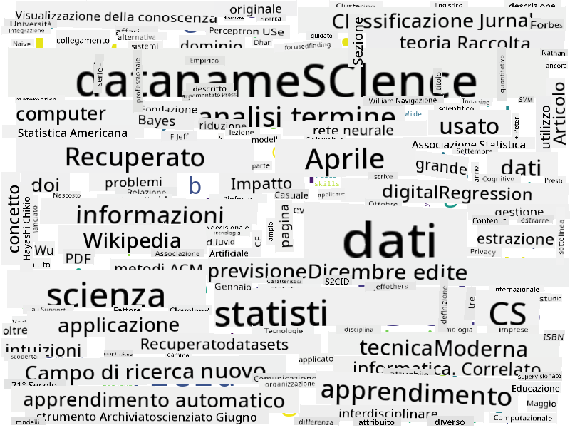

<!--
CO_OP_TRANSLATOR_METADATA:
{
  "original_hash": "8141e7195841682914be03ef930fe43d",
  "translation_date": "2025-09-03T20:13:51+00:00",
  "source_file": "1-Introduction/01-defining-data-science/README.md",
  "language_code": "it"
}
-->
## Tipi di Dati

Come abbiamo già accennato, i dati sono ovunque. Basta catturarli nel modo giusto! È utile distinguere tra dati **strutturati** e **non strutturati**. I primi sono generalmente rappresentati in una forma ben organizzata, spesso come una tabella o un insieme di tabelle, mentre i secondi sono semplicemente una raccolta di file. A volte possiamo anche parlare di dati **semi-strutturati**, che hanno una sorta di struttura che può variare notevolmente.

| Strutturati                                                                | Semi-strutturati                                                                                 | Non strutturati                        |
| -------------------------------------------------------------------------- | ------------------------------------------------------------------------------------------------ | -------------------------------------- |
| Elenco di persone con i loro numeri di telefono                            | Pagine di Wikipedia con collegamenti                                                             | Testo dell'Enciclopedia Britannica     |
| Temperatura in tutte le stanze di un edificio ogni minuto negli ultimi 20 anni | Raccolta di articoli scientifici in formato JSON con autori, data di pubblicazione e abstract     | Condivisione di file con documenti aziendali |
| Dati sull'età e il genere di tutte le persone che entrano nell'edificio    | Pagine Internet                                                                                  | Flusso video grezzo da una telecamera di sorveglianza |

## Dove trovare i Dati

Esistono molte possibili fonti di dati, ed è impossibile elencarle tutte! Tuttavia, menzioniamo alcune delle fonti tipiche da cui è possibile ottenere dati:

* **Strutturati**
  - **Internet delle Cose** (IoT), inclusi dati provenienti da diversi sensori, come sensori di temperatura o pressione, che forniscono molti dati utili. Ad esempio, se un edificio per uffici è dotato di sensori IoT, possiamo controllare automaticamente il riscaldamento e l'illuminazione per ridurre i costi.
  - **Sondaggi** che chiediamo agli utenti di completare dopo un acquisto o dopo aver visitato un sito web.
  - **Analisi del comportamento** può, ad esempio, aiutarci a capire quanto profondamente un utente esplora un sito e qual è il motivo tipico per cui lo abbandona.
* **Non strutturati**
  - **Testi** possono essere una ricca fonte di informazioni, come un punteggio complessivo di **sentiment**, o l'estrazione di parole chiave e significati semantici.
  - **Immagini** o **Video**. Un video da una telecamera di sorveglianza può essere utilizzato per stimare il traffico sulla strada e informare le persone su potenziali ingorghi.
  - **Log** dei server web possono essere utilizzati per capire quali pagine del nostro sito sono visitate più frequentemente e per quanto tempo.
* **Semi-strutturati**
  - I grafi delle **reti sociali** possono essere ottime fonti di dati sulla personalità degli utenti e sull'efficacia potenziale nella diffusione di informazioni.
  - Quando abbiamo una serie di fotografie da una festa, possiamo provare a estrarre dati sulla **dinamica di gruppo** costruendo un grafo delle persone che si fotografano insieme.

Conoscendo le diverse possibili fonti di dati, puoi provare a pensare a diversi scenari in cui le tecniche di data science possono essere applicate per comprendere meglio la situazione e migliorare i processi aziendali.

## Cosa puoi fare con i Dati

Nella Data Science, ci concentriamo sui seguenti passaggi del percorso dei dati:

## Digitalizzazione e Trasformazione Digitale

Nell'ultimo decennio, molte aziende hanno iniziato a comprendere l'importanza dei dati per prendere decisioni aziendali. Per applicare i principi della data science alla gestione di un'azienda, è necessario innanzitutto raccogliere alcuni dati, ovvero tradurre i processi aziendali in forma digitale. Questo è noto come **digitalizzazione**. Applicare tecniche di data science a questi dati per guidare le decisioni può portare a significativi aumenti di produttività (o persino a un cambiamento radicale dell'azienda), chiamato **trasformazione digitale**.

Consideriamo un esempio. Supponiamo di avere un corso di data science (come questo) che offriamo online agli studenti e vogliamo utilizzare la data science per migliorarlo. Come possiamo farlo?

Possiamo iniziare chiedendoci "Cosa può essere digitalizzato?" Il modo più semplice sarebbe misurare il tempo che ogni studente impiega per completare ogni modulo e valutare le conoscenze acquisite somministrando un test a scelta multipla alla fine di ogni modulo. Calcolando la media del tempo di completamento tra tutti gli studenti, possiamo scoprire quali moduli causano maggiori difficoltà e lavorare per semplificarli.
Potresti sostenere che questo approccio non sia ideale, perché i moduli possono avere lunghezze diverse. Probabilmente è più equo dividere il tempo per la lunghezza del modulo (in numero di caratteri) e confrontare quei valori invece.
Quando iniziamo ad analizzare i risultati dei test a scelta multipla, possiamo cercare di determinare quali concetti gli studenti trovano difficili da comprendere e utilizzare queste informazioni per migliorare i contenuti. Per farlo, dobbiamo progettare i test in modo che ogni domanda sia associata a un determinato concetto o blocco di conoscenza.

Se vogliamo complicare ulteriormente l'analisi, possiamo tracciare il tempo impiegato per ogni modulo rispetto alla categoria di età degli studenti. Potremmo scoprire che per alcune categorie di età il completamento del modulo richiede un tempo eccessivamente lungo, oppure che gli studenti abbandonano prima di completarlo. Questo può aiutarci a fornire raccomandazioni di età per il modulo e a ridurre l'insoddisfazione derivante da aspettative errate.

## 🚀 Sfida

In questa sfida, cercheremo di individuare concetti rilevanti per il campo della Data Science analizzando dei testi. Prenderemo un articolo di Wikipedia sulla Data Science, scaricheremo e processeremo il testo, e poi costruiremo una word cloud come questa:

Visita [`notebook.ipynb`](../../../../../../../../../1-Introduction/01-defining-data-science/notebook.ipynb ':ignore') per leggere il codice. Puoi anche eseguire il codice e vedere come trasforma i dati in tempo reale.

> Se non sai come eseguire il codice in un Jupyter Notebook, dai un'occhiata a [questo articolo](https://soshnikov.com/education/how-to-execute-notebooks-from-github/).

## [Quiz post-lezione](https://ff-quizzes.netlify.app/en/ds/)

## Compiti

* **Compito 1**: Modifica il codice sopra per individuare concetti correlati ai campi di **Big Data** e **Machine Learning**  
* **Compito 2**: [Pensa a scenari di Data Science](assignment.md)

## Crediti

Questa lezione è stata scritta con ♥️ da [Dmitry Soshnikov](http://soshnikov.com)

---

**Disclaimer**:  
Questo documento è stato tradotto utilizzando il servizio di traduzione automatica [Co-op Translator](https://github.com/Azure/co-op-translator). Sebbene ci impegniamo per garantire l'accuratezza, si prega di notare che le traduzioni automatiche possono contenere errori o imprecisioni. Il documento originale nella sua lingua nativa dovrebbe essere considerato la fonte autorevole. Per informazioni critiche, si raccomanda una traduzione professionale effettuata da un traduttore umano. Non siamo responsabili per eventuali incomprensioni o interpretazioni errate derivanti dall'uso di questa traduzione.