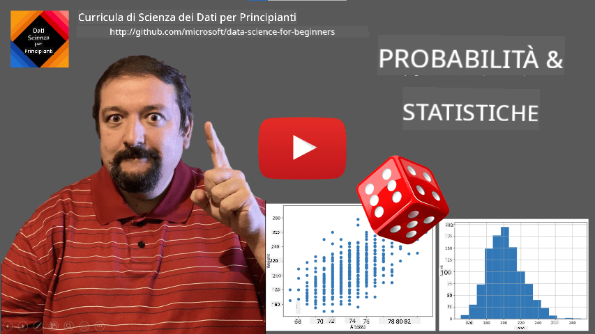
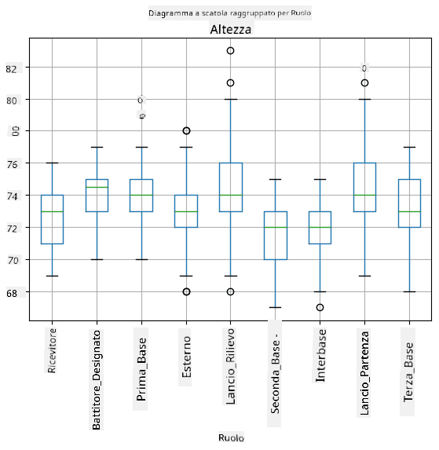
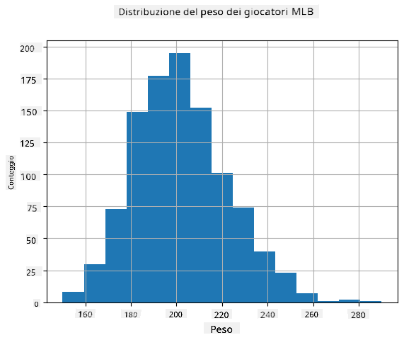
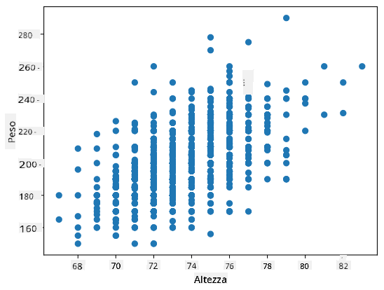

<!--
CO_OP_TRANSLATOR_METADATA:
{
  "original_hash": "8bbb3fa0d4ad61384a3b4b5f7560226f",
  "translation_date": "2025-09-04T18:02:14+00:00",
  "source_file": "1-Introduction/04-stats-and-probability/README.md",
  "language_code": "it"
}
-->
# Una Breve Introduzione alla Statistica e alla Probabilità

| ](../../sketchnotes/04-Statistics-Probability.png)|
|:---:|
| Statistica e Probabilità - _Sketchnote di [@nitya](https://twitter.com/nitya)_ |

La Statistica e la Teoria della Probabilità sono due aree della Matematica strettamente correlate e molto rilevanti per la Data Science. È possibile lavorare con i dati senza una conoscenza approfondita della matematica, ma è comunque meglio conoscere almeno alcuni concetti di base. Qui presenteremo una breve introduzione che ti aiuterà a iniziare.

[](https://youtu.be/Z5Zy85g4Yjw)

## [Quiz pre-lezione](https://purple-hill-04aebfb03.1.azurestaticapps.net/quiz/6)

## Probabilità e Variabili Casuali

**La probabilità** è un numero compreso tra 0 e 1 che esprime quanto è probabile che si verifichi un **evento**. È definita come il numero di risultati positivi (che portano all'evento), diviso per il numero totale di risultati, supponendo che tutti i risultati siano ugualmente probabili. Ad esempio, quando lanciamo un dado, la probabilità di ottenere un numero pari è 3/6 = 0,5.

Quando parliamo di eventi, utilizziamo **variabili casuali**. Ad esempio, la variabile casuale che rappresenta il numero ottenuto lanciando un dado può assumere valori da 1 a 6. L'insieme dei numeri da 1 a 6 è chiamato **spazio campionario**. Possiamo parlare della probabilità che una variabile casuale assuma un certo valore, ad esempio P(X=3)=1/6.

La variabile casuale nell'esempio precedente è chiamata **discreta**, perché ha uno spazio campionario numerabile, ovvero ci sono valori separati che possono essere enumerati. Ci sono casi in cui lo spazio campionario è un intervallo di numeri reali o l'intero insieme dei numeri reali. Tali variabili sono chiamate **continue**. Un buon esempio è l'orario di arrivo di un autobus.

## Distribuzione di Probabilità

Nel caso di variabili casuali discrete, è facile descrivere la probabilità di ciascun evento tramite una funzione P(X). Per ogni valore *s* dello spazio campionario *S*, essa fornirà un numero compreso tra 0 e 1, tale che la somma di tutti i valori di P(X=s) per tutti gli eventi sia pari a 1.

La distribuzione discreta più nota è la **distribuzione uniforme**, in cui c'è uno spazio campionario di N elementi, con probabilità uguale di 1/N per ciascuno di essi.

È più difficile descrivere la distribuzione di probabilità di una variabile continua, con valori estratti da un intervallo [a,b] o dall'intero insieme dei numeri reali ℝ. Consideriamo il caso dell'orario di arrivo di un autobus. In realtà, per ogni orario esatto di arrivo *t*, la probabilità che un autobus arrivi esattamente a quell'ora è 0!

> Ora sai che eventi con probabilità 0 accadono, e molto spesso! Almeno ogni volta che arriva l'autobus!

Possiamo solo parlare della probabilità che una variabile rientri in un determinato intervallo di valori, ad esempio P(t<sub>1</sub>≤X<t<sub>2</sub>). In questo caso, la distribuzione di probabilità è descritta da una **funzione di densità di probabilità** p(x), tale che


Un analogo continuo della distribuzione uniforme è chiamato **uniforme continua**, che è definito su un intervallo finito. La probabilità che il valore X rientri in un intervallo di lunghezza l è proporzionale a l e cresce fino a 1.

Un'altra distribuzione importante è la **distribuzione normale**, di cui parleremo più dettagliatamente di seguito.

## Media, Varianza e Deviazione Standard

Supponiamo di estrarre una sequenza di n campioni di una variabile casuale X: x<sub>1</sub>, x<sub>2</sub>, ..., x<sub>n</sub>. Possiamo definire il valore **medio** (o **media aritmetica**) della sequenza nel modo tradizionale come (x<sub>1</sub>+x<sub>2</sub>+x<sub>n</sub>)/n. Aumentando la dimensione del campione (cioè prendendo il limite con n→∞), otterremo la media (chiamata anche **aspettativa**) della distribuzione. Denoteremo l'aspettativa con **E**(x).

> Si può dimostrare che per qualsiasi distribuzione discreta con valori {x<sub>1</sub>, x<sub>2</sub>, ..., x<sub>N</sub>} e probabilità corrispondenti p<sub>1</sub>, p<sub>2</sub>, ..., p<sub>N</sub>, l'aspettativa sarà pari a E(X)=x<sub>1</sub>p<sub>1</sub>+x<sub>2</sub>p<sub>2</sub>+...+x<sub>N</sub>p<sub>N</sub>.

Per identificare quanto i valori siano dispersi, possiamo calcolare la varianza σ<sup>2</sup> = ∑(x<sub>i</sub> - μ)<sup>2</sup>/n, dove μ è la media della sequenza. Il valore σ è chiamato **deviazione standard**, e σ<sup>2</sup> è chiamato **varianza**.

## Moda, Mediana e Quartili

A volte, la media non rappresenta adeguatamente il valore "tipico" dei dati. Ad esempio, quando ci sono alcuni valori estremi completamente fuori scala, questi possono influenzare la media. Un'altra buona indicazione è la **mediana**, un valore tale che metà dei punti dati sono inferiori a esso e l'altra metà - superiori.

Per aiutarci a comprendere la distribuzione dei dati, è utile parlare di **quartili**:

* Il primo quartile, o Q1, è un valore tale che il 25% dei dati è inferiore a esso
* Il terzo quartile, o Q3, è un valore tale che il 75% dei dati è inferiore a esso

Graficamente possiamo rappresentare la relazione tra mediana e quartili in un diagramma chiamato **box plot**:


Qui calcoliamo anche l'**intervallo interquartile** IQR=Q3-Q1 e i cosiddetti **outlier** - valori che si trovano al di fuori dei limiti [Q1-1.5*IQR,Q3+1.5*IQR].

Per una distribuzione finita che contiene un numero limitato di valori possibili, un buon valore "tipico" è quello che appare più frequentemente, chiamato **moda**. È spesso applicato ai dati categoriali, come i colori. Consideriamo una situazione in cui abbiamo due gruppi di persone: alcuni che preferiscono fortemente il rosso e altri che preferiscono il blu. Se codifichiamo i colori con numeri, il valore medio per il colore preferito sarebbe da qualche parte nello spettro arancione-verde, che non indica la reale preferenza di nessuno dei due gruppi. Tuttavia, la moda sarebbe uno dei colori, o entrambi i colori, se il numero di persone che li preferisce è uguale (in questo caso chiamiamo il campione **multimodale**).

## Dati del Mondo Reale

Quando analizziamo dati reali, spesso non sono variabili casuali in senso stretto, nel senso che non eseguiamo esperimenti con risultati sconosciuti. Ad esempio, consideriamo una squadra di giocatori di baseball e i loro dati fisici, come altezza, peso ed età. Questi numeri non sono esattamente casuali, ma possiamo comunque applicare gli stessi concetti matematici. Ad esempio, una sequenza di pesi delle persone può essere considerata una sequenza di valori estratti da una variabile casuale. Di seguito è riportata la sequenza dei pesi di veri giocatori di baseball della [Major League Baseball](http://mlb.mlb.com/index.jsp), tratta da [questo dataset](http://wiki.stat.ucla.edu/socr/index.php/SOCR_Data_MLB_HeightsWeights) (per comodità, sono mostrati solo i primi 20 valori):

```
[180.0, 215.0, 210.0, 210.0, 188.0, 176.0, 209.0, 200.0, 231.0, 180.0, 188.0, 180.0, 185.0, 160.0, 180.0, 185.0, 197.0, 189.0, 185.0, 219.0]
```

> **Nota**: Per vedere un esempio di lavoro con questo dataset, dai un'occhiata al [notebook allegato](notebook.ipynb). Ci sono anche una serie di sfide in questa lezione, e puoi completarle aggiungendo del codice a quel notebook. Se non sei sicuro di come operare sui dati, non preoccuparti: torneremo a lavorare con i dati usando Python in un momento successivo. Se non sai come eseguire codice in Jupyter Notebook, dai un'occhiata a [questo articolo](https://soshnikov.com/education/how-to-execute-notebooks-from-github/).

Ecco il box plot che mostra media, mediana e quartili per i nostri dati:


Poiché i nostri dati contengono informazioni sui diversi **ruoli** dei giocatori, possiamo anche creare un box plot per ruolo - questo ci permetterà di capire come i valori dei parametri differiscono tra i ruoli. Questa volta considereremo l'altezza:



Questo diagramma suggerisce che, in media, l'altezza dei giocatori di prima base è maggiore rispetto a quella dei giocatori di seconda base. Più avanti in questa lezione impareremo come possiamo testare questa ipotesi in modo più formale e come dimostrare che i nostri dati sono statisticamente significativi per mostrarlo.

> Quando lavoriamo con dati reali, assumiamo che tutti i punti dati siano campioni estratti da una distribuzione di probabilità. Questa assunzione ci permette di applicare tecniche di machine learning e costruire modelli predittivi funzionanti.

Per vedere quale sia la distribuzione dei nostri dati, possiamo tracciare un grafico chiamato **istogramma**. L'asse X conterrà un numero di diversi intervalli di peso (i cosiddetti **bin**), e l'asse verticale mostrerà il numero di volte in cui il campione della variabile casuale rientrava in un determinato intervallo.



Da questo istogramma puoi vedere che tutti i valori sono centrati attorno a un certo peso medio, e più ci allontaniamo da quel peso, meno pesi di quel valore vengono riscontrati. Cioè, è molto improbabile che il peso di un giocatore di baseball sia molto diverso dal peso medio. La varianza dei pesi mostra la misura in cui i pesi tendono a differire dalla media.

> Se prendiamo i pesi di altre persone, non appartenenti alla lega di baseball, la distribuzione sarà probabilmente diversa. Tuttavia, la forma della distribuzione sarà la stessa, ma la media e la varianza cambieranno. Quindi, se addestriamo il nostro modello sui giocatori di baseball, è probabile che dia risultati errati quando applicato agli studenti di un'università, perché la distribuzione sottostante è diversa.

## Distribuzione Normale

La distribuzione dei pesi che abbiamo visto sopra è molto tipica, e molte misurazioni del mondo reale seguono lo stesso tipo di distribuzione, ma con media e varianza diverse. Questa distribuzione è chiamata **distribuzione normale**, e svolge un ruolo molto importante nella statistica.

Utilizzare la distribuzione normale è un modo corretto per generare pesi casuali di potenziali giocatori di baseball. Una volta che conosciamo il peso medio `mean` e la deviazione standard `std`, possiamo generare 1000 campioni di peso nel seguente modo:
```python
samples = np.random.normal(mean,std,1000)
``` 

Se tracciamo l'istogramma dei campioni generati, vedremo un'immagine molto simile a quella mostrata sopra. E se aumentiamo il numero di campioni e il numero di bin, possiamo generare un'immagine di una distribuzione normale più vicina all'ideale:


*Distribuzione Normale con media=0 e dev.stand=1*

## Intervalli di Confidenza

Quando parliamo dei pesi dei giocatori di baseball, assumiamo che ci sia una certa **variabile casuale W** che corrisponde alla distribuzione di probabilità ideale dei pesi di tutti i giocatori di baseball (la cosiddetta **popolazione**). La nostra sequenza di pesi corrisponde a un sottoinsieme di tutti i giocatori di baseball che chiamiamo **campione**. Una domanda interessante è: possiamo conoscere i parametri della distribuzione di W, cioè la media e la varianza della popolazione?

La risposta più semplice sarebbe calcolare la media e la varianza del nostro campione. Tuttavia, potrebbe accadere che il nostro campione casuale non rappresenti accuratamente l'intera popolazione. Pertanto, ha senso parlare di **intervallo di confidenza**.
> **Intervallo di confidenza** è la stima della vera media della popolazione basata sul nostro campione, che è accurata con una certa probabilità (o **livello di confidenza**).
Supponiamo di avere un campione X<sub>1</sub>, ..., X<sub>n</sub> dalla nostra distribuzione. Ogni volta che estraiamo un campione dalla distribuzione, otteniamo un valore medio μ diverso. Pertanto, μ può essere considerato una variabile casuale. Un **intervallo di confidenza** con confidenza p è una coppia di valori (L<sub>p</sub>,R<sub>p</sub>), tale che **P**(L<sub>p</sub>≤μ≤R<sub>p</sub>) = p, ovvero la probabilità che il valore medio misurato rientri nell'intervallo è uguale a p.

Va oltre la nostra breve introduzione discutere in dettaglio come vengono calcolati questi intervalli di confidenza. Alcuni dettagli aggiuntivi possono essere trovati [su Wikipedia](https://en.wikipedia.org/wiki/Confidence_interval). In breve, definiamo la distribuzione della media campionaria calcolata rispetto alla vera media della popolazione, che è chiamata **distribuzione dello studente**.

> **Fatto interessante**: La distribuzione dello studente prende il nome dal matematico William Sealy Gosset, che pubblicò il suo articolo sotto lo pseudonimo "Student". Lavorava nella birreria Guinness e, secondo una delle versioni, il suo datore di lavoro non voleva che il pubblico sapesse che stavano usando test statistici per determinare la qualità delle materie prime.

Se vogliamo stimare la media μ della nostra popolazione con confidenza p, dobbiamo prendere il *(1-p)/2-esimo percentile* di una distribuzione dello studente A, che può essere ottenuto da tabelle o calcolato utilizzando alcune funzioni integrate di software statistico (es. Python, R, ecc.). Quindi l'intervallo per μ sarebbe dato da X±A*D/√n, dove X è la media ottenuta del campione, D è la deviazione standard.

> **Nota**: Omettiamo anche la discussione di un concetto importante chiamato [gradi di libertà](https://en.wikipedia.org/wiki/Degrees_of_freedom_(statistics)), che è rilevante in relazione alla distribuzione dello studente. Puoi consultare libri più completi sulla statistica per comprendere meglio questo concetto.

Un esempio di calcolo dell'intervallo di confidenza per pesi e altezze è fornito nei [notebook allegati](notebook.ipynb).

| p | Media del peso |
|-----|-----------|
| 0.85 | 201.73±0.94 |
| 0.90 | 201.73±1.08 |
| 0.95 | 201.73±1.28 |

Nota che maggiore è la probabilità di confidenza, più ampio è l'intervallo di confidenza.

## Test delle ipotesi

Nel nostro dataset di giocatori di baseball, ci sono diversi ruoli che possono essere riassunti di seguito (guarda il [notebook allegato](notebook.ipynb) per vedere come questa tabella può essere calcolata):

| Ruolo | Altezza | Peso | Conteggio |
|------|--------|--------|-------|
| Catcher | 72.723684 | 204.328947 | 76 |
| Designated_Hitter | 74.222222 | 220.888889 | 18 |
| First_Baseman | 74.000000 | 213.109091 | 55 |
| Outfielder | 73.010309 | 199.113402 | 194 |
| Relief_Pitcher | 74.374603 | 203.517460 | 315 |
| Second_Baseman | 71.362069 | 184.344828 | 58 |
| Shortstop | 71.903846 | 182.923077 | 52 |
| Starting_Pitcher | 74.719457 | 205.163636 | 221 |
| Third_Baseman | 73.044444 | 200.955556 | 45 |

Possiamo notare che l'altezza media dei primi basemen è maggiore di quella dei second basemen. Pertanto, potremmo essere tentati di concludere che **i primi basemen sono più alti dei second basemen**.

> Questa affermazione è chiamata **ipotesi**, perché non sappiamo se il fatto sia effettivamente vero o meno.

Tuttavia, non è sempre ovvio se possiamo trarre questa conclusione. Dalla discussione precedente sappiamo che ogni media ha un intervallo di confidenza associato e quindi questa differenza potrebbe essere solo un errore statistico. Abbiamo bisogno di un modo più formale per testare la nostra ipotesi.

Calcoliamo gli intervalli di confidenza separatamente per le altezze dei primi e second basemen:

| Confidenza | Primi Basemen | Second Basemen |
|------------|---------------|----------------|
| 0.85 | 73.62..74.38 | 71.04..71.69 |
| 0.90 | 73.56..74.44 | 70.99..71.73 |
| 0.95 | 73.47..74.53 | 70.92..71.81 |

Possiamo vedere che, con qualsiasi livello di confidenza, gli intervalli non si sovrappongono. Questo prova la nostra ipotesi che i primi basemen sono più alti dei second basemen.

Più formalmente, il problema che stiamo risolvendo è vedere se **due distribuzioni di probabilità sono uguali**, o almeno hanno gli stessi parametri. A seconda della distribuzione, dobbiamo utilizzare test diversi per questo. Se sappiamo che le nostre distribuzioni sono normali, possiamo applicare il **[test t di Student](https://en.wikipedia.org/wiki/Student%27s_t-test)**.

Nel test t di Student, calcoliamo il cosiddetto **valore t**, che indica la differenza tra le medie, tenendo conto della varianza. È dimostrato che il valore t segue la **distribuzione dello studente**, che ci consente di ottenere il valore soglia per un dato livello di confidenza **p** (questo può essere calcolato o consultato nelle tabelle numeriche). Confrontiamo quindi il valore t con questa soglia per approvare o respingere l'ipotesi.

In Python, possiamo utilizzare il pacchetto **SciPy**, che include la funzione `ttest_ind` (oltre a molte altre utili funzioni statistiche!). Essa calcola il valore t per noi e fa anche il reverse lookup del valore di confidenza p, così possiamo semplicemente guardare la confidenza per trarre la conclusione.

Ad esempio, il nostro confronto tra le altezze dei primi e second basemen ci dà i seguenti risultati: 
```python
from scipy.stats import ttest_ind

tval, pval = ttest_ind(df.loc[df['Role']=='First_Baseman',['Height']], df.loc[df['Role']=='Designated_Hitter',['Height']],equal_var=False)
print(f"T-value = {tval[0]:.2f}\nP-value: {pval[0]}")
```
```
T-value = 7.65
P-value: 9.137321189738925e-12
```
Nel nostro caso, il valore p è molto basso, il che significa che ci sono forti evidenze a supporto del fatto che i primi basemen siano più alti.

Ci sono anche altri tipi di ipotesi che potremmo voler testare, ad esempio:
* Dimostrare che un dato campione segue una distribuzione. Nel nostro caso abbiamo assunto che le altezze siano distribuite normalmente, ma ciò necessita di una verifica statistica formale.
* Dimostrare che il valore medio di un campione corrisponde a un valore predefinito.
* Confrontare le medie di un numero di campioni (es. qual è la differenza nei livelli di felicità tra diversi gruppi di età).

## Legge dei grandi numeri e Teorema del limite centrale

Uno dei motivi per cui la distribuzione normale è così importante è il cosiddetto **teorema del limite centrale**. Supponiamo di avere un grande campione di N valori indipendenti X<sub>1</sub>, ..., X<sub>N</sub>, campionati da qualsiasi distribuzione con media μ e varianza σ<sup>2</sup>. Quindi, per N sufficientemente grande (in altre parole, quando N→∞), la media Σ<sub>i</sub>X<sub>i</sub> sarebbe distribuita normalmente, con media μ e varianza σ<sup>2</sup>/N.

> Un altro modo di interpretare il teorema del limite centrale è dire che, indipendentemente dalla distribuzione, quando si calcola la media di una somma di valori di variabili casuali si ottiene una distribuzione normale.

Dal teorema del limite centrale segue anche che, quando N→∞, la probabilità che la media campionaria sia uguale a μ diventa 1. Questo è noto come **la legge dei grandi numeri**.

## Covarianza e Correlazione

Una delle cose che la Data Science fa è trovare relazioni tra i dati. Diciamo che due sequenze **correlano** quando mostrano un comportamento simile nello stesso momento, ovvero aumentano/diminuiscono simultaneamente, oppure una sequenza aumenta quando l'altra diminuisce e viceversa. In altre parole, sembra esserci una relazione tra le due sequenze.

> La correlazione non indica necessariamente una relazione causale tra due sequenze; a volte entrambe le variabili possono dipendere da una causa esterna, oppure può essere puramente casuale che le due sequenze siano correlate. Tuttavia, una forte correlazione matematica è una buona indicazione che due variabili siano in qualche modo connesse.

Matematicamente, il concetto principale che mostra la relazione tra due variabili casuali è la **covarianza**, che viene calcolata così: Cov(X,Y) = **E**\[(X-**E**(X))(Y-**E**(Y))\]. Calcoliamo la deviazione di entrambe le variabili dai loro valori medi e poi il prodotto di queste deviazioni. Se entrambe le variabili deviano insieme, il prodotto sarà sempre un valore positivo, che si sommerà a una covarianza positiva. Se entrambe le variabili deviano in modo non sincronizzato (cioè una scende sotto la media quando l'altra sale sopra la media), otterremo sempre numeri negativi, che si sommeranno a una covarianza negativa. Se le deviazioni non sono dipendenti, si sommeranno a circa zero.

Il valore assoluto della covarianza non ci dice molto su quanto sia grande la correlazione, perché dipende dalla magnitudine dei valori effettivi. Per normalizzarlo, possiamo dividere la covarianza per la deviazione standard di entrambe le variabili, ottenendo la **correlazione**. La cosa positiva è che la correlazione è sempre nell'intervallo [-1,1], dove 1 indica una forte correlazione positiva tra i valori, -1 una forte correlazione negativa e 0 nessuna correlazione (variabili indipendenti).

**Esempio**: Possiamo calcolare la correlazione tra peso e altezza dei giocatori di baseball dal dataset menzionato sopra:
```python
print(np.corrcoef(weights,heights))
```
Come risultato, otteniamo una **matrice di correlazione** come questa:
```
array([[1.        , 0.52959196],
       [0.52959196, 1.        ]])
```

> La matrice di correlazione C può essere calcolata per qualsiasi numero di sequenze di input S<sub>1</sub>, ..., S<sub>n</sub>. Il valore di C<sub>ij</sub> è la correlazione tra S<sub>i</sub> e S<sub>j</sub>, e gli elementi diagonali sono sempre 1 (che è anche l'auto-correlazione di S<sub>i</sub>).

Nel nostro caso, il valore 0.53 indica che c'è una certa correlazione tra il peso e l'altezza di una persona. Possiamo anche fare un grafico a dispersione di un valore rispetto all'altro per vedere la relazione visivamente:



> Altri esempi di correlazione e covarianza possono essere trovati nel [notebook allegato](notebook.ipynb).

## Conclusione

In questa sezione, abbiamo imparato:

* le proprietà statistiche di base dei dati, come media, varianza, moda e quartili
* le diverse distribuzioni delle variabili casuali, inclusa la distribuzione normale
* come trovare la correlazione tra diverse proprietà
* come utilizzare un apparato matematico e statistico per dimostrare alcune ipotesi
* come calcolare intervalli di confidenza per variabili casuali dato un campione di dati

Sebbene questa non sia una lista esaustiva di argomenti che esistono nella probabilità e statistica, dovrebbe essere sufficiente per darti un buon inizio in questo corso.

## 🚀 Sfida

Usa il codice di esempio nel notebook per testare altre ipotesi:
1. I primi basemen sono più anziani dei second basemen
2. I primi basemen sono più alti dei third basemen
3. Gli shortstops sono più alti dei second basemen

## [Quiz post-lezione](https://ff-quizzes.netlify.app/en/ds/)

## Revisione e Studio Autonomo

La probabilità e la statistica sono argomenti così ampi che meritano un corso a parte. Se sei interessato ad approfondire la teoria, potresti voler continuare a leggere alcuni dei seguenti libri:

1. [Carlos Fernandez-Granda](https://cims.nyu.edu/~cfgranda/) della New York University ha ottimi appunti di lezione [Probability and Statistics for Data Science](https://cims.nyu.edu/~cfgranda/pages/stuff/probability_stats_for_DS.pdf) (disponibili online)
1. [Peter e Andrew Bruce. Practical Statistics for Data Scientists.](https://www.oreilly.com/library/view/practical-statistics-for/9781491952955/) [[codice di esempio in R](https://github.com/andrewgbruce/statistics-for-data-scientists)]. 
1. [James D. Miller. Statistics for Data Science](https://www.packtpub.com/product/statistics-for-data-science/9781788290678) [[codice di esempio in R](https://github.com/PacktPublishing/Statistics-for-Data-Science)]

## Compito

[Small Diabetes Study](assignment.md)

## Crediti

Questa lezione è stata scritta con ♥️ da [Dmitry Soshnikov](http://soshnikov.com)

---

**Disclaimer**:  
Questo documento è stato tradotto utilizzando il servizio di traduzione automatica [Co-op Translator](https://github.com/Azure/co-op-translator). Sebbene ci impegniamo per garantire l'accuratezza, si prega di notare che le traduzioni automatiche possono contenere errori o imprecisioni. Il documento originale nella sua lingua nativa dovrebbe essere considerato la fonte autorevole. Per informazioni critiche, si raccomanda una traduzione professionale effettuata da un traduttore umano. Non siamo responsabili per eventuali incomprensioni o interpretazioni errate derivanti dall'uso di questa traduzione.