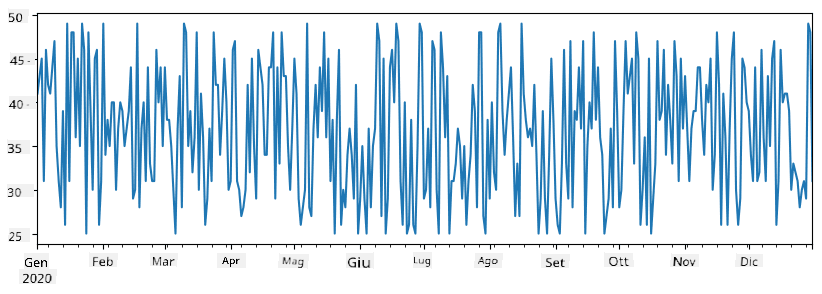
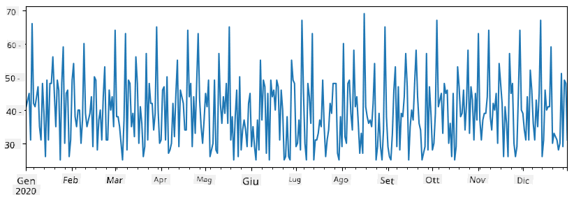
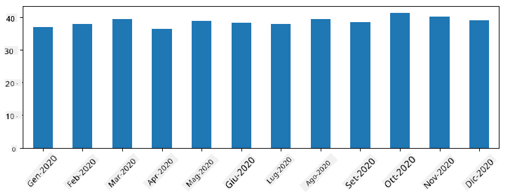
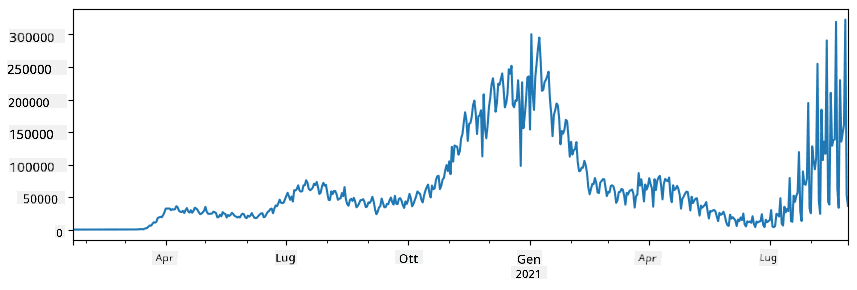
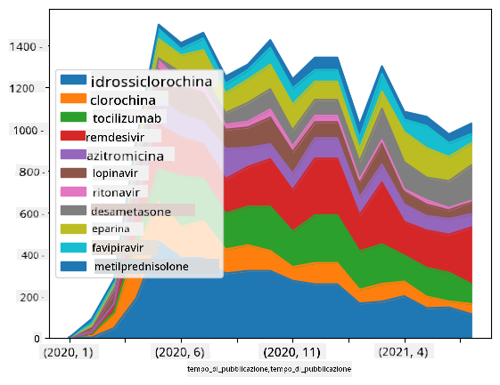

<!--
CO_OP_TRANSLATOR_METADATA:
{
  "original_hash": "57f7db1f4c3ae3361c1d1fbafcdd690c",
  "translation_date": "2025-09-04T17:54:52+00:00",
  "source_file": "2-Working-With-Data/07-python/README.md",
  "language_code": "it"
}
-->
# Lavorare con i dati: Python e la libreria Pandas

|  ](../../sketchnotes/07-WorkWithPython.png) |
| :-------------------------------------------------------------------------------------------------------: |
|                 Lavorare con Python - _Sketchnote di [@nitya](https://twitter.com/nitya)_                 |

[](https://youtu.be/dZjWOGbsN4Y)

Mentre i database offrono modi molto efficienti per archiviare i dati e interrogarli utilizzando linguaggi di query, il modo più flessibile per elaborare i dati è scrivere un proprio programma per manipolarli. In molti casi, eseguire una query su un database sarebbe un metodo più efficace. Tuttavia, in alcuni casi, quando è necessaria un'elaborazione dei dati più complessa, non è facilmente realizzabile utilizzando SQL.  
L'elaborazione dei dati può essere programmata in qualsiasi linguaggio di programmazione, ma ci sono alcuni linguaggi che sono più adatti per lavorare con i dati. Gli scienziati dei dati preferiscono tipicamente uno dei seguenti linguaggi:

* **[Python](https://www.python.org/)**, un linguaggio di programmazione generico, spesso considerato una delle migliori opzioni per i principianti grazie alla sua semplicità. Python ha molte librerie aggiuntive che possono aiutarti a risolvere numerosi problemi pratici, come estrarre dati da un archivio ZIP o convertire un'immagine in scala di grigi. Oltre alla scienza dei dati, Python è spesso utilizzato anche per lo sviluppo web.  
* **[R](https://www.r-project.org/)** è uno strumento tradizionale sviluppato con l'elaborazione statistica dei dati in mente. Contiene anche un vasto repository di librerie (CRAN), rendendolo una buona scelta per l'elaborazione dei dati. Tuttavia, R non è un linguaggio di programmazione generico ed è raramente utilizzato al di fuori del dominio della scienza dei dati.  
* **[Julia](https://julialang.org/)** è un altro linguaggio sviluppato specificamente per la scienza dei dati. È progettato per offrire prestazioni migliori rispetto a Python, rendendolo uno strumento eccellente per esperimenti scientifici.

In questa lezione, ci concentreremo sull'utilizzo di Python per una semplice elaborazione dei dati. Presumeremo una conoscenza di base del linguaggio. Se desideri un'introduzione più approfondita a Python, puoi consultare una delle seguenti risorse:

* [Impara Python in modo divertente con Turtle Graphics e Frattali](https://github.com/shwars/pycourse) - Corso introduttivo rapido su GitHub per la programmazione in Python  
* [Fai i tuoi primi passi con Python](https://docs.microsoft.com/en-us/learn/paths/python-first-steps/?WT.mc_id=academic-77958-bethanycheum) Percorso di apprendimento su [Microsoft Learn](http://learn.microsoft.com/?WT.mc_id=academic-77958-bethanycheum)

I dati possono presentarsi in molte forme. In questa lezione, considereremo tre forme di dati: **dati tabulari**, **testo** e **immagini**.

Ci concentreremo su alcuni esempi di elaborazione dei dati, invece di fornire una panoramica completa di tutte le librerie correlate. Questo ti permetterà di comprendere le possibilità principali e di sapere dove trovare soluzioni ai tuoi problemi quando ne avrai bisogno.

> **Consiglio più utile**. Quando hai bisogno di eseguire un'operazione sui dati che non sai come fare, prova a cercarla su internet. [Stackoverflow](https://stackoverflow.com/) contiene spesso molti esempi di codice utili in Python per numerosi compiti tipici.

## [Quiz pre-lezione](https://purple-hill-04aebfb03.1.azurestaticapps.net/quiz/12)

## Dati tabulari e DataFrame

Hai già incontrato i dati tabulari quando abbiamo parlato di database relazionali. Quando hai molti dati contenuti in diverse tabelle collegate, ha sicuramente senso utilizzare SQL per lavorarci. Tuttavia, ci sono molti casi in cui abbiamo una tabella di dati e dobbiamo ottenere una certa **comprensione** o **intuizione** su questi dati, come la distribuzione, la correlazione tra valori, ecc. Nella scienza dei dati, ci sono molti casi in cui dobbiamo eseguire alcune trasformazioni sui dati originali, seguite da una visualizzazione. Entrambi questi passaggi possono essere facilmente eseguiti utilizzando Python.

Ci sono due librerie molto utili in Python che possono aiutarti a gestire i dati tabulari:
* **[Pandas](https://pandas.pydata.org/)** ti consente di manipolare i cosiddetti **DataFrame**, che sono analoghi alle tabelle relazionali. Puoi avere colonne con nomi e eseguire diverse operazioni su righe, colonne e DataFrame in generale.  
* **[Numpy](https://numpy.org/)** è una libreria per lavorare con **tensori**, ovvero **array** multidimensionali. Gli array hanno valori dello stesso tipo sottostante e sono più semplici dei DataFrame, ma offrono più operazioni matematiche e creano meno sovraccarico.

Ci sono anche un paio di altre librerie che dovresti conoscere:
* **[Matplotlib](https://matplotlib.org/)** è una libreria utilizzata per la visualizzazione dei dati e la creazione di grafici  
* **[SciPy](https://www.scipy.org/)** è una libreria con alcune funzioni scientifiche aggiuntive. Abbiamo già incontrato questa libreria parlando di probabilità e statistica  

Ecco un pezzo di codice che utilizzeresti tipicamente per importare queste librerie all'inizio del tuo programma Python:  
```python
import numpy as np
import pandas as pd
import matplotlib.pyplot as plt
from scipy import ... # you need to specify exact sub-packages that you need
```

Pandas si basa su alcuni concetti fondamentali.

### Serie

**Serie** è una sequenza di valori, simile a una lista o un array numpy. La differenza principale è che le serie hanno anche un **indice**, e quando operiamo sulle serie (ad esempio, sommandole), l'indice viene preso in considerazione. L'indice può essere semplice come il numero di riga intero (è l'indice utilizzato per impostazione predefinita quando si crea una serie da una lista o un array), oppure può avere una struttura complessa, come un intervallo di date.

> **Nota**: Nel notebook allegato [`notebook.ipynb`](notebook.ipynb) c'è del codice introduttivo su Pandas. Qui delineiamo solo alcuni esempi, ma sei sicuramente invitato a consultare il notebook completo.

Considera un esempio: vogliamo analizzare le vendite del nostro punto vendita di gelati. Generiamo una serie di numeri di vendita (numero di articoli venduti ogni giorno) per un certo periodo di tempo:

```python
start_date = "Jan 1, 2020"
end_date = "Mar 31, 2020"
idx = pd.date_range(start_date,end_date)
print(f"Length of index is {len(idx)}")
items_sold = pd.Series(np.random.randint(25,50,size=len(idx)),index=idx)
items_sold.plot()
```  


Ora supponiamo che ogni settimana organizziamo una festa per gli amici e prendiamo 10 confezioni di gelato extra per la festa. Possiamo creare un'altra serie, indicizzata per settimana, per dimostrarlo:  
```python
additional_items = pd.Series(10,index=pd.date_range(start_date,end_date,freq="W"))
```  
Quando sommiamo due serie, otteniamo il numero totale:  
```python
total_items = items_sold.add(additional_items,fill_value=0)
total_items.plot()
```  


> **Nota** che non stiamo utilizzando la sintassi semplice `total_items+additional_items`. Se lo facessimo, otterremmo molti valori `NaN` (*Not a Number*) nella serie risultante. Questo perché ci sono valori mancanti per alcuni punti dell'indice nella serie `additional_items`, e sommare `NaN` a qualsiasi cosa risulta in `NaN`. Pertanto, dobbiamo specificare il parametro `fill_value` durante l'addizione.

Con le serie temporali, possiamo anche **ricampionare** la serie con intervalli di tempo diversi. Ad esempio, supponiamo di voler calcolare il volume medio di vendite mensile. Possiamo utilizzare il seguente codice:  
```python
monthly = total_items.resample("1M").mean()
ax = monthly.plot(kind='bar')
```  


### DataFrame

Un DataFrame è essenzialmente una raccolta di serie con lo stesso indice. Possiamo combinare diverse serie insieme in un DataFrame:  
```python
a = pd.Series(range(1,10))
b = pd.Series(["I","like","to","play","games","and","will","not","change"],index=range(0,9))
df = pd.DataFrame([a,b])
```  
Questo creerà una tabella orizzontale come questa:  
|     | 0   | 1    | 2   | 3   | 4      | 5   | 6      | 7    | 8    |
| --- | --- | ---- | --- | --- | ------ | --- | ------ | ---- | ---- |
| 0   | 1   | 2    | 3   | 4   | 5      | 6   | 7      | 8    | 9    |
| 1   | I   | like | to  | use | Python | and | Pandas | very | much |

Possiamo anche utilizzare le serie come colonne e specificare i nomi delle colonne utilizzando un dizionario:  
```python
df = pd.DataFrame({ 'A' : a, 'B' : b })
```  
Questo ci darà una tabella come questa:

|     | A   | B      |
| --- | --- | ------ |
| 0   | 1   | I      |
| 1   | 2   | like   |
| 2   | 3   | to     |
| 3   | 4   | use    |
| 4   | 5   | Python |
| 5   | 6   | and    |
| 6   | 7   | Pandas |
| 7   | 8   | very   |
| 8   | 9   | much   |

**Nota** che possiamo ottenere questo layout della tabella anche trasponendo la tabella precedente, ad esempio scrivendo  
```python
df = pd.DataFrame([a,b]).T..rename(columns={ 0 : 'A', 1 : 'B' })
```  
Qui `.T` indica l'operazione di trasposizione del DataFrame, ovvero il cambio di righe e colonne, e l'operazione `rename` ci consente di rinominare le colonne per corrispondere all'esempio precedente.

Ecco alcune delle operazioni più importanti che possiamo eseguire sui DataFrame:

**Selezione delle colonne**. Possiamo selezionare singole colonne scrivendo `df['A']` - questa operazione restituisce una Serie. Possiamo anche selezionare un sottoinsieme di colonne in un altro DataFrame scrivendo `df[['B','A']]` - questo restituisce un altro DataFrame.

**Filtrare** solo alcune righe in base a criteri. Ad esempio, per lasciare solo le righe con la colonna `A` maggiore di 5, possiamo scrivere `df[df['A']>5]`.

> **Nota**: Il modo in cui funziona il filtraggio è il seguente. L'espressione `df['A']<5` restituisce una serie booleana, che indica se l'espressione è `True` o `False` per ciascun elemento della serie originale `df['A']`. Quando la serie booleana viene utilizzata come indice, restituisce un sottoinsieme di righe nel DataFrame. Pertanto, non è possibile utilizzare un'espressione booleana Python arbitraria, ad esempio scrivere `df[df['A']>5 and df['A']<7]` sarebbe errato. Invece, dovresti utilizzare l'operazione speciale `&` sulle serie booleane, scrivendo `df[(df['A']>5) & (df['A']<7)]` (*le parentesi sono importanti qui*).

**Creare nuove colonne calcolabili**. Possiamo facilmente creare nuove colonne calcolabili per il nostro DataFrame utilizzando espressioni intuitive come questa:  
```python
df['DivA'] = df['A']-df['A'].mean() 
```  
Questo esempio calcola la divergenza di A dal suo valore medio. Quello che accade realmente qui è che stiamo calcolando una serie e poi assegnando questa serie al lato sinistro, creando un'altra colonna. Pertanto, non possiamo utilizzare operazioni non compatibili con le serie, ad esempio, il codice seguente è errato:  
```python
# Wrong code -> df['ADescr'] = "Low" if df['A'] < 5 else "Hi"
df['LenB'] = len(df['B']) # <- Wrong result
```  
L'ultimo esempio, pur essendo sintatticamente corretto, ci dà un risultato errato, perché assegna la lunghezza della serie `B` a tutti i valori nella colonna, e non la lunghezza degli elementi individuali come intendevamo.

Se dobbiamo calcolare espressioni complesse come questa, possiamo utilizzare la funzione `apply`. L'ultimo esempio può essere scritto come segue:  
```python
df['LenB'] = df['B'].apply(lambda x : len(x))
# or 
df['LenB'] = df['B'].apply(len)
```

Dopo le operazioni sopra, otterremo il seguente DataFrame:

|     | A   | B      | DivA | LenB |
| --- | --- | ------ | ---- | ---- |
| 0   | 1   | I      | -4.0 | 1    |
| 1   | 2   | like   | -3.0 | 4    |
| 2   | 3   | to     | -2.0 | 2    |
| 3   | 4   | use    | -1.0 | 3    |
| 4   | 5   | Python | 0.0  | 6    |
| 5   | 6   | and    | 1.0  | 3    |
| 6   | 7   | Pandas | 2.0  | 6    |
| 7   | 8   | very   | 3.0  | 4    |
| 8   | 9   | much   | 4.0  | 4    |

**Selezionare righe in base ai numeri** può essere fatto utilizzando il costrutto `iloc`. Ad esempio, per selezionare le prime 5 righe dal DataFrame:  
```python
df.iloc[:5]
```

**Raggruppamento** è spesso utilizzato per ottenere un risultato simile alle *tabelle pivot* in Excel. Supponiamo di voler calcolare il valore medio della colonna `A` per ciascun numero dato di `LenB`. Possiamo raggruppare il nostro DataFrame per `LenB` e chiamare `mean`:  
```python
df.groupby(by='LenB').mean()
```  
Se dobbiamo calcolare la media e il numero di elementi nel gruppo, possiamo utilizzare la funzione `aggregate` più complessa:  
```python
df.groupby(by='LenB') \
 .aggregate({ 'DivA' : len, 'A' : lambda x: x.mean() }) \
 .rename(columns={ 'DivA' : 'Count', 'A' : 'Mean'})
```  
Questo ci dà la seguente tabella:

| LenB | Count | Mean     |
| ---- | ----- | -------- |
| 1    | 1     | 1.000000 |
| 2    | 1     | 3.000000 |
| 3    | 2     | 5.000000 |
| 4    | 3     | 6.333333 |
| 6    | 2     | 6.000000 |

### Ottenere dati
Abbiamo visto quanto sia facile costruire Series e DataFrames partendo da oggetti Python. Tuttavia, i dati solitamente si presentano sotto forma di file di testo o di tabella Excel. Fortunatamente, Pandas ci offre un modo semplice per caricare i dati dal disco. Ad esempio, leggere un file CSV è semplice come questo:
```python
df = pd.read_csv('file.csv')
```
Vedremo altri esempi di caricamento dei dati, inclusa la possibilità di recuperarli da siti web esterni, nella sezione "Sfida".

### Stampa e Visualizzazione

Un Data Scientist spesso deve esplorare i dati, quindi è importante essere in grado di visualizzarli. Quando un DataFrame è grande, molte volte vogliamo solo assicurarci di fare tutto correttamente stampando le prime righe. Questo può essere fatto chiamando `df.head()`. Se lo esegui da Jupyter Notebook, stamperà il DataFrame in una forma tabellare ben organizzata.

Abbiamo anche visto l'uso della funzione `plot` per visualizzare alcune colonne. Sebbene `plot` sia molto utile per molti compiti e supporti diversi tipi di grafici tramite il parametro `kind=`, puoi sempre utilizzare la libreria `matplotlib` per creare qualcosa di più complesso. Tratteremo la visualizzazione dei dati in dettaglio in lezioni separate del corso.

Questa panoramica copre i concetti più importanti di Pandas, tuttavia, la libreria è molto ricca e non ci sono limiti a ciò che puoi fare con essa! Applichiamo ora queste conoscenze per risolvere un problema specifico.

## 🚀 Sfida 1: Analizzare la Diffusione del COVID

Il primo problema su cui ci concentreremo è la modellazione della diffusione epidemica del COVID-19. Per farlo, utilizzeremo i dati sul numero di individui infetti in diversi paesi, forniti dal [Center for Systems Science and Engineering](https://systems.jhu.edu/) (CSSE) presso la [Johns Hopkins University](https://jhu.edu/). Il dataset è disponibile in [questo repository GitHub](https://github.com/CSSEGISandData/COVID-19).

Poiché vogliamo dimostrare come gestire i dati, ti invitiamo ad aprire [`notebook-covidspread.ipynb`](notebook-covidspread.ipynb) e leggerlo dall'inizio alla fine. Puoi anche eseguire le celle e affrontare alcune sfide che abbiamo lasciato per te alla fine.



> Se non sai come eseguire il codice in Jupyter Notebook, dai un'occhiata a [questo articolo](https://soshnikov.com/education/how-to-execute-notebooks-from-github/).

## Lavorare con Dati Non Strutturati

Sebbene i dati spesso si presentino in forma tabellare, in alcuni casi dobbiamo gestire dati meno strutturati, ad esempio testo o immagini. In questo caso, per applicare le tecniche di elaborazione dei dati che abbiamo visto sopra, dobbiamo in qualche modo **estrarre** dati strutturati. Ecco alcuni esempi:

* Estrarre parole chiave da un testo e vedere con quale frequenza appaiono
* Utilizzare reti neurali per estrarre informazioni sugli oggetti presenti in un'immagine
* Ottenere informazioni sulle emozioni delle persone da un feed video della telecamera

## 🚀 Sfida 2: Analizzare gli Articoli sul COVID

In questa sfida, continueremo con il tema della pandemia di COVID, concentrandoci sull'elaborazione degli articoli scientifici sull'argomento. Esiste il [Dataset CORD-19](https://www.kaggle.com/allen-institute-for-ai/CORD-19-research-challenge) con più di 7000 (al momento della scrittura) articoli sul COVID, disponibile con metadati e abstract (e per circa metà di essi è fornito anche il testo completo).

Un esempio completo di analisi di questo dataset utilizzando il servizio cognitivo [Text Analytics for Health](https://docs.microsoft.com/azure/cognitive-services/text-analytics/how-tos/text-analytics-for-health/?WT.mc_id=academic-77958-bethanycheum) è descritto [in questo post sul blog](https://soshnikov.com/science/analyzing-medical-papers-with-azure-and-text-analytics-for-health/). Discuteremo una versione semplificata di questa analisi.

> **NOTE**: Non forniamo una copia del dataset come parte di questo repository. Potresti prima dover scaricare il file [`metadata.csv`](https://www.kaggle.com/allen-institute-for-ai/CORD-19-research-challenge?select=metadata.csv) da [questo dataset su Kaggle](https://www.kaggle.com/allen-institute-for-ai/CORD-19-research-challenge). Potrebbe essere necessaria la registrazione su Kaggle. Puoi anche scaricare il dataset senza registrazione [da qui](https://ai2-semanticscholar-cord-19.s3-us-west-2.amazonaws.com/historical_releases.html), ma includerà tutti i testi completi oltre al file dei metadati.

Apri [`notebook-papers.ipynb`](notebook-papers.ipynb) e leggilo dall'inizio alla fine. Puoi anche eseguire le celle e affrontare alcune sfide che abbiamo lasciato per te alla fine.



## Elaborazione di Dati Immagine

Recentemente, sono stati sviluppati modelli di intelligenza artificiale molto potenti che ci permettono di comprendere le immagini. Ci sono molti compiti che possono essere risolti utilizzando reti neurali pre-addestrate o servizi cloud. Alcuni esempi includono:

* **Classificazione delle Immagini**, che può aiutarti a categorizzare un'immagine in una delle classi predefinite. Puoi facilmente addestrare i tuoi classificatori di immagini utilizzando servizi come [Custom Vision](https://azure.microsoft.com/services/cognitive-services/custom-vision-service/?WT.mc_id=academic-77958-bethanycheum)
* **Rilevamento degli Oggetti** per individuare diversi oggetti nell'immagine. Servizi come [computer vision](https://azure.microsoft.com/services/cognitive-services/computer-vision/?WT.mc_id=academic-77958-bethanycheum) possono rilevare un numero di oggetti comuni, e puoi addestrare un modello [Custom Vision](https://azure.microsoft.com/services/cognitive-services/custom-vision-service/?WT.mc_id=academic-77958-bethanycheum) per rilevare alcuni oggetti specifici di interesse.
* **Rilevamento del Volto**, inclusa l'età, il genere e il rilevamento delle emozioni. Questo può essere fatto tramite [Face API](https://azure.microsoft.com/services/cognitive-services/face/?WT.mc_id=academic-77958-bethanycheum).

Tutti questi servizi cloud possono essere chiamati utilizzando [Python SDKs](https://docs.microsoft.com/samples/azure-samples/cognitive-services-python-sdk-samples/cognitive-services-python-sdk-samples/?WT.mc_id=academic-77958-bethanycheum), e quindi possono essere facilmente integrati nel tuo flusso di lavoro di esplorazione dei dati.

Ecco alcuni esempi di esplorazione dei dati provenienti da fonti di dati immagine:
* Nel post sul blog [Come Imparare Data Science senza Codice](https://soshnikov.com/azure/how-to-learn-data-science-without-coding/) esploriamo le foto di Instagram, cercando di capire cosa spinge le persone a mettere più "mi piace" a una foto. Prima estraiamo quante più informazioni possibili dalle immagini utilizzando [computer vision](https://azure.microsoft.com/services/cognitive-services/computer-vision/?WT.mc_id=academic-77958-bethanycheum), e poi utilizziamo [Azure Machine Learning AutoML](https://docs.microsoft.com/azure/machine-learning/concept-automated-ml/?WT.mc_id=academic-77958-bethanycheum) per costruire un modello interpretabile.
* Nel [Workshop Studi Facciali](https://github.com/CloudAdvocacy/FaceStudies) utilizziamo [Face API](https://azure.microsoft.com/services/cognitive-services/face/?WT.mc_id=academic-77958-bethanycheum) per estrarre emozioni dalle persone presenti nelle fotografie di eventi, al fine di cercare di capire cosa rende felici le persone.

## Conclusione

Che tu abbia già dati strutturati o non strutturati, utilizzando Python puoi eseguire tutti i passaggi relativi all'elaborazione e alla comprensione dei dati. È probabilmente il modo più flessibile per elaborare i dati, ed è per questo che la maggior parte dei data scientist utilizza Python come strumento principale. Imparare Python in profondità è probabilmente una buona idea se sei serio riguardo al tuo percorso nella data science!

## [Quiz post-lezione](https://ff-quizzes.netlify.app/en/ds/)

## Revisione e Studio Autonomo

**Libri**
* [Wes McKinney. Python for Data Analysis: Data Wrangling with Pandas, NumPy, and IPython](https://www.amazon.com/gp/product/1491957662)

**Risorse Online**
* Tutorial ufficiale [10 minuti con Pandas](https://pandas.pydata.org/pandas-docs/stable/user_guide/10min.html)
* [Documentazione sulla Visualizzazione con Pandas](https://pandas.pydata.org/pandas-docs/stable/user_guide/visualization.html)

**Imparare Python**
* [Impara Python in modo divertente con Turtle Graphics e Frattali](https://github.com/shwars/pycourse)
* [Fai i tuoi primi passi con Python](https://docs.microsoft.com/learn/paths/python-first-steps/?WT.mc_id=academic-77958-bethanycheum) Percorso di apprendimento su [Microsoft Learn](http://learn.microsoft.com/?WT.mc_id=academic-77958-bethanycheum)

## Compito

[Effettua uno studio più dettagliato dei dati per le sfide sopra](assignment.md)

## Crediti

Questa lezione è stata scritta con ♥️ da [Dmitry Soshnikov](http://soshnikov.com)

---

**Disclaimer**:  
Questo documento è stato tradotto utilizzando il servizio di traduzione automatica [Co-op Translator](https://github.com/Azure/co-op-translator). Sebbene ci impegniamo per garantire l'accuratezza, si prega di notare che le traduzioni automatiche possono contenere errori o imprecisioni. Il documento originale nella sua lingua nativa dovrebbe essere considerato la fonte autorevole. Per informazioni critiche, si raccomanda una traduzione professionale effettuata da un traduttore umano. Non siamo responsabili per eventuali incomprensioni o interpretazioni errate derivanti dall'uso di questa traduzione.