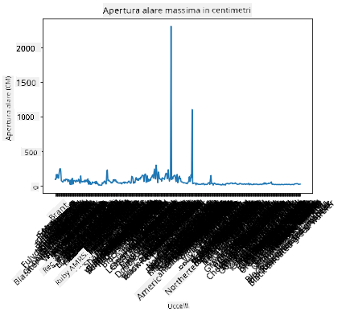
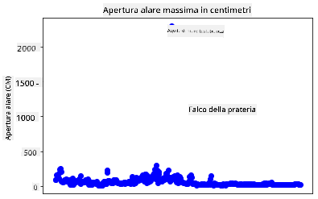
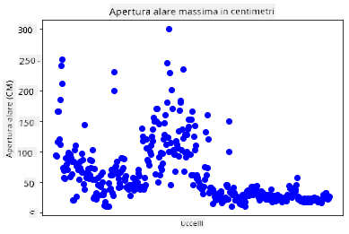
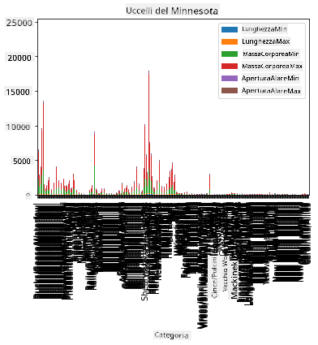
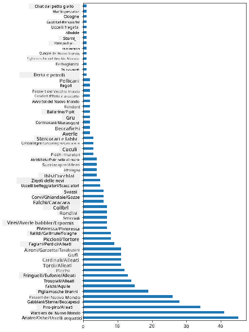
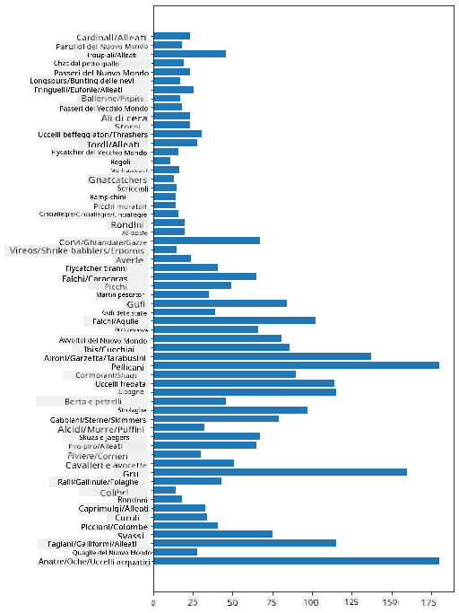
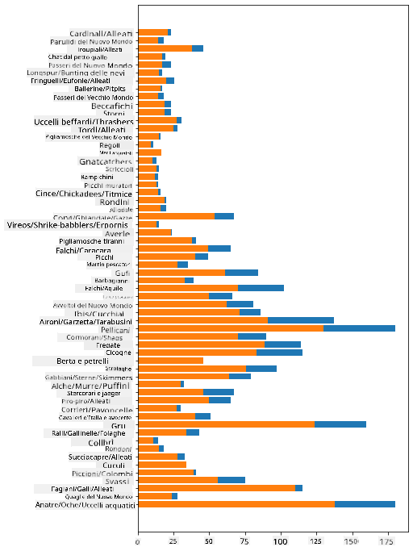

<!--
CO_OP_TRANSLATOR_METADATA:
{
  "original_hash": "69b32b6789a91f796ebc7a02f5575e03",
  "translation_date": "2025-09-04T18:00:07+00:00",
  "source_file": "3-Data-Visualization/09-visualization-quantities/README.md",
  "language_code": "it"
}
-->
# Visualizzare le quantità

| ](../../sketchnotes/09-Visualizing-Quantities.png)|
|:---:|
| Visualizzare le quantità - _Sketchnote di [@nitya](https://twitter.com/nitya)_ |

In questa lezione esplorerai come utilizzare una delle tante librerie Python disponibili per imparare a creare visualizzazioni interessanti basate sul concetto di quantità. Utilizzando un dataset pulito sugli uccelli del Minnesota, potrai scoprire molti fatti interessanti sulla fauna locale.  
## [Quiz pre-lezione](https://purple-hill-04aebfb03.1.azurestaticapps.net/quiz/16)

## Osservare l'apertura alare con Matplotlib

Una libreria eccellente per creare grafici e diagrammi, sia semplici che sofisticati, è [Matplotlib](https://matplotlib.org/stable/index.html). In termini generali, il processo di creazione di grafici utilizzando queste librerie include l'identificazione delle parti del tuo dataframe che vuoi analizzare, l'esecuzione di eventuali trasformazioni necessarie sui dati, l'assegnazione dei valori degli assi x e y, la scelta del tipo di grafico da mostrare e infine la visualizzazione del grafico. Matplotlib offre una vasta gamma di visualizzazioni, ma per questa lezione ci concentreremo su quelle più adatte per visualizzare quantità: grafici a linee, scatterplot e grafici a barre.

> ✅ Usa il grafico migliore per adattarlo alla struttura dei tuoi dati e alla storia che vuoi raccontare.  
> - Per analizzare le tendenze nel tempo: linee  
> - Per confrontare valori: barre, colonne, torta, scatterplot  
> - Per mostrare come le parti si relazionano al tutto: torta  
> - Per mostrare la distribuzione dei dati: scatterplot, barre  
> - Per mostrare tendenze: linee, colonne  
> - Per mostrare relazioni tra valori: linee, scatterplot, bolle  

Se hai un dataset e devi scoprire quanto di un determinato elemento è incluso, uno dei primi compiti sarà ispezionare i suoi valori.  

✅ Sono disponibili ottimi 'cheat sheet' per Matplotlib [qui](https://matplotlib.org/cheatsheets/cheatsheets.pdf).

## Creare un grafico a linee sui valori dell'apertura alare degli uccelli

Apri il file `notebook.ipynb` nella radice della cartella di questa lezione e aggiungi una cella.

> Nota: i dati sono archiviati nella radice di questo repository nella cartella `/data`.

```python
import pandas as pd
import matplotlib.pyplot as plt
birds = pd.read_csv('../../data/birds.csv')
birds.head()
```  
Questi dati sono un mix di testo e numeri:

|      | Nome                         | NomeScientifico        | Categoria             | Ordine       | Famiglia | Genere      | StatoConservazione  | MinLunghezza | MaxLunghezza | MinPesoCorpo | MaxPesoCorpo | MinAperturaAlare | MaxAperturaAlare |
| ---: | :--------------------------- | :--------------------- | :-------------------- | :----------- | :------- | :---------- | :----------------- | --------:    | --------:    | ----------:  | ----------:  | ----------:      | ----------:      |
|    0 | Anatra fischiante ventre nero | Dendrocygna autumnalis | Anatre/Oche/Uccelli acquatici | Anseriformes | Anatidae | Dendrocygna | LC                 |        47    |        56    |         652  |        1020  |          76      |          94      |
|    1 | Anatra fischiante fulva       | Dendrocygna bicolor    | Anatre/Oche/Uccelli acquatici | Anseriformes | Anatidae | Dendrocygna | LC                 |        45    |        53    |         712  |        1050  |          85      |          93      |
|    2 | Oca delle nevi                | Anser caerulescens     | Anatre/Oche/Uccelli acquatici | Anseriformes | Anatidae | Anser       | LC                 |        64    |        79    |        2050  |        4050  |         135      |         165      |
|    3 | Oca di Ross                   | Anser rossii           | Anatre/Oche/Uccelli acquatici | Anseriformes | Anatidae | Anser       | LC                 |      57.3    |        64    |        1066  |        1567  |         113      |         116      |
|    4 | Oca fronte bianca maggiore    | Anser albifrons        | Anatre/Oche/Uccelli acquatici | Anseriformes | Anatidae | Anser       | LC                 |        64    |        81    |        1930  |        3310  |         130      |         165      |

Iniziamo a tracciare alcuni dei dati numerici utilizzando un semplice grafico a linee. Supponiamo di voler visualizzare l'apertura alare massima di questi interessanti uccelli.

```python
wingspan = birds['MaxWingspan'] 
wingspan.plot()
```  


Cosa noti immediatamente? Sembra esserci almeno un valore anomalo: che apertura alare! Un'apertura alare di 2300 centimetri equivale a 23 metri - ci sono Pterodattili che volano in Minnesota? Indaghiamo.

Sebbene tu possa fare un rapido ordinamento in Excel per trovare questi valori anomali, che probabilmente sono errori di battitura, continua il processo di visualizzazione lavorando direttamente dal grafico.

Aggiungi etichette all'asse x per mostrare di che tipo di uccelli si tratta:

```
plt.title('Max Wingspan in Centimeters')
plt.ylabel('Wingspan (CM)')
plt.xlabel('Birds')
plt.xticks(rotation=45)
x = birds['Name'] 
y = birds['MaxWingspan']

plt.plot(x, y)

plt.show()
```  


Anche con la rotazione delle etichette impostata a 45 gradi, ce ne sono troppe per essere leggibili. Proviamo una strategia diversa: etichettare solo i valori anomali e impostare le etichette all'interno del grafico. Puoi utilizzare un grafico a dispersione per fare più spazio alle etichette:

```python
plt.title('Max Wingspan in Centimeters')
plt.ylabel('Wingspan (CM)')
plt.tick_params(axis='both',which='both',labelbottom=False,bottom=False)

for i in range(len(birds)):
    x = birds['Name'][i]
    y = birds['MaxWingspan'][i]
    plt.plot(x, y, 'bo')
    if birds['MaxWingspan'][i] > 500:
        plt.text(x, y * (1 - 0.05), birds['Name'][i], fontsize=12)
    
plt.show()
```  
Cosa sta succedendo qui? Hai usato `tick_params` per nascondere le etichette inferiori e poi hai creato un ciclo sul dataset degli uccelli. Tracciando il grafico con piccoli punti blu rotondi usando `bo`, hai controllato se un uccello ha un'apertura alare massima superiore a 500 e, in tal caso, hai visualizzato la sua etichetta accanto al punto. Hai spostato leggermente le etichette sull'asse y (`y * (1 - 0.05)`) e hai usato il nome dell'uccello come etichetta.

Cosa hai scoperto?

  
## Filtrare i dati

Sia l'Aquila calva che il Falco della prateria, pur essendo probabilmente uccelli molto grandi, sembrano essere etichettati erroneamente, con uno `0` in più aggiunto alla loro apertura alare massima. È improbabile che tu incontri un'Aquila calva con un'apertura alare di 25 metri, ma se succede, faccelo sapere! Creiamo un nuovo dataframe senza questi due valori anomali:

```python
plt.title('Max Wingspan in Centimeters')
plt.ylabel('Wingspan (CM)')
plt.xlabel('Birds')
plt.tick_params(axis='both',which='both',labelbottom=False,bottom=False)
for i in range(len(birds)):
    x = birds['Name'][i]
    y = birds['MaxWingspan'][i]
    if birds['Name'][i] not in ['Bald eagle', 'Prairie falcon']:
        plt.plot(x, y, 'bo')
plt.show()
```  

Filtrando i valori anomali, i tuoi dati ora sono più coesi e comprensibili.



Ora che abbiamo un dataset più pulito almeno in termini di apertura alare, scopriamo di più su questi uccelli.

Sebbene i grafici a linee e a dispersione possano mostrare informazioni sui valori dei dati e le loro distribuzioni, vogliamo pensare ai valori intrinseci di questo dataset. Potresti creare visualizzazioni per rispondere alle seguenti domande sulla quantità:

> Quante categorie di uccelli ci sono e quali sono i loro numeri?  
> Quanti uccelli sono estinti, in pericolo, rari o comuni?  
> Quanti ci sono dei vari generi e ordini nella terminologia di Linneo?  
## Esplorare i grafici a barre

I grafici a barre sono pratici quando devi mostrare raggruppamenti di dati. Esploriamo le categorie di uccelli presenti in questo dataset per vedere quale è la più comune per numero.

Nel file notebook, crea un semplice grafico a barre.

✅ Nota, puoi filtrare i due uccelli anomali identificati nella sezione precedente, correggere l'errore di battitura nella loro apertura alare o lasciarli per questi esercizi che non dipendono dai valori di apertura alare.

Se vuoi creare un grafico a barre, puoi selezionare i dati su cui vuoi concentrarti. I grafici a barre possono essere creati da dati grezzi:

```python
birds.plot(x='Category',
        kind='bar',
        stacked=True,
        title='Birds of Minnesota')

```  


Questo grafico a barre, tuttavia, è illeggibile perché ci sono troppi dati non raggruppati. Devi selezionare solo i dati che vuoi rappresentare, quindi analizziamo la lunghezza degli uccelli in base alla loro categoria.

Filtra i tuoi dati per includere solo la categoria degli uccelli.

✅ Nota che usi Pandas per gestire i dati e poi lasci che Matplotlib si occupi della creazione del grafico.

Poiché ci sono molte categorie, puoi visualizzare questo grafico verticalmente e regolare la sua altezza per includere tutti i dati:

```python
category_count = birds.value_counts(birds['Category'].values, sort=True)
plt.rcParams['figure.figsize'] = [6, 12]
category_count.plot.barh()
```  


Questo grafico a barre mostra una buona panoramica del numero di uccelli in ogni categoria. In un colpo d'occhio, vedi che il maggior numero di uccelli in questa regione appartiene alla categoria Anatre/Oche/Uccelli acquatici. Il Minnesota è la 'terra dei 10.000 laghi', quindi non è sorprendente!

✅ Prova altri conteggi su questo dataset. C'è qualcosa che ti sorprende?

## Confrontare i dati

Puoi provare diversi confronti di dati raggruppati creando nuovi assi. Prova un confronto della MaxLunghezza di un uccello, basato sulla sua categoria:

```python
maxlength = birds['MaxLength']
plt.barh(y=birds['Category'], width=maxlength)
plt.rcParams['figure.figsize'] = [6, 12]
plt.show()
```  


Nulla di sorprendente qui: i colibrì hanno la lunghezza massima più bassa rispetto ai pellicani o alle oche. È positivo quando i dati hanno senso logico!

Puoi creare visualizzazioni più interessanti di grafici a barre sovrapponendo i dati. Sovrapponiamo la Lunghezza Minima e Massima su una determinata categoria di uccelli:

```python
minLength = birds['MinLength']
maxLength = birds['MaxLength']
category = birds['Category']

plt.barh(category, maxLength)
plt.barh(category, minLength)

plt.show()
```  
In questo grafico, puoi vedere l'intervallo per categoria di uccelli della Lunghezza Minima e Massima. Puoi affermare con sicurezza che, dati questi dati, più grande è l'uccello, maggiore è il suo intervallo di lunghezza. Affascinante!



## 🚀 Sfida

Questo dataset sugli uccelli offre una ricchezza di informazioni sui diversi tipi di uccelli all'interno di un particolare ecosistema. Cerca su internet e vedi se riesci a trovare altri dataset orientati agli uccelli. Pratica la creazione di grafici e diagrammi su questi uccelli per scoprire fatti che non conoscevi.

## [Quiz post-lezione](https://ff-quizzes.netlify.app/en/ds/)

## Revisione e studio autonomo

Questa prima lezione ti ha fornito alcune informazioni su come utilizzare Matplotlib per visualizzare quantità. Fai qualche ricerca su altri modi per lavorare con dataset per la visualizzazione. [Plotly](https://github.com/plotly/plotly.py) è uno che non tratteremo in queste lezioni, quindi dai un'occhiata a ciò che può offrire.  
## Compito

[Linee, dispersioni e barre](assignment.md)

---

**Disclaimer**:  
Questo documento è stato tradotto utilizzando il servizio di traduzione automatica [Co-op Translator](https://github.com/Azure/co-op-translator). Sebbene ci impegniamo per garantire l'accuratezza, si prega di notare che le traduzioni automatiche possono contenere errori o imprecisioni. Il documento originale nella sua lingua nativa dovrebbe essere considerato la fonte autorevole. Per informazioni critiche, si raccomanda una traduzione professionale effettuata da un traduttore umano. Non siamo responsabili per eventuali fraintendimenti o interpretazioni errate derivanti dall'uso di questa traduzione.