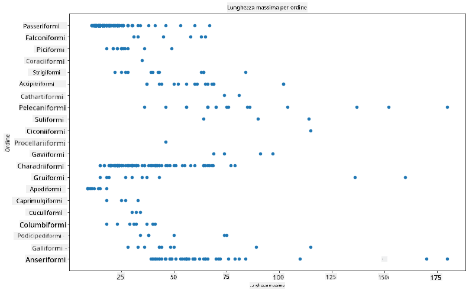
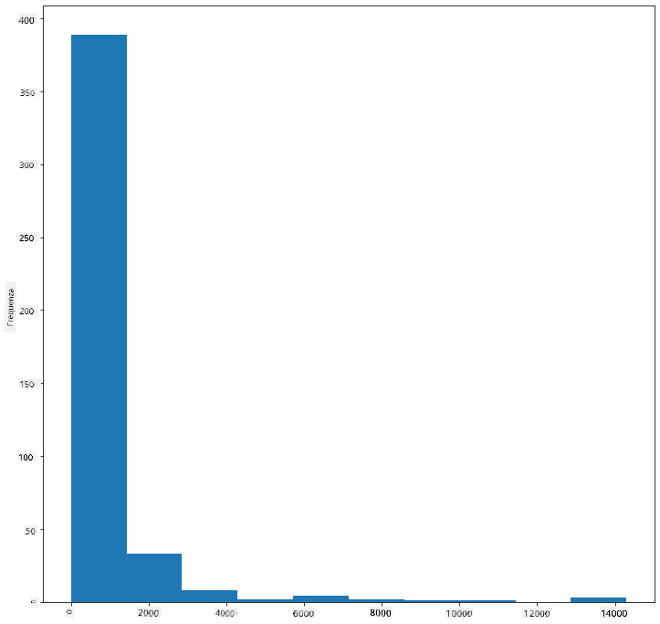
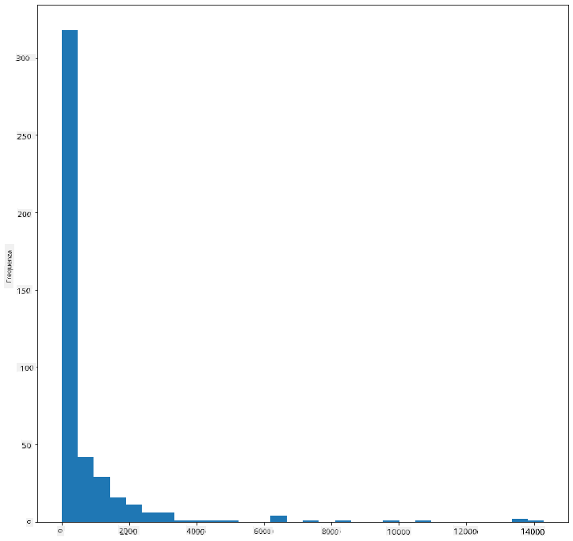
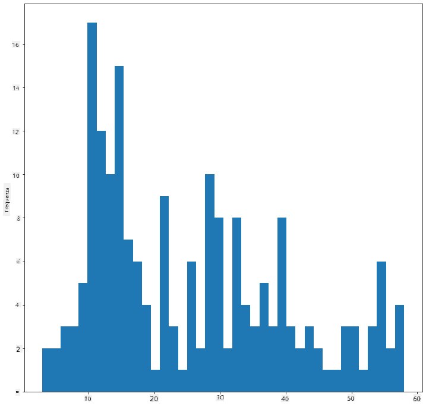
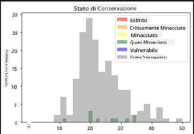
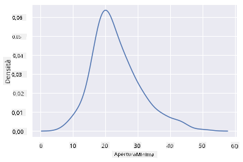
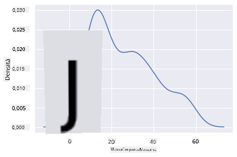
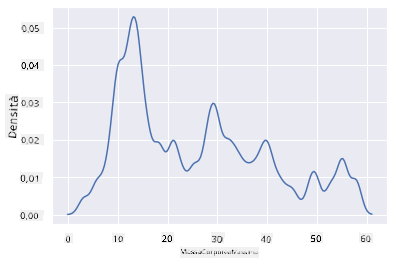
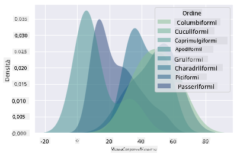
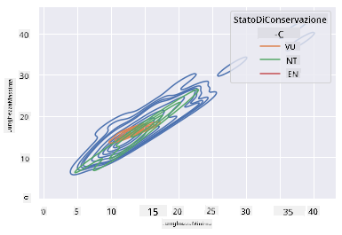

<!--
CO_OP_TRANSLATOR_METADATA:
{
  "original_hash": "02ce904bc1e2bfabb7dc05c25aae375c",
  "translation_date": "2025-09-04T18:01:43+00:00",
  "source_file": "3-Data-Visualization/10-visualization-distributions/README.md",
  "language_code": "it"
}
-->
# Visualizzare le Distribuzioni

| ](../../sketchnotes/10-Visualizing-Distributions.png)|
|:---:|
| Visualizzare le Distribuzioni - _Sketchnote di [@nitya](https://twitter.com/nitya)_ |

Nella lezione precedente, hai appreso alcuni fatti interessanti su un dataset riguardante gli uccelli del Minnesota. Hai individuato dati errati visualizzando i valori anomali e hai osservato le differenze tra le categorie di uccelli in base alla loro lunghezza massima.

## [Quiz pre-lezione](https://purple-hill-04aebfb03.1.azurestaticapps.net/quiz/18)
## Esplora il dataset degli uccelli

Un altro modo per analizzare i dati è osservare la loro distribuzione, ovvero come i dati sono organizzati lungo un asse. Ad esempio, potresti voler conoscere la distribuzione generale, per questo dataset, dell'apertura alare massima o della massa corporea massima degli uccelli del Minnesota.

Scopriamo alcuni fatti sulle distribuzioni dei dati in questo dataset. Nel file _notebook.ipynb_ nella cartella principale di questa lezione, importa Pandas, Matplotlib e i tuoi dati:

```python
import pandas as pd
import matplotlib.pyplot as plt
birds = pd.read_csv('../../data/birds.csv')
birds.head()
```

|      | Nome                         | NomeScientifico        | Categoria             | Ordine       | Famiglia | Genere      | StatoConservazione  | MinLunghezza | MaxLunghezza | MinMassaCorporea | MaxMassaCorporea | MinAperturaAlare | MaxAperturaAlare |
| ---: | :--------------------------- | :--------------------- | :-------------------- | :----------- | :------- | :---------- | :----------------- | ------------: | ------------: | ----------------: | ----------------: | ----------------: | ----------------: |
|    0 | Anatra fischiante ventre nero | Dendrocygna autumnalis | Anatre/Oche/Uccelli acquatici | Anseriformes | Anatidae | Dendrocygna | LC                 |        47 |        56 |         652 |        1020 |          76 |          94 |
|    1 | Anatra fischiante fulva       | Dendrocygna bicolor    | Anatre/Oche/Uccelli acquatici | Anseriformes | Anatidae | Dendrocygna | LC                 |        45 |        53 |         712 |        1050 |          85 |          93 |
|    2 | Oca delle nevi                | Anser caerulescens     | Anatre/Oche/Uccelli acquatici | Anseriformes | Anatidae | Anser       | LC                 |        64 |        79 |        2050 |        4050 |         135 |         165 |
|    3 | Oca di Ross                   | Anser rossii           | Anatre/Oche/Uccelli acquatici | Anseriformes | Anatidae | Anser       | LC                 |      57.3 |        64 |        1066 |        1567 |         113 |         116 |
|    4 | Oca fronte bianca maggiore    | Anser albifrons        | Anatre/Oche/Uccelli acquatici | Anseriformes | Anatidae | Anser       | LC                 |        64 |        81 |        1930 |        3310 |         130 |         165 |

In generale, puoi osservare rapidamente come i dati sono distribuiti utilizzando un grafico a dispersione, come abbiamo fatto nella lezione precedente:

```python
birds.plot(kind='scatter',x='MaxLength',y='Order',figsize=(12,8))

plt.title('Max Length per Order')
plt.ylabel('Order')
plt.xlabel('Max Length')

plt.show()
```


Questo offre una panoramica della distribuzione generale della lunghezza corporea per Ordine di uccelli, ma non è il modo ottimale per mostrare le vere distribuzioni. Questo compito è solitamente gestito creando un Istogramma.

## Lavorare con gli istogrammi

Matplotlib offre ottimi strumenti per visualizzare la distribuzione dei dati utilizzando gli Istogrammi. Questo tipo di grafico è simile a un grafico a barre, dove la distribuzione può essere vista attraverso l'aumento e la diminuzione delle barre. Per costruire un istogramma, hai bisogno di dati numerici. Per costruire un Istogramma, puoi tracciare un grafico definendo il tipo come 'hist' per Istogramma. Questo grafico mostra la distribuzione della MaxMassaCorporea per l'intero intervallo di dati numerici del dataset. Dividendo l'array di dati in piccoli intervalli, può mostrare la distribuzione dei valori dei dati:

```python
birds['MaxBodyMass'].plot(kind = 'hist', bins = 10, figsize = (12,12))
plt.show()
```


Come puoi vedere, la maggior parte dei 400+ uccelli in questo dataset rientra nell'intervallo sotto i 2000 per la loro Massa Corporea Massima. Ottieni maggiori informazioni sui dati modificando il parametro `bins` a un numero più alto, ad esempio 30:

```python
birds['MaxBodyMass'].plot(kind = 'hist', bins = 30, figsize = (12,12))
plt.show()
```


Questo grafico mostra la distribuzione in modo un po' più dettagliato. Un grafico meno sbilanciato a sinistra potrebbe essere creato assicurandoti di selezionare solo i dati entro un determinato intervallo:

Filtra i tuoi dati per ottenere solo quegli uccelli la cui massa corporea è inferiore a 60 e mostra 40 `bins`:

```python
filteredBirds = birds[(birds['MaxBodyMass'] > 1) & (birds['MaxBodyMass'] < 60)]      
filteredBirds['MaxBodyMass'].plot(kind = 'hist',bins = 40,figsize = (12,12))
plt.show()     
```


✅ Prova altri filtri e punti dati. Per vedere la distribuzione completa dei dati, rimuovi il filtro `['MaxBodyMass']` per mostrare distribuzioni etichettate.

L'istogramma offre anche alcune belle opzioni di colore e etichettatura da provare:

Crea un istogramma 2D per confrontare la relazione tra due distribuzioni. Confrontiamo `MaxBodyMass` vs. `MaxLength`. Matplotlib offre un modo integrato per mostrare la convergenza utilizzando colori più luminosi:

```python
x = filteredBirds['MaxBodyMass']
y = filteredBirds['MaxLength']

fig, ax = plt.subplots(tight_layout=True)
hist = ax.hist2d(x, y)
```
Sembra esserci una correlazione prevista tra questi due elementi lungo un asse previsto, con un punto particolarmente forte di convergenza:


Gli istogrammi funzionano bene di default per i dati numerici. E se avessi bisogno di vedere le distribuzioni in base ai dati testuali? 
## Esplora il dataset per distribuzioni utilizzando dati testuali 

Questo dataset include anche buone informazioni sulla categoria degli uccelli, il loro genere, specie e famiglia, così come il loro stato di conservazione. Esploriamo queste informazioni di conservazione. Qual è la distribuzione degli uccelli in base al loro stato di conservazione?

> ✅ Nel dataset, vengono utilizzati diversi acronimi per descrivere lo stato di conservazione. Questi acronimi provengono dalle [Categorie della Lista Rossa IUCN](https://www.iucnredlist.org/), un'organizzazione che cataloga lo stato delle specie.
> 
> - CR: Criticamente Minacciato
> - EN: Minacciato
> - EX: Estinto
> - LC: Minima Preoccupazione
> - NT: Quasi Minacciato
> - VU: Vulnerabile

Questi sono valori testuali, quindi sarà necessario effettuare una trasformazione per creare un istogramma. Utilizzando il dataframe filteredBirds, visualizza il suo stato di conservazione accanto alla sua Apertura Alare Minima. Cosa osservi?

```python
x1 = filteredBirds.loc[filteredBirds.ConservationStatus=='EX', 'MinWingspan']
x2 = filteredBirds.loc[filteredBirds.ConservationStatus=='CR', 'MinWingspan']
x3 = filteredBirds.loc[filteredBirds.ConservationStatus=='EN', 'MinWingspan']
x4 = filteredBirds.loc[filteredBirds.ConservationStatus=='NT', 'MinWingspan']
x5 = filteredBirds.loc[filteredBirds.ConservationStatus=='VU', 'MinWingspan']
x6 = filteredBirds.loc[filteredBirds.ConservationStatus=='LC', 'MinWingspan']

kwargs = dict(alpha=0.5, bins=20)

plt.hist(x1, **kwargs, color='red', label='Extinct')
plt.hist(x2, **kwargs, color='orange', label='Critically Endangered')
plt.hist(x3, **kwargs, color='yellow', label='Endangered')
plt.hist(x4, **kwargs, color='green', label='Near Threatened')
plt.hist(x5, **kwargs, color='blue', label='Vulnerable')
plt.hist(x6, **kwargs, color='gray', label='Least Concern')

plt.gca().set(title='Conservation Status', ylabel='Min Wingspan')
plt.legend();
```



Non sembra esserci una buona correlazione tra apertura alare minima e stato di conservazione. Testa altri elementi del dataset utilizzando questo metodo. Puoi provare diversi filtri. Trovi qualche correlazione?

## Grafici di densità

Potresti aver notato che gli istogrammi che abbiamo osservato finora sono 'a gradini' e non fluiscono in modo uniforme in un arco. Per mostrare un grafico di densità più fluido, puoi provare un grafico di densità.

Per lavorare con i grafici di densità, familiarizza con una nuova libreria di grafici, [Seaborn](https://seaborn.pydata.org/generated/seaborn.kdeplot.html). 

Caricando Seaborn, prova un grafico di densità di base:

```python
import seaborn as sns
import matplotlib.pyplot as plt
sns.kdeplot(filteredBirds['MinWingspan'])
plt.show()
```


Puoi vedere come il grafico rispecchia quello precedente per i dati di Apertura Alare Minima; è solo un po' più fluido. Secondo la documentazione di Seaborn, "Rispetto a un istogramma, il KDE può produrre un grafico meno disordinato e più interpretabile, specialmente quando si disegnano più distribuzioni. Ma ha il potenziale di introdurre distorsioni se la distribuzione sottostante è limitata o non uniforme. Come un istogramma, la qualità della rappresentazione dipende anche dalla selezione di buoni parametri di smoothing." [fonte](https://seaborn.pydata.org/generated/seaborn.kdeplot.html) In altre parole, i valori anomali, come sempre, faranno comportare male i tuoi grafici.

Se volessi rivisitare quella linea frastagliata di MaxBodyMass nel secondo grafico che hai costruito, potresti renderla molto più fluida ricreandola utilizzando questo metodo:

```python
sns.kdeplot(filteredBirds['MaxBodyMass'])
plt.show()
```


Se volessi una linea fluida, ma non troppo fluida, modifica il parametro `bw_adjust`: 

```python
sns.kdeplot(filteredBirds['MaxBodyMass'], bw_adjust=.2)
plt.show()
```


✅ Leggi i parametri disponibili per questo tipo di grafico e sperimenta!

Questo tipo di grafico offre visualizzazioni esplicative molto belle. Con poche righe di codice, ad esempio, puoi mostrare la densità della massa corporea massima per Ordine di uccelli:

```python
sns.kdeplot(
   data=filteredBirds, x="MaxBodyMass", hue="Order",
   fill=True, common_norm=False, palette="crest",
   alpha=.5, linewidth=0,
)
```



Puoi anche mappare la densità di diverse variabili in un unico grafico. Confronta la MaxLunghezza e la MinLunghezza di un uccello rispetto al suo stato di conservazione:

```python
sns.kdeplot(data=filteredBirds, x="MinLength", y="MaxLength", hue="ConservationStatus")
```



Forse vale la pena indagare se il cluster di uccelli 'Vulnerabili' in base alle loro lunghezze sia significativo o meno.

## 🚀 Sfida

Gli istogrammi sono un tipo di grafico più sofisticato rispetto ai grafici a dispersione, a barre o a linee. Cerca su internet buoni esempi dell'uso degli istogrammi. Come vengono utilizzati, cosa dimostrano e in quali campi o aree di indagine tendono ad essere utilizzati?

## [Quiz post-lezione](https://ff-quizzes.netlify.app/en/ds/)

## Revisione & Studio Autonomo

In questa lezione, hai utilizzato Matplotlib e hai iniziato a lavorare con Seaborn per mostrare grafici più sofisticati. Fai una ricerca su `kdeplot` in Seaborn, una "curva di densità di probabilità continua in una o più dimensioni". Leggi la [documentazione](https://seaborn.pydata.org/generated/seaborn.kdeplot.html) per capire come funziona.

## Compito

[Applica le tue competenze](assignment.md)

---

**Disclaimer**:  
Questo documento è stato tradotto utilizzando il servizio di traduzione automatica [Co-op Translator](https://github.com/Azure/co-op-translator). Sebbene ci impegniamo per garantire l'accuratezza, si prega di notare che le traduzioni automatiche possono contenere errori o imprecisioni. Il documento originale nella sua lingua nativa dovrebbe essere considerato la fonte autorevole. Per informazioni critiche, si raccomanda una traduzione professionale effettuata da un traduttore umano. Non siamo responsabili per eventuali fraintendimenti o interpretazioni errate derivanti dall'uso di questa traduzione.