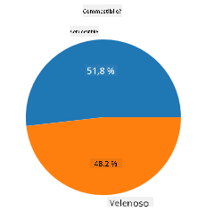
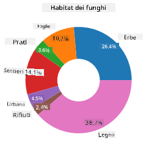
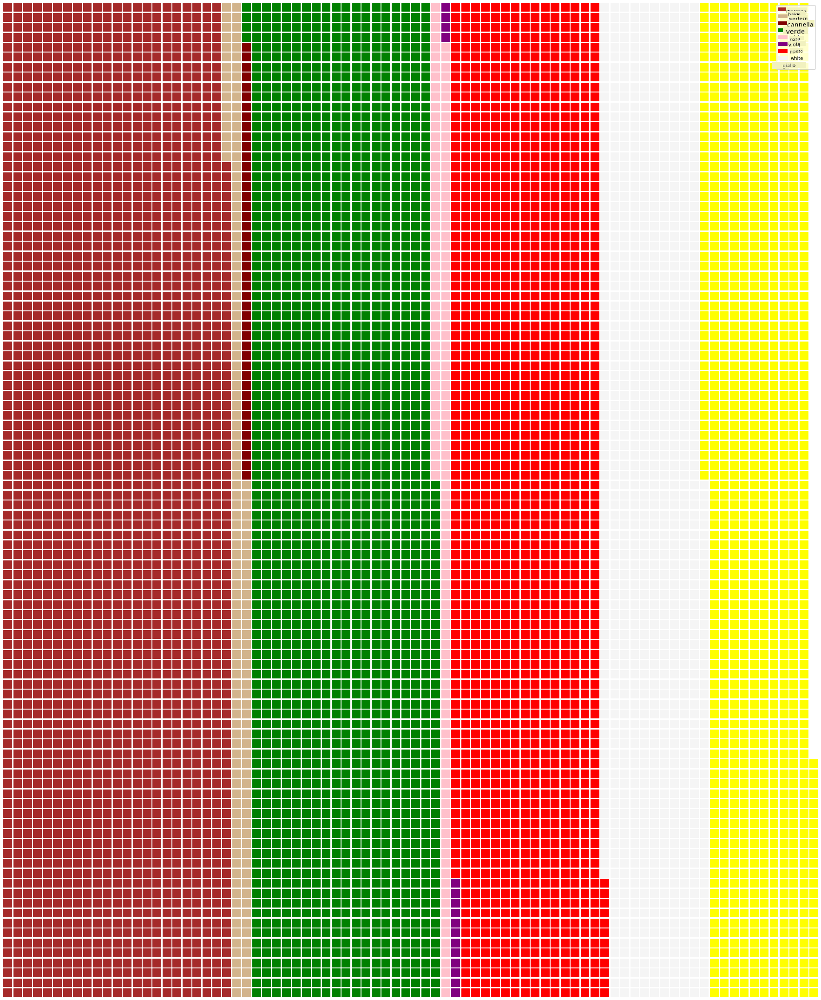

<!--
CO_OP_TRANSLATOR_METADATA:
{
  "original_hash": "cc490897ee2d276870472bcb31602d03",
  "translation_date": "2025-09-04T17:59:39+00:00",
  "source_file": "3-Data-Visualization/11-visualization-proportions/README.md",
  "language_code": "it"
}
-->
# Visualizzare le Proporzioni

| ](../../sketchnotes/11-Visualizing-Proportions.png)|
|:---:|
|Visualizzare le Proporzioni - _Sketchnote di [@nitya](https://twitter.com/nitya)_ |

In questa lezione utilizzerai un dataset incentrato sulla natura per visualizzare le proporzioni, come il numero di diversi tipi di funghi presenti in un dataset sui funghi. Esploriamo questi affascinanti funghi utilizzando un dataset proveniente da Audubon che elenca dettagli su 23 specie di funghi con lamelle delle famiglie Agaricus e Lepiota. Sperimenterai con visualizzazioni interessanti come:

- Grafici a torta 🥧
- Grafici a ciambella 🍩
- Grafici a waffle 🧇

> 💡 Un progetto molto interessante chiamato [Charticulator](https://charticulator.com) di Microsoft Research offre un'interfaccia drag and drop gratuita per le visualizzazioni di dati. In uno dei loro tutorial utilizzano anche questo dataset sui funghi! Puoi quindi esplorare i dati e imparare a usare la libreria contemporaneamente: [Tutorial Charticulator](https://charticulator.com/tutorials/tutorial4.html).

## [Quiz post-lezione](https://ff-quizzes.netlify.app/en/ds/)

## Conosci i tuoi funghi 🍄

I funghi sono molto interessanti. Importiamo un dataset per studiarli:

```python
import pandas as pd
import matplotlib.pyplot as plt
mushrooms = pd.read_csv('../../data/mushrooms.csv')
mushrooms.head()
```
Viene stampata una tabella con alcuni ottimi dati per l'analisi:


| classe    | forma-cappello | superficie-cappello | colore-cappello | lividi | odore   | attacco-lamelle | spaziatura-lamelle | dimensione-lamelle | colore-lamelle | forma-gambo | radice-gambo | superficie-gambo-sopra-anello | superficie-gambo-sotto-anello | colore-gambo-sopra-anello | colore-gambo-sotto-anello | tipo-velo | colore-velo | numero-anelli | tipo-anello | colore-stampa-spore | popolazione | habitat |
| --------- | -------------- | ------------------- | --------------- | ------ | ------- | ---------------- | ------------------ | ------------------ | -------------- | ----------- | ------------ | --------------------------- | --------------------------- | ------------------------- | ------------------------- | --------- | ----------- | ------------- | ----------- | ------------------- | ----------- | ------- |
| Velenoso  | Convesso       | Liscio             | Marrone         | Lividi | Pungente | Libero           | Vicino             | Stretto            | Nero           | Allargato   | Uguale       | Liscio                     | Liscio                     | Bianco                   | Bianco                   | Parziale  | Bianco      | Uno           | Pendente   | Nero                | Sparso      | Urbano  |
| Commestibile | Convesso    | Liscio             | Giallo          | Lividi | Mandorla | Libero           | Vicino             | Largo              | Nero           | Allargato   | Clava        | Liscio                     | Liscio                     | Bianco                   | Bianco                   | Parziale  | Bianco      | Uno           | Pendente   | Marrone             | Numeroso    | Erba    |
| Commestibile | Campanula   | Liscio             | Bianco          | Lividi | Anice    | Libero           | Vicino             | Largo              | Marrone        | Allargato   | Clava        | Liscio                     | Liscio                     | Bianco                   | Bianco                   | Parziale  | Bianco      | Uno           | Pendente   | Marrone             | Numeroso    | Prati   |
| Velenoso  | Convesso       | Squamoso           | Bianco          | Lividi | Pungente | Libero           | Vicino             | Stretto            | Marrone        | Allargato   | Uguale       | Liscio                     | Liscio                     | Bianco                   | Bianco                   | Parziale  | Bianco      | Uno           | Pendente   | Nero                | Sparso      | Urbano  |

Subito noti che tutti i dati sono testuali. Dovrai convertire questi dati per poterli utilizzare in un grafico. La maggior parte dei dati, infatti, è rappresentata come un oggetto:

```python
print(mushrooms.select_dtypes(["object"]).columns)
```

L'output è:

```output
Index(['class', 'cap-shape', 'cap-surface', 'cap-color', 'bruises', 'odor',
       'gill-attachment', 'gill-spacing', 'gill-size', 'gill-color',
       'stalk-shape', 'stalk-root', 'stalk-surface-above-ring',
       'stalk-surface-below-ring', 'stalk-color-above-ring',
       'stalk-color-below-ring', 'veil-type', 'veil-color', 'ring-number',
       'ring-type', 'spore-print-color', 'population', 'habitat'],
      dtype='object')
```
Prendi questi dati e converti la colonna 'classe' in una categoria:

```python
cols = mushrooms.select_dtypes(["object"]).columns
mushrooms[cols] = mushrooms[cols].astype('category')
```

```python
edibleclass=mushrooms.groupby(['class']).count()
edibleclass
```

Ora, se stampi i dati sui funghi, puoi vedere che sono stati raggruppati in categorie secondo la classe velenoso/commestibile:


|           | forma-cappello | superficie-cappello | colore-cappello | lividi | odore | attacco-lamelle | spaziatura-lamelle | dimensione-lamelle | colore-lamelle | forma-gambo | ... | superficie-gambo-sotto-anello | colore-gambo-sopra-anello | colore-gambo-sotto-anello | tipo-velo | colore-velo | numero-anelli | tipo-anello | colore-stampa-spore | popolazione | habitat |
| --------- | -------------- | ------------------- | --------------- | ------ | ----- | ---------------- | ------------------ | ------------------ | -------------- | ----------- | --- | --------------------------- | ------------------------- | ------------------------- | --------- | ----------- | ------------- | ----------- | ------------------- | ----------- | ------- |
| classe    |                |                     |                 |        |       |                  |                    |                    |                |             |     |                             |                         |                         |           |             |               |             |                   |             |         |
| Commestibile | 4208        | 4208                | 4208            | 4208   | 4208  | 4208            | 4208               | 4208               | 4208           | 4208        | ... | 4208                     | 4208                   | 4208                   | 4208      | 4208       | 4208          | 4208        | 4208              | 4208       | 4208    |
| Velenoso  | 3916           | 3916                | 3916            | 3916   | 3916  | 3916            | 3916               | 3916               | 3916           | 3916        | ... | 3916                     | 3916                   | 3916                   | 3916      | 3916       | 3916          | 3916        | 3916              | 3916       | 3916    |

Seguendo l'ordine presentato in questa tabella per creare le etichette delle categorie di classe, puoi costruire un grafico a torta:

## Torta!

```python
labels=['Edible','Poisonous']
plt.pie(edibleclass['population'],labels=labels,autopct='%.1f %%')
plt.title('Edible?')
plt.show()
```
Voilà, un grafico a torta che mostra le proporzioni di questi dati secondo le due classi di funghi. È molto importante ottenere l'ordine corretto delle etichette, soprattutto qui, quindi assicurati di verificare l'ordine con cui viene costruito l'array delle etichette!



## Ciambelle!

Un grafico a torta un po' più interessante visivamente è il grafico a ciambella, che è un grafico a torta con un buco al centro. Vediamo i nostri dati usando questo metodo.

Dai un'occhiata ai vari habitat in cui crescono i funghi:

```python
habitat=mushrooms.groupby(['habitat']).count()
habitat
```
Qui stai raggruppando i tuoi dati per habitat. Ce ne sono 7 elencati, quindi usali come etichette per il tuo grafico a ciambella:

```python
labels=['Grasses','Leaves','Meadows','Paths','Urban','Waste','Wood']

plt.pie(habitat['class'], labels=labels,
        autopct='%1.1f%%', pctdistance=0.85)
  
center_circle = plt.Circle((0, 0), 0.40, fc='white')
fig = plt.gcf()

fig.gca().add_artist(center_circle)
  
plt.title('Mushroom Habitats')
  
plt.show()
```



Questo codice disegna un grafico e un cerchio centrale, quindi aggiunge quel cerchio centrale al grafico. Modifica la larghezza del cerchio centrale cambiando `0.40` con un altro valore.

I grafici a ciambella possono essere modificati in diversi modi per cambiare le etichette. Le etichette in particolare possono essere evidenziate per migliorarne la leggibilità. Scopri di più nei [documenti](https://matplotlib.org/stable/gallery/pie_and_polar_charts/pie_and_donut_labels.html?highlight=donut).

Ora che sai come raggruppare i tuoi dati e poi visualizzarli come torta o ciambella, puoi esplorare altri tipi di grafici. Prova un grafico a waffle, che è solo un modo diverso di esplorare le quantità.
## Waffle!

Un grafico di tipo 'waffle' è un modo diverso di visualizzare le quantità come una matrice 2D di quadrati. Prova a visualizzare le diverse quantità di colori del cappello dei funghi in questo dataset. Per farlo, devi installare una libreria di supporto chiamata [PyWaffle](https://pypi.org/project/pywaffle/) e utilizzare Matplotlib:

```python
pip install pywaffle
```

Seleziona un segmento dei tuoi dati da raggruppare:

```python
capcolor=mushrooms.groupby(['cap-color']).count()
capcolor
```

Crea un grafico a waffle creando etichette e poi raggruppando i tuoi dati:

```python
import pandas as pd
import matplotlib.pyplot as plt
from pywaffle import Waffle
  
data ={'color': ['brown', 'buff', 'cinnamon', 'green', 'pink', 'purple', 'red', 'white', 'yellow'],
    'amount': capcolor['class']
     }
  
df = pd.DataFrame(data)
  
fig = plt.figure(
    FigureClass = Waffle,
    rows = 100,
    values = df.amount,
    labels = list(df.color),
    figsize = (30,30),
    colors=["brown", "tan", "maroon", "green", "pink", "purple", "red", "whitesmoke", "yellow"],
)
```

Usando un grafico a waffle, puoi vedere chiaramente le proporzioni dei colori del cappello in questo dataset di funghi. Interessante notare che ci sono molti funghi con cappelli verdi!



✅ Pywaffle supporta icone all'interno dei grafici che utilizzano qualsiasi icona disponibile in [Font Awesome](https://fontawesome.com/). Fai qualche esperimento per creare un grafico a waffle ancora più interessante usando icone invece di quadrati.

In questa lezione, hai imparato tre modi per visualizzare le proporzioni. Prima di tutto, devi raggruppare i tuoi dati in categorie e poi decidere qual è il modo migliore per visualizzarli - torta, ciambella o waffle. Tutti sono deliziosi e offrono all'utente una panoramica immediata di un dataset.

## 🚀 Sfida

Prova a ricreare questi grafici gustosi in [Charticulator](https://charticulator.com).
## [Quiz post-lezione](https://purple-hill-04aebfb03.1.azurestaticapps.net/quiz/21)

## Revisione & Studio Autonomo

A volte non è ovvio quando utilizzare un grafico a torta, ciambella o waffle. Ecco alcuni articoli da leggere su questo argomento:

https://www.beautiful.ai/blog/battle-of-the-charts-pie-chart-vs-donut-chart

https://medium.com/@hypsypops/pie-chart-vs-donut-chart-showdown-in-the-ring-5d24fd86a9ce

https://www.mit.edu/~mbarker/formula1/f1help/11-ch-c6.htm

https://medium.datadriveninvestor.com/data-visualization-done-the-right-way-with-tableau-waffle-chart-fdf2a19be402

Fai qualche ricerca per trovare ulteriori informazioni su questa decisione delicata.
## Compito

[Provalo in Excel](assignment.md)

---

**Disclaimer**:  
Questo documento è stato tradotto utilizzando il servizio di traduzione automatica [Co-op Translator](https://github.com/Azure/co-op-translator). Sebbene ci impegniamo per garantire l'accuratezza, si prega di notare che le traduzioni automatiche possono contenere errori o imprecisioni. Il documento originale nella sua lingua nativa dovrebbe essere considerato la fonte autorevole. Per informazioni critiche, si raccomanda una traduzione professionale effettuata da un traduttore umano. Non siamo responsabili per eventuali incomprensioni o interpretazioni errate derivanti dall'uso di questa traduzione.