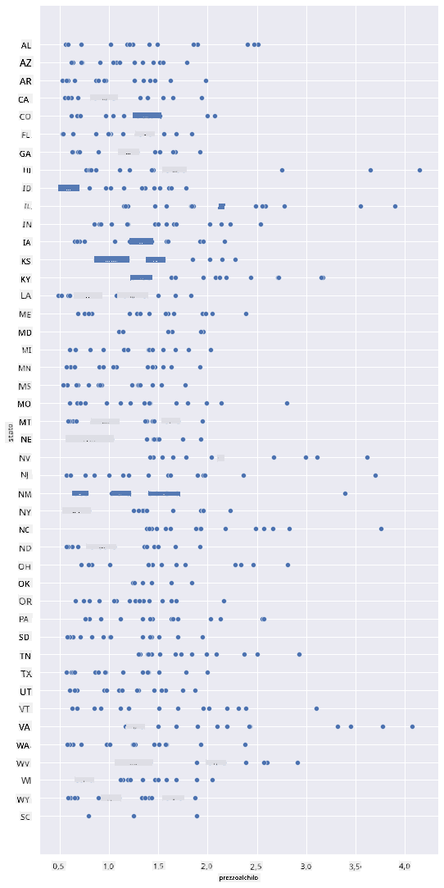
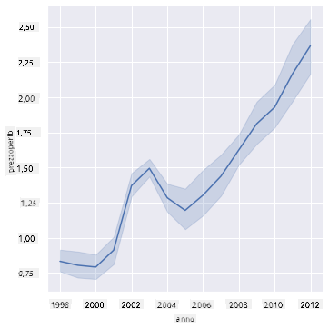
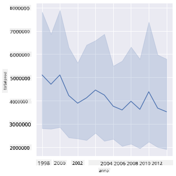
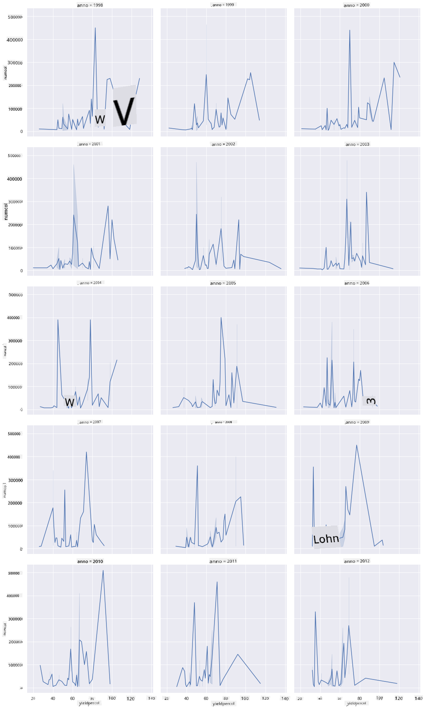
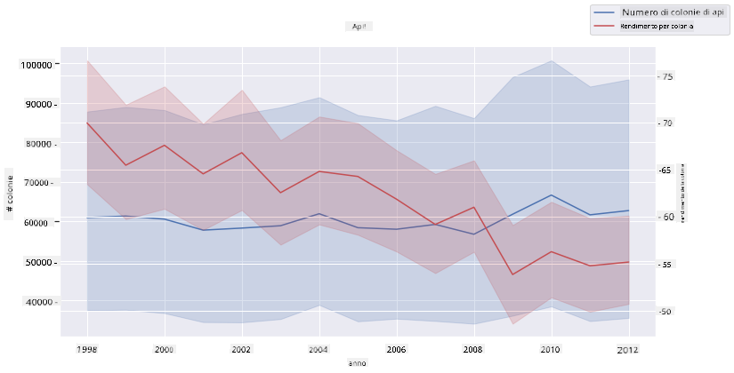

<!--
CO_OP_TRANSLATOR_METADATA:
{
  "original_hash": "cad419b574d5c35eaa417e9abfdcb0c8",
  "translation_date": "2025-08-28T11:15:22+00:00",
  "source_file": "3-Data-Visualization/12-visualization-relationships/README.md",
  "language_code": "it"
}
-->
# Visualizzare le Relazioni: Tutto sul Miele 🍯

| ](../../sketchnotes/12-Visualizing-Relationships.png)|
|:---:|
|Visualizzare le Relazioni - _Sketchnote di [@nitya](https://twitter.com/nitya)_ |

Continuando con il focus sulla natura della nostra ricerca, scopriamo visualizzazioni interessanti per mostrare le relazioni tra i vari tipi di miele, secondo un dataset derivato dal [Dipartimento dell'Agricoltura degli Stati Uniti](https://www.nass.usda.gov/About_NASS/index.php).

Questo dataset di circa 600 elementi mostra la produzione di miele in molti stati americani. Ad esempio, puoi osservare il numero di colonie, la resa per colonia, la produzione totale, le scorte, il prezzo per libbra e il valore del miele prodotto in un determinato stato dal 1998 al 2012, con una riga per anno per ogni stato.

Sarà interessante visualizzare la relazione tra la produzione annuale di un determinato stato e, ad esempio, il prezzo del miele in quello stato. In alternativa, potresti visualizzare la relazione tra la resa di miele per colonia nei vari stati. Questo intervallo di anni copre il devastante 'CCD' o 'Colony Collapse Disorder', osservato per la prima volta nel 2006 (http://npic.orst.edu/envir/ccd.html), rendendo questo dataset particolarmente significativo da studiare. 🐝

## [Quiz pre-lezione](https://purple-hill-04aebfb03.1.azurestaticapps.net/quiz/22)

In questa lezione, puoi utilizzare Seaborn, che hai già usato in precedenza, come una buona libreria per visualizzare le relazioni tra variabili. Particolarmente interessante è l'uso della funzione `relplot` di Seaborn, che consente di creare scatter plot e line plot per visualizzare rapidamente le '[relazioni statistiche](https://seaborn.pydata.org/tutorial/relational.html?highlight=relationships)', permettendo al data scientist di comprendere meglio come le variabili si relazionano tra loro.

## Scatterplot

Usa uno scatterplot per mostrare come il prezzo del miele si è evoluto anno dopo anno, per stato. Seaborn, utilizzando `relplot`, raggruppa comodamente i dati per stato e visualizza i punti dati sia per dati categorici che numerici.

Iniziamo importando i dati e Seaborn:

```python
import pandas as pd
import matplotlib.pyplot as plt
import seaborn as sns
honey = pd.read_csv('../../data/honey.csv')
honey.head()
```
Noterai che i dati sul miele contengono diverse colonne interessanti, tra cui anno e prezzo per libbra. Esploriamo questi dati, raggruppati per stato americano:

| stato | numcol | yieldpercol | totalprod | stocks   | priceperlb | prodvalue | anno |
| ----- | ------ | ----------- | --------- | -------- | ---------- | --------- | ---- |
| AL    | 16000  | 71          | 1136000   | 159000   | 0.72       | 818000    | 1998 |
| AZ    | 55000  | 60          | 3300000   | 1485000  | 0.64       | 2112000   | 1998 |
| AR    | 53000  | 65          | 3445000   | 1688000  | 0.59       | 2033000   | 1998 |
| CA    | 450000 | 83          | 37350000  | 12326000 | 0.62       | 23157000  | 1998 |
| CO    | 27000  | 72          | 1944000   | 1594000  | 0.7        | 1361000   | 1998 |

Crea uno scatterplot di base per mostrare la relazione tra il prezzo per libbra del miele e il suo stato di origine negli Stati Uniti. Fai in modo che l'asse `y` sia abbastanza alto da visualizzare tutti gli stati:

```python
sns.relplot(x="priceperlb", y="state", data=honey, height=15, aspect=.5);
```


Ora, mostra gli stessi dati con una palette di colori che richiama il miele per evidenziare come il prezzo evolve nel corso degli anni. Puoi farlo aggiungendo un parametro 'hue' per mostrare il cambiamento anno dopo anno:

> ✅ Scopri di più sulle [palette di colori che puoi usare in Seaborn](https://seaborn.pydata.org/tutorial/color_palettes.html) - prova una bellissima palette arcobaleno!

```python
sns.relplot(x="priceperlb", y="state", hue="year", palette="YlOrBr", data=honey, height=15, aspect=.5);
```


Con questo cambiamento di colori, puoi vedere chiaramente una forte progressione nel corso degli anni in termini di prezzo del miele per libbra. Infatti, se guardi un campione di dati per verificare (scegli un determinato stato, ad esempio l'Arizona), puoi osservare un pattern di aumento del prezzo anno dopo anno, con poche eccezioni:

| stato | numcol | yieldpercol | totalprod | stocks  | priceperlb | prodvalue | anno |
| ----- | ------ | ----------- | --------- | ------- | ---------- | --------- | ---- |
| AZ    | 55000  | 60          | 3300000   | 1485000 | 0.64       | 2112000   | 1998 |
| AZ    | 52000  | 62          | 3224000   | 1548000 | 0.62       | 1999000   | 1999 |
| AZ    | 40000  | 59          | 2360000   | 1322000 | 0.73       | 1723000   | 2000 |
| AZ    | 43000  | 59          | 2537000   | 1142000 | 0.72       | 1827000   | 2001 |
| AZ    | 38000  | 63          | 2394000   | 1197000 | 1.08       | 2586000   | 2002 |
| AZ    | 35000  | 72          | 2520000   | 983000  | 1.34       | 3377000   | 2003 |
| AZ    | 32000  | 55          | 1760000   | 774000  | 1.11       | 1954000   | 2004 |
| AZ    | 36000  | 50          | 1800000   | 720000  | 1.04       | 1872000   | 2005 |
| AZ    | 30000  | 65          | 1950000   | 839000  | 0.91       | 1775000   | 2006 |
| AZ    | 30000  | 64          | 1920000   | 902000  | 1.26       | 2419000   | 2007 |
| AZ    | 25000  | 64          | 1600000   | 336000  | 1.26       | 2016000   | 2008 |
| AZ    | 20000  | 52          | 1040000   | 562000  | 1.45       | 1508000   | 2009 |
| AZ    | 24000  | 77          | 1848000   | 665000  | 1.52       | 2809000   | 2010 |
| AZ    | 23000  | 53          | 1219000   | 427000  | 1.55       | 1889000   | 2011 |
| AZ    | 22000  | 46          | 1012000   | 253000  | 1.79       | 1811000   | 2012 |

Un altro modo per visualizzare questa progressione è utilizzare la dimensione, anziché il colore. Per gli utenti daltonici, questa potrebbe essere un'opzione migliore. Modifica la tua visualizzazione per mostrare un aumento del prezzo attraverso un aumento della circonferenza dei punti:

```python
sns.relplot(x="priceperlb", y="state", size="year", data=honey, height=15, aspect=.5);
```
Puoi vedere la dimensione dei punti aumentare gradualmente.


È un semplice caso di domanda e offerta? A causa di fattori come il cambiamento climatico e il collasso delle colonie, c'è meno miele disponibile per l'acquisto anno dopo anno, e quindi il prezzo aumenta?

Per scoprire una correlazione tra alcune delle variabili in questo dataset, esploriamo alcuni grafici a linee.

## Grafici a linee

Domanda: C'è un chiaro aumento del prezzo del miele per libbra anno dopo anno? Puoi scoprirlo facilmente creando un singolo grafico a linee:

```python
sns.relplot(x="year", y="priceperlb", kind="line", data=honey);
```
Risposta: Sì, con alcune eccezioni intorno all'anno 2003:



✅ Poiché Seaborn aggrega i dati attorno a una linea, visualizza "le misurazioni multiple per ogni valore x tracciando la media e l'intervallo di confidenza al 95% attorno alla media". [Fonte](https://seaborn.pydata.org/tutorial/relational.html). Questo comportamento dispendioso in termini di tempo può essere disabilitato aggiungendo `ci=None`.

Domanda: Bene, nel 2003 possiamo anche vedere un picco nella fornitura di miele? E se guardassi la produzione totale anno dopo anno?

```python
sns.relplot(x="year", y="totalprod", kind="line", data=honey);
```



Risposta: Non proprio. Se guardi la produzione totale, sembra che sia effettivamente aumentata in quell'anno particolare, anche se, in generale, la quantità di miele prodotta è in calo durante questi anni.

Domanda: In tal caso, cosa potrebbe aver causato quel picco nel prezzo del miele intorno al 2003?

Per scoprirlo, puoi esplorare una griglia di faccette.

## Griglie di faccette

Le griglie di faccette prendono una faccetta del tuo dataset (nel nostro caso, puoi scegliere 'anno' per evitare di produrre troppe faccette). Seaborn può quindi creare un grafico per ciascuna di queste faccette delle coordinate x e y scelte per un confronto visivo più semplice. Il 2003 si distingue in questo tipo di confronto?

Crea una griglia di faccette continuando a utilizzare `relplot` come raccomandato dalla [documentazione di Seaborn](https://seaborn.pydata.org/generated/seaborn.FacetGrid.html?highlight=facetgrid#seaborn.FacetGrid).

```python
sns.relplot(
    data=honey, 
    x="yieldpercol", y="numcol",
    col="year", 
    col_wrap=3,
    kind="line"
```
In questa visualizzazione, puoi confrontare la resa per colonia e il numero di colonie anno dopo anno, fianco a fianco con un wrap impostato a 3 per le colonne:



Per questo dataset, nulla si distingue particolarmente riguardo al numero di colonie e alla loro resa, anno dopo anno e stato per stato. C'è un modo diverso per cercare di trovare una correlazione tra queste due variabili?

## Grafici a doppia linea

Prova un grafico multilinea sovrapponendo due grafici a linee uno sopra l'altro, utilizzando il metodo 'despine' di Seaborn per rimuovere le spine superiore e destra, e utilizzando `ax.twinx` [derivato da Matplotlib](https://matplotlib.org/stable/api/_as_gen/matplotlib.axes.Axes.twinx.html). Twinx consente a un grafico di condividere l'asse x e visualizzare due assi y. Quindi, visualizza la resa per colonia e il numero di colonie, sovrapposti:

```python
fig, ax = plt.subplots(figsize=(12,6))
lineplot = sns.lineplot(x=honey['year'], y=honey['numcol'], data=honey, 
                        label = 'Number of bee colonies', legend=False)
sns.despine()
plt.ylabel('# colonies')
plt.title('Honey Production Year over Year');

ax2 = ax.twinx()
lineplot2 = sns.lineplot(x=honey['year'], y=honey['yieldpercol'], ax=ax2, color="r", 
                         label ='Yield per colony', legend=False) 
sns.despine(right=False)
plt.ylabel('colony yield')
ax.figure.legend();
```


Sebbene nulla salti all'occhio intorno all'anno 2003, questo ci permette di concludere la lezione con una nota un po' più positiva: mentre il numero di colonie è complessivamente in calo, il numero di colonie si sta stabilizzando anche se la loro resa per colonia è in diminuzione.

Forza, api, forza!

🐝❤️
## 🚀 Sfida

In questa lezione, hai imparato un po' di più su altri usi degli scatterplot e delle griglie a linee, incluse le griglie di faccette. Sfida te stesso a creare una griglia di faccette utilizzando un dataset diverso, magari uno che hai usato prima di queste lezioni. Nota quanto tempo impiegano per essere create e quanto devi essere attento al numero di griglie che devi disegnare utilizzando queste tecniche.
## [Quiz post-lezione](https://purple-hill-04aebfb03.1.azurestaticapps.net/quiz/23)

## Revisione & Studio Autonomo

I grafici a linee possono essere semplici o piuttosto complessi. Leggi un po' la [documentazione di Seaborn](https://seaborn.pydata.org/generated/seaborn.lineplot.html) sui vari modi in cui puoi costruirli. Prova a migliorare i grafici a linee che hai costruito in questa lezione con altri metodi elencati nella documentazione.
## Compito

[Immergiti nell'alveare](assignment.md)

---

**Disclaimer**:  
Questo documento è stato tradotto utilizzando il servizio di traduzione automatica [Co-op Translator](https://github.com/Azure/co-op-translator). Sebbene ci impegniamo per garantire l'accuratezza, si prega di notare che le traduzioni automatiche potrebbero contenere errori o imprecisioni. Il documento originale nella sua lingua nativa dovrebbe essere considerato la fonte autorevole. Per informazioni critiche, si consiglia una traduzione professionale eseguita da un traduttore umano. Non siamo responsabili per eventuali fraintendimenti o interpretazioni errate derivanti dall'uso di questa traduzione.